# Neural Networks and Deep Learning
Analyze the major trends driving the rise of deep learning, and give examples of where and how it is applied today.

**Learning Objectives**
- Discuss the major trends driving the rise of deep learning.
- Explain how deep learning is applied to supervised learning
- List the major categories of models (CNNs, RNNs, etc.), and when they should be applied
- Assess appropriate use cases for deep learning

- [Neural Networks and Deep Learning](#neural-networks-and-deep-learning)
  - [Week 1: Introduction to Deep Learning](#week-1-introduction-to-deep-learning)
    - [Welcome](#welcome)
    - [What is a Neural Network?](#what-is-a-neural-network)
    - [Supervised Learning with Neural Networks](#supervised-learning-with-neural-networks)
    - [Why is Deep Learning taking off?](#why-is-deep-learning-taking-off)

## Week 1: Introduction to Deep Learning
### Welcome
* AI is the new Electricity.
* AI will bring about an equally big transformation as Electricity did.

What you'll learn:
1. Neural Networks and Deep Learning
* You will learn about the foundations of neural networks and deep learning.
* You will learn about how to build a neural network, including a deep neural network and how to train it on data.
* At the end of this course, you will be able to build a deep neural network to recognize Cats.

2. Improving Deep Neural Networks: Hyperparameter tuning. Regularization and Optimization.
* You will learn about the practical aspects of deep learning (Yu have a neural network, how to get it to perform well.)
* You will learn about hyperparameter tuning, regularization, how to diagnose bias, and variants, and advance optimization algorithms, like momentum, armrest, prop, and the ad authorization algorithm.

3. Structuring your Machine Learning projects.
* Best practices for spliting data into train, development or dev, also called holdout cross-validation sets, and test sets.
* End-to-end deep learning

4. Convolutional Neural Networks (CNN)
* You will learn how to build CNN models

5. Natural Language Processing: Building sequence models
* You will learn sequence models and how to apply them to natural language processing and other problems. 
* Sequence models includes models like recurrent neural networks, abbreviated RNNs, and LSTM models (long short term memory models).

### What is a Neural Network?
The term Deep Learning refers to training Neural Networks.

Start with a Housing Price Prediction example. Let's say you have a data set with six houses, so you know the size of the houses in square feet or square meters and you know the price of the house and you want to fit a function to predict the price of a house as a function of its size.

Since housing price can never be negative. So we can fit a line as below to the data

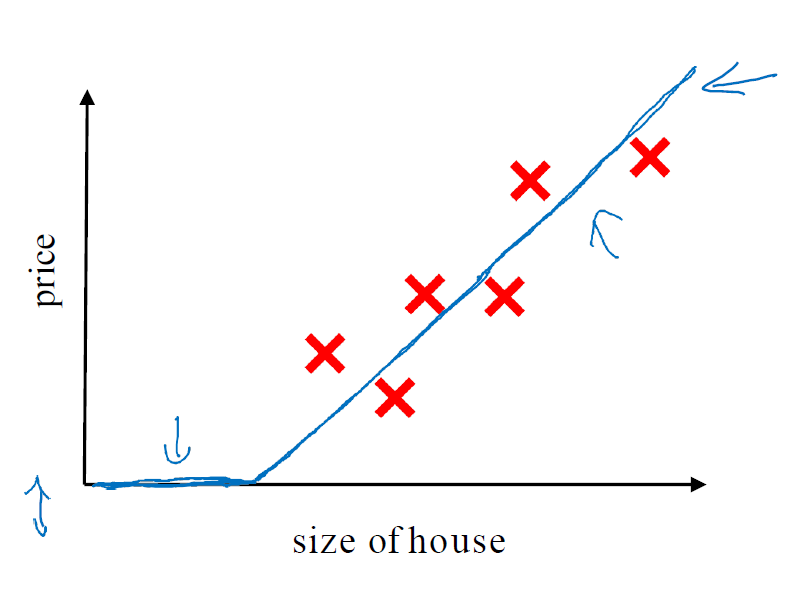

So the line is the function for predicting the price of the house as a function of its size.

-> The function to fit to housing prices is a very simple neural network.

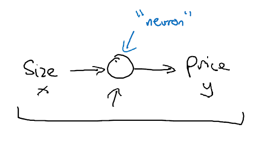

The little circle is a single neuron in a neural network. The neuron inputs the size, computes the linear function, takes a max of zero, and then outputs the estimated price.

The function of the line is called ReLU function (rectified linear units).

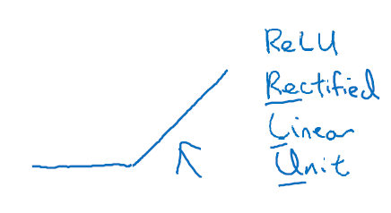

Rectify means taking a max of 0.

A larger neural network is formed by taking many of the single neurons and stacking them together.

Let's add more features to the house.

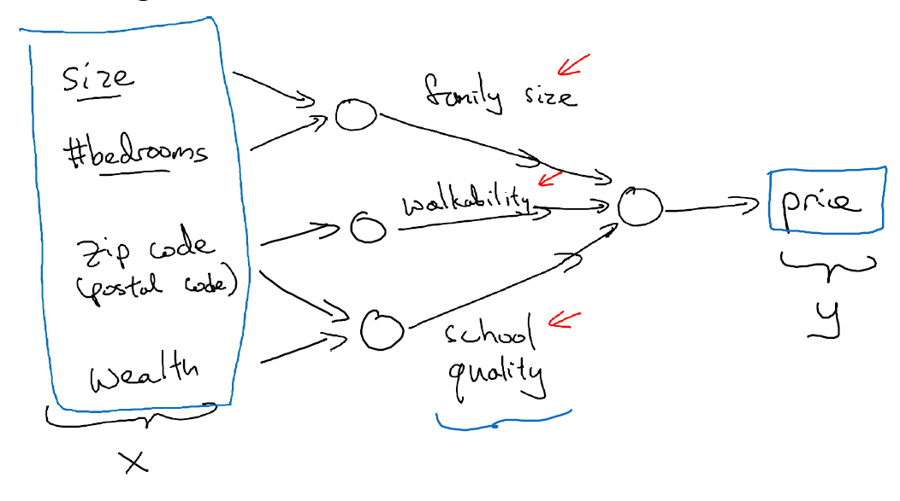

Each of the little circles in the drawing can be one of the ReLU or some slightly non linear function.

So that based on the size and number of bedrooms, you can estimate the family size, their zip code, based on walkability, based on zip code and wealth can estimate the school quality. And then finally you might think that well the way people decide how much they're willing to pay for a house, is they look at the things that really matter to them. In this case family size, walkability, and school quality and that helps you predict the price. 

So in this example, `x` is all of the 4 inputs and `y` is the price that you are trying to predict.

By stacking a few of the single neurons together, we have a slightly larger neural network.

How you manage neural network is that when you implement it, you need to give it just the input x and the output y for a number of examples in your training set and all these things in the middle, they will figure out by itself. 

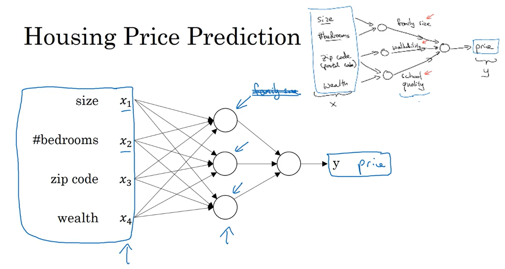

So what you actually implement is this. Where, here, you have a neural network with four inputs. Given the input features might be the size, number of bedrooms, the zip code or postal code, and the wealth of the neighborhood, the job of the neural network will be to predict the price `y`.

And notice also that each of these circles, these are called hidden units in the neural network, that each of them takes its inputs all four input features. 

So for example, rather than saying this first node represents family size and family size depends only on the features X1 and X2. Instead, we're going to say, well neural network, you decide whatever you want this node to be. And we'll give you all 4 input features to compute whatever you want.

First layer: input layer
Second layer: hidden layer

Given enough data about `x` and `y`, given enough training examples with both `x` and `y`, neural networks are good at figuring out functiosn at accurately map from `x` to `y`.

Neural networks aare useful in supervised learning, meaning taking an input `x` and map it to some output `y`.

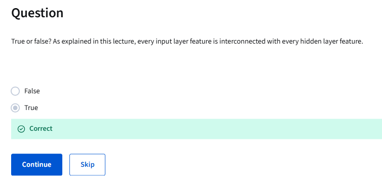

### Supervised Learning with Neural Networks
Almost all the economic value created by neural networks has been through one type of machine learning, called supervised learning.

Supervised learning means you have some input `x` and you want to learn a function mapping to some output `y`.

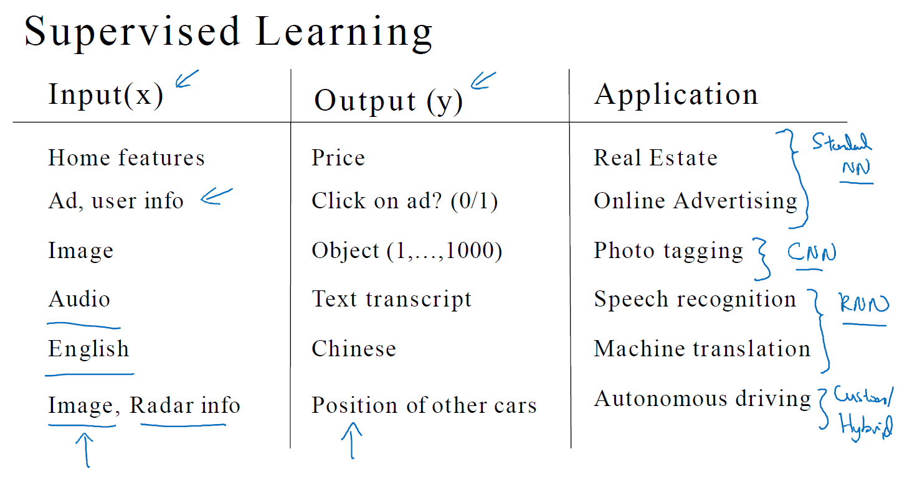

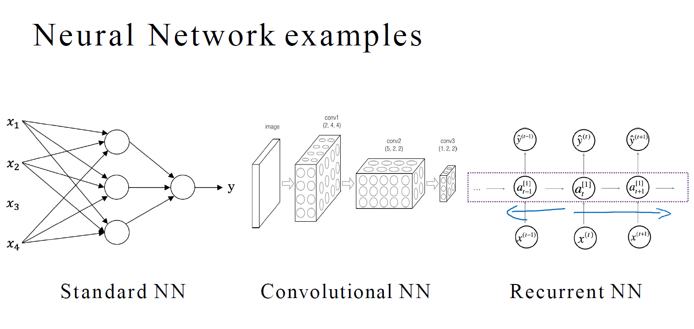

Convolutional Neural Networks (CNN) are often used for image data.

Recurrent neural networks (RNN) are very good for one-dimensional sequence data that has a temporal component. For example, audio has a temporal component. Audio is played out over time, so audio is most naturally represented as a one-dimensional time series or as a one-dimensional temporal sequence. For sequence data, you often use an RNN, a recurrent neural network. Language, English and Chinese, the alphabets or the words come one at a time. So language is also most naturally represented as sequence data. 

You might also have heard about applications of machine learning to both Structured Data and Unstructured Data. Here's what the terms mean. 

Structured Data means databases of data,  meaning that each of the features, such as size of the house, the number of bedrooms, or the age of a user, has a very well defined meaning.

Unstructured data refers to things like audio, raw audio, or images where you might want to recognize what's in the image or text. Here the features might be the pixel values in an image or the individual words in a piece of text. Historically, it has been much harder for computers to make sense of unstructured data compared to structured data. 

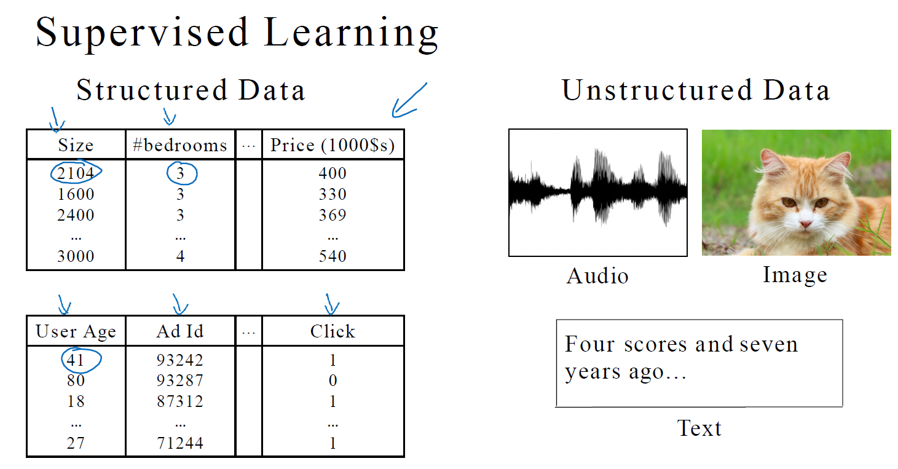

### Why is Deep Learning taking off?
Let's say we plot a figure where on the horizontal axis we plot the amount of data we have for a task and let's say on the vertical axis we plot the performance on involved learning algorithms such as the accuracy of our spam classifier or our ad click predictor or the accuracy of our neural net for figuring out the position of other cars for our self-driving car. 

It turns out if you plot the performance of a traditional learning algorithm like support vector machine or logistic regression as a function of the amount of data you have you might get a curve that looks like red line in the photo where the performance improves for a while as you add more data but after a while the performance you know pretty much plateaus.

They didn't know what to do with huge amounts of data.

What happened in our society over the last 10 years maybe is that for a lot of problems we went from having a relatively small amount of data to having you know often a fairly large amount of data and all of this was thanks to the digitization of a society where so much human activity is now in the digital realm we spend so much time on the computers on websites on mobile apps and activities on digital devices creates data and thanks to the rise of inexpensive cameras built into our cell phones, accelerometers, all sorts of sensors in the Internet of Things. We also just have been collecting one more and more data. 

So over the last 20 years for a lot of applications we just accumulate a lot more data more than traditional learning algorithms were able to effectively take advantage of and what new network lead turns out that if you train a small neural net then this performance maybe looks like the yellow line.

If you train a somewhat larger Internet that's called as a medium-sized internet, the performance is a little bit better like the blue line.

If you train a very large neural net, then its performance just keeps getting better and better.

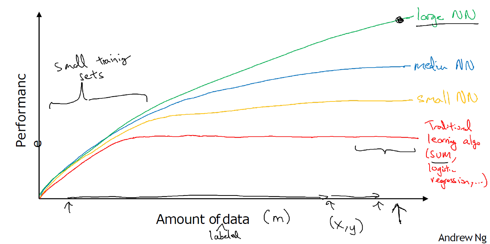

To archive a very high level of performance:
1. You need to be able to train a big enough neural network in order to take advantage of the huge amount of data.
2. You need a lot of data

So we often say that scale has been driving deep learning progress and by scale we mean both the size of the neural network, meaning just a new network, a lot of hidden units, a lot of parameters, a lot of connections, as well as the scale of the data.

In the region to the left of the figure, the relative ordering between the algorithms is not that well defined and performance depends much more on your skill at hand engineering features and other mobile details of the algorithms.

There's only in this some big data regime in the right, we more consistently see large neural networks dominating other approaches.

In the early days in their modern rise of deep learning, it was scaled data and scale of computation just our ability to train very large neural networks either on a CPU or GPU that enabled us to make a lot of progress. 

But increasingly, especially in the last several years, we've seen tremendous algorithmic innovation as well so I also don't want to understate that. 

Algorithmic innovation makes neural networks run much faster, i.e., changing from sigmoid function to ReLU function. It turns out that one of the problems of using sigmoid functions and machine learning is that there are these regions where the slope of the function, where the gradient is nearly zero and so learning becomes really slow, because when you implement gradient descent and gradient is zero the parameters just change very slowly, so learning is very slow. Whereas by changing the what's called the activation function the neural network to use this function called the value function of the rectified linear unit, or RELU, the gradient is equal to 1 for all positive values of input. The gradient is much less likely to gradually shrink to 0 and the gradient, the slope of the line, is 0 on the left but it turns out that just by switching from the sigmoid function to the RELU function has made an algorithm called gradient descent work much faster. This is an example of maybe relatively simple algorithmic innovation.

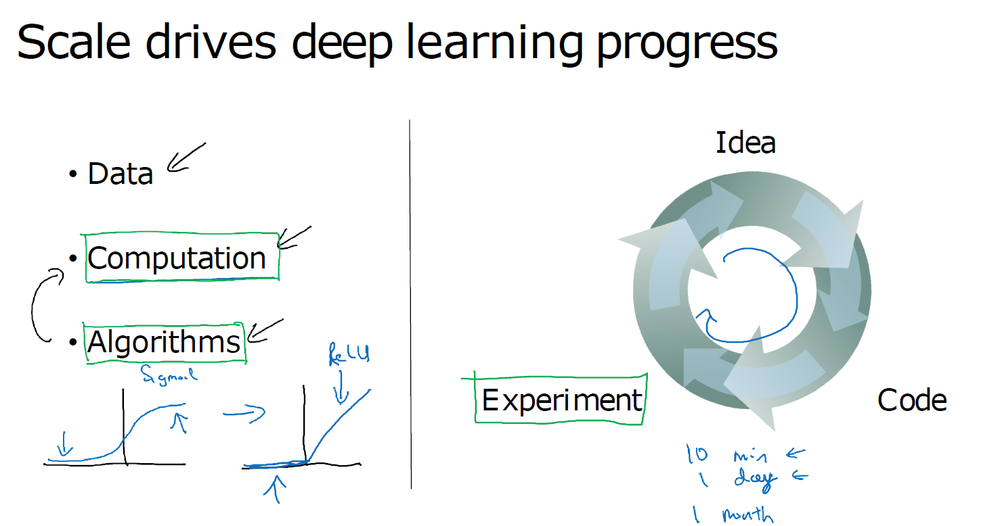

Implementing your idea then lets you run an experiment which tells you how well your neural network does and then by looking at it you go back to change the details of your new network and then you go around this circle over and over and when your new network takes a long time to train it just takes a long time to go around this cycle and there's a huge difference in your productivity.

So faster computation has really helped in terms of speeding up the rate at which you can get an experimental result back and this has really helped both practitioners of neural networks as well as researchers working and deep learning iterate much faster and improve your ideas much faster.

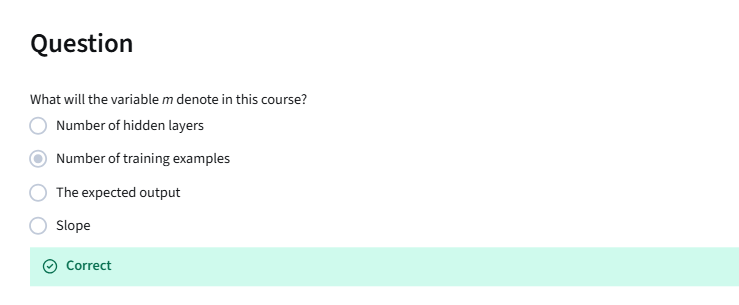

