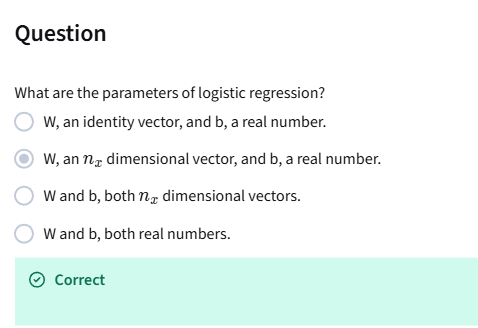
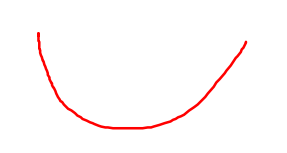
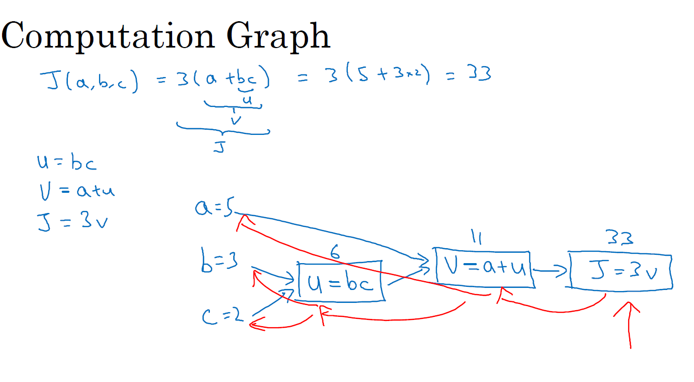

# Neural Networks Basics
Set up a machine learning problem with a neural network mindset and use vectorization to speed up your models.

**Learning Objectives**
- Build a logistic regression model structured as a shallow neural network
- Build the general architecture of a learning algorithm, including parameter initialization, cost function and gradient calculation, and optimization implemetation (gradient descent)
- Implement computationally efficient and highly vectorized versions of models
- Compute derivatives for logistic regression, using a backpropagation mindset
- Use Numpy functions and Numpy matrix/vector operations
- Work with iPython Notebooks
- Implement vectorization across multiple training examples
- Explain the concept of broadcasting

- [Neural Networks Basics](#neural-networks-basics)
  - [Binary Classification](#binary-classification)
    - [Notation](#notation)
  - [Logistic Regression](#logistic-regression)
  - [Logistic Regression Cost Function](#logistic-regression-cost-function)
  - [Gradient Descent](#gradient-descent)
  - [Derivatives](#derivatives)
    - [Intuition about derivatives](#intuition-about-derivatives)
  - [More Derivative Examples](#more-derivative-examples)
  - [Computation Graph](#computation-graph)
  - [Derivatives with a Computation Graph](#derivatives-with-a-computation-graph)
  - [Logistic Regression Gradient Descent](#logistic-regression-gradient-descent)
  - [Gradient Descent on m Examples](#gradient-descent-on-m-examples)
  - [Vectorization](#vectorization)
  - [More Vectorization Examples](#more-vectorization-examples)
  - [Vectorizing Logistic Regression](#vectorizing-logistic-regression)
  - [Vectorizing Logistic Regression's Gradient Output](#vectorizing-logistic-regressions-gradient-output)
    - [Forward Propagation (Making Predictions)](#forward-propagation-making-predictions)
    - [Backward Propagation (Learning / Updating Weights)](#backward-propagation-learning--updating-weights)
    - [Summary Table](#summary-table)
    - [Intuition](#intuition)
  - [Broadcasting in Python](#broadcasting-in-python)
    - [General Principle](#general-principle)
  - [A Note on Python/Numpy Vectors](#a-note-on-pythonnumpy-vectors)
  - [Explanation of Logistic Regression Cost Function (Optional)](#explanation-of-logistic-regression-cost-function-optional)
    - [Cost on m examples](#cost-on-m-examples)


## Binary Classification
Logistic regression is an algorithm for binary classification.

Example of binary classification: input an image and want to output a label to recognize this image as either being a cat (output 1) or not cat (output 0). Use `y` to denote output label.

The computer stores an image by using 3 separate matrices corresponding to the red, green and blue color channels of this image.

Image 64x62 pixels -> 364x64 matrices RGB

Define a feature vector `x` corresponding to the image.

_You have a picture of a cat. To help a computer recognize this cat, we need to break down the image into numbers that represent its features, such as colors, shapes, and textures. These numbers are organized into a list, which we call a feature vector._

Total dimension of vector `x` is 

$64*64*3 = 12288$

Use $n = n_x = 12288$ to represent the dimension of input feature `x`.

In binary classification, the goal is to learn a classifier that can input an image represented by this feature vector x, then predict whether the corresponding label `y` is 1 or 0. 


### Notation
Training example is represented by a pare `(x,y)`, where `x` is an x-dimensional feature vector and `y` is the label, either 0 or 1.

Training set will comprise `m` training examples: 
$(x^{(1)},y^{(1)}), (x^{(2)},y^{(2)})...(x^{(m)},y^{(m)})$

To emphasize this is a number of training example, we use $M=M_{train}$

Test set: $M_{test}$ test examples

To output all of the training examples into a more compact notation, we define a matrix, capital `X`. This matrix `X` has `m` columns (where `m` is the number of training examples), and the number of row is $n_X$


$X \in {\mathbb{R}}^{n * m}$

In Python, find a shape of a matrix

```python
X.shape = (n, m)
```

For output label `Y`, we stack `Y` in columns

$Y=[y^{(1)} y^{(2)} ... y^{(m)}]$

$Y \in {\mathbb{R}}^{1 * m}$

```python
Y.shape = (1,m)
```

_Logistic regression is a statistical method used to predict the outcome of a binary classification problem, which means it helps us decide between two possible outcomes. For example, imagine you want to determine whether an email is spam (1) or not spam (0). Logistic regression takes various features of the email, such as the presence of certain words or the length of the message, and combines them to produce a probability score. This score tells us how likely it is that the email belongs to one of the two categories._

_To visualize this, think of logistic regression as a seesaw. On one side, you have all the features of the email, and on the other side, you have the two outcomes: spam and not spam. The logistic regression model calculates a balance point (the probability) that helps us decide which side the seesaw tips towards. If the probability is above a certain threshold (like 0.5), we classify the email as spam; if it's below, we classify it as not spam. This way, logistic regression provides a clear and interpretable method for making predictions based on input data._


## Logistic Regression

This is a learning algorithm that you use when the output labels `y in a supervised learning problem are all either 0 or 1, so for binary classification problems.

Given an input feature vector `x`, you want an algorithm that can output a prediction, which is $\hat{y}$, which is your estimate of Y. So you want $\hat{y}$ to be the probability of the chance that, `y` is equal to 1 given the input features `x`. I.e. if x is a picture, you want $\hat{y}$ to tell you, what is the chance that this is a cat picture ?

Given `x`, wnat $\hat{y} = P(y=1|x)$

`x` is an $n_x$ dimensional vector $x \in {\mathbb{R}}^{n_x}$, given that the parameters of logistic regression will be `w` which is also an $n_x$ dimensional vector $w \in {\mathbb{R}}^{n_x}$, together with `b` which is just a real number $b \in {\mathbb{R}}$.

Output $\hat{y} = \sigma(w^T*x+b)$, denote $z=w^T*x+b$


Sigmoid function: $\sigma(z) = 1/(1+e^{-z})$


* If `z` is very large, then `e` to the negative `z` will be close to 0. So then sigmoid of `z` will be approximately 1 over 1 plus something very close to 0, because `e` to the negative of very large number will be close to 0. So this is close to 1.
* If `z` is very small, or it's a very large negative number, then signoid of `z` becomes 1 over 1 plus `e` to the negative `z`, and this becomes a huge number. So this becomes, think of it as 1 over 1 plus a number that is very, very big, and so, that's close to 0. 


So when you implement logistic regression, your job is to try to learn parameters `w` and `b` so that $\hat{y}$ becomes a good estimate of the chance of `y` being equal to 1. 

When we program neural networks, we usually keep the parameter `w` and `b` separate.



## Logistic Regression Cost Function
To train the parameters `w` and `b` of the logistic regression model, you need to define a cost function.

$\hat{y} = \sigma(w^T*x+b)$

denote $z=w^T*x+b$

$\sigma(z) = {1 \over (1+e^{-z})}$

Given a training set of `m` training examples $(x^{(1)},y^{(1)}), (x^{(2)},y^{(2)})...(x^{(m)},y^{(m)})$, we want to find parameters `w` and `b` so that at least on the training set, the outputs you have, the predictions you have on the training set ${\hat{y}}^{(i)} \approx y^{(i)}$.

And of course for each training example, we're using these superscripts with round brackets with parentheses to index into different train examples.

Prediction on the training example `i` (i-th training example)

$\hat{y}^{(i)} = \sigma(w^T*x^{(i)}+b)$

denote $z^{(i)}=w^T*x^{(i)}+b$

$\sigma(z) = {1 \over (1+e^{-z^{(i)}})}$

**Loss function** is a way to measure how well your model is performing. (difference between a predicted label and a true label) (how good our output $\hat{y}$ is when the true label is y)

$\ell(\hat{y}, y) = {{1} \over {2}} {(\hat{y} - y)}^2$

In logistic regression, people don't usually do this because when you come to learn the parameters, you find that the optimization problem becomes non-convex, which is optimization problem with multiple local optima. So gradient descent may not find a global optimum (squared error seems like it might be a reasonable choice except that it makes gradient descent not work well). So in logistic regression, we define another loss function that plays a similar role as squared error but will give us an optimization problem that is convex. 


**Loss function for logistic regression.**

$\ell(\hat{y}, y) = -(ylog(\hat{y}) + (1-y)log(1-\hat{y}))$

* If y=1: then $\ell(\hat{y}, y) = - log(\hat{y})$, you want $- log(\hat{y})$ to be as small as possible, so you want $log(\hat{y})$ to be as large as possible, that means you want $\hat{y}$ to be large but $\hat{y}$ cannot be bigger than 1.
* If y=0: then $\ell(\hat{y}, y) = - log(1-\hat{y})$, you want $- log(1-\hat{y})$ to be as small as possible, so you want $log(1-\hat{y})$ to be as large as possible, that means you want $1-\hat{y}$ to be large -> $\hat{y}$ to be small, but it cannot smaller than 0.

**The loss function was defined with respect to a single training example. It measures how well you're doing on a single training example.**

**Cost function**: measure how well you are doing in the entire training set.

$J(w, b) =  {1 \over m} \Sigma_{i=1}^m \ell(\hat{y}^{(i)}, y^{(i)})$ 

$\hat{y}^{(i)}$ is of course the prediction output by your logistic regression algorithm using, you know, a particular set of parameters `w` and `b`.

$J(w, b) =  -{1 \over m} \Sigma_{i=1}^m (ylog(\hat{y}) + (1-y)log(1-\hat{y}))$

Loss function is applied to just a single training example. 

The cost function is the cost of your parameters, so in training your logistic regression model, we're going to try to find parameters `w` and `b` that minimize the overall cost function `J`. 


Logistic regression can be viewed as a very, very small neural network.


## Gradient Descent
Recap

$\hat{y} = \sigma(w^T*x+b)$

denote $z=w^T*x+b$

$\sigma(z) = {1 \over (1+e^{-z})}$

$J(w, b) = {1 \over m} \Sigma_{i=1}^m \ell(\hat{y}^{(i)}, y^{(i)}) = -{1 \over m} \Sigma_{i=1}^m (ylog(\hat{y}) + (1-y)log(1-\hat{y}))$

Want to find w, b that minimize J(w,b)


And what we want to do really is to find the value of w and b that corresponds to the minimum of the cost function J. 

It turns out that this particular cost function J is a convex function. 

So it's just a single big bowl, so this is a convex function.



This is as opposed to functions that look like this, which are non convex and has lots of different local optimal.


So the fact that our cost function J of w, b (J(w,b)) as defined here is convex, is one of the huge reasons why we use this particular cost function J for logistic regression.


So to find a good value for the parameters, what we'll do is initialize w and b to some initial value may be denoted by that little red dot. And for logistic regression, almost any initialization method works. Usually you Initialize the values of 0. 

Random initialization also works, but people don't usually do that for logistic regression. But because this function is convex, no matter where you initialize, you should get to the same point or roughly the same point.

And what gradient descent does is it starts at that initial point and then takes a step in the steepest downhill direction. So after one step of gradient descent, you might end up there because it's trying to take a step downhill in the direction of steepest descent or as quickly down as possible. So that's one iteration of gradient descent. And after iterations of gradient descent, you might stop there, three iterations and so on. Until, hopefully, you are converged to the global optimum.


Let's say that there's some function J of w (J(w)) that you want to minimize and maybe that function looks like this to make this easier to draw. I'm going to ignore b for now just to make this one dimensional plot instead of a higher dimensional plot.

Gradient deseng process

Repeate {
    $w := w - \alpha {dJ(w) \over dw}$
}

This is repeated until the algorithm converges.

$\alpha$ here is **learning rate**, and controls how big a step we take on each iteration are gradient descent.

$dJ(w) \over dw$: this quantity here, this is a derivative. This is basically the update of the change you want to make to the parameters `w`.

In code, we use dw to represent this derivative term

$w:= w - \alpha dw$

Remember that derivative is the slope of the function at a point. The slope of the function is the height devided by the width right of the lower triangle.

* When the derivative is positive, you take a step to the left, so the gradient descent makes the algorithm slowly decrease the w parameter.
* When the derivative is negative, you take a step to the left, so the gradient descent makes the algorithm slowly increase the w parameter.


The overall intuition for now is that this term represents the slope of the function and we want to know the slope of the function at the current setting of the parameters so that we can take these steps of steepest descent so that we know what direction to step in in order to go downhill on the cost function J.

In term of cost function J(w,b). updates are as follow

* $w := w - \alpha {dJ(w,b) \over dw}$
* $b := b - \alpha {dJ(w,b) \over db}$


Notation


_I don't think it's super important that you understand calculus but in case you see this, I want to make sure that you don't think too much of this. Which is that in calculus this term here we actually write as follows, that funny squiggle symbol. So this symbol, this is actually just the lower case `d` in a fancy font, in a stylized font. But when you see this expression, all this means is this is the of J of w, b or really the slope of the function J of w, b how much that function slopes in the w direction. And the rule of the notation and calculus, which I think is in total logical. But the rule in the notation for calculus, which I think just makes things much more complicated than you need to be is that if J is a function of two or more variables, then instead of using lower case d. You use this funny symbol._

_This is called a partial derivative symbol, but don't worry about this. And if J is a function of only one variable, then you use lower case d. So the only difference between whether you use this funny partial derivative symbol or lower case d. As we did on top is whether J is a function of two or more variables. In which case use this symbol, the partial derivative symbol or J is only a function of one variable. Then you use lower case d. This is one of those funny rules of notation and calculus that I think just make things more complicated than they need to be._

_But if you see this partial derivative symbol, all it means is you're measuring the slope of the function with respect to one of the variables, and similarly to adhere to the, formally correct mathematical notation calculus because here J has two inputs. Not just one. This thing on the bottom should be written with this partial derivative simple, but it really means the same thing as, almost the same thing as lowercase d. Finally, when you implement this in code, we're going to use the convention that this quantity really the amount I wish you update w will denote as the variable d w in your code. And this quantity, right, the amount by which you want to update b with the note by the variable db in your code._


## Derivatives
### Intuition about derivatives
Given function $f(a)=3a$, take
* a = 2     -> f(a) = 6
* a = 2.001 -> f(a) = 6.003

Derivative of f(a) is slope of f(a), which is $rise \over run$ or $height \over width$, at a=2 is 3.

* a = 5     -> f(a) = 15
* a = 5.001 -> f(a) = 15.003

Slope at a=5 is also 3. We say, $df(a) \over da$ and this just means, the slope of the function `f(a)` when you nudge the variable `a`, a tiny little amount, this is equal to 3.

So ${df(a) \over da} = 3$


_Derivatives are defined with an even smaller value of how much you nudge a to the right. So, it's not 0.001. It's not 0.000001. It's not 0.00000000 and so on 1. It's even smaller than that, and the formal definition of derivative says, **whenever you nudge a to the right by an infinitesimal amount, basically an infinitely tiny, tiny amount. If you do that, this f(a) go up 3 times as much as whatever was the tiny, tiny, tiny amount that you nudged a to the right**._

_So, that's actually the formal definition of a derivative. But for the purposes of our intuitive understanding, which I'll talk about nudging a to the right by this small amount 0.001. Even if it's 0.001 isn't exactly tiny, tiny infinitesimal._

_Now, one property of the derivative is that, no matter where you take the slope of this function, it is equal to 3, whether `a` is equal to 2 or `a` is equal to 5._

_The slope of this function is equal to three, meaning that whatever is the value of `a`, if you increase it by 0.001, the value of f(a) goes up by 3 times as much. So, this function has a safe slope everywhere. One way to see that is that, wherever you draw this little triangle. The height, divided by the width, always has a ratio of 3 to 1._

## More Derivative Examples
Given function $f(a)=a^2$, take
* a = 2     -> f(a) = 4
* a = 2.001 -> f(a) = 4.004

But if we now nudge `a` to 2.001 then f(a) becomes roughly 4.004. So if we draw this little triangle again, what this means is that if we nudge `a` to the right by 0.001, f(a) goes up 4 times as much by 0.004. 

So in the language of calculus, we say that a slope that is the derivative of f(a) at a=2 is 4.

Or to write this out of our calculus notation, we say that ${d \over da} f(a) = 4$ when a=2.

* a = 5     -> f(a) = 25
* a = 5.001 -> f(a) = 25.010

-> ${d \over da} f(a) = 10$ when a=5

So one way to see why did derivatives is different at different points is that if you draw that little triangle right at different locations on this, you'll see that the ratio of the height of the triangle over the width of the triangle is very different at different points on the curve. 

${d \over da} f(a) = {d \over da} a^2 = 2a$

If you ever pull up a calculus textbook and you see this formula, that the derivative of a²=2a, all that means is that for any given value of a, if you nudge upward by 0.001 already your tiny little value, you will expect f(a) to go up by 2a. That is the slope or the derivative times other much you had nudged to the right the value of a.


## Computation Graph
The computations of a neural network are organized in terms of a forward pass or a forward propagation step, in which we compute the output of the neural network, followed by a backward pass or back propagation step, which we use to compute gradients or compute derivatives.

Given function J(a,b,c) = 3(a+bv)

Let u=bc, v=a+u -> J = 3v

The computation graph comes in handy when there is some distinguished or some special output variable, such as J in this case, that you want to optimize. And in the case of a logistic regression, J is of course the cost function that we're trying to minimize. And what we're seeing in this little example is that, through a left-to-right pass, you can compute the value of J and what we'll see in the next couple of slides is that in order to compute derivatives there'll be a right-to-left pass like this, kind of going in the opposite direction as the blue arrows. That would be most natural for computing the derivatives.




## Derivatives with a Computation Graph


Let's say we want to comput $dJ \over dv$

J=3v
* v=11 -> 11.001
* J=33 -> 33.003

The change in J (which is 0.003) divided by the change in v (which is 0.001) gives us the derivative, or dv, which tells us how sensitive J is to changes in v. Since the increase in J is three times the increase in v, we find that dv = 3. 

-> ${dJ \over dv} = 3$

From previous example: f(a)=3a

${df(a) \over da} = {df \over da} = 3$

Terminology of backpropagation, what we're seeing is that if you want to compute the derivative of this final output variable, which usually is a variable you care most about, with respect to v, then we've done one step of backpropagation. So we call it one step backwards in this graph.


$dJ \over da$
* a=5 -> 5.001
* v=11 -> 11.001
* J=33 -> 33.003

And by increase a, you have to take this value of 5 and just plug in a new value. Then the change to a will propagate to the right of the computation graph so that J ends up being 33.003. And so the increase to J is 3 times the increase to a. So that means this derivative is equal to 3. 

-> ${dJ \over dv} = 3$

If you change a, then that will change v. And through changing v, that would change J. And so the net change to the value of J when you bump up the value, when you nudge the value of a up a little bit, is that. First, by changing a, you end up increasing v. Well, how much does v increase? It is increased by an amount that's determined by dv/da. And then the change in v will cause the value of J to also increase. So in calculus, this is actually called the chain rule that if a affects v, affects J, then the amounts that J changes when you nudge a is the product of how much v changes when you nudge a times how much J changes when you nudge v. So in calculus, again, this is called the chain rule.

-> ${dJ \over dv} = 3 = {dJ \over dv}*{dv \over da}$

We saw from this calculation is that if you increase a by 0.001, v changes by the same amount. So dv/da = 1. 

${dJ \over dv}*{dv \over da}=3$


Compute ${dJ \over du}$
* u=6 -> 6.001
* v=11 -> 11.001
* J=33 -> 33.003
${dJ \over du} = 3 = {dJ \over dv} * {dv \over du} = 3*1$

Compute ${dJ \over db}$

${dJ \over db} = {dJ \over du} * {du \over db}$
* b=3 -> 3.001
* u=6 -> 6.002
* J goes up by 0.006 (33.006)
${dJ \over db} = {dJ \over du} * {du \over db} = 3*2=6$

${dJ \over dc} = {dJ \over du} * {du \over dc}= 3*3 = 9$


## Logistic Regression Gradient Descent
Logistic Regression recap

$z = w^T*x+b$

$\hat{y}=a=\sigma(z)$

$\ell(a,y) = -(ylog(a) + (1-y)log(1-a))$

We have 2 features: x1 and x2


## Gradient Descent on m Examples
$J(w, b) =  {1 \over m} \Sigma_{i=1}^m \ell(a^{(i)}, y^{(i)})$ 

Where

$a^{(i)} = \hat{y}^{(i)} = \sigma(z^{(i)}) = \sigma(w^Tx^{(i)}+b)$

${d \over dw_1}J(w, b) = {1 \over m} \Sigma_{i=1}^m {d \over dw_1}\ell(a^{(i)}, y^{(i)})$

In previous lesson, we learned how to compute

${dw_1}^{(i)} = {d \over dw_1}\ell(x^{(i)}, y^{(i)})$

Let J=0, $dw_1=0$, $dw_2=0$, db=0


For i=1 to m:\
    $z^{(i)} = w^Tx^{(i)} + b$ \
    $a^{(i)} = \sigma(z^{(i)})$ \
    $J += y^{(i)}loga^{(i)} + (1-y^{(i)})log(1-a^{(i)})$ \
    $dz^{(i)} = a^{(i)} - y^{(i)}$ \
    $dw_1 += x_1^{(i)}dz^{(i)}$ \
    $dw_2 += x_2^{(i)}dz^{(i)}$ \
    $db += dz^{(i)}$ \
endfor

J /= m \
$dw_1 /= m$ \
$dw_2 /= m$ \
$db /= m$


In the deep learning era, we would move to a bigger and bigger datasets, and so being able to implement your algorithms without using explicit for loops is really important and will help you to scale to much bigger datasets. 

-> Vectorization


## Vectorization
In logistic regression, we need to compute $z = w^T*x+b$ where w and x are column vectors. $x, w \in {\mathbb{R}}^{n_x}$

Vectorieze:
```python
z = np.dot(w,x)+b
```

Example:

```python
import numpy as np

a = np.array([1, 2, 3, 4])
print(a)
# [1 2 3 4]

import time
a = np.random.rand(1000000)
b = np.random.rand(1000000)

tic = time.time()
c = np.dot(a,b)
toc = time.time()

print(c)
print("Vectorized version: " + str(1000*(toc-tic)) +"ms")

c = 0
tic = time.time()
for i in range(1000000):
    c += a[i]*b[i]
toc = time.time()

print(c)
print("For loop: " + str(1000*(toc-tic)) + "ms")
```

In both cases, value of `c` is the same. But the execution time of nonvectorized version takes ~400 times longer than vectorized version.

Both GPU and CPU have parallelization instructions. They're sometimes called SIMD instructions. This stands for a single instruction multiple data. But what this basically means is that, if you use built-in functions such as this np.function or other functions that don't require you explicitly implementing a for loop. It enables Python Numpy to take much better advantage of parallelism to do your computations much faster. And this is true both computations on CPUs and computations on GPUs. It's just that GPUs are remarkably good at these SIMD calculations but CPU is actually also not too bad at that. Maybe just not as good as GPUs. 

**The rule of thumb to remember is whenever possible, avoid using explicit for loops.**


## More Vectorization Examples

**Whenever possiblem avoid explicit for-loop**

We have matrix A, vector u and vector v: u = Av


Say you need to apply the exponential operation on every element of a matrix/vector.


Logistic regression derivatives


## Vectorizing Logistic Regression
Vectorize the implementation of logistic regression, so they can process an entire training set, that is implement a single elevation of grading descent with respect to an entire training set without using even a single explicit for loop.

Forward propagation

If you have m training examples, then to make a prediction on 1st example, we need to compute:

$z^{(1)} = w^T*x^{(1)}+b$

$a^{(1)} = \sigma(z^{(1)})$

Prediction on 2nd example, we need to compute:

$z^{(2)} = w^T*x^{(2)}+b$

$a^{(2)} = \sigma(z^{(2)})$

Prediction on 3rd example, we need to compute:

$z^{(3)} = w^T*x^{(3)}+b$

$a^{(3)} = \sigma(z^{(3)})$

So on, we need to do this m times for m training examples.

We define matrix X $(n_X, m)$ as follow:


We construct a (1xm) matrix, which is a row vector.

$[z^{(1)}, z^{(2)} ... z^{(m)}] = w^T*X + [b b ... b]$

in which [b b ... b] is (1xm) vector, $w^T$ is a row vector.

We have

$[z^{(1)}, z^{(2)} ... z^{(m)}] = [w^T*x^{(1)}+b w^T*x^{(2)}+b ... w^T*x^{(m)}+b]$

which is another (1xm) vector. In which, 1st element is $z^{(1)}$, 2nd element is $z^{(2)}$ and so on.

Define 

$Z = [z^{(1)}, z^{(2)} ... z^{(m)}]$

Numpy command for this is

```python
Z = np.dot(w.T, X) + b
```

In this command, b is a real number of (1x1) matrix, but when you add np.dot(w.T, X) to this real number, Python automatically takes this real number b and expand it out to (1xm) row vector. This is called broadcasting in Python.

$A = [a^{(1)} a^{(2)} ... a^{(m)}] = \sigma(Z)$


## Vectorizing Logistic Regression's Gradient Output
Use vectorization to also perform the gradient computations for all m training samples at the same time.

For gradient computation, we compute:

$dz^{(1)} = a^{(1)} - y^{(1)}$

$dz^{(2)} = a^{(2)} - y^{(2)}$

so on... for all m training examples.

We stack all dz variables horizontally, this is (1xm) matrix or 1 dimensional row vector.

$dZ = [dz^{(1)} dz^{(2)} ... dz^{(m)}]$

From previous lesson, we already figured out how to compute A

$A = [a^{(1)} a^{(2)} ... a^{(m)}]$

We defined

$Y = [y^{(1)} y^{(2)} ... y^{(m)}]$

So

$dZ = A - Y = [a^{(1)}-y^{(1)} a^{(2)}-y^{(2)} ... a^{(m)}-y^{(m)}]$

For loop approach for w:

dw = 0 \
$dw += X^{(1)}dz^{(1)}$ \
$dw += X^{(2)}dz^{(2)}$ \
...
dw /= m

For b

db = 0 \
$db += dz^{(1)}$ \
$db += dz^{(2)}$ \
...
$db += dz^{(m)}$ \
db /= m

$db = {1 \over m} \Sigma_{i=1}^m dz^{(1)}$

```python
db = 1/m * np.sum(dZ)
```

$dw = {1 \over m} X*dz^T$


Implement Logistic Regression

```python
for i in range(1000):
    Z = np.dot(w.T,X) + b
    A = sigmoid(Z)
    dZ = A - Y
    dw = 1/m*X*dZ.T
    db = 1/m*np.sum(dz)

    w=w-alpha*dw
    b=b-alpha*db
```


### Forward Propagation (Making Predictions)

Data flows **left ➜ right**.
```lua
  Input features (X)
          │
          ▼
  ┌───────────────────┐
  │ Linear function   │
  │ Z = WᵀX + b       │
  └───────────────────┘
          │
          ▼
  ┌───────────────────────────┐
  │ Activation (Sigmoid)      │
  │ A = σ(Z) = 1 / (1+e^(-Z)) │
  └───────────────────────────┘
          │
          ▼
  ┌──────────────────────────────────────────┐
  │ Loss function                            │
  │ J = -(1/m) Σ [Y log(A) + (1−Y) log(1−A)] │
  └──────────────────────────────────────────┘
          │
          ▼
  (Output: Cost J)
```

### Backward Propagation (Learning / Updating Weights)

Gradients flow **right ➜ left**.
```
(Output layer error)
▲
│
│ dZ = A − Y (how wrong each prediction is)
│
┌───────────────────┐
│ Compute gradients │
│ dW = (1/m) X dZᵀ  │
│ db = (1/m) Σ dZ   │
└───────────────────┘
▲
│
│ Update parameters
│ W := W − α dW
│ b := b − α db
│
└──────────────────────────────
(new W, b)
```
### Summary Table

| Symbol | Meaning | Formula |
|--------|----------|----------|
| Z | Linear combination | Z = WᵀX + b |
| A | Activation (sigmoid output) | A = σ(Z) |
| J | Cost function | J = −(1/m) Σ [Y log(A) + (1−Y) log(1−A)] |
| dZ | Gradient w.r.t. Z | dZ = A − Y |
| dW | Gradient w.r.t. weights | dW = (1/m) X dZᵀ |
| db | Gradient w.r.t. bias | db = (1/m) Σ dZ |
| α | Learning rate | Controls step size in gradient descent |

| Symbol | Meaning | Description |
|--------|----------|-------------|
| **dZ** | Gradient of loss w.r.t. Z | Measures how wrong the prediction is (`A - Y`) |
| **dW** | Gradient of loss w.r.t. weights | Tells how much each weight contributed to the error |
| **db** | Gradient of loss w.r.t. bias | Average error contribution of the bias |
| **α** | Learning rate | Controls how large the update step is |
| **W, b** | Parameters | Updated in the direction that reduces the loss |

### Intuition
- **dZ (A − Y)** = "How wrong was the prediction?"
- **dW, db** = "How should we adjust the weights and bias to fix that?"
- **Gradient descent** = "Take a small step in the opposite direction of the error."
- **Forward propagation** → “Make a prediction.”
- **Backward propagation** → “Compare to truth, compute error, adjust parameters.”
- Each iteration reduces the cost **J**, bringing predictions closer to correct labels.

Step 1: Forward Propagation — Make Predictions: Measure how far the model’s predictions (A) are from the true labels (Y).
```
Inputs (X)
│
▼
Linear combination:
Z = WᵀX + b
│
▼
Activation (Sigmoid):
A = σ(Z) = 1 / (1 + e^(−Z))
│
▼
Loss function:
J = −(1/m) Σ [ Y log(A) + (1−Y) log(1−A) ]
```
Step 2: Backward Propagation — Compute Derivatives: Find the direction that makes J smaller — this is the **gradient**.
```
Start from the loss J
▲
│
├── dZ = A − Y ← how wrong each prediction is
│
├── dW = (1/m) X dZᵀ ← how much each weight contributed to the error
│
└── db = (1/m) Σ dZ ← average bias error
```
Step 3: Gradient Descent — Update Parameters: Move W and b slightly in the direction that **reduces J**.
```
W := W − α · dW
b := b − α · db
```
Repeat steps 1–3 until J stops decreasing (model converges).

| Step | What Happens | Purpose |
|------|---------------|----------|
| **Forward** | Make predictions | Get A and J |
| **Backward** | Compute gradients | Know how to fix W and b |
| **Update** | Adjust parameters | Reduce J next time |

Each loop makes the model slightly **smarter** by reducing its error.

## Broadcasting in Python
Example

Calories from Carbs, Proteins, Fats in 100g of different foods:


Calculate % of calories of Carb, Protein and Fat. Can you do this without a for-loop?

Set this matrix as a (3x4) matrix A. We're going to sum down the columns, so we get 4 numbers corresponding to the total number of calories in these 4 diffierent types of foods, then use a second line of Python code to divide each of the four columns by their corresponding sum.

```python
import numpy as np

A = np.array([[56.0, 0.0, 4.4, 68.0],
              [1.2,104.0,52.0,8.0],
              [1.8,135.0,99.0,0.8]])

print(A)

# sum matrix A vertically
# horizontal will be axis=1
cal = A.sum(axis=0)
print(cal)
#[59 239 155.4 76.9]

# matrix A is 3x4 matrix
# devide A by 1x4 matrix
# cal is already 1x4 matrix, no need reshape(1,4)
# The reshape command is a constant time. It's a order one operation that's very cheap to call.
percentage = 100*A/cal.reshape(1,4)
print(percentage)
```


### General Principle
(m,n) +-*/ (1,n) -> (m,n)

(m,n) +-*/ (m,1) -> (m,n)

(m,1) +-*/ R (real number) -> copy this real number m times

[1 2 3] + 100 = [101 102 103]


## A Note on Python/Numpy Vectors

```python
import numpy as np

a = np.random.randn(5)

print(a)
print(a.shape) # (5,)
# a is a rank 1 array, it's neither a row vector nor a column vector
# And this leads it to have some slightly non-intuitive effects.

print(a.T) # print same array as a

print(np.dot(a,a.T)) 
# you might think a times a transpose is maybe the outer product should give you matrix maybe, but instead we get back a number.

#I would recommend is that when you're coding new networks, that you just not use data structures where the shape is 5, or n, rank 1 array.

a = np.random.randn(5,1) # column vector
print(a.T) # gives row vector

print(np.dot(a,a.T)) # gives a matrix
```

```python
a = np.random.randn(5)
```
-> a.shape = (5,)
-> rank 1 array
-> do not use

```python
a = np.random.randn(5,1)
```
-> a.shape = (5,1)
-> column vector

```python
a = np.random.randn(1,5)
```
-> a.shape = (1,5)
-> row vector

```python
assert(a.shape == (5,1))
```
Throw in an assertion statement like this, to make sure, in this case, that this is a (5,1) vector. So this is a column vector. 

These assertions are really inexpensive to execute, and they also help to serve as documentation for your code. 

And so takeaways are to simplify your code:
- Don't use rank 1 arrays. 
- Always use either n by one matrices, basically column vectors, or one by n matrices, or basically row vectors. 
- Feel free to toss a lot of insertion statements, so double-check the dimensions of your matrices and arrays.
- And also, don't be shy about calling the reshape operation to make sure that your matrices or your vectors are the dimension that you need it to be. 

## Explanation of Logistic Regression Cost Function (Optional)
In Logistic Regression, we have:

$\hat{y}=\sigma(w^Tx+b)$ where $\sigma(z)={1\over{1+e^{-z}}}$

We want to intepret $\hat{y}=p(y=1|x)$ 

-> we want our algorithm to output $\hat{y}$ as the chance that y=1 for a given set of input features x.

* If y=1: $p(y|x)=\hat{y}$ 
* If y=0: $p(y|x)=1-\hat{y}$ 

$\hat{y}$ was a chance, that y=1, then $1-\hat{y}$ is the chance that y=0.

Summarize the 2 equations above as follow:

$p(y|x)=\hat{y}^y(1-\hat{y})^{1-y}$

Since
* If y=1: $p(y|x)=\hat{y}$
* If y=0: $p(y|x)=1-\hat{y}$

Because the log function is a strictly monotonically increasing function, your maximizing log p(y|x) should give you a similar result as optimizing p(y|x). And if you compute log of p(y|x), that’s equal to log of y hat to the power of y, 1 - y hat to the power of 1 - y.

$log p(y|x) = log \hat{y}^y(1-\hat{y})^{1-y} = ylog \hat{y} + (1-y)log(1-\hat{y})$

-> $log p(y|x) = -\ell(\hat{y},y)$

There's a negative sign there because usually if you're training a learning algorithm, you want to make probabilities large whereas in logistic regression we're expressing this, we want to minimize the loss function. 

When training, we want our model to assign:
- High probability to correct outcomes (e.g., p(y=1|x)=0.99 if it's a cat).
- Low probability to wrong ones
So we want to maximize p(y|x).

Optimization algorithms (like gradient descent) are designed to minimize things — not maximize them.

So instead of maximizing p(y|x), we minimize the negative log of it:

Maximize p(y|x) <=> Minimize -logp(y|x)

That’s where the negative sign comes in!

Example:
```scss
Prediction (p) →    0.01   0.1   0.5   0.9   0.99
-log(p)         →   4.6    2.3   0.69  0.10  0.01
```
The negative log turns large probabilities into small loss values
and small probabilities into large losses.

So minimizing the loss corresponds to maximizing the log of the probability.

### Cost on m examples

$p(labels-in-training-set) = \prod_{i=1}^m p(y^{(i)}|x^{(i)})$

So if you want to carry out maximum likelihood estimation, then you want to find the parameters that maximizes the chance of your observations and training set. But maximizing this is the same as maximizing the log, so we just put logs on both sides. 

$logp(labels-in-training-set) = log\prod_{i=1}^m p(y^{(i)}|x^{(i)})$

So log of the probability of the labels in the training set is equal to, log of a product is the sum of the log. 

$logp(labels-in-training-set) = \Sigma_{i=1}^m logp(y^{(i)}|x^{(i)})$

Since

$logp(y^{(i)}|x^{(i)}) = -\ell(\hat{y},y)$

$logp(labels-in-training-set) = -\Sigma_{i=1}^m \ell(\hat{y},y)$

In statistics, there's a principle called the principle of maximum likelihood estimation, which just means to choose the parameters that maximizes $logp(labels-in-training-set)$. Or in other words, that maximizes $-\Sigma_{i=1}^m \ell(\hat{y},y)$

Because we now want to minimize the cost instead of maximizing likelihood, we've got to rid of the minus sign. And then finally for convenience, to make sure that our quantities are better scale, we just add a 1 over m extra scaling factor there. 

$J(w,b) = {1\over m}\Sigma_{i=1}^m \ell(\hat{y},y)$

So to summarize, by minimizing this cost function J(w,b) we're really carrying out maximum likelihood estimation with the logistic regression model. Under the assumption that our training examples were IID, or identically independently distributed. 


