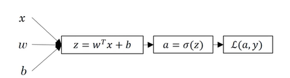
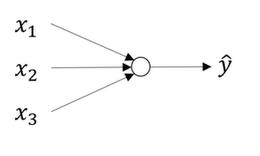
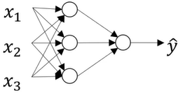
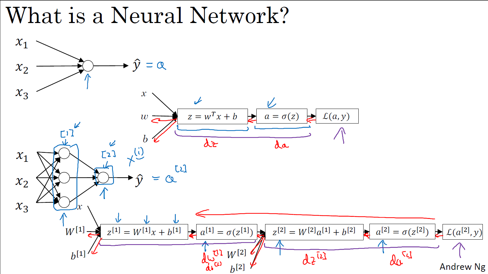
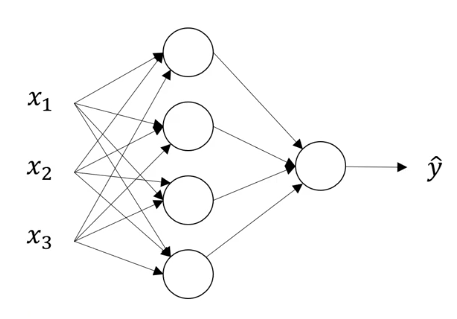
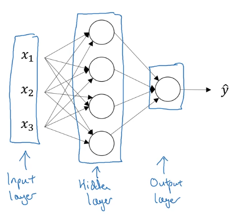
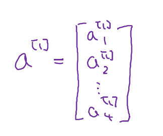
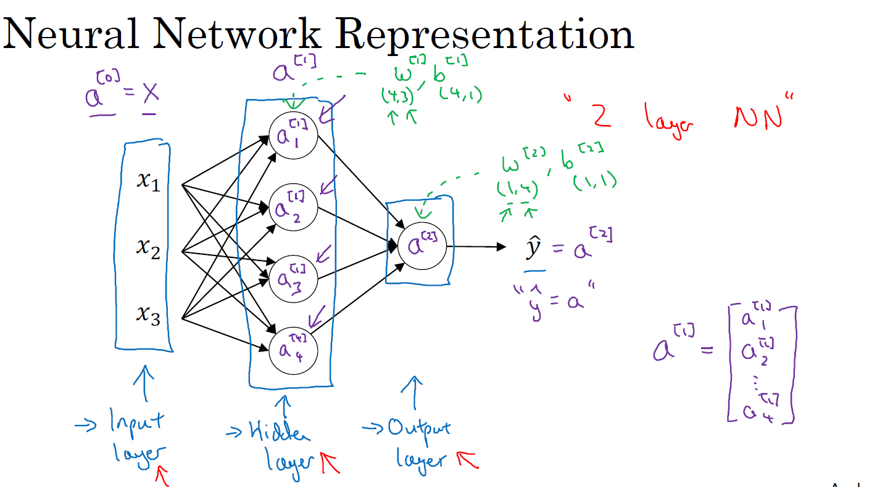

# Shallow Neural Networks
Build a neural network with one hidden layer, using forward propagation and backpropagation.

**Learning Objectives**
* Describe hidden units and hidden layers
* Use units with a non-linear activation function, such as tanh
* Implement forward and backward propagation
* Apply random initialization to your neural network
* Increase fluency in Deep Learning notations and Neural Network Representations
* Implement a 2-class classification neural network with a single hidden layer
* Compute the cross entropy loss

## Neural Networks Overview
### What is a Neural Network ?
In Logistic Regression, we put the features x and parameters w and b that allows you to compute z which is then used to computes a, and we were using a interchangeably with this output y hat and then you can compute the loss function, L.

Neural network

We can form a neural network by stacking together a lot of little sigmoid units. Previously, the Logistic Regression node corresponds to 2 steps to calculate. 
1. Compute the z-value
2. Computes a-value

In Neural Network, a node correspond to a z-like calculation and a-like calculation like in Logistic Regression.

We use superscript [1] to refer to calculation of nodes in 1st layer, and superscript [2] to refer to calculation of nodes in 2nd layer.

$z^{[1]} = W^{[1]}*x+b^{[1]}$

Superscript (1) is used to refer to training examples. So $X^{(1)}$ refers to i-th training example.

After computing $z^{[1]}$, we need to compute $a^{[1]}$, then we compute $z^{[2]} = W^{[2]}*x+b^{[2]}$, then compute $a^{[2]}$. Then use $a^{[2]}$ to compute $\ell(a^{[2]},y)$.

Then perform backward propagation to compute w and b.

## Neural Network Representation
Signal hidden layer neural network

Input features x1, x2, x3 stacked up vertically. This is called the input layer of the neural network. The next layer is called the hidden layer. The final layer is output layer, which is responsible for generating predicted value $\hat{y}$

The term "hidden layer" refers to the fact that in the training set, the true values for these nodes in the middle are not observed, that is, you don't see what they should be in the training set. You see what the inputs are, you see what the output should be, but the things in the hidden layer are not seen in the training set.

Whereas previously, we were using the vector `X` to denote the input features and alternative notation for the values of the input features will be $a^{(0)}$. And the term `a` also stands for activations, and it refers to the values that different layers of the neural network are passing on to the subsequent layers.

Input layer passes on the value `X` to the hidden layer, so we call that activations of the input layer $a^{[0]}$.

Hidden layer generates some sort of activation $a^{[1]}$. First node generates $a^{[1]}_1$, 2nd node generate $a^{[1]}_2$, and so on.

So $a^{[1]}$ is a 4 dimensional vector or 4x1 matrix, or a 4 column vector.

Then finally, the output layer regenerates some value $a^{[2]}$, which is just a real number. And so $\hat{y}$ is going to take on the value of $a^{[2]}$. So this is analogous to how in logistic regression we have $\hat{y}$ equals a and in logistic regression which we only had that one output layer, so we don't use the superscript square brackets. But with our neural network, we now going to use the superscript square bracket to explicitly indicate which layer it came from. 

This network is called 2 layer neural network. Because when we count layers in NN, we don't count the input layer.
- Input layer = layer 0
- Hidden layer = layer 1
- Output layer = layer 2

The hidden layer and the output layers will have parameters associated with them. 
- The hidden layer will have parameters $w^{[1]}$ and $b{[1]}$, in this case w is 4x3 matrix (4 nodes hidden layer and 3 input features) and b is 4x1 vector. 
- Output layer will have $w^{[2]}$ which is 1x4 vector (hidden layer has 4 hidden units and output layer has just 1 unit) and $b{[2]}$ which is 1x1.

## Computing a Neural Network's Output

