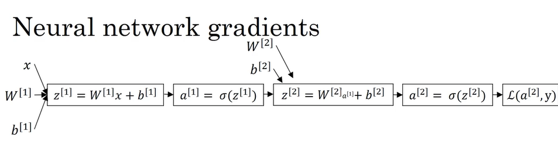
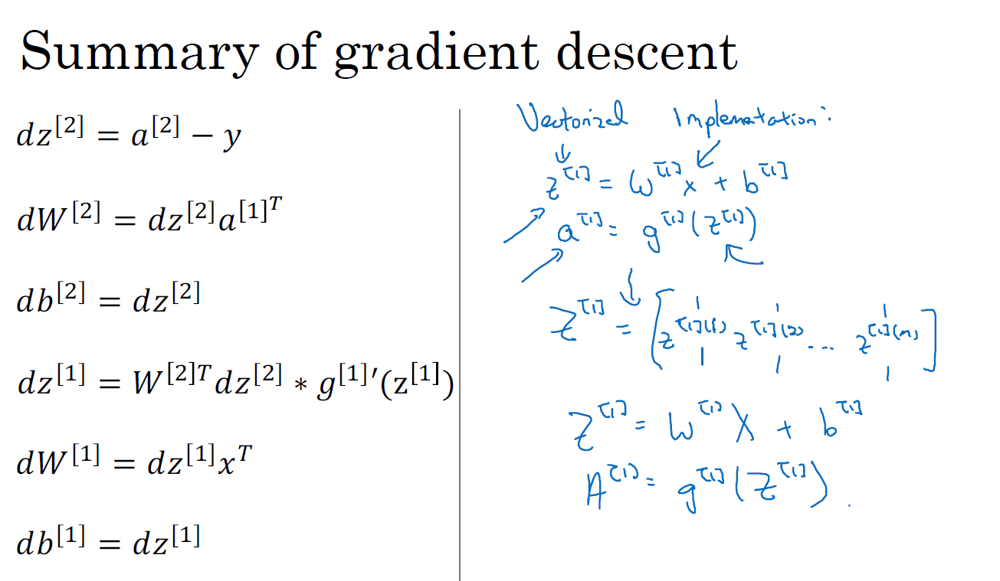

# Shallow Neural Networks
Build a neural network with one hidden layer, using forward propagation and backpropagation.

**Learning Objectives**
* Describe hidden units and hidden layers
* Use units with a non-linear activation function, such as tanh
* Implement forward and backward propagation
* Apply random initialization to your neural network
* Increase fluency in Deep Learning notations and Neural Network Representations
* Implement a 2-class classification neural network with a single hidden layer
* Compute the cross entropy loss

## Neural Networks Overview
### What is a Neural Network ?
In Logistic Regression, we put the features x and parameters w and b that allows you to compute z which is then used to computes a, and we were using a interchangeably with this output y hat and then you can compute the loss function, L.


Neural network


We can form a neural network by stacking together a lot of little sigmoid units. Previously, the Logistic Regression node corresponds to 2 steps to calculate. 
1. Compute the z-value
2. Computes a-value

In Neural Network, a node correspond to a z-like calculation and a-like calculation like in Logistic Regression.

We use superscript [1] to refer to calculation of nodes in 1st layer, and superscript [2] to refer to calculation of nodes in 2nd layer.

$z^{[1]} = W^{[1]}*x+b^{[1]}$

Superscript (1) is used to refer to training examples. So $X^{(1)}$ refers to i-th training example.

After computing $z^{[1]}$, we need to compute $a^{[1]}$, then we compute $z^{[2]} = W^{[2]}*x+b^{[2]}$, then compute $a^{[2]}$. Then use $a^{[2]}$ to compute $\ell(a^{[2]},y)$.

Then perform backward propagation to compute w and b.


## Neural Network Representation
Signal hidden layer neural network


Input features x1, x2, x3 stacked up vertically. This is called the input layer of the neural network. The next layer is called the hidden layer. The final layer is output layer, which is responsible for generating predicted value $\hat{y}$


The term "hidden layer" refers to the fact that in the training set, the true values for these nodes in the middle are not observed, that is, you don't see what they should be in the training set. You see what the inputs are, you see what the output should be, but the things in the hidden layer are not seen in the training set.

Whereas previously, we were using the vector `X` to denote the input features and alternative notation for the values of the input features will be $a^{(0)}$. And the term `a` also stands for activations, and it refers to the values that different layers of the neural network are passing on to the subsequent layers.

Input layer passes on the value `X` to the hidden layer, so we call that activations of the input layer $a^{[0]}$.

Hidden layer generates some sort of activation $a^{[1]}$. First node generates $a^{[1]}_1$, 2nd node generate $a^{[1]}_2$, and so on.

So $a^{[1]}$ is a 4 dimensional vector or 4x1 matrix, or a 4 column vector.


Then finally, the output layer regenerates some value $a^{[2]}$, which is just a real number. And so $\hat{y}$ is going to take on the value of $a^{[2]}$. So this is analogous to how in logistic regression we have $\hat{y}$ equals a and in logistic regression which we only had that one output layer, so we don't use the superscript square brackets. But with our neural network, we now going to use the superscript square bracket to explicitly indicate which layer it came from. 


This network is called 2 layer neural network. Because when we count layers in NN, we don't count the input layer.
- Input layer = layer 0
- Hidden layer = layer 1
- Output layer = layer 2

The hidden layer and the output layers will have parameters associated with them. 
- The hidden layer will have parameters $w^{[1]}$ and $b{[1]}$, in this case w is 4x3 matrix (4 nodes hidden layer and 3 input features) and b is 4x1 vector. 
- Output layer will have $w^{[2]}$ which is 1x4 vector (hidden layer has 4 hidden units and output layer has just 1 unit) and $b{[2]}$ which is 1x1.

## Computing a Neural Network's Output
We've said before that logistic regression, the circle in logistic regression, really represents two steps of computation rows: compute z and a (activation as a sigmoid function of z).


So a neural network just does this a lot more times.


Similar to Logistic Regression, first node of hidden layer does 2 steps of computation: $z^{[1]}_1$ and $a^{[1]}_1$
* Step 1: $z^{[1]}_1 = w^{[1]T}_1x + b^{[1]}_1$
* Step 2: $a^{[1]}_1 = \sigma(z^{[1]}_1)$


Second node of hidden layer also does 2 steps of computation: $z^{[1]}_2$ and $a^{[1]}_2$
* Step 1: $z^{[1]}_2 = w^{[1]T}_2x + b^{[1]}_2$
* Step 2: $a^{[1]}_2 = \sigma(z^{[1]}_2)$


Same for hidden layer unit 3 and 4.


* $z^{[1]}_1 = w^{[1]T}_1x + b^{[1]}_1$, $a^{[1]}_1 = \sigma(z^{[1]}_1)$
* $z^{[1]}_2 = w^{[1]T}_2x + b^{[1]}_2$, $a^{[1]}_2 = \sigma(z^{[1]}_2)$
* $z^{[1]}_3 = w^{[1]T}_3x + b^{[1]}_3$, $a^{[1]}_3 = \sigma(z^{[1]}_3)$
* $z^{[1]}_4 = w^{[1]T}_4x + b^{[1]}_4$, $a^{[1]}_4 = \sigma(z^{[1]}_4)$

Using for loop to calculate above computations is inefficient.

-> Use vectorization.

Take $w_1$ to $w_4$ and stack them into a 4x3 matrix. Note that $w^{[1]T}_1$ is row vector.


Then we take this matrix and multiply it with input features x1, x2, x3. We have


Then add b to it.


Denote this as $z^{[1]}$


To compute $a^{[1]}$, we take together $a^{[1]}_1$ to $a^{[1]}_4$, this will be equal to $\sigma(z^{[1]})$


Recap: Given input x:
* $z^{[1]} = w^{[1]T}x + b^{[1]}$
* $a^{[1]} = \sigma(z^{[1]})$

Remember that x = $a^{[0]}$ and y = $a^{[2]}$, so we can represent z as

$z^{[1]} = w^{[1]T}a^{[0]} + b^{[1]}$

Similar for second layer
* $z^{[2]} = w^{[2]T}x + b^{[2]}$
* $a^{[2]} = \sigma(z^{[2]})$


If you think of the upper unit as just being analogous to logistic regression which have parameters w and b, w really plays an analogous role to $w^{[2]}$ transpose, or $w^{[2]}$ is really W transpose and b is equal to $b^{[2]}$. 

## Vectorizing Across Multiple Examples


This tells us, given an input feature x, we can use them to generate $a^{[2]} = \hat{y}$ for a single training example.

If we have m training examples, we need t repeat this process for say:
* $x^{(1)}$ to compute $a^{[2](1)}=\hat{y}^{[1]}$ (does a prediction on 1st training example)
* $x^{(2)}$ to compute $a^{[2](2)}=\hat{y}^{[2]}$
* So on
* $x^{(m)}$ to compute $a^{[2](m)}=\hat{y}^{[m]}$

Notation $a^{[2](i)}$, the (i) refers to training example i-th, and [2] refers to layer 2.

If you have an unvectorized implementation and want to compute the predictions of all your training examples, you need to do 

> for i = 1 to m:
>> $z^{[1](i)} = w^{[1]}x^{(i)} + b^{[1]}$ \
>> $a^{[1](i)} = \sigma(z^{[1](i)})$ \
>> $z^{[2](i)} =  w^{[2]}x^{(i)} + b^{[2]}$ \
>> $a^{[2](i)} = \sigma(z^{[2](i)})$

-> Vectorize these equations to get rid of this for loop.


Recall that we defined the matrix X to be equal to our training examples stacked up in columns


$Z^{[1]} = W^{[1]}X + b^{[1]}$ \
$A^{[1]} = \sigma(Z^{[1]})$ \
$Z^{[2]} =  W^{[2]}W + b^{[2]}$ \
$A^{[2]} = \sigma(Z^{[2]})$ 

We went from lower case x to capital case X by stacking up lower case x's in different columns. If we do the same thing for z and a, we have


One of the property of this notation that might help you to think about it is that this matrixes say Z and A, horizontally we're going to index across training examples. The horizontal index corresponds to different training example, when you sweep from left to right you're scanning through the training set. And vertically this vertical index corresponds to different nodes in the neural network. So for example, the value at the top most, top left most corner of the mean corresponds to the activation of the first heading unit on the first training example. One value down corresponds to the activation in the second hidden unit on the first training example, then the third heading unit on the first training sample and so on.

So as you scan down this is your indexing to the hidden units number. Whereas if you move horizontally, then you're going from the first hidden unit. And the first training example to now the first hidden unit and the second training sample, the third training example. So on until the node corresponds to the activation of the first hidden unit on the final training example and the m-th training example. 

## Explanation for Vectorized Implementation
For 1st training example:

$z^{[1](1)} = w^{[1]}x^{(1)} + b^{[1]}$

For 2nd training example:

$z^{[1](2)} = w^{[1]}x^{(2)} + b^{[1]}$

For 3rd training example:

$z^{[1](3)} = w^{[1]}x^{(3)} + b^{[1]}$

To simplify this justification a little bit that b is equal to zero. But the argument we're going to lay out will work with just a little bit of a change even when b is non-zero.


We have $w^{[1]}$ is a matrix.


$w^{[1]}$ times $x^{(1)}$ gives some column vector


$w^{[1]}$ times $x^{(2)}$ gives some other column vector


$w^{[1]}$ times $x^{(3)}$ gives some other column vector


If you consider the training set capital X, which we form by stacking together all of our training examples. So the matrix capital X is formed by taking the vector x1 and stacking it vertically with x2 and then also x3. This is if we have only three training examples. If you have more, they'll keep stacking horizontally like that.


If we take $W^{[1]}$ and multiply it by matrix X


With Python broadcasting, you end up having $b^{[i]}$ individually to each of the columns of this matrix.


Here we have two-layer neural network where we go to a much deeper neural network in next week's videos, you see that even deeper neural networks are basically taking these two steps and just doing them even more times than you're seeing here.

## Activation Functions
When you build your neural network, one of the choices you get to make is what activation function to use in the hidden layers as well as at the output units of your neural network. So far, we've just been using the sigmoid activation function, but sometimes other choices can work much better. 


$a = {1 \over {1+e^{-z}}}$

So in the more general case, we can have a different function $g(z^{[1]})$. Where g can be a nonlinear function that may not be the sigmoid function.

$a^{[1]} = g(z^{[1]})$

$a^{[2]} = g(z^{[2]})$

For example, the sigmoid function goes between 0 and 1. An activation function that almost always works better than the sigmoid function is the tangent function or the hyperbolic tangent function.


$a = tanh(z) = {{e^z - e^{-z} \over {e^z + e^{-z}}}}$

And it's actually mathematically a shifted version of the sigmoid function. 

This almost always works better than the sigmoid function because with values between +1 and -1, the mean of the activations that come out of your hidden layer are closer to having a 0 mean. And so just as sometimes when you train a learning algorithm, you might center the data and have your data have 0 mean using a tanh instead of a sigmoid function. Kind of has the effect of centering your data so that the mean of your data is close to 0 rather than maybe 0.5. And this actually makes learning for the next layer a little bit easier.

_I pretty much never use the sigmoid activation function anymore. The tanh function is almost always strictly superior. The one exception is for the output layer because if y is either 0 or 1, then it makes sense for y hat to be a number that you want to output that's between 0 and 1 rather than between -1 and 1. So the one exception where I would use the sigmoid activation function is when you're using binary classification. In which case you might use the sigmoid activation function for the output layer._

What you see in this example is where you might have a tanh activation function for the hidden layer and sigmoid for the output layer. So the activation functions can be different for different layers. And sometimes to denote that the activation functions are different for different layers, we might use square brackets superscripts as well to indicate that $g^{[1]}$ may be different than $g^{[2]}$.

One of the downsides of both the sigmoid function and the tan h function is that if z is either very large or very small, then the gradient of the derivative of the slope of this function becomes very small. So if z is very large or z is very small, the slope of the function either ends up being close to zero and so this can slow down gradient descent. So one other choice that is very popular in machine learning is what's called the rectified linear unit (ReLU).

|z|	sigmoid(z)| (slope)|
|-|-|-|
|−10|	0.00005	|almost 0|
|0|	0.5|	0.25 (maximum slope)|
|+10|	0.99995|	almost 0|

When z is large positive or large negative, the sigmoid curve flattens out — it’s nearly horizontal.

That means:
* The slope (derivative) = almost 0
* And the gradient in gradient descent = very small

Gradient descent updates a parameter w like this:

$w = w - \alpha * {dJ \over dw}$

* If the gradient is big, w moves a lot.
* If the gradient is tiny, w barely moves.

Consider a simple 3 layer feedforward network (input -> hidden1 -> hidden 2 -> output).


Sigmoid $\sigma(z)$. Derivative of sigmoid is $\sigma(z)(1-\sigma(z))$. Max value is 0.25 when $\sigma = 0.5$. So if $\sigma(z)$ is near 0 or 1 (saturation), its derivative is very small.

Tanh(z), it's derivative is $1-tanh^2(z)$. Max value is 1. If |tanh(z)| is close to 1 (saturation), derivative is small.

Because the overall gradient is a product of many activation derivatives, if each one is small (<1), their product becomes very small.

Assume a deep network with 3 activation derivatives at hidden layers (values representative of saturated sigmoids):
* activation' at layer1 = 0.01
* activation' at layer2 = 0.01
* activation' at output = 0.01
* other multiplicative factors (weights, error term) ≈ 1 for simplicity
Then gradient for an early weight is approximately:

${dL \over {dw_1}} = 1 * 0.01 * 1 * 0.01 * 1 * 0.01 * 1 = 10^{-6}$

If learning rate is 0.1, the update is

$\alpha * {dL \over {dw_1}} ~ 0.1 * 10^{-6} = 10^{-7}$

That update is tiny -> the weight bearely changes -> learning stalls in early layers.

For ReLU
* For positive z, derivative = 1, not a small fraction. So factors in the gradient product that come from ReLU don’t shrink the gradient.
* Thus, in the backward pass, whenever pre-activation is positive, the activation' term is 1 and does not reduce the gradient magnitude.
* If layer derivatives are [1, 1, 0.01] instead of [0.01, 0.01, 0.01], product = 1 x 1 x 0.01 = 0.01 (much larger than $10^{-6}$).

* So ReLU improves the backward pass by keeping many activation derivatives equal to 1 (no shrinking), allowing useful gradients to reach early layers and thus enabling faster learning.
* Sigmoid/tanh squash big inputs to near-constant outputs. When that happens, they become almost flat — the slope is nearly zero.
* Backpropagation has to multiply a bunch of these slopes (one per layer). If many slopes are near zero, the product is near zero. That means the “message” telling early layers how to change gets lost (vanishes).
* ReLU doesn’t squash positive inputs; it has slope 1 for positive inputs. So the “message” (gradient) doesn’t get shrunk as it travels backward through layers — early layers still get a meaningful signal to learn.


a = max(0,z)

The derivative is 1 as long as z is positive and derivative or the slope is 0 when z is negative. If you're implementing this, technically the derivative when z is exactly 0 is not well defined. But when you implement this in the computer, the odds that you get exactly z equals 000000000000 is very small. So you don't need to worry about it. In practice, you could pretend a derivative when z is equal to 0, you can pretend is either 1 or 0. And you can work just fine. 

If you're using binary classification, then the sigmoid activation function is very natural choice for the output layer. And then for all other units, ReLU or the rectified linear unit is increasingly the default choice of activation function. So if you're not sure what to use for your hidden layer, I would just use the ReLU activation function, is what you see most people using these days. Although sometimes people also use the tan h activation function. One disadvantage of the ReLU is that the derivative is equal to 0 when z is negative. In practice this works just fine. But there is another version of the ReLU called the Leaky ReLU.

In practice, using the ReLU activation function, your neural network will often learn much faster than when using the tan h or the sigmoid activation function. And the main reason is that there's less of this effect of the slope of the function going to 0, which slows down learning. And I know that for half of the range of z, the slope for ReLU is 0. But in practice, enough of your hidden units will have z greater than 0. So learning can still be quite fast for most training examples. 


* Never use this except for the output layer if you are doing binary classification or maybe almost never use this
* Tan h is pretty much strictly superior.


* Most commonly used activation function
* Not sure what to use, use this


* Feel free also to try the Leaky ReLU 
* a=max(0.01z, z)
* 0.01 can be replaced by other parameter.

## Why do you need Non-Linear Activation Functions?


Here is the forward prop equations for the neural network. 

If we only use
* $a^{[1]} = z^{[1]}$ instead of $g^{[1]}(z^{[1]})$
* $a^{[2]} = z^{[2]}$ instead of $g^{[2]}(z^{[2]})$


$g(z) = z$ is called linear activation function. It outputs what every was input.

It turns out if you do this, then this model is just computing y or y-hat as a linear function of your input features, x, to take the first two equations. 

If you have that $a^{[1]} = z^{[1]} = W^{[1]}x + b^{[1]}$, and then $a^{[2]} = z^{[2]} = W^{[2]}a^{[1]} + b$. 

Then if you take this definition of $a^{[1]}$ and plug it in the second function, you find that 

$a^{[2]} = W^{[2]}(W^{[1]}x + b^{[1]}) + b^{[2]}$

Since $a^{[1]} = W^{[1]}x + b^{[1]}$

So this simplifies to: 

$a^{[2]} = (W^{[2]}W^{[1]})x + (W^{[2]}b^{[1]} + b^{[2]})$

Set $W^1 = W^{[2]}W^{[1]}$ and $b^1 = W^{[2]}b^{[1]} + b^{[2]}$

Then $a^{[2]} = W^1x+b^1$

If you were to use linear activation functions or we can also call them identity activation functions, then the neural network is just outputting a linear function of the input. 

And we'll talk about deep networks later, neural networks with many, many layers, many hidden layers. And it turns out that if you use a linear activation function or alternatively, if you don't have an activation function, then no matter how many layers your neural network has, all it's doing is just computing a linear activation function. So you might as well not have any hidden layers. Some of the cases that are briefly mentioned, it turns out that if you have a linear activation function in hidden layer and a sigmoid function in output layer, then this model is no more expressive than standard logistic regression without any hidden layer.

The take home is that a linear hidden layer is more or less useless because the composition of two linear functions is itself a linear function. So unless you throw a non-linear item in there, then you're not computing more interesting functions even as you go deeper in the network. 

There is just one place where you might use a linear activation function. g(x) = z. And that's if you are doing machine learning on the regression problem. So if y is a real number. So for example, if you're trying to predict housing prices. 

So y is not 0, 1, but is a real number, anywhere from $0 is the price of house up to however expensive, right, houses get, I guess. Maybe houses can be potentially millions of dollars, so however much houses cost in your data set. But if y takes on these real values, then it might be okay to have a linear activation function here so that your output y-hat is also a real number going anywhere from minus infinity to plus infinity. But then the hidden units should not use the linear activation functions. They could use ReLU or tanh or Leaky ReLU or maybe something else. So the one place you might use a linear activation function is usually in the output layer. But other than that, using a linear activation function in the hidden layer except for some very special circumstances relating to compression that we're going to talk about using the linear activation function is extremely rare. 

If we're actually predicting housing prices, as you saw in the week one video, because housing prices are all non-negative, Perhaps even then you can use a value activation function so that your output y-hat are all greater than or equal to 0.


## Derivatives of Activation Functions
### Sigmoid activation function


Here's the familiar Sigmoid activation function. So, for any given value of z, maybe this value of z. This function will have some slope or some derivative corresponding to the height over width of lower triangle. 


So, if g(z) is the sigmoid function, then the slope of the function is $g'(z) = {d \over dz}g(z)$ = slope, and so we know from calculus that it is the slope of g(x) at z. If you are familiar with calculus and know how to take derivatives, if you take the derivative of the Sigmoid function, it is possible to show that it is equal to this formula. 

${1 \over {1+e^{-z}}}(1 - {1 \over {1+e^{-z}}})$ = g(z)(1 - g(z))

* If z is very large, i.e, z = 10, then g(z) ~ 1

${d \over dz}g(z)$ ~ 1(1-1) ~ 0

* If z is very small, i.e, z = -10, then g(z) ~ 0

${d \over dz}g(z)$ ~ 0(1-0) ~ 0

* If z = 0, then g(z) = 1/2

${d \over dz}g(z)$ ~ 1/2(1-1/2) ~ 1/4

In NN, we have a = g(z) = ${1 \over {1+e^{-z}}}$

So

$g'(z) = g(z)(1 - g(z)) = a(1-a)$


### Tanh activation function


$g'(z) = {d \over dz}g(z)$ = slope of g(z) at z

We have 

g(z) = tanh(z) = ${e^z - e^{-z}} \over {e^z + e^{-z}}$

$g'(z) = {d \over dz}g(z) = 1 - (tanh(z))^2$

* If z=10, tanh(z) ~ 1, then g'(z) ~ 0.
* If z=-10, tanh(z) ~ -1, then g'(z) ~ 0.
* If z=0, tanh(z) = 0, then g'(z) = 1.

a = g(z), then g'(z) = 1 - $a^2$


### ReLU and Leaky ReLU


g(z) = max(0,z)

* g'(z) = 0 if z < 0
* g'(z) = 1 if z > 0
* g'(z) undefined if z = 0

But if you're implementing this in software, it might not be a 100 percent mathematically correct, but it'll work just fine if z is exactly a 0, if you set the derivative to be equal to 1. It always had to be 0, it doesn't matter. If you're an expert in optimization, technically, g' then becomes what's called a sub-gradient of the activation function g(z), which is why gradient descent still works. But you can think of it as that, the chance of z being exactly 0.000000 so small. It's so small that it almost doesn't matter where you set the derivative to be equal to when z is equal to 0. So, in practice, this is what people implement for the derivative of z. 


g(z) = max(0.01z, z)

* g'(z) = 0.01 if z < 0
* g'(z) = 1 if z >= 0

Once again, the gradient is technically not defined when z is exactly equal to 0, but if you implement a piece of code that sets the derivative or that sets g prime to either 0.01 or or to 1, either way, it doesn't really matter. When z is exactly 0, your code will work just fine.

## Gradient Descent for Neural Networks

For neural network with a single hidden layer, we have :
* Parameters: 
  * $W^{[1]}$ (dimension: $(n^{[1]},n^{[0]})$)
  * $b^{[1]}$ (dimension: $(n^{[1]}, 1)$)
  * $W^{[2]}$ (dimension: $(n^{[2]},n^{[1]})$)
  * $b^{[2]}$ (dimension: $(n^{[2]},1)$)

As a reminder, if you have $n_x$ or alternatively $n^{[0]}$ input features, and $n^{[1]}$ hidden units, and $n^{[2]}$ output units in our examples. So far, we only had $n^{[2]} = 1$.

* Cost function: (assumming we are doing binary classification)
  * $J(W^{[1]}, b^{[1]}, W^{[2]}, b^{[2]}) = {1 \over m} \Sigma_{i=1}^m \ell(\hat{y},y)$
    * $\hat{y} = a^{[2]}$
    * If you're doing binary classification, the loss function can be exactly what you use for logistic regression earlier.

* Gradient descent:

> Repeat {
>> Compute predict $\hat{y}^{(i)}$ for i = 1...m \
>> $dw^{[1]} = {dJ \over dw^{[1]}}$, $db^{[1]} = {dJ \over db^{[1]}}$, ... \
>> $W^{[1]} = W^{[1]} - \alpha *dW^{[1]}$ \
>> $b^{[1]} = b^{[1]} - \alpha *db^{[1]}$ \
>> $W^{[2]}$ ... \
>> $b^{[2]}$ ... \
> }

### Formulas for computing derivatives

Forward propagation
* $Z^{[1]} = W^{[1]}X + b^{[1]}$
* $A^{[1]} = g^{[1]}(Z^{[1]})$
* $Z^{[2]} = W^{[2]}X + b^{[2]}$
* $A^{[2]} = g^{[2]}(Z^{[2]}) = \sigma(Z^{[2]})$

Back propatation
* $dZ^{[2]} = A^{[2]} - Y$ (These are all vectorized, Y=[$y^{[1]}$ $y^{[2]}$...$y^{[m]}$]). The matrix Y is this one by M matrix that lists all of your M examples stacked horizontally.
* $dW^{[2]} = {1 \over m}dZ^{[2]}A^{[1]T} - Y$
* $db^{[2]} = {1 \over m}np.sum(dZ^{[2]},axis=1,keepdims=True)$
* $dZ^{[1]} = W^{[2]T}dz^{[2]} * g'^{[1]}(Z^{[1]})$ (multiply here is element-wise product.) $W^{[2]T}dz^{[2]}$ is $(n^{[1]},m)$ matrix, same for $g'^{[1]}(Z^{[1]})$
* $dW^{[1]} = {1 \over m}dZ^{[1]}X^{T}$
* $db^{[1]} = {1 \over m}np.sum(dZ^{[1]},axis=1,keepdims=True)$

#### FORWARD PROPAGATION (input → output)
```
      X  (input features, shape: n_x × m)
      │
      ▼
 ┌──────────────────┐
 │  Layer 1: Hidden │
 └──────────────────┘
      Z[1] = W[1]X + b[1]
      A[1] = g[1](Z[1])        ← activation (ReLU, tanh, etc.)
      │
      ▼
 ┌──────────────────┐
 │  Layer 2: Output │
 └──────────────────┘
      Z[2] = W[2]A[1] + b[2]
      A[2] = g[2](Z[2]) = σ(Z[2])   ← sigmoid → gives probability (ŷ)
      │
      ▼
  Compare A[2] with Y → compute LOSS (J)
      J = (1/m) Σ [−y log(ŷ) − (1−y) log(1−ŷ)]
```

#### BACKPROPAGATION (output → input)
```
Start from output error:
      dZ[2] = A[2] − Y
      dW[2] = (1/m) · dZ[2] · A[1]ᵀ
      db[2] = (1/m) · Σ dZ[2]
      │
      ▼
Backpropagate to hidden layer:
      dZ[1] = (W[2]ᵀ · dZ[2]) * g'[1](Z[1])
      dW[1] = (1/m) · dZ[1] · Xᵀ
      db[1] = (1/m) · Σ dZ[1]
      │
      ▼
Update parameters:
      W[1] ← W[1] − α · dW[1]
      b[1] ← b[1] − α · db[1]
      W[2] ← W[2] − α · dW[2]
      b[2] ← b[2] − α · db[2]
```

#### Dimensions (example)
```
X:     (n_x, m)
W[1]:  (n_h, n_x)
b[1]:  (n_h, 1)
A[1]:  (n_h, m)
W[2]:  (1, n_h)
b[2]:  (1, 1)
A[2]:  (1, m)
Y:     (1, m)
```

Every "d" like $dW^{[2]}, db^{[1]}, dZ^{[2]}$ means "the derivative of the loss J with respect to that variable."

## Backpropagation Intuition (Optional)


Forward prop


Backward prop





## Random Initialization
When you train your neural network, it's important to initialize the weights randomly. For logistic regression, it was okay to initialize the weights to zero. But for a neural network of initialize the weights to parameters to all zero and then applied gradient descent, it won't work. 


$n^{[0]}=2$, $n^{[1]}=2$

Matrix associated to hidden layer is 2x2.


It turns out initializing the bias terms b to 0 is actually okay, but initializing w to all 0s is a problem. 

So the problem with this formalization is that for any example you give it, you'll have that $a^{[1]}_1$ and $a^{[1]}_2$ will be equal.

When computing backward prop, $dz^{[1]}_1$ and $dz^{[1]}_2$ will also be the same.

If you initialize the neural network this way, then the 2 hidden units are completely identical. Sometimes you say they're completely symmetric, which just means that they're completing exactly the same function.

And by kind of a proof by induction, it turns out that after every single iteration of training your two hidden units are still computing exactly the same function. Since plots will show that dw will be a matrix that looks like this. Where every row takes on the same value.


So when you perform a weight update


You find that w1, after every iteration, will have the first row equal to the second row.

So it's possible to construct a proof by induction that if you initialize all the ways, all the values of w to 0, then because both hidden units start off computing the same function. And both hidden the units have the same influence on the output unit, then after one iteration, that same statement is still true, the two hidden units are still symmetric. And therefore, by induction, after two iterations, three iterations and so on, no matter how long you train your neural network, both hidden units are still computing exactly the same function. And so in this case, there's really no point to having more than one hidden unit. Because they are all computing the same thing. 

Proof by induction is a mathematical technique used to prove that a statement is true for all natural numbers (or a specific set of numbers). It works in two main steps, much like climbing a staircase: 
* Base Case: First, you prove that the statement is true for the initial value, usually the smallest number in the set, like 1. This is like showing that the first step of the staircase is solid.
* Inductive Step: Next, you assume that the statement is true for some arbitrary natural number ( n ) (this is called the inductive hypothesis). Then, you prove that if the statement holds for ( n ), it must also hold for ( n + 1 ). This is like showing that if you can step on the first step, you can also step on the second step.

For larger neural networks, let's say of three features and maybe a very large number of hidden units, a similar argument works to show that if you initialize the weights to zero, then all of your hidden units are symmetric. And no matter how long you're upgrading the center, all continue to compute exactly the same function. So that's not helpful, because you want the different hidden units to compute different functions. 

The solution to this is to initialize your parameters randomly. 

So here's what you do. 
* You can set $w^{[1]}$ = np.random.randn((2,2))*0.01. This generates a gaussian random variable (2,2). And then usually, you multiply this by very small number, such as 0.01. So you initialize it to very small random values.
* It turns out that b does not have the symmetry problem, what's called the symmetry breaking problem. So it's okay to initialize b to just zeros ($b^{[1]}$=np.zero((2,1))). Because so long as w is initialized randomly, you start off with the different hidden units computing different things. And so you no longer have this symmetry breaking problem. 
* Similar for $w^{[2]}$ = np.random.randn((1,2)) * 0.01
* $b^{[2]}$ = 0

Where did this constant come from and why is it 0.01? Why not put the number 100 or 1000? 

Turns out that we usually prefer to initialize the weights to very small random values. Because if you are using a tanh or sigmoid activation function, or the other sigmoid, even just at the output layer. If the weights are too large, then when you compute the activation values, remember that $z^{[1]}=w^{[1]} x + b^{[1]}$ and $a^{[1]} = g^{[1]}(z^{[1]})$. So if w is very big, z will be very, or at least some values of z will be either very large or very small. And so in that case, you're more likely to end up at these fat parts of the tanh function or the sigmoid function, where the slope or the gradient is very small. Meaning that gradient descent will be very slow. So learning was very slow. 

So just a recap, if w is too large, you're more likely to end up even at the very start of training, with very large values of z. Which causes your tanh or your sigmoid activation function to be saturated, thus slowing down learning. 


If you don't have any sigmoid or tanh activation functions throughout your neural network, this is less of an issue. But if you're doing binary classification, and your output unit is a sigmoid function, then you just don't want the initial parameters to be too large. So that's why multiplying by 0.01 would be something reasonable to try, or any other small number. Same of w2.

It turns out that sometimes they can be better constants than 0.01. When you're training a neural network with just one hidden layer, it is a relatively shallow neural network, without too many hidden layers. Set it to 0.01 will probably work okay. 

But when you're training a very very deep neural network, then you might want to pick a different constant than 0.01.

But either way, it will usually end up being a relatively small number.


