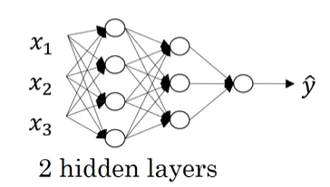

# Deep Neural Networks

**Learning Objectives**
* Describe the successive block structure of a deep neural network
* Build a deep L-layer neural network
* Analyze matrix and vector dimensions to check neural network implementations
* Use a cache to pass information from forward to back propagation
* Explain the role of hyperparameters in deep learning
* Build a 2-layer neural network

## Deep L-layer Neural Network

We say that logistic regression is shallow model

The model with 5 hidden layers is much deeper model

We count only hidden layer and output layer, don't count input layer.

Logistic regression is 1 layer NN.

Over the last several years the AI, the machine learning community has realized that there are functions that very deep neural networks can learn that shallower models are often unable to. 

Although for any given problem, it might be hard to predict in advance exactly how deep in your network you would want. So it would be reasonable to try logistic regression, try one and then two hidden layers, and view the number of hidden layers as another hyper parameter that you could try a variety of values of, and evaluate on all that across validation data, or on your development set.

Here is 4 layers NN with 3 hidden layers.

Use L to denote the number of layers in NN, so L=4

$n^{{l}}$ = number of units in layer l

Example: $n^{[1]}$=5 since we have 5 hidden units in layer 1.

$n^{[2]}$=5, $n^{[3]}$=3, $n^{[4]}$=$n^{[L]}$=1

$n_{[0]} = n_X = 3$

$a^{{l}}$ = activations in layer l

$a^{{l}} = g^{[l]}(z^{[l]})$

$W^{[l]}$ = weights for computing value $z^{[l]}$ in layer l. Similar for $b^{[l]}$.

The input features are called X, but X is also the activations for layer 0, so $a^{[0]}=X$.

The activation of the final layer $a^{[L]}=\hat{y}$. So $a^{[L]}$ is the predicted output to prediction $\hat{y}$ to the NN.

## Forward Propagation in a Deep Network

Given training example X. 

Layer 1:
* $z^{[1]} = W^{[1]}X + b^{[1]}$
* Activation $a^{[1]} = g^{[1]}(z^{[1]})$

Layer 2:
* $z^{[2]} = W^{[2]}a^{[1]} + b^{[2]}$
* Activation $a^{[2]} = g^{[2]}(z^{[2]})$

Layer 4:
* $z^{[4]} = W^{[4]}a^{[3]} + b^{[4]}$
* $a^{[4]} = g^{[4]}(z^{[4]}) = \hat{y}$

Note that x = $a^{[0]}$

General rule:
* $z^{[l]} = W^{[l]}a^{[l-1]} + b^{[l]}$
* $a^{[l]} = g^{[l]}(z^{[l]})$

Vectorized way for the whole training set at the same time:
* $Z^{[1]} = W^{[1]}X + b^{[1]}$
* $A^{[1]} = g^{[1]}(Z^{[1]})$

Note that X = $A^{[0]}$

Layer 2: (Stack z vectors for n training examples in column and calling this capital Z)
* $Z^{[2]} = W^{[2]}A^{[1]} + b^{[2]}$
* $A^{[2]} = g^{[2]}(Z^{[2]})$

Similarly, for capital A, just as capital X. All the training examples are column vectors stack left to right.
* $\hat{Y} = g^{[4]}(Z^{[4]}) = A^{[4]}$

That's the predictions on all of your training examples stacked horizontally.

General rule:
* $Z^{[l]} = W^{[l]}A^{[l-1]} + b^{[l]}$
* $A^{[l]} = g^{[l]}(Z^{[l]})$

It seems that there is a For loop here. I know that when implementing neural networks, we usually want to get rid of explicit For loops. But this is one place where I don't think there's any way to implement this without an explicit For loop. So when implementing forward propagation, it is perfectly okay to have a For loop to compute the activations for layer one, then layer two, then layer three, then layer four. 

No one knows, and I don't think there is any way to do this without a For loop that goes from 1 to capital L, from 1 through the total number of layers in the neural network. So, in this place, it's perfectly okay to have an explicit For loop.

## Getting your Matrix Dimensions Right

L = 5

$z^{[1]} = W^{[1]}X + b^{[1]}$

$z^{[1]}$ is the vector of activations for this first hidden layer. So $z^{[1]}$ is (3,1), it's 3 dimensional vector, so it's ($n^{[1]}$, 1).

X is input feature which is (2,1), so it's ($n^{[0]}$, 1).

$W^{[1]}$ is (3,2) matrix, because (3,2) matrix times (2,1) vector is (3,1) vector. $W^{[1]}$ is ($n^{[1]}$, $n^{[0]}$).

$b^{[1]}$ has to be (3,1) vector to add to (3,1) vector to have the output of (3,1) vector.

By convention, dimension of W^{[2]}$ is (5,3) or ($n^{[2]}$, $n^{[1]}$).

Because

$z^{[2]} = W^{[2]}a{[1]} + b^{[2]}$

$z^{[2]}$ is (5,1) and $a{[1]}$ is (3,1), so $W^{[2]}$ is (5,3).

$b^{[2]}$ has to be (5,1) vector to add to (5,1) vector to have the output of (5,1) vector.

So $W^{[3]}$ is (4,5), $W^{[4]}$ is (2,4) and $W^{[5]}$ is (1,2).

General formula:
* $W^{[l]}$: ($n^{[l]}$, $n^{[l-1]}$)
* $b^{[l]}$: ($n^{[l]}$, 1)
* $dW^{[l]}$: ($n^{[l]}$, $n^{[l-1]}$)
* $db^{[l]}$: ($n^{[l]}$, 1)

Since $z^{[l]}=g^{[l]}(a^{[l]})$, apply element-wise, then z and a should have the same dimension.

We had $z^{[1]} = W^{[1]}X + b^{[1]}$

where ($n^{[1]}$,1) = ($n^{[1]}$, $n^{[0]}$)($n^{[0]}$,1) + ($n^{[1]}$,1)

In vectorized implementation:

$Z^{[1]} = W^{[1]}X + b^{[1]}$, where $Z^{[1]}$ is obtained by taking $Z^{[1](1)} Z^{[1](2)... Z^{[1](m)}}$ and stacking them horizontally.

So we have
($n^{[1]}$,m) = ($n^{[1]}$, $n^{[0]}$)($n^{[0]}$,m) + ($n^{[1]}$,1)

$b^{[1]}$ will be broadcasting to be ($n^{[1]}$,m).

$z^{[l]}$, $a^{[l]}$: ($n^{[l]}$, 1)

Vectorized:

$Z^{[l]}$, $A^{[l]}$: ($n^{[l]}$, m)

Note that l=0, then $A^{[0]}$=X =($n^[[0]]$, m)

In back prop:

$dZ^{[l]}$, $dA^{[l]}$: ($n^{[l]}$, m)

## Why Deep Representations?

Face recognition or face detection system.
* Input a picture of face
* First layer of NN you can think of as maybe being a feature detector or an edge detector. (In this example, I'm plotting what a neural network with maybe 20 hidden units, might be trying to compute on this image. So the 20 hidden units visualized by these little square boxes. So for example, this little visualization represents a hidden unit that's trying to figure out where the edges of that orientation are in the image.) You can think of the first layer of the neural network as looking at the picture and trying to figure out where are the edges in this picture. 

* Now, let's think about where the edges in this picture by grouping together pixels to form edges. It can then detect the edges and group edges together to form parts of faces. So for example, you might have a low neuron trying to see if it's finding an eye, or a different neuron trying to find that part of the nose. And so by putting together lots of edges, it can start to detect different parts of faces.

* Finally, by putting together different parts of faces, like an eye or a nose or an ear or a chin, it can then try to recognize or detect different types of faces. 

So intuitively, you can think of the earlier layers of the neural network as detecting simple functions, like edges. And then composing them together in the later layers of a neural network so that it can learn more and more complex functions.

And one technical detail of this visualization, the edge detectors are looking in relatively small areas of an image, maybe very small regions like that. And then the facial detectors you can look at maybe much larger areas of image. 

But the main intuition you take away from this is just finding simple things like edges and then building them up. Composing them together to detect more complex things like an eye or a nose then composing those together to find even more complex things.

Audio detection

* The first level of a neural network might learn to detect low level audio wave form features, such as is this tone going up? Is it going down? Is it white noise or sniffling sound like [SOUND]. 
And what is the pitch? When it comes to that, detect low level wave form features like that. 
* And then by composing low level wave forms, maybe you'll learn to detect basic units of sound. In linguistics they call phonemes. But, for example, in the word cat, the C is a phoneme, the A is a phoneme, the T is another phoneme. 
* But learns to find maybe the basic units of sound and then composing that together maybe learn to recognize words in the audio. 
* And then maybe compose those together, in order to recognize entire phrases or sentences. 

**Circuit theory**: There are functions you can compute with a
“small” L-layer deep neural network that shallower networks
require exponentially more hidden units to compute.

So the number of nodes or the number of circuit components or the number of gates in this network is not that large. You don't need that many gates in order to compute the exclusive OR. 

If you are not allowed to use a neural network with multiple hidden layers with, in this case, order log and hidden layers, if you're forced to compute this function with just one hidden layer, so you have all these things going into the hidden units. And then these things then output Y. Then in order to compute this XOR function, this hidden layer will need to be exponentially large, because essentially, you need to exhaustively enumerate our 2 to the N possible configurations. So on the order of 2 to the N, possible configurations of the input bits that result in the exclusive OR being either 1 or 0. So you end up needing a hidden layer that is exponentially large in the number of bits. I think technically, you could do this with 2 to the N minus 1 hidden units. But that's the order 2 to the N, so it's going to be exponentially larger on the number of bits.

## Building Blocks of Deep Neural Networks

