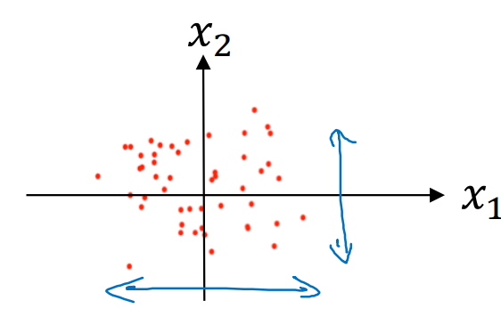

# Practical Aspects of Deep Learning

**Learning Objectives**
* Give examples of how different types of initializations can lead to different results
* Examine the importance of initialization in complex neural networks
* Explain the difference between train/dev/test sets
* Diagnose the bias and variance issues in your model
* Assess the right time and place for using regularization methods such as dropout or L2 regularization
* Explain Vanishing and Exploding gradients and how to deal with them
* Use gradient checking to verify the accuracy of your backpropagation implementation
* Apply zeros initialization, random initialization, and He initialization
* Apply regularization to a deep learning model

## Train / Dev / Test sets
When training NN, there is a lot of decisions to make:
* Number of layers
* Number of hidden units
* Learning rates
* What activation functions to use
* etc

Applied ML is a highly iterative process.


* Start with an idea (Build NN with certain # of layers, # of hidden units, dataset, etc...)
* Code it up and try it by running the code.
* Run an experiment and get back a result that can tell how well this particular network or this particular configuration works.
* Based on the outcome, refine the ideas, change the choices and keep iterating to try ti find a better NN.

DL has great success in: Natural Language Processing, Computer Vision, Speech Recognition, Structural data (ads, web search (shopping websites or any website that wants to deliver great search results when you enter terms into a search bar), computer security, logistic, etc...)...

-> Even very experienced deep learning people find it almost impossible to correctly guess the best choice of hyperparameters the very first time. And so today, applied deep learning is a very iterative process where you just have to go around this cycle many times to hopefully find a good choice of network for your application.

Data can be devided in 3 sets:
* Training set
* Hold-out cross validation set (development set)(dev set)
* Test set


1. Training algorithms on training set
2. Use dev set to see which of many different models performs best on dev set.
3. After having done the above 2 steps long enough, take the best model and evaluate it on test set.

Dev set needs to be big enough to evalute two different algorithm choices or ten different algorithm choices and quickly decide which one is doing better.

The main goal of your test set is, given your final classifier, to give you a pretty confident estimate of how well it's doing. 

With small dataset: 70/30/0 or 60/20/20

With big dataset:

Example: We have 1 000 000 examples, then only 10 000 can be used for dev set and 10 000 can be used for test set.

-> 98% training, 1% dev and 1% test

If we have even more than 1 000 000 examples, then

-> 99.5% training, 0.4% dev and 0.1% test

Let's say you're building an app that lets users upload a lot of pictures and your goal is to find pictures of cats in order to show your users. Maybe all your users are cat lovers. 

Mismatched train/test distribution
* Training set: Cat pictures from webpages
* Dev/test sets: Cat pictures from users using your app

Turns out a lot of webpages have very high resolution, very professional, very nicely framed pictures of cats. But maybe your users are uploading, you know, blurrier, lower res images just taken with a cell phone camera in a more casual condition. And so these two distributions of data may be different.

-> **Make sure dev and test sets come from the same distribution**

Because you will be using the dev set to evaluate a lot of different models and trying really hard to improve performance on the dev set, it's nice if your dev set comes from the same distribution as your test set.

Because deep learning algorithms have such a huge hunger for training data, one trend I'm seeing is that you might use all sorts of creative tactics, such as crawling webpages, in order to acquire a much bigger training set than you would otherwise have. Even if part of the cost of that is then that your training set data might not come from the same distribution as your dev and test sets. But you find that so long as you follow this rule of thumb, that progress in your machine learning algorithm will be faster.

Not having a test set might be okay. (Only dev set).

Remember, the goal of the test set is to give you a unbiased estimate of the performance of your final network, of the network that you selected. But if you don't need that unbiased estimate, then it might be okay to not have a test set. So what you do, if you have only a dev set but not a test set, is you train on the training set and then you try different model architectures. Evaluate them on the dev set, and then use that to iterate and try to get to a good model. Because you've fit your data to the dev set, this no longer gives you an unbiased estimate of performance. But if you don't need one, that might be perfectly fine.

In the machine learning world, when you have just a train and a dev set but no separate test set, most people will call this a training set and they will call the dev set the test set. But what they actually end up doing is using the test set as a hold-out cross validation set. Which maybe isn't completely a great use of terminology, because they're then overfitting to the test set. So when the team tells you that they have only a train and a test set, I would just be cautious and think, do they really have a train dev set? Because they're overfitting to the test set. Culturally, it might be difficult to change some of these team's terminology and get them to call it a trained dev set rather than a trained test set, even though I think calling it a train and development set would be more correct terminology. And this is actually okay practice if you don't need a completely unbiased estimate of the performance of your algorithm

## Bias / Variance


Let's say you have a data set that looks like this. If you fit a straight line to the data, maybe you get a logistic regression fit to that. This is not a very good fit to the data, and so there's a cause of high bias. Or we say that this is underfitting the data. 


On the opposite end, if you fit an incredibly complex classifier, maybe a deep neural network. Or a new network with a lot of hidden units, maybe you can fit the data perfectly. But that doesn't look like a great fit either. So this is a classifier with high variance, and this is overfitting the data.


And there might be some classifier in between with a medium level of complexity that maybe fits a curve like that. That looks like a much more reasonable fit to the data. So that's the, and call that just right somewhere in each tree.

So in a 2d example like this, with just two features, x1 and x2, you can plot the data and visualize bias and variance. In high dimensional problems, you can't plot the data and visualize the decision boundary.


The two key numbers to look at to understand bias and variance will be:
* The trading set error.
* The dev set, or the development set error.

So, for the sake of argument, let's say that recognizing cats in pictures is something that people can do nearly perfectly, right? And so let's say your trading size error is 1% and your dev set error is, for the sake of argument, let's say, is 11%. So in this example, you're doing very well on the training set, but you're doing relatively poorly on the development set. So this looks like you might have overfit the training set. That somehow you're not generalizing well to this holdout cost validation set to development set. And so if you have an example like this, we will say this has high variance. So by looking at the training set error and the development set error, you would be able to render a diagnosis of your algorithm having high variance. 

Now let's say that you measure your training set in your dev set error and you get a different result. Let's say that your training set error is 15%. I'm writing your training set error in the top row and your dev set error is 16%. In this case, assuming that humans achieve roughly 0% error, that humans can look at these pictures and just tell if it's cat or not. Then it looks like the algorithm is not even doing very well on the training set. So if it's not even fitting the training data, as seen that well, then this is underfitting the data. And so this algorithm has high bias. 

But in contrast, this is actually generalizing at a reasonable level to the dev set, whereas performance of the dev set is only 1% worse as performance on the training set. So this algorithm has a problem of high bias because it's not even training, it's not even fitting the training set well. This is similar to the leftmost plot we had on the previous slide. 

Now here's another example. Let's say that you have 15% training set error. So that's pretty high bias. But when you evaluate on a dev set, it does even worse, maybe it does 30%. In this case, I would diagnose this algorithm as having high bias because it's not doing that well on the training set and high variance. So this is really the worst of both worlds. 

And one last example, if you have 0.5 training set error and 1% dev set error. Then maybe our users are quite happy that you have a cat costly with only 1% error, then this would have low bias and low variance. One subtlety that I'll just briefly mention, but we'll leave to a later video to discuss in detail. 

One subtlety that I'll just briefly mention, but we'll leave to a later video to discuss in detail is that this analysis is predicated on the assumption that human level performance gets nearly 0% error. Or more generally they're the optimal error, sometimes called Bayes error for the so the bayesian optimal error is nearly 0%. 


But it turns out that if the optimal error or the Bayes error were much higher, say it were 15%. Then if you look at this classifier, 15% is actually perfectly reasonable for training set. And you wouldn't say it as high bias and also have pretty low variance. So the case of how to analyze bias and variance when no classifier can do very well. For example, if you have really blurry images so that even a human or just no system could possibly do very well. Then maybe Bayes error is much higher. And then there's some details of how this analysis will change. 

But leaving aside this subtlety for now, the takeaway is that by looking at your trading set error. You can get a sense of how well you're fitting at least the training data. And so that tells you if you have a bias problem. And then looking at how much higher your error goes when you go from the training set to the dev set. That should give you a sense of how bad is the variance problem. So are you doing a good job generalizing from the training set to the dev set that gives you a sense of your variance? All this is under the assumption that the Bayes error is quite small and that your train and your dev sets are drawn from the same distribution.


So you remember we said that a classifier like this, a linear classifier, has high bias because it under fits the data. So this would be a classifier that is mostly linear and therefore under fits the data. We'll join this in purple. But if somehow your classifier does some weird things, then it's actually overfitting parts of the data as well. So the classifier that I drew in purple has both high bias and high variance. There's high bias because by being a mostly linear classifier, it's just not fitting this quadratic light shape that well. But by having too much flexibility in the middle, it somehow gets this example. And this example overfits those two examples as well. So this classifier kind of has high bias because it was mostly linear, but you needed maybe a curve function, a quadratic function. 

And it has high variance because it had too much flexibility to fit those two mislabeled outlier examples in the middle as well. In case this seems contrived, well, it is. This example is a little bit contrived in two dimensions, but with very high dimensional inputs. You actually do get things with high bias in some regions and high variance in some regions. And so it is possible to get cross files like this in high dimensional inputs that seem less contrived.

* Bias — The model’s assumptions are too strong → can’t capture the real pattern. Error from wrong assumptions. Model is too simple. (Using a straight line to fit a curved trend.)
* Variance — The model changes too much when given different data → it’s too sensitive. Error from too much sensitivity to training data. Model is too complex. (Drawing a zigzag line through every single data point.)

* Bias wants to simplify (too much = underfit)
* Variance wants to memorize (too much = overfit)

Imagine we have data points that form a curved pattern, like this:
```
  ^
y |       *
  |    *      *
  |  *          *
  | *              *
  ------------------------>
                   x
```

1. High Bias, Low Variance — Underfitting

A simple straight line: y=ax + b

Behavior:
* The line is too simple to capture the curve.
* It misses the overall shape — makes big errors everywhere.
* But every time we retrain on different data, it still gives a similar straight line.

```
  ^
y |       *
  |    *      *
  |  *    ---line---*
  | *              *
  ------------------------>
```

Meaning:
* High bias: strong assumption (data must be linear).
* Low variance: small data changes don’t affect the line much.
* Result: always wrong in the same way.

Like using a ruler to draw a straight line through a banana 🍌 — it’ll never fit.

1. Low Bias, High Variance — Overfitting

A very flexible curve, e.g., a high-degree polynomial.

Behavior:
* The curve passes exactly through every data point.
* It learns even the noise in the data.
* When we use new data, the curve shape changes completely.
```
  ^
y |      *  
  |   *---*---*
  |  *   \_/   *
  | *__--     --__*
  ------------------------>
```

Meaning:
* Low bias: model flexible enough to learn almost anything.
* High variance: small data change causes big curve change.
* Result: great on training data, poor on test data.

Like memorizing exam questions — perfect on training, fails on new tests.

3. Low Bias, Low Variance — Good Fit (Ideal)

A moderately flexible function, maybe a quadratic:
* It captures the general curve well.
* Doesn’t follow every tiny noise point.
* If data changes a bit, curve stays mostly the same.

```
  ^
y |       *
  |    *      *
  |  *   ---curve---*
  | *              *
  ------------------------>
```

Meaning:
* Low bias: model can represent real trend.
* Low variance: stable results on new data.
* Result: generalizes well.

Like understanding concepts, not just memorizing examples.

4. High Bias, High Variance — Worst Case

Modle:
* Either model is too simple and unstable (e.g., bad hyperparameters).
* Or training data is too small or too noisy.

```
  ^
y |  *       *
  |   *   *
  |    line moves randomly
  ------------------------>
```

Meaning:
* High bias: can’t capture shape.
* High variance: changes drastically each time.
* Result: unpredictable and inaccurate.

|Type|	Bias|	Variance|	Behavior|	Solution|
|-|-|-|-|-|
|High Bias, Low Variance|	High|	Low|	Underfitting	|Add layers, features, train longer|
|Low Bias, High Variance|	Low	|High|	Overfitting|	Use more data, regularization, dropout|
|High Bias, High Variance|	High|	High|	Bad model|	Redesign model|
|Low Bias, Low Variance|	Low|	Low|	Ideal	|Great generalization|

## Basic Recipe for Machine Learning
After having trained in an initial model, I will first ask, does your algorithm have high bias? And so, to try and evaluate if there is high bias, you should look at, really, the training set or the training data performance. And so, if it does have high bias, does not even fitting in the training set that well, some things you could try would be to try pick a network, such as more hidden layers or more hidden units, or you could train it longer, you know, maybe run trains longer or try some more advanced optimization algorithms, or maybe find a new NN architecture that's better suited for this problem (this maybe works, maybe not). Getting a bigger networks almost always helps. Training longer doesn't always help, but it doesn't hurt. Keep doing this until we get rid of high bias problem.

Usually, if you have a big enough network, you should usually be able to fit the training data well, so long as it's a problem that is possible for someone to do, alright? If the image is very blurry, it may be impossible to fit it, but if at least a human can do well on the task, if you think Bayes error is not too high, then by training a big enough network you should be able to, hopefully, do well, at least on the training set, to at least fit or overfit the training set. 

Once you've reduce bias to acceptable amounts, I will then ask, do you have a variance problem? And so to evaluate that I would look at dev set performance. Are you able to generalize, from a pretty good training set performance, to having a pretty good dev set performance? 

And if you have high variance, well, best way to solve a high variance problem is to get more data, if you can get it, this, you know, can only help. But sometimes you can't get more data. Or, you could try regularization, to try to reduce overfitting. And then also, again, sometimes you just have to try it. But if you can find a more appropriate neural network architecture, sometimes that can reduce your variance problem as well, as well as reduce your bias problem. But how to do that? It's harder to be totally systematic how you do that. 

I try these things and I kind of keep going back, until, hopefully, you find something with both low bias and low variance, whereupon you would be done. 

A couple of points to notice. 
* First, is that depending on whether you have high bias or high variance, the set of things you should try could be quite different.  I'll usually use the training dev set to try to diagnose if you have a bias or variance problem, and then use that to select the appropriate subset of things to try. For example, if you actually have a high bias problem, getting more training data is actually not going to help. Or, at least it's not the most efficient thing to do, alright? So being clear on how much of a bias problem or variance problem or both, can help you focus on selecting the most useful things to try. 
* Second, in the earlier era of machine learning, there used to be a lot of discussion on what is called the bias variance tradeoff. And the reason for that was that, for a lot of the things you could try, you could increase bias and reduce variance, or reduce bias and increase variance. But, back in the pre-deep learning era, we didn't have many tools, we didn't have as many tools that just reduce bias, or that just reduce variance without hurting the other one. But in the modern deep learning, big data era, so long as you can keep training a bigger network, and so long as you can keep getting more data, which isn't always the case for either of these, but if that's the case, then getting a bigger network almost always just reduces your bias, without necessarily hurting your variance, so long as you regularize appropriately. And getting more data, pretty much always reduces your variance and doesn't hurt your bias much. 

So what's really happened is that, with these two steps, the ability to train, pick a network, or get more data, we now have tools to drive down bias and just drive down bias, or drive down variance and just drive down variance, without really hurting the other thing that much. And I think this has been one of the big reasons that deep learning has been so useful for supervised learning, that there's much less of this tradeoff where you have to carefully balance bias and variance, but sometimes, you just have more options for reducing bias or reducing variance, without necessarily increasing the other one. 

And, in fact, so last, you have a well-regularized network. Training a bigger network almost never hurts. And the main cost of training a neural network that's too big is just computational time, so long as you're regularizing. 


## Regularization
If you suspect your neural network is overfitting your data, that is, you have a high variance problem, one of the first things you should try is probably regularization. The other way to address high variance is to get more training data that's also quite reliable. But you can't always get more training data, or it could be expensive to get more data. But adding regularization will often help to prevent overfitting, or to reduce variance in your network.

Recall that for logistic regression, you try to minimize the cost function J.

$J(w,b) = {1 \over m} \Sigma_{i=1}^m \ell(\hat{y}^{(i)}, y^{(i)})$ 

To add regularization to logistic regression, what you do is add to it, this thing, lambda, which is called the regularization parameter.

$J(w,b) = {1 \over m} \Sigma_{i=1}^m \ell(\hat{y}^{(i)}, y^{(i)}) + {\lambda \over 2m}||w||^2_2$ 

w is $n_x$ dimensional parameter vector and b is a real number

$||w||^2_2 = \Sigma_{i=1}^{n_x} w^2_j = w^Tw$

Square Euclidean norm of the prime to vector w.

This is called L2 regularization because here we are using the Euclidean norm, or L2 norm with the parameter vector w.

Why do you regularize just the parameter w? Why don't we add something here, you know, about b as well? In practice, you could do this, but I usually just omit this. Because if you look at your parameters, w is usually a pretty high dimensional parameter vector, especially with a high variance problem. Maybe w just has a lot of parameters, so you aren't fitting all the parameters well, whereas b is just a single number. So almost all the parameters are in w rather than b. And if you add this last term, in practice, it won't make much of a difference, because b is just one parameter over a very large number of parameters. 


L2 regularization is the most common type of regularization. You might have also heard of some people talk about L1 regularization. And that's when you add, instead of this L2 norm, you instead add a term that is lambda over m of sum over, of this. 

${\lambda \over 2m}\Sigma_{j=1}^{n_x} |w| = {\lambda \over 2m} ||w||_1$

If you use L1 regularization, then w will end up being sparse. And what that means is that the w vector will have a lot of zeros in it. And some people say that this can help with compressing the model, because the set of parameters are zero, then you need less memory to store the model. Although, I find that, in practice, L1 regularization, to make your model sparse, helps only a little bit. So I don't think it's used that much, at least not for the purpose of compressing your model. And when people train your networks, L2 regularization is just used much, much more often. 

$\lambda$ is regularization parameter. And usually, you set this using your development set, or using hold-out cross validation. When you try a variety of values and see what does the best, in terms of trading off between doing well in your training set versus also setting that two normal of your parameters to be small, which helps prevent over fitting. So lambda is another hyper parameter that you might have to tune. And by the way, for the programming exercises, lambda is a reserved keyword in the Python programming language. So we use lambd so as not to clash with the reserved keyword in Python.


In Neural Network

$J(w^{[1]}, b^{[1]}, ..., w^{[L]}, b^{[L]}) = {1 \over m}\Sigma_{i=1}^m \ell(\hat{y}^{(i)}, y^{(i)}) + {\lambda \over 2m} \Sigma_{l=1}^L||w^{[l]}||^2$

$||w^{[l]}||^2_F = \Sigma_{i=1}^{n^{[l]}} \Sigma_{j=1}^{n^{[l-1]}}(w^{[l]}_{ij})^2$

w : $(n^{[l]}, n^{[l-1]})$ dimensional matrix

The rows "i" of the matrix should be the number of neurons in the current layer $n^{[l]}$.

The columns "j" of the weight matrix should equal the number of neurons in the previous layer $n^{[l-1]}$.

So this matrix norm, it turns out is called the "Frobenius norm" of the matrix, denoted with a F in the subscript.

For arcane linear algebra technical reasons, this is not called the, you know, l2 norm of a matrix. Instead, it's called the Frobenius norm of a matrix. I know it sounds like it would be more natural to just call the l2 norm of the matrix, but for really arcane reasons that you don't need to know, by convention, this is called the Frobenius norm. It just means the sum of square of elements of a matrix.

Compute gradient descent
* $dw^{[l]} = (from backprop) + {\lambda \over m} w^{[l]}$
* $w^{[l]} := w^{[l]} - \alpha ((from backprop) + {\lambda \over m} w^{[l]})$
  * $w^{[l]} := w^{[l]} - {\alpha \lambda \over m}w^{[l]} - \alpha (frombackprop)$

backprop is partial derivative of J with respect to w.

L2 regularization is sometimes called "weight decay".

This term shows that whatever the matrix $w^{[l]}$ is, you're going to make it a little bit smaller. This is actually as if you're taking the matrix w and you're multiplying it by 1 minus alpha lambda over m. ($(1-{\alpha \lambda \over m})$)

You're really taking the matrix w and subtracting alpha lambda over m times this. Like you're multiplying the matrix w by this number, which is going to be a little bit less than 1. 

So this is why L2 norm regularization is also called weight decay. Because it's just like the ordinary gradient descent, where you update w by subtracting alpha, times the original gradient you got from backprop. But now you're also, you know, multiplying w by this thing, which is a little bit less than 1. So the alternative name for L2 regularization is weight decay. I'm not really going to use that name, but the intuition for why it's called weight decay is that $(1-{\alpha \lambda \over m})w^{[l]} = w^{[l]} - {\alpha \lambda \over m}w^{[l]}$. So you're just multiplying the weight matrix by a number slightly less than 1. 


## Why Regularization Reduces Overfitting?
One piece of intuition is that if you crank your regularization lambda to be really, really big, that'll be really incentivized to set the weight matrices, W, to be reasonably close to zero. So one piece of intuition is maybe it'll set the weight to be so close to zero for a lot of hidden units that's basically zeroing out a lot of the impact of these hidden units. And if that's the case, then, you know, this much simplified neural network becomes a much smaller neural network. In fact, it is almost like a logistic regression unit, you know, but stacked multiple layers deep. 


And so that will take you from this overfitting case, much closer to the left, to the other high bias case. But, hopefully, there'll be an intermediate value of lambda that results in the result closer to this "just right" case in the middle.


The intuition is that by cranking up lambda to be really big, it'll set W close to zero, which, in practice, this isn't actually what happens. We can think of it as zeroing out, or at least reducing, the impact of a lot of the hidden units, so you end up with what might feel like a simpler network, that gets closer and closer as if you're just using logistic regression. 

The intuition of completely zeroing out a bunch of hidden units isn't quite right. It turns out that what actually happens is it'll still use all the hidden units, but each of them would just have a much smaller effect. But you do end up with a simpler network, and as if you have a smaller network that is, therefore, less prone to overfitting. 


g(z) = tanh(Z)

Notice that so long as z is quite small, so if z takes on only a smallish range of parameters, maybe around here


Then you're just using the linear regime of the tanh function, is only if z is allowed to wander, you know, to larger values or smaller values like so, that the activation function starts to become less linear. So the intuition you might take away from this is that if lambda, the regularization parameter is large, then you have that your parameters will be relatively small, because they are penalized being large in the cost function. And so if the weights, W, are small, then because z is equal to W, right, and then technically, it's plus b. 

$z^{[l]} = W^{[l]}a^{[l-1]} + b^{[l]}$

But if W tends to be very small, then z will also be relatively small. And in particular, if z ends up taking relatively small values, just in this little range, then g of z will be roughly linear. So it's as if every layer will be roughly linear, as if it is just linear regression. And we saw in course one that if every layer is linear, then your whole network is just a linear network. And so even a very deep network, with a deep network with a linear activation function is, at the end of the day, only able to compute a linear function. So it's not able to, you know, fit those very, very complicated decision, very non-linear decision boundaries that allow it to really overfit to data sets, like we saw on the overfitting high variance case on the previous slide.

So just to summarize, if the regularization parameters are very large, the parameters W very small, so z will be relatively small, kind of ignoring the effects of b for now, but so z is relatively, so z will be relatively small, or really, I should say it takes on a small range of values. And so the activation function if it's tan h, say, will be relatively linear. And so your whole neural network will be computing something not too far from a big linear function, which is therefore, pretty simple function, rather than a very complex highly non-linear function. And so, is also much less able to overfit.


When implementing regularization, we took our definition of the cost function J and we actually modified it by adding this extra term that penalizes the weights being too large. And so if you implement gradient descent, one of the steps to debug gradient descent is to plot the cost function J, as a function of the number of elevations of gradient descent, and you want to see that the cost function J decreases monotonically after every elevation of gradient descent. And if you're implementing regularization, then please remember that J now has this new definition. 


If you plot the old definition of J, just this first term, then you might not see a decrease monotonically. So to debug gradient descent, make sure that you're plotting this new definition of J that includes this second term as well.

## Dropout Regularization


Let's say we train a NN and there is over-fitting.

With dropout, what we're going to do is go through each of the layers of the network and set some probability of eliminating a node in neural network. Let's say that for each of these layers, we're going to- for each node, toss a coin and have a 0.5 chance of keeping each node and 0.5 chance of removing each node. So, after the coin tosses, maybe we'll decide to eliminate those nodes, then what you do is actually remove all the outgoing things from that no as well.


So you end up with a much smaller, really much diminished network. And then you do back propagation training.


And then on different examples, you would toss a set of coins again and keep a different set of nodes and then dropout or eliminate different set of nodes. And so for each training example, you would train it using one of these new networks.

Maybe it seems like a slightly crazy technique. They just go around coding those are random, but this actually works. But you can imagine that because you're training a much smaller network on each example, maybe just give a sense for why you end up able to regularize the network, because these much smaller networks are being trained.

### Implement dropout ("Inverted dropout")
Illustrate with layer l = 3

Let d3 to be the dropout vector for the layer 3

d3 = np.random.randn(a3.shape[0], a3.shape[1]) < keep_prop

keep_prob is a number. It was 0.5 on the previous time, and maybe now I'll use 0.8 in this example, and it will be the probability that a given hidden unit will be kept. keep.prob = 0.8, then this means that there's a 0.2 chance of eliminating any hidden unit.

We generate the same-shaped matrix of uniform random numbers in [0,1), for example:
```lua
rand =
[[0.549, 0.715, 0.603],
 [0.545, 0.424, 0.646],
 [0.438, 0.892, 0.964],
 [0.383, 0.792, 0.529],
 [0.568, 0.926, 0.071]]
```
Then compare each element with keep_prob = 0.8 using <:
```python
d3_bool = rand < keep_prob
```
This yields a boolean mask: True when rand < 0.8 (keep), False when rand ≥ 0.8 (drop).

```mathematica
d3_bool =
[[ True  True  True],
 [ True  True  True],
 [ True False False],
 [ True False  True],
 [ True False  True]]
```
As integers (1=keep, 0=drop):

```lua
d3_int =
[[1 1 1],
 [1 1 1],
 [1 0 0],
 [1 0 1],
 [1 0 1]]
```

Each random number is independent and uniform in [0,1). P(rand < keep_prob) = keep_prob. So each element independently has probability keep_prob to be True (kept).

What it does is it generates a random matrix. And this works as well if you have vectorized. So d3 will be a matrix. Therefore, each example have a each hidden unit there's a 0.8 chance that the corresponding d3 will be one, and a 20% chance there will be zero. So, this random numbers being less than 0.8 it has a 0.8 chance of being 1 or be true, and 20% or 0.2 chance of being false, of being 0. 

And then what you are going to do is take your activations from the third layer, let me just call it a3 in this example. 

a3 = np.multiply(a3,d3) # a3 *= d3

What this does is for every element of d3 that's equal to zero. And there was a 20% chance of each of the elements being zero, just multiply operation ends up zeroing out the corresponding element of d3.

```ini
a3 =
[[0.2 0.4 0.1]
 [0.5 0.6 0.2]
 [0.9 0.1 0.3]
 [0.0 0.7 0.8]
 [0.3 0.2 0.9]]
```
This zeros out dropped neurons:
```lua
a3_dropped = a3 * d3_int =
[[0.2 0.4 0.1],
 [0.5 0.6 0.2],
 [0.9 0.0 0.0],
 [0.0 0.0 0.8],
 [0.3 0.0 0.9]]
```

Notice entries where d3_int is 0 became 0 in a3_dropped.

If you do this in python, technically d3 will be a boolean array where value is true and false, rather than 1 and 0. But the multiply operation works and will interpret the true and false values as 1 and 0. 

a3 /= keep_prop

We divide the remaining (kept) activations by keep_prob:
```lua
a3_scaled = a3_dropped / 0.8 =
[[0.25  0.5   0.125],
 [0.625 0.75  0.25 ],
 [1.125 0.    0.   ],
 [0.    0.    1.00 ],
 [0.375 0.    1.125]]
```

Let say we have 50 units or 50 neurons in the 3rd hidden layer. So a3 is 50 by 1 dimensional or 50 by m dimensional if we vectorize it. If we have a 80% chance of keeping them and 20% chance of eliminating them, this means on average, you end up with 10 units shut off and 10 units zeroed out.

$z^{[4]} = W^{[4]}a^{[3]} + b^{[4]}$

On expectation, $a^{[3]}$ will be reduced by 20%, meaning 20% of a3 will be zeroed out.

In order to not reduce the expected value of $z^{[4]}$, what you do is you need to take $a^{[3]}$, and divide it by 0.8 because this will correct or just a bump that back up by roughly 20% that you need. So it does not change the expected value of a3. 

And, so this line here is what's called the inverted dropout technique. And its effect is that, no matter what you set to keep_prob to, whether it's 0.8 or 0.9 or even 1, if it's set to 1 then there's no dropout, because it's keeping everything 0.5 or whatever, this inverted dropout technique by dividing by the keep_prob, it ensures that the expected value of a3 remains the same.

It turns out that at test time, when you trying to evaluate a neural network, this inverted dropout technique makes test time easier because you have less of a scaling problem. 

By far the most common implementation of dropouts today as far as I know is inverted dropouts. 

But there were some early iterations of dropout that missed this divide by keep_prob line, and so at test time the average becomes more and more complicated. But again, people tend not to use those other versions. 

So, what you do is you use the d vector, and you'll notice that for different training examples, you zero out different hidden units. And in fact, if you make multiple passes through the same training set, then on different passes through the training set, you should randomly zero out different hidden units. So, it's not that for one example, you should keep zeroing out the same hidden units is that, on iteration one of grade and descent, you might zero out some hidden units. And on the second iteration of great descent where you go through the training set the second time, maybe you'll zero out a different pattern of hidden units. And the vector d or d3, for the third layer, is used to decide what to zero out, both in forward prop as well as in back prop. We are just showing forward prop here.

### Making predictions at test time

At test time, you're given some X of which you want to make a prediction.

$a^{[0]} = X$

Not use dropout at test time

* $z^{[1]} = W^{[1]}a^{[0]} + b^{[1]}$
* $a^{[1]} = g^{[1]}(z^{[1]})$
* $z^{[2]} = W^{[2]}a^{[1]} + b^{[2]}$
* $a^{[2]} = g^{[2]}(z^{[2]})$
* So on until we get to the last layer and that we make a prediction with $\hat{y}$

But notice that the test time you're not using dropout explicitly and you're not tossing coins at random, you're not flipping coins to decide which hidden units to eliminate. And that's because when you are making predictions at the test time, you don't really want your output to be random. 

If you are implementing dropout at test time, that just add noise to your predictions. In theory, one thing you could do is run a prediction process many times with different hidden units randomly dropped out and have it across them. But that's computationally inefficient and will give you roughly the same result; very, very similar results to this different procedure as well. And just to mention, the inverted dropout thing, you remember the step on the previous line when we divided by the keep_prob. The effect of that was to ensure that even when you don't see men dropout at test time to the scaling, the expected value of these activations don't change. So, you don't need to add in an extra funny scaling parameter at test time. That's different than when you have that training time.

Dropout is a regularization technique used to prevent overfitting.

In training, we randomly turn off some neurons (set their activations to 0) so the network doesn’t depend too much on any single neuron. During testing (inference), we use all neurons — but scaled appropriately.

The “inverted” part simply means: We scale the remaining neurons during training, so we don’t have to do any scaling at test time.

#### Why divide by keep_prob? (the expectation argument)

Let a be a single activation value, and let d be the dropout mask for that element (1 with probability p=keep_prob, 0 otherwise). After applying inverted dropout we get:


Take expectation over the randomness of d:


So the expected (average) post-dropout activation equals the original activation a. This ensures that, on average, the scale of activations is the same during training (so we don't have to rescale at test time).

## Understanding Dropout
Drop out randomly knocks out units in your network. So it's as if on every iteration you're working with a smaller neural network. And so using a smaller neural network seems like it should have a regularizing effect. 

Let's look at it from the perspective of a single unit. N


For this unit to do his job has four inputs and it needs to generate some meaningful output. Now with drop out, the inputs can get randomly eliminated. Sometimes those two units will get eliminated. Sometimes a different unit will get eliminated. So what this means is that this unit which I'm circling purple.

It can't rely on anyone feature because anyone feature could go away at random or anyone of its own inputs could go away at random.

So in particular, I will be reluctant to put all of its bets on say just this input, right. The ways were reluctant to put too much weight on anyone input because it could go away. So this unit will be more motivated to spread out this ways and give you a little bit of weight to each of the four inputs to this unit. And by spreading out the weights this will tend to have an effect of shrinking the squared norm of the weights, and so similar to what we saw with L2 regularization. The effect of implementing dropout is that its strength the ways and similar to L2 regularization, it helps to prevent overfitting, but it turns out that dropout can formally be shown to be an adaptive form of L2 regularization, but the L2 penalty on different ways are different depending on the size of the activation is being multiplied into that way. But to summarize it is possible to show that dropout has a similar effect to. 

Deep nets with many hidden units can overfit: they learn spurious patterns tied to the training set that don’t generalize.

Some hidden units may co-adapt: they become overly reliant on each other.

Dropout breaks these co-adaptations by randomly “dropping” units during training, so each unit must work somewhat independently.

“Dropout makes a network behave like many different “thinned” networks and then average them at test time.”

Let’s imagine one neuron (let’s call it N) in your neural network.
This neuron has four inputs coming in — like this:

```css
input1 → \
input2 →  \
input3 →   → [ N ] → output
input4 →  /
```

Each input has a weight (W₁, W₂, W₃, W₄).
These weights decide how much the neuron listens to each input.

So normally, N computes:

```ini
output = W₁*x₁ + W₂*x₂ + W₃*x₃ + W₄*x₄
```

Now, dropout randomly turns off some inputs each time.

So sometimes:

```java
input1 and input3 are gone (dropped)
```

Other times:

```sql
input2 and input4 are gone
```

So for each training step, the neuron receives different combinations of inputs.

If you’re this neuron (N), you quickly learn:

“Hey, I can’t depend too much on any single input… because it might disappear next time!”

So instead of giving one input a huge weight (like W₃ = 10, and others = 0.1), you’ll spread your attention more evenly across all inputs.

That is, you’ll make:
```
W₁, W₂, W₃, W₄ more balanced
```

This spreading out of weights helps the network be less fragile and more general — it doesn’t collapse if one feature (input) is missing or noisy.

Let’s recall what L2 regularization (a.k.a. “weight decay”) does:

* It penalizes very large weights.
* This keeps the model from “overfitting” — memorizing data too precisely.

Now look at what dropout just did:
* It made the neuron reluctant to make any weight too large,
because that input could vanish at any time.
* So dropout ends up having the same effect: it reduces the size of weights, helping prevent overfitting.

That’s why Andrew says:

“Dropout is like an adaptive form of L2 regularization.”

The word adaptive means:

* The effect depends on how active each input is.
* Inputs that are often dropped or have smaller activations get slightly different penalty strengths — but the overall effect is like L2 regularization.

One more detail for when you're implementing dropout, here's a network where you have three input features. 


This is seven hidden units here. 7, 3, 2, 1, so one of the practice we have to choose was the keep prop which is a chance of keeping a unit in each layer. So it is also feasible to vary keep-propped by layer. So for the first layer, your matrix W1 will be 7 by 3. Your second weight matrix will be 7 by 7. W3 will be 3 by 7 and so on. And so W2 is actually the biggest weight matrix, right? Because they're actually the largest set of parameters. B and W2, which is 7 by 7. So to prevent, to reduce overfitting of that matrix, maybe for this layer, I guess this is layer 2, you might have a key prop that's relatively low, say 0.5, whereas for different layers where you might worry less about over 15, you could have a higher key problem. Maybe just 0.7, maybe this is 0.7. And then for layers we don't worry about overfitting at all. You can have a key prop of 1.0. Right? So, you know, for clarity, these are numbers I'm drawing in the purple boxes. These could be different key props for different layers. Notice that the key problem 1.0 means that you're keeping every unit, and so you're really not using drop out for that layer. But for layers where you're more worried about overfitting really the layers with a lot of parameters you could say keep_prop to be smaller to apply a more powerful form of dropout. It's kind of like cranking up the regularization. Parameter lambda of L2 regularization where you try to regularize some layers more than others.

Technically you can also apply drop out to the input layer where you can have some chance of just acting out one or more of the input features, although in practice, usually don't do that often. And so key problem of 1.0 is quite common for the input there. You might also use a very high value, maybe 0.9 but is much less likely that you want to eliminate half of the input features. So usually keep_prop, if you apply that all will be a number close to 1. If you even apply dropout at all to the input layer. 

To summarize, if you're more worried about some layers of fitting than others, you can set a lower key prop for some layers than others. The downside is this gives you even more hyperparameters to search for using cross validation. One other alternative might be to have some layers where you apply dropout and some layers where you don't apply drop out and then just have one hyper parameter which is a keep_prop for the layers for which you do apply drop out.

Many of the first successful implementations of dropouts were to computer vision, so in computer vision, the input sizes so big in putting all these pixels that you almost never have enough data. And so drop out is very frequently used by the computer vision and there are some common vision research is that pretty much always use it almost as a default. But really, the thing to remember is that drop out is a regularization technique, it helps prevent overfitting. And so unless my algorithm is overfitting, I wouldn't actually bother to use drop out. 

So as you somewhat less often in other application areas, there's just a computer vision, you usually just don't have enough data so you almost always overfitting, which is why they tend to be some computer vision researchers swear by drop out by the intuition.

One big downside of drop out is that the cost function J is no longer well defined on every iteration. You're randomly, calling off a bunch of notes. And so if you are double checking the performance of gradient descent is actually harder to double check that you have a well defined cost function J that is going downhill on every iteration. Because the cost function J that you're going to optimizing is actually less well defined and it's certainly hard to calculate. So you lose this debugging tool to have a plot a draft like this. So what I usually do is turn off drop out or if you will set keep-prop = 1 and run my code and make sure that it is monitored quickly decreasing J. And then turn on drop out and hope that, I didn't introduce bug to my code during drop out because you need other ways, I guess, but not plotting these figures to make sure that your code is working, the gradient descent is working even with drop out. 


## Other Regularization Methods

Let's say you fitting a cat classifier. If you are over fitting getting more training data can help, but getting more training data can be expensive and sometimes you just can't get more data. 

But what you can do is augment your training set by taking image like this. And for example, flipping it horizontally and adding that also with your training set. So now instead of just this one example in your training set, you can add this to your training example. 


So by flipping the images horizontally, you could double the size of your training set. Because you're training set is now a bit redundant this isn't as good as if you had collected an additional set of brand new independent examples. But you could do this Without needing to pay the expense of going out to take more pictures of cats. 

And then other than flipping horizontally, you can also take random crops of the image. So here we're rotated and sort of randomly zoom into the image and this still looks like a cat. So by taking random distortions and translations of the image you could augment your data set and make additional fake training examples. Again, these extra fake training examples they don't add as much information as they were to get a brand new independent example of a cat. But because you can do this, almost for free, other than for some computational costs. This can be an inexpensive way to give your algorithm more data and therefore sort of regularize it and reduce over fitting. 

Notice I didn't flip it vertically, because maybe we don't want upside down cats. And then also maybe randomly zooming in to part of the image it's probably still a cat. 

For optical character recognition you can also bring your data set by taking digits and imposing random rotations and distortions to it. So If you add these things to your training set, these are also still digit force.


For illustration I applied a very strong distortion. So this look very wavy number four, in practice you don't need to distort the four quite as aggressively, but just a more subtle distortion than what I'm showing here, to make this example clearer for you. But a more subtle distortion is usually used in practice, because this looks like really warped fours. So data augmentation can be used as a regularization technique, in fact similar to regularization. 

There's one other technique that is often used called early stopping. So what you're going to do is as you run gradient descent you're going to plot your, either the training error, you'll use 0 - 1 classification error on the training set. Or just plot the cost function J optimizing, and that should decrease monotonically.


So with early stopping, what you do is you plot this, and you also plot your dev set error. And again, this could be a classification error in a development sense, or something like the cost function, like the logistic loss or the log loss of the dev set. 


Now what you find is that your dev set error will usually go down for a while, and then it will increase from there. So what early stopping does is, you will say well, it looks like your neural network was doing best around that iteration, so we just want to stop training on your neural network halfway and take whatever value achieved this dev set error.

So why does this work? Well when you've haven't run many iterations for your neural network yet your parameters w will be close to zero. 


Because with random initialization you probably initialize w to small random values so before you train for a long time, w is still quite small.

And as you iterate, as you train, w will get bigger and bigger and bigger until here maybe you have a much larger value of the parameters w for your neural network. 


So what early stopping does is by stopping halfway you have only a mid-size rate w. 


And so similar to L2 regularization by picking a neural network with smaller norm for your parameters w, hopefully your neural network is over fitting less. And the term early stopping refers to the fact that you're just stopping the training of your neural network earlier. 

I sometimes use early stopping when training a neural network. But it does have 1 downside.

ML process comprises several steps:
1. An algorithm to optimize the cost function J and we have various tools to do that, such as gradien descent. (There are also momentum, RMS prop, Atom and so on)
2. We want it to not overfit. We have some tools such as regularization, getting more data, so on...

Now in machine learning, we already have so many hyper-parameters it surge over. It's already very complicated to choose among the space of possible algorithms. 

And so I find machine learning easier to think about when you have one set of tools for optimizing the cost function J, and when you're focusing on authorizing the cost function J. All you care about is finding w and b, so that J(w,b) is as small as possible. You just don't think about anything else other than reducing this. 

And then it's completely separate task to not over fit, in other words, to reduce variance. And when you're doing that, you have a separate set of tools for doing it. 

This principle is sometimes called **orthogonalization**. And there's this idea, that you want to be able to think about one task at a time. 

The main downside of early stopping is that this couples these two tasks. So you no longer can work on these two problems independently, because by stopping gradient decent early, you're sort of breaking whatever you're doing to optimize cost function J, because now you're not doing a great job reducing the cost function J. You've sort of not done that that well. And then you also simultaneously trying to not over fit. So instead of using different tools to solve the two problems, you're using one that kind of mixes the two. And this just makes the set of things you could try are more complicated to think about. 


Rather than using early stopping, one alternative is just use L2 regularization then you can just train the neural network as long as possible. I find that this makes the search space of hyper parameters easier to decompose, and easier to search over. 

The downside of this though is that you might have to try a lot of values of the regularization parameter lambda. And so this makes searching over many values of lambda more computationally expensive. 

The advantage of early stopping is that running the gradient descent process just once, you get to try out values of small w, mid-size w, and large w, without needing to try a lot of values of the L2 regularization hyperparameter lambda.

Despite it's disadvantages, many people do use it. I personally prefer to just use L2 regularization and try different values of lambda. That's assuming you can afford the computation to do so. But early stopping does let you get a similar effect without needing to explicitly try lots of different values of lambda.

## Normalizing Inputs
When training a neural network, one of the techniques to speed up your training is if you normalize your inputs.


Let's see the training sets with two input features. The input features x are two-dimensional and here's a scatter plot of your training set.

Normalizing inputs corresponds to 2 steps.
1. Subtract out or zero out the mean, so sets mu equals 1 over m, sum over i of $x_i$. This is a vector and then x gets set as x minus mu for every training example.


This means that you just move the training set until it has zero mean. 


2. Normalize the variances. Notice here that the feature x_1 has a much larger variance than the feature x_2 here. What we do is set sigma equals 1 over m sum of x_i star, star 2. I guess this is element-wise squaring. Now sigma squared is a vector with the variances of each of the features. Notice we've already subtracted out the mean, so x_i squared, element-wise square is just the variances. You take each example and divide it by this vector sigma.




Now the variance of x_1 and x_2 are both equal to one.

One tip. If you use this to scale your training data, then use the same mu and sigma to normalize your test set. In particular, you don't want to normalize the training set and a test set differently. Whatever this value is and whatever this value is, use them in these two formulas so that you scale your test set in exactly the same way rather than estimating mu and sigma squared separately on your training set and test set, because you want your data both training and test examples to go through the same transformation defined by the same Mu and Sigma squared calculated on your training data.


Why do we do this? Why do we want to normalize the input features?


It turns out that if you use unnormalized input features, it's more likely that your cost function will look like this, like a very squished out bar, very elongated cost function where the minimum you're trying to find is maybe over there.


But if your features are on very different scales, say the feature x_1 ranges from 1-1,000 and the feature x_2 ranges from 0-1, then it turns out that the ratio or the range of values for the parameters w_1 and w_2 will end up taking on very different values. Maybe these axes should be w_1 and w_2, but the intuition of plot w and b, cost function can be very elongated bow like that. If you plot the contours of this function, you can have a very elongated function like that. 


Whereas if you normalize the features, then your cost function will on average look more symmetric. 


If you are running gradient descent on a cost function like the unnormalized one, then you might have to use a very small learning rate because if you're here, the gradient decent might need a lot of steps to oscillate back and forth before it finally finds its way to the minimum. 


Whereas if you have more spherical contours, then wherever you start, gradient descent can pretty much go straight to the minimum. You can take much larger steps where gradient descent need, rather than needing to oscillate around like the picture on the left. Of course, in practice, w is a high dimensional vector.


Trying to plot this in 2D doesn't convey all the intuitions correctly. But the rough intuition that you cost function will be in a more round and easier to optimize when you're features are on similar scales. Not from 1-1000, 0-1, but mostly from -1 to 1 or about similar variance as each other. That just makes your cost function j easier and faster to optimize.

In practice, if one feature, say x_1 ranges from 0-1 and x_2 ranges from -1 to 1, and x_3 ranges from 1-2, these are fairly similar ranges, so this will work just fine, is when they are on dramatically different ranges like ones from 1-1000 and another from 0-1. That really hurts your optimization algorithm. That by just setting all of them to zero mean and say variance one like we did on the last slide, that just guarantees that all your features are in a similar scale and will usually help you learning algorithm run faster.

If your input features came from very different scales, maybe some features are from 0-1, sum from 1-1000, then it's important to normalize your features. If your features came in on similar scales, then this step is less important although performing this type of normalization pretty much never does any harm. Often you'll do it anyway, if I'm not sure whether or not it will help with speeding up training for your algorithm. That's it for normalizing your input features.

## Vanishing / Exploding Gradients

