# Optimization Algorithms

**Learning Objectives**
* Apply optimization methods such as (Stochastic) Gradient Descent, Momentum, RMSProp and Adam
* Use random minibatches to accelerate convergence and improve optimization
* Describe the benefits of learning rate decay and apply it to your optimization

- [Optimization Algorithms](#optimization-algorithms)
  - [Mini-batch Gradient Descent](#mini-batch-gradient-descent)
    - [Implement Mini-batch gradient descent](#implement-mini-batch-gradient-descent)
  - [Understanding Mini-batch Gradient Descent](#understanding-mini-batch-gradient-descent)
    - [Training with mini batch gradient descent](#training-with-mini-batch-gradient-descent)
    - [Choosing your mini-batch size](#choosing-your-mini-batch-size)
    - [Choosing your mini-batch size](#choosing-your-mini-batch-size-1)
  - [Exponentially Weighted Averages](#exponentially-weighted-averages)
    - [Temperature in London](#temperature-in-london)
  - [Exponentially weighted averages](#exponentially-weighted-averages-1)
  - [Understanding Exponentially Weighted Averages](#understanding-exponentially-weighted-averages)
    - [Exponentially weighted averages](#exponentially-weighted-averages-2)
    - [Implementing exponentially weighted averages](#implementing-exponentially-weighted-averages)
    - [ChatGPT](#chatgpt)
  - [Bias Correction in Exponentially Weighted Averages](#bias-correction-in-exponentially-weighted-averages)
    - [Bias correction](#bias-correction)
    - [Another explanation](#another-explanation)
  - [Gradient Descent with Momentum](#gradient-descent-with-momentum)
    - [Gradient descent example](#gradient-descent-example)
    - [Implementation details](#implementation-details)
  - [RMSprop](#rmsprop)
  - [Adam Optimization Algorithm](#adam-optimization-algorithm)
    - [Adam optimization algorithm](#adam-optimization-algorithm-1)
    - [Hyperparameters choice](#hyperparameters-choice)
    - [Where does the term Adam come from?](#where-does-the-term-adam-come-from)
  - [Learning Rate Decay](#learning-rate-decay)
    - [Learning rate decay](#learning-rate-decay-1)
    - [Other learning rate decay methods](#other-learning-rate-decay-methods)
  - [The Problem of Local Optima](#the-problem-of-local-optima)

## Mini-batch Gradient Descent
Vectorization allows you to efficiently compute on m examples.

Training example $X=[X^{(1)} X^{(2)} ... X^{(m)}]$ ($n_X$,m)

$Y=[Y^{(1)} Y^{(2)} ... Y^{(m)}]$ (1xm)

Vectorization allows you to process all M examples relatively quickly if M is very large then it can still be slow like when m=5,000,000 or even bigger.

Implementation of gradient descent:
- Process entire training set
- Take one little step of gradient descent.
- Repeat processing entire training set again.
- Then take another little step of gradient descent.

It turns out that you can get a faster algorithm if you let gradient descent start to make some progress even before you finish processing your entire, giant training sets of 5 million examples.

Split up your training set into smaller, little baby training sets and these baby training sets are called mini-batches. And let's say each of your baby training sets have just 1,000 examples each. 

* Take $X^{(1)}$ to $X^{(1000)}$ and call that your first little baby training set. We call it $X^{\{1\}}$ ($n_X$, 1000).
* Then take the next 1000 examples $X^{(1001)}$ to $X^{(2000)}$, call it $X^{\{2\}}$ ($n_X$, 1000).
* So on

If you have 5 million training samples total and each of these little mini batches has a thousand examples, that means you have 5,000 of these because 5,000 times 1,000 equals 5 million. Altogether you would have 5,000 of these mini batches. ($X^{\{5000\}}$)

Do similar for Y
* Take $Y^{(1)}$ to $Y^{(1000)}$ and call it $Y^{\{1\}}$ (1, 1000).
* Then $Y^{(1001)}$ to $Y^{(2000)}$, call it $Y^{\{2\}}$ (1, 1000).
* So on

Mini-batch t: $X^{\{t\}}$ and $Y^{\{t\}}$, that is a thousand training samples with the corresponding input output pairs.

**Note**:
* $x^{(i)}$ is i-th training example.
* $z^{[l]}$ is z value for the l-th layer of NN
* $X^{\{t\}}$ and $Y^{\{t\}}$ to index into different mini batches.

Batch gradient descent refers to the gradient descent algorithm we have been talking about previously, where you process your entire training set all at the same time. 

The name comes from viewing that as processing your entire batch of training samples all at the same time. I

Mini-batch gradient descent in contrast, refers to algorithm which you process is single mini batch $X^{\{t\}}$, $Y^{\{t\}}$ at the same time rather than processing your entire training set X Y the same time.

### Implement Mini-batch gradient descent
To run mini-batch gradient descent on your training sets you run for T equals 1 to 5,000 because we had 5,000 mini batches as high as 1,000 each. What are you going to do inside the For loop is basically implement one step of gradient descent using $X^{\{t\}}$, $Y^{\{t\}}$. It is as if you had a training set of size 1,000 examples and it was as if you were to implement the algorithm you are already familiar with, but just on this little training set size of M equals 1,000. Rather than having an explicit For loop over all 1,000 examples, you would use vectorization to process all 1,000 examples sort of all at the same time. 

for t = 1, ... , 5000:
> Forward prop on $X^{\{t\}}$ using vectorized implementation processing 1000 examples at a time instead of 5 milion examples.
>> $Z^{[1]} = W^{[1]}X^{\{t\}} + b^{[1]}$ \
>> $A^{[1]} = g^{[1]}(Z^{[1]})$ \
>> ... \
>> $A^{[L]} = g^{[L]}(Z^{[L]})$
>
> Compute cost $J^{\{t\}} = {1 \over 1000} \Sigma_{i=1}^l \ell(\hat{y}^{(i)}, y^{(i)}) + {\lambda \over {2*1000}} \Sigma_{l}||W^{[l]}||^2_F$ \
> $(\hat{y}^{(i)}, y^{(i)})$ refer to mini-batch examples $X^{\{t\}}$, $Y^{\{t\}}$ \
> This is the cost on just 1 mini-batch.
>
> Back prop to compute gradients with respect to $J^{\{t\}}$ (using $X^{\{t\}}$, $Y^{\{t\}}$) \
> $W^{[l]} = W^{[l]} - \alpha dW^{[l]}$ \
> $b^{[l]} = b^{[l]} - \alpha db^{[l]}$

L has been used previously to indicate the number of the layer in the network, in this particular example was also used to indicate the number of samples in the mini-batch.

Notice that everything we are doing is exactly the same as when we were previously implementing gradient descent except that instead of doing it on X Y, you're now doing it on $X^{\{t\}}$, $Y^{\{t\}}$.

The code written here is also called doing 1 epoch of training and epoch is a word that means a single pass through the training set.

Whereas with batch gradient descent, a single pass through the training set allows you to take only 1 gradient descent step. With mini-batch gradient descent, a single pass through the training set, that is 1 epoch, allows you to take 5,000 gradient descent steps. 

If you want to take multiple passes through the training set which you usually want to, you might want another for loop for another while loop out there. So you keep taking passes through the training set until hopefully you converge or at least approximately converged. 

When you have a large training set, mini-batch gradient descent runs much faster than batch gradient descent and that's pretty much what everyone in Deep Learning will use when you're training on a large data set.

## Understanding Mini-batch Gradient Descent
### Training with mini batch gradient descent

Batch gradient descent
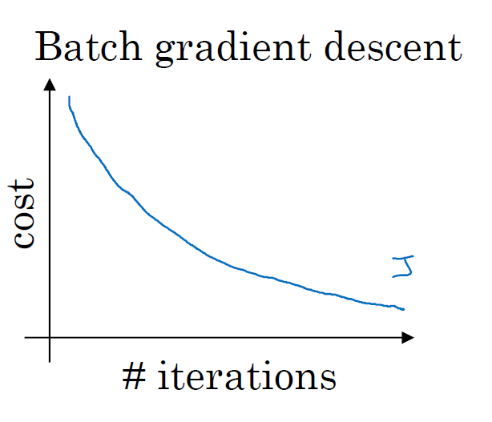

With batch gradient descent on every iteration you go through the entire training set and you'd expect the cost to go down on every single iteration. 

If it ever goes up even on iteration then something is wrong or maybe you're running ways to big.

Mini-batch gradient descent
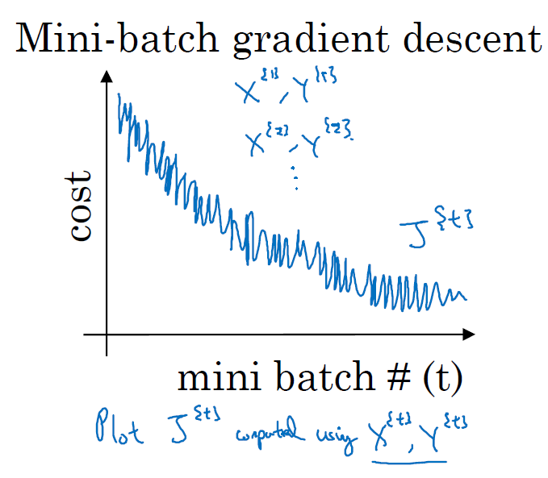

On mini batch gradient descent though, if you plot progress on your cost function, then it may not decrease on every iteration. On every iteration, you're processing some $X^{\{t\}}$, $Y^{\{t\}}$, if we plot $J^{\{t\}}$, then it's as if on every iteration, you're training on a different training set or different mini batch. 

It's okay if it doesn't go down on every iteration but it should trend downwards.

_The reason it'll be a little bit noisy is that, maybe $X^{\{1\}}$, $Y^{\{1\}}$ is just relatively easy mini batch so your cost might be a bit lower, but then maybe just by chance, $X^{\{2\}}$, $Y^{\{2\}}$ is just a harder mini batch. Maybe you needed some mislabeled examples in it, in which case the cost will be a bit higher and so on._

### Choosing your mini-batch size
* If mini-batch size = m: Batch gradient descent. ($X^{\{1\}}$, $Y^{\{1\}}$) = (X, Y)
* If mini-batch size = 1: Stochastic gradient descent. Every example is it's own mini-batch. It's looking at a single training example at a time.
  * ($X^{\{1\}}$, $Y^{\{1\}}$) = ($x^{(1)}$, $y^{(1)}$) which is the first training example.
  * ($X^{\{2\}}$, $Y^{\{2\}}$) = ($x^{(2)}$, $y^{(2)}$) which is the 2nd training example.

The contours of the cost function you're trying to minimize, batch gradient descent might start somewhere and be able to take relatively low noise, relatively large steps.

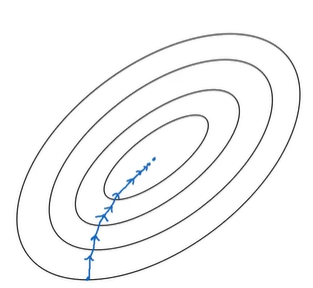

In contrast with stochastic gradient descent, if you start somewhere, then on every iteration you're taking gradient descent with just a single strain example so most of the time you hit to at the global minimum, but sometimes you hit the wrong direction if that one example happens to point to a bad direction.

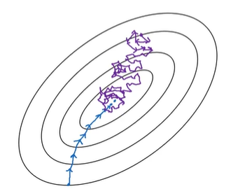

So stochastic gradient descent can be extremely noisy. And on average, it'll take you in a good direction, but sometimes it'll head in the wrong direction as well. As stochastic gradient descent won't ever converge, it'll always just kind of oscillate and wander around the region of the minimum. But it won't ever just head to the minimum and stay there.

In practice, the mini-batch size you use will be somewhere in between. Somewhere between in 1 and m and 1 and m are respectively too small and too large.

If you use **batch gradient descent**, mini batch size = m. Then you're processing a huge training set on every iteration. So the main disadvantage of this is that it takes too much time too long per iteration assuming you have a very long training set. If you have a small training set then batch gradient descent is fine.

If you use **Stochastic gradient descent**, it's nice that you get to make progress after processing just tone example that's actually not a problem. And the noisiness can be ameliorated or can be reduced by just using a smaller learning rate. But a huge disadvantage to stochastic gradient descent is that you lose almost all your speed up from vectorization. Because, here you're processing a single training example at a time. The way you process each example is going to be very inefficient. So what works best in practice is something in between where you have some, Mini-batch size not to big or too small.

What works best is something in between (mini-batch size which is not too big or too small), this gives you in practive the fastest learning. It has 2 good things:
* We get a lot of vectorization. In the example, if your mini batch size was 1000 examples then, you might be able to vectorize across 1000 examples which is going to be much faster than processing the examples one at a time.
* Make progress without needing to wait til you process the entire training set. Using the numbers we have previously, each epoch each part your training set allows you to see 5,000 gradient descent steps. So in practice they'll be some in-between mini-batch size that works best.

It's not guaranteed to always head toward the minimum but it tends to head more consistently in direction of the minimum than stochastic and gradient descent. And then it doesn't always exactly converge or oscillate in a very small region. If that's an issue you can always reduce the learning rate slowly

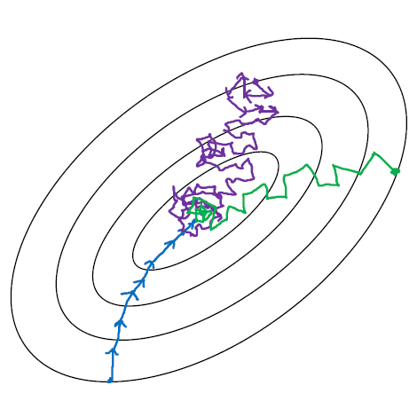

If the mini-batch size should not be m and should not be 1 but should be something in between, how do you go about choosing it? Well, here are some guidelines.

### Choosing your mini-batch size
* If small training set, use batch gradient descent. If you have a small training set then no point using mini-batch gradient descent you can process a whole training set quite fast. So you might as well use batch gradient descent. (small means m <= 2000)
* If big training set, typical mini batch sizes would be from 64 upto 512, which are quite typical. Because of the way computer memory is layed out and accessed, sometimes your code runs faster if your mini-batch size is a power of 2, so 64 is 2 to the 6th, is 2 to the 7th, 2 to the 8, 2 to the 9, so often I'll implement my mini-batch size to be a power of 2. I know that in a previous video I used a mini-batch size of 1000, if you really wanted to do that I would recommend you just use your 1024, which is 2 to the power of 10. And you do see mini batch sizes of size 1024, it is a bit more rare. This range of mini batch sizes, a little bit more common.
* Masure your minibatch ($X^{\{t\}}$, $Y^{\{t\}}$) fit in CPU/GPU memory. This really depends on your application and how large a single training sample is. If you ever process a mini-batch that doesn't actually fit in CPU, GPU memory, whether you're using the process, the data. Then you find that the performance suddenly falls of a cliff and is suddenly much worse. 

Try a few different powers of two and then see if you can pick one that makes your gradient descent optimization algorithm as efficient as possible.

## Exponentially Weighted Averages
### Temperature in London

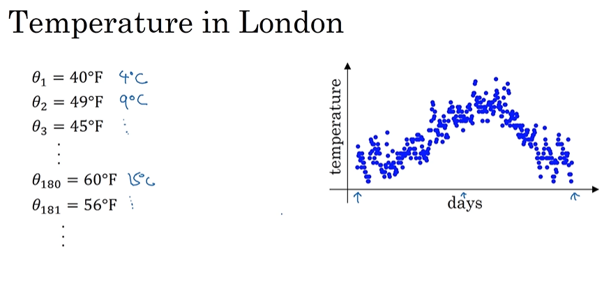

This data looks a little bit noisy and if you want to compute the trends, the local average or a moving average of the temperature, here's what you can do. 

Let's initialize $v_0$ = zero. 

And then, on every day, we're going to average it with a weight of 0.9 times whatever the previous value, plus 0.1 times that day temperature. 

$v_1 = 0.9v_0+0.1\theta_1$

So, $\theta_1$ here would be the temperature from the first day. 

$v_2 = 0.9v_1+0.1\theta_2$

So on.

$v_t=0.9v_{t-1}+0.1\theta_t$

If we compute this and plot it in red, this is what we will get. You get a moving average of what's called an exponentially weighted average of the daily temperature.

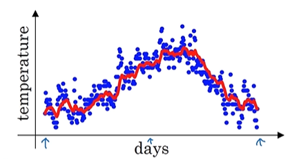

## Exponentially weighted averages

$v_t=\beta v_{t-1}+(1- \beta)\theta_t$

$\beta = 0.9$

It turns out that for reasons we are going to later, when you compute this you can think of $v_t$ as approximately averaging over, something like ${1 \over {1-\beta}}$ days temperature.

So, for example when beta goes 0.9 you could think of this as averaging over the last 10 days temperature. And that was the red line.

Now, let's try something else. Let's set beta to be very close to one, let's say it's 0.98. Then, if you look at ${1 \over {1-0.98}}$, this is equal to 50. This is averaging over roughly, the last 50 days temperature. And plot is below

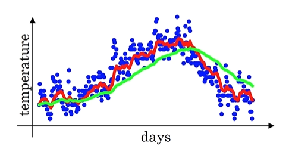

Notice a couple of things with this very high value of beta. The plot you get is much smoother because you're now averaging over more days of temperature. So, the curve is just less wavy is now smoother, but on the flip side the curve has now shifted further to the right because you're now averaging over a much larger window of temperatures. And by averaging over a larger window, this formula, this exponentially weighted average formula. It adapts more slowly, when the temperature changes. There's just a bit more latency.

The reason for that is when Beta 0.98 then it's giving a lot of weight to the previous value and a much smaller weight just 0.02, to whatever you're seeing right now. So, when the temperature changes, when temperature goes up or down, there's exponentially weighted average. It just adapts more slowly when beta is so large. 

Now, let's try another value. If you set beta to another extreme, let's say it is 0.5, then this by the formula we have. This is something like averaging over just two days temperature, and you plot that you get this yellow line. 

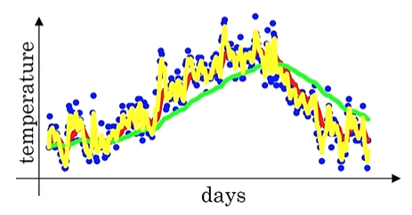

By averaging only over two days temperature, you have a much, as if you're averaging over much shorter window. So, you're much more noisy, much more susceptible to outliers. But this adapts much more quickly to what the temperature changes. 

This formula is how you implement exponentially weighted average. Again, it's called an exponentially weighted moving average in the statistics literature. We're going to call it exponentially weighted average for short. 

And by varying this parameter or later we'll see such a hyper parameter if you're learning algorithm you can get slightly different effects and there will usually be some value in between that works best. That gives you the red curve which you know maybe looks like a beta average of the temperature than either the green or the yellow curve.

## Understanding Exponentially Weighted Averages
### Exponentially weighted averages

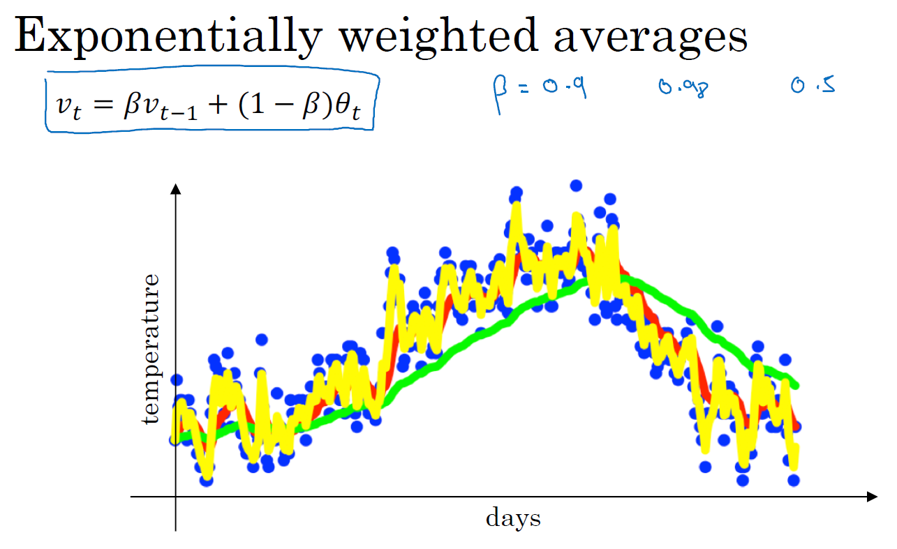

$v_t=\beta v_{t-1}+(1- \beta)\theta_t$

For $\beta = 0.9$ we have

$v_{100} = 0.9v_{99} + 0.1\theta_{100}$

$v_{99} = 0.9v_{98} + 0.1\theta_{99}$

$v_{98} = 0.9v_{97} + 0.1\theta_{98}$

So we have

$v_{100} = 0.1\theta_{100} + 0.1*0.9*\theta_{99} + 0.1*(0.9^2)*\theta_{98} + 0.1**(0.9^3)*\theta_{97} + 0.1**(0.9^4)*\theta_{96} + ...$

This is a way to sum and that's a weighted average of theta $\theta_{100}$, which is the current days temperature and we're looking for a perspective of $v_{100}$ which you calculate on the 100th day of the year.

Sum of your theta 100, theta 99, theta 98, theta 97, theta 96, and so on -> Sum number of days of temperature.

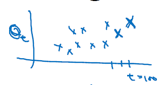

Exponentially decaying function. So starting from 0.1 to 0.9, times 0.1 to 0.9 squared, times 0.1, to and so on.

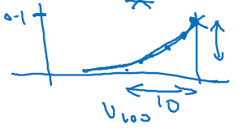

To compute $v_{100}$, you take the element wise product between these 2 functions and sum it up. So you take this value, theta 100 times 0.1, times this value of theta 99 times 0.1 times 0.9, that's the second term and so on. So it's really taking the daily temperature, multiply with this exponentially decaying function, and then summing it up. This becomes $v_{100}$.

But all of these coefficients fin $v_{100}$ function, add up to one or add up to very close to one, up to a detail called bias correction which we'll talk about in the next video. But because of that, this really is an exponentially weighted average. 

Finally, you might wonder, how many days temperature is this averaging over. Well, it turns out that 0.9 to the power of 10, is about 0.35 and this turns out to be about one over e, one of the base of natural algorithms. ($1 \over e$)

More generally, if you have 1 minus epsilon, in this example, epsilon would be 0.1, so if this was 0.9, then one minus epsilon to the 1 over epsilon. This is about one over e, this about 0.34, 0.35.

$(1 - \epsilon)^{1 \over \epsilon} = {1 \over e}$

In other words, it takes about 10 days for the height of this to decay to around 1/3 already 1 over e of the peak. So it's because of this, that when beta equals 0.9, we say that, this is as if you're computing an exponentially weighted average that focuses on just the last 10 days temperature. Because it's after 10 days that the weight decays to less than about a third of the weight of the current day. Whereas, in contrast, if beta was equal to 0.98, then, what do you need 0.98 to the power of in order for this to really small? Turns out that 0.98 to the power of 50 will be approximately equal to one over E. So the way to be pretty big will be bigger than 1 over e for the first 50 days, and then they'll decay quite rapidly over that. So intuitively, this is the hard and fast thing, you can think of this as averaging over about 50 days temperature. 

Because, in this example, to use the notation here on the left, it's as if epsilon is equal to 0.02, so 1 over epsilon is 50. And this, by the way, is how we got the formula, that we're averaging over 1 over 1 minus beta or so days. Epsilon replaces a round of 1 minus beta. It tells you, up to some constant roughly how many days temperature you should think of this as averaging over. But this is just a rule of thumb for how to think about it, and it isn't a formal mathematical statement.

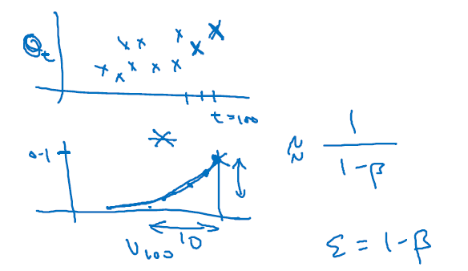

### Implementing exponentially weighted averages
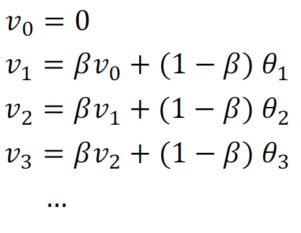

$v_{\theta}=0$

Repeat { \
    Get next $\theta_t$ \
    $v_{\theta}=0 = \beta*v_{\theta} + (1-\beta)\theta_t$ \
}

One of the advantages of this exponentially weighted average formula, is that it takes very little memory. You just need to keep just one row number in computer memory, and you keep on overwriting it with this formula based on the latest values that you got. It's really this reason, the efficiency, it just takes up one line of code basically and just storage and memory for a single row number to compute this exponentially weighted average.

It's really not the best way, not the most accurate way to compute an average. If you were to compute a moving window, where you explicitly sum over the last 10 days, the last 50 days temperature and just divide by 10 or divide by 50, that usually gives you a better estimate. But the disadvantage of that, of explicitly keeping all the temperatures around and sum of the last 10 days is it requires more memory, and it's just more complicated to implement and is computationally more expensive. 

For things where you need to compute averages of a lot of variables. This is a very efficient way to do so both from computation and memory efficiency point of view which is why it's used in a lot of machine learning. Not to mention that there's just one line of code which is, maybe, another advantage.

### ChatGPT

You live in London. Every day, you write down the temperature:

|Day|	Temperature (°C)|
|-|-|
|Mon|	10|
|Tue|	12|
|Wed|	9|
|Thu|	14|
|Fri|	13|

You want to know: Is London getting warmer or colder overall?

But the temperature jumps up and down every day — it’s noisy.
So instead of just using today’s number, you want something that says

“What’s the average trend recently?”

Imagine your thermometer is lazy — it doesn’t update fully every day.
It only adjusts a little toward the new temperature.

Let’s say you tell it:

“Change 10% toward today’s new temperature each day.”

That’s your EWA rule with β = 0.9 (keep 90% of the old info).

So your thermometer works like this:

On Monday, it reads 10°C

On Tuesday, it says: “I’ll move 10% toward 12°C”
→ new reading = 90% old + 10% new = 10.2°C

On Wednesday, temp = 9°C
→ new reading = 0.9×10.2 + 0.1×9 = 10.08°C

On Thursday, temp = 14°C
→ new reading = 0.9×10.08 + 0.1×14 = 10.47°C

So even though Thursday suddenly jumps to 14°C, your “lazy thermometer” moves slowly. It doesn’t get shocked by one hot day.

That’s exactly what an exponentially weighted average does.

|β (beta)|	Meaning|	Behavior|
|-|-|-|
|0.9|	Long memory (remembers many past days)|	Very smooth curve|
|0.1|	Short memory (mostly remembers recent day)	|Reacts quickly|

So with β = 0.9, what happened 5 days ago still matters a bit. With β = 0.1, only yesterday really matters.

EWA = a weighted average of past values but recent days get more weight, and older days get less and less weight (exponentially smaller).

Imagine your temperatures for 5 days are:

|Day|	Temp|	How much this day still matters (for β=0.8)|
|-|-|-|
|Today|	15|	weight = 1.0|
|Yesterday|	12|	weight = 0.8|
|2 days ago|	10|	weight = 0.8² = 0.64|
|3 days ago|	14|	weight = 0.8³ = 0.51|
|4 days ago|	9|	weight = 0.8⁴ = 0.41|

See how each day’s influence shrinks?

That’s why we call it “exponentially” weighted.

Imagine you’re learning guitar 🎸.
Every day you practice — some days go great, some not so great.
To track your progress trend, you don’t judge based only on today’s performance.
You mentally average your recent practice sessions, giving more weight to the most recent ones.

That mental smoothing process = Exponentially Weighted Average.

## Bias Correction in Exponentially Weighted Averages
### Bias correction

$v_t=\beta v_{t-1}+(1- \beta)\theta_t$

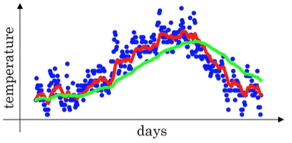

If you implement the formula as written here, you won't actually get the green curve when Beta equals 0.98, you actually get the purple curve. You notice that the purple curve starts off really low.

When implementing a moving average, we initialize $v_0 = 0$

Then $v_1 = 0.98v_0 + 0.02\theta_1$, since $v_0=0$, then 

$v_1 = 0.02\theta_1$

That's why if the first day's temperature is, say, 40 degrees Fahrenheit, then $v_1$ will be 0.02*40, which is 0.8, so you get a much lower value down here in purple. That's not a very good estimate of the first day's temperature.

$v_2=0.98v_1+0.02\theta_2$

-> $v_2 = 0.98*0.02*\theta_1+0.02\theta_2$

-> $v_2 = 0.0196\theta_1+0.02\theta_2$

Assuming Theta 1 and Theta 2 are positive numbers. When you compute this, $v_2$ will be much less than Theta 1 or Theta 2, so $v_2$ isn't a very good estimate of the first two days temperature of the year.

It turns out that there's a way to modify this estimate that makes it much better, that makes it more accurate, especially during this initial phase of your estimate. Instead of taking $v_t$, take $v_t$ divided by 1 minus Beta to the power of t, where t is the current day that you're on. 

$v_t \over {1-\beta^t}$

Let's take a concrete example.

When t = 2, $1-\beta^t = 1-0.98^2 = 0.0396$.

Your estimate of the temperature on day 2 is:

${v_2 \over 0.0396} = {{0.98*0.02*\theta_1+0.02\theta_2} \over 0.0396}$

This becomes a weighted average of Theta 1 and Theta 2 and removes the bias.

You notice that in $v_t \over {1-\beta^t}$, as t becomes large, $\beta^t$ will approach 0, which is why when t is large enough, the bias correction makes almost no difference. This is why when t is large, the purple line and the green line pretty much overlap. But during the initial phase of learning, when you're still warming up your estimates, bias correction can help you obtain a better estimate of the temperature. This is bias correction that helps you go from the purple line to the green line. 

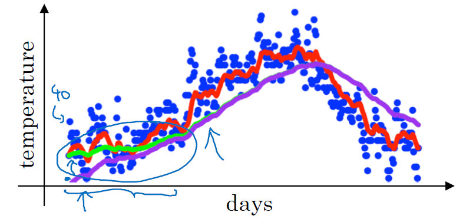

In machine learning, for most implementations of the exponentially weighted average, people don't often bother to implement bias corrections because most people would rather just weigh that initial period and have a slightly more biased assessment and then go from there. But we are concerned about the bias during this initial phase, while your exponentially weighted moving average is warming up, then bias correction can help you get a better estimate early on.

### Another explanation
The problem at the beginning

At the start (say t=1), you don’t have much history.
You start with $v_0=0$

So the first few averages are too small, because they depend too much on this initial zero.

Example:
* $\beta=0.9$
* temperatures: [10, 12, 13, 14]

|Day|	Formula|	vₜ (biased)|
|-|-|-|
|1	|0.9×0 + 0.1×10	|1|
|2	|0.9×1 + 0.1×12	|2.1|
|3	|0.9×2.1 + 0.1×13	|3.19|
|4	|0.9×3.19 + 0.1×14|	4.27|

Notice — the true temperatures are around 10–14, but our averages are way too small (1, 2, 3, 4...).
That’s because we started at zero — so the early $v_t$ are “pulled down”.

To fix this, we “correct” the bias by dividing by $1-\beta^t$

$v^{corrected}_t = {v^t \over {1-\beta^t}}$

This removes the effect of starting from 0.

Let’s compute again:

|Day|	$v_t$| $1-\beta^t$| $v^{corrected}_t$|
|-|-|-|-|
|1|	1|	1 - 0.9¹ = 0.1|	1 / 0.1 = 10.0|
|2|	2.1|	1 - 0.9² = 0.19|	2.1 / 0.19 = 11.05|
|3|	3.19|	1 - 0.9³ = 0.271|	3.19 / 0.271 = 11.77|
|4	|4.27|	1 - 0.9⁴ = 0.3439|	4.27 / 0.3439 = 12.41|

Now the corrected values are much closer to the true temperatures (10–14).

At the very beginning, you haven’t “seen” enough data yet.

Your moving average still remembers the initial 0 — that’s the bias.

Dividing by $1-\beta^t$ “rescales” it to what it would have been if you had started with more data.

## Gradient Descent with Momentum
There's an algorithm called momentum, or gradient descent with momentum that almost always works faster than the standard gradient descent algorithm.

**In one sentence, the basic idea is to compute an exponentially weighted average of your gradients, and then use that gradient to update your weights instead.**

### Gradient descent example
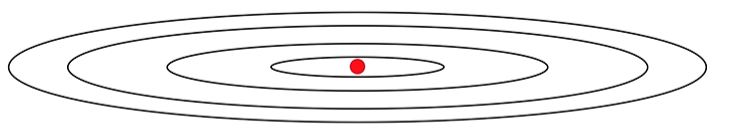

As a example let's say that you're trying to optimize a cost function which has contours like this. So the red dot denotes the position of the minimum. 

Maybe you start gradient descent here and if you take one iteration of gradient descent either or descent maybe end up heading there. But now you're on the other side of this ellipse, and if you take another step of gradient descent maybe you end up doing that. And then another step, another step, and so on. And you see that gradient descents will sort of take a lot of steps ust slowly oscillate toward the minimum.

This up and down oscillations slows down gradient descent and prevents you from using a much larger learning rate. 

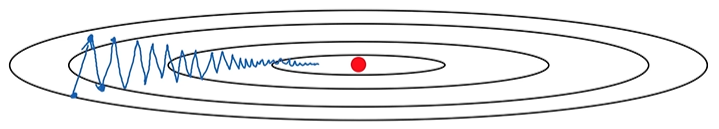

In particular, if you were to use a much larger learning rate you might end up over shooting and end up diverging like so. 

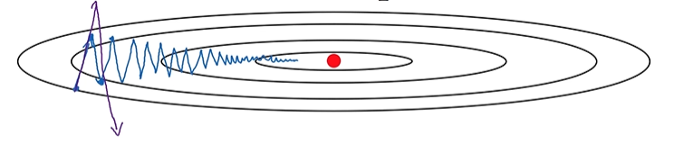

So the need to prevent the oscillations from getting too big forces you to use a learning rate that's not itself too large. 

Another way of viewing this problem is that on the vertical axis you want your learning to be a bit slower, because you don't want those oscillations.

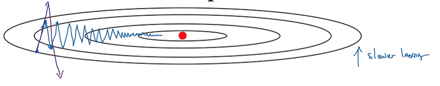

But on the horizontal axis, you want faster learning. Right, because you want it to aggressively move from left to right, toward that minimum, toward that red dot.

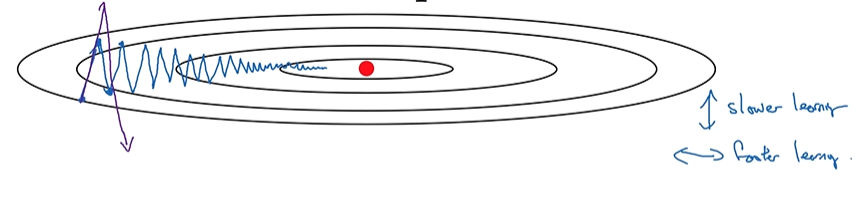

Implement Gradient descent with momentum

On each iteration t:
  - Compute dW, db on current mini-batch. If you're using batch gradient descent, then the current mini-batch would be just your whole batch. And this works as well off a batch gradient descent. So if your current mini-batch is your entire training set, this works fine as well.
  - Compute $v_{dW} = \beta v_{dW} + (1-\beta)dW$
  - Compute $v_{db} = \beta v_{dw} + (1-\beta)db$
  - Update $W = W-\alpha v_{dw}$
  - Update $b = b-\alpha v_{db}$

So what this does is smooth out the steps of gradient descent.

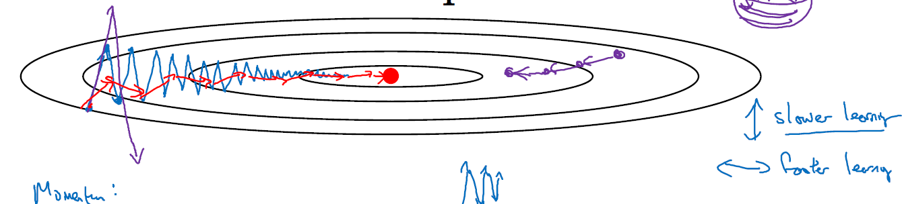

If you average out these gradients, you find that the oscillations in the vertical direction will tend to average out to something closer to zero. 

In the vertical direction, where you want to slow things down, this will average out positive and negative numbers, so the average will be close to zero. 

Whereas, on the horizontal direction, all the derivatives are pointing to the right of the horizontal direction, so the average in the horizontal direction will still be pretty big. 

That's why with this algorithm, with a few iterations you find that the gradient descent with momentum ends up eventually just taking steps that are much smaller oscillations in the vertical direction, but are more directed to just moving quickly in the horizontal direction. This allows your algorithm to take a more straightforward path, or to damp out the oscillations in this path to the minimum.

One intuition for this momentum which works for some people, but not everyone is that if you're trying to minimize your bowl shape function. This is really the contours of a bowl. They kind of minimize this type of bowl shaped function then these derivative terms dW and db, you can think of as providing acceleration to a ball that you're rolling down hill. And these momentum terms $v_{dw}$ and $v_{db}$, you can think of as representing the velocity. And so imagine that you have a bowl, and you take a ball and the derivative imparts acceleration to this little ball as the little ball is rolling down the hill. And so it rolls faster and faster, because of acceleration. 

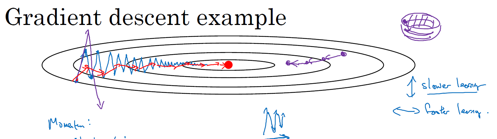

And beta, because this number a little bit less than one, displays a role of friction and it prevents your ball from speeding up without limit. Rather than gradient descent, just taking every single step independently of all previous steps. Now, your little ball can roll downhill and gain momentum, but it can accelerate down this bowl and therefore gain momentum. 

I find that this ball rolling down a bowl analogy, it seems to work for some people who enjoy physics intuitions. But it doesn't work for everyone, so if this analogy of a ball rolling down the bowl doesn't work for you, don't worry about it.

### Implementation details

On iteration t:
  - Compute dW, db on current mini-batch.
  - Compute $v_{dW} = \beta v_{dW} + (1-\beta)dW$
  - Compute $v_{db} = \beta v_{dw} + (1-\beta)db$
  - Update $W = W-\alpha v_{dw}$
  - Update $b = b-\alpha v_{db}$

You now have two hyperparameters of the learning rate $\alpha$, as well as this parameter $\beta$, which controls your exponentially weighted average. 

Most common value of $\beta$ is 0.9.

We're averaging over the last 10 days temperature. So it is averaging of the last ten iteration's gradients. 

And in practice, Beta equals 0.9 works very well. Feel free to try different values and do some hyperparameter search, but 0.9 appears to be a pretty robust value. 

**For Bias correction**

You want to take ${v_{dW}} \over {1-\beta^t}$ and ${v_{db}} \over {1-\beta^t}$. 

In practice, people don't usually do this because after just ten iterations, your moving average will have warmed up and is no longer a bias estimate. So in practice, I don't really see people bothering with bias correction when implementing gradient descent or momentum. 

Of course, this process initialize the $v_{dW}$ equals 0. Note that this is a matrix of zeroes with the same dimension as dW, which has the same dimension as W.

$v_{db}$ is also initialized to a vector of zeroes. So, the same dimension as db, which in turn has same dimension as b.

Finally, I just want to mention that if you read the literature on gradient descent with momentum often you see it with this $1 - \beta$ term omitted. So you end up with $v_{dW}=\beta v_{dW} + dW$.

The net effect of using this version is that $v_{dW}$ ends up being scaled by a factor of 1 minus Beta, or really 1 over 1 minus Beta. And so when you're performing these gradient descent updates, alpha just needs to change by a corresponding value of 1 over 1 minus Beta.

In practice, both of these will work just fine, it just affects what's the best value of the learning rate alpha. But I find that this particular formulation $v_{dW}=\beta v_{dW} + dW$ is a little less intuitive. Because one impact of this is that if you end up tuning the hyperparameter Beta, then this affects the scaling of $v_{dW}$ and $v_{db}$ as well. And so you end up needing to retune the learning rate, alpha, as well, maybe. So I prefer $v_{dW} = \beta v_{dW} + (1-\beta)dW$.

But both versions having Beta equal 0.9 is a common choice of hyperparameter. It's just at alpha the learning rate would need to be tuned differently for these two different versions.

Gradient descent with momentum will almost always work better than the straightforward gradient descent algorithm without momentum.

So each step you keep 90% of old gradients and add a full new gradient every time.
That means over time, $v_{dW}$ becomes much larger in magnitude —
you’re basically accumulating gradients rather than averaging them.

That causes two issues:
* The updates can become too large — like a ball rolling too fast and overshooting minima.
* It’s hard to tune the learning rate — you’d need a much smaller α to compensate.

That’s why the first version (with $v_{dW} = \beta v_{dW} + (1-\beta)dW$) is preferred — it’s a stable moving average of past gradients, not a growing sum.

## RMSprop
here's another algorithm called RMSprop, which stands for root mean square prop, that can also speed up gradient descent.

Recall our example from before, that if you implement gradient descent, you can end up with huge oscillations in the vertical direction, even while it's trying to make progress in the horizontal direction. In order to provide intuition for this example, let's say that the vertical axis is the parameter b and horizontal axis is the parameter w. It could be w1 and w2 where some of the center parameters was named as b and w for the sake of intuition. 

You want to slow down the learning in the b direction, or in the vertical direction. And speed up learning, or at least not slow it down in the horizontal direction. 

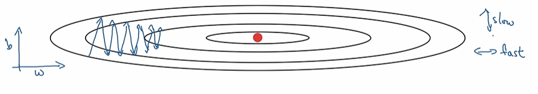

This is what the RMSprop algorithm does to accomplish this. 

On iteration t:
  - Compute dW, db on current mini-batch.
  - Compute $S_{dW} = \beta S_{dW} + (1-\beta)dW^2$ (dW squared is element-wise squanring operation)
  - Compute $S_{db} = \beta S_{dw} + (1-\beta)db^2$ (db squared is element-wise squanring operation)
  - Update $W = W-\alpha {{dW} \over {\sqrt{S_{dW}}}}$
  - Update $b = b-\alpha {{db} \over {\sqrt{S_{db}}}}$

Recall that in the horizontal direction or in this example, in the W direction we want learning to go pretty fast. Whereas in the vertical direction or in this example in the b direction, we want to slow down all the oscillations into the vertical direction. 

With this terms $S_{dW}$ an $S_{db}$, what we're hoping is that $S_{dW}$ will be relatively small, so that here we're dividing by relatively small number. Whereas $S_{db}$ will be relatively large, so that here we're dividing by relatively large number in order to slow down the updates on a vertical dimension.

If you look at the derivatives, these derivatives are much larger in the vertical direction than in the horizontal direction. So the slope is very large in the b direction.

With derivatives like this, this is a very large db and a relatively small dw. Because the function is sloped much more steeply in the vertical direction than as in the b direction, than in the w direction, than in horizontal direction.

db squared will be relatively large. So $S_{db}$ will relatively large, whereas compared to that dW will be smaller, or dW squared will be smaller, and so $S_{dW}$ will be smaller.

The net effect of this is that your up days in the vertical direction are divided by a much larger number, and so that helps damp out the oscillations. Whereas the updates in the horizontal direction are divided by a smaller number. So the net impact of using RMSprop is that your updates will end up looking more like this.

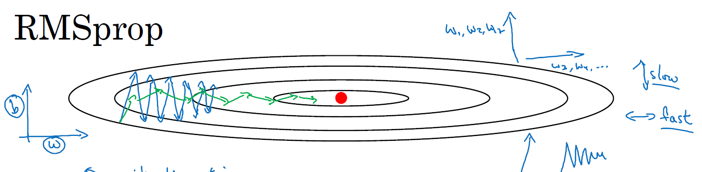

That your updates in the vertical direction get damped out but then horizontal direction you can keep going. 

One effect of this is also that you can therefore use a larger learning rate alpha, and get faster learning without diverging in the vertical direction. 

Now just for the sake of clarity, I've been calling the vertical and horizontal directions b and w, just to illustrate this. In practice, you're in a very high dimensional space of parameters, so maybe the vertical dimensions where you're trying to damp the oscillation is some set of parameters, w1, w2, w17. And the horizontal dimensions might be w3, w4 and so on. And so, the separation between W and b is just an illustration. In practice, dW is a very high-dimensional parameter vector, db is also very high-dimensional parameter vector. 

Intuition is that in dimensions where you're getting these oscillations, you end up computing a larger sum. A weighted average for these squares and derivatives, and so you end up damping out the directions in which there are these oscillations. 

That's RMSprop, and it stands for root mean squared prop, because here you're squaring the derivatives, and then you take the square root here at the end.

Finally, just a couple last details on this algorithm before we move on. In the next video, we're actually going to combine RMSprop together with momentum. So rather than using the hyperparameter beta, which we had used for momentum, I'm going to call this hyperparameter $\beta 2$ just to not clash. The same hyperparameter for both momentum and for RMSprop. And also to make sure that your algorithm doesn't divide by 0. What if square root of $S_{dW}$, is very close to 0. Then things could blow up. Just to ensure numerical stability, when you implement this in practice you add a very, very small epsilon to the denominator. It doesn't really matter what epsilon is used. 10 to the -8 would be a reasonable default, but this just ensures slightly greater numerical stability that for numerical round off or whatever reason, that you don't end up dividing by a very, very small number. 

That's RMSprop, and similar to momentum, has the effects of damping out the oscillations in gradient descent, in mini-batch gradient descent. And allowing you to maybe use a larger learning rate alpha certainly speeding up the learning speed of your algorithm. So now you know to implement RMSprop, and this will be another way for you to speed up your learning algorithm.

One fun fact about RMSprop, it was actually first proposed not in an academic research paper, but in a Coursera course that Jeff Hinton had taught on Coursera many years ago. I guess Coursera wasn't intended to be a platform for dissemination of novel academic research, but it worked out pretty well in that case. And was really from the Coursera course that RMSprop started to become widely known and it really took off.

## Adam Optimization Algorithm
### Adam optimization algorithm
The Adam optimization algorithm is basically taking momentum and RMSprop, and putting them together.

To implement Adam, we need to initialize: $V_{dW}=0$, $S_{dW}=0$, $V_{db}=0$, $S_{db}=0$

On iteration t:
* Compute dW, db using current mini-batch
* $V_{dW}=\beta_1 V_{dW} + (1-\beta_1)dW$, $V_{db}=\beta_1 V_{db} + (1-\beta_1)db$ <- "momentun" like update with hyperparameter $\beta_1$
* $S_{dW}=\beta_2 S_{dW} + (1-\beta_2)dW^2$, $S_{db}=\beta_2 S_{db} + (1-\beta_2)db^2$ <- "RMSprop" like update with hyperparameter $\beta_2$
* $V^{corrected}_{dW} = {V_{dW} \over {1-\beta_1^t}}$, $V^{corrected}_{db} = {V_{db} \over {1-\beta_1^t}}$
* $S^{corrected}_{dW} = {S_{dW} \over {1-\beta_2^t}}$, $S^{corrected}_{db} = {S_{db} \over {1-\beta_2^t}}$
* $W = W - \alpha {V^{corrected}_{dW} \over \sqrt{S^{corrected}_{dW}}+\epsilon}$, $b = b - \alpha {V^{corrected}_{db} \over \sqrt{S^{corrected}_{db}} + \epsilon}$

These algorithm combines the effect of gradient descent with momentum together with gradient descent with RMSprop. This is commonly used learning algorithm that's proven to be very effective for many different neural networks of a very wide variety of architectures.

### Hyperparameters choice
This algorithm has a number of hyperparameters. 
* The learning rate hyperparameter $\alpha$ is still important, and usually needs to be tuned, so you just have to try a range of values and see what works.
* We did a default choice for $\beta_1$ is 0.9, so this is the weighted average of dw. This is the momentum-like term.
* The hyperparameter for $\beta_2$ , the authors of the Adam paper inventors the Adam algorithm recommend 0.999. Again, this is computing the moving weighted average of dw squared as well as db squared.
* The choice of $\epsilon$ doesn't matter very much, but the authors of the Adam paper recommend a 10^minus 8, but this parameter, you really don't need to set it, and it doesn't affect performance much at all.

When implementing Adam, what people usually do is just use a default values of $\beta_1$ and $\beta_2$, as well as $\epsilon$. I don't think anyone ever really tuned $\epsilon$, and then try a range of values of $\alpha$ to see what works best. You can also tune Beta_1 and Beta_2, but is not done that often among the practitioners I know.

### Where does the term Adam come from? 
Adam stands for Adaptive Moment Estimation.

$\beta_1$ is computing the mean of the derivatives. This is called the first moment.

$\beta_2$ is used to compute exponentially weighted average of the squares, and that's called the second moment. 

That gives rise to the name adaptive moment estimation. But everyone just calls it the Adam optimization algorithm.

## Learning Rate Decay
One of the things that might help speed up your learning algorithm is to slowly reduce your learning rate over time. We call this learning rate decay.

Suppose you're implementing mini-batch gradient descents with a reasonably small mini-batch, maybe a mini-batch has just 64, 128 examples.

Then as you iterate, your steps will be a little bit noisy and it will tend towards this minimum over here, but it won't exactly converge. But your algorithm might just end up wandering around and never really converge because you're using some fixed value for Alpha and there's just some noise in your different mini-batches.

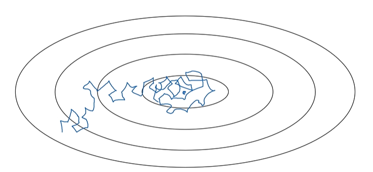

If you were to slowly reduce your learning rate Alpha, then during the initial phases, while your learning rate Alpha is still large, you can still have relatively fast learning. But then as Alpha gets smaller, your steps you take will be slower and smaller, and so, you end up oscillating in a tighter region around this minimum rather than wandering far away even as training goes on and on.

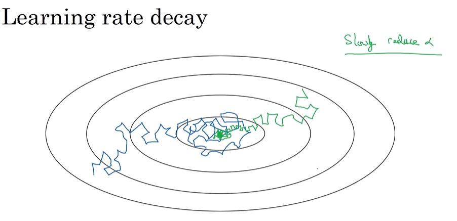

The intuition behind slowly reducing Alpha is that maybe during the initial steps of learning, you could afford to take much bigger steps, but then as learning approaches convergence, then having a slower learning rate allows you to take smaller steps.

If α (learning rate) stays constant:
* At the beginning of training → we may want large steps to move quickly.
* Later, when we’re close to the minimum → we want smaller steps to fine-tune.

But if α stays large the whole time, we might overshoot the minimum and bounce around forever.

If it’s too small from the start, we’ll take forever to converge.

So we want α to start big → gradually shrink over time.
That’s learning rate decay.

### Learning rate decay
Recall that one epoch is 1 pass through the data.

If you have a training set as follows, maybe break it up into different mini-batches. Then the first pass through the training set is called the first epoch, and then the second pass is the second epoch, and so on. 

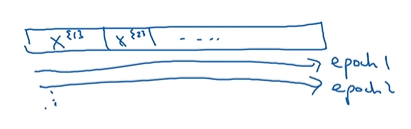

$\alpha = {1 \over {1+decayRate*epochNumber}}*\alpha_0$

Note that the decay rate here becomes another hyperparameter which you might need to tune.

Example:

$\alpha_0=0.2$, decayRate=1

|Epoch| $\alpha$|
|-|-|
|1|0.1|
|2|0.067|
|3|0.05|
|4|0.04|

As a function of epoch number, your learning rate gradually decreases, according to this formula up on top.

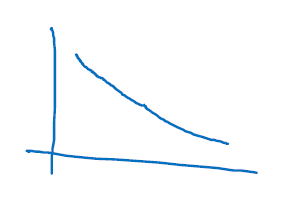

If you wish to use learning rate decay, what you can do is try a variety of values of both hyperparameter Alpha 0, as well as this decayRate hyperparameter, and then try to find a value that works well.

### Other learning rate decay methods
Other than this formula for learning rate decay, there are a few other ways that people use.

For example, this is called exponential decay, where Alpha is equal to some number less than 1, such as 0.95, times epoch num times Alpha 0. This will exponentially quickly decay your learning rate.

$\alpha = 0.95^{epoch-num}*\alpha_0$

Other formulas that people use are things like Alpha equals some constant over epoch num square root times Alpha 0, or some constant k and another hyperparameter over the mini-batch number t square rooted times Alpha 0. 

$\alpha = {k \over \sqrt{epoch-num}}*\alpha_0$

or

$\alpha = {k \over \sqrt{t}}*\alpha_0$

Sometimes you also see people use a learning rate that decreases and discretes that, where for some number of steps, you have some learning rate, and then after a while, you decrease it by one-half, after a while, by one-half, after a while, by one-half, and so, this is a discrete staircase.

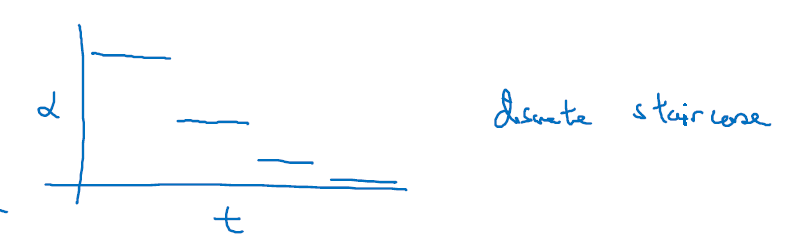

So far, we've talked about using some formula to govern how Alpha, the learning rate changes over time.

One other thing that people sometimes do is manual decay. If you're training just one model at a time, and if your model takes many hours or even many days to train, what some people would do is just watch your model as it's training over a large number of days, and then now you say, oh, it looks like the learning rate slowed down, I'm going to decrease Alpha a little bit. Of course, this works, this manually controlling Alpha, really tuning Alpha by hand, hour-by-hour, day-by-day. This works only if you're training only a small number of models, but sometimes people do that as well.

For me, I would say that learning rate decay is usually lower down on the list of things I try. Setting Alpha just a fixed value of Alpha and getting that to be well-tuned has a huge impact, learning rate decay does help. Sometimes it can really help speed up training, but it is a little bit lower down my list in terms of the things I would try.

## The Problem of Local Optima

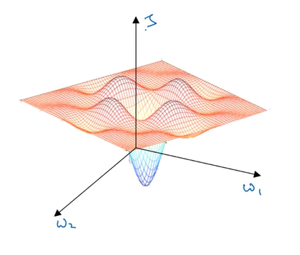

This was a picture people used to have in mind when they worried about local optima. Maybe you are trying to optimize some set of parameters, we call them W1 and W2, and the height in the surface is the cost function. In this picture, it looks like there are a lot of local optima in all those places. And it'd be easy for grading the sense, or one of the other algorithms to get stuck in a local optimum rather than find its way to a global optimum. 

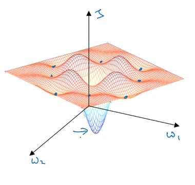

It turns out that if you are plotting a figure like this in two dimensions, then it's easy to create plots like this with a lot of different local optima. And these very low dimensional plots used to guide their intuition. But this intuition isn't actually correct. It turns out if you create a neural network, most points of zero gradients are not local optima like points like this.

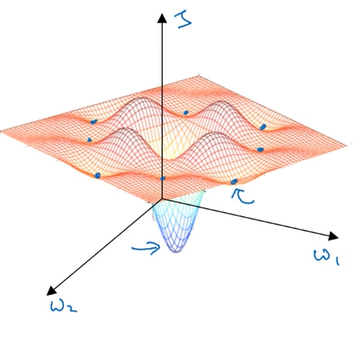

Instead most points of zero gradient in a cost function are saddle points. So, that's a point where the zero gradient, again, just is maybe W1, W2, and the height is the value of the cost function J.

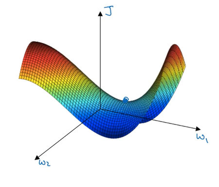

But informally, a function of very high dimensional space, if the gradient is zero, then in each direction it can either be a convex light function or a concave light function.

And if you are in, say, a 20,000 dimensional space, then for it to be a local optima, all 20,000 directions need to look like this. And so the chance of that happening is maybe very small, maybe two to the minus 20,000. 

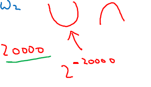

Instead you're much more likely to get some directions where the curve bends up like so, as well as some directions where the curve function is bending down rather than have them all bend upwards.

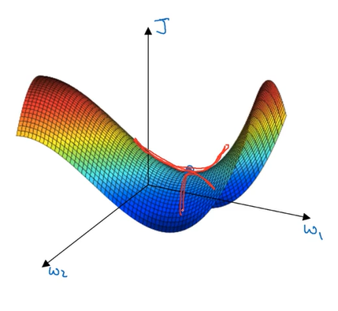

So that's why in very high-dimensional spaces you're actually much more likely to run into a saddle point like that shown on the right, then the local optimum. As for why the surface is called a saddle point, if you can picture, maybe this is a sort of saddle you put on a horse. Maybe this is a horse. This is a head of a horse, this is the eye of a horse. 

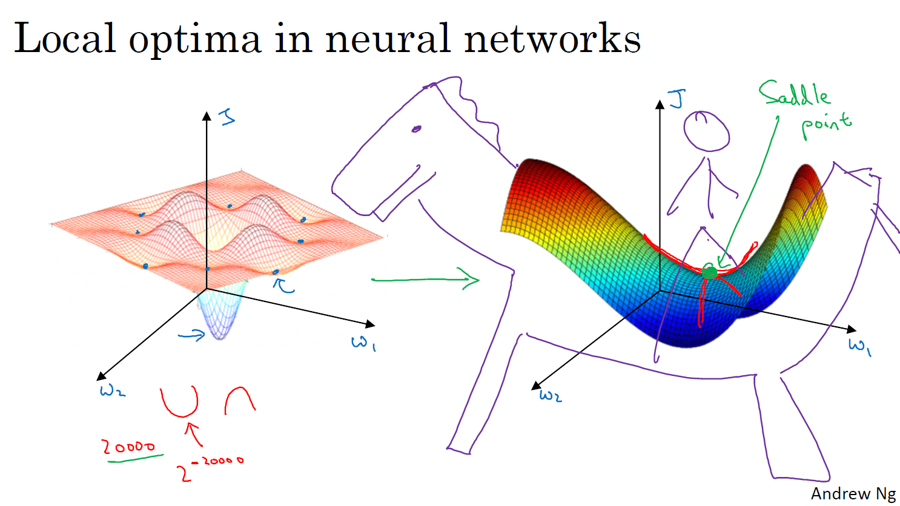

Then you, the rider, will sit here in the saddle. That's why this point here, where the derivative is zero, that point is called a saddle point. There's really the point on this saddle where you would sit, I guess, and that happens to have derivative zero.

One of the lessons we learned in history of deep learning is that a lot of our intuitions about low-dimensional spaces, like what you can plot on the left, they really don't transfer to the very high-dimensional spaces that any other algorithms are operating over. Because if you have 20,000 parameters, then J as your function over 20,000 dimensional vector, then you're much more likely to see saddle points than local optimum.

If local optima aren't a problem, then what is a problem?

It turns out that plateaus can really slow down learning and a plateau is a region where the derivative is close to zero for a long time.

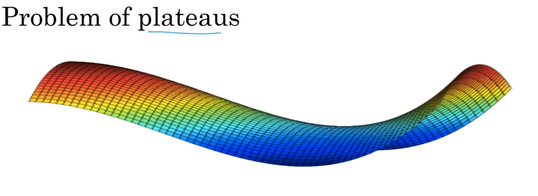

So if you're here, then gradient descents will move down the surface, and because the gradient is zero or near zero, the surface is quite flat. You can actually take a very long time, you know, to slowly find your way to maybe this point on the plateau. And then because of a random perturbation of left or right, maybe then finally your algorithm can then find its way off the plateau. Let it take this very long slope off before it's found its way here and they could get off this plateau. 

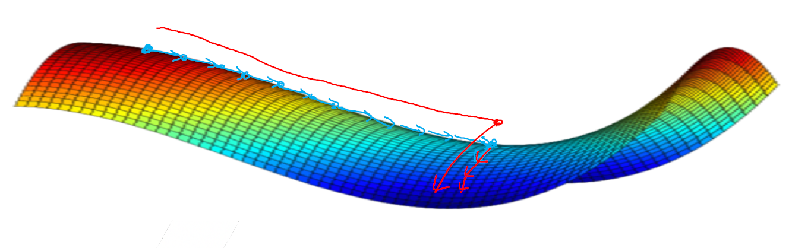

The takeaways from this video are:
* You're actually pretty unlikely to get stuck in bad local optima so long as you're training a reasonably large neural network, save a lot of parameters, and the cost function J is defined over a relatively high dimensional space.
* Plateaus are a problem and you can actually make learning pretty slow. And this is where algorithms like momentum or RmsProp or Adam can really help your learning algorithm as well. These are scenarios where more sophisticated observation algorithms, such as Adam, can actually speed up the rate at which you could move down the plateau and then get off the plateau.

Because your network is solving optimizations problems over such high dimensional spaces, to be honest, I don't think anyone has great intuitions about what these spaces really look like, and our understanding of them is still evolving.

