# Hyperparameter Tuning, Batch Normalization and Programming Frameworks

**Learning Objectives**
* Master the process of hyperparameter tuning
* Describe softmax classification for multiple classes
* Apply batch normalization to make your neural network more robust
* Build a neural network in TensorFlow and train it on a TensorFlow dataset
* Describe the purpose and operation of GradientTape
* Use tf.Variable to modify the state of a variable
* Apply TensorFlow decorators to speed up code
* Explain the difference between a variable and a constant

- [Hyperparameter Tuning, Batch Normalization and Programming Frameworks](#hyperparameter-tuning-batch-normalization-and-programming-frameworks)
  - [Tuning Process](#tuning-process)
    - [Hyperparameters](#hyperparameters)
    - [Try random values: Don’t use a grid](#try-random-values-dont-use-a-grid)
    - [Coarse to fine](#coarse-to-fine)
  - [Using an Appropriate Scale to pick Hyperparameters](#using-an-appropriate-scale-to-pick-hyperparameters)
    - [Picking hyperparameters at random](#picking-hyperparameters-at-random)
    - [Appropriate scale for hyperparameters](#appropriate-scale-for-hyperparameters)
    - [Hyperparameters for exponentially weighted averages](#hyperparameters-for-exponentially-weighted-averages)
  - [Hyperparameters Tuning in Practice: Pandas vs. Caviar](#hyperparameters-tuning-in-practice-pandas-vs-caviar)
    - [Re-test hyperparameters occasionally](#re-test-hyperparameters-occasionally)
  - [Normalizing Activations in a Network](#normalizing-activations-in-a-network)
    - [Normalizing inputs to speed up learning](#normalizing-inputs-to-speed-up-learning)
    - [Implementing Batch Norm](#implementing-batch-norm)
    - [Explained by ChatGPT](#explained-by-chatgpt)
  - [Fitting Batch Norm into a Neural Network](#fitting-batch-norm-into-a-neural-network)
    - [Adding Batch Norm to a network](#adding-batch-norm-to-a-network)
    - [Working with mini-batches](#working-with-mini-batches)
    - [Implementing gradient descent](#implementing-gradient-descent)
  - [Why does Batch Norm work?](#why-does-batch-norm-work)
    - [Learning on shifting input distribution](#learning-on-shifting-input-distribution)
    - [Why this is a problem with neural networks?](#why-this-is-a-problem-with-neural-networks)
    - [Batch Norm as regularization](#batch-norm-as-regularization)
  - [Batch Norm at Test Time](#batch-norm-at-test-time)
    - [Explained by ChatGPT](#explained-by-chatgpt-1)
  - [Softmax Regression](#softmax-regression)
    - [Recognizing cats, dogs, and baby chicks](#recognizing-cats-dogs-and-baby-chicks)
    - [Softmax layer](#softmax-layer)
    - [Softmax examples](#softmax-examples)
  - [Training a Softmax Classifier](#training-a-softmax-classifier)
    - [Understading softmax](#understading-softmax)
    - [Loss function](#loss-function)
    - [Gradient descent with softmax](#gradient-descent-with-softmax)
  - [Deep Learning Frameworks](#deep-learning-frameworks)
  - [TensorFlow](#tensorflow)


## Tuning Process
### Hyperparameters
One of the painful things about training deepness is the sheer number of hyperparameters you have to deal with:
* Learning rate $\alpha$
* Momentum term $\beta$
* Hyperparameters for the Adam Optimization Algorithm which are $\beta_1$, $\beta_2$, and $\epsilon$.
* Number of layers
* Number of hidden units for the different layers
* Learning rate decay, so you don't just use a single learning rate $\alpha$. And then of course
* Mini-batch size. 

Some of these hyperparameters are more important than others. For most learning applications
1. $\alpha$, the learning rate is the most important hyperparameter to tune. 
2. Other than alpha, a few other hyperparameters I tend to would maybe tune next, would be maybe **the momentum term**, 0.9 is a good default. 
3. I'd also tune the **mini-batch size** to make sure that the optimization algorithm is running efficiently.
4. Often I also fiddle around with the **hidden units**.

Of the ones om 2, 3, 4, these are really the three that I would consider second in importance to the learning rate $\alpha$

5. Third in importance after fiddling around with the others, the **number of layers** can sometimes make a huge difference, and so can **learning rate decay**. 
6. And then, when using the Adam algorithm I actually pretty much never tuned $\beta_1$, $\beta_2$, and $\epsilon$. Pretty much I always use 0.9, 0.999 and $10^{-8}$ although you can try tuning those as well if you wish.

### Try random values: Don’t use a grid
If you're trying to tune some set of hyperparameters, how do you select a set of values to explore?

In earlier generations of machine learning algorithms, if you had two hyperparameters, which I'm calling hyperparameter 1 and hyperparameter 2 here, it was common practice to sample the points in a grid like so, and systematically explore these values. Here I am placing down a five by five grid. In practice, it could be more or less than the five by five grid but you try out in this example all 25 points, and then pick whichever hyperparameter works best.

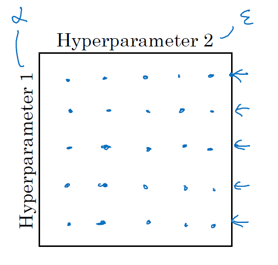

This practice works okay when the number of hyperparameters was relatively small.

In deep learning, what we tend to do, and what I recommend you do instead, is choose the points at random. So go ahead and choose maybe of same number of points, right? 25 points, and then try out the hyperparameters on this randomly chosen set of points.

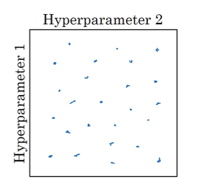

The reason you do that is that it's difficult to know in advance which hyperparameters are going to be the most important for your problem. As you saw in the previous slide, some hyperparameters are actually much more important than others.

So to take an example, let's say hyperparameter one turns out to be alpha, the learning rate. And to take an extreme example, let's say that hyperparameter two was that value epsilon that you have in the denominator of the Adam algorithm. So your choice of alpha matters a lot and your choice of epsilon hardly matters. So if you sample in the grid then you've really tried out five values of alpha and you might find that all of the different values of epsilon give you essentially the same answer. So you've now trained 25 models and only got into trial five values for the learning rate alpha, which I think is really important.

Whereas in contrast, if you were to sample at random, then you will have tried out 25 distinct values of the learning rate alpha and therefore you be more likely to find a value that works really well.

I've explained this example, using just two hyperparameters. In practice, you might be searching over many more hyperparameters than these, so if you have, say, three hyperparameters, I guess instead of searching over a square, you're searching over a cube where this third dimension is hyperparameter three and then by sampling within this three-dimensional cube you get to try out a lot more values of each of your three hyperparameters. 

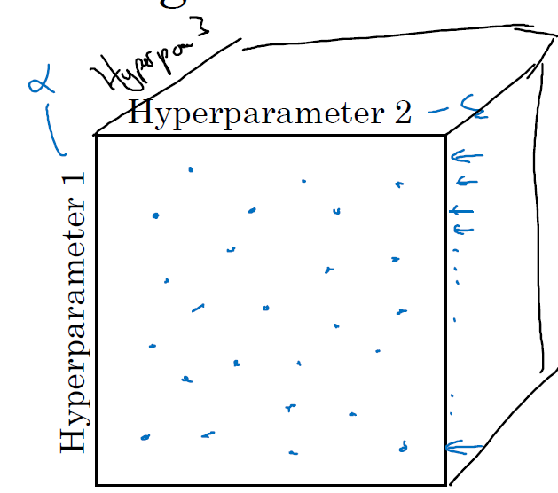

In practice you might be searching over even more hyperparameters than three and sometimes it's just hard to know in advance which ones turn out to be the really important hyperparameters for your application and sampling at random rather than in the grid shows that you are more richly exploring set of possible values for the most important hyperparameters, whatever they turn out to be.

### Coarse to fine
When you sample hyperparameters, another common practice is to use a coarse to fine sampling scheme.

Let's say in this two-dimensional example that you sample these points, and maybe you found that this point work the best and maybe a few other points around it tended to work really well, then in the course of the final scheme what you might do is zoom in to a smaller region of the hyperparameters, and then sample more density within this space. 

Or maybe again at random, but to then focus more resources on searching within this blue square if you're suspecting that the best setting, the hyperparameters, may be in this region. So after doing a coarse sample of this entire square, that tells you to then focus on a smaller square. You can then sample more densely into smaller square. So this type of a coarse to fine search is also frequently used. 

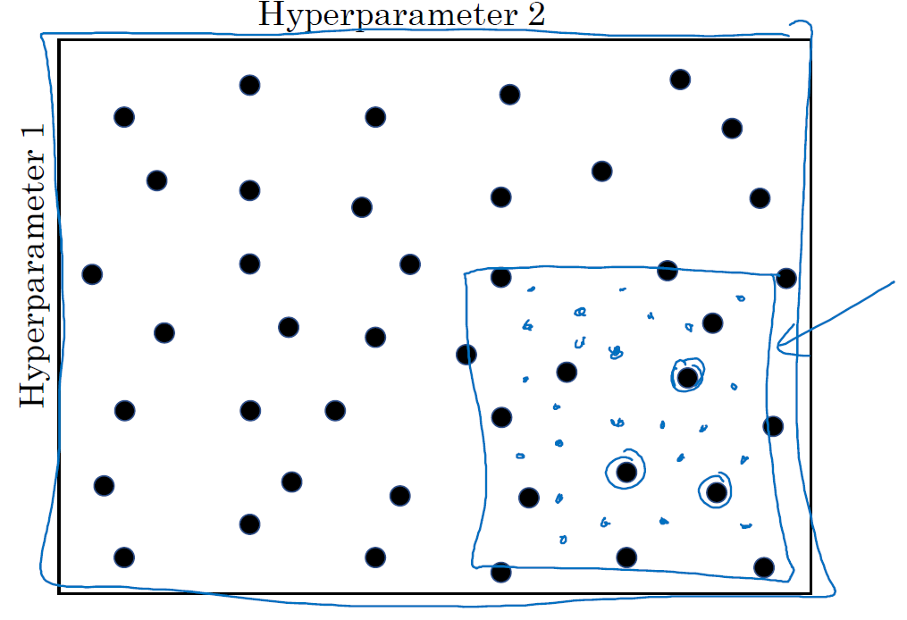

And by trying out these different values of the hyperparameters you can then pick whatever value allows you to do best on your training set objective, or does best on your development set, or whatever you're trying to optimize in your hyperparameter search process.

The two key takeaways are:
* Use random sampling and adequate search.
* Optionally consider implementing a coarse to fine search process.

## Using an Appropriate Scale to pick Hyperparameters
### Picking hyperparameters at random
Sampling at random doesn't mean sampling uniformly at random, over the range of valid values. Instead, it's important to pick the appropriate scale on which to explore the hyperparameters.

Let's say that you're trying to choose the number of hidden units, $n^{[l]}$, for a given layer l. And let's say that you think a good range of values is somewhere from 50 to 100.

In that case, if you look at the number line from 50 to 100, maybe picking some number values at random within this number line. There's a pretty visible way to search for this particular hyperparameter. 

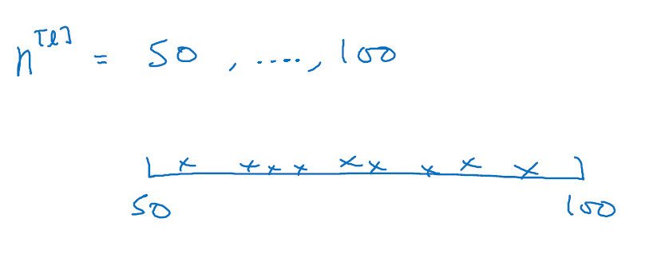

Or if you're trying to decide on the number of layers in your neural network, we're calling that capital L. Maybe you think the total number of layers should be somewhere between 2 to 4. Then sampling uniformly at random, along 2, 3 and 4, might be reasonable. Or even using a grid search, where you explicitly evaluate the values 2, 3 and 4 might be reasonable.

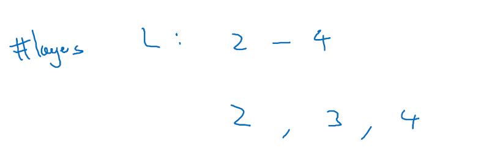

So these were a couple examples where sampling uniformly at random over the range you're contemplating; might be a reasonable thing to do. But this is not true for all hyperparameters.

### Appropriate scale for hyperparameters
Say your searching for the hyperparameter alpha, the learning rate. And let's say that you suspect 0.0001 might be on the low end, or maybe it could be as high as 1. Now if you draw the number line from 0.0001 to 1, and sample values uniformly at random over this number line. About 90% of the values you sample would be between 0.1 and 1. So you're using 90% of the resources to search between 0.1 and 1, and only 10% of the resources to search between 0.0001 and 0.1. So that doesn't seem right.

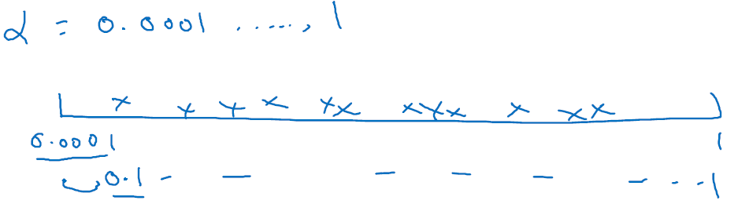

Instead, it seems more reasonable to search for hyperparameters on a log scale. Where instead of using a linear scale, you'd have 0.0001 here, and then 0.001, 0.01, 0.1, and then 1. And you instead sample uniformly, at random, on this type of logarithmic scale.

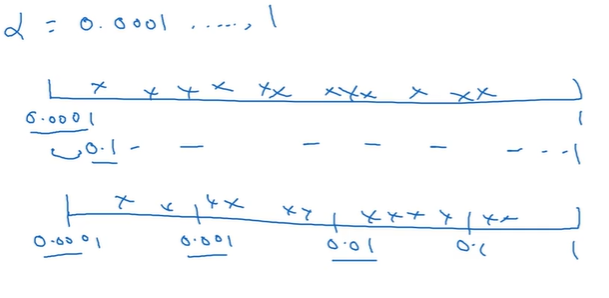

Now you have more resources dedicated to searching between 0.0001 and 0.001, and between 0.001 and 0.01, and so on. 

In Python, the way you implement this, is let

```python
r = -4 * np.random.rand()
```

Then a randomly chosen value of alpha, would be

alpha = $10^r$

So after the first line, r will be a random number between -4 and 0. 

And so alpha here will be between $10^{-4}$ and $10^0$. So $10^{-4}$ is this left thing, this $10^{-4}$, and 1 is $10^0$

Generally, if we are trying to sample between $10^a$ to $10^b$, on the log scale, in this example, this is 10 to the a. And you can figure out what a is by taking the log base 10 of 0.0001, which is going to tell you a is -4. And this value on the right, this is 10 to the b. And you can figure out what b is, by taking log base 10 of 1, which tells you b is equal to 0. So what you do, is then sample r uniformly, at random, between a and b. So in this case, r would be between -4 and 0. And you can set alpha, on your randomly sampled hyperparameter value, as 10 to the r.

Just to recap, to sample on the log scale, you take the low value, take logs to figure out what is a. Take the high value, take a log to figure out what is b. So now you're trying to sample, from 10 to the a to the b, on a log scale. So you set r uniformly, at random, between a and b. And then you set the hyperparameter to be 10 to the r. So that's how you implement sampling on this logarithmic scale.

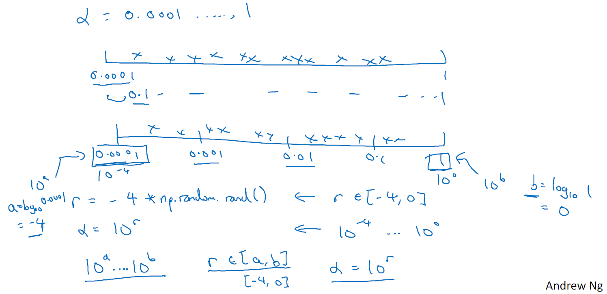

### Hyperparameters for exponentially weighted averages
Finally, one other tricky case is sampling the hyperparameter beta, used for computing exponentially weighted averages.

So let's say you suspect that beta should be somewhere between 0.9 to 0.999. Maybe this is the range of values you want to search over. So remember, that when computing exponentially weighted averages, using 0.9 is like averaging over the last 10 values. Kind of like taking the average of 10 days temperature, whereas using 0.999 is like averaging over the last 1,000 values. 

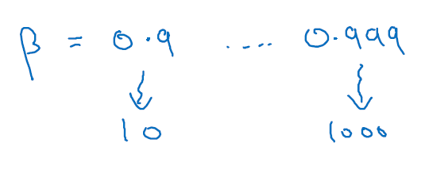

If you want to search between 0.9 and 0.999, it doesn't make sense to sample on the linear scale. Uniformly, at random, between 0.9 and 0.999. So the best way to think about this, is that we want to explore the range of values for 1 minus beta, which is going to now range from 0.1 to 0.001. And so we'll sample the between beta, taking values from 0.1, to maybe 0.1, to 0.001. So using the method we have figured out on the previous slide, this is 10 to the -1, this is 10 to the -3.

Notice on the previous slide, we had the small value on the left, and the large value on the right, but here we have reversed. We have the large value on the left, and the small value on the right.

So what you do, is you sample r uniformly, at random, from -3 to -1. And you set 1- beta = 10 to the r, and so beta = 1- 10 to the r. And this becomes your randomly sampled value of your hyperparameter, chosen on the appropriate scale. And hopefully this makes sense, in that this way, you spend as much resources exploring the range 0.9 to 0.99, as you would exploring 0.99 to 0.999. 

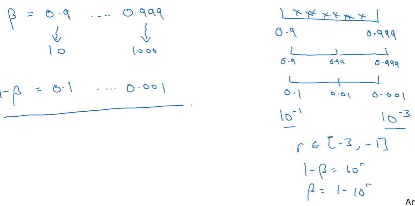

If you want to study more formal mathematical justification for why we're doing this, right, why is it such a bad idea to sample in a linear scale?

It is that, when beta is close to 1, the sensitivity of the results you get changes, even with very small changes to beta. So if beta goes from 0.9 to 0.9005, it's no big deal, this is hardly any change in your results. But if beta goes from 0.999 to 0.9995, this will have a huge impact on exactly what your algorithm is doing. In both of these cases, it's averaging over roughly 10 values. But here it's gone from an exponentially weighted average over about the last 1,000 examples, to now, the last 2,000 examples. And it's because that formula we have, 1 / 1- beta, this is very sensitive to small changes in beta, when beta is close to 1.

So what this whole sampling process does, is it causes you to sample more densely in the region of when beta is close to 1. Or, alternatively, when 1- beta is close to 0. So that you can be more efficient in terms of how you distribute the samples, to explore the space of possible outcomes more efficiently. 

Think of the β range (0 to 1) as a ruler:

```lua
0.0          0.1          0.2          ...         0.9          1.0
|------------|------------|------------|------------|------------|

```

Uniform sampling gives equal attention to each part of this ruler.
But the important region (0.9 → 1.0) is squeezed into a tiny space at the end.

Now, let’s define 1 − β.
If β = 0.9 → 1−β = 0.1
If β = 0.99 → 1−β = 0.01
If β = 0.999 → 1−β = 0.001

So 1−β can vary over several orders of magnitude (0.1, 0.01, 0.001...).

If you plot that on a logarithmic scale, those values are evenly spaced:

```cpp
log10(0.1) = -1
log10(0.01) = -2
log10(0.001) = -3
```

So, instead of sampling β directly, we sample the exponent uniformly:

```python
r = np.random.uniform(-3, -1)
beta = 1 - 10**r
```

This gives us equal chance of getting 0.9, 0.99, and 0.999 — which are all important, distinct behaviors.

## Hyperparameters Tuning in Practice: Pandas vs. Caviar
### Re-test hyperparameters occasionally
Deep learning today is applied to many different application areas and that intuitions about hyperparameter settings from one application area may or may not transfer to a different one.

There is a lot of cross-fertilization among different applications' domains, so for example, I've seen ideas developed in the computer vision community, such as Confonets or ResNets, which we'll talk about in a later course, successfully applied to speech. I've seen ideas that were first developed in speech successfully applied in NLP, and so on.

So one nice development in deep learning is that people from different application domains do read increasingly research papers from other application domains to look for inspiration for cross-fertilization.

In terms of your settings for the hyperparameters, though, I've seen that intuitions do get stale. So even if you work on just one problem, say logistics, you might have found a good setting for the hyperparameters and kept on developing your algorithm, or maybe seen your data gradually change over the course of several months, or maybe just upgraded servers in your data center. And because of those changes, the best setting of your hyperparameters can get stale. So I recommend maybe just retesting or reevaluating your hyperparameters at least once every several months to make sure that you're still happy with the values you have.

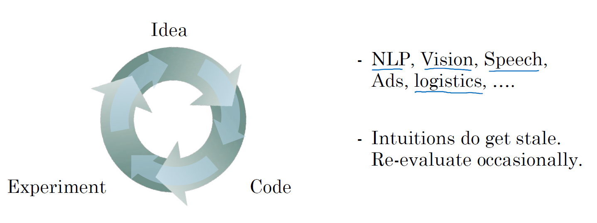

Finally, in terms of how people go about searching for hyperparameters, I see maybe two major schools of thought, or maybe two major different ways in which people go about it.

One way is if you babysit one model. And usually you do this if you have maybe a huge data set but not a lot of computational resources, not a lot of CPUs and GPUs, so you can basically afford to train only one model or a very small number of models at a time. In that case you might gradually babysit that model even as it's training.

For example, on Day 0 you might initialize your parameter as random and then start training. And you gradually watch your learning curve, maybe the cost function J or your dataset error or something else, gradually decrease over the first day. Then at the end of day one, you might say, gee, looks it's learning quite well, I'm going to try increasing the learning rate a little bit and see how it does. And then maybe it does better. And then that's your Day 2 performance. And after two days you say, okay, it's still doing quite well. Maybe I'll fill the momentum term a bit or decrease the learning variable a bit now, and then you're now into Day 3. And every day you kind of look at it and try nudging up and down your parameters. And maybe on one day you found your learning rate was too big. So you might go back to the previous day's model, and so on. But you're kind of babysitting the model one day at a time even as it's training over a course of many days or over the course of several different weeks.

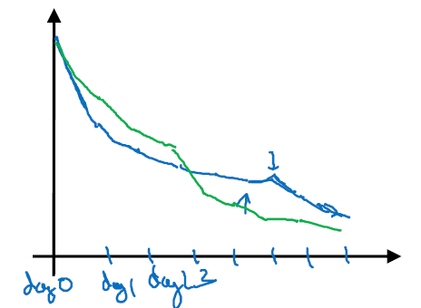

So that's one approach, and people that babysit one model, that is watching performance and patiently nudging the learning rate up or down. But that's usually what happens if you don't have enough computational capacity to train a lot of models at the same time. 

The other approach would be if you train many models in parallel. 

So you might have some setting of the hyperparameters and just let it run by itself, either for a day or even for multiple days, and then you get some learning curve like that; and this could be a plot of the cost function J or cost of your training error or cost of your dataset error, but some metric in your tracking. And then at the same time you might start up a different model with a different setting of the hyperparameters. And so, your second model might generate a different learning curve. I will say that one looks better. And at the same time, you might train a third model, which might generate a learning curve that looks like that, and another one that, maybe this one diverges so it looks like that, and so on. Or you might train many different models in parallel, where these orange lines are different models, right, and so this way you can try a lot of different hyperparameter settings and then just maybe quickly at the end pick the one that works best. Looks like in this example it was, maybe this curve that look best. 

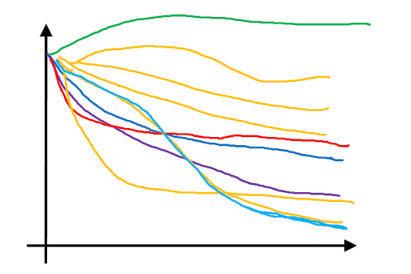

So to make an analogy, I'm going to call the approach babysitting one model is the panda approach. When pandas have children, they have very few children, usually one child at a time, and then they really put a lot of effort into making sure that the baby panda survives. So that's really babysitting. One model or one baby panda.

Whereas the approach Many Model In Parallel is more like what fish do. I'm going to call this the caviar strategy. There's some fish that lay over 100 million eggs in one mating season. But the way fish reproduce is they lay a lot of eggs and don't pay too much attention to any one of them but just see that hopefully one of them, or maybe a bunch of them, will do well.

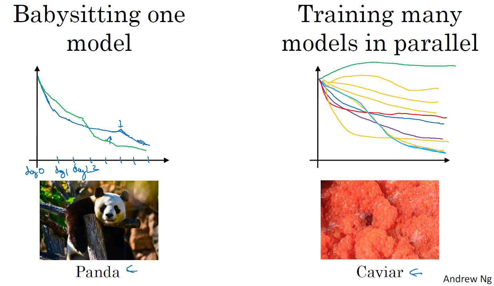

So I guess, this is really the difference between how mammals reproduce versus how fish and a lot of reptiles reproduce. But I'm going to call it the panda approach versus the caviar approach, since that's more fun and memorable.

The way to choose between these two approaches is really a function of how much computational resources you have. If you have enough computers to train a lot of models in parallel, then by all means take the caviar approach and try a lot of different hyperparameters and see what works.

But in some application domains, I see this in some online advertising settings as well as in some computer vision applications, where there's just so much data and the models you want to train are so big that it's difficult to train a lot of models at the same time. It's really application dependent of course, but I've seen those communities use the panda approach a little bit more, where you are kind of babying a single model along and nudging the parameters up and down and trying to make this one model work. 

Although, of course, even the panda approach, having trained one model and then seen it work or not work, maybe in the second week or the third week, maybe I should initialize a different model and then baby that one along just like even pandas, I guess, can have multiple children in their lifetime, even if they have only one, or a very small number of children, at any one time.

## Normalizing Activations in a Network
### Normalizing inputs to speed up learning
In the rise of deep learning, one of the most important ideas has been an algorithm called batch normalization, created by two researchers, Sergey Ioffe and Christian Szegedy. Batch normalization makes your hyperparameter search problem much easier, makes your neural network much more robust. The choice of hyperparameters is a much bigger range of hyperparameters that work well, and will also enable you to much more easily train even very deep networks. 

When training a model, such as logistic regression, you might remember that normalizing the input features can speed up learnings in compute the means, subtract off the means from your training sets. Compute the variances. The sum of xi squared. 

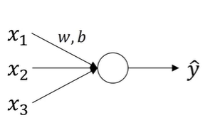

Compute the mean: $\mu = {1 \over m}\Sigma_{i}x^{(i)}$

Subtract off the means from training set: $X = X - \mu$

Compute the variance: $\sigma^2= {1 \over m}\Sigma_{i}x^{(i)2}$. This is an element-wise squaring.

Normalize your data set according to the variances: $X = {X \over {\sigma}}$

We saw in an earlier video how this can turn the contours of your learning problem from something that might be very elongated to something that is more round, and easier for an algorithm like gradient descent to optimize. 

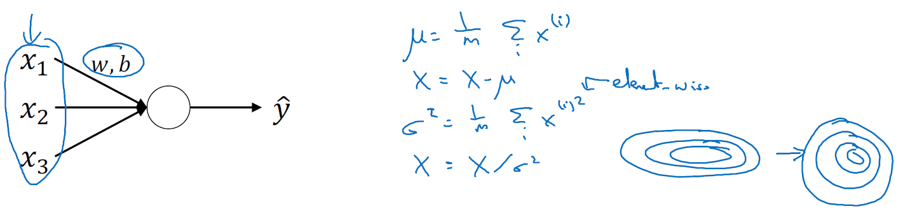

So this works, in terms of normalizing the input feature values to a neural network, alter the regression. 


How about a deeper model? You have not just input features x, but in this layer you have activations $a^{[2]}$, in this layer, you have activations $a^{[2]}$ and so on. So if you want to train the parameters, say $w^{[3]}$, $b^{[3]}$, then wouldn't it be nice if you can normalize the mean and variance of $a^{[2]}$ to make the training of w3, b3 more efficient? 

In the case of logistic regression, we saw how normalizing x1, x2, x3 maybe helps you train w and b more efficiently. So here, the question is, for any hidden layer, can we normalize, the values of a, let's say $a^{[2]}$, in this example but really any hidden layer, so as to train $w^{[3]}$ $b^{[3]}$ faster? Since $a^{[2]}$ is the input to the next layer, that therefore affects your training of $w^{[3]}$ and $b^{[3]}$.

This is what batch norm does, batch normalization, or batch norm for short, does.

Although technically, we'll actually normalize the values of not $a^{[2]}$ but $z^{[2]}$. There are some debates in the deep learning literature about whether you should normalize the value before the activation function, so $z^{[2]}$, or whether you should normalize the value after applying the activation function, $a^{[2]}$. In practice, normalizing $z^{[2]}$ is done much more often. So that's the version I'll present and what I would recommend you use as a default choice. 

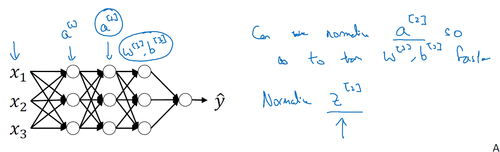

### Implementing Batch Norm
Given some intermediate values, in your neural net. 

Let's say that you have some hidden unit values $z^{[1]}$ up to $z^{[m]}$, and this is really from some hidden layers, so it'd be more accurate to write this as z for some hidden layer i for i equals 1 through m $z^{[l](i)}$. But to reduce writing, I'm going to omit this [l], just to simplify the notation on this line.

Given these values, what you do is compute the mean as follows. Okay, and all this is specific to some layer l, but I'm omitting the [l]. 

$\mu = {1 \over m}\Sigma_{i}z^{(i)}$

And then you compute the variance using pretty much the formula you would expect

$\sigma^2= {1 \over m}\Sigma_{i}(z^{(i)}-\mu)^2$

Then you would take each the zis and normalize it. 

$z^{(i)}_{norm} = {{z^{(i)}-\mu} \over \sqrt{\sigma^2+\epsilon}}$

For numerical stability, we usually add epsilon to the denominator just in case sigma squared turns out to be zero in some estimate. 

Now we've taken these values z and normalized them to have mean 0 and standard unit variance. So every component of z has mean 0 and variance 1. But we don't want the hidden units to always have mean 0 and variance 1. Maybe it makes sense for hidden units to have a different distribution, so what we'll do instead is compute, I'm going to call this z tilde = gamma zi norm + beta. 

$\tilde{z}^{(i)}=\gamma z^{(i)}_{norm} + \beta$

Gamma and beta are learnable parameters of your model. 

We're using gradient descent, or some other algorithm, like the gradient descent of momentum, or RMSProper or Adam, you would update the parameters gamma and beta, just as you would update the weights of your neural network. 

Notice that the effect of gamma and beta is that it allows you to set the mean of $\tilde{z}$ to be whatever you want it to be. In fact, if gamma equals square root sigma squared plus epsilon

$\gamma=\sqrt{\sigma^2 + \epsilon}$

If gamma were equal to this denominator term. And if beta were equal to mu

$\beta = \mu$

Then the effect of $\gamma z^{(i)}_{norm} + \beta$ is that it would exactly invert this equation $z^{(i)}_{norm}$.

If

$\gamma=\sqrt{\sigma^2 + \epsilon}$ 

and

$\beta = \mu$

Then

$\tilde{z}=z^{(i)}$

By an appropriate setting of the parameters gamma and beta, this normalization step, that is, these above four equations is just computing essentially the identity function. But by choosing other values of gamma and beta, this allows you to make the hidden unit values have other means and variances as well. 

The way you fit this into your neural network is, whereas previously you were using these values $z^{(1)}$, $z^{(2)}$, and so on, you would now use $\tilde{z}^{(i)}$, instead of $z^{(i)}$ for the later computations in your neural network. And you want to put back in this [l] to explicitly denote which layer it is in, you can put it back there $z^{[l](i)}$, $\tilde{z}^{[l](i)}$.

The intuition I hope you'll take away from this is that we saw how normalizing the input features X can help learning in a neural network. And what batch norm does is it applies that normalization process not just to the input layer, but to the values even deep in some hidden layer in the neural network. So it will apply this type of normalization to normalize the mean and variance of some of your hidden units' values, z.

One difference between the training input and these hidden unit values is you might not want your hidden unit values be forced to have mean 0 and variance 1.

For example, if you have a sigmoid activation function, you don't want your values to always be clustered here. 

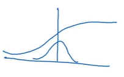

You might want them to have a larger variance or have a mean that's different than 0, in order to better take advantage of the nonlinearity of the sigmoid function rather than have all your values be in just this linear regime. 

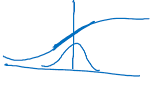

So that's why with the parameters gamma and beta, you can now make sure that your $z^{(i)}$ values have the range of values that you want. 

What it does really is it then shows that your hidden units have standardized mean and variance, where the mean and variance are controlled by two explicit parameters gamma and beta which the learning algorithm can set to whatever it wants. So what it really does is it normalizes in mean and variance of these hidden unit values, really the $z^{(i)}$, to have some fixed mean and variance. And that mean and variance could be 0 and 1, or it could be some other value, and it's controlled by these parameters gamma and beta.

### Explained by ChatGPT
You already know that before training a model, it helps to normalize the input features (e.g., make each feature have mean 0 and variance 1). This helps gradient descent converge faster because all features are on a similar scale.

But now imagine a deep network — not just the input layer, but many hidden layers. Even if your input is normalized, the hidden layer activations can get out of control (too big or too small) during training.

As training goes on, the distribution of activations (Z or A) inside the network keeps changing because earlier layers keep updating their weights.

So, the next layer keeps receiving inputs with different scales — sometimes very large, sometimes very small.

That means:
* Gradients may explode or vanish.
* Training slows down.
* The network becomes harder to tune.

This constant change of distributions inside the network is called Internal Covariate Shift.

Batch Normalization says:

“Why don’t we normalize the activations inside the network, just like we normalize inputs?”

So, for every layer (say layer l), during training, we take all activations $Z^{[l]}$ from the mini-batch and normalize them.

After normalization, we still want the network to be flexible, so we add two learnable parameters — γ (gamma) and β (beta).

$\tilde{z}^{(i)}=\gamma z^{(i)}_{norm} + \beta$

This lets the network “undo” normalization if it’s better for performance.

For example:
* If the best activations should be around 5, not 0 → β shifts the mean.
* If they should be more spread out → γ scales the variance.

Imagine each layer in your neural network is like a worker on a factory line.
If one worker keeps sending different-sized boxes every few minutes, the next worker has to constantly readjust their tools.

Batch Normalization is like standardizing the box size before passing it on — so every worker (layer) can do their job smoothly without constant adjustments.

Imagine activations (Z values) before normalization:

Distribution 1: mean = 100, variance = 500
Distribution 2: mean = -3, variance = 0.1

After BatchNorm:

Distribution (normalized): mean = 0, variance = 1

No matter how weird the raw Z values are, the network now works on a stable range of values, layer by layer.

Suppose you have a bunch of numbers — say the activations (outputs) from some neurons in a layer:

[2, 4, 6, 8, 10]

Step 1. Compute the mean (average)

mean = (2+4+6+8+10)/5 = 6

Step 2. Compute the variance

Variance measures how spread out the numbers are from their mean.

variance = (2−6)^2+(4−6)^2+(6−6)^2+(8−6)^2+(10−6)^2​/5 = 8

The higher the variance, the more spread out your data is.

We normalize by subtracting the mean (so data is centered around 0)
and dividing by the standard deviation (so it has a consistent spread).

Step 3. Subtract the mean (make mean = 0)

Subtract 6 from each number:

[2-6, 4-6, 6-6, 8-6, 10-6] = [-4, -2, 0, 2, 4]

Now if you take the average:

mean = (-4-2+0+2+4)/5 = 0

So now the data is centered around zero.

Step 4. Divide by the standard deviation (make variance = 1)

Standard deviation = √variance = √8 ≈ 2.83

Divide each number by 2.83:

[-4/2.83, -2/2.83, 0, 2/2.83, 4/2.83] ≈ [-1.41, -0.71, 0, 0.71, 1.41]


Now:
* Mean ≈ 0
* Variance ≈ 1

We’ve forced mean = 0, variance = 1

Why do this?

Imagine you’re training a neural network.

If activations (numbers flowing through the layers) are too big or too small, the gradients can explode or vanish — making learning unstable and slow.

By “forcing” mean = 0 and variance = 1 at every layer:
* Activations are centered (half positive, half negative)
* They have a consistent scale (not too wide or narrow)
* Gradients are stable → training becomes much smoother

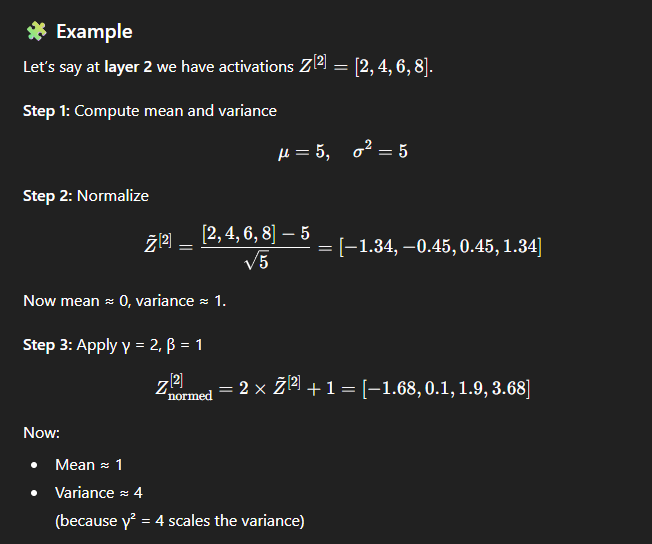

## Fitting Batch Norm into a Neural Network
### Adding Batch Norm to a network
You have seen the equations for how to invent Batch Norm for maybe a single hidden layer. Let's see how it feeds into the training of a deep network. 

Let's say you have a neural network like this.

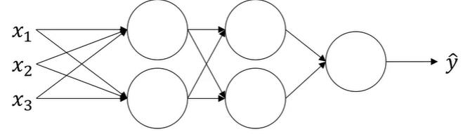

You've seen me say before that you can view each of the unit as computing two things. First, it computes Z and then it applies the activation function to compute A. So we can think of each of these circles as representing a two-step computation.

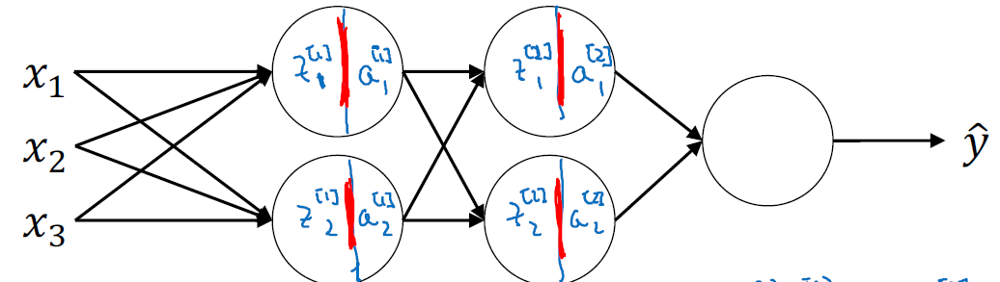

If you were not applying Batch Norm, you would have an input X feed into the first hidden layer, and then first compute $Z^{[1]}$, and this is governed by the parameters $W^{[1]}$ and $b^{[1]}$. Then feed $Z^{[1]}$ into the activation function to compute $a^{[1]}$.

But what would do in Batch Norm is take this value $Z^{[1]}$, and apply Batch Norm, sometimes abbreviated BN to it, and that's going to be governed by parameters, Beta 1 and Gamma 1, and this will give you this new normalize value $Z^{[1]}$. And then you feed that to the activation function to get $a^{[1]}$, which is $g^{[1]}$ applied to $\tilde{Z}^{[1]}$.

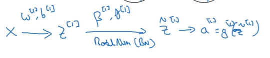

Now, you've done the computation for the first layer, where this Batch Norms that really occurs in between the computation from Z and a.

Next, you take this value $a^{[1]}$ and use it to compute $Z^{[2]}$, and so this is now governed by $W^{[2]}$ and $b^{[2]}$. And similar to what you did for the first layer, you would take $Z^{[2]} and apply it through Batch Norm, and we abbreviate it to BN now. This is governed by Batch Norm parameters specific to the next layer. So Beta 2, Gamma 2, and now this gives you $\tilde{Z}^{[2]}$, and you use that to compute $a^{[2]}$ by applying the activation function, and so on.

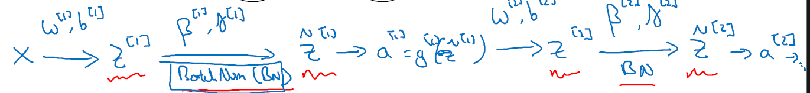

So once again, the Batch Norms that happens between computing Z and computing a. 

The intuition is that, instead of using the un-normalized value Z, you can use the normalized value $\tilde{Z}$, that's the first layer. The second layer as well, instead of using the un-normalized value $Z^{[2]}$, you can use the mean and variance normalized values $\tilde{Z}^{[2]}$. 

The parameters of your network are going to be $W^{[1]}$ and $b^{[1]}$. It turns out we'll get rid of the parameters but we'll see why in the next slide. But for now, imagine the parameters are the usual $W^{[1]}$, $b^{[1]}$ to $W^{[L]}$, $b^{[L]}$. We added to this new network additional parameters $\beta^{[1]}$, $\gamma^{[1]}$ to $\beta^{[L]}$, $\gamma^{[L]}$. For each layer in which you are applying Batch Norm. 

For clarity, note that these Betas here, these have nothing to do with the hyperparameter beta that we had for momentum over the computing the various exponentially weighted averages. The authors of the Adam paper use Beta on their paper to denote that hyperparameter, the authors of the Batch Norm paper had used Beta to denote this parameter, but these are two completely different Betas. I decided to stick with Beta in both cases, in case you read the original papers. But the Beta 1, Beta 2, and so on, that Batch Norm tries to learn is a different Beta than the hyperparameter Beta used in momentum and the Adam and RMSprop algorithms.

These are the new parameters of your algorithm, you would then use whether optimization you want, such as gradient descent in order to implement it.

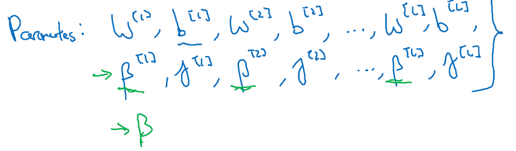

For example, you might compute $d\beta^{[l]}$ a given layer, and then update the parameters Beta, gets updated as $\beta=\beta-\alpha d\beta^{[l]}$. And you can also use Adam or RMSprop or momentum in order to update the parameters Beta and Gamma, not just gradient descent.

And even though in the previous video, I had explained what the Batch Norm operation does, computes mean and variances and subtracts and divides by them. If they are using a Deep Learning Programming Framework, usually you won't have to implement the Batch Norm step on Batch Norm layer yourself. So the probing frameworks, that can be sub one line of code. So for example, in terms of flow framework, you can implement Batch Normalization with this function. 

tf.nn.batch_normalization

We'll talk more about probing frameworks later, but in practice you might not end up needing to implement all these details yourself, knowing how it works so that you can get a better understanding of what your code is doing. But implementing Batch Norm is often one line of code in the deep learning frameworks.

So far, we've talked about Batch Norm as if you were training on your entire training site at the time as if you are using Batch gradient descent. In practice, Batch Norm is usually applied with mini-batches of your training set.

### Working with mini-batches
The way you actually apply Batch Norm is you take your first mini-batch and compute $Z^{[1]}$. Same as we did on the previous slide using the parameters $W^{[1]}$, $b^{[1]}$ and then you take just this mini-batch and computer mean and variance of the $Z^{[1]}$ on just this mini batch and then Batch Norm would subtract by the mean and divide by the standard deviation and then re-scale by Beta 1, Gamma 1, to give you $\tilde{Z}^{[1]}$, and all this is on the first mini-batch, then you apply the activation function to get $a^{[1]}$, and then you compute $Z^{[2]}$ using $W^{[2]}$, $b^{[2]}$, and so on.

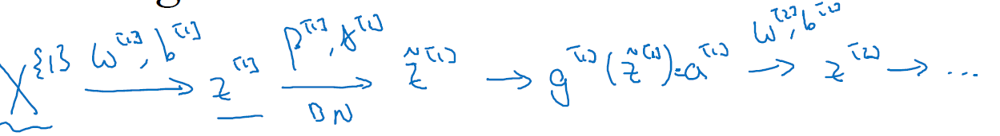

So you do all this in order to perform one step of gradient descent on the first mini-batch and then goes to the second mini-batch $X^{\{2\}}$, and you do something similar where you will now compute $Z^{[1]}$ on the second mini-batch and then use Batch Norm to compute $\tilde{Z}^{[1]}$. And so here in this Batch Norm step, you would be normalizing $\tilde{Z}^{[1]}$ using just the data in your second mini-batch, so does Batch Norm step here. Let's look at the examples in your second mini-batch, computing the mean and variances of the $Z^{[1]}$'s on just that mini-batch and re-scaling by Beta and Gamma to get $\tilde{Z}^{[1]}$, and so on. And you do this with a third mini-batch, and keep training. 


Parameters: $W^{[l]}$, $b^{[l]}$, $\beta^{[l]}$, $\gamma^{[l]}$

$Z^{[l]} = W^{[l]}a^{[l-1]}+b^{[l]}$

What Batch Norm does, is it is going to look at the mini-batch and normalize $Z^{[l]}$ to first of mean 0 and standard variance, and then a rescale by Beta and Gamma. But what that means is that, whatever is the value of $b^{[l]}$ is actually going to just get subtracted out, because during that Batch Normalization step, you are going to compute the means of the $Z^{[l]}$'s and subtract the mean. And so adding any constant to all of the examples in the mini-batch, it doesn't change anything. Because any constant you add will get cancelled out by the mean subtractions step. So, if you're using Batch Norm, you can actually eliminate that parameter, or if you want, think of it as setting it permanently to 0.

Parameterization becomes: $Z^{[l]} = W^{[l]}a^{[l-1]}$. Then compute $^{[l]}_{norm}$, then compute $\tilde{Z}^{[l]}=\gamma Z^{[l]}+\beta^{[l]}$. You end up using this parameter $\beta^{[l]}$ in order to decide whats that mean of $\tilde{Z}^{[l]}$. Which is why guess post in this layer.

Just to recap, because Batch Norm zeroes out the mean of these $Z^{[l]}$ values in the layer, there's no point having this parameter $b^{[l]}$, and so you must get rid of it, and instead is sort of replaced by $\beta^{[l]}$, which is a parameter that controls that ends up affecting the shift or the biased terms.

Finally, remember that the dimension of $Z^{[l]}$, because if you're doing this on one example, it's going to be ($n^{[l]}$,1), and so $b^{[l]}$, a dimension, ($n^{[l]}$,1), if $n^{[l]}$ was the number of hidden units in layer L. And so the dimension of $\beta^{[l]}$ and $\gamma^{[l]}$ is also going to be $n^{[l]}$ by 1 because that's the number of hidden units you have. You have $n^{[l]}$ hidden units, and so $\beta^{[l]}$ and $\gamma^{[l]}$ are used to scale the mean and variance of each of the hidden units to whatever the network wants to set them to.

### Implementing gradient descent
Assuming you're using mini-batch gradient descent

for t=1 to number of Mini batches:
> Compute forward prop on mini batch $X^{\{t\}}$ \
>> In each hidden layer, use Batch Norm to replace $Z^{[l]}$ with $\tilde{Z}^{[l]}$, it ensures that within that mini-batch, the value Z end up with some normalized mean and variance and the values and the version of the normalized mean that and variance is $\tilde{Z}^{[l]}$. \
> Use backprop to compute $dW^{[l]}$, $db^{[l]}$, $d\beta^{[l]}$, $d\gamma^{[l]}$. Although, technically, since you have got to get rid of b, $db^{[l]}$ actually now goes away. \
> Finally, update the parameters. $W^{[l]}=W-\alpha dW^{[l]}$, $\beta^{[l]}=\beta^{[l]}-\alpha d\beta^{[l]}$, so on

If you have computed the gradient as follows, you could use gradient descent. That's what I've written here, but this also works with gradient descent with momentum, or RMSprop, or Adam. Where instead of taking this gradient descent update,nini-batch you could use the updates given by these other algorithms.

As $Z^{[l]} = W^{[l]}a^{[l-1]}+b^{[l]}$

Then BatchNorm subtracts the mean:

$Z^{[l]}_{norm}={{(W^{[l]}a^{[l-1]}+b^{[l]})-\mu^{[l]}} \over {\sqrt{\sigma^{2[l]} + \epsilon}}}$

But notice this: $\mu^{[l]}$ is computed from all values in the batch of $Z^{[l]}$ which includes the effect of $b^{[l]}$. Whatever shift $b^{[l]}$ tries to introduce, BatchNorm immediately subtracts it out by removing the batch mean. So effectively, β replaces the job of the bias.

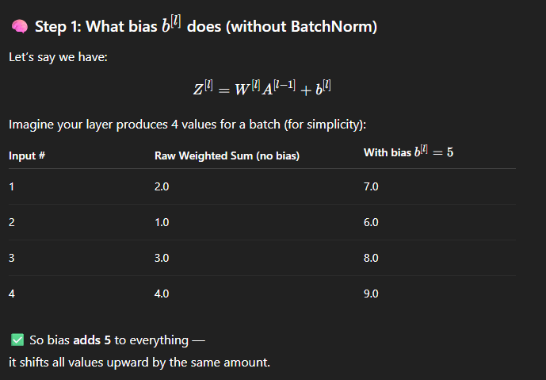


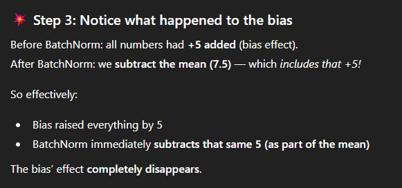

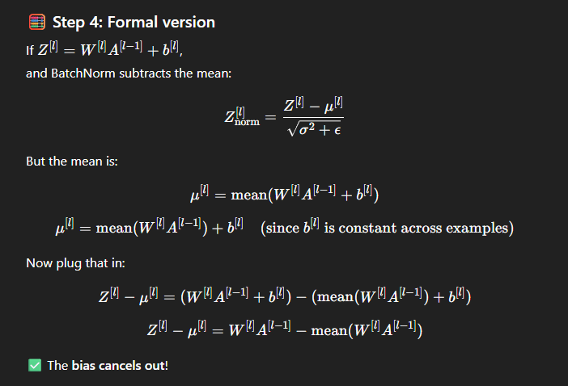

## Why does Batch Norm work?
Batch Normalization (BatchNorm) seems like magic — you add a few lines of code, and suddenly:
* Training becomes faster,
* You can use a larger learning rate,
* You get less overfitting.

You've seen how normalizing the input features, the X's, to mean zero and variance one, how that can speed up learning. So rather than having some features that range from zero to one, and some from one to a 1,000, by normalizing all the features, input features X, to take on a similar range of values that can speed up learning.

One intuition behind why batch norm works is, this is doing a similar thing, but further values in your hidden units and not just for your input there. Now, this is just a partial picture for what batch norm is doing. There are a couple of further intuitions, that will help you gain a deeper understanding of what batch norm is doing.

### Learning on shifting input distribution
A second reason why batch norm works, is it makes weights, later or deeper than your network, say the weight on layer 10, more robust to changes to weights in earlier layers of the neural network, say, in layer 1.

Let's see a training on network, maybe a shallow network, like logistic regression or maybe a neural network, maybe a shallow network like this regression or maybe a deep network, on our famous cat detection task.

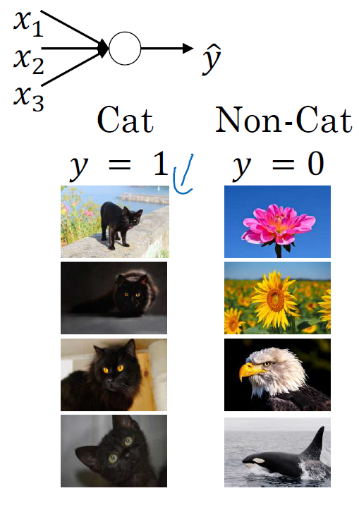

But let's say that you've trained your data sets on all images of black cats. If you now try to apply this network to data with colored cats where the positive examples are not just black cats, but to color cats like on the right, then your cosfa might not do very well.

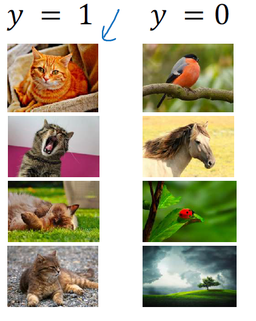

So in pictures, if your training set looks like this, where you have positive examples here and negative examples here, but you were to try to generalize it, to a data set where maybe positive examples are here and the negative examples are here, then you might not expect a module trained on the data on the left to do very well on the data on the right.

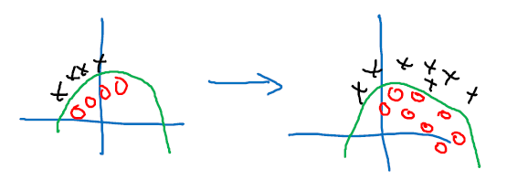

Even though there might be the same function that actually works well, but you wouldn't expect your learning algorithm to discover that green decision boundary, just looking at the data on the left.

This idea of your data distribution changing goes by the somewhat fancy name, **covariate shift**. The idea is that, if you've learned some X to Y mapping, if the distribution of X changes, then you might need to retrain your learning algorithm.

This is true even if the function, the ground true function, mapping from X to Y, remains unchanged, which it is in this example, because the ground true function is, in this picture a cat or not. And the need to retrain your function becomes even more acute or it becomes even worse if the ground true function shifts as well.

Think of a neural network like a long chain of transformations:

$X->A^{[1]}->A^{[2]}->A^{[3]}->...$

Each layer’s output becomes the next layer’s input.

Now imagine:

The inputs to layer 2 suddenly have a much larger or smaller range than before (say, instead of numbers around 0–1, now they’re around 100–200).

The next layer’s weights, which were tuned to work well for inputs in the range 0–1, now receive totally different scales.

This problem is called internal covariate shift — each layer’s input distribution keeps shifting during training as the earlier layers’ parameters change.

When that happens, training becomes:
* slower, because every layer must keep readjusting to new input scales.
* unstable, because large inputs can blow up activations or gradients.

BatchNorm fixes this by making sure every layer always outputs normalized values (mean 0, variance 1) before applying activation functions.

So each layer receives inputs that are:
* Consistent in scale,
* Centered around zero,
* And not too extreme.

This stabilizes training.

It’s like always feeding your next layer “well-behaved” data, regardless of what happened earlier.

### Why this is a problem with neural networks?
So, how does this problem of covariate shift apply to a neural network?

Consider a deep network like this, and let's look at the learning process from the perspective of this certain layer, the third hidden layer. So this network has learned the parameters $W^{[3]}$ and $b^{[3]}$. 

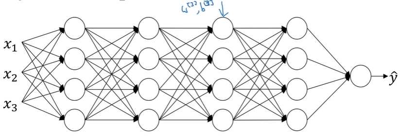

From the perspective of the third hidden layer, it gets some set of values from the earlier layers, and then it has to do some stuff to hopefully make the output Y-hat close to the ground true value Y. 

Let me cover up the nodes on the left for a second. So from the perspective of this third hidden layer, it gets some values, let's call them $a^{[2]}_1$, $a^{[2]}_2$, $a^{[2]}_3$, and $a^{[2]}_4$.

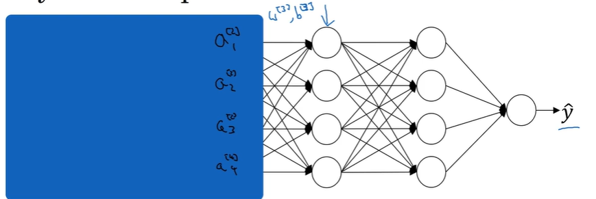

But these values might as well be features X1, X2, X3, X4, and the job of the third hidden layer is to take these values and find a way to map them to Y-hat. 

You can imagine doing gradient descent, so that these parameters $W^{[3]}$ and $b^{[3]}$ as well as maybe $W^{[4]}$ and $b^{[4]}$, and even $W^{[5]}$ and $b^{[5]}$, maybe try and learn those parameters, so the network does a good job, mapping from the values I drew in black on the left to the output values Y-hat. 

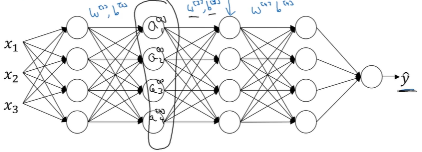

Let's uncover the left of the network again. The network is also adapting parameters $W^{[2]}$ and $b^{[2]}$ and $W^{[1]}$ and $b^{[1]}$, and so as these parameters change, these values, $a^{[2]}$, will also change. 

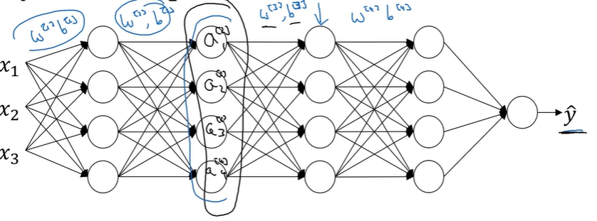

From the perspective of the third hidden layer, these hidden unit values are changing all the time, and so it's suffering from the problem of covariate shift that we talked about on the previous slide. 

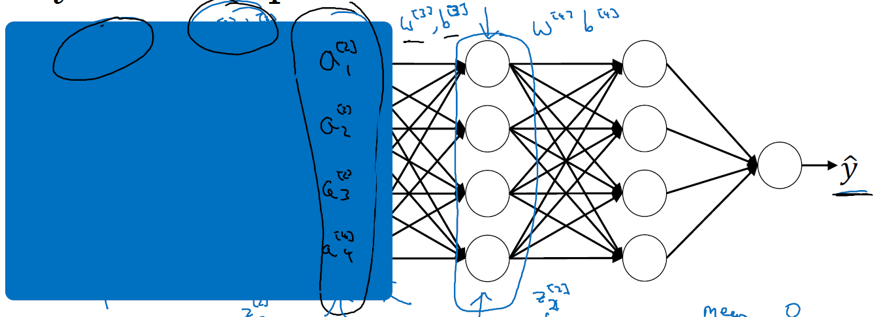

What batch norm does, is it reduces the amount that the distribution of these hidden unit values shifts around.

If it were to plot the distribution of these hidden unit values, maybe this is technically renormalized Z, so this is actually $Z^{[2]}_1$ and  $Z^{[2]}_2$, and I also plot two values instead of four values, so we can visualize in 2D.

What batch norm is saying is that, the values for $Z^{[2]}_1$ Z and  $Z^{[2]}_2$ can change, and indeed they will change when the neural network updates the parameters in the earlier layers. But what batch norm ensures is that no matter how it changes, the mean and variance of $Z^{[2]}_1$ and  $Z^{[2]}_2$ will remain the same. So even if the exact values of $Z^{[2]}_1$ and  $Z^{[2]}_2$ change, their mean and variance will at least stay same mean 0 and variance 1. Or, not necessarily mean 0 and variance 1, but whatever value is governed by $\beta^{[2]}$ and $\gamma^{[2]}$. Which, if the neural networks chooses, can force it to be mean zero and variance one. 

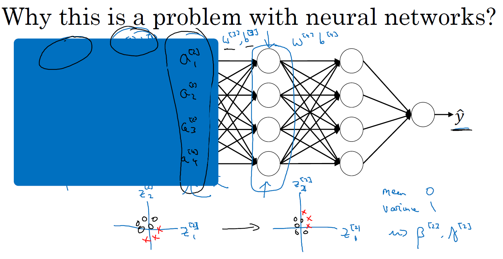

Or, really, any other mean and variance. But what this does is, it limits the amount to which updating the parameters in the earlier layers can affect the distribution of values that the third layer now sees and therefore has to learn on.

Batch norm reduces the problem of the input values changing, it really causes these values to become more stable, so that the later layers of the neural network has more firm ground to stand on. Even though the input distribution changes a bit, it changes less, and what this does is, even as the earlier layers keep learning, the amounts that this forces the later layers to adapt to as early as layer changes is reduced or, if you will, it weakens the coupling between what the early layers parameters has to do and what the later layers parameters have to do. And so it allows each layer of the network to learn by itself, a little bit more independently of other layers, and this has the effect of speeding up of learning in the whole network.

The takeaway is that batch norm means that, especially from the perspective of one of the later layers of the neural network, the earlier layers don't get to shift around as much, because they're constrained to have the same mean and variance. And so this makes the job of learning on the later layers easier.

### Batch Norm as regularization
It turns out batch norm has a second effect, it has a slight regularization effect.
* Each mini-batch, I will say mini-batch $X^{\{t\}}$, has the values $Z^{[l]}$, scaled by the mean and variance computed on just that one mini-batch. Now, because the mean and variance computed on just that mini-batch as opposed to computed on the entire data set, that mean and variance has a little bit of noise in it, because it's computed just on your mini-batch of, say, 64, or 128, or maybe 256 or larger training examples. So because the mean and variance is a little bit noisy because it's estimated with just a relatively small sample of data, the scaling process, going from $Z^{[l]}$ to $\tilde{Z}^{[l]}$, that process is a little bit noisy as well, because it's computed, using a slightly noisy mean and variance. 
* Similar to dropout, it adds some noise to each hidden layer's activations. The way dropout has noises, it takes a hidden unit and it multiplies it by zero with some probability. And multiplies it by one with some probability. And so your dropout has multiple of noise because it's multiplied by 0 or 1, whereas batch norm has multiples of noise because of scaling by the standard deviation, as well as additive noise because it's subtracting the mean. Well, here the estimates of the mean and the standard deviation are noisy. And so, similar to dropout, batch norm therefore has a slight regularization effect. Because by adding noise to the hidden units, it's forcing the downstream hidden units not to rely too much on any one hidden unit. And so similar to dropout, it adds noise to the hidden layers and therefore has a very slight regularization effect. Because the noise added is quite small, this is not a huge regularization effect, and you might use batch norm together with dropouts if you want the more powerful regularization effect of dropout. 
* And maybe one other slightly non-intuitive effect is that, if you use a bigger mini-batch size, right, so if you use use a mini-batch size of, say, 512 instead of 64, by using a larger mini-batch size, you're reducing this noise and therefore also reducing this regularization effect. So that's one strange property of dropout which is that by using a bigger mini-batch size, you reduce the regularization effect.

Having said this, I wouldn't really use batch norm as a regularizer, that's really not the intent of batch norm, but sometimes it has this extra intended or unintended effect on your learning algorithm. But, really, don't turn to batch norm as a regularization.

Use it as a way to normalize your hidden units activations and therefore speed up learning. And I think the regularization is an almost unintended side effect.

When you train, you don’t usually use all data at once.
You take small groups of data called mini-batches.

Example:
* You have 1000 training examples.
* You use mini-batches of 100 examples.
* So: 10 mini-batches total.

Now, BatchNorm will compute the mean and variance for each batch separately.

That means:
* Batch 1 → has its own average and spread
* Batch 2 → might have slightly different average and spread
* Batch 3 → slightly different again

Each one gets normalized differently.

Because each batch’s mean and variance are slightly different,
your network’s activations (outputs) also change a little from batch to batch.

|Batch|	Mean|	Variance|	Result|
|-|-|-|-|
|Batch 1|	2.1|	0.9	|Normalized around 0|
|Batch 2	|1.8|1.2|	Normalized slightly differently|
|Batch 3|	2.0|	1.0|	Normalized again differently|

So even if the input image is the same cat picture, the normalized value might change a little depending on which batch it’s in.

That’s what Andrew means by:

“Each mini-batch is scaled by its own mean/variance, adding some noise.”

It’s not “noise” like random data — it’s just small randomness because of the different batches.

This small randomness prevents the network from becoming too “confident” or too “rigid.”

Think of it like dropout:
* Dropout randomly turns off neurons.
* BatchNorm randomly shifts the neuron values a little bit.

Both make the network more robust — it learns patterns that work under small variations.

This is what we call regularization — it helps prevent overfitting.

“Regularization” means stopping the model from memorizing the training data.

Because each batch produces slightly different normalization,
the model’s output jitters a little during training.

So the model learns:

“I should not depend too much on exact input values — I must be flexible.”

That flexibility makes it perform better on new data.

When you test (predict new data), you don’t want that jitter anymore — you want stable results.

So instead of using the batch mean/variance, BatchNorm uses the average mean and variance from training.

That way, the test data doesn’t depend on random batches.

## Batch Norm at Test Time
Batch norm processes your data one mini batch at a time, but the test time you might need to process the examples one at a time.

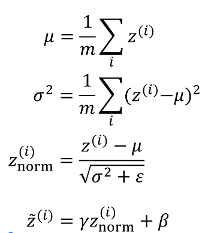

Notice that mu and sigma squared which you need for this scaling calculation are computed on the entire mini batch. But the test time you might not have a mini batch of 64, 128 or 256 examples to process at the same time. So, you need some different way of coming up with mu and sigma squared. And if you have just one example, taking the mean and variance of that one example, doesn't make sense. 

In order to apply your neural network and test time is to come up with some separate estimate of mu and sigma squared. And in typical implementations of batch norm, what you do is estimate this using a exponentially weighted average where the average is across the mini batches.

Let's pick some layer l and let's say you're going through mini batches $X^{\{1\}}$, $X^{\{2\}}$ together with the corresponding values of Y and so on. So, when training on $X^{\{1\}}$ for that layer l, you get some $\mu^{[l]}$. And in fact, I'm going to write this as mu for the first mini batch and that layer $\mu^{\{1\}[l]}$. 

Then when you train on the second mini batch for that layer and that mini batch, you end up with some second value of mu $\mu^{\{2\}[l]}$. And then for the fourth mini batch in this hidden layer, you end up with some third value for mu $\mu^{\{3\}[l]}$. 

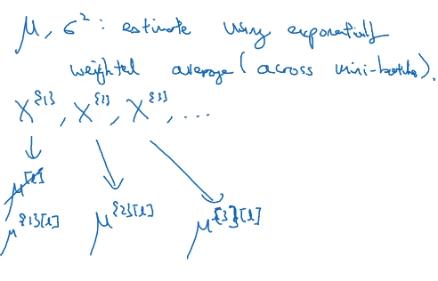

So just as we saw how to use a exponentially weighted average to compute the mean of Theta one, Theta two, Theta three when you were trying to compute a exponentially weighted average of the current temperature, you would do that to keep track of what's the latest average value of this mean vector you've seen. So that exponentially weighted average becomes your estimate for what the mean of the Zs is for that hidden layer and similarly, you use an exponentially weighted average to keep track of these values of sigma squared that you see on the first mini batch in that layer $\sigma^{2\{1\}[l]}$, sigma square that you see on second mini batch $\sigma^{2\{2\}[l]}$ and so on.

You keep a running average of the mu and the sigma squared that you're seeing for each layer as you train the neural network across different mini batches. 

Finally at test time, what you do is in place of this equation, you would just compute Z norm using whatever value your Z have, and using your exponentially weighted average of the mu and sigma square whatever was the latest value you have to do the scaling here.

$Z_{norm} = {{Z-\mu} \over \sqrt{\sigma^2+\epsilon}}$

And then you would compute Z̃ on your one test example using that Z norm that we just computed on the left and using the beta and gamma parameters that you have learned during your neural network training process.

$\tilde{Z}=\gamma Z_{norm} + \beta$

The takeaway from this is that during training time mu and sigma squared are computed on an entire mini batch of say 64, 128 or some number of examples. But that test time, you might need to process a single example at a time. 

So, the way to do that is to estimate mu and sigma squared from your training set and there are many ways to do that. You could in theory run your whole training set through your final network to get mu and sigma squared. But in practice, what people usually do is implement and exponentially weighted average where you just keep track of the mu and sigma squared values you're seeing during training and use and exponentially the weighted average, also sometimes called the running average, to just get a rough estimate of mu and sigma squared and then you use those values of mu and sigma squared that test time to do the scale and you need the hidden unit values Z.

In practice, this process is pretty robust to the exact way you used to estimate mu and sigma squared. So, I wouldn't worry too much about exactly how you do this and if you're using a deep learning framework, they'll usually have some default way to estimate the mu and sigma squared that should work reasonably well as well. But in practice, any reasonable way to estimate the mean and variance of your hidden unit values Z should work fine at test.

### Explained by ChatGPT
When you’re testing (or deploying) your model, you don’t use mini-batches anymore — you might just input one image, one sentence, or a small batch.

That’s a problem!

Because:
* You can’t compute a good mean and variance from one example.
* You need stable, consistent normalization for fair predictions.

During training, while you process many mini-batches,
you can keep track of the overall mean and variance across all batches.

We call these:
* running_mean → an average of all mini-batch means seen so far
* running_var → an average of all mini-batch variances seen so far

Imagine you have 3 mini-batches in training:

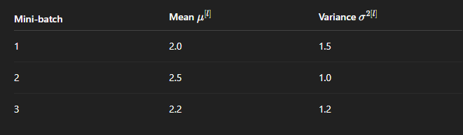

During training, you maintain running averages like this:

$runningmean = 0.9*oldmean + 0.1*newbatchmean$

So over time, you end up with:
* running_mean ≈ 2.23
* running_var ≈ 1.23

When testing, you don’t compute the mean/variance from the current data. Instead, you use the stored averages:

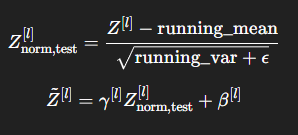

Let’s say you train on 100 mini-batches.
Each mini-batch has its own mean and variance

A simple average would be:

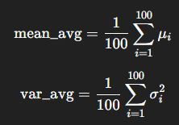

That’s fine if you know exactly when training ends — and if your data distribution doesn’t change much over time.

In practice:

Neural network parameters change every batch.

The outputs $Z^{[l]}$ — and their means/variances — keep shifting.

That means:

The early mini-batch statistics (from when your model was still “bad”) may no longer represent what your model looks like later.

So if you take a simple average of all 100 mini-batches, you’re giving equal weight to very outdated data.

That’s not what you want.

Instead of keeping track of all previous means equally,
BatchNorm uses an exponentially weighted moving average (EWMA):

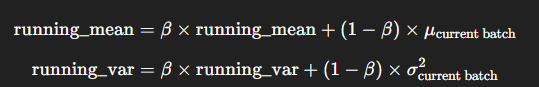

where β is usually around 0.9 or 0.99.

This means:
* The recent batches have more influence.
* The older batches fade away exponentially.

So the running mean “adapts” as your network’s behavior evolves.

Imagine you’re tracking the average price of coffee beans:

In January, it’s $2.00.

In February, it’s $3.00.

In March, it’s $5.00.

If you take a simple average, you’ll say:

Average = (2 + 3 + 5) / 3 = 3.33

But by March, the real price is $5.00 — your “average” is outdated.

An exponentially weighted average will say:

Average ≈ 0.9 × 3.33 + 0.1 × 5 = 3.5, then 3.8, then 4.1, etc.

So it quickly tracks current values while still smoothing noise.

That’s exactly what BatchNorm needs — it tracks how your layer outputs are changing as training continues.

BatchNorm uses exponentially weighted averages because model behavior changes during training — and EWMA lets the running statistics adapt smoothly to those changes, while ignoring stale early-batch values.

Suppose you have these batch means:

```matlab
Batch 1 mean = 2.0
Batch 2 mean = 4.0
Batch 3 mean = 6.0
```

Simple average:

(2+4+6)/3=4.0

Exponential average (β = 0.9):

```yaml
After batch 1: running_mean = 0.9*0 + 0.1*2 = 0.2
After batch 2: running_mean = 0.9*0.2 + 0.1*4 = 0.58
After batch 3: running_mean = 0.9*0.58 + 0.1*6 = 1.12
```

→ It’s moving toward the latest values (6.0) instead of staying at 4.0.

That makes it much more useful for test-time normalization.

## Softmax Regression
### Recognizing cats, dogs, and baby chicks
There's a generalization of logistic regression called Softmax regression. They let you make predictions where you're trying to recognize one of C or one of multiple classes, rather than just recognize two classes. 

Let's say that instead of just recognizing cats you want to recognize cats, dogs, and baby chicks.

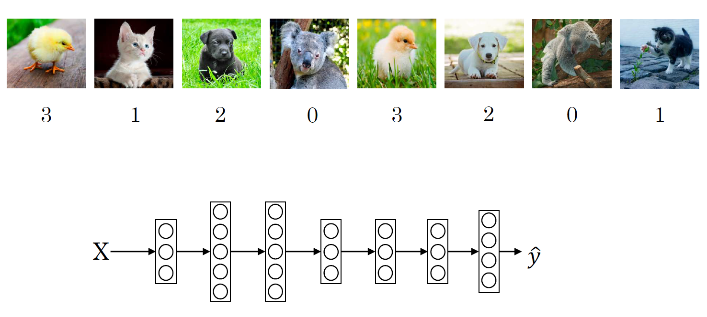

* Class 1 is cat
* Class 2 is dog
* Class 3 is chick
* Class 0 is others

I'm going to use capital C to denote the number of classes you're trying to categorize your inputs into. In this case, you have four possible classes, including the other or the none of the above class.

C = num of classes = 4 (0, 1, 2, 3)

In this case, we're going to build a new NN, where the output layer has four, or in this case the variable capital alphabet C output units.

N, the number of units in the output layer which is layer L is going to equal to 4 or in general this is going to equal to C. 

$n^{[L]}=4=C$

What we want is for the number of units in the output layer to tell us what is the probability of each of these four classes. So the first node here is supposed to output, or we want it to output the probability that is the other class, given the input x, this will output probability there's a cat. Give an x, this will output probability as a dog. Give an x, that will output the probability. I'm just going to abbreviate baby chick to baby C, given the input x.

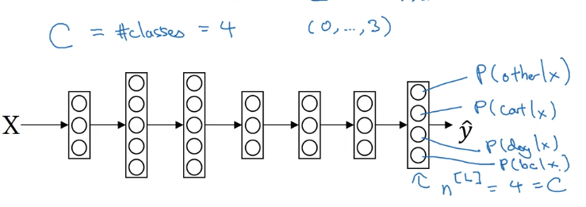

Output label $\hat{y}$ is (4,1) dimentional vector, because it now has to output four numbers, giving you these four probabilities. 

P(other|x) + P(cat|x) + P(dog|x) + P(bc|x) = 1

The standard model for getting your network to do this uses what's called a Softmax layer, and the output layer in order to generate these outputs. 

### Softmax layer
So in the final layer of the neural network, you are going to compute as usual the linear part of the layers. 

$Z^{[L]} = W^{[L]}*a^{[L-1]} + b^{[L]}$

Now having computed Z, you now need to apply what's called the Softmax activation function. So that activation function is a bit unusual for the Softmax layer, but this is what it does.

First, we're going to computes a temporary variable, which we're going to call t, which is e to the z L. So this is a part element-wise.

$t = e^{Z^{[L]}}$

$Z^{[L]}$ is (4,1) vector. This is an element wise exponentiation.

t is also (4,1) vector

$a^{[L]} = {e^{Z^{[L]}} \over {\Sigma_{i=1}^4t_i}}$

$a^{[L]}$ is (4,1)

$a^{[L]}_i = {{t_i} \over {\Sigma_{i=1}^4t_i}}$

Let's say that your computer $Z^{[L]}$, and $Z^{[L]}$ is a four dimensional vector, let's say is 5, 2, -1, 3.


What we're going to do is use this element-wise exponentiation to compute this vector t. So t is going to be e to the 5, e to the 2, e to the -1, e to the 3. 

And if you plug that in the calculator, these are the values you get. 

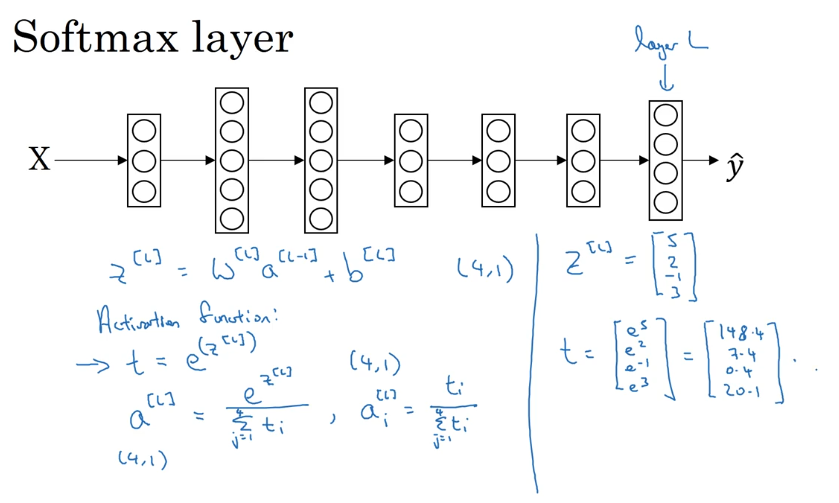

E to the 5 is 1484, e squared is about 7.4, e to the -1 is 0.4, and e cubed is 20.1. 

The way we go from the vector t to the vector $a^{[L]}$ is just to normalize these entries to sum to one. So if you sum up the elements of t, if you just add up those 4 numbers you get 176.3.

$\Sigma_{i=1}^4t_i = 176.3

So finally, $a^{[L]}$ is just going to be this vector t, as a vector, divided by 176.3.

$a^{[L]} = {t \over 176.3}$

For example, this first node here, this will output e to the 5 divided by 176.3. And that turns out to be 0.842. So saying that, for this image, if this is the value of Z you get, the chance of it being called zero is 84.2%. 

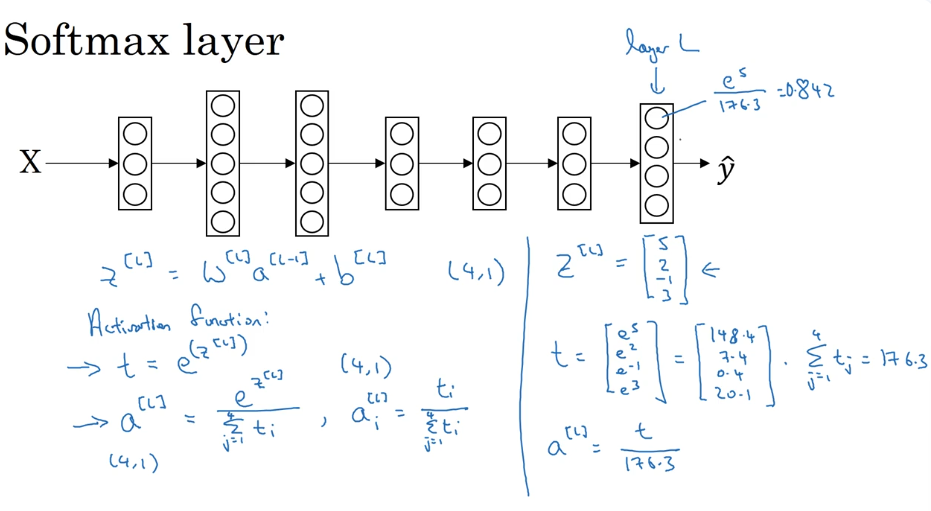

And then the next nodes outputs e squared over 176.3, that turns out to be 0.042, so this is 4.2% chance. The next one is e to -1 over that, which is 0.042. And the final one is e cubed over that, which is 0.114. So it is 11.4% chance that this is class number three, which is the baby C class.

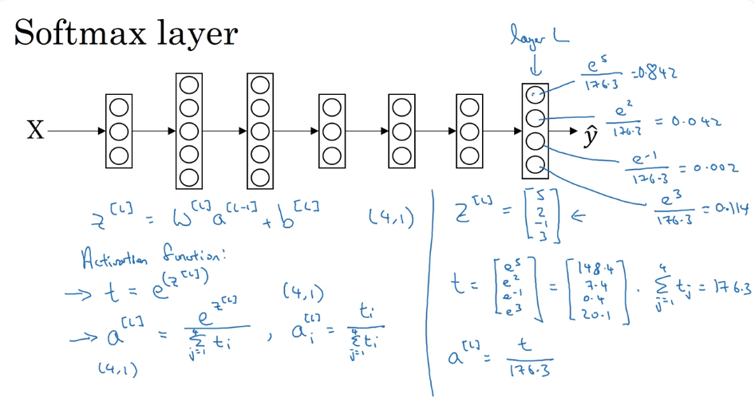

So there's a chance of it being class 0, class 1, class 2, class 3. So the output of the neural network $a^{[L]}$, this is also y hat. This is a 4 by 1 vector where the elements of this 4 by 1 vector are going to be these four numbers that we have just computed.

This algorithm takes the vector $Z^{[L]}$ and is four probabilities that sum to 1. And if we summarize what we just did to math from $Z^{[L]}$ to $a^{[L]}$, this whole computation confusing exponentiation to get this temporary variable t and then normalizing, we can summarize this into a Softmax activation function and say $a^{[L]}$ equals the activation function g applied to the vector $Z^{[L]}$.

$a^{[L]}=g^{[L]}(Z^{[L]})$

The unusual thing about this particular activation function is that, this activation function g, it takes a input a 4 by 1 vector and it outputs a 4 by 1 vector.

Previously, our activation functions used to take in a single row value input. So for example, the sigmoid and the value activation functions input the real number and output a real number. The unusual thing about the Softmax activation function is, because it needs to normalize across the different possible outputs, and needs to take a vector and puts in outputs of vector. 

### Softmax examples
I'm going to show you some examples where you have inputs x1, x2. And these feed directly to a Softmax layer that has three or four, or more output nodes that then output y hat.

I'm going to show you a new network with no hidden layer, and all it does is compute $z^{[1]}=W^{[l]}x+b^{[L]}$. And then the output $a^{[L]}=\hat{y}$ is just the Softmax activation function applied to z1 $a^{[L]}=\hat{y}=g(Z^{[1]})$.

So in this neural network with no hidden layers, it should give you a sense of the types of things a Softmax function can represent.

So here's one example with just raw inputs x1 and x2. A Softmax layer with C = 3 upper classes can represent this type of decision boundaries. Notice this kind of several linear decision boundaries, but this allows it to separate out the data into three classes. And in this diagram, what we did was we actually took the training set that's kind of shown in this figure and train the Softmax cross fire with the upper labels on the data. And then the color on this plot shows fresh holding the upward of the Softmax cross fire, and coloring in the input base on which one of the three outputs have the highest probability. So we can maybe we kind of see that this is like a generalization of logistic regression with sort of linear decision boundaries, but with more than two classes class 0, 1, the class could be 0, 1, or 2. 

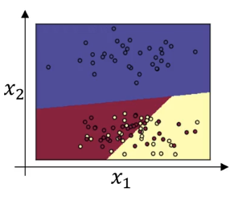

Here's another example of the decision boundary that a Softmax cross fire represents when three normal datasets with three classes. 

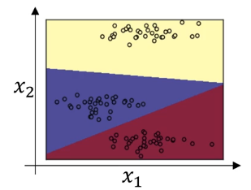

And here's another one

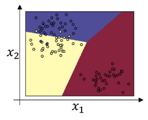

One intuition is that the decision boundary between any two classes will be more linear. That's why you see for example that decision boundary between the yellow and the red classes, that's the linear boundary where the purple and red linear in boundary between the purple and yellow and other linear decision boundary. But able to use these different linear functions in order to separate the space into three classes.

Let's look at some examples with more classes. So it's an example with C equals 4, so that the green class and Softmax can continue to represent these types of linear decision boundaries between multiple classes. 

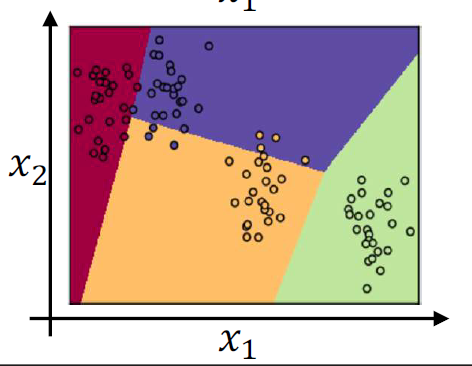

So here's one more example with C equals 5 classes

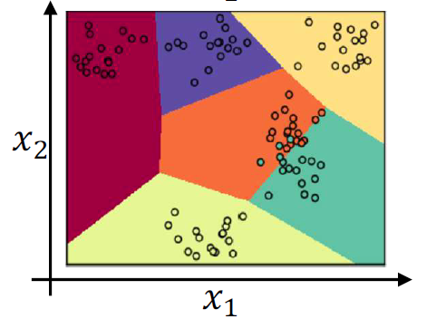

And here's one last example with C equals 6. 

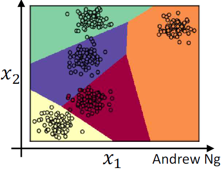

So this shows the type of things the Softmax crossfire can do when there is no hidden layer of class, even much deeper neural network with x and then some hidden units, and then more hidden units, and so on. Then you can learn even more complex non-linear decision boundaries to separate out multiple different classes.

**Why it’s called “softmax”**
* The “max” part: like picking the largest score (argmax).
* The “soft” part: instead of hard 0/1 choice, it gives probabilities smoothly.

## Training a Softmax Classifier
### Understading softmax
Recall our earlier example where the output layer computes $Z^{[L]}$ as follows. So we have four classes, C = 4 then $Z^{[L]}$ can be (4,1) dimensional vector and we said we compute t which is this temporary variable that performs element wise exponentiation. And then finally, if the activation function for your output layer, $g^{[L]}$ is the softmax activation function, then your outputs will be this.

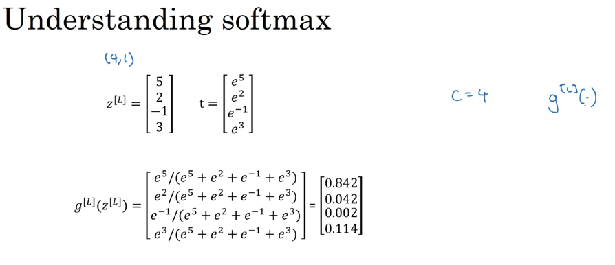

It's basically taking the temporarily variable t and normalizing it to sum to 1. So this then becomes $a^{[L]}$. 

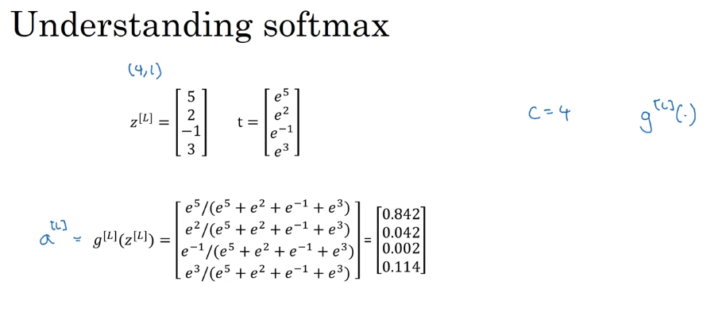

Notice that in the X vector, the biggest element was 5, and the biggest probability ends up being this first probability.

The name softmax comes from contrasting it to what's called a "hard max" which would have taken the vector Z and matched it to this vector.

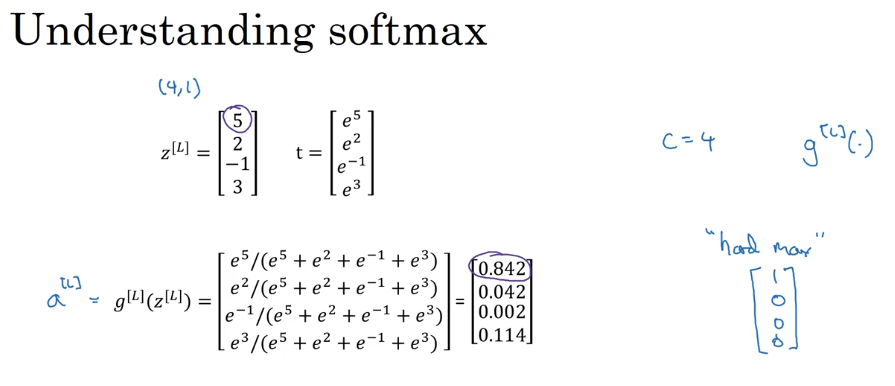

So "hard max" function will look at the elements of Z and just put a 1 in the position of the biggest element of Z and then 0s everywhere else. And so this is a very "hard max" where the biggest element gets a output of 1 and everything else gets an output of 0. Whereas in contrast, a softmax is a more gentle mapping from Z to these probabilities.

Softmax regression or the softmax identification function generalizes the logistic activation function to C classes rather than just two classes.

If C=2, softmax reduces to logistic regression. The proof is that if C = 2 and if you apply softmax, then the output layer, $a{[L]}$, will output two numbers if C = 2, so maybe it outputs 0.842 and 0.158. And these two numbers always have to sum to 1. And because these two numbers always have to sum to 1, they're actually redundant. And maybe you don't need to bother to compute two of them, maybe you just need to compute one of them. And it turns out that the way you end up computing that number reduces to the way that logistic regression is computing its single output.

The takeaway from this is that softmax regression is a generalization of logistic regression to more than two classes. 

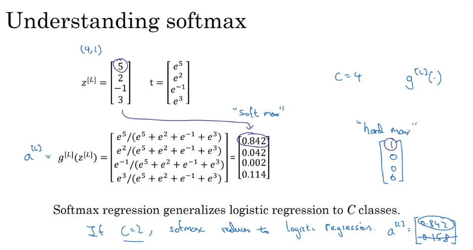

### Loss function
In particular, let's define the loss functions you use to train your neural network. Let's take an example. Let's see of an example in your training set where the target output, the ground true label is 0 1 0 0. 

So the example from the previous video, this means that this is an image of a cat because it falls into Class 1. And now let's say that your neural network is currently outputting y hat equals, so y hat would be a vector probability is equal to sum to 1.

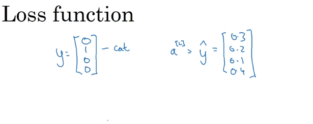

The neural network's not doing very well in this example because this is actually a cat and assigned only a 20% chance that this is a cat. So didn't do very well in this example.

What's the last function you would want to use to train this neural network?

$\ell(\hat{y},y)=-\Sigma_{j=1}^4y_jlog(\hat{y}_j)$

Notice that in this example, y1 = y3 = y4 = 0 because those are 0s and only y2 = 1. So if you look at this summation, all of the terms with 0 values of yj were equal to 0. And the only term you're left with is $-y_2log(\hat{y}_2)$, because we use sum over the indices of j, all the terms will end up 0, except when j is equal to 2. And because y2 = 1, this is just $-log(\hat{y}_2)$. 

So what this means is that, if your learning algorithm is trying to make this loss small because you use gradient descent to try to reduce the loss on your training set. Then the only way to make this small is to make $-log(\hat{y}_2)$ small. And the only way to do that is to make $\hat{y}_2$ as big as possible. And these are probabilities, so they can never be bigger than 1. But this kind of makes sense because x for this example is the picture of a cat, then you want that output probability to be as big as possible.

More generally, what this loss function does is it looks at whatever is the ground true class in your training set, and it tries to make the corresponding probability of that class as high as possible.

If you're familiar with maximum likelihood estimation statistics, this turns out to be a form of maximum likelyhood estimation. But if you don't know what that means, don't worry about it. The intuition we just talked about will suffice.


This is the loss on a single training example: $\ell(\hat{y},y)=-\Sigma_{j=1}^4y_jlog(\hat{y}_j)$

The cost J on the entire training set:

$J(w^{[1]},b^{[1]},...)={1 \over m}\Sigma_{i=1}^m \ell(\hat{y}^{(i)},y^{(i)})$

Use gradient descent to minimize this cost.

Finally, one more implementation detail. Notice that because C = 4, y is a 4 by 1 vector, and y hat is also a 4 by 1 vector. So if you're using a vectorized implementation, the matrix capital Y

$Y=[y^{(1)} y^{(2)} ... y^{(m)}]$

stacked horizontally.

For example, if this example up here is your first training example then the first column of this matrix Y will be 0 1 0 0 and then maybe the second example is a dog, maybe the third example is a none of the above, and so on. 

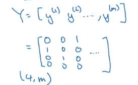

Similarly, Y hat will be

$\hat{Y}=[\hat{y}^{(1)} \hat{y}^{(2)} ... \hat{y}^{(m)}]$

All the output on the first training example then y hat will these 0.3, 0.2, 0.1, and 0.4, and so on. And y hat itself will also be 4 by m dimensional matrix.

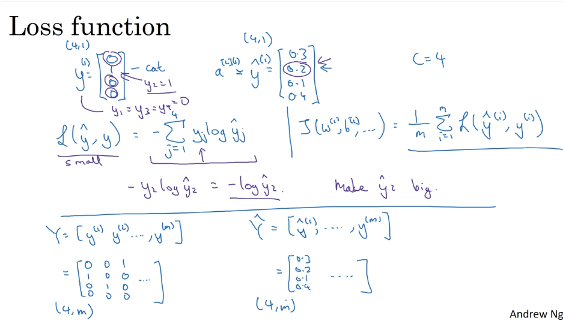

### Gradient descent with softmax
Finally, let's take a look at how you'd implement gradient descent when you have a softmax output layer. So this output layer will compute $Z^{[L]}$ which is C by 1 in our example, 4 by 1 and then you apply the softmax attribution function to get $a^{[L]}$, or y hat. And then that in turn allows you to compute the loss.

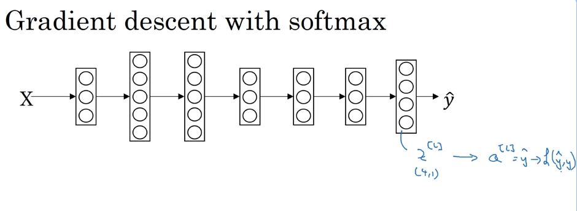

Backprop:

$dZ^{[L]}=\hat{y}-y$

All of these will be 4 by 1 vector or C by 1 in general.


In this week's programming exercise, we'll start to use one of the deep learning program frameworks and for those programming frameworks, usually it turns out you just need to focus on getting the forward prop right. And so long as you specify it as a programming framework, the forward prop pass, the programming framework will figure out how to do back prop, how to do the backward pass for you.

This expression is worth keeping in mind for if you ever need to implement softmax regression, or softmax classification from scratch. Although you won't actually need this in this week's programming exercise because the programming framework you use will take care of this derivative computation for you.

## Deep Learning Frameworks

* Caffe/Caffe2
* CNTK
* DL4J
* Keras
* Lasagne
* mxnet
* PaddlePaddle
* TensorFlow
* Theano
* Torch

Each of these frameworks has a dedicated user and developer community and I think each of these frameworks is a credible choice for some subset of applications.

Criteria I would recommend you use to choose frameworks. 
- Ease of programming (development and deployment)
- Running speed (especially training on large data sets, some frameworks will let you run and train your neural network more efficiently than others)
- Truly open (open source with good governance). And for a framework to be truly open, it needs not only to be open source but I think it needs good governance as well. Unfortunately, in the software industry some companies have a history of open sourcing software but maintaining single corporation control of the software. And then over some number of years, as people start to use the software, some companies have a history of gradually closing off what was open source, or perhaps moving functionality into their own proprietary cloud services. So one thing I pay a bit of attention to is how much you trust that the framework will remain open source for a long time rather than just being under the control of a single company, which for whatever reason may choose to close it off in the future even if the software is currently released under open source.

But at least in the short term depending on your preferences of language, whether you prefer Python or Java or C++ or something else, and depending on what application you're working on, whether this can be division or natural language processing or online advertising or something else, I think multiple of these frameworks could be a good choice.

## TensorFlow
As a motivating problem, let's say that you have some cost function J that you want to minimize. For this example, I'm going to use this highly simple cost function

$J(w)=w^2-10w+25$

You might notice that this function is actually $(w-5)^2$. If you expand out this quadratic, you get the expression above. The value of w that minimizes this, is w = five. But let's say we didn't know that, and you just have this function.

Because a very similar structure, a program can be used to train neural networks where you can have some complicated cost function J(w,b) depending on all the parameters of your neural network. Then similarly, you build a use TensorFlow to automatically try to find values of w and b that minimize this cost function, but let's start with the simpler example above.

```python
import numpy as np
import tensorflow as tf

# Next thing you want to do is define the parameter W. Intensive though you're going to use tf.variable to signify that this is a variable initialize it to zero, and the type of the variable is a floating point number, dtype equals tf. float 32, says a TensorFlow floating-point number.
w=tf.Variable(0, dtype=tf.float32)

# Next, let's define the optimization algorithm you're going to use. In this case, the Adam optimization algorithm
optimizer = tf.keras.optimizers.Adam(0.1) # Learning rate = 0.1

# The great thing about TensorFlow is you only have to implement forward prop, that is you only have to write the code to compute the value of the cost function. TensorFlow can figure out how to do the backprop or do the gradient computation. One way to do this is to use gradient tape.

# The intuition behind the name gradient tape is by an analogy to the old-school cassette tapes, where Gradient Tape will record the sequence of operations as you're computing the cost function in the forward prop step. Then when you play the tape backwards, in backwards order, it can revisit the order of operations in reverse order, and along the way, compute backprop and the gradients. 

# Now let's define a training step function to loop over. We're going to define a single training step as this function. 

def train_step():
    with tf.GradientTape() as tape:
        cost = w ** 2 - 10*w + 25
    # In order to carry out one iteration of training, you have to define what are the trainable variables. Trainable variables is just a list with only w.

    trainable_variables = [w]    
        
    # We are then going to compute the gradients with the tape cost trainable variables. 
    grade = tape.gradient(cost, trainable_variables)
    
    # Having done this, you can now use the optimizer to apply the gradients and the gradients are grads and trainable variables.
    # The syntax we are going to use, is we're actually going to use the zip functions, built-in Python function to take the list of gradients, to take the lists are trainable variables and pair them up so that the gradients and zip the function just takes two lists and pairs up the corresponding elements. 
    optimizer.apply_gradients(zip(grads, trainable_variables))

# I'm going to type print w here just to print the initial value of w we've not actually run train_step yet. Hopefully I've no syntax errors. W is initially the value of 0, which is what we have initialized it to.
print(w)

# Now let's run one step of our little learning algorithm and print the new value of w, and now it's increased a little bit from 0 to about 0.1. 
train_step()
print(w)

# Now let's run 1000 iterations of our train_step. If I arrange 1000 train step print W, let's see what happens.
for i in range(1000):
    train_step()
print(w)

# Now W is nearly five which we knew was the minimum of this cost function. 

# We just specify the cost function. Didn't have to take derivatives and TensorFlow figured out how to minimize this for us.
```

Notice, w is the parameter you want to optimize. That's why we declared w as a variable. All we had to do was use a GradientTape to record the order of the sequence of operations needed to compute the cost function, and that was forward prop and TensorFlow could figure out automatically how to take derivatives with respect to the cost function. That's why in TensorFlow, you basically had to only implement the forward prop step, and it will figure out how to do the gradient computation.

There's one more feature of TensorFlow. In the example we went through so far, the cost function is a fixed function of the parameter or the variable w. But what if the function you want to minimize is a function of not just w, but also a function of your training step. 

Let say you have some training data x, and x or x, and y, and you're training a neural network with a cost function depends on your data, x or x and y, as well as the parameters w. How do you get that training data into a TensorFlow program?

```python
w=tf.Variable(0, dtype=tf.float32)
x = np.array([1.0, -10.0, 25.0], dtype=np.float32)
# These three numbers, 1 negative 10 and 25, will play the role of the coefficients of the cost function. You can think of x as being like data that controls the coefficients of this quadratic cost function.

optimizer = tf.keras.optimizers.Adam(0.1) # Learning rate = 0.1

# Let me now define the cost function which will minimize as same as before. 

def cost_fn():
    return x[0]*w**2 + x[1]*w + x[2]

# This is the same cost function as the one above, except that the coefficients are now controlled by this little piece of data x that we have. Now this cost function computes exactly the same cost function as you had above, except that this little piece of data in the array x controls the coefficients of the quadratic cost function. 

# Now, let me write print w this should do nothing because w is still 0, is just initial value. 
print(w)

# But if you then use the optimizer to take one step of the optimization algorithm, then let's print w again and see if that works. 
optimizer.minimize(cost_fn, [w])
print(w)

# Great, now this has taken one step of Adam Optimization and so w is again roughly 0.1.

# This syntax, optimizer dot minimize cost function, and then then list of variables W, that is a simpler alternative piece of syntax, or that's the same thing as these lines up above with the gradients tape and apply gradients. Now that we have a single training set implementer, let's put the whole thing in a loop.
def training(x, w, optimizer):
    def cost_fn():
        return x[0]*w**2 + x[1]*w + x[2]
    
    for i in range(1000):
        optimizer.minimize(cost_fn, [w])
    
    return w

w = training(x, w, optimizaer)
print(w)

# There you go, and now W is nearly at the minimum set, roughly the value of 5. 
```

The thing that makes it so powerful is, all you need to do is specify how to compute the cost function, and then it takes derivatives and it can apply an optimizer with pretty much just one or two lines of codes.

Let's focus on this equation.
```python
x[0]*w**2 + x[1]*w + x[2]
```

The heart of the TensorFlow program is something to compute the cost, and then TensorFlow automatically figures out the derivatives and how to minimize the cost. What this line of code is doing is allowing TensorFlow to construct a computation graph. 

What a computation graph does is the following, it takes X[0] and it takes w, and $w^2$. There's w squared and then X[0] and W squared can multiply together to give X[0] times W squared and so on through multiple steps until eventually, this gets built up to compute the cost function. I guess the last step would have been adding in that last coefficient X[2]. 

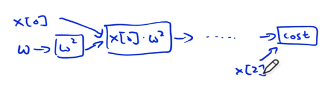

The nice thing about TensorFlow is that by implementing base the forward prop, through this computation graph, TensorFlow will automatically figure out all the necessary backward calculations. It'll automatically be able to figure out all the necessary backward steps needed to implement back-prop.

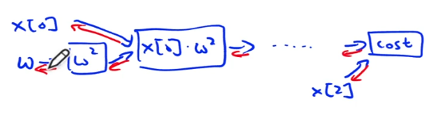

That's why you don't need to explicitly implement back-prop, TensorFlow figures it out for you. This is one of the things that makes the programe frameworks help you become really efficient.

There are also a lot of things you can change with just one line of codes. For example, if you don't want to use the Adam Optimizer and you want to use a different one, then just change this one line of code

```python
optimizer = tf.keras.optimizers.Adam(0.1)
```

You can quickly swap it out for a different optimization algorithm.

All of the popular modern deep learning programming frameworks support things like these and it makes it much easier to develop even pretty complex neural networks. 

To learn more about Gradient Tape, you can take [Course 2: Custom and Distributed Training with TensorFlow](https://www.coursera.org/learn/custom-distributed-training-with-tensorflow) of our [TensorFlow: Advanced Techniques Specialization](https://www.coursera.org/specializations/tensorflow-advanced-techniques).

## References
* [Introduction to gradients and automatic differentiation](https://www.tensorflow.org/guide/autodiff) (TensorFlow Documentation)
* [tf.GradientTape](https://www.tensorflow.org/api_docs/python/tf/GradientTape) (TensorFlow Documentation)