# Week 1: ML Strategy

**Learning Objectives**
* Explain why Machine Learning strategy is important
* Apply satisficing and optimizing metrics to set up your goal for ML projects
* Choose a correct train/dev/test split of your dataset
* Define human-level performance
* Use human-level performance to define key priorities in ML projects
* Take the correct ML Strategic decision based on observations of performances and dataset

- [Week 1: ML Strategy](#week-1-ml-strategy)
  - [Why ML Strategy](#why-ml-strategy)
  - [Orthogonalization](#orthogonalization)
    - [TV tuning example](#tv-tuning-example)
    - [Chain of assumptions in ML](#chain-of-assumptions-in-ml)
  - [Single Number Evaluation Metric](#single-number-evaluation-metric)
    - [Using a single number evaluation metric](#using-a-single-number-evaluation-metric)
    - [Another example](#another-example)
  - [Satisficing and Optimizing Metric](#satisficing-and-optimizing-metric)
    - [Another cat classification example](#another-cat-classification-example)
  - [Train/Dev/Test Distributions](#traindevtest-distributions)
    - [Cat classification dev/test sets](#cat-classification-devtest-sets)
    - [True story (details changed)](#true-story-details-changed)
    - [Guideline](#guideline)
  - [Size of the Dev and Test Sets](#size-of-the-dev-and-test-sets)
    - [Old way of splitting data](#old-way-of-splitting-data)
    - [Size of test set](#size-of-test-set)
  - [When to Change Dev/Test Sets and Metrics?](#when-to-change-devtest-sets-and-metrics)
    - [Cat dataset examples](#cat-dataset-examples)
    - [Orthogonalization for cat pictures: anti-porn](#orthogonalization-for-cat-pictures-anti-porn)
    - [Another example](#another-example-1)
  - [Why Human-level Performance?](#why-human-level-performance)
    - [Why compare to human-level performance](#why-compare-to-human-level-performance)
  - [Avoidable Bias](#avoidable-bias)
    - [Bias and Variance](#bias-and-variance)
  - [Understanding Human-level Performance](#understanding-human-level-performance)
    - [Human-level error as a proxy for Bayes error](#human-level-error-as-a-proxy-for-bayes-error)
    - [Error analysis example](#error-analysis-example)
    - [Summary of bias/variance with human-level performance](#summary-of-biasvariance-with-human-level-performance)
  - [Surpassing Human-level Performance](#surpassing-human-level-performance)
    - [Surpassing human-level performance](#surpassing-human-level-performance-1)
    - [Problems where ML significantly surpasses human-level performance](#problems-where-ml-significantly-surpasses-human-level-performance)
  - [Improving your model performance](#improving-your-model-performance)
    - [The two fundamental assumptions of supervised learning](#the-two-fundamental-assumptions-of-supervised-learning)
    - [Reducing (avoidable) bias and variance](#reducing-avoidable-bias-and-variance)

## Why ML Strategy
Let's say you are working on your cat classifier. And after working it for some time, you've gotten your system to have 90% accuracy, but this isn't good enough for your application. You might then have a lot of ideas as to how to improve your system. 

Ideas:
* Collect more data
* Collect more diverse training set
* Train algorithm longer with gradient descent
* Try Adam instead of gradient descent
* Try bigger network
* Try smaller network
* Try dropout
* Add $L_2$ regularization
* Network architecture
  * Activation functions
  * Change number of hidden units
  * …

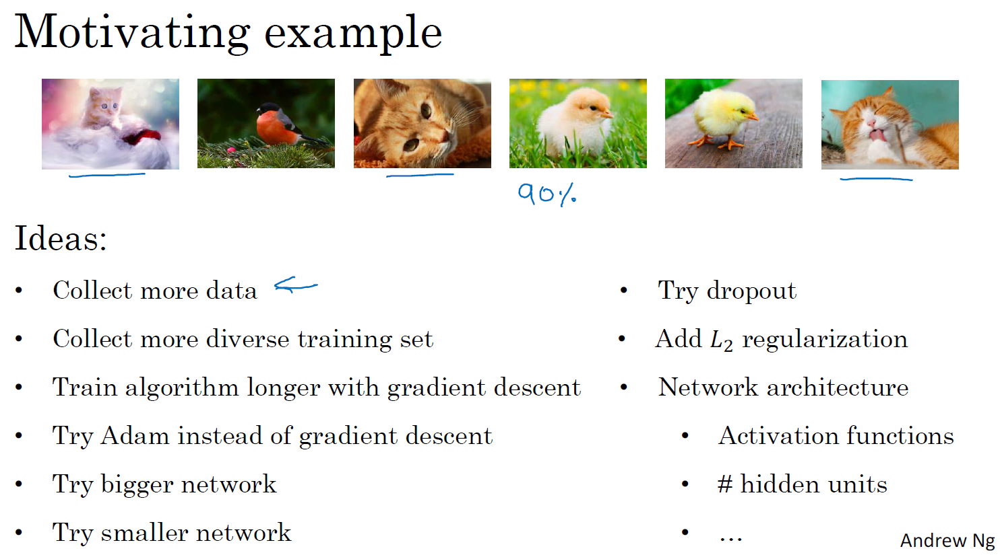

When trying to improve a deep learning system, you often have a lot of ideas or things you could try. 

And the problem is that if you choose poorly, it is entirely possible that you end up spending six months charging in some direction only to realize after six months that that didn't do any good.

For example, I've seen some teams spend literally six months collecting more data only to realize after six months that it barely improved the performance of their system.

Assuming you don't have six months to waste on your problem, won't it be nice if you had quick and effective ways to figure out which of all of these ideas and maybe even other ideas, are worth pursuing and which ones you can safely discard. 

This course teaches you
* A number of strategies, that is, ways of analyzing a machine learning problem that will point you in the direction of the most promising things to try. 
* Share with you a number of lessons I've learned through building and shipping large number of deep learning products.

## Orthogonalization
### TV tuning example
One of the challenges with building machine learning systems is that there's so many things you could try, so many things you could change. Including, for example, so many hyperparameters you could tune.

Most effective machine learning people are very clear-eyed about what to tune in order to try to achieve one effect. This is a process we call orthogonalization. 

Here's a picture of an old school television, with a lot of knobs that you could tune to adjust the picture in various ways. 

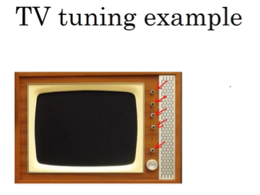

So for these old TV sets, maybe there was one knob to adjust how tall vertically your image is and another knob to adjust how wide it is. Maybe another knob to adjust how trapezoidal it is, another knob to adjust how much to move the picture left and right, another one to adjust how much the picture's rotated, and so on.

What TV designers had spent a lot of time doing was to build the circuitry, really often analog circuitry back then, to make sure each of the knobs had a relatively interpretable function. 

In contrast, imagine if you had a knob that tunes 0.1 x how tall the image is, + 0.3 x how wide the image is,- 1.7 x how trapezoidal the image is, + 0.8 times the position of the image on the horizontal axis, and so on.

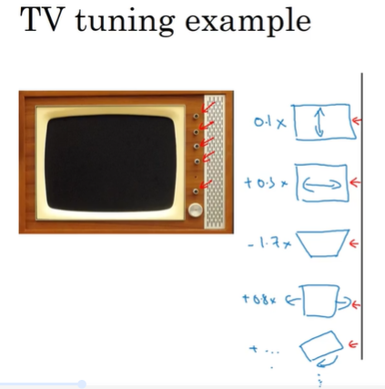

If you tune this knob, then the height of the image, the width of the image, how trapezoidal it is, how much it shifts, it all changes all at the same time.

If you have a knob like that, it'd be almost impossible to tune the TV so that the picture gets centered in the display area. 

In this context, orthogonalization refers to that the TV designers had designed the knobs so that each knob kind of does only one thing. And this makes it much easier to tune the TV, so that the picture gets centered where you want it to be.

Here's another example of orthogonalization. If you think about learning to drive a car, a car has three main controls, which are:
* Steering, the steering wheel decides how much you go left or right. 
* Acceleration
* Braking

So these three controls, or really one control for steering and another two controls for your speed, it makes it relatively interpretable, what your different actions through different controls will do to your car. 

But now imagine if someone were to build a car so that there was a joystick, where:
* One axis of the joystick controls 0.3 x your steering angle - 0.8 x your speed. 
* A different control that controls 2 x the steering angle + 0.9 x the speed of your car. 

In theory, by tuning these two knobs, you could get your car to steer at the angle and at the speed you want. But it's much harder than if you had just one single control for controlling the steering angle, and a separate, distinct set of controls for controlling the speed.

So the concept of orthogonalization refers to that, if you think of one dimension of what you want to do as controlling a steering angle, and another dimension as controlling your speed. Then you want one knob to just affect the steering angle as much as possible, and another knob, in the case of the car, is really acceleration and braking, that controls your speed.

But if you had a control that mixes the two together, like a control like this one that affects both your steering angle and your speed, something that changes both at the same time, then it becomes much harder to set the car to the speed and angle you want.

And by having orthogonal, orthogonal means at 90 degrees to each other. By having orthogonal controls that are ideally aligned with the things you actually want to control, it makes it much easier to tune the knobs you have to tune. To tune the steering wheel angle, and your accelerator, your braking, to get the car to do what you want.

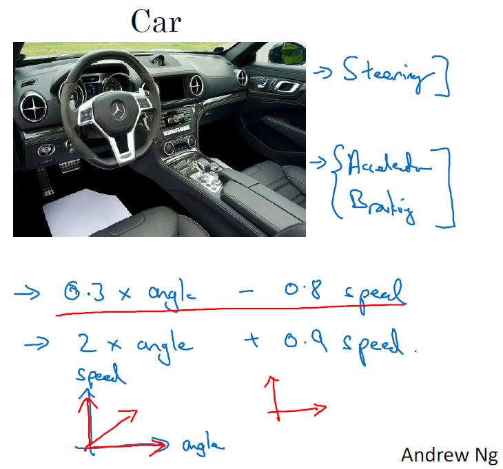

### Chain of assumptions in ML
How does this relate to machine learning?

For a supervised learning system to do well, you usually need to tune the knobs of your system to make sure that four things hold true. 
* First, is that you usually have to make sure that you're at least doing well on the training set. So performance on the training set needs to pass some acceptability assessment. For some applications, this might mean doing comparably to human level performance. But this will depend on your application.
* After doing well on the training sets, you then hope that this leads to also doing well on the dev set. 
* And you then hope that this also does well on the test set on cost function on the cost function. 
* And finally, you hope that doing well on the test set on the cost function results in your system performing in the real world. So you hope that this resolves in happy cat picture app users, for example. 

To relate back to the TV tuning example, if the picture of your TV was either too wide or too narrow, you wanted one knob to tune in order to adjust that. You don't want to have to carefully adjust five different knobs, which also affect different things. You want one knob to just affect the width of your TV image.

In a similar way, if your algorithm is not fitting the training set well on the cost function, you want one knob, or maybe one specific set of knobs that you can use, to make sure you can tune your algorithm to make it fit well on the training set. 

The knobs you use to tune this are:
* You might train a bigger network. 
* Or you might switch to a better optimization algorithm, like the Adam optimization algorithm, and so on
* Some other options we'll discuss later this week and next week.

In contrast, if you find that the algorithm is not fitting the dev set well, then there's a separate set of knobs. Yes, that's my not very artistic rendering of another knob, you want to have a distinct set of knobs to try. So for example, if your algorithm is not doing well on the dev set, it's doing well on the training set but not on the dev set, then you have a set of knobs:
* Regularization that you can use to try to make it satisfy the second criteria. So the analogy is, now that you've tuned the width of your TV set, if the height of the image isn't quite right, then you want a different knob in order to tune the height of the TV image. And you want to do this hopefully without affecting the width of your TV image too much.
* Getting a bigger training set would be another knob you could use, that helps your learning algorithm generalize better to the dev set.

Now, having adjusted the width and height of your TV image, well, what if it doesn't meet the third criteria? What if you do well on the dev set but not on the test set?

If that happens, then the knob you tune is:
* You probably want to get a bigger dev set. Because if it does well on the dev set but not the test set, it probably means you've overtuned to your dev set, and you need to go back and find a bigger dev set. 

And finally, if it does well on the test set, but it isn't delivering to you a happy cat picture app user, then what that means is that you want to go back and change either the dev set or the cost function. Because if doing well on the test set according to some cost function doesn't correspond to your algorithm doing what you need it to do in the real world, then it means that either your dev/test set distribution isn't set correctly, or your cost function isn't measuring the right thing.

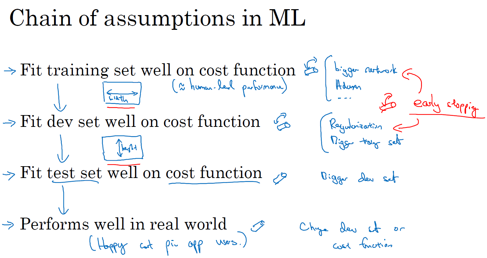

When I train a neural network, I tend not to use early stopping. It's not a bad technique, quite a lot of people do it. But I personally find early stopping difficult to think about. Because this is a knob that simultaneously affects: 
* How well you fit the training set, because if you stop early, you fit the training set less well.
* It also simultaneously is often done to improve your dev set performance.

So this is one knob that is less orthogonalized, because it simultaneously affects two things. It's like a knob that simultaneously affects both the width and the height of your TV image. And it doesn't mean that it's a bad knob to use, you can use it if you want. But when you have more orthogonalized controls, such as these other ones that I'm writing down here, then it just makes the process of tuning your network much easier.

## Single Number Evaluation Metric
Whether you're tuning hyperparameters, or trying out different ideas for learning algorithms, or just trying out different options for building your machine learning system. You'll find that your progress will be much faster if you have a single real number evaluation metric that lets you quickly tell if the new thing you just tried is working better or worse than your last idea. So when teams are starting on a machine learning project, I often recommend that you set up a single real number evaluation metric for your problem. 

### Using a single number evaluation metric
You've heard me say before that applied machine learning is a very empirical process. We often have an idea, code it up, run the experiment to see how it did, and then use the outcome of the experiment to refine your ideas. And then keep going around this loop as you keep on improving your algorithm. 

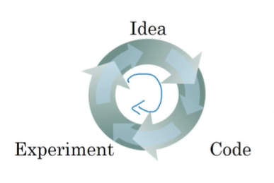

Let's say for your cat classifier, you had previously built some classifier A. And by changing the hyperparameters and the training sets or some other thing, you've now trained a new classifier, B.

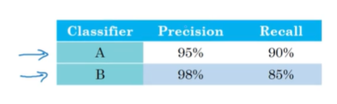

One reasonable way to evaluate the performance of your classifiers is to look at its precision and recall. The exact details of what's precision and recall don't matter too much for this example. 

The definition of **precision** is, of the examples that your classifier recognizes as cats, what percentage actually are cats? So if classifier A has 95% precision, this means that when classifier A says something is a cat, there's a 95% chance it really is a cat. 

**Recall** is, of all the images that really are cats, what percentage were correctly recognized by your classifier? So what percentage of actual cats are correctly recognized? So if classifier A is 90% recall, this means that of all of the images in, say, your dev sets that really are cats, classifier A accurately pulled out 90% of them.

It turns out that there's often a tradeoff between precision and recall, and you care about both. You want that, when the classifier says something is a cat, there's a high chance it really is a cat. But of all the images that are cats, you also want it to pull a large fraction of them as cats. So it might be reasonable to try to evaluate the classifiers in terms of its precision and its recall.

The problem with using precision recall as your evaluation metric is that if classifier A does better on recall, which it does here, the classifier B does better on precision, then you're not sure which classifier is better.

If you're trying out a lot of different ideas, a lot of different hyperparameters, you want to rather quickly try out not just two classifiers, but maybe a dozen classifiers and quickly pick out the "best ones", so you can keep on iterating from there. 

With two evaluation metrics, it is difficult to know how to quickly pick one of the two or quickly pick one of the ten. So what I recommend is rather than using two numbers, precision and recall, to pick a classifier, you just have to find a new evaluation metric that combines precision and recall.

In the machine learning literature, the standard way to combine precision and recall is something called an F1 score. And the details of F1 score aren't too important, but informally, you can think of this as the average of precision, P, and recall, R. Formally, the F1 score is defined by this formula

$({2 \over {1 \over {{1 \over P} + {1 \over R}}}})$

In mathematics, this function is called the "harmonic mean" of precision P and recall R.

Less formally, you can think of this as some way that averages precision and recall. Only instead of taking the arithmetic mean, you take the harmonic mean, which is defined by this formula. And it has some advantages in terms of trading off precision and recall. 

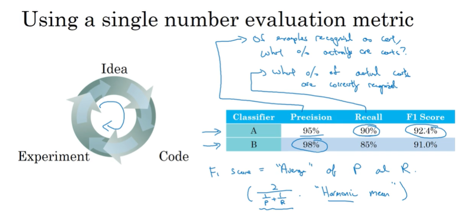

In this example, you can then see right away that classifier A has a better F1 score. And assuming F1 score is a reasonable way to combine precision and recall, you can then quickly select classifier A over classifier B.

What I found for a lot of machine learning teams is that having a well-defined dev set, which is how you're measuring precision and recall, plus a single number evaluation metric, sometimes I'll call it single row number evaluation metric allows you to quickly tell if classifier A or classifier B is better, and therefore having a dev set plus single number evaluation metric distance to speed up iterating. It speeds up this iterative process of improving your machine learning algorithm.

### Another example
Let's look at another example. Let's say you're building a cat app for cat lovers in four major geographies, the US, China, India, and other, the rest of the world. And let's say that your two classifiers achieve different errors in data from these four different geographies. Algorithm A achieves 3% error on pictures submitted by US users and so on.

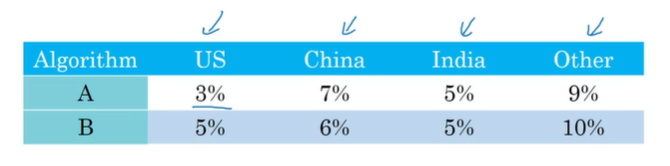

It might be reasonable to keep track of how well your classifiers do in these different markets or these different geographies. But by tracking four numbers, it's very difficult to look at these numbers and quickly decide if algorithm A or algorithm B is superior. And if you're testing a lot of different classifiers, then it's just difficult to look at all these numbers and quickly pick one. 

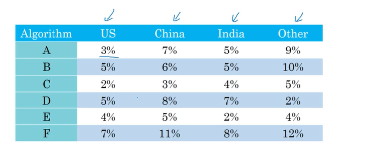

What I recommend in this example is, in addition to tracking your performance in the four different geographies, to also compute the average.

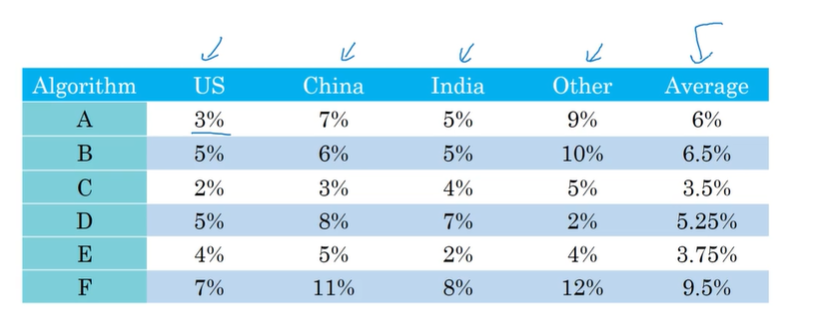

And assuming that average performance is a reasonable single real number evaluation metric, by computing the average, you can quickly tell that it looks like algorithm C has a lowest average error. And you might then go ahead with that one. If you have to pick an algorithm to keep on iterating from.

So your work load machine learning is often, you have an idea, you implement it and try it out, and you want to know whether your idea helped. So what we've seen in this video is that having a single number evaluation metric can really improve your efficiency or the efficiency of your team in making those decisions.

## Satisficing and Optimizing Metric
It's not always easy to combine all the things you care about into a single row number evaluation metric. In those cases I've found it sometimes useful to set up satisficing as well as optimizing metrics.

### Another cat classification example
Let's say that you've decided you care about the classification accuracy of your cat's classifier, this could have been F1 score or some other measure of accuracy

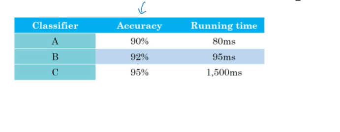

But let's say that in addition to accuracy you also care about the running time. So how long it takes to classify an image and classifier A takes 80 milliseconds, B takes 95 milliseconds, and C takes 1,500 milliseconds, that's 1.5 seconds to classify an image. 

One thing you could do is combine accuracy and running time into an overall evaluation metric. And so the costs such as maybe the overall cost is accuracy minus 0.5 times running time. 

$cost = accuracy - 0.5*runningTime$

Maybe it seems a bit artificial to combine accuracy and running time using a formula like this, like a linear weighted sum of these two things.

Here's something else you could do instead which is that you might want to choose a classifier that maximizes accuracy but subject to that the running time, that is the time it takes to classify an image, that that has to be less than or equal to 100 milliseconds. 

In this case we would say that accuracy is an optimizing metric because you want to maximize accuracy. You want to do as well as possible on accuracy but that running time is what we call a satisficing metric. Meaning that it just has to be good enough, it just needs to be less than 100 milliseconds and beyond that you don't really care, or at least you don't care that much.

So this will be a pretty reasonable way to trade off or to put together accuracy as well as running time. And it may be the case that so long as the running time is less that 100 milliseconds, your users won't care that much whether it's 100 milliseconds or 50 milliseconds or even faster. 

And by defining optimizing as well as satisficing metrics, this gives you a clear way to pick the "best classifier", which in this case would be classifier B because of all the ones with a running time better than 100 milliseconds, it has the best accuracy.

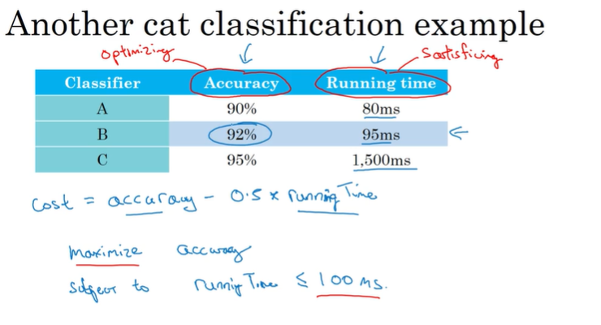

More generally
* If you have N metrics that you care about it's sometimes reasonable to pick one of them to be optimizing. So you want to do as well as is possible on that one.
* Then N minus 1 to be satisficing, meaning that so long as they reach some threshold such as running times faster than 100 milliseconds, but so long as they reach some threshold, you don't care how much better it is in that threshold, but they have to reach that threshold.

Here's another example. Let's say you're building a system to detect wake words, also called trigger words. So this refers to the voice control devices like the Amazon Echo where you wake up by saying Alexa or some Google devices which you wake up by saying okay Google or some Apple devices which you wake up by saying Hey Siri or some Baidu devices which you wake up by saying you ni hao Baidu.

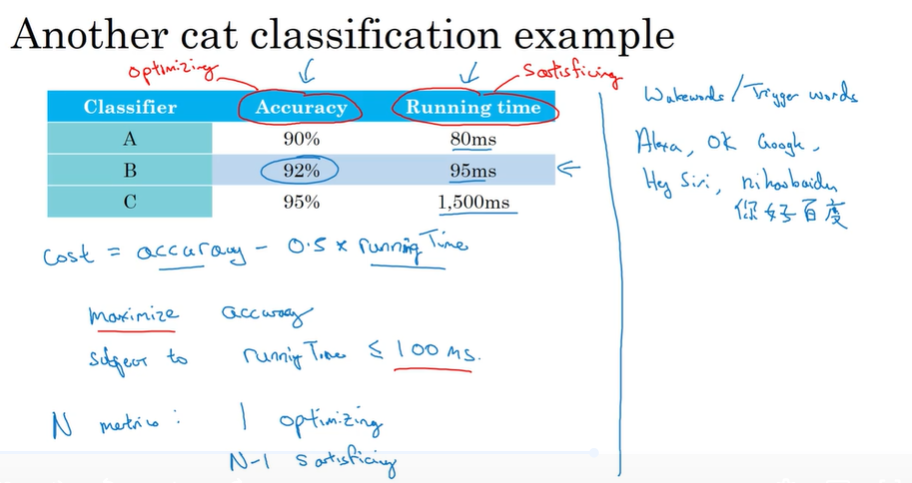

These are the wake words you use to tell one of these voice control devices to wake up and listen to something you want to say.

So you might care about the accuracy of your trigger word detection system. So when someone says one of these trigger words, 
* How likely are you to actually wake up your device
* You might also care about the number of false positives. When no one actually said this trigger word, how often does it randomly wake up?

So in this case maybe one reasonable way of combining these two evaluation metrics might be to 
* Maximize accuracy, so when someone says one of the trigger words, maximize the chance that your device wakes up. 
* subject to that, you have at most one false positive every 24 hours of operation. So that your device randomly wakes up only once per day on average when no one is actually talking to it. 

So in this case
* Accuracy is the optimizing metric
* A number of false positives every 24 hours is the satisficing metric where you'd be satisfied so long as there is at most one false positive every 24 hours. 

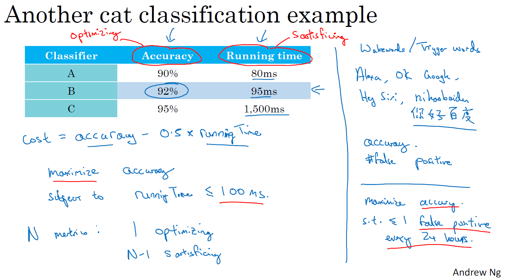

To summarize, if there are multiple things you care about by say there's one as the optimizing metric that you want to do as well as possible on and one or more as satisficing metrics were you'll be satisfice. So long as it does better than some threshold you can now have an almost automatic way of quickly looking at multiple core size and picking the, quote, "best one".

Now these evaluation metrics must be evaluated or calculated on a training set or a development set or maybe on the test set. So one of the things you also need to do is set up training, dev or development, as well as test sets. 

## Train/Dev/Test Distributions
The way you set up your training dev, or development sets and test sets, can have a huge impact on how rapidly you or your team can make progress on building machine learning application. The same teams, even teams in very large companies, set up these data sets in ways that really slows down, rather than speeds up, the progress of the team. 
### Cat classification dev/test sets
In this video, I want to focus on how you set up your dev and test sets.

The dev set is also called the development set, or sometimes called the hold out cross validation set.

Workflow in machine learning is that you try a lot of ideas, train up different models on the training set, and then use the dev set to evaluate the different ideas and pick one. And, keep innovating to improve dev set performance until, finally, you have one clause that you're happy with that you then evaluate on your test set.

Now, let's say, by way of example, that you're building a cat crossfire, and you are operating in these regions: 

* US
* UK
* Other Europe
* South America
* India
* China
* Other Asia
* Australia

So, how do you set up your dev set and your test set? 

One way you could do so is to pick four of these regions. I'm going to use these four but it could be four randomly chosen regions. And say, that data from these four regions will go into the dev set. And, the other four regions, I'm going to use these four, could be randomly chosen four as well, that those will go into the test set.

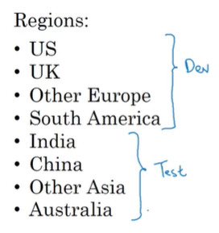

It turns out, this is a very bad idea because in this example, your dev and test sets come from different distributions. 

I would, instead, recommend that you find a way to make your dev and test sets come from the same distribution. 

One picture to keep in mind is that, I think, setting up your dev set, plus, your single role number evaluation metric, that's like placing a target and telling your team where you think is the bull's eye you want to aim at. Because, what happen once you've established that dev set and the metric is that, the team can innovate very quickly, try different ideas, run experiments and very quickly use the dev set and the metric to evaluate crossfires and try to pick the best one. 

Machine learning teams are often very good at shooting different arrows into targets and innovating to get closer and closer to hitting the bullseye. So, doing well on your metric on your dev sets.

The problem with how we've set up the dev and test sets in the example on the left is that, your team might spend months innovating to do well on the dev set only to realize that, when you finally go to test them on the test set, that data from these four countries or these four regions at the bottom, might be very different than the regions in your dev set. So, you might have a nasty surprise and realize that, all the months of work you spent optimizing to the dev set, is not giving you good performance on the test set.

So, having dev and test sets from different distributions is like setting a target, having your team spend months trying to aim closer and closer to bull's eye, only to realize after months of work that, you'll say, "Oh wait, to test it, I'm going to move target over here." 

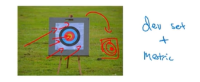

And, the team might say, "Well, why did you make us spend months optimizing for a different bull's eye when suddenly, you can move the bull's eye to a different location somewhere else?" 

To avoid this, what I recommend instead is that, you take all this randomly shuffled data into the dev and test set. So that, both the dev and test sets have data from all eight regions and that the dev and test sets really come from the same distribution, which is the distribution of all of your data mixed together. 

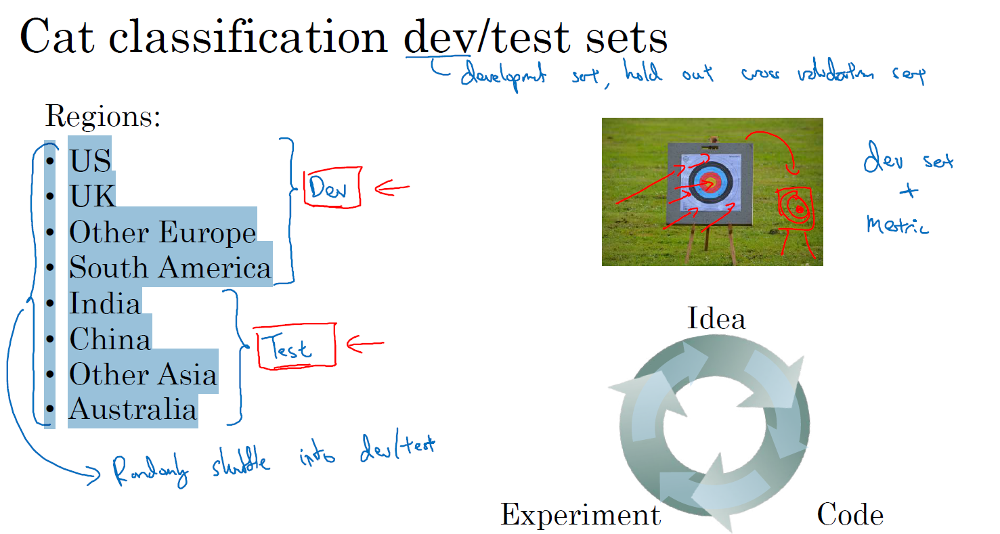

### True story (details changed)
Here's another example. This is a, actually, true story but with some details changed. 

I know a machine learning team that actually spent several months optimizing on a dev set which was comprised of loan approvals for medium income zip codes.

So, the specific machine learning problem was, "Given an input X about a loan application, can you predict y and which is, whether or not, they'll repay the loan?" So, this helps you decide whether or not to approve a loan. 

The dev set came from loan applications. They came from medium income zip codes. Zip codes is what we call postal codes in the United States. 

After working on this for a few months, the team then, suddenly decided to test this on data from low income zip codes or low income postal codes. 

And, of course, the distributional data for medium income and low income zip codes is very different. And, the crossfire, that they spend so much time optimizing in the former case, just didn't work well at all on the latter case. And so, this particular team actually wasted about three months of time and had to go back and really re-do a lot of work.

What happened here was, the team spent three months aiming for one target, and then, after three months, the manager asked, "Oh, how are you doing on hitting this other target?" This is a totally different location. And, it just was a very frustrating experience for the team.

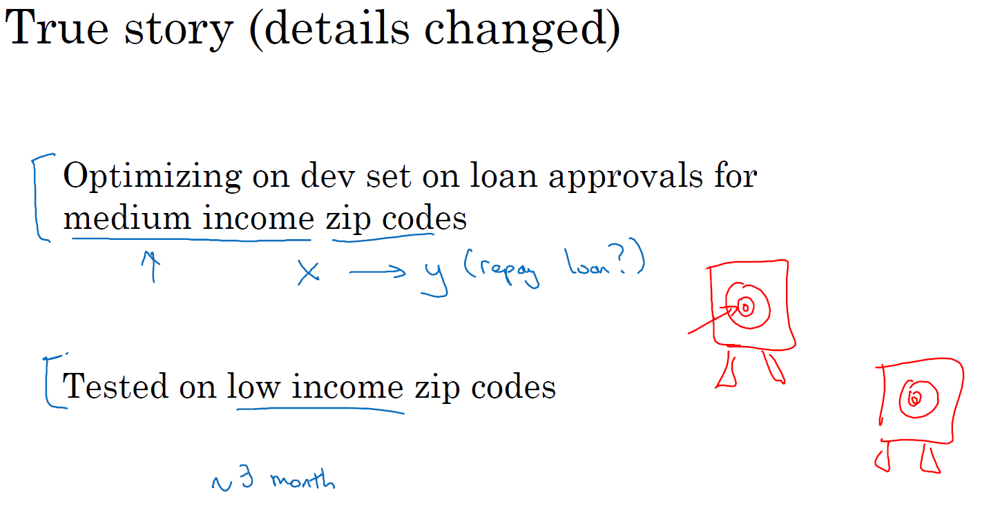

### Guideline
So, what I recommand for setting up a dev set and test set is, **choose a dev set and test set to reflect data you expect to get in future and consider important to do well on.** 

**In particular, the dev set and the test set here, should come from the same distribution.** 

So, whatever type of data you expect to get in the future, and want to do well on, try to get data that looks like that. And, whatever that data is, put it into both your dev set and your test set. Because that way, you're putting the target where you actually want to hit and you're having the team innovate very efficiently to hitting that same target, hopefully, the same target well. 

The important take away from this video is that, setting up the dev set, as well as the valuation metric, is really defining what target you want to aim at. And hopefully, by setting the dev set and the test set to the same distribution, you're really aiming at whatever target you hope your machine learning team will hit. 

The way you choose your training set will affect how well you can actually hit that target. 

## Size of the Dev and Test Sets
### Old way of splitting data
You might have heard of the rule of thumb in machine learning of taking all the data you have and using a 70/30 split into a train and test set, or if you had to set up train dev and test sets maybe, you would use a 60% training and say 20% dev and 20% tests. 

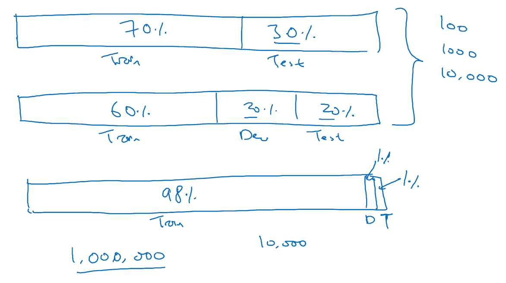

In earlier eras of machine learning, this was pretty reasonable, especially back when data set sizes were just smaller. So if you had a hundred examples in total, these 70/30 or 60/20/20 rule of thumb would be pretty reasonable. Or if you had thousand examples, maybe if you had ten thousand examples, these things are not unreasonable.

But in the modern machine learning era, we are now used to working with much larger data set sizes. So let's say you have a million training examples, it might be quite reasonable to set up your data so that you have 98% in the training set, and 1% dev, and 1% test. 

Because if you have a million examples, then 1% of that, is 10,000 examples, and that might be plenty enough for a dev set or for a test set. 

In the modern Deep Learning era where sometimes we have much larger data sets, it's quite reasonable to use a much smaller than 20 or 30% of your data for a dev set or a test set. And because Deep Learning algorithms have such a huge hunger for data, I'm seeing that, the problems we have large data sets that have much larger fraction of it goes into the training set. 

### Size of test set
So, how about the test set? 

Remember the purpose of your test set is that, after you finish developing a system, the test set helps evaluate how good your final system is.

Set your test set to be big enough to give high confidence
in the overall performance of your system.

Unless you need to have a very accurate measure of how well your final system is performing, maybe you don't need millions and millions of examples in your test set, and maybe for your application if you think that having 10,000 examples gives you enough confidence to find the performance on maybe 100,000 or whatever it is, that might be enough. And this could be much less than, say 30% of your overall data set, depending on how much data you have.

For some applications, maybe you don't need a high confidence in the overall performance of your final system. Maybe all you need is a train and dev set, and I think, not having a test set might be okay.

In fact, what sometimes happened was, people were talking about using train test splits but what they were actually doing was iterating on the test set. So rather than a test set, what they had was a train dev split and no test set. If you're actually tuning to this set, to this dev set and this test set, it's better to call it a dev set. Although I think in the history of machine learning, not everyone has been completely clean and completely rigorous about calling the dev set when it really should be treated as dev set.

If all you care about is having some data that you train on, and having some data to tune to, and you're just going to shape the final system and not worry too much about how well it was actually doing, I think it will be healthy and just call the train dev set and acknowledge that you have no test set.

This is a bit unusual. I'm definitely not recommending not having a test set when building a system. I do find it reassuring to have a separate test set you can use to get an unbiased estimate of how it was doing before you ship it, but maybe if you have a very large dev set so that you think you won't overfit the dev set too badly. Maybe it's not totally unreasonable to just have a train dev set, although it's not what I usually recommend.

To summarize, in the era of big data, I think the old rule of thumb of a 70/30 split, that no longer applies. And the trend has been to use more data for training and less for dev and tests, especially when you have a very large data sets. And the rule of thumb is really to try to set the dev set to big enough for its purpose, which helps you evaluate different ideas and pick this up from A or B better. And the purpose of test set is to help you evaluate your final classifier, you just have to set your test set big enough for that purpose, and that could be much less than 30% of the data. So, I hope that gives some guidance or some suggestions on how to set up your dev and test sets in the Deep Learning era. 

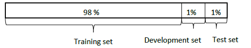

* Set up the size of the test set to give a high confidence in the overall performance of the system.
* Test set helps evaluate the performance of the final classifier which could be less 30% of the whole data set.
* The development set has to be big enough to evaluate different ideas.

## When to Change Dev/Test Sets and Metrics?
### Cat dataset examples
Let's say you build a cat classifier to try to find lots of pictures of cats to show to your cat loving users and the metric that you decided to use is classification error. 

Algorithms A and B have, respectively, 3% error and 5% error, so it seems like Algorithm A is doing better. 

But let's say you try out these algorithms, you look at these algorithms and Algorithm A, for some reason, is letting through a lot of the pornographic images. 

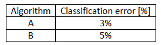

If you ship Algorithm A the users would see more cat images because you'll see 3 percent error and identify cats, but it also shows the users some pornographic images which is totally unacceptable both for your company, as well as for your users.

In contrast, Algorithm B has 5 percent error so this classifies fewer images but it doesn't have pornographic images. So from your company's point of view, as well as from a user acceptance point of view, Algorithm B is actually a much better algorithm because it's not letting through any pornographic images. 

What has happened in this example is that Algorithm A is doing better on your evaluation metric. It's getting 3 percent error but it is actually a worse algorithm. So, in this case, the evaluation metric plus the dev set prefers Algorithm A because they're saying, look, Algorithm A has lower error which is the metric you're using but you and your users prefer Algorithm B because it's not letting through pornographic images.

When this happens, when your evaluation metric is no longer correctly rank ordering preferences between algorithms, in this case is mispredicting that Algorithm A is a better algorithm, then that's a sign that you should change your evaluation metric or perhaps your development set or test set.

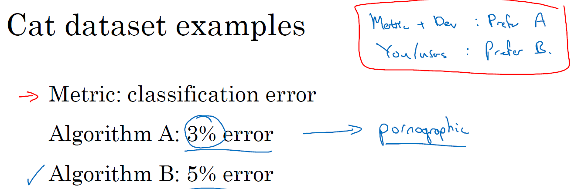

The misclassification error metric:

${1 \over {m_{dev}}}\Sigma_{i=1}^{m_{dev}}\ell({y^{(i)}_{pred} \neq y^{(i)}})$

This function counts up the number of misclassified examples.

The problem with this evaluation metric is that they treat pornographic and non-pornographic images equally but you really want your classifier to not mislabel pornographic images, like maybe you recognize a pornographic image as a cat image and therefore show it to unsuspecting user, therefore very unhappy with unexpectedly seeing porn.

One way to change this evaluation metric would be if you add a weight term here, we call this $w^{(i)}$ where
* $w^{(i)}$ is going to be equal to 1 if $x^{(i)}$ is non-porn
* Maybe 10 or maybe even large number like a 100 if $x^{(i)}$ is porn.

${1 \over {m_{dev}}}\Sigma_{i=1}^{m_{dev}}w^{(i)}\ell({y^{(i)}_{pred} \neq y^{(i)}})$

This way you're giving a much larger weight to examples that are pornographic so that the error term goes up much more if the algorithm makes a mistake on classifying a pornographic image as a cat image.

In this example you giving 10 times bigger weight to classify pornographic images correctly.

If you want this normalization constant, technically this becomes

${1 \over {\Sigma_{i}w^{(i)}}}\Sigma_{i=1}^{m_{dev}}w^{(i)}\ell({y^{(i)}_{pred} \neq y^{(i)}})$

Then this error would still be between 0 and 1.

The details of this weighting aren't important and to actually implement this weighting, you need to actually go through your dev and test sets, so label the pornographic images in your dev and test sets so you can implement this weighting function.

The high level of take away is, if you find that your evaluation metric is not giving the correct rank order preference for what is actually a better algorithm, then there's a time to think about defining a new evaluation metric. And this is just one possible way that you could define an evaluation metric. The goal of the evaluation metric is to accurately tell you, given two classifiers, which one is better for your application.

For the purpose of this video, don't worry too much about the details of how we define a new error metric, the point is that if you're not satisfied with your old error metric then don't keep coasting with an error metric you're unsatisfied with, instead try to define a new one that you think better captures your preferences in terms of what's actually a better algorithm.

### Orthogonalization for cat pictures: anti-porn
One thing you might notice is that so far we've only talked about how to define a metric to evaluate classifiers. That is, we've defined an evaluation metric that helps us better rank order classifiers when they are performing at varying levels in terms of streaming out porn.

And this is actually an example of an orthogonalization where I think you should take a machine learning problem and break it into distinct steps. So, one knob, or one step is to figure out how to define a metric that captures what you want to do, and I would worry separately about how to actually do well on this metric.

So think of the machine learning task as two distinct steps. To use the target analogy
* The first step is to place the target. So define where you want to aim
* Then as a completely separate step, this is one knob you can tune which is how do you place the target as a completely separate problem. Think of it as a separate knob to tune in terms of how to do well at this algorithm, how to aim accurately or how to shoot at the target.

Defining the metric is step one and you do something else for step two. In terms of shooting at the target, maybe your learning algorithm is optimizing some cost function that looks like this, where you are minimizing some of losses on your training set. 

$J=\Sigma_{i=1}^{m}\ell({\hat{y}^{(i)}, y^{(i)}})$

One thing you could do is to also modify this in order to incorporate these weights and maybe end up changing this normalization constant as well. 

$J={1 \over {\Sigma w^{(i)}}}\Sigma_{i=1}^{m}w^{(i)}\ell({\hat{y}^{(i)}, y^{(i)}})$

So it is just 1 over a sum of w(i).

Again, the details of how you define J aren't important, but the point was with the philosophy of orthogonalization think of placing the target as one step and aiming and shooting at a target as a distinct step which you do separately. 

In other words I encourage you to think of, defining the metric as one step and only after you define a metric, figure out how to do well on that metric which might be changing the cost function J that your neural network is optimizing.

### Another example
Before going on, let's look at just one more example. Let's say that your two cat classifiers A and B have, respectively, 3 percent error and 5 percent error as evaluated on your dev set. Or maybe even on your test set which are images downloaded off the internet, so high quality well framed images.

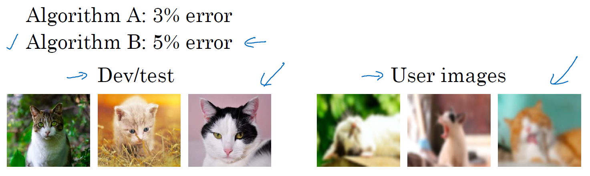

But maybe when you deploy your algorithm product, you find that algorithm B actually looks like it's performing better, even though it's doing better on your dev set. 

And you find that you've been training off very nice high quality images downloaded off the Internet but when you deploy those on the mobile app, users are uploading all sorts of pictures, they're much less framed, you haven't only covered the cat, the cats have funny facial expressions, maybe images are much blurrier, and when you test out your algorithms you find that Algorithm B is actually doing better.

So this would be another example of your metric and dev test sets falling down.

The problem is that you're evaluating on the dev and test set as very nice, high resolution, well-framed images but what your users really care about is you have them doing well on images they are uploading, which are maybe less professional shots and blurrier and less well framed.

So the guideline is, if doing well on your metric and your current dev sets or dev and test sets' distribution, if that does not correspond to doing well on the application you actually care about, then change your metric and/or your dev test set.

In other words, if we discover that your dev test set has these very high quality images but evaluating on this dev test set is not predictive of how well your app actually performs, because your app needs to deal with lower quality images, then that's a good time to change your dev test set so that your data better reflects the type of data you actually need to do well on.

The overall guideline is if your current metric and data you are evaluating on doesn't correspond to doing well on what you actually care about, then change your metric and/or your dev/test set to better capture what you need your algorithm to actually do well on. 

Having an evaluation metric and the dev set allows you to much more quickly make decisions about is Algorithm A or Algorithm B better. It really speeds up how quickly you or your team can iterate. 

My recommendation is, even if you can't define the perfect evaluation metric and dev set, just set something up quickly and use that to drive the speed of your team iterating. And if later down the line you find out that it wasn't a good one, you have better idea, change it at that time, it's perfectly okay. But what I recommend against for the most teams is to run for too long without any evaluation metric and dev set up because that can slow down the efficiency of what your team can iterate and improve your algorithm. 

## Why Human-level Performance?
In the last few years, a lot more machine learning teams have been talking about comparing the machine learning systems to human level performance. Why is this? I think there are two main reasons.
* First is that because of advances in deep learning, machine learning algorithms are suddenly working much better and so it has become much more feasible in a lot of application areas for machine learning algorithms to actually become competitive with human-level performance.
* Second, it turns out that the workflow of designing and building a machine learning system, the workflow is much more efficient when you're trying to do something that humans can also do. So in those settings, it becomes natural to talk about comparing, or trying to mimic human-level performance.

I've seen on a lot of machine learning tasks that as you work on a problem over time, so the x-axis, time, this could be many months or even many years over which some team or some research community is working on a problem. 

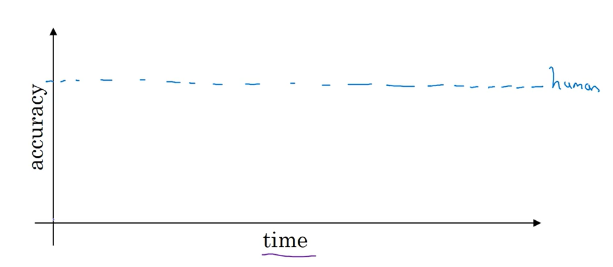

Progress tends to be relatively rapid as you approach human level performance. But then after a while, the algorithm surpasses human-level performance and then progress and accuracy actually slows down. And maybe it keeps getting better but after surpassing human level performance it can still get better, but performance, the slope of how rapid the accuracy's going up, often that slows down. 

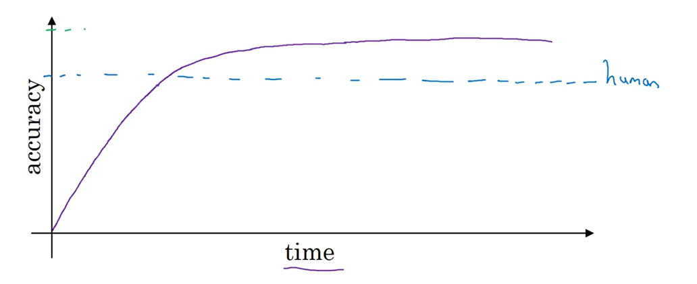

And the hope is it achieves some theoretical optimum level of performance. And over time, as you keep training the algorithm, maybe bigger and bigger models on more and more data, the performance approaches but never surpasses some theoretical limit, which is called the Bayes optimal error. So Bayes optimal error, think of this as the best possible error. And that's just the way for any function mapping from x to y to surpass a certain level of accuracy. 

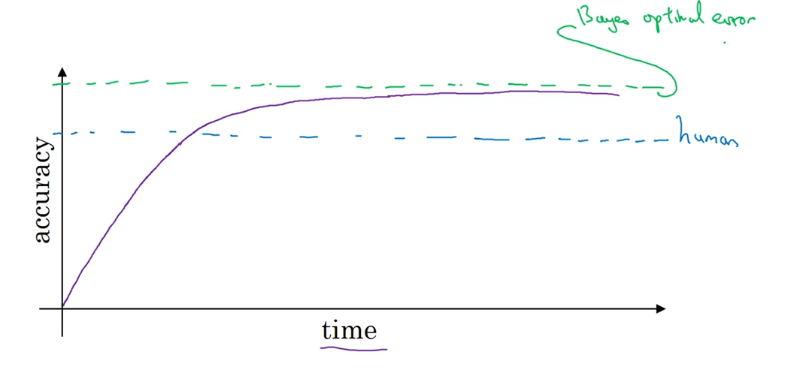

So for example, for speech recognition, if x is audio clips, some audio is just so noisy it is impossible to tell what is in the correct transcription. So the perfect error may not be 100%. Or for cat recognition. Maybe some images are so blurry, that it is just impossible for anyone or anything to tell whether or not there's a cat in that picture. So, the perfect level of accuracy may not be 100%. And Bayes optimal error, or Bayesian optimal error, or sometimes Bayes error for short, is the very best theoretical function for mapping from x to y. That can never be surpassed. 

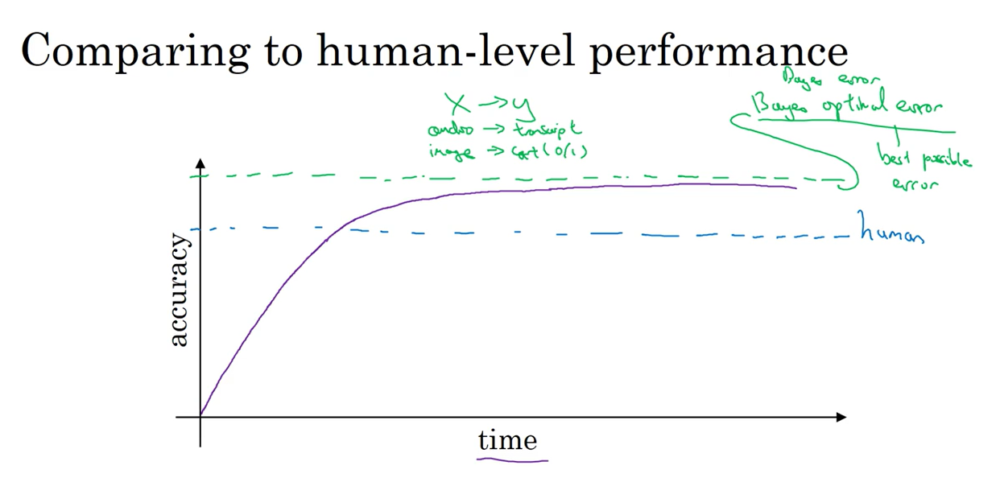

So it should be no surprise that this purple line, no matter how many years you work on a problem you can never surpass Bayes error, Bayes optimal error. And it turns out that progress is often quite fast until you surpass human level performance. And it sometimes slows down after you surpass human level performance. 

And I think there are two reasons for that, for why progress often slows down when you surpass human level performance. 
* One reason is that human level performance is for many tasks not that far from Bayes' optimal error. People are very good at looking at images and telling if there's a cat or listening to audio and transcribing it. So, by the time you surpass human level performance maybe there's not that much head room to still improve. 
* But the second reason is that so long as your performance is worse than human level performance, then there are actually certain tools you could use to improve performance that are harder to use once you've surpassed human level performance. 

### Why compare to human-level performance
For tasks that humans are quite good at, and this includes looking at pictures and recognizing things, or listening to audio, or reading language, really natural data tasks humans tend to be very good at. For tasks that humans are good at, so long as your machine learning algorithm is still worse than the human
* You can get labeled data from humans. That is you can ask people, ask/hire humans, to label examples for you so that you can have more data to feed your learning algorithm. 
* Something we'll talk about next week is manual error analysis. But so long as humans are still performing better than any other algorithm, you can ask people to look at examples that your algorithm's getting wrong, and try to gain insight in terms of why a person got it right but the algorithm got it wrong. And we'll see next week that this helps improve your algorithm's performance. 
* And you can also get a better analysis of bias and variance which we'll talk about in a little bit. But so long as your algorithm is still doing worse then humans you have these important tactics for improving your algorithm. Whereas once your algorithm is doing better than humans, then these three tactics are harder to apply. 

So, this is maybe another reason why comparing to human level performance is helpful, especially on tasks that humans do well. And why machine learning algorithms tend to be really good at trying to replicate tasks that people can do and kind of catch up and maybe slightly surpass human level performance. 

## Avoidable Bias
We talked about how you want your learning algorithm to do well on the training set but sometimes you don't actually want to do too well and knowing what human level performance is, can tell you exactly how well but not too well you want your algorithm to do on the training set.
### Bias and Variance
We have used Cat classification a lot and given a picture, let's say humans have near-perfect accuracy so the human level error is one percent. 

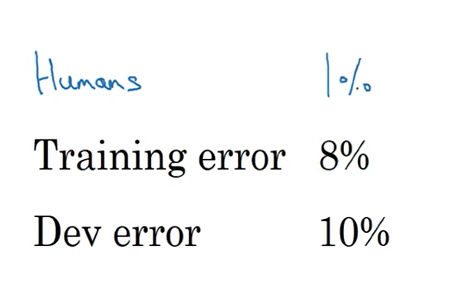

In that case, if your learning algorithm achieves 8 percent training error and 10 percent dev error, then maybe you want it to do better on the training set. So the fact that there's a huge gap between how well your algorithm does on your training set versus how humans do shows that your algorithm isn't even fitting the training set well.

In terms of tools to reduce bias or variance, in this case I would say focus on reducing bias. So you want to do things like train a bigger neural network or run training set longer, just try to do better on the training set. 

Now let's look at the same training error and dev error and imagine that human level performance was not 1%. So this copy is over but you know in a different application or maybe on a different data set, let's say that human level error is actually 7.5%. 

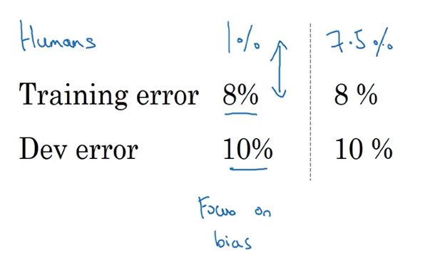

Maybe the images in your data set are so blurry that even humans can't tell whether there's a cat in this picture. This example is maybe slightly contrived because humans are actually very good at looking at pictures and telling if there's a cat in it or not. But for the sake of this example, let's say your data sets images are so blurry or so low resolution that even humans get 7.5% error.

In this case, even though your training error and dev error are the same as the other example, you see that maybe you're actually doing just fine on the training set. It's doing only a little bit worse than human level performance. And in this second example, you would maybe want to focus on reducing the variance in your learning algorithm. You might try regularization to try to bring your dev error closer to your training error for example. 

In the earlier course's discussion on bias and variance, we were mainly assuming that there were tasks where Bayes error is nearly zero. So to explain what just happened here, for our Cat classification example, think of human level error as a proxy or as a estimate for Bayes error or for Bayes optimal error. And for computer vision tasks, this is a pretty reasonable proxy because humans are actually very good at computer vision and so whatever a human can do is maybe not too far from Bayes error.

By definition, human level error is worse than Bayes error because nothing could be better than Bayes error but human level error might not be too far from Bayes error.

So the surprising thing we saw here is that depending on what human level error is or really this is really approximately Bayes error or so we assume it to be, but depending on what we think is achievable, with the same training error and dev error in these two cases, we decided to focus on bias reduction tactics or on variance reduction tactics. 

What happened is in the example on the left, 8% training error is really high when you think you could get it down to 1% and so bias reduction tactics could help you do that. 

Whereas in the example on the right, if you think that Bayes error is 7.5% and here we're using human level error as an estimate or as a proxy for Bayes error, but you think that Bayes error is close to seven point five percent then you know there's not that much headroom for reducing your training error further down. You don't really want it to be that much better than 7.5% because you could achieve that only by maybe starting to over fit the training set, and instead, there's much more room for improvement in terms of taking this 2% gap and trying to reduce that by using variance reduction techniques such as regularization or maybe getting more training data.

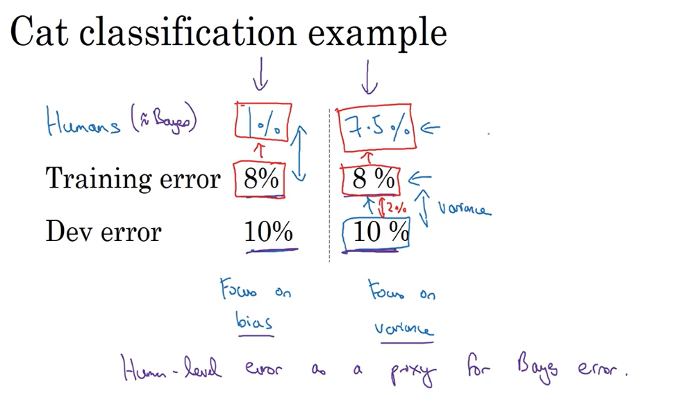

So to give these things a couple of names, this is not widely used terminology but I found this useful terminology and a useful way of thinking about it, which is I'm going to call the difference between Bayes error or approximation of Bayes error and the training error to be the avoidable bias. So what you want is to maybe keep improving your training performance until you get down to Bayes error but you don't actually want to do better than Bayes error. You can't actually do better than Bayes error unless you're overfitting. And this, the difference between your training area and the dev error, there's a measure still of the variance problem of your algorithm. 

The term avoidable bias acknowledges that there's some bias or some minimum level of error that you just cannot get below which is that if Bayes error is 7.5%, you don't actually want to get below that level of error. So rather than saying that if you're training error is 8%, then the 8% is a measure of bias in this example, you're saying that the avoidable bias is maybe 0.5% or 0.5% is a measure of the avoidable bias whereas 2% is a measure of the variance and so there's much more room in reducing this 2% than in reducing this 0.5%.

Whereas in contrast in the example on the left, this 7% is a measure of the avoidable bias, whereas 2% is a measure of how much variance you have. And so in this example on the left, there's much more potential in focusing on reducing that avoidable bias.

In this example, understanding human level error, understanding your estimate of Bayes error really causes you in different scenarios to focus on different tactics, whether bias avoidance tactics or variance avoidance tactics. There's quite a lot more nuance in how you factor in human level performance into how you make decisions in choosing what to focus on.

## Understanding Human-level Performance
The term human-level performance is sometimes used casually in research articles. But let me show you how we can define it a bit more precisely. And in particular, use the definition of the phrase, human-level performance, that is most useful for helping you drive progress in your machine learning project.

### Human-level error as a proxy for Bayes error
So remember from our last video that one of the uses of this phrase, human-level error, is that it gives us a way of estimating Bayes error. What is the best possible error any function could, either now or in the future, ever, ever achieve? 

So bearing that in mind, let's look at a medical image classification example. Let's say that you want to look at a radiology image like this, and make a diagnosis classification decision. 

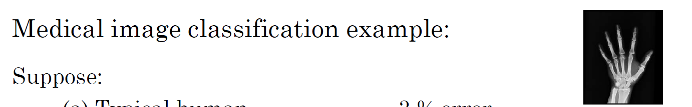

Suppose:
* (a) Typical human ………………. 3 % error
* (b) Typical doctor ………………... 1 % error
* (c) Experienced doctor …………... 0.7 % error
* (d) Team of experienced doctors .. 0.5 % error

So the question I want to pose to you is, how should you define human-level error? Is human-level error 3%, 1%, 0.7% or 0.5%? Feel free to pause this video to think about it if you wish. 

And to answer that question, I would urge you to bear in mind that one of the most useful ways to think of human error is as a proxy or an estimate for Bayes error.

But here's how I would define human-level error. Which is if you want a proxy or an estimate for Bayes error, then given that a team of experienced doctors discussing and debating can achieve 0.5% error, we know that Bayes error is less than equal to 0.5%. So because some system, team of these doctors can achieve 0.5% error, so by definition, this directly, optimal error has got to be 0.5% or lower. We don't know how much better it is, maybe there's a even larger team of even more experienced doctors who could do even better, so maybe it's even a little bit better than 0.5%. But we know the optimal error cannot be higher than 0.5%. 

So what I would do in this setting is use 0.5% as our estimate for Bayes error. So I would define human-level performance as 0.5%. At least if you're hoping to use human-level error in the analysis of bias and variance as we saw in the last video. 

Now, for the purpose of publishing a research paper or for the purpose of deploying a system, maybe there's a different definition of human-level error that you can use which is so long as you surpass the performance of a typical doctor. That seems like maybe a very useful result if accomplished, and maybe surpassing a single radiologist, a single doctor's performance might mean the system is good enough to deploy in some context.

The takeaway from this is to be clear about what your purpose is in defining the term human-level error. And if it is to show that you can surpass a single human and therefore argue for deploying your system in some context, maybe 1% is the appropriate definition. But if your goal is the proxy for Bayes error, then 0.5% is the appropriate definition.

### Error analysis example
To see why this matters, let's look at an error analysis example.

Let's say, for a medical imaging diagnosis example, that your training error is 5% and your dev error is 6%. And in the example from the previous slide, our human-level performance, and I'm going to think of this as proxy for Bayes error. Depending on whether you defined it as a typical doctor's performance or experienced doctor or team of doctors, you would have either 1% or 0.7% or 0.5% for this.

And remember also our definitions from the previous video, that this gap between Bayes error or estimate of Bayes error and training error is calling that a measure of the avoidable bias. And this as a measure or an estimate of how much of a variance problem you have in your learning algorithm. 

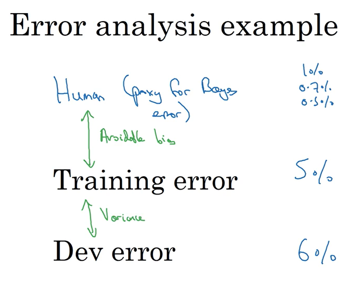

So in this first example, whichever of these choices you make, the measure of avoidable bias will be something like 4%. It will be somewhere between I guess, 4%, if you take that to 4.5%, if you use 0.5%, whereas this is 1%. 

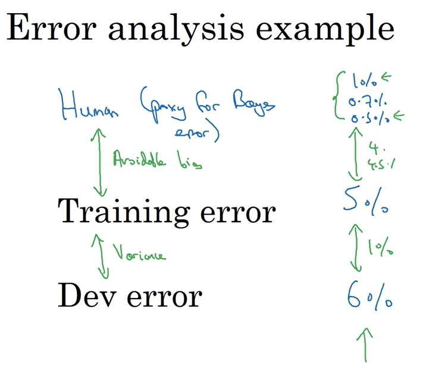

So in this example, I would say, it doesn't really matter which of the definitions of human-level error you use, whether you use the typical doctor's error or the single experienced doctor's error or the team of experienced doctor's error. Whether this is 4% or 4.5%, this is clearly bigger than the variance problem. And so in this case, you should focus on bias reduction techniques such as train a bigger network.

Now let's look at a second example. Let's say your training error is 1% and your dev error is 5%. Then again it doesn't really matter, seems a bit academic whether the human-level performance is 1% or 0.7% or 0.5%. Because whichever of these definitions you use, your measure of avoidable bias will be, I guess somewhere between 0% if you use that, to 0.5%. That's the gap between the human-level performance and your training error, whereas this gap is 4%. So this 4% is going to be much bigger than the avoidable bias either way. And so they'll just suggest you should focus on variance reduction techniques such as regularization or getting a bigger training set.

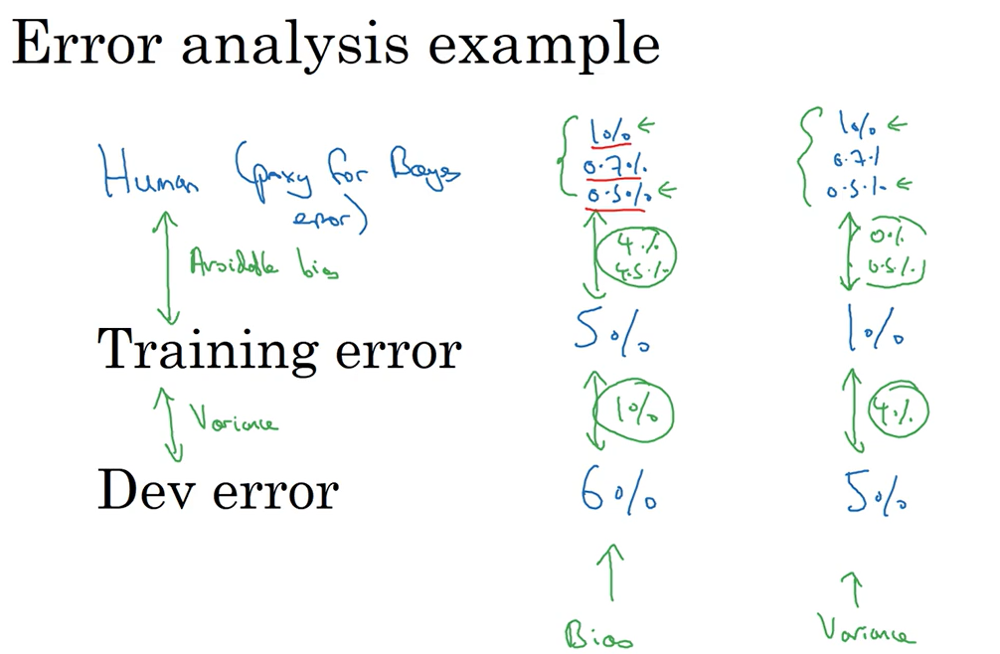

But where it really matters will be if your training error is 0.7%. So you're doing really well now, and your dev error is 0.8%. In this case, it really matters that you use your estimate for Bayes error as 0.5%. Because in this case, your measure of how much avoidable bias you have is 0.2% which is twice as big as your measure for your variance, which is just 0.1%. And so this suggests that maybe both the bias and variance are both problems but maybe the avoidable bias is a bit bigger of a problem. And in this example, 0.5% as we discussed on the previous slide was the best measure of Bayes error, because a team of human doctors could achieve that performance. If you use 0.7 as your proxy for Bayes error, you would have estimated avoidable bias as pretty much 0%, and you might have missed that. You actually should try to do better on your training set.

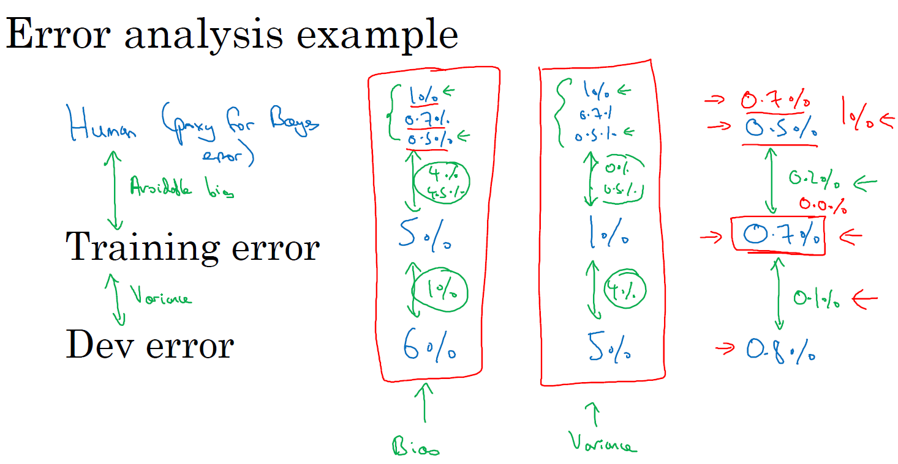

In this example, once you've approached 0.7% error, unless you're very careful about estimating Bayes error, you might not know how far away you are from Bayes error. And therefore how much you should be trying to reduce aviodable bias. In fact, if all you knew was that a single typical doctor achieves 1% error, and it might be very difficult to know if you should be trying to fit your training set even better. And this problem arose only when you're doing very well on your problem already, only when you're doing 0.7%, 0.8%, really close to human-level performance. Whereas in the two examples on the left, when you are further away human-level performance, it was easier to target your focus on bias or variance. So this is maybe an illustration of why as your pro human-level performance is actually harder to tease out the bias and variance effects. And therefore why progress on your machine learning project just gets harder as you're doing really well. 

### Summary of bias/variance with human-level performance
So just to summarize what we've talked about. If you're trying to understand bias and variance where you have an estimate of human-level error 
For a task that humans can do quite well, you can use human-level error as a proxy or as a approximation for Bayes error. And so the difference between your estimate of Bayes error tells you how much avoidable bias is a problem, how much avoidable bias there is. And the difference between training error and dev error, that tells you how much variance is a problem, whether your algorithm's able to generalize from the training set to the dev set.

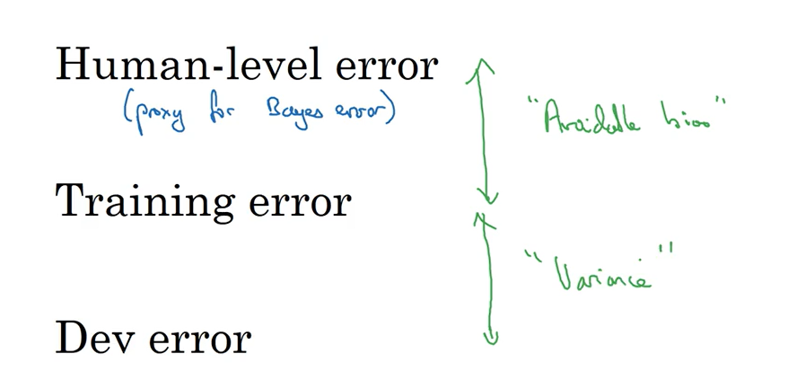

The big difference between our discussion here and what we saw in an earlier course was that instead of comparing training error to 0%, And just calling that the estimate of the bias. In contrast, in this video we have a more nuanced analysis in which there is no particular expectation that you should get 0% error. Because sometimes Bayes error is non zero and sometimes it's just not possible for anything to do better than a certain threshold of error. 

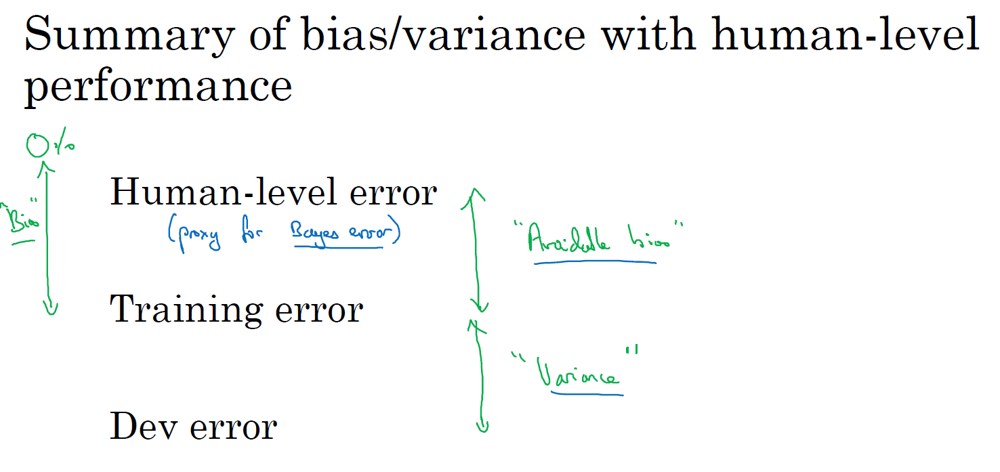

And so in the earlier course, we were measuring training error, and seeing how much bigger training error was than zero. And just using that to try to understand how big our bias is. And that turns out to work just fine for problems where Bayes error is nearly 0%, such as recognizing cats. Humans are near perfect for that, so Bayes error is also near perfect for that. So that actually works okay when Bayes error is nearly zero. But for problems where the data is noisy, like speech recognition on very noisy audio, where it's just impossible sometimes to hear what was said and to get the correct transcription. For problems like that, having a better estimate for Bayes error can help you better estimate avoidable bias and variance. And therefore make better decisions on whether to focus on bias reduction tactics, or on variance reduction tactics. 

So to recap, having an estimate of human-level performance gives you an estimate of Bayes error. And this allows you to more quickly make decisions as to whether you should focus on trying to reduce a bias or trying to reduce the variance of your algorithm. And these techniques will tend to work well until you surpass human-level performance, whereupon you might no longer have a good estimate of Bayes error that still helps you make this decision really clearly.

## Surpassing Human-level Performance
A lot of teams often find it exciting to surpass human-level performance on the specific recreational classification task.

### Surpassing human-level performance
We've discussed before how machine learning progress gets harder as you approach or even surpass human-level performance.

Let's say you have a problem where a team of humans discussing and debating achieves 0.5% error, a single human 1% error, and you have an algorithm of 0.6% training error and 0.8% dev error. 

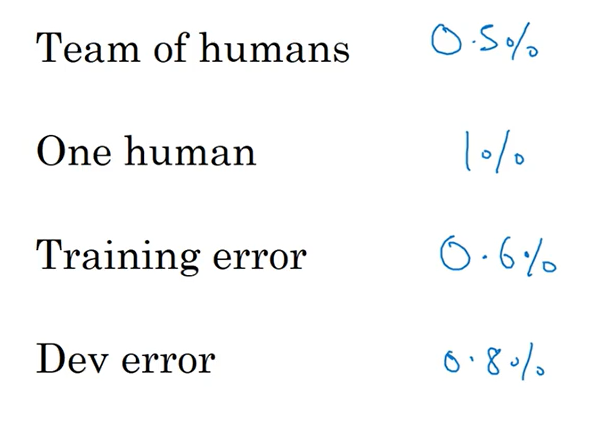

So in this case, what is the avoidable bias?

So this one is relatively easier to answer, 0.5% is your estimate of Baye's error, so your avoidable bias is, you're not going to use this 1% number as reference, you can use this difference (0.6-0.5=0.1), so maybe you estimate your avoidable bias is at least 0.1% and your variance as 0.2%. So there's maybe more to do to reduce your variance than your avoidable bias perhaps.

But now let's take a harder example, let's say, a team of humans and single human performance, the same as before, but your algorithm gets 0.3% training error, and 0.4% dev error.

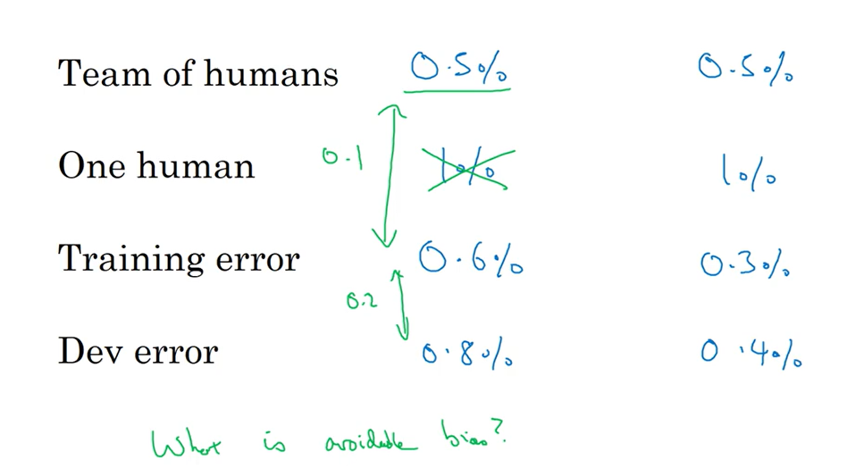

Now, what is the avoidable bias?

It's now actually much harder to answer that. Is the fact that your training error, 0.3%, does this mean you've over-fitted by 0.2%, or is Baye's error, actually 0.1%, or maybe is Baye's error 0.2%, or maybe Baye's error is 0.3%? You don't really know, but based on the information given in this example, you actually don't have enough information to tell if you should focus on reducing bias or reducing variance in your algorithm. So that slows down the efficiency where you should make progress. 

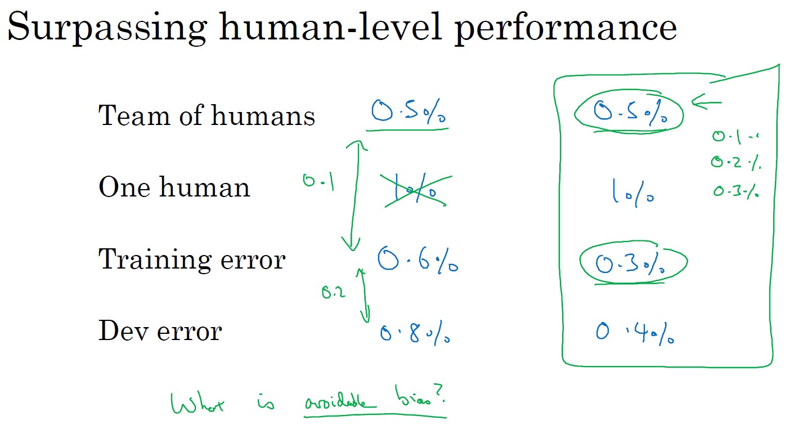

Moreover, if your error is already better than even a team of humans looking at and discussing and debating the right label, for an example, then it's just also harder to rely on human intuition to tell your algorithm what are ways that your algorithm could still improve the performance?

So in this example, once you've surpassed this 0.5% threshold, your options, your ways of making progress on the machine learning problem are just less clear. It doesn't mean you can't make progress, you might still be able to make significant progress, but some of the tools you have for pointing you in a clear direction just don't work as well.

### Problems where ML significantly surpasses human-level performance
Now, there are many problems where machine learning significantly surpasses human-level performance.

For example, I think, 
* Online advertising, estimating how likely someone is to click on that. Probably, learning algorithms do that much better today than any human could.
* Making product recommendations, recommending movies or books to you. I think that web sites today can do that much better than maybe even your closest friends can. 
* Logistics predicting how long will take you to drive from A to B, or predicting how long to take a delivery vehicle to drive from A to B.
* Trying to predict whether someone will repay a loan, and therefore, whether or not you should approve a loan offer.

All of these are problems where I think today machine learning far surpasses a single human's performance.

Notice something about these four examples. All four of these examples are actually learning from structured data, where you might have a database of what ads users have clicked on, database of products you've bought before, databases of how long it takes to get from A to B, database of previous loan applications and their outcomes. And these are not natural perception problems, so these are not computer vision, or speech recognition, or natural language processing tasks. Humans tend to be very good in natural perception task. So it is possible, but it's just a bit harder for computers to surpass human-level performance on natural perception tasks. 

Finally, all of these are problems where there are teams that have access to huge amounts of data. So for example, the best systems for all four of these applications have probably looked at far more data of that application than any human could possibly look at. And so, that's also made it relatively easy for a computer to surpass human-level performance. Now, the fact that there's so much data that computer could examine, so it can better find statistical patterns than even the human mind.

Other than these problems, today there are speech recognition systems that can surpass human-level performance. And there are also some computer vision, some image recognition tasks, where computers have surpassed human-level performance. But because humans are very good at these natural perception tasks, I think it was harder for computers to get there. 

And then there are some medical tasks, for example, reading ECGs or diagnosing skin cancer, or certain narrow radiology task, where computers are getting really good and maybe surpassing a single human-level's performance. And I guess one of the exciting things about recent advances in deep learning is that even for these tasks we can now surpass human-level performance in some cases, but it has been a bit harder because humans tend to be very good at these natural perception tasks.

Surpassing human-level performance is often not easy, but given enough data there've been lots of deep learning systems have surpassed human-level performance on a single supervisory problem.

## Improving your model performance
You've heard about orthogonalization, how to set up your dev and test sets, human-level performance as a proxy for Bayes error and how to estimate your avoidable bias and variance. 

Let's pull it all together into a set of guidelines to how to improve the performance of your learning algorithm. 

### The two fundamental assumptions of supervised learning
So, I think getting a supervised learning algorithm to work well means fundamentally hoping or assuming they can do two things. 
* First, is that you can fit the training set pretty well, and you can think of this as roughly saying that you can achieve low avoidable bias. 
* The second thing you're assuming you can do well, is that doing well on the training set generalizes pretty well to the dev set or the test set, and this is sort of saying that variance is not too bad.

In the spirit of orthogonalization, what you see is that there's a certain set of knobs you can use to fix avoidable bias issues, such as training a bigger network or training longer.

And there is a separate set of things you could use to address variance problems, such as regularization or getting more training data.

### Reducing (avoidable) bias and variance
To summarize up the process we've seen in the last several videos, if you want to improve the performance of your machine learning system, I would recommend looking at the difference between your training error and your proxy for Bayes error and just gives you a sense of the avoidable bias. In other words, just how much better do you think you should be trying to do on your training set. 

And then look at the difference between your dev error and your training error as an estimate of how much of a variance problem you have. In other words, how much harder you should be working to make your performance generalized from the training set to the dev set that it wasn't trained on explicitly. 

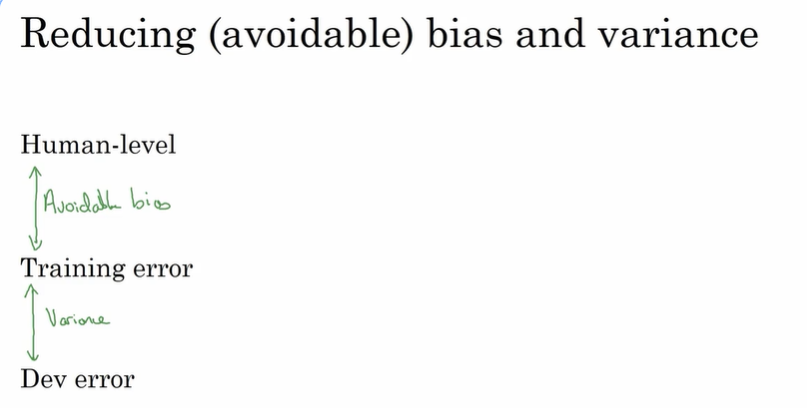

To whatever extent you want to try to reduce avoidable bias, I would try to apply tactics like 
* Train a bigger model. So, you can just do better on your training sets 
* Train longer, use a better optimization algorithm, such as ADS momentum or RMSprop, or use a better algorithm like Adam.
* One other thing you could try is to just find a better neural network architecture or better set of hyperparameters, and this could include everything from changing the activation function to changing the number of layers or hidden units. Although if you do that, it would be in the direction of increasing the model size to trying out other models or other model architectures, such as recurrent neural networks and convolutional neural networks, which we'll see in later courses. Whether or not a new neural network architecture will fit your training set better is sometimes hard to tell in advance, but sometimes you can get much better results with a better architecture.

Next to the extent that you find out variance is a problem, some of the many techniques you could try then includes the following: 
* You can try to get more data because getting more data to train on could help you generalize better to dev set data that your algorithm didn't see.
* You could try regularization. So, this includes things like L2 regularization or dropout or data augmentation, which we talked about in the previous course
* Once again, you can also try various neural network architecture/hyperparameters search to see if that can help you find a neural network architecture that is better suited for your problem. 

I think that this notion of bias or avoidable bias and variance is one of those things that's easily learnt but tough to master. And if you're able to systematically apply the concepts from this week's video, you actually will be much more efficient and much more systematic and much more strategic than a lot of machine learning teams in terms of how to systematically go about improving the performance of your machine learning system.

