# Week 1: Foundations of Convolutions Neural Networks

**Learning Objectives**
* Explain the convolution operation
* Apply two different types of pooling operations
* Identify the components used in a convolutional neural network (padding, stride, filter, ...) and their purpose
* Build a convolutional neural network
* Implement convolutional and pooling layers in numpy, including forward propagation
* Implement helper functions to use when implementing a TensorFlow model
* Create a mood classifer using the TF Keras Sequential API
* Build a ConvNet to identify sign language digits using the TF Keras Functional API
* Build and train a ConvNet in TensorFlow for a binary classification problem
* Build and train a ConvNet in TensorFlow for a multiclass classification problem
* Explain different use cases for the Sequential and Functional APIs

- [Week 1: Foundations of Convolutions Neural Networks](#week-1-foundations-of-convolutions-neural-networks)
  - [Computer Vision](#computer-vision)
    - [Computer Vision Problems](#computer-vision-problems)
    - [Deep Learning on large images](#deep-learning-on-large-images)
  - [Edge detection example](#edge-detection-example)
    - [Computer Vision Problem](#computer-vision-problem)
    - [Vertical edge detection](#vertical-edge-detection)
    - [Why vertical edge detection?](#why-vertical-edge-detection)
  - [More Edge Detection](#more-edge-detection)
    - [Vertical edge detection examples](#vertical-edge-detection-examples)
    - [Learning to detect edges](#learning-to-detect-edges)
  - [Padding](#padding)
    - [Valid and Same convolutions](#valid-and-same-convolutions)
  - [Strided Convolutions](#strided-convolutions)
    - [Summary of convolutions](#summary-of-convolutions)
    - [Technical note on cross-correlation vs. convolution](#technical-note-on-cross-correlation-vs-convolution)
  - [Convolutions over volumes](#convolutions-over-volumes)
    - [Convolutions on RGB images](#convolutions-on-rgb-images)
  - [One Layer of a Convolutional Network](#one-layer-of-a-convolutional-network)
    - [Example of a layer](#example-of-a-layer)
    - [Number of parameters in one layer](#number-of-parameters-in-one-layer)
    - [Summary of notation](#summary-of-notation)
  - [Simple Convolutional Network Example](#simple-convolutional-network-example)
    - [Example ConvNet](#example-convnet)
    - [Types of layer in a convolutional network:](#types-of-layer-in-a-convolutional-network)
  - [Pooling layers](#pooling-layers)
    - [Pooling layer: Max pooling](#pooling-layer-max-pooling)
    - [Pooling layer: Average pooling](#pooling-layer-average-pooling)
    - [Summary of pooling](#summary-of-pooling)
  - [Convolutional neural network example](#convolutional-neural-network-example)
    - [Neural network example](#neural-network-example)
  - [Why Convolutions?](#why-convolutions)
    - [Putting it together](#putting-it-together)


## Computer Vision
Computer vision is one of the areas that's been advancing rapidly thanks to deep learning. 

Deep learning computer vision is now:
* Helping self-driving cars figure out where the other cars and pedestrians around so as to avoid them. 
* Making face recognition work much better than ever before, so that perhaps some of you are able to unlock a phone, unlock even a door using just your face. 
* Some of the companies that build apps are using deep learning to help show you the most attractive, the most beautiful, or the most relevant pictures.
* Deep learning is even enabling new types of art to be created. 

Two reasons people are excited about DL for Computer Vision:
1. Rapid advances in computer vision are enabling brand new applications to view, though they just were impossible a few years ago. And by learning these tools, perhaps you will be able to invent some of these new products and applications.
2. Even if you don't end up building computer vision systems per se, I found that because the computer vision research community has been so creative and so inventive in coming up with new neural network architectures and algorithms, is actually inspire that creates a lot cross-fertilization into other areas as well.
   * For example, when I was working on speech recognition, I sometimes actually took inspiration from ideas from computer vision and borrowed them into the speech literature.

### Computer Vision Problems
* Image recognition: Take 64x64 image as input and figureout if it's a cat or not.
* Object detection: Figure out the position of the other cars in a picture, so that your car can avoid them or draw boxes around them. We have some other way of recognizing where in the picture are these objects.
* Neural Style Transfer: Input a content image and a style image, use NN to repaint the content image using style from style image. This enables new types of artwork to be created. 


### Deep Learning on large images
One of the challenges of computer vision problems is that the inputs can get really big.

For example, in previous courses, you've worked with 64 by 64 images. And so that's 64 by 64 by 3 because there are three color channels. And if you multiply that out, that's 12288. So X the input features has dimension 12288.

But 64x64 is a very small image.

If we work with larger images, i.e, 1000x1000x3, this is actually 1 mega pixels. 1000x1000x3 = 3 million.
* This means input X will be 3 million dimensional.
* The first hidden layer may have 1000 hidden units.
* Total number of weights, matrix $W^{[1]}$, if you use a standard or fully connected network like we have in courses 1 or 2. This matrix will be a 1000 by 3 million dimensional matrix. It also has 3 billion parameters.
  * With that many parameters, it's difficult to get enough data to prevent a neural network from overfitting.
  * The computational requirements and the memory requirements to train a neural network with three billion parameters is just a bit infeasible.

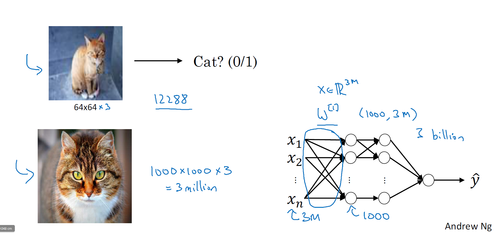

## Edge detection example
The convolution operation is one of the fundamental building blocks of a convolutional neural network.

Using edge detection as the motivating example.

### Computer Vision Problem
In previous videos, I have talked about how the early layers of the neural network might detect edges and then the some later layers might detect cause of objects and then even later layers may detect cause of complete objects like people's faces in this case.

In this video, you see how you can detect edges in an image.

Given a picture like that for a computer to figure out what are the objects in this picture.
1. First thing you might do is maybe detect vertical edges in this image.
   * For example, this image has all those vertical lines idea all lines of these pedestrians and so those get detected in this vertical edge detector output. 
2. Then we want to detect horizontal edges.
   * For example, there is a very strong horizontal line where this railing is and that also gets detected sort of roughly here.

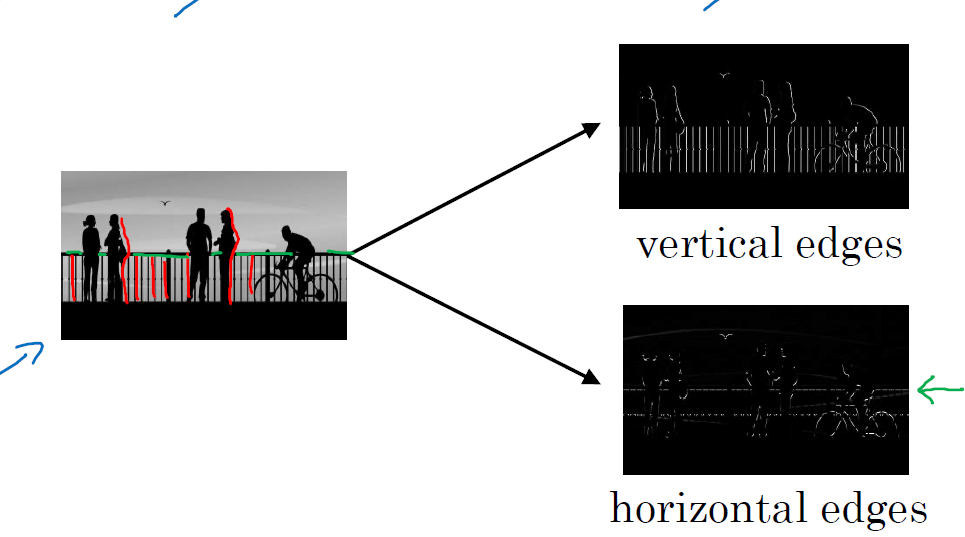

How do you detect edges in image like this? 

### Vertical edge detection
Here is a 6 by 6 grayscale image and because this is a grayscale image, this is just a 6 by 6 by 1 matrix rather than 6 by 6 by 3 because they aren't a separate rgb channels.

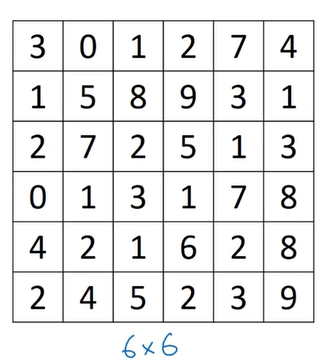

In order to detect edges or lets say vertical edges in his image, what you can do is:
* Construct a 3 by 3 matrix and in the pollens when the terminology of convolutional neural networks, this is going to be called a filter.
* Construct a 3 by 3 filter or 3 by 3 matrix that looks like this 1, 1, 1, 0, 0, 0, -1, -1, -1. 
  * Sometimes research papers will call this a kernel instead of a filter but I am going to use the filter terminology in these videos. 

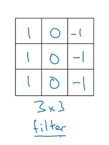

* Take the 6 by 6 image and convolve it, the convolution operation is denoted by this asterisk, with the 3 by 3 filter.
  * One slightly unfortunate thing about the notation is that in mathematics, the asterisk is the standard symbol for convolution but in Python, this is also used to denote multiplication or maybe element wise multiplication.
  * This asterisk has dual purposes is overloaded notation but I will try to be clear in these videos when this asterisk refers to convolution.

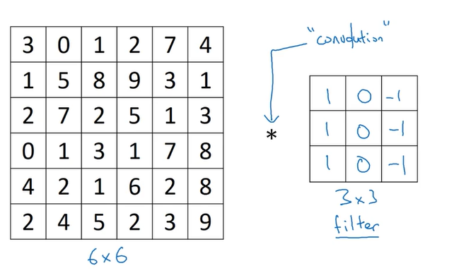

* The output of this convolution operator will be a 4 by 4 matrix, which you can interpret, which you can think of as a 4 by 4 image. 

The way you compute this 4 by 4 output is as follows:
* To compute the first elements, the upper left element of this 4 by 4 matrix, what you are going to do is take the 3 by 3 filter and paste it on top of the 3 by 3 region of your original input image.

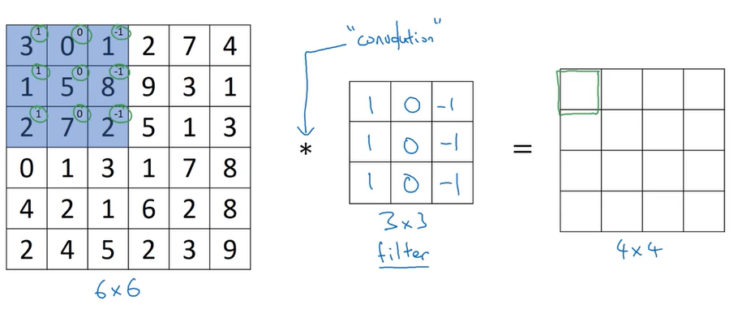

* Take the element wise product.
* Then add up all of the resulting 9 numbers

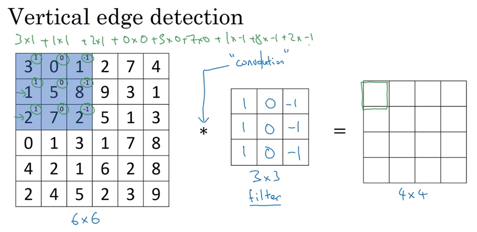

Adding up these nine numbers will give you -5.

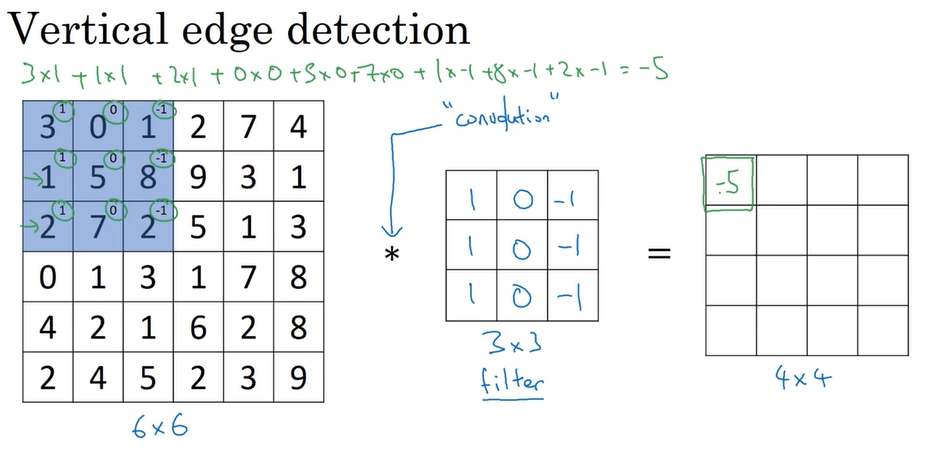

You can add up these nine numbers in any order of course.

* Next, to figure out what is this second element, you are going to take the blue square and shift it one step to the right.
  * You are going to do the same element wise product and then addition. 

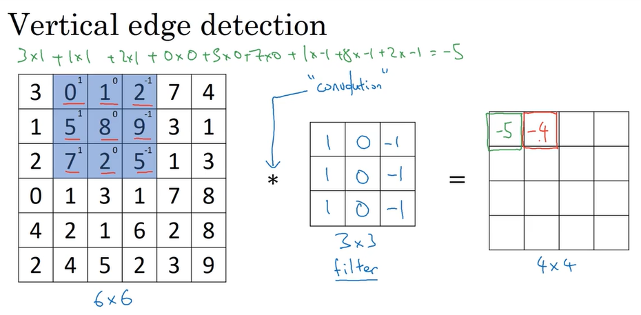

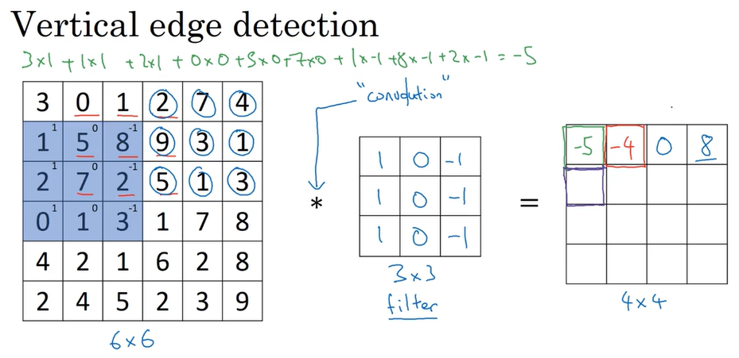

Perform the same calculation too get the output matrix.

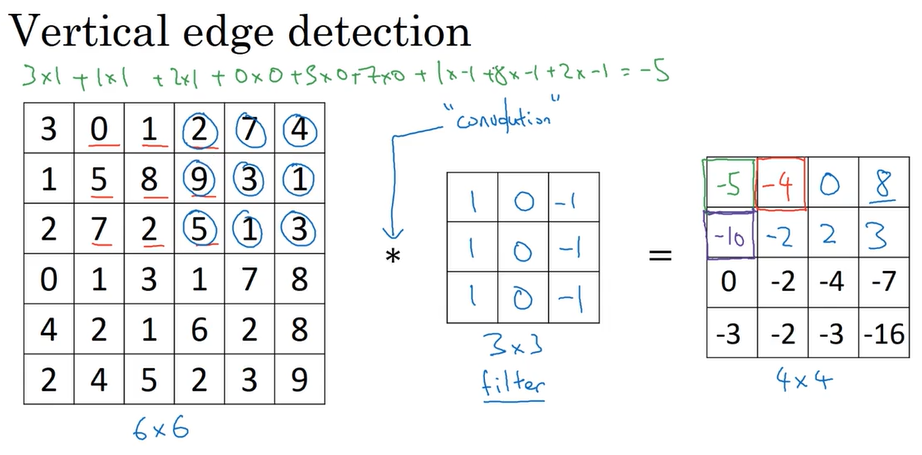

These are just matrices of various dimensions.
* The matrix on the left is convenient to interpret as image
* The one in the middle we interpret as a filter
* The one on the right, you can interpret that as maybe another image. 

And this turns out to be a vertical edge detector.

In Python, we use function rather than asterisk to denote convolution.
* In Python: conv_forward
* In Tensorflow: tf.nn.conv2d
* In Keras: Conv2D

### Why vertical edge detection?
We are going to use a simplified image.

Here is a simple 6 by 6 image where the left half of the image is 10 and the right half is zero.

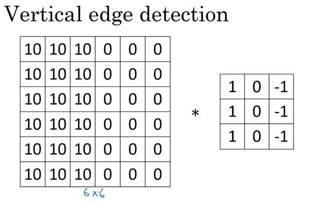

If you plot this as a picture, it might look like this

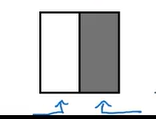

Where the left half, the 10s, give you brighter pixel intensive values and the right half gives you darker pixel intensive values. I am using that shade of gray to denote zeros, although maybe it could also be drawn as black.

In this image, there is clearly a very strong vertical edge right down the middle of this image as it transitions from white to black or white to darker color.

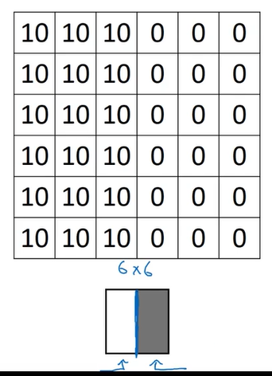

When you convolve this with the 3 by 3 filter which can be visualized as follows, where is lighter, brighter pixels on the left and then this mid tone zeroes in the middle and then darker on the right. 

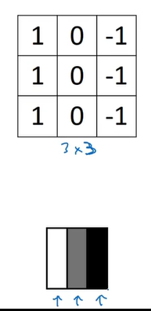

What you get is this matrix on the right.

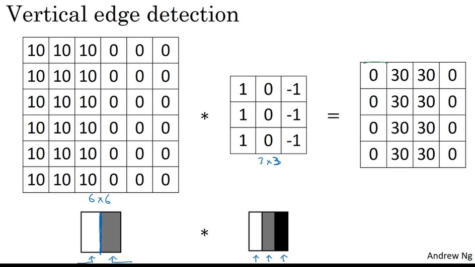

Plot output matrix.

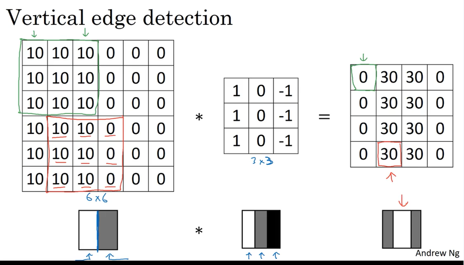

If you plot this right most matrix's image it will look like that where there is this lighter region right in the middle and that corresponds to this having detected this vertical edge down the middle of your 6 by 6 image.

In case the dimensions here seem a little bit wrong that the detected edge seems really thick, that's only because we are working with very small images in this example.

If you are using, say a 1000 by 1000 image rather than a 6 by 6 image then you find that this does a pretty good job, really detecting the vertical edges in your image.

In this example, this bright region in the middle is just the output images way of saying that it looks like there is a strong vertical edge right down the middle of the image. 

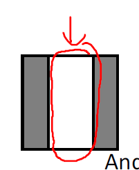

One intuition to take away from vertical edge detection is that a vertical edge is a three by three region, since we are using a 3 by 3 filter, where there are bright pixels on the left, you do not care that much what is in the middle and dark pixels on the right. T
he middle in this 6 by 6 image is where there could be bright pixels on the left and darker pixels on the right and that is why it thinks its a vertical edge over there.

The convolution operation gives you a convenient way to specify how to find these vertical edges in an image.

## More Edge Detection
### Vertical edge detection examples
Here's the example you saw from the previous video, where you have this image, six by six, there's light on the left and dark on the right, and convolving it with the vertical edge detection filter results in detecting the vertical edge down the middle of the image.


What happens in an image where the colors are flipped, where it is darker on the left and brighter on the right?

So the 10s are now on the right half of the image and the 0s on the left. If we use the same edge detection filter, we have the below result

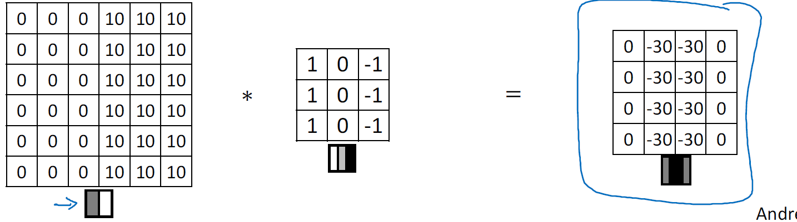

We end up with negative 30s, instead of 30 down the middle. 

Because the shade of the transitions is reversed, the 30s now gets reversed as well. And the negative 30s shows that this is a dark to light rather than a light to dark transition.

If you don't care which of these two cases it is, you could take absolute values of this output matrix. But this particular filter does make a difference between the light to dark versus the dark to light edges. 

This three by three filter we've seen allows you to detect vertical edges.

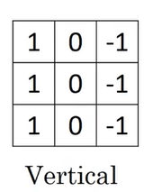

Detect horizontal edges

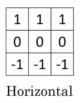

* A vertical edge according to this filter, is a three by three region where the pixels are relatively bright on the left part and relatively dark on the right part. 
* A horizontal edge would be a three by three region where the pixels are relatively bright on top and relatively dark in the bottom row.

So here's one example, this is a more complex one, where you have here 10s in the upper left and lower right-hand corners. So if you draw this as an image, this would be an image which is going to be darker where there are 0s, so I'm going to shade in the darker regions, and then lighter in the upper left and lower right-hand corners.

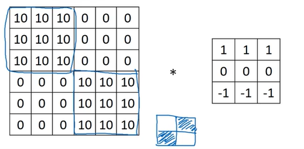

If you convolve this with a horizontal edge detector, you end up with this. 

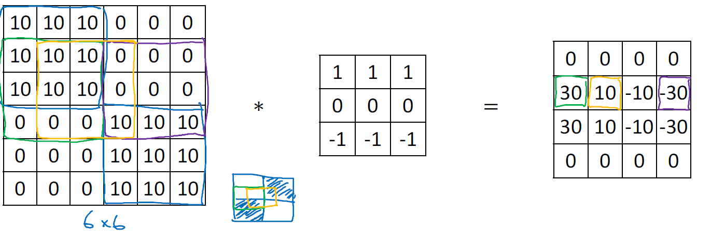

This is kind of an artifact of the fact that we're working with relatively small images, that this is just a six by six image. But these intermediate values, like this -10, for example, just reflects the fact that that filter here, it captures part of the positive edge on the left and part of the negative edge on the right, and so blending those together gives you some intermediate value. 

If this was a very large, say a thousand by a thousand image with this type of checkerboard pattern, then you won't see these transitions regions of the 10s. The intermediate values would be quite small relative to the size of the image.

In summary, different filters allow you to find vertical and horizontal edges.

### Learning to detect edges
It turns out that the three by three vertical edge detection filter we've used is just one possible choice. And historically, in the computer vision literature, there was a fair amount of debate about what is the best set of numbers to use. So here's something else you could use

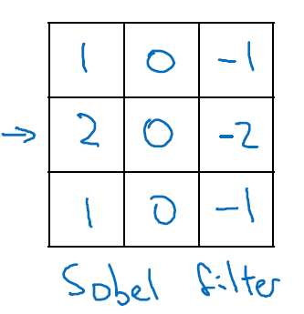

This is called a Sobel filter.

The advantage of this is it puts a little bit more weight to the central row, the central pixel, and this makes it maybe a little bit more robust. 

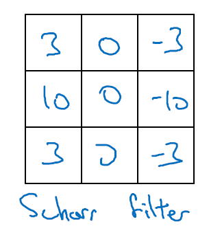

This is called a Scharr filter. And this has yet other slightly different properties.

This is just for vertical edge detection. And if you flip it 90 degrees, you get horizontal edge detection.

With the rise of deep learning, one of the things we learned is that when you really want to detect edges in some complicated image, maybe you don't need to have computer vision researchers handpick these nine numbers. Maybe you can just learn them and treat the nine numbers of this matrix as parameters, which you can then learn using back propagation. And the goal is to learn nine parameters so that when you take the image, the six by six image, and convolve it with your three by three filter, that this gives you a good edge detector.

What you see in later videos is that by just treating these nine numbers as parameters, the backprop can choose to learn 1, 1, 1, 0, 0, 0, -1,-1, if it wants, or learn the Sobel filter or learn the Scharr filter, or more likely learn something else that's even better at capturing the statistics of your data than any of these hand coded filters.

Rather than just vertical and horizontal edges, maybe it can learn to detect edges that are at 45 degrees or 70 degrees or 73 degrees or at whatever orientation it chooses.

By just letting all of these numbers be parameters and learning them automatically from data, we find that neural networks can actually learn low level features, can learn features such as edges, even more robustly than computer vision researchers are generally able to code up these things by hand. 

Underlying all these computations is still this convolution operation, which allows back propagation to learn whatever three by three filter it wants and then to apply it throughout the entire image, in order to output whatever feature it's trying to detect vertical edges, horizontal edges, or edges at some other angle or even some other filter that we might not even have a name for in English. 

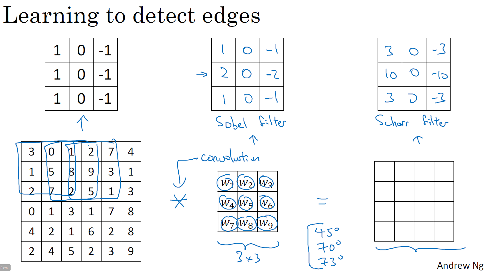

## Padding
What we saw in earlier videos is that if you take a six by six image and convolve it with a three by three filter, you end up with a four by four output with a four by four matrix, and that's because the number of possible positions with the three by three filter, there are only four by four possible positions, for the three by three filter to fit in your six by six matrix.

The math of this this turns out to be that if you have a n by n image and to involved that with an f by f filter, then the dimension of the output will be n-f+1 by n-f+1.

In this example, 

$6-3+1=4$

Which is why you wound up with a 4 by 4 output.

The two downsides to this; 
1. If every time you apply a convolutional operator, your image shrinks, so you come from 6 by 6 down to 4 by 4 then, you can only do this a few times before your image starts getting really small, maybe it shrinks down to 1 by 1 or something, so maybe, you don't want your image to shrink every time you detect edges or to set other features on it.
2. If you look the pixel at the corner or the edge, this little pixel is touched as used only in one of the outputs, because this touches that three by three region. Whereas, if you take a pixel in the middle, say this pixel, then there are a lot of three by three regions that overlap that pixel and so, is as if pixels on the corners or on the edges are use much less in the output. So you're throwing away a lot of the information near the edge of the image.

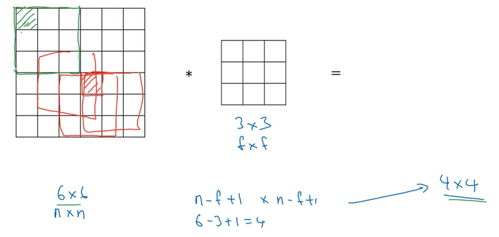

To solve both of these problems, both the shrinking output, and when you build really deep neural networks, you see why you don't want the image to shrink on every step because if you have, maybe a hundred layer of deep net, then it'll shrinks a bit on every layer, then after a hundred layers you end up with a very small image.

The other is throwing away a lot of the information from the edges of the image. 

In order to fix both of these problems, what you can do is the full apply of convolutional operation, you can pad the image.

In this case, let's say you pad the image with an additional one border, with the additional border of one pixel all around the edges. 

If you do that, then instead of a six by six image, you've now padded this to eight by eight image and if you convolve an 8 by 8 image with a 3 by 3 image you now get that out the 4 by 4 by the 6 by 6 image, so you managed to preserve the original input size of six by six. 

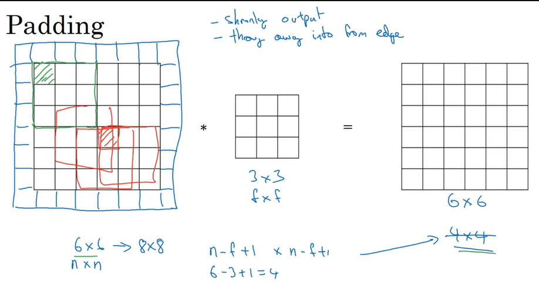

By convention when you pad, you padded with zeros and if p is the padding amounts. 

In this case, p = 1, because we're padding all around with an extra boarder of one pixels, then the output becomes

n+2p-f+1 by n+2p-f+1

So, this becomes 

6+2-3+1 by 6+2-3+1

-> 6 by 6

You end up with a six by six image that preserves the size of the original image.

This being pixel actually influences all of these cells of the output and so this effective, maybe not by throwing away but counting less the information from the edge of the corner or the edge of the image is reduced. 

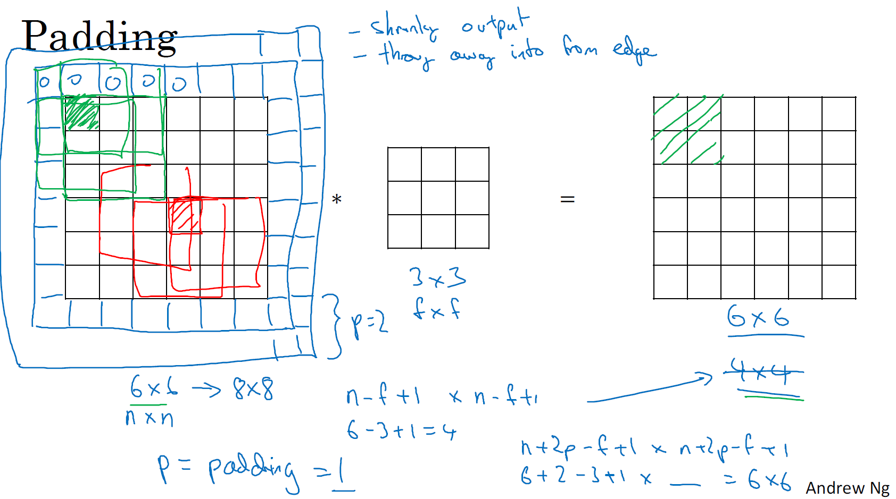

I've shown here, the effect of padding deep border with just one pixel. If you want, you can also pad the border with 2 pixels, in which case I guess, you do add on another border here and they can pad it with even more pixels if you choose.

### Valid and Same convolutions
In terms of how much to pad, it turns out there two common choices that are called, Valid convolutions and Same convolutions.

* In a valid convolution, this basically means no padding.
  * In this case you might have n by n image convolve with an f by f filter and this would give you an n - f + 1 by n - f + 1 dimensional output.
  * This is like the example we had previously on the previous videos where we had an n by n image convolve with the 3 by 3 filter and that gave you a 4 by 4 output. 
* The same convolution and that means when you pad, so the output size is the same as the input size.
  * If we actually look at this formula, when you pad by p pixels then, its as if n goes to n + 2p - f + 1.
  * We have an n by n image and the padding of a border of p pixels all around, then the output sizes of this dimension is n + 2p - f + 1.
  * If you want n + 2p - f + 1 = n, so the output size is same as input size, if you take this and solve for, I guess, n cancels out on both sides and if you solve for p, this implies that $p={{f-1} \over 2}$.
  * When f is odd, by choosing the padding size to be as follows, you can make sure that the output size is same as the input size 
  * That's why, for example, when the filter was 3 by 3 as this had happened in the previous slide, the padding that would make the output size the same as the input size was $p={{3-1} \over 2}=1$.
  * As another example, if your filter was 5 by 5, so if f=5, then, if you pad it into that equation you find that the padding of 2 is required to keep the output size the same as the input size when the filter is 5 by 5. 

By convention in computer vision, 
* f is usually odd. It's actually almost always odd 
* You rarely see even numbered filters, filter works using computer vision.

I think that two reasons for that; 
* One is that if f was even, then you need some asymmetric padding. So only if f is odd that this type of same convolution gives a natural padding region, had the same dimension all around rather than pad more on the left and pad less on the right, or something that asymmetric.
* Second, when you have an odd dimension filter, such as three by three or five by five, then it has a central position and sometimes in computer vision its nice to have a distinguisher, it's nice to have a pixel, you can call the central pixel so you can talk about the position of the filter.

Maybe none of this is a great reason for using f to be pretty much always odd but if you look a convolutional literature you see three by three filters are very common. You see some five by five, seven by sevens. Later we'll also talk about one by one filters and that why that makes sense.

By convention, I recommend you just use odd number filters as well. I think that you can probably get just fine performance even if you want to use an even number value for f, but if you stick to the common computer vision convention, I usually just use odd number f.

To specify the padding for your convolution operation, you can either specify the value for p or you can just say that this is a valid convolution, which means p equals zero or you can say this is a same convolution, which means pad as much as you need to make sure the output has same dimension as the input.

## Strided Convolutions
Stride (s) is how many pixels you move (or “slide”) the filter at each step when performing convolution.
* If stride = 1, the filter moves one pixel at a time.
* If stride = 2, the filter moves two pixels at a time — both horizontally and vertically.

Larger stride → smaller output feature map (less spatial detail).

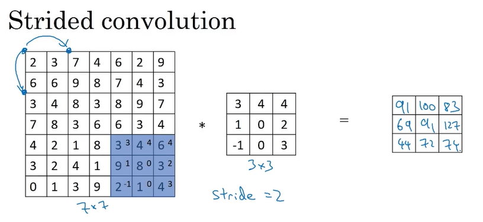

We convol 7x7 matrix with a 3x3 matrix and we have 3x3 output matrix.

The input and output dimensions turns out to be governed by the following formula.
* If you have an n by n image convolve with an f by f filter. If you use adding, p and stride s. In this example, s=2. Then you end up with an output that is n+2p-f.
* Because you're stepping s steps at a time this up just 1 step at a time, you know divide by s and + 1, and then by the same thing. 

${{n+2p-f} \over s} + 1$ by ${{n+2p-f} \over s} + 1$

In our example we have, 7+0-3 divided by 2, that's a stride plus one equals 4/2+1=3, which is why we wind up with this three by three output.

One last detail, which is one of this fraction is not an integer. In that case, we're going to round ${{n+2p-f} \over s}+1$ down. Meaning $\lfloor{{{n+2p-f} \over s}+1} \rfloor$.

So $\lfloor z \rfloor$ = floor(z). This is also called the floor of z. It means taking z, and rounding down to the nearest integer. 

The way this is implemented is that you take this type of blue box multiplication only if the blue box is fully contained within the image or the image plus the padding. If any of this blue box, part of it hangs outside then you just do not do that computation.

Then it turns out that if that's a convention that your 3 by 3 filter must lie entirely within your image or the image plus the padding region before there's a corresponding output generator. That's convention. Then the right thing to do, to compute the output dimension is to round down, in case this (n+2p-f)/s is not an integer. 

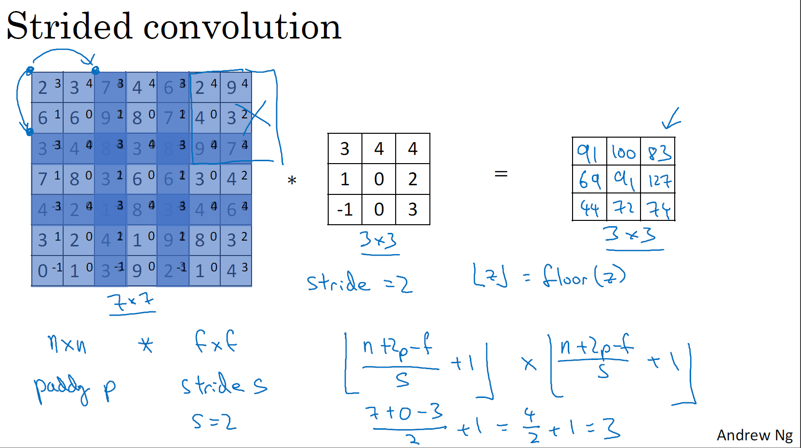

### Summary of convolutions
```
(n x n image) * (f x f filter)
  padding p        stride s
```
= $\lfloor {{n+2p-f} \over s} + 1 \rfloor$ by $\lfloor {{n+2p-f} \over s} + 1 \rfloor$

It is nice we can choose all of these numbers, so that isn't integer, although sometimes you don't have to do that and rounding down this is just fine as well.

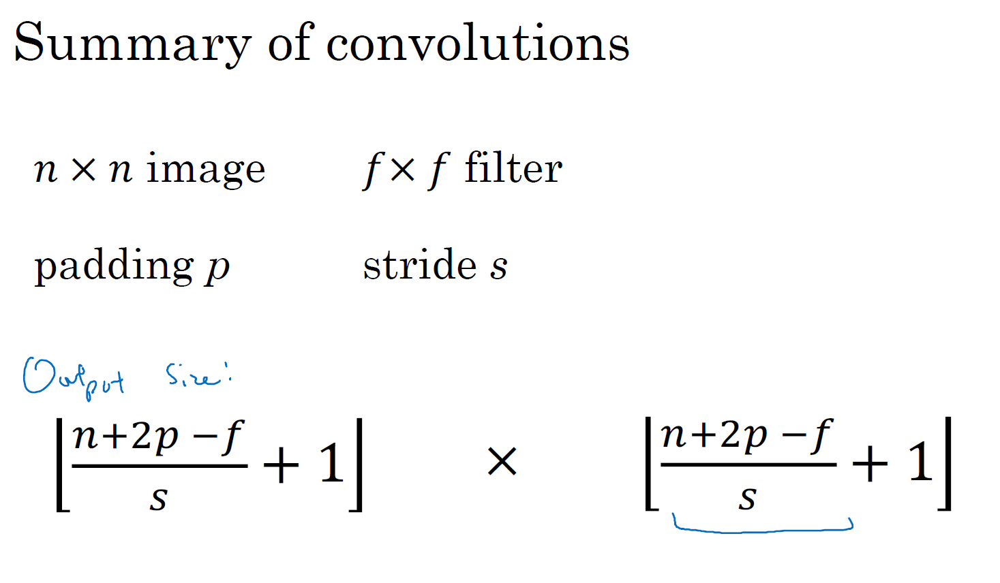

### Technical note on cross-correlation vs. convolution
Now, before moving on, there is a technical comment I want to make about cross-correlation verses convolutions.

This won't affect what you have to do to implement convolution neural networks. But depending on different math textbook or signal processing textbook, there is one other possible inconsistency in the notation.

Which is that if you look at a typical math textbook the way that the convolution is defined, before doing the element-wise product and summing, there's actually one other step that you would first take, which is to convolve this six by six matrix, and this three by three filter, you first take the three by three filter, and flip it on the horizontal as well as the vertical axis. 

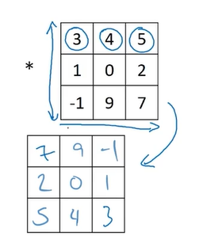

This mis mirroring 3x3 filter on both the vertical and the horizontal axis.

Then perform convolution of this new 3x3 filter with input 6x6 matrix.

The way we've defined the convolution operation in these videos is that we've skipped this mirroring operation. Technically what we're actually doing? Really the operation we've been using for the last few videos is sometimes cross-correlation instead of convolution.

In the deep learning literature, by convention, we just call this the convolution operation.

Just to summarize, by convention, in machine learning, we usually do not bother with this flipping operation. Technically this operation is maybe better called cross-correlation. But most of the deep learning literature just causes the convolution operator. 

I'm going to use that convention in these videos as well, and if you read a lot of the machine learning literature, you find most people would just call this, the convolution operator without bothering to use these flips.

It turns out that in signal processing or in certain branches of mathematics, doing the flipping in the definition of convolution causes convolution operator, to enjoy this property that A convolve with B, convolve with C, is equal to A convolve with B, convolve with C.

$(A*B)*C=A*(B*C)$

And this is called associativity in mathematics.

This is nice for some signal processing applications. But for deep neural networks, it really doesn't matter, and so omitting this double mirroring operation just simplifies the code, and mixing neural network just as well. By convention, most of us just call this convolution. Even though, the mathematicians prefer to call this cross-correlation sometimes. 

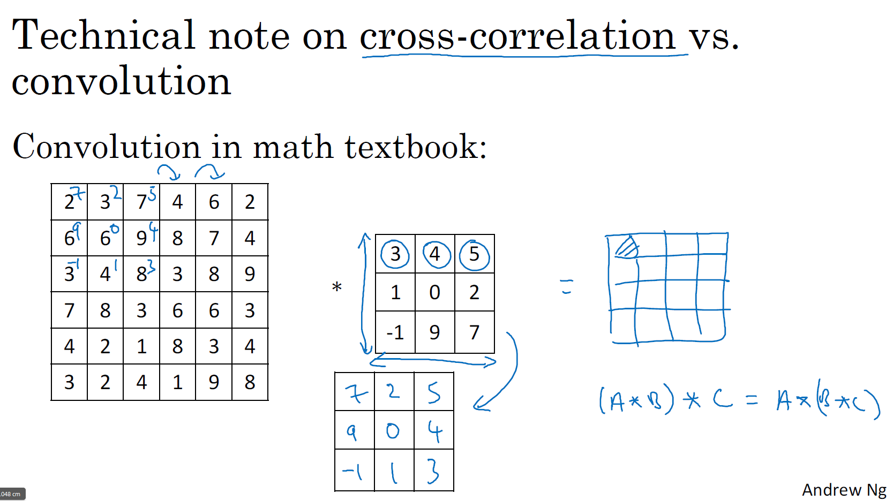

But this should not affect anything you have to implement in their permanent exercises, and should not affect your ability to read and understand the deep learning literature.

## Convolutions over volumes
### Convolutions on RGB images
Let's say we want to detect features in RGB image which is 6x6x3 image, here the three here responds to the three color channels. So, you think of this as a stack of three six by six images.

In order to detect edges or some other feature in this image, you can vault this with also with a 3D filter, that's going to be 3x3x3.

The filter itself will also have three layers corresponding to the red, green, and blue channels. 

In 6x6x3
* First 6 is height
* Second 6 is width
* 3 is the number of channel

Same for the filter

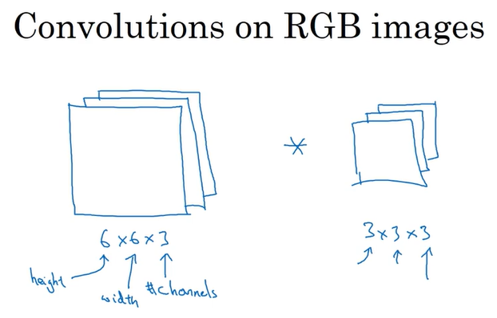

Number of channel in input image must match the number of channel in the filter.

Output of this convolution is 4x4x1 matrix.

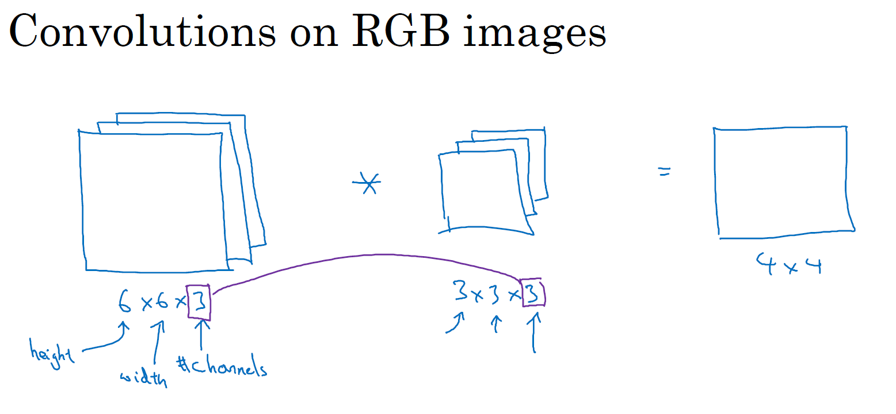

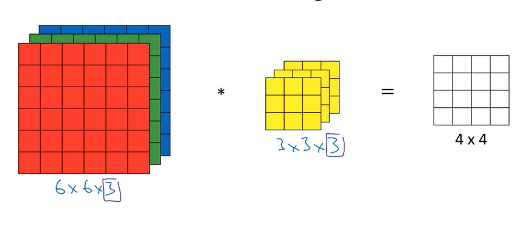

To simplify the drawing of this 3x3x3 filter, instead of joining it is a stack of the matrices, we can just just draw it as this three dimensional cube.

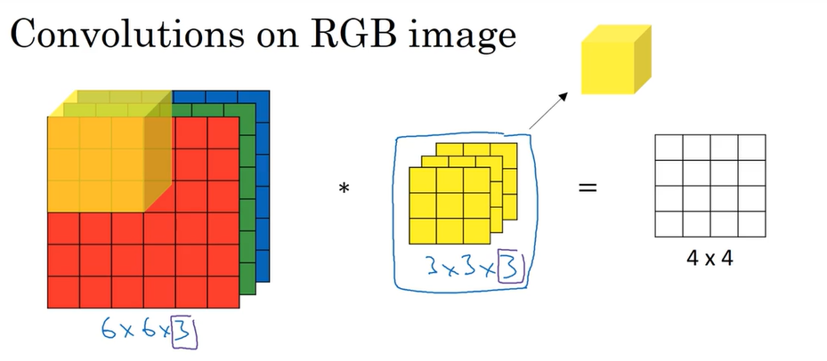

To compute the output of this convolutional operation, what you would do is take the 3x3x3 filter and first, place it in that upper left most position. 

Notice that this 3x3x3 filter has 27 numbers, or 27 parameters, that's three cubes.

What you do is take each of these 27 numbers and multiply them with the corresponding numbers from the red, green, and blue channels of the image, so take the first nine numbers from red channel, then the three beneath it to the green channel, then the three beneath it to the blue channel, and multiply it with the corresponding 27 numbers that gets covered by this yellow cube show on the left.

Then add up all those numbers and this gives you this first number in the output.

Then to compute the next output you take this cube and slide it over by one, and again, due to 27 multiplications, add up the 27 numbers, that gives you this next output and so on.

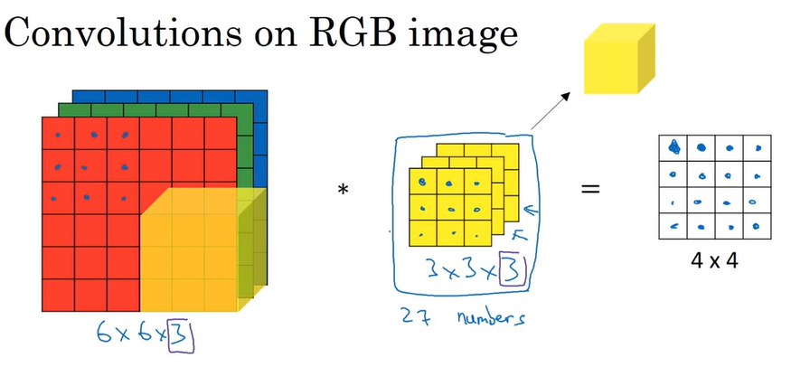

This filter is three by three by three. So, if you want to detect edges in the red channel of the image, then you could have the first filter, the one, one, one, one is one, one is one, one is one as usual, and have the green channel be all zeros, and have the blue filter be all zeros.

If you have these three stack together to form your three by three by three filter, then this would be a filter that detect edges, vertical edges but only in the red channel.

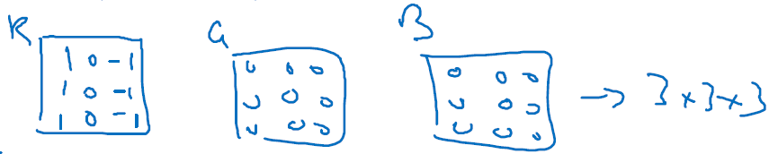

Alternatively, if you don't care what color the vertical edge is in, then you might have a filter that's like this, whereas this one, one, one, minus one, minus one, minus one, in all three channels. 

So, by setting this second alternative, set the parameters, you then have a edge detector, a three by three by three edge detector, that detects edges in any color.

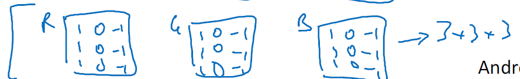

With different choices of these parameters you can get different feature detectors out of this three by three by three filter.

By convention, in computer vision, when you have an input with a certain height, a certain width, and a certain number of channels, then your filter will have a potential different height, different width, but the same number of channels. In theory it's possible to have a filter that maybe only looks at the red channel or maybe a filter looks at only the green channel and a blue channel.

And once again, you notice that convolving a volume, a 6x6x3 convolve with a 3x3x3, that gives a 4x4, a 2D output.

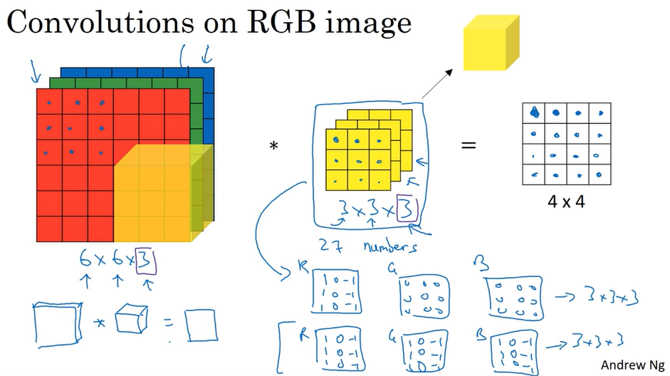

There is one last idea that will be crucial for building convolutional neural networks, which is what if we don't just wanted to detect vertical edges? What if we wanted to detect vertical edges and horizontal edges and maybe 45 degree edges and maybe 70 degree edges as well, but in other words, what if you want to use multiple filters at the same time?

Here's the picture we had from the previous slide, we had 6x6x3 convolved with the 3x3x3, gets 4x4, and maybe this is a vertical edge detector, or maybe it's run to detect some other feature. 

Maybe a second filter may be denoted by this orange-ish color, which could be a horizontal edge detector. Maybe convolving the image with the first filter gives you this first 4x4 output and convolving with the second filter gives you a different 4x4 output.

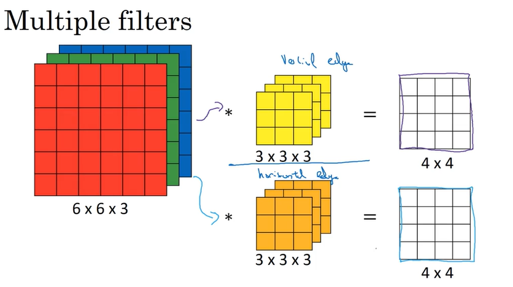

What we can do is then take these two 4x4 outputs, take this first one within the front, and you can take this second filter output and put it at back, so that by stacking these two together, you end up with a 4x4x2 output volume.

You can think of the volume as if we draw this is a box. So this would be a 4x4x2 output volume, which is the result of taking your 6x6x3 image and convolving it or applying two different 3x3 filters to it, resulting in two 4x4 outputs that then gets stacked up to form a 4x4x2 volume.

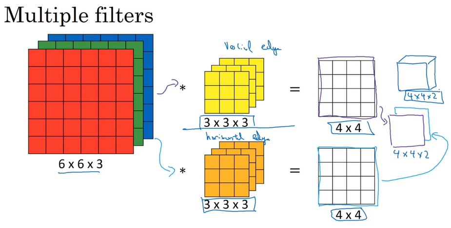

The 2 in the output comes from the fact that we used 2 different filters.

Let's just summarize the dimensions, if you have a

n by n by $n_C$

There's a 6x6x3, where $n_C$ is the number of channels

You convolve that with a f by f by $n_C$, so this was, 3x3x3, and by convention $n_C$ in the image and $n_C$ in the filter have to be the same number.

Then, what you get is 

n - f + 1 by n - f + one by $n_C'$

Or its really $n_C$ of the next layer, but this is the number of filters that you use. So this in our example would be be 4x4x2. 

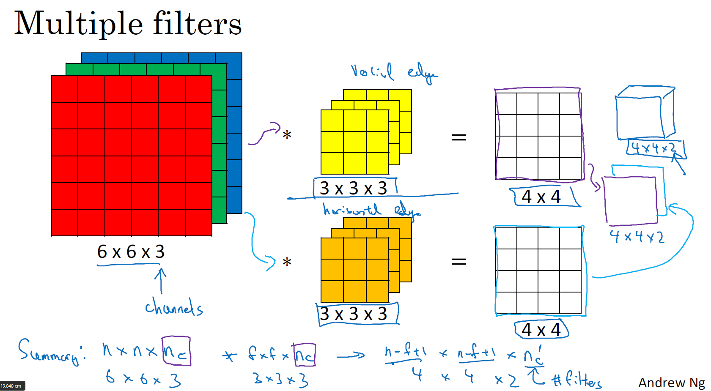

Assuming that you use a stride of one and no padding.

If you used a different stride of padding than this n-f+1 would be affected in a usual way, as we see in the previous videos.

This idea of convolution on volumes, turns out to be really powerful. Only a small part of it is that you can now operate directly on RGB images with three channels. But even more important is that you can now detect two features, like vertical, horizontal edges, or 10, or maybe a 128, or maybe several hundreds of different features. The output will then have a number of channels equal to the number of filters you are detecting.

As a note of notation, I've been using your number of channels to denote this last dimension in the literature, people will also often call this the depth of this 3D volume and both notations, channels or depth, are commonly used in the literature. But I find depth more confusing because you usually talk about the depth of the neural network as well, so I'm going to use the term channels in these videos to refer to the size of this third dimension of these filters. 

## One Layer of a Convolutional Network
### Example of a layer
We've seen at the previous video how to take a 3D volume and convolve it with say two different filters.

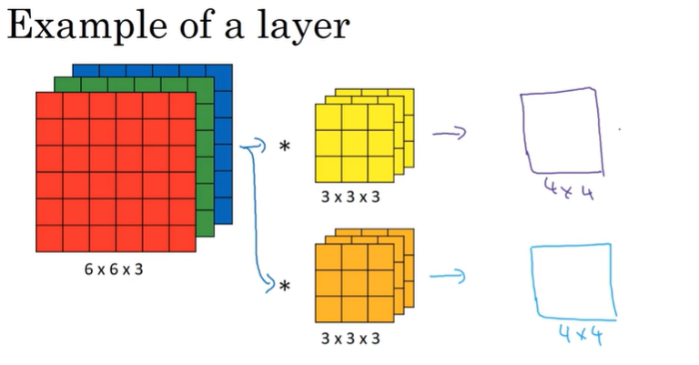

The final thing to turn this into a convolutional neural net layer, is that for each of these we're going to add it bias, so this is going to be a real number.

Where python broadcasting, you kind of have to add the same number so every one of these 16 elements. And then apply a non-linearity which for this illustration that says relative non-linearity, and this gives you a 4 by 4 output after applying the bias and the non-linearity. 

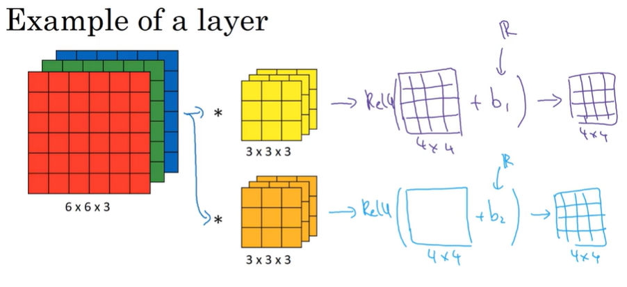

Then same as we did before, if we take this and stack it up as follows, so we ends up with a 4 by 4 by 2 outputs. 

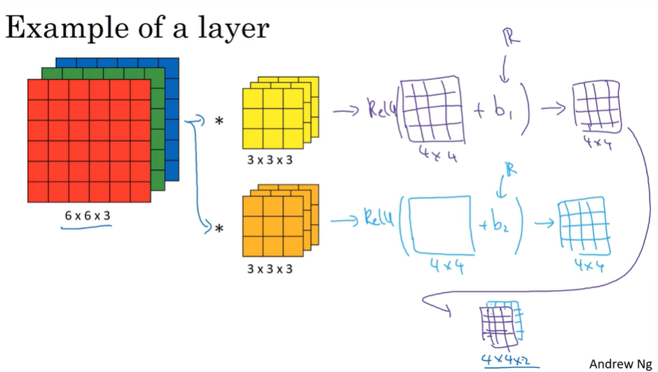

Then this computation where you come from a 6 by 6 by 3 to 4 by 4 by 4, this is one layer of a convolutional neural network. 

To map this back to one layer of four propagation in the standard neural network, in a non-convolutional neural network, remember that one step of forward prop was something like this

$Z^{[1]}=W^{[1]}a^{[0]}+b^{[1]}$

Apply non-linearity to get $a^{[1]}$

$a^{[1]}=g^(Z^{[1]})$

In the input image, this is $a^{[0]}$

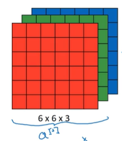

The filters, this plays a role similar to $W^{[1]}$. 

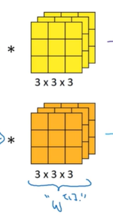

You remember during the convolution operation, you were taking these 27 numbers, or really well, 27 times 2, because you have two filters. You're taking all of these numbers and multiplying them. So you're really computing a linear function to get this 4 x 4 matrix. So that 4 x 4 matrix, the output of the convolution operation, that plays a role similar to $W^{[1]}a^{[0]}$. That's really maybe the output of this 4 x 4 as well as that 4 x 4.

Then the other thing you do is add the bias. So, this thing here before applying ReLU, this plays a role similar to Z.

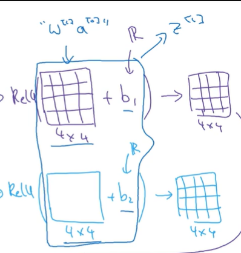

Then it's finally by applying the non-linearity, this kind of this I guess. So, this output plays a role, this really becomes your activation at the next layer. 

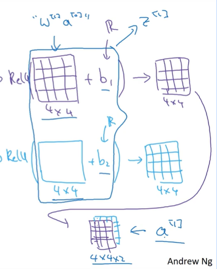

The convolution is really applying a linear operation and you add the biases and the applied value operation. And you've gone from a 6 by 6 by 3, dimensional $a^{[0]}$, through one layer of neural network toa 4 by 4 by 2 dimensional $a^{[1]}$ and so that is one layer of convolutional net.

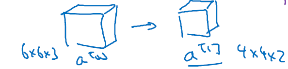

In this example we have two filters, so we had two features, which is why we wound up with our output 4 by 4 by 2. But if for example we instead had 10 filters instead of 2, then we would have wound up with the 4 by 4 by 10 dimensional output volume. Because we'll be taking 10 of these naps not just two of them, and stacking them up to form a 4 by 4 by 10 output volume, and that's what $a^{[1]}$ would be. 

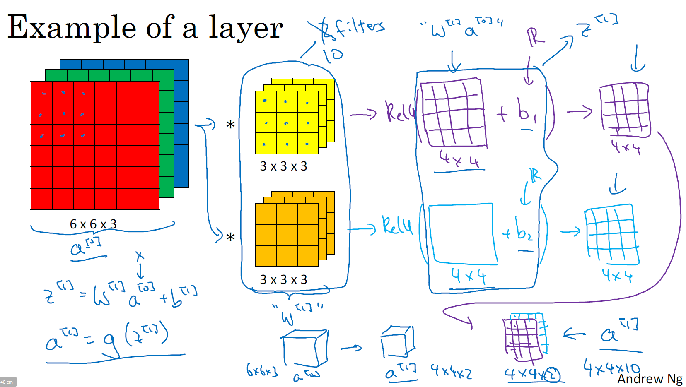

### Number of parameters in one layer
If you have 10 filters that are 3 x 3 x 3 in one layer of a neural network, how many parameters does that layer have?

Each filter, is a 3 x 3 x 3 volume, so each fill has 27 parameters. There's 27 numbers to be run, and plus the bias. So that was the b parameter, so this gives you 28 parameters.

Then if you imagine that you actually have ten filters, then all together you'll have 28 times 10, so that will be 280 parameters. 

Notice one nice thing about this, is that no matter how big the input image is, the input image could be 1,000 by 1,000 or 5,000 by 5,000, but the number of parameters you have still remains fixed as 280. And you can use these ten filters to detect features, vertical edges, horizontal edges maybe other features anywhere even in a very, very large image is just a very small number of parameters.

This is really one property of convolution neural network that makes less prone to overfitting. So once you've learned 10 feature detectors that work, you could apply this even to large images. And the number of parameters still is fixed and relatively small, as 280 in this example. 

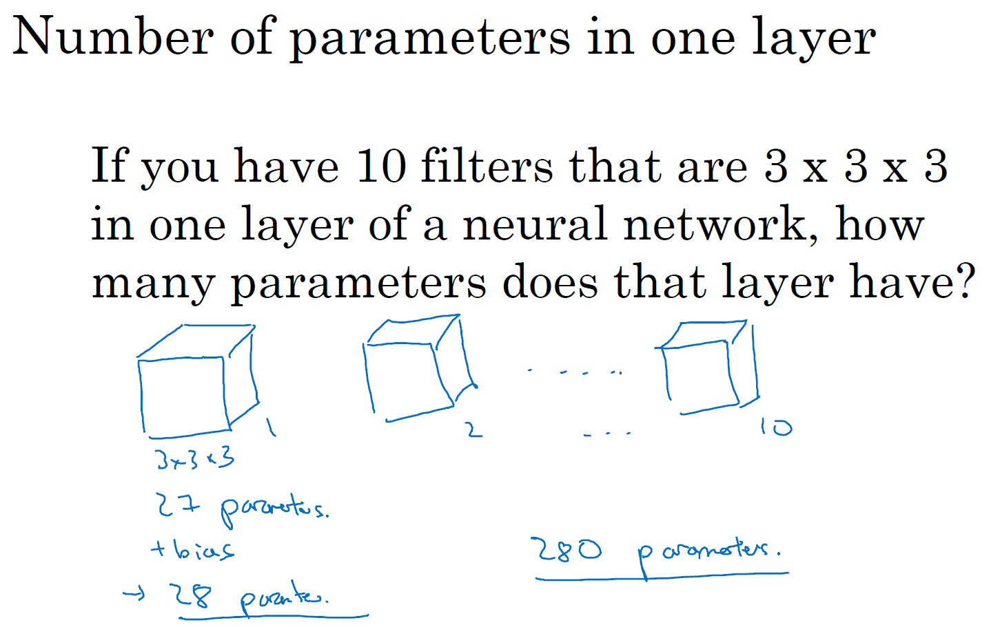

### Summary of notation
To wrap up this video let's just summarize the notation we are going to use to describe 1 layer to describe a covolutional layer in a convolutional neural network.

If layer l is a convolution layer:
* $f^{[l]}$=filter size. Previously we've been seeing the filters are f by f, and now this $f^{[l]}$ just denotes that this is a filter size of f by f filter layer l. And as usual the superscript square bracket l is the notation we're using to refer to particular layer l.
* $p^{[l]}$=padding. The amount of padding can also be specified just by saying that you want a valid convolution, which means no padding, or a same convolution which means you choose the padding. So that the output size has the same height and width as the input size.
* $s^{[l]}$=stride

* Input: $n^{[l-1]}_H$ by $n^{[l-1]}_W$ by $n_C^{[l-1]}$ dimension. l-1 because that's the activation from the previous layer l-1. In case of height and width are different, superscript H and superscript W are used to denot the height and width of the input of the privous layer. So for layer l, the size of the volume will be $n^{[l-1]}_H$ by $n^{[l-1]}_W$ by $n_C^{[l-1]}$
* Output of NN: $n^{[l]}_H$ by $n^{[l]}_W$ by $n_C^{[l]}$
* Whereas we approve this set that the output volume size or at least the height and weight is given by this formula, $\lfloor {{n + 2p - f} \over s} + 1 \rfloor$, and then take the full of that and round it down. 
  * In this new notation what we have is that the outputs value that's in layer l is 
  $n^{[l]}_H=\lfloor {{n^{[l-1]} + 2p^{[l]} - f^{[l]}} \over s^{[l]}} + 1 \rfloor$, 
  * Is going to be the dimension from the previous layer, plus the padding we're using in this layer l, minus the filter size we're using this layer l and so on.
  * Technically this is true for the height. So the height of the output volume is given by this, and the same is true for the width as well. So you cross out h and throw in w as well, then the same formula with either the height or the width plugged in for computing the height or width of the output volume. $n^{[l]}_W=\lfloor {{n^{[l-1]} + 2p^{[l]} - f^{[l]}} \over s^{[l]}} + 1 \rfloor$

That's how $n_H^{[l-1]}$ related to $n_H^{[l]}$ and $n_W^{[l-1]}$ related to $n_W^{[l]}$.

How about the number of channels, where did those numbers come from? 

If the output volume has $n_C^{[l]}$ depth, we know from the previous examples that that's equal to the number of filters we have in that layer. So we had two filters, the output value was 4 by 4 by 2, was 2 dimensional. And if you had 10 filters and your upper volume was 4 by 4 by 10. So, this the number of channels in the output value, that's just the number of filters we're using in this layer of the neural network $n_C^{[l]}$.

How about the size of this filter? 

Each filter is $f^{[l]}$ by $f^{[l]}$ by $n_C^{[l-1]}$. We saw that you needed to convolve a 6 by 6 by 3 image, with a 3 by 3 by 3 filter. And so the number of channels in your filter, must match the number of channels in your input, so this number should match that number. Which is why each filter is going to be  $f^{[l]}$ by $f^{[l]}$ by $n_C^{[l-1]}$. 

The output of this layer often apply devices in non-linearity, is going to be the activations of this layer $a^{[l]}$. And that we've already seen will be $n^{[l]}_H$ by $n^{[l]}_W$ by $n_C^{[l]}$ dimension.

When you are using a vectorized implementation or batch gradient descent or mini batch gradient descent, then you actually outputs $A^{[l]}$, which is a set of m activations, if you have m examples. So that would be m by $n^{[l]}_H$ by $n^{[l]}_W$ by $n_C^{[l]}$.

How about the weights or the parameters, or kind of the w parameter? 

We saw already what the filter dimension is. Filters are going to be

$f^{[l]}$ x $f^{[l]}$ x $n_C^{[l-1]}$

but that's the dimension of one filter.

How many filters do we have? Well, this is a total number of filters $n_C^{[l]}$, so the weights really all of the filters put together will have dimension given by 

$f^{[l]}$ x $f^{[l]}$ x $n_C^{[l-1]}$ x $n_C^{[l]}$

Because this last quantity is the number of filters in layer l. 

Then finally, you have the bias parameters, and you have one bias parameter, one real number for each filter. The bias will have $n_C^{[l]}$ variables, it's just a vector of $n_C^{[l]}$ dimension.

Although later on we'll see that the code will be more convenient represented as 1 by 1 by 1 by $n_C^{[l]}$ four dimensional matrix, or four dimensional tensor. 

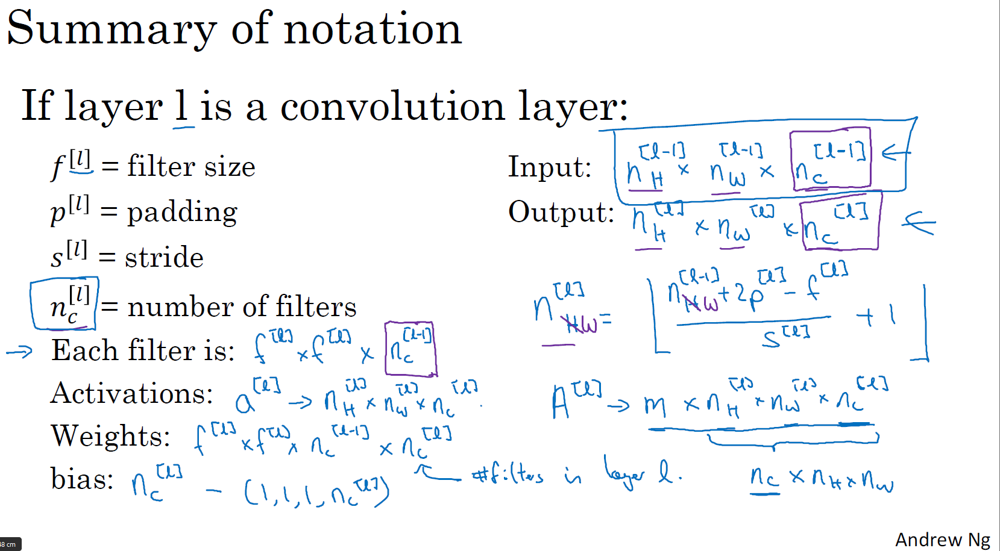

I just want to mention in case you search online and look at open source code. There isn't a completely universal standard convention about the ordering of height, width, and channel. 

If you look on source code on GitHub or these open source implementations, you'll find that some authors use this order instead, where you first put the channel first, and you sometimes see that ordering of the variables. 

$n_C$ x $n_H$ x $n_W$

In fact in some common frameworks, actually in multiple common frameworks, there's actually a variable or a parameter, when do you want to list the number of channels first, or list the number of channels last when indexing into these volumes. I think both of these conventions work okay, so long as you're consistent. 

Unfortunately maybe this is one piece of annotation where there isn't consensus in the deep learning literature but i'm going to use this convention for these videos where we list height and width and then the number of channels last. 

I know there was certainly a lot of new notations you could use, but you're thinking wow, that's a long notation, how do I need to remember all of these? Don't worry about it, you don't need to remember all of this notation, and through this week's exercises you become more familiar with it at that time.

The key point I hope you take a way from this video, is just one layer of how convolutional neural network works. And the computations involved in taking the activations of one layer and mapping that to the activations of the next layer.

## Simple Convolutional Network Example
### Example ConvNet
Let's say you have an image, and you want to do image classification, or image recognition. Where you want to take as input an image, X, and decide is this a cat or not, 0 or 1, so it's a classification problem.

Let's build an example of a ConvNet you could use for this task. For the sake of this example, I'm going to use a fairly small image 39x39x3. This choice just makes some of the numbers work out a bit better.

$n_H^{[0]}$ = $n_W^{[0]}$ = 39

$n_C^{[0]}$ = 3 (number of channel in layer 0 is 3)

First layer uses 3x3 filter to detect features.

$f^{[1]}$ = 3

$s^{[1]}$ = 1

$p^{[1]}$ = 0 means valid convolutions

Let's say we have 10 filters

Then the activations in the next layer of NN will be 37x37x10, number 10 comes from the fact that we use 10 filters.

37 comes from the formula:

${{n+2p-f} \over s}+1={{39+0-3} \over 1}+1=37$

$n_H^{[1]}$ = $n_W^{[1]}$ = 37

$n_C^{[1]}$ = 10 (number of filters in the first layer)

This is also the dimension of the activation at the first layer.

Let's say you now have another convolutional layer and let's say this time you use 5x5 filters.

$f^{[2]}$ = 5

$s^{[2]}$ = 2

$p^{[2]}$ = 0

20 filters

The output of this will be 17x17x20. Notice that, because you're now using a stride of 2, the dimension has shrunk much faster. 37 x 37 has gone down in size by slightly more than a factor of 2, to 17 x 17. And because you're using 20 filters, the number of channels now is 20. So it's this activation $a^{[2]}$ would be that dimension 

$n_H^{[2]}$ = $n_W^{[2]}$ = 17

$n_C^{[2]}$ = 20

Let's apply one last convolutional layer. So let's say that you use a 5x5 filter again, and again, a stride of 2. 

$f^{[3]}$ = 5

$s^{[3]}$ = 2

40 filters

No padding

You end up with 7 x 7 x 40.

What you've done is taken your 39 x 39 x 3 input image and computed your 7 x 7 x 40 features for this image. 

Then finally, what's commonly done is if you take this 7 x 7 x 40, 7 times 7 times 40 is actually 1,960. What we can do is take this volume and flatten it or unroll it into just 1,960 units. Just flatten it out into a vector, and then feed this to a logistic regression unit, or a softmax unit. Depending on whether you're trying to recognize cat or no cat or trying to recognize any one of key different objects and then just have this give the final predicted output for the neural network. 


This last step is just taking all of these numbers, all 1,960 numbers, and unrolling them into a very long vector. So then you just have one long vector that you can feed into softmax until it's just a regression in order to make prediction for the final output.

This would be a pretty typical example of a ConvNet. A lot of the work in designing convolutional neural net is selecting hyperparameters like these, deciding what's the total size? What's the stride? What's the padding and how many filters are used?

One thing to take away from this is that as you go deeper in a neural network, typically you start off with larger images, 39 by 39. Then the height and width will stay the same for a while and gradually trend down as you go deeper in the neural network. It's gone from 39 to 37 to 17 to 7. Whereas the number of channels will generally increase. It's gone from 3 to 10 to 20 to 40, and you see this general trend in a lot of other convolutional neural networks as well.

### Types of layer in a convolutional network:
* Convolution layer (CONV)
* Pooling (POOL)
* Fully connected (FC)

Although it's possible to design a pretty good neural network using just convolutional layers, most neural network architectures will also have a few pooling layers and a few fully connected layers.

Fortunately pooling layers and fully connected layers are a bit simpler than convolutional layers to define.

## Pooling layers
Other than convolutional layers, ConvNets often also use pooling layers to reduce the size of the representation, to speed the computation, as well as make some of the features that detects a bit more robust.
### Pooling layer: Max pooling
Suppose you have a four by four input, and you want to apply a type of pooling called max pooling. 

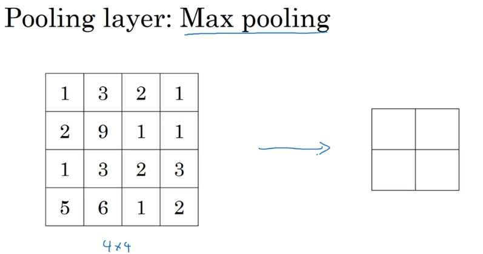

The output of this particular implementation of max pooling will be a two by two output. And the way you do that is quite simple.

Take your four by four input and break it into different regions and I'm going to color the four regions as follows.

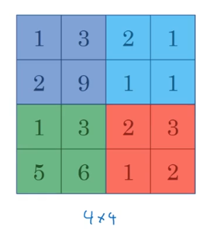

Then, in the output, which is 2 by 2, each of the outputs will just be the max from the corresponding reshaded region. 

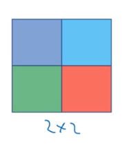

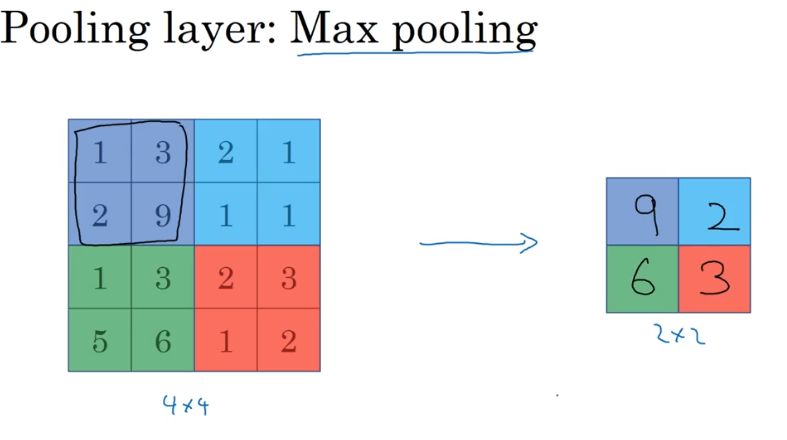

To compute each of the numbers on the right, we took the max over a 2 by 2 regions. This is as if you apply a filter size of 2 because you're taking a 2 by 2 regions and you're taking a stride of 2.

f = 2

s = 2

These are actually the hyperparameters of max pooling because we start from this filter size.

It's like a 2x2 region that gives you the 9. And then, you step all over 2 steps to look at this region, to give you the 2, and then for the next row, you step it down 2 steps to give you the 6, and then step to the right 2 two steps to give you three.

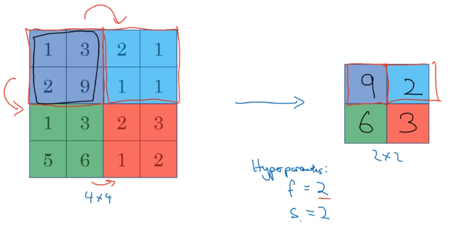

Because the squares are 2x2, f=2, and because you stride by 2, s=2.

The intuition behind what max pooling is doing. If you think of this 4x4 region as some set of features, the activations in some layer of the neural network, then a large number, it means that it's maybe detected a particular feature. The upper left-hand quadrant has this particular feature. It maybe a vertical edge or maybe a higher or whisker if you trying to detect a cat. Clearly, that feature exists in the upper left-hand quadrant.

Whereas this feature in blue, maybe it isn't cat eye detector. Whereas this feature, it doesn't really exist in the upper right-hand quadrant.

What the max operation does is a lots of features detected anywhere, and one of these quadrants, it then remains preserved in the output of max pooling.

What the max operates to does is really to say, if these features detected anywhere in this filter, then keep a high number. But if this feature is not detected, so maybe this feature doesn't exist in the upper right-hand quadrant. Then the max of all those numbers is still itself quite small. 

I think the main reason people use max pooling is because it's been found in a lot of experiments to work well, and the intuition I just described, despite it being often cited, I don't have anyone knows if that's the real underlying reason that max pooling works well in ConvNets.

One interesting property of max pooling is that it has a set of hyperparameters but it has no parameters to learn. There's actually nothing for gradient descent to learn. Once you fix f and s, it's just a fixed computation and gradient descent doesn't change anything.

Let's go through an example with some different hyperparameters.

Here, I am going to use, sure you have a 5x5 input and we're going to apply max pooling with a filter size that's 3x3. 

f = 3

s = 1

In this case, the output size is going to be 3x3.

The formulas we had developed in the previous videos for figuring out the output size for conv layer, those formulas also work for max pooling.

That's $\lfloor{{{n+2p-f} \over s}+1} \rfloor$. That formula also works for figuring out the output size of max pooling. 

In this example, let's compute each of the elements of this 3x3 output. 

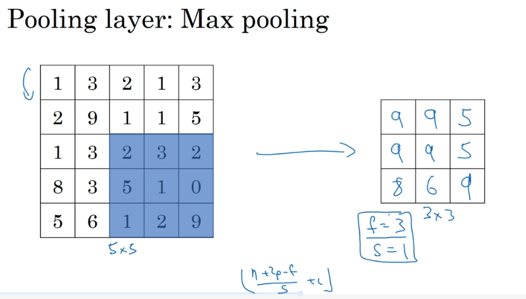

If you have a 3D input, then the outputs will have the same dimension. 

For example, if you have 5x5x2, then the output will be 3x3x2 and the way you compute max pooling is you perform the computation we just described on each of the channels independently.

The first channel which is shown here on top is still the same, and then for the second channel, I guess, this one that I just drew at the bottom, you would do the same computation on that slice of this value and that gives you the second slice. 

More generally, if this was five by five by some number of channels, the output would be three by three by that same number of channels.

The max pooling computation is done independently on each of these $n_C$ channels. 

### Pooling layer: Average pooling
There is one of the type of pooling that isn't used very often, but I'll mention briefly which is average pooling. 

It does pretty much what you'd expect which is, instead of taking the maxes within each filter, you take the average. 

In this example, the average of the numbers in purple is 3.75, then there is 1.25, and 4 and 2. 

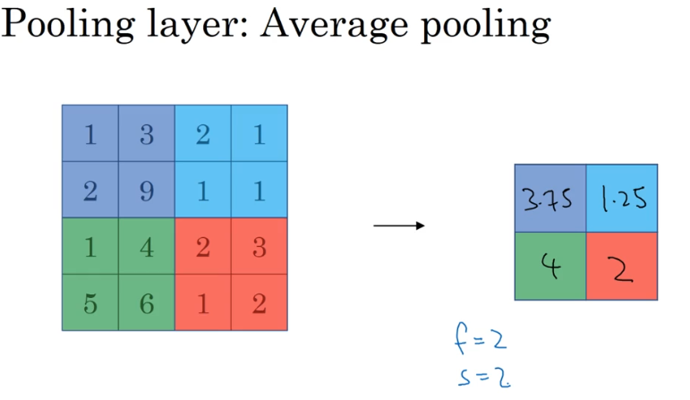

This is average pooling with hyperparameters 

f=2

s=2

we can choose other hyperparameters as well. 

These days, max pooling is used much more often than average pooling with one exception, which is sometimes very deep in a neural network, you might use average pooling to collapse your representation from say, 7 by 7 by 1,000 and average over all the spacial sense, you get 1 by 1 by 1,000.

### Summary of pooling
Hyperparameters:
* f : filter size
* s : stride
* Max or average pooling

Common choices of parameters might be f=2, s=2.

This is used quite often and this has the effect of roughly shrinking the height and width of the representation by a factor of above 2.

I've also seen f=3, s=2 used, and then the other hyperparameter is just like a binary bit that says, are you using max pooling or are you using average pooling.

If you want, you can add an extra hyperparameter for the padding although this is very, very rarely used. When you do max pooling, usually, you do not use any padding, although there is one exception that we'll see next week as well. But for the most parts of max pooling, usually, it does not use any padding. So, the most common value of p by far is p=0.

The input of max pooling is that you input a volume of size $n_H$ by $n_W$ by $n_C$, and it would output a volume of size given by 

$\lfloor{{{n_H-f} \over s}+1} \rfloor$ by $\lfloor{{{n_W-f} \over s}+1} \rfloor$ by $n_C$

Assuming there's no padding.

The number of input channels is equal to the number of output channels because pooling applies to each of your channels independently.

**One thing to note about pooling is that there are no parameters to learn.**

When we implement back prop, you find that there are no parameters that backprop will adapt through max pooling. Instead, there are just these hyperparameters that you set once, maybe set once by hand or set using cross-validation. And then beyond that, you are done. Its just a fixed function that the neural network computes in one of the layers, and there is actually nothing to learn. It's just a fixed function.

## Convolutional neural network example
### Neural network example
Let's say you're inputting an image which is 32 x 32 x 3, so it's an RGB image and maybe you're trying to do handwritten digit recognition.

You have a number like 7 in a 32 x 32 RGB initiate trying to recognize which one of the 10 digits from zero to nine is this. 

Let's build the neural network to do this. And what I'm going to use in this slide is inspired, it's actually quite similar to one of the classic neural networks called LeNet-5, which is created by Yann LeCun many years ago. 

I'll show here isn't exactly LeNet-5 but it's inspired by it, but many parameter choices were inspired by it.

Let's say that the first layer uses a 5 x 5 filter and a stride of 1, and no padding. 

The output of this layer, if you use 6 filters would be 28 x 28 x 6, and we're going to call this layer conv 1. So you apply 6 filters, add a bias, apply the non-linearity, maybe a real non-linearity, and that's the conv 1 output.

Next, let's apply a pooling layer, so I am going to apply max pooling here and let's use a f=2, s=2. I don't write a padding use a pad easy with a 0.

Next let's apply a pooling layer, I am going to apply, let's see max pooling with a 2 x 2 filter and the stride equals 2. So this is should reduce the height and width of the representation by a factor of 2. So 28 x 28 now becomes 14 x 14, and the number of channels remains the same so 14 x 14 x 6, and we're going to call this the Pool 1 output.

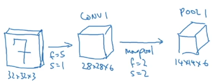

It turns out that in the literature of a ConvNet there are two conventions which are inside the inconsistent about what you call a layer.

One convention is that this is called one layer.

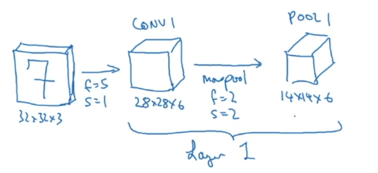

Another conversion will be to call they conv layer as a layer and the pool layer as a layer.

When people report the number of layers in a neural network usually people just record the number of layers that have weight, that have parameters. And because the pooling layer has no weights, has no parameters, only a few hyper parameters, I'm going to use a convention that Conv 1 and Pool 1 shared together. I'm going to treat that as Layer 1, although sometimes you see people if you read articles online and read research papers, you hear about the conv layer and the pooling layer as if they are two separate layers. But this is maybe two slightly inconsistent notation terminologies, but when I count layers, I'm just going to count layers that have weights. So we treat both of these together as Layer 1.

The name Conv1 and Pool1 use here the 1 at the end also refers the fact that I view both of this is part of Layer 1 of the neural network. Pool 1 is grouped into Layer 1 because it doesn't have its own weights.

Next, given a 14 x 14 x 6 volume, let's apply another convolutional layer to it, let's use a filter size that's 5 x 5, and let's use a stride of 1, and let's use 10 filters this time. So now you end up with, a 10 x 10 x 10 volume, so I'll call this Conv 2, and then in this network let's do max pooling with f=2, s=2 again. So you could probably guess the output of this, f=2, s=2 this should reduce the height and width by a factor of 2, so you're left with 5 x 5 x 10. I'm going to call this Pool 2, and in our convention this is Layer 2 of the neural network.

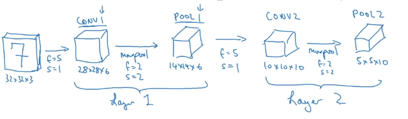

Now let's apply another convolutional layer to this. I'm going to use a 5 x 5 filter, so f = 5, and let's try this, 1, and I don't write the padding, means there's no padding. And this will give you the Conv 2 output, and that's your 16 filters. So this would be a 10 x 10 x 16 dimensional output. So we look at that, and this is the Conv 2 layer. And then let's apply max pooling to this with f=2, s=2. You can probably guess the output of this, we're at 10 x 10 x 16 with max pooling with f=2, s=2. This will half the height and width, you can probably guess the result of this. Max pooling with f = 2, s = 2. This should halve the height and width so you end up with a 5 x 5 x 16 volume, same number of channels as before. We're going to call this Pool 2. And in our convention this is Layer 2 because this has one set of weights and your Conv 2 layer.

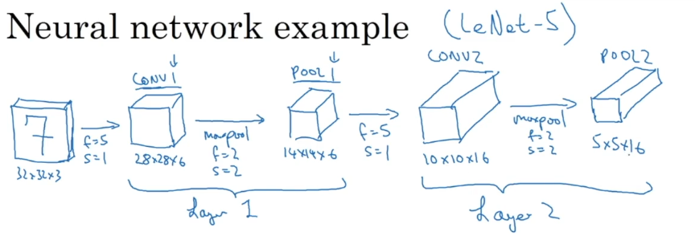

Now 5 x 5 x 16, 5 x 5 x 16 is equal to 400.

Let's now fatten our Pool 2 into a 400 x 1 dimensional vector. So think of this as fatting this up into these set of neurons, like so. 

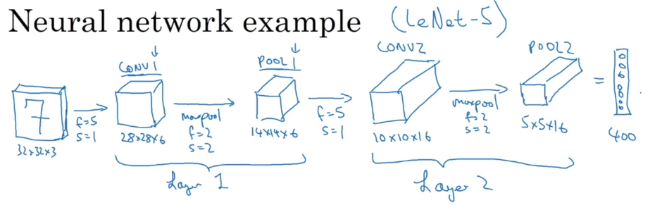

What we're going to do is then take these 400 units and let's build the next layer, as having 120 units.

This is actually our first fully connected layer. I'm going to call this FC3 because we have 400 units densely connected to 120 units.

This fully connected unit, this fully connected layer is just like the single neural network layer that you saw in Courses 1 and 2. This is just a standard neural network where you have a weight matrix that's called $W^{[3]}$ of dimension 120 x 400. 

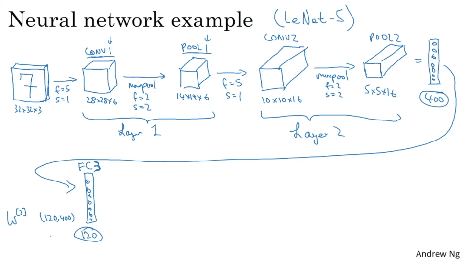

This is fully connected because each of the 400 units here is connected to each of the 120 units here, and you also have the bias parameter, that's going to be just a 120 dimensional, this is 120 outputs.

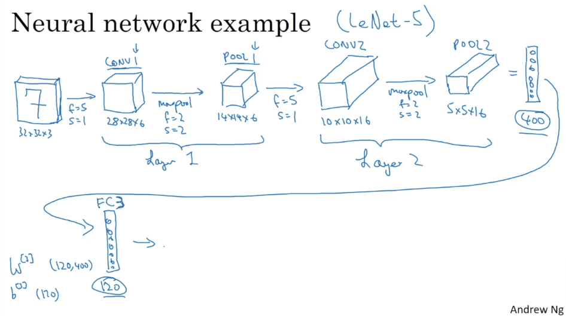

Then lastly let's take 120 units and add another layer, this time smaller but let's say we had 84 units here, I'm going to call this fully connected Layer 4.

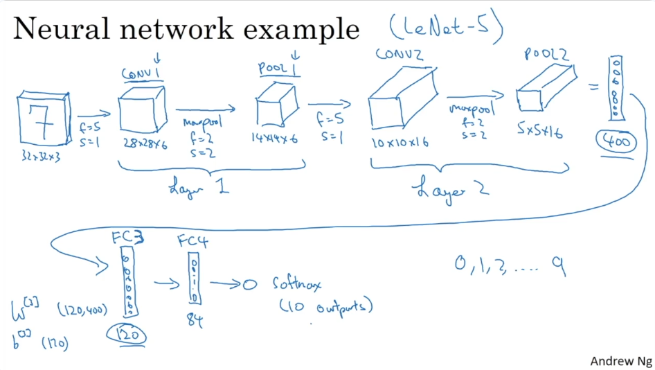

Finally we now have 84 real numbers that you can feed to a softnax unit. And if you're trying to do handwritten digital recognition, to recognize this hand it is 0, 1, 2, and so on up to 9. Then this would be a softmax with 10 outputs.

One common guideline is to actually not try to invent your own settings of hyper parameters, but to look in the literature to see what hyper parameters you work for others. And to just choose an architecture that has worked well for someone else, and there's a chance that will work for your application as well.

I'll just point out that as you go deeper in the neural network, usually $n_H$ and $n_W$ to height and width will decrease. Pointed this out earlier, but it goes from 32 x 32, to 20 x 20, to 14 x 14, to 10 x 10, to 5 x 5. So as you go deeper usually the height and width will decrease, whereas the number of channels will increase. It's gone from 3 to 6 to 16, and then your fully connected layer is at the end.

Another pretty common pattern you see in neural networks is to have conv layers, maybe one or more conv layers followed by a pooling layer, and then one or more conv layers followed by pooling layer. And then at the end you have a few fully connected layers and then followed by maybe a softmax. This is another pretty common pattern you see in neural networks. 

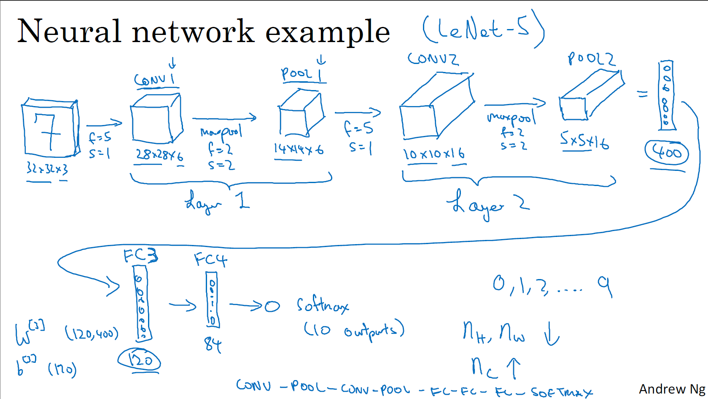

Let's just go through for this neural network some more details of what are the activation shape, the activation size, and the number of parameters in this network.

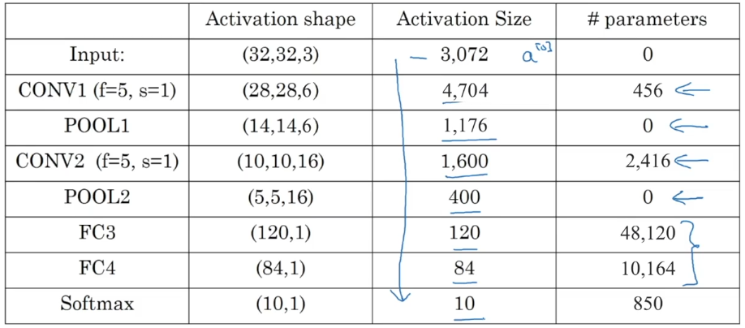

* First, notice that the max pooling layers don't have any parameters.
* Second, notice that the conv layers tend to have relatively few parameters, as we discussed in early videos.
* Then you notice also that the activation size tends to maybe go down gradually as you go deeper in the neural network. If it drops too quickly, that's usually not great for performance as well. So it starts first there with 6,000 and 1,600, and then slowly falls into 84 until finally you have your Softmax output.
* You find that a lot of will have properties will have patterns similar to these.

## Why Convolutions?
There are 2 main advantages of convolutional layers over fully connected layers:
* Parameter sharing
* Sparsity of connections

Let's say you have a 32 by 32 by 3 dimensional image, and this actually comes from the example from the previous video, but let's say you use five by five filter with six filters. And so, this gives you a 28 by 28 by 6 dimensional output.

f=6

This gives you a 28 by 28 by 6 dimensional output.

32 by 32 by 3 is 3,072, and 28 by 28 by 6 if you multiply all those numbers is 4,704. And so, if you were to create a neural network with 3,072 units in one layer, and with 4,704 units in the next layer, and if you were to connect every one of these neurons, then the weight matrix, the number of parameters in a weight matrix would be 3,072 times 4,704 which is about 14 million. 

That's just a lot of parameters to train.

Today you can train neural networks with even more parameters than 14 million, but considering that this is just a pretty small image, this is a lot of parameters to train. If this were to be 1,000 by 1,000 image, then your display matrix will just become invisibly large.

If you look at the number of parameters in this convolutional layer, each filter is 5 by 5. So, each filter has 25 parameters, plus a bias parameter miss of 26 parameters per a filter, and you have six filters, so, the total number of parameters is equal to 156 parameters.

The number of parameters in this conv layer remains quite small.

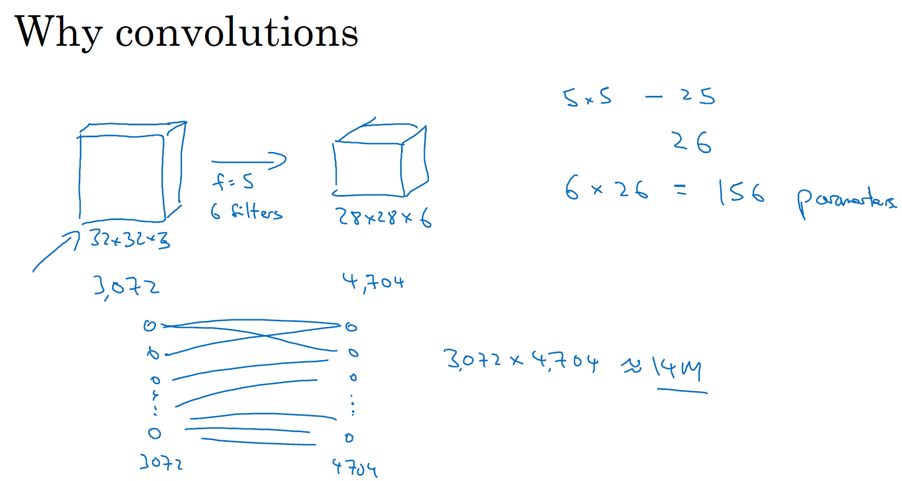

The reason that a convnet has run to these small parameters is really two reasons.
* One is parameter sharing.
  * Parameter sharing is motivated by the observation that feature detector such as vertical edge detector, that's useful in one part of the image is probably useful in another part of the image.
  * What that means is that, if you've figured out say a three by three filter for detecting vertical edges, you can then apply the same three by three filter over here, and then the next position over, and the next position over, and so on. And so, each of these feature detectors, each of these outputs can use the same parameters in lots of different positions in your input image in order to detect say a vertical edge or some other feature.
  * I think this is true for low-level features like edges, as well as the higher level features, like maybe, detecting the eye that indicates a face or a cat or something there.
  * Being with a share in this case the same 9 parameters to compute all 16 of these outputs, is one of the ways the number of parameters is reduced.
  * It also just seems intuitive that a feature detector like a vertical edge detector computes it for the upper left-hand corner of the image. The same feature seems like it will probably be useful, has a good chance of being useful for the lower right-hand corner of the image. So, maybe you don't need to learn separate feature detectors for the upper left and the lower right-hand corners of the image.
  * Maybe you do have a dataset where you have the upper left-hand corner and lower right-hand corner have different distributions, so, they maybe look a little bit different but they might be similar enough, they're sharing feature detectors all across the image, works just fine.

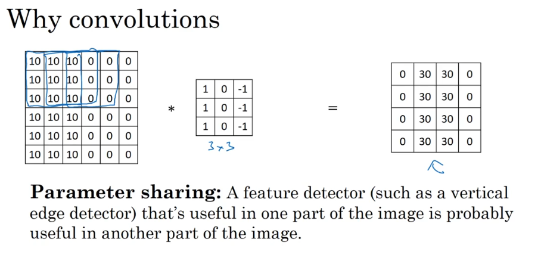

* The second way that convnet get away with having relatively few parameters is by having sparse connections.
  * If you look at the zero, this is computed via three by three convolution. It depends only on this three by three inputs grid or cells. So, it is as if this output units on the right is connected only to 9 out of these 6 by 6, 36 input features.
  * In particular, the rest of these pixel values, all of these pixel values do not have any effects on the other output. So, that's what I mean by sparsity of connections

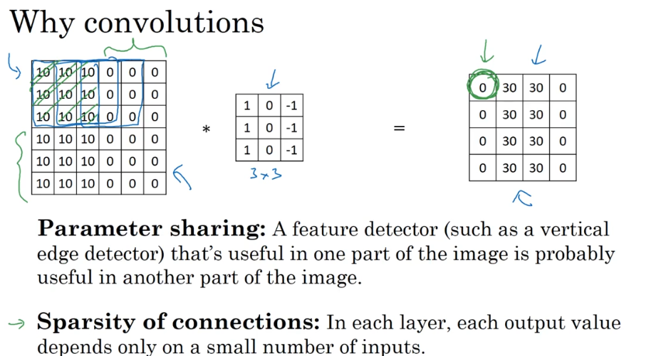

  * As another example, this output depends only on these nine input features. And so, it's as if only those nine input features are connected to this output, and the other pixels just don't affect this output at all.

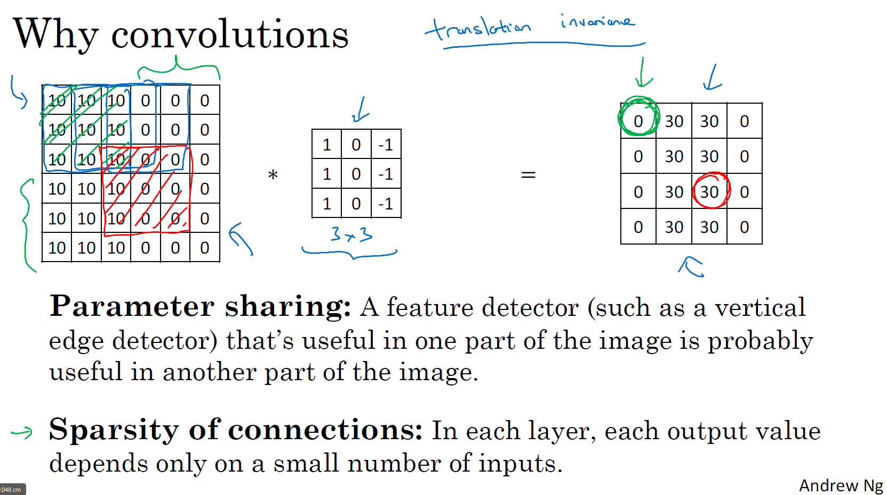

Through these two mechanisms, a neural network has a lot fewer parameters which allows it to be trained with smaller training sets and is less prone to be overfitting.

Sometimes you also hear about convolutional neural networks being very good at capturing translation invariance. That's the observation that a picture of a cat shifted a couple of pixels to the right, is still pretty clearly a cat.

Convolutional structure helps the neural network encode the fact that an image shifted a few pixels should result in pretty similar features and should probably be assigned the same output label.

The fact that you are applying to same filter to all the positions of the image, both in the early layers and in the later layers that helps a neural network automatically learn to be more robust or to better capture the desirable property of translation invariance.

These are maybe a couple of the reasons why convolutions or convolutional neural network work so well in computer vision. 

### Putting it together
Let's say you want to build a cat detector and you have a labeled training sets as follows, where now, X is an image. 

Training set $(x^{(1)}, y^{(1)})... (x^{(m)}, y^{(m)})$

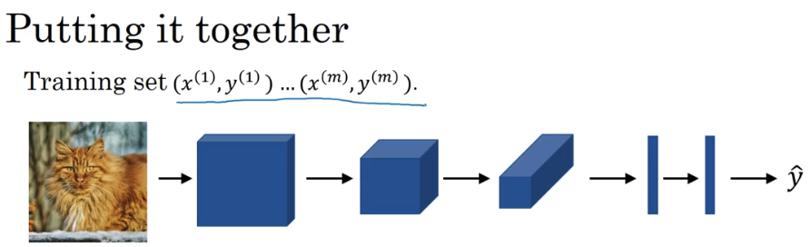

Y's can be binary labels, or one of K classes.

Let's say you've chosen a convolutional neural network structure, may be inserted the image and then having neural convolutional and pooling layers and then some fully connected layers followed by a software output that then operates Y hat.

The conv layers and the fully connected layers will have various parameters, W, as well as bias's b.

Any setting of the parameters, therefore, lets you define a cost function similar to what we have seen in the previous courses, where we've randomly initialized parameters W and b. You can compute the cause J, as the sum of losses of the neural networks predictions on your entire training set, maybe divide it by m.

To train this neural network, all you need to do is then use gradient descents or some of the algorithm like, gradient descent momentum, or RMSProp or Adam, or something else, in order to optimize all the parameters of the neural network to try to reduce the cost function J. And you find that if you do this, you can build a very effective cat detector or some other detector. 

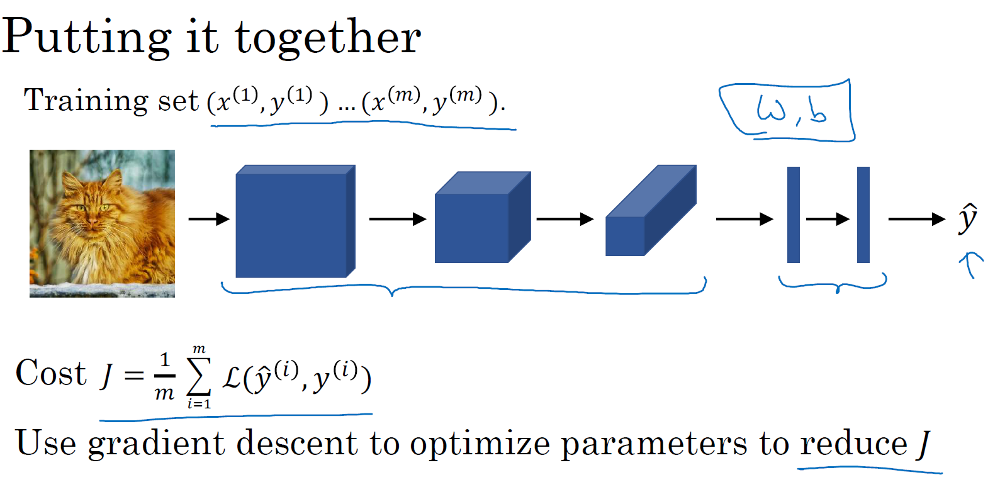


