# Week 2: Deep Convolutional Models: Case Studies

**Learning Objectives**
* Implement the basic building blocks of ResNets in a deep neural network using Keras
* Train a state-of-the-art neural network for image classification
* Implement a skip connection in your network
* Create a dataset from a directory
* Preprocess and augment data using the Keras Sequential API
* Adapt a pretrained model to new data and train a classifier using the Functional API and MobileNet
* Fine-tine a classifier's final layers to improve accuracy

- [Week 2: Deep Convolutional Models: Case Studies](#week-2-deep-convolutional-models-case-studies)
  - [Why look at case studies?](#why-look-at-case-studies)
  - [Classic Networks](#classic-networks)
    - [LeNet-5 Architecture (1998)](#lenet-5-architecture-1998)
    - [AlexNet Architecture (2012)](#alexnet-architecture-2012)
    - [VGG-16 Architecture (2014)](#vgg-16-architecture-2014)
  - [ResNets](#resnets)
  - [Why ResNets Work?](#why-resnets-work)
    - [Why do residual networks work?](#why-do-residual-networks-work)
    - [ResNets](#resnets-1)
  - [Networks in Networks and 1x1 Convolutions](#networks-in-networks-and-1x1-convolutions)
  - [Inception Network Motivation](#inception-network-motivation)
    - [The problem of computational cost](#the-problem-of-computational-cost)
    - [Using 1×1 convolution](#using-11-convolution)
  - [Inception Network](#inception-network)
    - [Inception module](#inception-module)
    - [Inception network](#inception-network-1)
  - [MobileNet](#mobilenet)
    - [Motivation for MobileNets](#motivation-for-mobilenets)
    - [Normal Convolution](#normal-convolution)
    - [Depthwise Separable Convolution](#depthwise-separable-convolution)
    - [Example](#example)
  - [MobileNet Architecture](#mobilenet-architecture)
    - [MobileNet v1](#mobilenet-v1)
    - [MobileNet v2](#mobilenet-v2)
      - [Example MobileNet v2 Bottleneck Block](#example-mobilenet-v2-bottleneck-block)
      - [Why Bottleneck?](#why-bottleneck)
      - [Residual connection](#residual-connection)
      - [Visualizing MobileNet v2 Block](#visualizing-mobilenet-v2-block)
      - [Why bottleneck + residual?](#why-bottleneck--residual)
  - [EfficientNet](#efficientnet)
  - [Using Open-Source Implementation](#using-open-source-implementation)
  - [Transfer Learning](#transfer-learning)
  - [Data augmentation](#data-augmentation)
  - [The state of computer vision](#the-state-of-computer-vision)
    - [Data vs. hand-engineering](#data-vs-hand-engineering)
    - [Tips for doing well on benchmarks/winning competitions](#tips-for-doing-well-on-benchmarkswinning-competitions)
    - [Use open source code](#use-open-source-code)


## Why look at case studies?
The primary purpose of studying case studies is to gain intuition on how to build effective convolutional neural networks.
* Combining Building Blocks: You learned the basic components: convolutional layers, pooling layers, and fully connected layers. A significant part of recent computer vision research has focused on how to put these basic building blocks together to form effective architectures.
* Learning by Example: Gaining intuition on building ConvNets is comparable to learning to write code by reading other people's code.
* Architecture Reusability (Transferability): A network architecture that performs well on one computer vision task (e.g., recognizing cats and dogs) often performs well on others. If someone else has developed a successful architecture, you can frequently take that architecture and apply it to your specific problem (like building a self-driving car).
* Understanding Research: After reviewing these examples, you should be able to read and understand some of the seminal computer vision research papers.

Classic Networks: The course will first examine a few foundational and effective neural networks:
1. LeNet-5: A classic network originating around the 1980s.
2. AlexNet: An architecture that is frequently cited in the field.
3. VGG Network.

Deep and Advanced Networks: The videos will then explore more advanced techniques used to build very deep networks:
* ResNet (Residual Network): This network addresses the trend of neural networks becoming progressively deeper.
    * The case study involves a ResNet that trained a remarkably deep 152-layer neural network.
    * It utilizes interesting tricks and ideas to accomplish effective training at such depths.
* Inception Neural Network: Another significant case study that will be reviewed.

Broader Impact
* Even if you do not specialize in computer vision applications, studying these architectures remains highly beneficial:
* The ideas from networks like ResNet and the Inception network are "cross-fertilizing" and are currently making their way into many other disciplines outside of computer vision. You may find these concepts helpful for your work regardless of your specific field

## Classic Networks
### LeNet-5 Architecture (1998)
LeNet-5 was one of the earliest successful Convolutional Neural Networks (CNNs).

Overview
* Goal: Primarily designed to recognize handwritten digits (0 through 9).
* Input: Started with small, grayscale images: 32x32x1.
* Scale: Small by modern standards, featuring about 60,000 parameters. (Today's networks often have 10 million to 100 million parameters, sometimes 1,000 times larger).
* Output: Historically used a specialized classifier; a modern variant would use a Softmax layer for 10-way classification.
* Historical Note: Back then, researchers used sigmoid and tanh nonlinearities instead of ReLU. Convolutional layers typically used valid convolutions (no padding), causing the height and width to shrink after every Conv layer.
  * Because back then, computers were much slower. And so to save on computation as well as some parameters, the original LeNet-5 had some crazy complicated way where different filters would look at different channels of the input block. And so the paper talks about those details, but the more modern implementation wouldn't have that type of complexity these days.
  * The original LeNet-5 had a non-linearity after pooling, and I think it actually uses sigmoid non-linearity after the pooling layer. 

LeNet-5 Architecture Details
|Layer Type |Filters / Stride / Padding |Input Volume |Output Volume (Features) |Notes |
|-|-|-|-|-|
|Input| N/A |32x32x1 |32x32x1 |Grayscale image of a digit|
|C1 (Conv) |Six 5x5 filters, Stride 1, No padding (Valid) |32x32x1 |28x28x6 |Filter count increases the channel dimension|
|P1 (Pool) |Average pooling (2x2 filter, Stride 2) |28x28x6 |14x14x6 |Height/width reduced by a factor of two. Modern networks would likely use Max Pooling.|
|C2 (Conv) |Sixteen 5x5 filters, No padding (Valid) |14x14x6 |10x10x16 |Filter count increases the channel dimension|
|P2 (Pool) |(2x2 filter, Stride 2) |10x10x16 |5x5x16 (400 nodes total) |Height/width reduced by a factor of two|
|FC1 |Fully Connected |400 nodes |120 neurons |Fully connects all 400 nodes to 120 neurons|
|FC2 |Fully Connected |120 neurons |84 neurons| |
|Output |Classification |84 features |10 outputs |Corresponds to digits 0–9|

As we go from left to right:
* Height $n_H$ and width $n_W$ tend to go down (32x32 to 28x14 to 10x5)
* Number of channels $n_C$ increase. (1 to 6 to 16)

Pattern in this NN:

1 or more Conv layer -> a Pool layer -> 1 or more Conv layer -> a Pool layer -> FC -> FC -> output

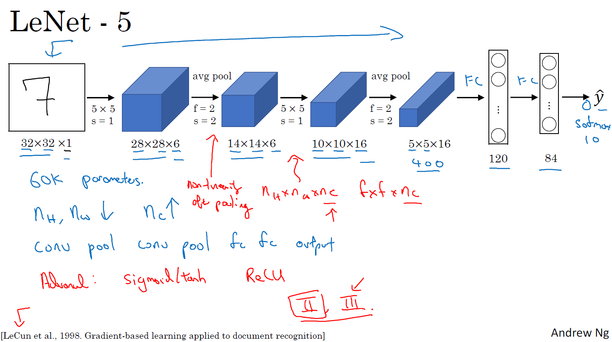

### AlexNet Architecture (2012)
AlexNet, named after Alex Krizhevsky (the first author), was a landmark paper that convinced the computer vision community of the power of deep learning.
Overview
* Input: Starts with larger images: 227x227x3 (RGB image).
* Scale: Much larger than LeNet-5, with about 60 million parameters.
* Key Innovations:
    * Used the ReLU activation function, which significantly improved performance over older activation functions like sigmoid/tanh.
    * Trained on the massive ImageNet dataset.
    * The fact that they could take pretty similar basic building blocks that have a lot more hidden units and training on a lot more data, they trained on the image that dataset that allowed it to have a just remarkable performance. 
* Output: Uses Softmax to classify objects into one of 1,000 classes.
* Historical Notes: The original architecture was complex due to hardware limitations at the time. It was split across two GPUs. It also included a layer called Local Response Normalization (LRN), which is generally not used today as researchers found it doesn't help much.

AlexNet Architecture Details

AlexNet used a very large first convolutional layer and large strides to quickly shrink the spatial dimensions.

|Layer Type |Filters / Stride / Padding |Input Volume |Output Volume (Features) |Notes |
|-|-|-|-|-|
|Input |N/A |227x227x3 |227x227x3 |RGB image|
|C1 (Conv) |96 filters, 11x11, Stride 4 |227x227x3 |55x55x96 |Large stride causes a rapid dimension reduction|
|P1 (Pool) |Max Pooling (3x3 filter, Stride 2) |55x55x96 |27x27x96| |
|C2 (Conv) |5x5 filter, Same convolution (with padding) |27x27x96 |27x27x276| |
|P2 (Pool) |Max Pooling |27x27x276 |13x13x276 (Reduced height/width)| |
|C3 (Conv) | 384 filters, Same convolution | 13x13x276 | 13x13x384 | | 
|C4 (Conv) |3x3 filter, Same convolution |13x13x384 |13x13x384| |
|C5 (Conv) |3x3 filter, Same convolution |13x13x384 |13x13x256| |
|P3 (Pool) |Max Pooling (3x3 filter, Stride 2) |13x13x256 |6x6x256 (Volume size 9,216)| |
|FC |Fully Connected Layers |9,216 nodes |4096 nodes |Unrolled volume, followed by a few FC layers|
|FC |Fully Connected Layers |4096 nodes |4096 nodes ||
|Output |Softmax |4096 features |1,000 classes| |

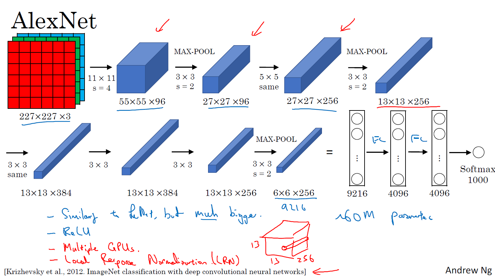

### VGG-16 Architecture (2014)
The VGG network (or VGGNet) emphasizes simplicity and uniformity over complex hyperparameter tuning, making its architecture highly systematic.
Overview
* Name: The '16' refers to the 16 layers that have trainable weights. (VGG-19 is a slightly larger variant).
* Scale: A very large network, totaling about 138 million parameters.
* Uniform Design Principles:
    1. Conv Layers: Always use 3x3 filters with a stride of 1 and same padding. This ensures the height and width remain constant through sequential Conv layers.
    2. Max Pooling Layers: Always use 2x2 filters with a stride of 2. This systematically reduces height and width by a factor of two.
    3. Channel Depth: The number of filters roughly doubles after each pooling step (e.g., 64, 128, 256, 512, 512).
* Advantages: Its uniformity made the architecture very attractive and easy to understand.
* Output: Uses Softmax to classify into 1,000 classes.
* The main downside was that it was a pretty large network in terms of the number of parameters you had to train. And if you read the literature, you sometimes see people talk about the VGG-19, that is an even bigger version of this network.
* Because VGG-16 does almost as well as VGG-19. A lot of people will use VGG-16. 
* The thing I liked most about this was that, this made this pattern of how, as you go deeper and height and width goes down, it just goes down by a factor of two each time for the pulling layers whereas the number of channels increases. And here roughly goes up by a factor of two every time you have a new set of conv-layers. So by making the rate at which it goes down and that go up very systematic, I thought this paper was very attractive from that perspective.

VGG-16 Architecture Details

The VGG structure involves stacks of 2 or 3 Conv layers followed by a single Max Pooling layer.


|Section |Layer Details |Filters (Channels)|Output Spatial Dimensions |Notes |
|-|-|-|-|-|
|Input |N/A |3 |224x224x3| |
|Block 1 | [CONV 64] x2 (3x3, same), | 64 | 224x224x64 | Two Conv 64 channels layers are used|
|Pool 1 |Max Pool (2x2, Stride 2) |64 |112x112x64 |Reduces spatial dimensions by half|
|Block 2 |[CONV 128] (3x3, same) x 2 |128 |112x112x128 |Filter count doubles|
|Pool 2 |Max Pool (2x2, Stride 2) |128 |56x56x128 (Calculated)| | 
|Block 3 |[CONV 256] (3x3, same) x 3 |256 |56x56x256 |Three Conv layers are used|
|Pool 3 |Max Pool (2x2, Stride 2) |256 |28x28x256 (Calculated)| |
|Block 4 |[CONV 512] (3x3, same) x 3 |512 |28x28x512| |
|Pool 4 |Max Pool (2x2, Stride 2) |512 |14x14x512 (Calculated)| |
|Block 5| [CONV 512] (3x3, same) x 3| 512| 14x14x512| |
|Pool 5 | Max Pool (2x2, Stride 2) | 512 | 7x7x512 | Final feature volume is 7x7x512|
|FC |Fully Connected Layers |4096 units |4096 units| |
|FC |Fully Connected Layers |4096 units |4096 units| |
|Output |Softmax |1000 classes |N/A| |

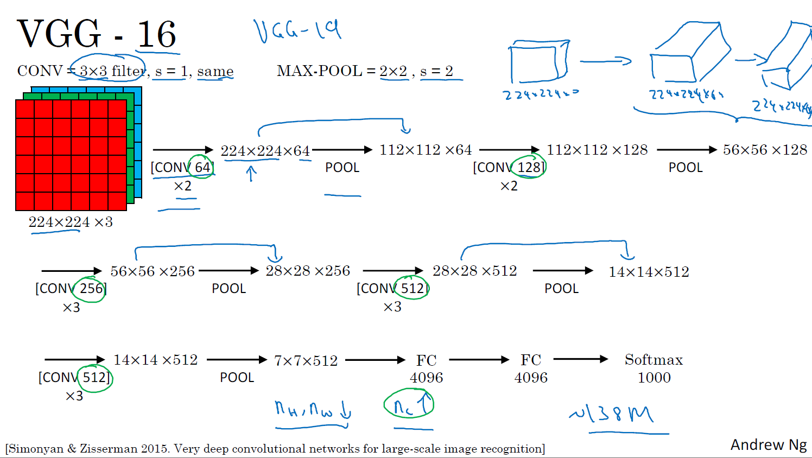

For reading: Start with AlexNet -> VGG -> LeNet

## ResNets
Residual Networks (ResNets) and Skip Connections

The Problem ResNets Solve

Challenge of Deep Networks: Training neural networks that are very deep (e.g., those with over 100 layers) is difficult because they suffer from the vanishing and exploding gradients problems.

The Solution: ResNets use skip connections (also called shortcuts) which allow activations from one layer to be fed directly into a much deeper layer.

1. The Residual Block (The Foundation of ResNets)
ResNets are built using repeated units called residual blocks. A residual block typically involves two layers where the main path is bypassed by a shortcut.

Structure of a Standard Two-Layer Block (Plain Path)

In a standard (non-residual) block, the information flows step-by-step:
1. Linear Step 1: Activation $A^{[l]}$ computes $Z^{[l+1]}$ (by multiplying $W^{[l+1]}$ and adding $b^{[l+1]}$).
2. Nonlinearity 1: $A^{[l+1]}$ is computed by applying the ReLU nonlinearity g to $Z^{[l+1]}$.
3. Linear Step 2: $Z^{[l+2]}$ is computed.
4. Nonlinearity 2: $A^{[l+2]}$ is computed by applying the ReLU nonlinearity g to $Z^{[l+2]}$.

Main Path: $A^{[l]}$ → $Z^{[l+1]}$ → $A^{[l+1]}$ → $Z^{[l+2]}$ → $A^{[l+2]}$

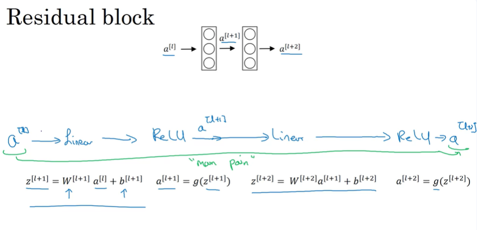

Structure of a Residual Block (Adding the Shortcut)

To create a residual block, we add the shortcut (skip connection):
* The initial activation $A^{[l]}$ is copied and "fast forwarded" further into the network.
* This $A^{[l]}$ is added to the main path before the final ReLU nonlinearity is applied at layer l+2.

Residual Path: $A^{[l+2]} = g(Z^{[l+2]}+A^{[l]})$

The addition of $A^{[l]}$ turns the two-layer segment into a residual block. This allows the information from $A^{[l]}$ to skip over almost two layers, going much deeper into the network without needing to follow the main path.

|Layer Operation (l to l+2)| Plain Block Output ($A^{[l+2]}$)| Residual Block Output ($A^{[l+2]}$)|
|-|-|-|
|Path| Must follow the main calculation steps.| Main Path Calculation + Shortcut.|
|Formula| $A^{[l+2]}=g(Z^{[l+2]})$ | $A^{[l+2]}=g(Z^{[l+2]}+A^{[l]})$|
|Injection Point| N/A| $A^{[l]}$ is injected after the linear part ($Z^{[l+2]}$) but before the ReLU part (g).|

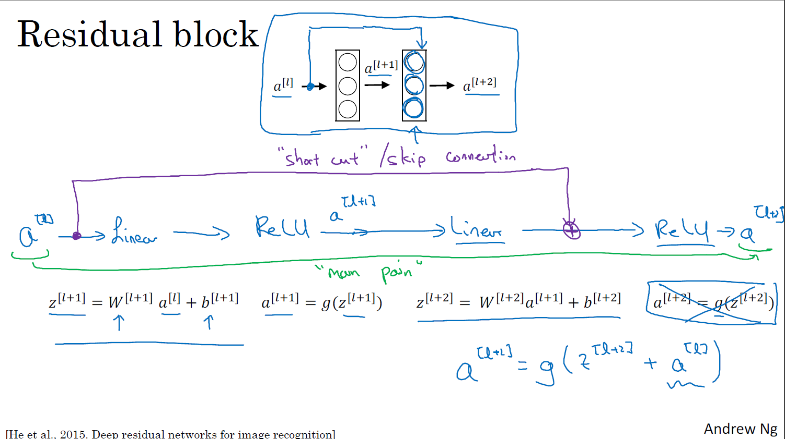

Using residual blocks allows you to train much deeper neural networks.

2. Building a ResNet

A ResNet is created by stacking many of these residual blocks together. For example, a deep network can be constructed using five stacked residual blocks.

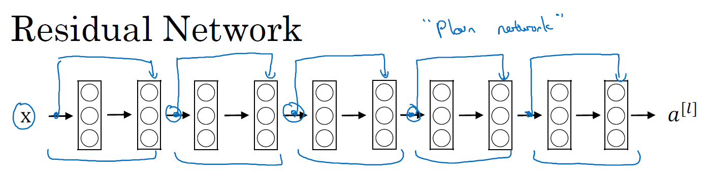

3. Why ResNets Work So Well

The inventors of ResNet found that using these residual blocks allows for the successful training of much deeper networks.

ResNet vs. Plain Network Performance

|Characteristic |Plain Network (No Skip Connections) |Residual Network (ResNet)|
|-|-|-|
|Depth Impact (Theory) |Theoretically, a deeper network should only help training performance. |Helps realize the theoretical advantage of depth.|
| Depth Impact (Reality/Practice)|  As the number of layers increases, the training error decreases for a while, but then tends to go back up. Optimization algorithms have a harder time training very deep plain networks, leading to worse training error. | Even as the network gets deeper (100+ layers), the training error continues to decrease (or keep going down).| 
| Gradients | Prone to vanishing and exploding gradient problems.|The ability to take activations and feed them much deeper in the network helps significantly with the vanishing and exploding gradient problems. |

ResNets have been highly effective at helping train very deep networks, sometimes with over 100 layers, without any noticeable loss in performance.

It turns out that if you use your standard optimization algorithm such as a gradient descent or one of the fancier optimization algorithms to the train or plain network. So without all the extra residual, without all the extra short cuts or skip connections I just drew in. Empirically, you find that as you increase the number of layers, the training error will tend to decrease after a while but then they'll tend to go back up. And in theory as you make a neural network deeper, it should only do better and better on the training set. In theory, having a deeper network should only help. 


In practice or in reality, having a plain network, so no ResNet, having a plain network that is very deep means that all your optimization algorithm just has a much harder time training. And so, in reality, your training error gets worse if you pick a network that's too deep.

What happens with ResNet is that even as the number of layers gets deeper, you can have the performance of the training error kind of keep on going down. Even if we train a network with over a hundred layers. And then now some people experimenting with networks of over a thousand layers although I don't see that it used much in practice yet. But by taking these activations be it X or these intermediate activations and allowing it to go much deeper in the neural network, this really helps with the vanishing and exploding gradient problems and allows you to train much deeper neural networks without really appreciable loss in performance, and maybe at some point, this will plateau, this will flatten out, and it doesn't help that much deeper and deeper networks. But ResNet is not even effective at helping train very deep networks. 

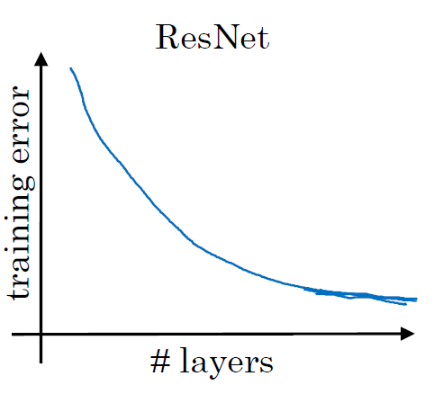

--------------------------------------------------------------------------------
Analogy: Imagine trying to pass a critical piece of information through a long chain of translators (layers). In a Plain Network, the message must be perfectly reinterpreted by every translator in sequence, leading to errors and degradation (vanishing gradient). In a Residual Network, you simultaneously send the message through the chain  send a direct copy (the skip connection) to the final translator, ensuring the core information makes it through clearly, even if the chain is extremely long.

## Why ResNets Work?
1. The Core Problem: Degrading Performance in Deep Networks

In deep learning, it is generally expected that adding more layers should improve performance, or at least not hurt it. However, in reality, adding depth to very deep "plain" neural networks (those without skip connections) can sometimes hurt your ability to train the network to perform well on the training set. This is often because the optimization algorithms struggle with vanishing and exploding gradients.

ResNets effectively combat this issue.

2. The Solution: The Identity Function is Easy to Learn

The fundamental reason ResNets work so well is that the residual block makes it easy to learn the identity function.

### Why do residual networks work?

How the Identity Function is Learned

The identity function, when used in the context of a residual block, describes a situation where the output activation is essentially the same as the input activation

Consider a two-layer residual block starting at activation $A^{[L]}$ and ending at $A^{[L+2]}$. The shortcut connection adds $A^{[L]}$ directly to the path before the final ReLU activation.

The output activation $A^{[L+2]}$ is defined by the following formula: $A^{[L+2]} = g(Z^{[L+2]} + A^{[L]})$ Where g is the ReLU activation function, and $Z^{[L+2]}$ is the output of the linear transformation of the main path: $Z^{[L+2]} =W^{[L+2]} A^{[L+1]} +b^{[L+2]}$.

The Key Insight:
1. Weight Decay: If you use L2 regularization (weight decay), it tends to shrink the weights, including $W^{[L+2]}$.
2. Zeroing Out: If the weights $W^{[L+2]}$ and biases $b^{[L+2]}$  are forced to zero (by regularization or learning), then the term 
$Z^{[L+2]}$ becomes zero.
3. Identity: If $Z^{[L+2]}$=0, the formula simplifies to $A^{[L+2]}=g(A^{[L]})$. Since ReLU (g) applied to a non-negative quantity (which $A^{[L]}$ usually is, assuming ReLU activations were used in previous layers) returns the quantity itself, the output becomes $A^{[L+2]} =A^{[L]}$.

This means the block can easily learn the identity function, simply copying $A^{[L]}$ to $A^{[L+2]}$, despite the addition of two extra layers.

Guaranteeing Performance

This capability provides a crucial guarantee: adding a residual block will not hurt performance.
* If the two layers within the block do not learn anything useful, the block can simply learn the identity function, ensuring the deeper network performs at least as well as the shallower network without those layers.
* In contrast, in deep plain networks (without shortcuts), it is extremely difficult to choose parameters that learn even the identity function, which is why adding layers often worsens results.
* ResNets provide a robust baseline (not hurting performance), and from there, gradient descent can improve the solution if the layers learn something useful (residual) instead of the identity.
3. Practical Implementation Details
The mechanism of the skip connection requires ensuring the dimensions match up so that the addition operation ($Z^{[L+2]}+A^{[L]}$) can be carried out.

A. Matching Dimensions using Same Convolutions

When stacking residual blocks, the use of "same" convolutions is common.
* Same Convolutions: These convolutions ensure that the height and width dimensions of the activation volume are preserved from one layer to the next within the block.
* Result: Since the dimension of $A^{[L]}$ is equal to the dimension of $Z^{[L+2]}$ (and thus the addition makes sense), the shortcut can be carried out easily.

B. Handling Dimension Mismatch (Projection Shortcut)

Sometimes, the input dimension $A^{[L]}$ and the output dimension $Z^{[L+2]}$ (or $A^{[L+2]}$) must change, usually due to a pooling layer or a change in the number of filters.

If the dimensions are different (e.g., $A^{[L]}$ is 128D and $Z^{[L+2]}$ is 256D), an extra linear transformation is required in the shortcut path using a matrix $W_S$:

$A^{[L+2]}=g(Z^{[L+2]}+W_S A^{[L]})$

Dimension of $W_S$ is 256x128

The matrix $W_S$ ensures the dimensions match for the final addition. $W_S$ can be implemented in a few ways:
1. Learned Parameters: $W_S$ can be a matrix of parameters that the network learns during training.
2. Fixed Matrix (Zero Padding): $W_S$ can be a fixed matrix that implements zero padding, taking $A^{[L]}$ and padding it with zeros to match the larger required dimension.

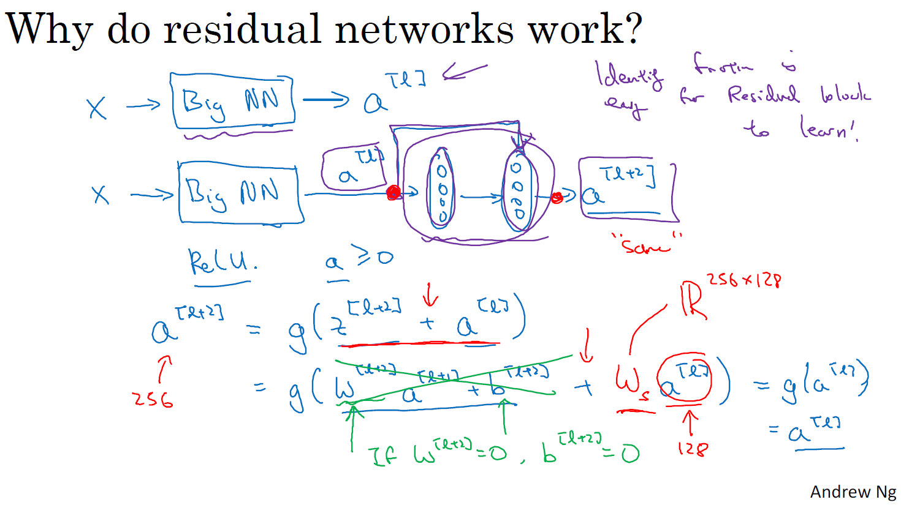

### ResNets
ResNets used for image classification typically feature many convolutional layers (often 3x3 same convolutions). These blocks are stacked, sometimes interspersed with pooling layers (or pooling-like layers). Whenever pooling occurs, or the number of channels drastically changes, the dimension adjustment using A^{[L]}$ is necessary. Finally, the convolutional feature map is fed through fully connected layers that lead to a prediction (e.g., via Softmax).

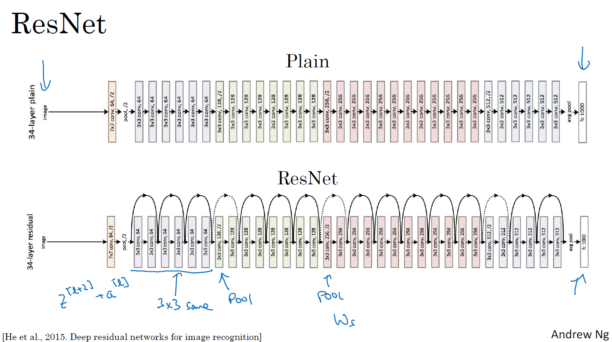

Imagine you’re building a tower (network).
Each new floor (layer) can make the building better…
But sometimes a floor is built badly (hurts stability).

ResNet adds emergency stairs between every few floors.
Now, if one floor is bad, people (data/gradients) can still move up and down safely.
So the tower can be much taller without collapsing.

## Networks in Networks and 1x1 Convolutions
1. What is a 1x1 Convolution?
A 1x1 convolution uses a filter with a height and width of 1 (a 1×1 filter).

Why it Matters (The Multi-Channel Case)

If you have a simple, single-channel input (e.g., a 6×6×1 image), convolving it with a 1×1×1 filter just results in multiplying the input image by a single number, which isn't very useful.

However, the power of the 1x1 convolution is revealed when the input volume has many channels ($N_C$).
* Input Example: A volume of 6×6×32.
* Filter Requirement: The 1x1 filter must match the input channel depth, so it is 1×1×32.

2. How the 1x1 Convolution Works
The 1x1 convolution performs a non-trivial operation by mixing information across channels at every single spatial position.

Analogy: Fully Connected Network

You can think of a 1x1 convolution as running a fully connected neural network across the channels at every position:
1. Input Slice: At any given spatial position (e.g., i,j), the input has $N_C$ numbers (32 numbers in the example above).
2. Filter/Weight: The 1×1×$N_C$ filter acts like a single neuron with $N_C$ inputs.
3. Calculation: The filter takes the 32 input numbers, multiplies each by a corresponding weight (from the filter), sums the results (element-wise product), and then applies a ReLU nonlinearity.
4. Output: This generates a single output number for that position in the new volume.

Using Multiple Filters

If you use multiple 1x1 filters (e.g., 10 filters), the output will be $N_H$x$N_W$x10. This means that at each spatial position, it is as if you have multiple units taking the $N_C$ input numbers and building them up into a corresponding output depth.
3. Key Applications of 1x1 Convolutions
The 1x1 convolution is highly influential and particularly useful for controlling network dimensions and computational cost.
Primary Use: Shrinking the Number of Channels ($N_C$)
This is often called "bottlenecking" and is a key benefit:

|Step| Operation| Input Volume| Output Volume| Notes|
|-|-|-|-|-|
|Start| N/A| 28×28×192| 28×28×192| Example input.|
|1x1 Conv| Use 32 filters (each 1×1×192)| 28×28×192| 28×28×32| The number of output channels is determined by the number of filters used (32).|
* Channel Reduction: Using a 1x1 convolution is a way to shrink $N_C$ (the number of channels/feature maps).
* Contrast with Pooling: Pooling layers are used to shrink the height ($N_H$) and width ($N_W$) of a volume. The 1x1 convolution is the tool used to shrink the depth ($N_C$).
* Computation Savings: Shrinking $N_C$ in this way can help save on computation in deeper parts of the network.

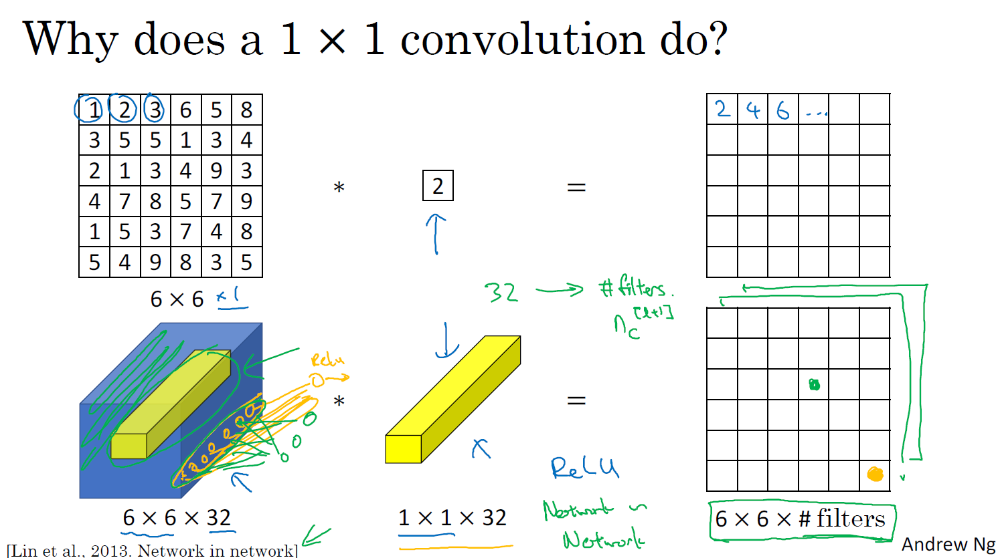

Secondary Use: Adding Non-Linearity

If you want to keep the number of channels the same (e.g., input 28×28×192 and output 28×28×192), a 1x1 convolution can still be applied.
* Purpose: The operation adds an extra layer of non-linearity (via the ReLU function applied at the end).
* Benefit: This allows the network to learn a more complex function of its input volume without changing the spatial dimensions.

This idea has been very influential and is used extensively in advanced architectures like the Inception Network.

## Inception Network Motivation
In a normal CNN layer, you might have to choose what size of convolution filter to use:
* 1×1 filters
* 3×3 filters
* 5×5 filters

Each filter size captures different kinds of features:
* 1×1 → captures fine/local details
* 3×3 → medium-size patterns
* 5×5 → larger patterns

But how do you know which one is best?

If you pick just one, you might miss useful features that another filter size could detect.

The basic idea of Inception Network is that instead of you needing to pick filter sizes or pooling you want and committing to that, you can do them all and just concat all the outputs and let the network learn whatever parameters it wants to use whatever combinations of these filter sizes it wants.

The Inception idea says:

“Let’s use all the filter sizes (1×1, 3×3, 5×5) in parallel, and then concatenate their outputs.”

So instead of choosing, the network learns which ones are useful through training.

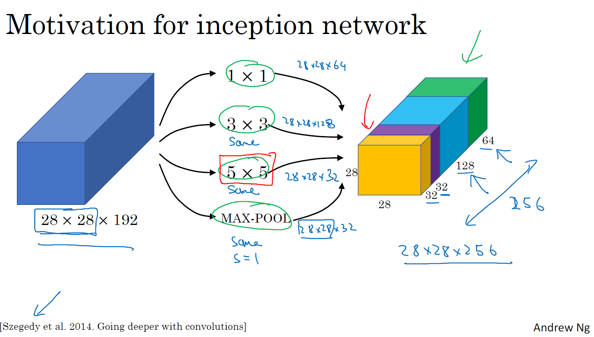

Problem with the inception network is computational cost. 

### The problem of computational cost
Suppose you have an input volume of size 28 × 28 × 192 (that’s a feature map of width 28, height 28, and 192 channels).

You decide to apply:
* 1×1 filters (with 64 filters)
* 3×3 filters (with 128 filters)
* 5×5 filters (with 32 filters)

If you apply all of these directly, the computational cost (the number of multiply-add operations) becomes huge, especially for the larger filters (5×5).

Cost = #of filters × filter size^2 × #input channels × output width × output height

So, for a 5×5 filter on 192 channels:

5 x 5 x 192 x 32 x 28 x 28 = 120 422 400

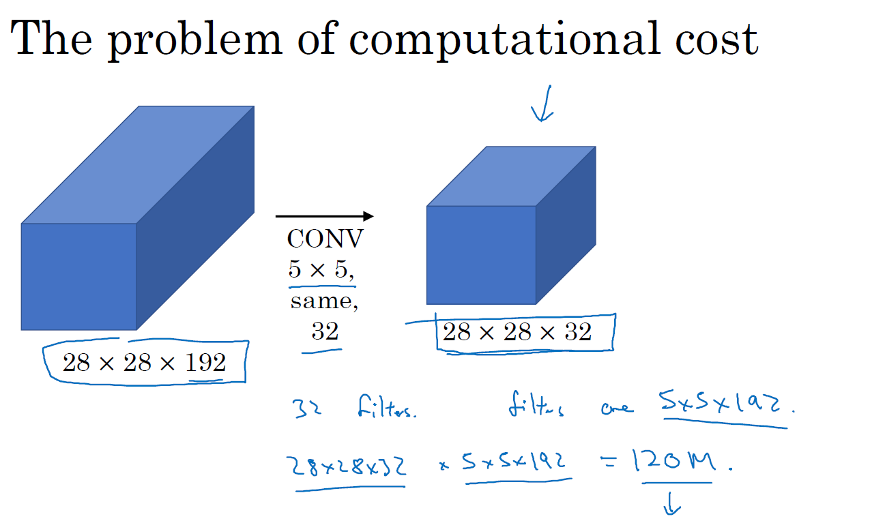

### Using 1×1 convolution
To fix this, the Inception network uses a 1×1 convolution as a “bottleneck layer” before the expensive 3×3 or 5×5 convolutions.

But what’s a 1×1 convolution?

A 1×1 convolution means:
* The filter size is 1×1 (just one pixel),
* But it still goes through all channels of the input.

So it doesn’t change the width or height of the image — it only changes the number of channels (depth).

You can think of it like a channel mixer or compressor:
* It combines information across channels.
* It can reduce the number of channels, lowering computation.

Step 1: 1×1 convolution (bottleneck layer)
* Input: 28×28×192
* Filter: 1×1×192
* Number of filters: 16
* Output: 28×28×16

Cost:

1×1×192×16×28×28=192×16×784=2,408,448

≈ 2.4 million multiplications

Step 2: 5×5 convolution (after reduction)

Input: 28×28×16

Filter: 5×5×16

Number of filters: 32

Output: 28×28×32

Cost:

5×5×16×32×28×28=25×16×32×784

=25×16×32×784=10,048,000

≈ 10 million multiplications

Total Cost (with 1×1 reduction):

2.4M+10.0M=12.4 million multiplications

* The 1×1 convolution acts like a “channel compressor.” It mixes information from 192 channels down to just 16 channels.
* Then the 5×5 convolution only operates on those 16 channels — not all 192 — drastically reducing computation.
* The model can still learn useful features, but at a fraction of the cost.

You might be wondering, does shrinking down the representation size so dramatically, does it hurt the performance of your neural network?

It turns out that so long as you implement this bottleneck layer so that within reason, you can shrink down the representation size significantly, and it doesn't seem to hurt the performance, but saves you a lot of computation. So this is the key of these are the key ideas of the inception module. 

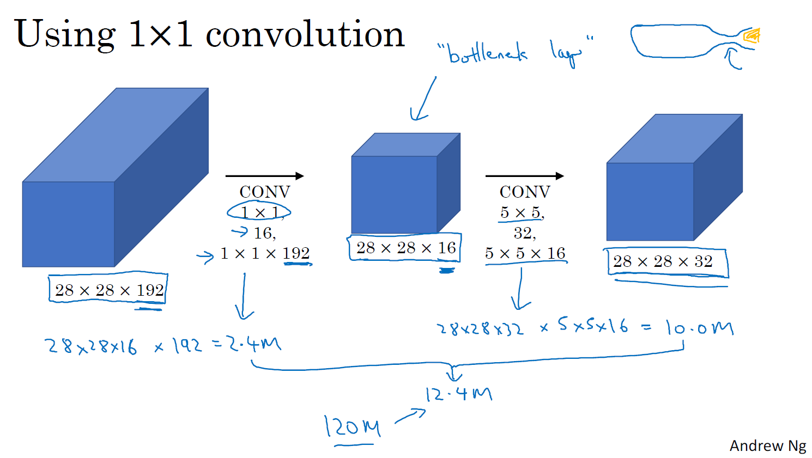

## Inception Network
### Inception module
* Branch 1: 1×1 Convolution
  * Purpose: capture fine details
  * Also helps keep the depth lower
  * Very cheap to compute

Output example: 28×28×64

* Branch 2: 1×1 → 3×3 Convolution
  * The 1×1 layer reduces number of channels → reduces cost
  * The 3×3 filter captures medium-sized patterns
  * Uses SAME padding → output has same width/height

Output example: 28×28×128

* Branch 3: 1×1 → 5×5 Convolution
  * Again, 1×1 reduces channels first
  * The 5×5 filter detects large, more global patterns
  * Without the 1×1, 5×5 would be extremely expensive

Output example: 28×28×32

* Branch 4: Pooling → 1×1 Convolution
  * Usually uses 3×3 max pooling
  * Pooling gives invariance, reduces sensitivity to small shifts
  * The following 1×1 convolution reduces depth
  * Pooling alone would shrink features — 1×1 restores useful information

Output example: 28×28×32

After each branch produces its output, the results are concatenated depth-wise:

Output depth=64+128+32+32=256

So if input was 28×28×192, output might be 28×28×256.

This creates a rich, multi-scale feature map:
* small filters (1×1)
* medium filters (3×3)
* large filters (5×5)
* pooled features

All fused together.

* Input: Previous Activation 28x28x192
  * 1x1 CONV, 16 filters + 5x5 CONV -> 28x28x32
  * 1x1 CONV, 96 filters + 3x3 CONV -> 28x28x128
  * 1x1 CONV -> 28x28x64
  * MAXPOOL 3x3, s=1, same + 1x1 CONV, 32 filters 1x1x192 -> 28x28x32
* Output: Take all above blocks and do channel concatenation. Concatenate 64+128+32+32, this gives 28x28x256 output.

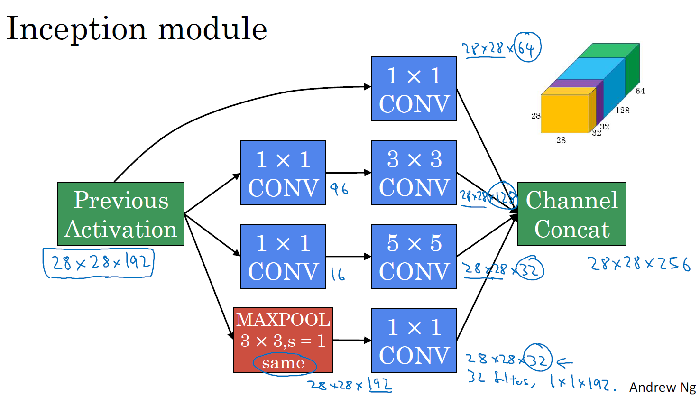

Why the Inception Module is Powerful
* No need to choose “which filter size is best” → network learns it
* Multi-scale feature extraction
* Much cheaper because of 1×1 reductions
* Can be stacked to build a deep network without blowing compute
* Allows very deep models (22 layers in GoogLeNet)

This is why Inception networks were revolutionary.

### Inception network
Inception network puts a lot of inception modules together.

* Consists of multiple stacked Inception modules
* Final network has 22 layers deep
* Uses fewer parameters than VGG (despite being deeper)
  * VGG: ~138 million parameters
  * GoogLeNet: ~5 million parameters (!!)

Much smaller yet more accurate.

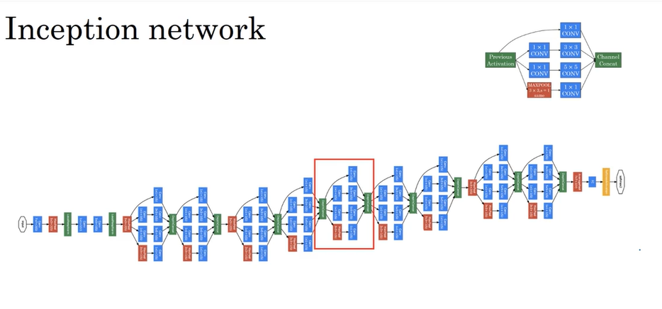

Here is a inception block which is an inception module as described above.

Deep networks often face vanishing gradients:
→ the early layers learn slowly because gradient becomes too small.

GoogLeNet solves this by adding auxiliary classifiers halfway through the network.

These look like small, mini-classifiers that include:
* average pooling
* 1×1 conv
* fully connected layer
* softmax

They help:
* provide extra gradient to early layers
* act like regularization
* are only used during training
* removed during inference (testing)

This helps the network train better and more stably.

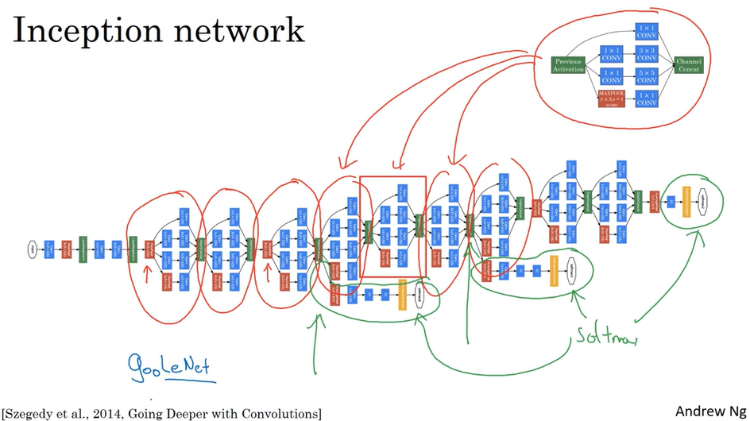

## MobileNet
### Motivation for MobileNets
* Low computational cost at deployment
* Useful for mobile and embedded vision applications
* Key idea: Normal vs. depthwiseseparable convolutions

### Normal Convolution
Traditional CNNs (like VGG, Inception) are:
* large
* slow
* require a lot of computation

But many real-world applications need:
* models that run on mobile phones
* low energy usage
* low memory
* fast inference

➡️ MobileNet was designed for mobile and embedded devices.
It uses a special type of convolution called depthwise separable convolution to dramatically reduce computation.

In a normal convolution layer:
* Input: H × W × M
* Filters: N filters, each size K × K × M
* Output: H × W × N

Each output channel uses a filter that spans ALL input channels.

Cost of standard convolution

$Cost = H*W*M*N*K^2$

This becomes very expensive, especially when M and N are large.

### Depthwise Separable Convolution
MobileNet breaks normal convolution into two cheaper steps:

* Step 1: Depthwise Convolution
  * Apply one filter per input channel
  * Each filter is K×K×1
  * No mixing of channels
  * Very cheap

If input has M channels → you use M filters.

$Cost = H*W*M*N*K^2$

* Step 2: Pointwise Convolution (1×1 Convolution)
  * Uses 1×1×M filters
  * Mixes information across channels
  * Produces N output channels
  * This is where channel mixing occurs

$Cost = H*W*M*N$

Compare Cost: Standard Conv vs Depthwise + Pointwise

Standard convolution cost: $HWMNK^2$

Depthwise separable convolution cost: $HWMK^2 + HWMN$ (depthwise + pointwise)

MobileNet reduces computation by about: ${1 \over {K^2} + {1 \over N}}$

* Depthwise conv learns spatial patterns for each channel.
* Pointwise conv learns how to combine channels.

Together, they replicate what a normal convolution does, but much more cheaply.

This is the key idea of the MobileNet architecture.

### Example
Input volume: 6x6x3

Standard convolution:
* Filter size = 3×3x3
* Number of filter = 5
* Output = 4x4x5

Output size = 6-3+1 = 4

* Output positions: 4×4=16
* Operations per filter per position: 3×3×3=27
* Number of filters: 5

Total cost: 16×27×5=2160 multiplications

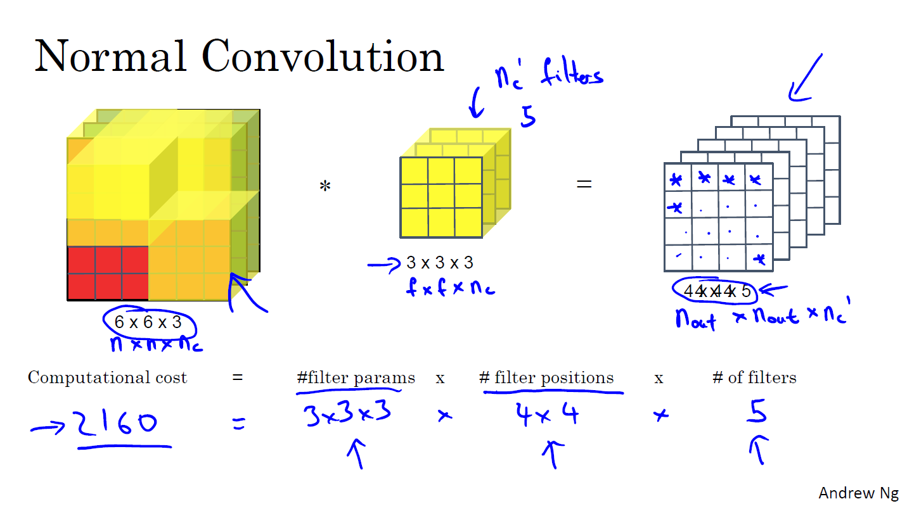

Depthwise separable convolution =
depthwise convolution + pointwise convolution

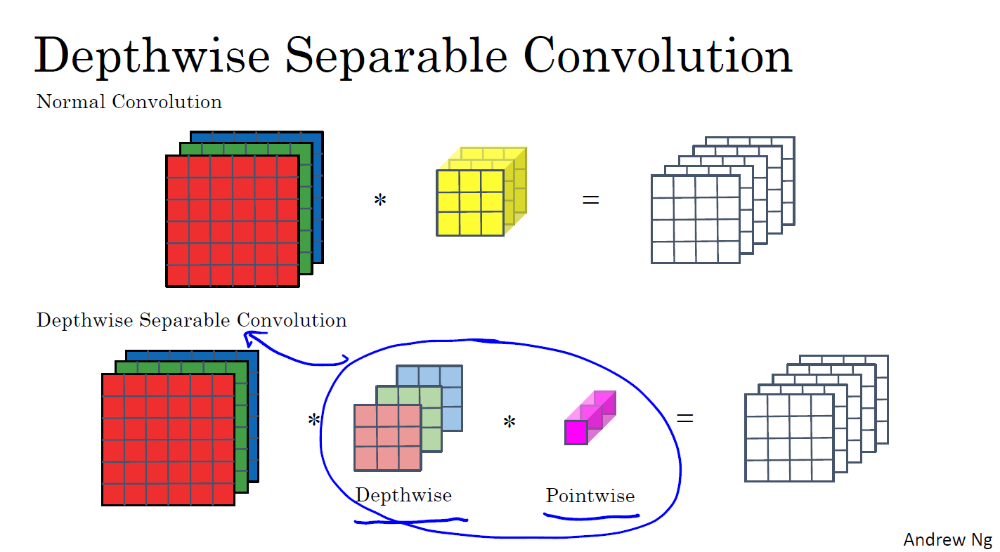

Depthwise means:
* 1 filter per channel
* Each filter: 3×3×1
* So you have 3 depthwise filters

Output: 4x4x3
* Positions: 16
* Per-channel filter: 9
* Channels: 3

Cost = (4x4)x(3x3x1)x3=432 multiplications

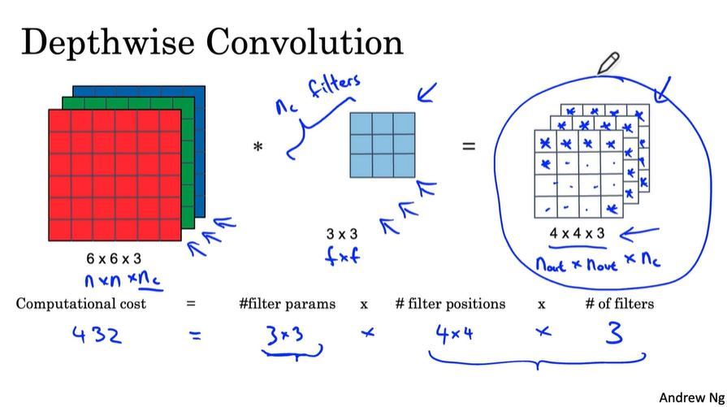

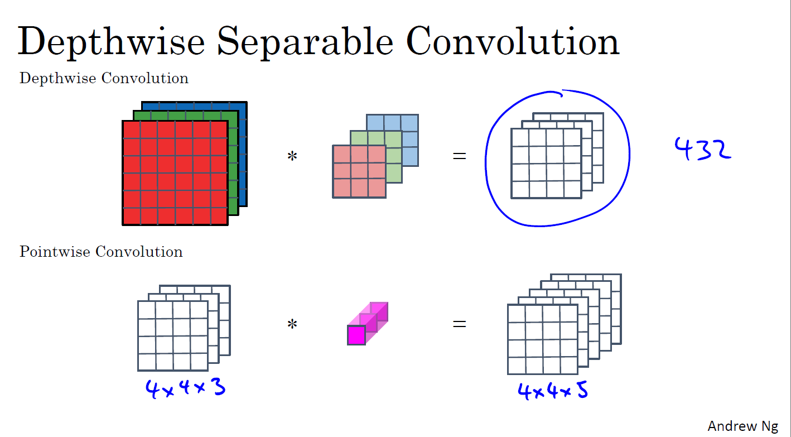

Pointwise Convolution

Input from depthwise: 4×4×3

We want the final output to be: 4×4×5

So we need:
* 5 pointwise (1×1×3) filters
* Each produces 1 output channel

Cost: (4×4)×(1×1×3)×5

Break it down:
* Positions: 16
* Per 1×1 filter: 3
* Number of filters: 5

16×3×5=240

Pointwise conv uses 240 multiplications

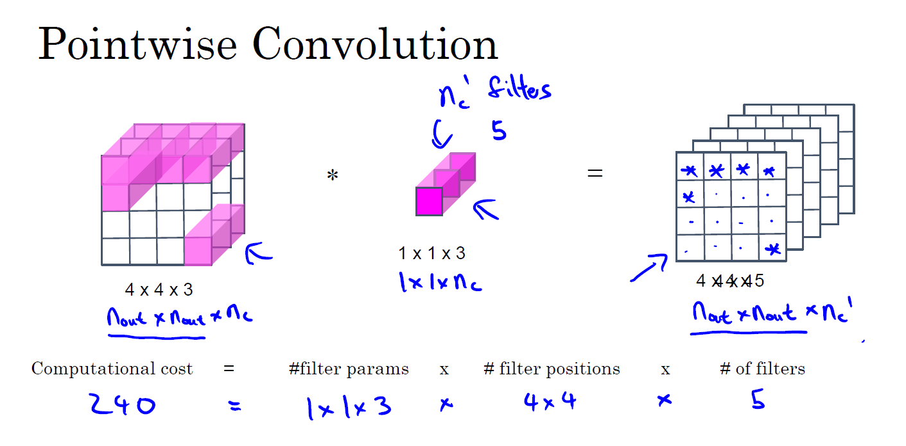

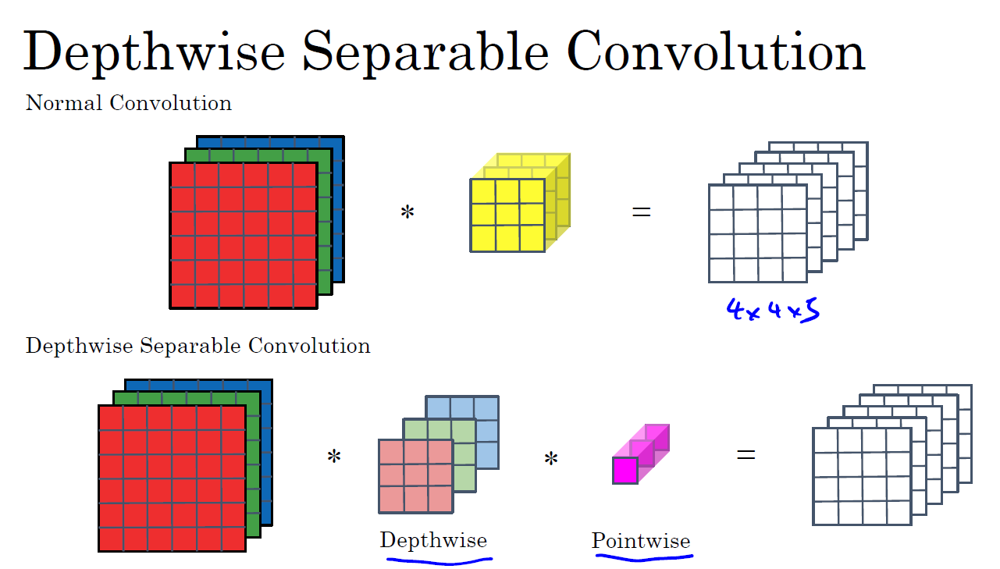


Cost of normal convolution: 2160

Cost of depthwise separable convolution:

Depthwise + Pointwise = 432 + 240 = 672

-> ${672 \over 2160} = 0.31$

MobileNet is 3.2× more efficient in this example

Cost can also be calculated by:

${1 \over {N_C'}} + {1 \over {f^2}}$

So ${1 \over 5} + {1 \over 9} = 0.311$

Depthwise convolution uses 31% of the cost

In real network:

So ${1 \over 512} + {1 \over 9} = 0.113$

Depthwise separable conv uses 11.3% of the cost.

so 1/512 is tiny and 1/9 is small, sum is about 1/9 meams:

Depthwise conv is about 9× more efficient

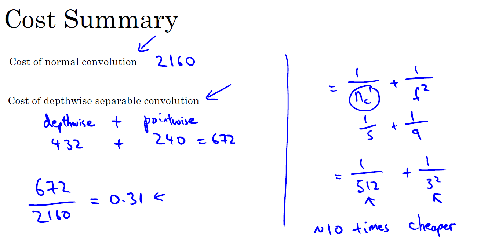

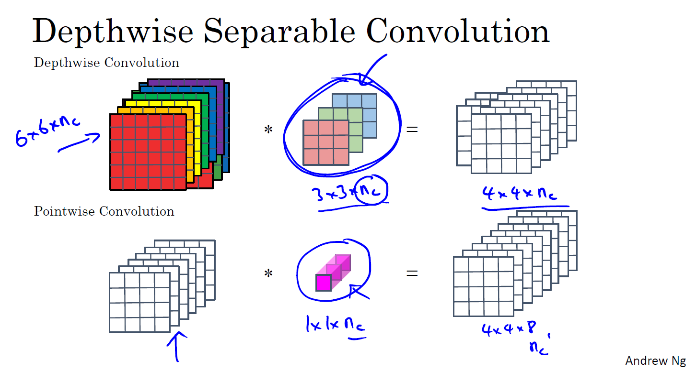

## MobileNet Architecture
### MobileNet v1

MobileNet v1 uses depthwise separable convolution everywhere.

Structure

The v1 architecture:
* Starts with one normal conv layer
* Then repeats the MobileNet block 13 times

Each block consists of:
* Depthwise 3×3 convolution → handles spatial filtering per channel
* Pointwise 1×1 convolution → mixes channels and increases depth

This creates a deep but efficient network.

### MobileNet v2

MobileNet v2 improves v1 by introducing:

* A bottleneck block
* Residual connections
* Expansion and projection layers

Each v2 block has 3 parts:
* Expansion layer (1×1 conv)
* Depthwise convolution (3×3 per channel)
* Projection layer (1×1 conv)

This block is repeated 17 times in the architecture.

v1 problem:

Depthwise convolution is cheap, but it doesn’t mix channels.

So v2 solves this using a bottleneck design:

* Expansion: Increase channels before depthwise conv. This gives depthwise more channels to extract richer features.
* Depthwise: Cheap 3×3 spatial filtering — but now on more channels.
* Projection: Reduce channels back to a narrow output. Helps with efficiency.
* Residual connection (skip): Only applied when input and output dimensions match.

Residual connections help the model:
* train deeper networks
* keep information flowing
* avoid vanishing gradients

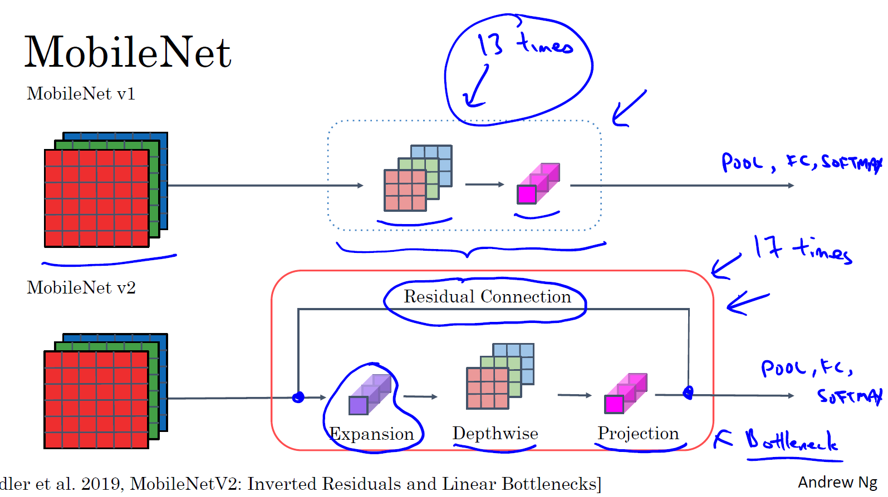

#### Example MobileNet v2 Bottleneck Block
Input: n × n × 3

A tensor with:
* spatial size n×n
* depth = 3 channels

**STEP 1** — Expansion (1×1 conv)

Use 18 filters, each of size 1×1×3.

This expands:

n×n×3 → n×n×18

Why 18?

* Expansion factor = 6
* So 3×6=18

Purpose: Give depthwise conv more channels to work with.

**STEP 2** — Depthwise Conv (3×3, one filter per channel)

Apply 18 depthwise filters (one per channel):

n×n×18 → n×n×18

Why unchanged?
* Depthwise does not change the number of channels
* Only filters each channel spatially

**STEP 3** — Projection (1×1 conv)

Use 3 filters, each 1×1×18, to shrink channels back to 3:

n×n×18 → n×n×3

Purpose: Reduce computation and restore bottleneck depth.

**STEP 4** Residual / Skip Connection

Because:
* input = n×n×3
* output = n×n×3

They match → so a skip connection is added:

Output = Input + Projection Output

This improves training efficiency, stability, and accuracy.

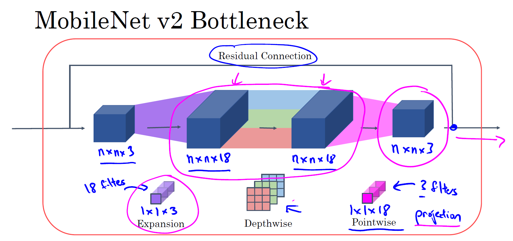

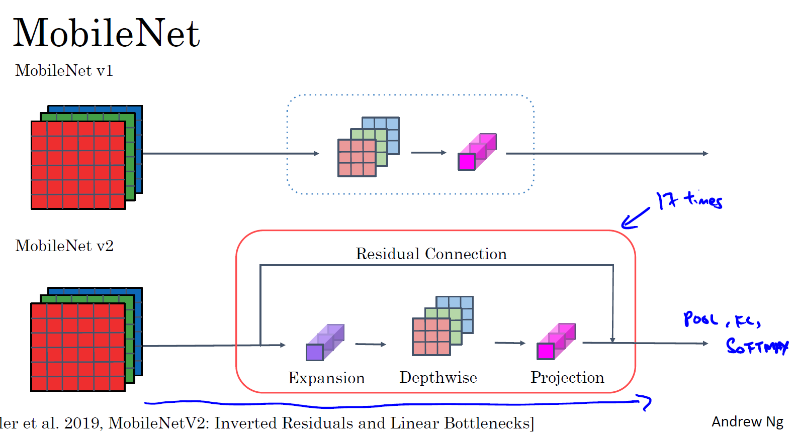

#### Why Bottleneck?

The “bottleneck” is the n×n×3 input and output.

Inside the block, the width grows to 18, but ends narrow again.

A bottleneck in deep learning means:

A layer (or block) that has much fewer channels than the rest of the network.

Think of a bottle:

```
Wide → Narrow → Wide
```

The narrow part is the bottleneck.

In MobileNet v2:

* Input is n × n × 3 (narrow)
* Expand to n × n × 18 (wide)
* Project back to n × n × 3 (narrow again)

So the block is:

```
narrow → wide → narrow
```

That's why it’s called a bottleneck block.

Benefits:
* Keeps computation low
* Allows useful residual connections
* Improves representational power
* Matches v1 cost but improves accuracy significantly

Summary
* MobileNet v1 = depthwise separable convolution everywhere
* MobileNet v2 = depthwise conv + bottleneck + expansion + skip

#### Residual connection
Here's what happens:

1. Input is copied into two paths:
* Short path (skip)
* Main computation path
2. Main path does:
* expand
* depthwise conv
* project
3. Final output = sum of skip + main path

This helps learning because:
* The network can easily keep information from the input
* Gradients flow better
* Training deeper networks becomes stable

#### Visualizing MobileNet v2 Block
```mathematica
Input (n×n×3)
   │
   ├─────────────► (Skip connection)
   │
   ▼
[EXPANSION: 1×1, 3 → 18]
[DEPTHWISE: 3×3, 18 → 18]
[PROJECTION: 1×1, 18 → 3]
   │
   ▼
Main Path Output (n×n×3)

Final Output = Input + Main Path Output
```

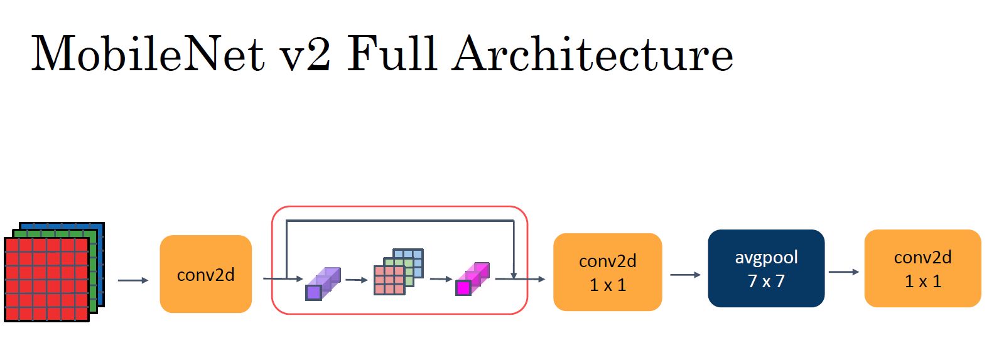

#### Why bottleneck + residual?
Residual connections work best when:
* Input and output shapes are the same
* Channels are small so addition is cheap

If MobileNet v2 used big numbers like 1024 channels, the skip would be expensive.

So they used bottlenecks:

```nginx
narrow → wide → narrow
↑                     ↑
Residual connection connects the narrow parts
```

This makes residuals fast and efficient.

## EfficientNet
Before EfficientNet, if researchers wanted a more accurate model, they scaled a network in one of three ways:

(A) Make it deeper: (e.g., ResNet-152 → more layers)

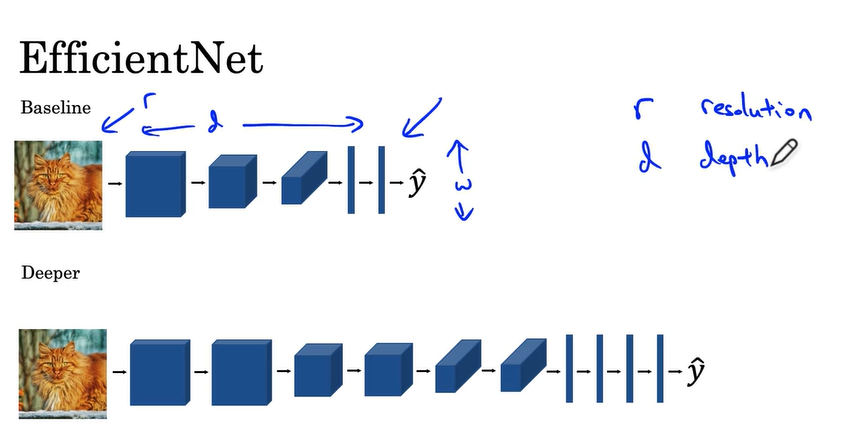

(B) Make it wider: (e.g., more channels in each layer)

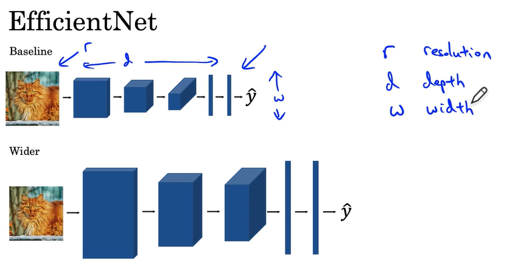

(C) Use larger input image resolution: (e.g., 224×224 → 380×380)

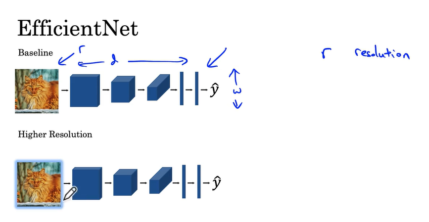

But doing only one of these usually:
* increases computation too much
* improves accuracy only a little
* causes imbalanced networks (too wide but not deep, etc.)

So the question is:

What is the best way to scale depth, width, and resolution together?

EfficientNet says:

Instead of scaling depth or width or resolution individually,
scale all three together using fixed ratios.

This is called the compound scaling rule.

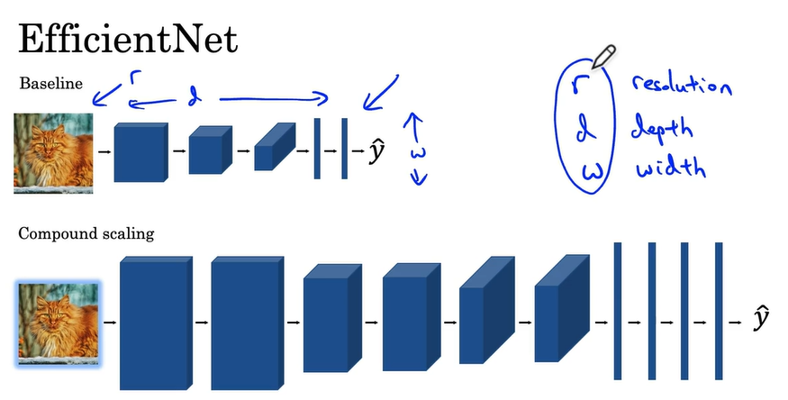

EfficientNet uses a parameter ϕ (phi) that controls how much to scale.

For each increase of ϕ:
* depth is multiplied by α
* width is multiplied by β
* resolution is multiplied by γ

So a larger model is:

$depth = \alpha^{\phi}$, $width=\beta^{\phi}$, $resolution=\gamma^{\phi}$

These α, β, γ values are chosen by a small search.

All EfficientNet-B0 to B7 are created by increasing ϕ.

* If you only increase depth

→ network becomes too slow to train \
→ diminishing returns (gradient issues)

* If you only increase width

→ model becomes too memory heavy \
→ accuracy increases slowly

* If you only increase resolution

→ early layers require massive computation \
→ not optimal

EfficientNet finds the right balance so deeper, wider, and bigger images all increase accuracy efficiently.

The base model EfficientNet-B0 is created using:
* MobileNet-V2 blocks
* with squeeze-and-excitation (SE) modules
* then compound scaled up into B1…B7

So the architecture contains:

* Bottlenecks

(From MobileNet v2)

* Depthwise separable convolutions

(cheap convolutions)

* Expansion + Projection

(MobileNet v2 idea)

* Squeeze-and-Excitation block

(tells the network which channels are important)

Then EfficientNet simply:

```
B0 (small)
B1
B2
B3
..
B7 (largest)

Each model = B0 scaled in depth, width, resolution
```

Simple Analogy

Think of a car engine:
* “Depth” = length of the engine
* “Width” = thickness
* “Resolution” = quality of fuel input

If you improve only one of these, the engine becomes unbalanced.

EfficientNet says:

Improve all engine dimensions at the same time, in the right ratio, and you get much more performance for less cost.

EfficientNet scales depth, width, and resolution together using fixed balanced ratios, producing much more efficient high-accuracy models.

## Using Open-Source Implementation
Using Open-Source Implementations
* Many neural networks are complex to replicate due to hyperparameter tuning challenges.
* Open-source implementations on platforms like GitHub can help * speed up the development process.

Finding and Downloading Code
* Search for specific architectures (e.g., ResNet) on GitHub to find various implementations.
* Downloading code is straightforward using commands like `git clone` to copy repositories to your local machine.

Benefits of Open-Source Code
* Utilizing pre-trained models can save time, especially for networks that require extensive training.
* Contributing back to the open-source community is encouraged for those who develop their own implementations.

## Transfer Learning
Transfer learning means:

Using a neural network trained on one task, and applying it to a new but related task.

In CNNs, this works extremely well because early layers detect edges, corners, patterns, which are useful for many tasks.

**USE CASE 1** — Use the pretrained model as a fixed feature extractor

(Freeze all layers, just train a small classifier head.)

This is used when:
* You have small dataset
* You want to avoid overfitting

The pretrained model already understands your type of images well

Example (from Andrew):

You want to classify your family cats:
* Tigger
* Misty
* Neither

But you only have a few images of each cat.

So you take a big pretrained model (like ResNet):

```
INPUT → Pretrained CNN → Feature Vector → Your New Classifier → Prediction
```

You freeze the CNN. You only train the last logistic/softmax layer.

Why this works:

The pretrained CNN already knows how to detect:
* fur texture
* cat ears
* cat shapes
* whiskers
* animal patterns

So your small dataset is enough.

**USE CASE 2** — Fine-tuning (unfreeze some deeper layers)

(Retrain part of the network to specialize it for your new problem.)

This is used when:
* You have more data (hundreds or thousands)
* The pretrained model needs some adaptation
* But you still don’t want to train from scratch

Tigger & Misty example

If you now collect more pictures of:
* Tigger
* Misty
* Neither

then just training the final layer may not be enough.

So Andrew shows:

```
Freeze early layers (edges, textures)
Unfreeze later layers (cat-specific features)
Fine-tune them on your cats
```

This lets the model learn features that separate Tigger vs Misty.

For example:
* Tigger’s striping pattern
* Misty’s face shape
* Their fur patterns
* Eye color differences

So now the model becomes an expert in telling your cats apart.

**USE CASE 3** — Use pretrained weights as initialization (train everything)

(Start with pretrained weights, but you train the whole network.)

This is used when:
* You have a large dataset
* Your images are different from the original dataset
* You want maximum accuracy

✔ Cat example

Imagine you now collect thousands of photos of cats:
* Tigger
* Misty
* Neighbor’s cats
* Outdoor cats
* Many lighting conditions
* Many poses

Now you can train the whole model.

But instead of random initialization, use weights from a pretrained model (like ImageNet):

```
Start with pretrained CNN weights
Train all layers on your cat dataset
→ Faster training
→ Better accuracy
```

Because:
* Early layers already detect edges
* Middle layers detect textures
* Later layers can adapt fully to your dataset

This is the best approach when you have enough data.

✔ Use Case 1

“Use the pretrained model exactly as it is — just add a small classifier.”

✔ Use Case 2

“Allow the model to adjust its later layers to specialize in your task.”

✔ Use Case 3

“Use pretrained weights as a good starting point, then train everything.”

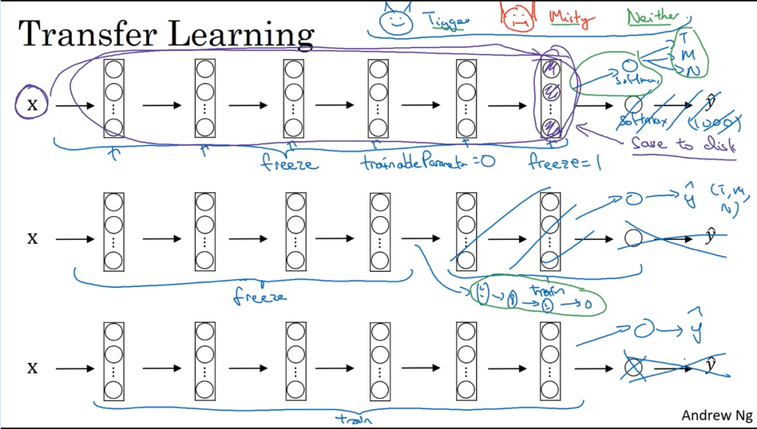

## Data augmentation
Data augmentation artificially increases your dataset by modifying images in ways that don’t change their label.

This reduces overfitting and makes your model more robust.

For example:
* If you only have 100 pictures of your cat Tigger, using augmentation you can make thousands of variations:
* flipped
* cropped
* color-shifted
* distorted

But they are all still Tigger.


**Mirroring (Horizontal Flip)**

Flip the image left-to-right.

Example:
Cat facing left → cat facing right.

For most objects (cats, dogs, cars, etc.), flipping horizontally does not change the identity.

Benefit: Doubles your dataset instantly.

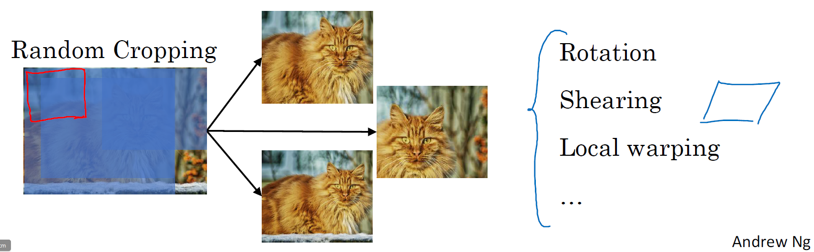

**Random Cropping**

Randomly take a smaller section (“crop”) of the image.

For example:
* Original: 256×256
* Random crop: 224×224 or similar

Force the model to learn that the object can appear:
* slightly to the left
* slightly to the right
* zoomed in a bit
* off-center

Crop must be large enough so the object is still recognizable.

So you wouldn’t crop only the cat’s ear → the label becomes wrong.

**Color Distortion / Color Augmentation**

Add or subtract a small random value to the R, G, or B channels.

Example:
* Add +20 to red channel
* Add +10 to green channel
* Subtract −5 from blue channel

This simulates:
* different lighting
* different cameras
* different time of day

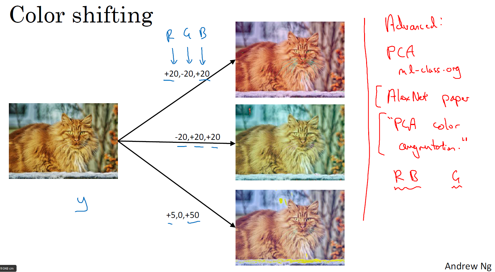

**PCA Color Augmentation (advanced)**

This is the same technique used in the original AlexNet paper.

Adjusts colors based on the principal components of the image dataset.

This:
* preserves natural color correlations
* adds realistic color variations
* avoids making images look weird or unnatural

You don’t need to implement PCA augmentation from scratch—use existing libraries.

Data augmentation is usually done while training, not beforehand.

Why?

Because storing millions of augmented images on disk is inefficient.

Instead:
* A CPU thread loads the raw image
* It applies augmentation (mirror, crop, color change)
* Then passes the augmented image to the GPU for training

This happens in parallel, so training is not slowed down.

Think of it as a pipeline:

```
CPU: load + augment → GPU: train
CPU: load + augment → GPU: train
(repeat continuously)
```

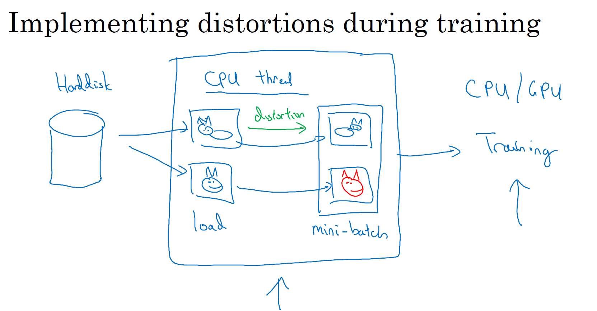

Data augmentation has tuning parameters, such as:
* Probability of mirroring
* Amount of color shift
* Crop sizes
* PCA variation intensity

Start with standard open-source implementations and default settings.

Because frameworks like PyTorch, TensorFlow, and Keras already implement good defaults.

## The state of computer vision
### Data vs. hand-engineering
Two sources of knowledge
* Labeled data
* Hand engineered features/network architecture/other components

How well machine learning works depends heavily on how much data you have.

Examples:

* Speech recognition: Huge datasets (thousands of hours) → deep learning works very well.
* Image classification: Also has huge datasets like ImageNet → deep learning shines.
* Object detection: Much harder because:
* You need bounding boxes, not just labels.
* Labeling bounding boxes is expensive and slow.
* Datasets are much smaller.

So detection models often struggle due to less training data.

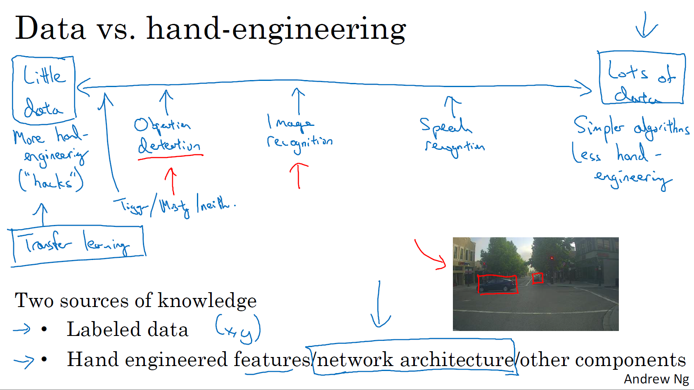

**Image Recognition (Classification)**
* “Is there a cat in this image?”
* “Is this picture a car?”

Requires:
* One label per image

Data is easier to collect.

**Object Detection**

Requires: Identifying objects AND drawing a bounding box around them

e.g.
* Find all cars
* Find all pedestrians

* ind where the dog is located

Bounding boxes require:
* Much more human labor
* More detailed annotation
* Fewer datasets available

Thus, recognition is easier and better-performing than detection.

* When you have a lot of data → use straightforward deep learning.
* When you have little data → you must hand-engineer more.

When data is abundant
* You don’t need fancy tricks.
* Deep learning learns the features by itself.

When data is scarce, you must help the system by:
* Designing features
* Choosing clever architectures
* Carefully tuning hyperparameters
* Using augmentation
* Building structural knowledge into the model

This is why:
* Classification (lots of data) → very little hand-engineering
* Detection (less data) → much more architecture design

Examples of “hand-engineering” Andrew refers to:

Designing anchor boxes
* Multi-scale detection
* Hard-negative mining
* Feature pyramids
* Architecture like YOLO, SSD, Faster R-CNN

All these exist because detection has limited data.

### Tips for doing well on benchmarks/winning competitions
Ensembling
* Train several networks independently and average their outputs

Train multiple models → average their predictions → higher accuracy.

Ensembling reduces variance and often gives:
* Better results on ImageNet
* Higher leaderboard scores

But: Ensembling is almost never used in production because:
* It increases computational cost
* It increases memory usage
* It slows down prediction

So it is mostly a benchmark trick, not a practical technique.

Multi-crop at test time
* Run classifier on multiple versions of test images and average results

At test time, instead of using one image:
* Take multiple crops of the same image (top-left, center, bottom-right, etc.)
* Run each crop through the network
* Average the predictions

Result: Higher accuracy on benchmarks.

But just like ensembling:
* It slows down inference
* It’s not practical for real-time systems
* Usually only used for publishing a high accuracy number

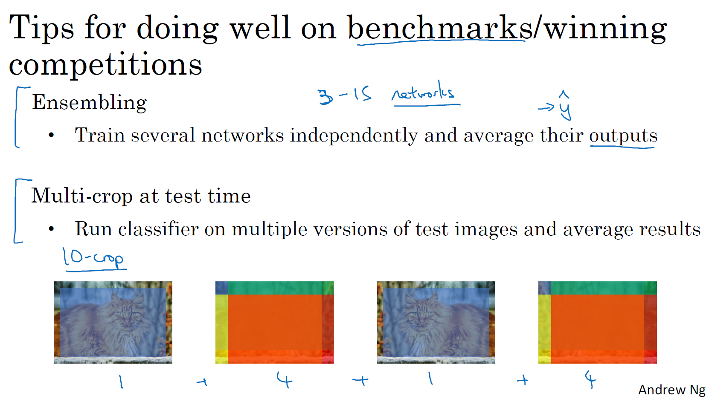

The amount of available data determines how much “hand-engineering” is needed.

* Tasks with lots of data → simple models, less engineering
* Tasks with less data → complex architectures, more engineering

This is why:
* Classification (huge datasets) → simple models like ResNet, EfficientNet
* Detection (smaller datasets) → complex models like Faster R-CNN, SSD, YOLO

And why benchmark tricks (ensembling, multi-crop) look impressive but are rarely used in real products.

### Use open source code
* Use architectures of networks published in the literature
* Use pretrained models and fine-tune on your dataset
* Use open source implementations if possible


