# Week 3: Object Detection

**Learning Objectives**
* Identify the components used for object detection (landmark, anchor, bounding box, grid, ...) and their purpose
* Implement object detection
* Implement non-max suppression to increase accuracy
* Implement intersection over union
* Handle bounding boxes, a type of image annotation popular in deep learning
* Apply sparse categorical crossentropy for pixelwise prediction
* Implement semantic image segmentation on the CARLA self-driving car dataset
* Explain the difference between a regular CNN and a U-net
* Build a U-Net

- [Week 3: Object Detection](#week-3-object-detection)
  - [Object Localization](#object-localization)
    - [What are localization and detection?](#what-are-localization-and-detection)
    - [Classification with localization](#classification-with-localization)
    - [Defining the target label y](#defining-the-target-label-y)
    - [Loss function to train NN](#loss-function-to-train-nn)
  - [Landmark Detection](#landmark-detection)
  - [Object Detection](#object-detection)
    - [Car detection example](#car-detection-example)
    - [Sliding windows detection](#sliding-windows-detection)
  - [Convolutional implementation of sliding windows](#convolutional-implementation-of-sliding-windows)
    - [Turning FC layer into convolutional layers](#turning-fc-layer-into-convolutional-layers)
    - [Convolution implementation of sliding windows](#convolution-implementation-of-sliding-windows)
  - [Bounding Box Predictions](#bounding-box-predictions)
    - [Output accurate bounding boxes](#output-accurate-bounding-boxes)
    - [YOLO algorithm](#yolo-algorithm)
    - [Specify the bounding boxes](#specify-the-bounding-boxes)
  - [Intersection Over Union](#intersection-over-union)
    - [Evaluating object localization](#evaluating-object-localization)
  - [Non-max Suppression](#non-max-suppression)
    - [Non-max suppression example](#non-max-suppression-example)
  - [Anchor Boxes](#anchor-boxes)
    - [Overlapping objects](#overlapping-objects)
    - [Anchor box example](#anchor-box-example)
  - [YOLO Algorithm](#yolo-algorithm-1)
    - [Training](#training)
    - [Making predictions](#making-predictions)
    - [Outputting the non-max supressed outputs](#outputting-the-non-max-supressed-outputs)
  - [Region Proposals (Optional)](#region-proposals-optional)
    - [Region proposal: R-CNN](#region-proposal-r-cnn)
    - [Faster algorithms](#faster-algorithms)
  - [Semantic Segmentation with U-Net](#semantic-segmentation-with-u-net)
    - [Object Detection vs. Semantic Segmentation](#object-detection-vs-semantic-segmentation)
    - [Motivation for U-Net](#motivation-for-u-net)
    - [Per-pixel class labels](#per-pixel-class-labels)
    - [Deep Learning for Semantic Segmentation](#deep-learning-for-semantic-segmentation)
  - [Transpose Convolutions](#transpose-convolutions)
  - [U-Net Architecture Intuition](#u-net-architecture-intuition)
  - [U-Net Architecture](#u-net-architecture)


## Object Localization
### What are localization and detection?
* Image classification: Algorithm looks at the picture and says if it's a car or not car.
* Classification with localization: Algorithm labels the picture as a car and puts a bounding box around the possition of the car.
  * The term "localization" means where is the object in the picture.
* Detection: There are multiple objects in the picture, algorithm has to detect all objects and localize all of them.

Image classification and Classification with localization uslally have 1 object.

Detection can have multiple objects and maybe multiple objects of different categories within a single image.

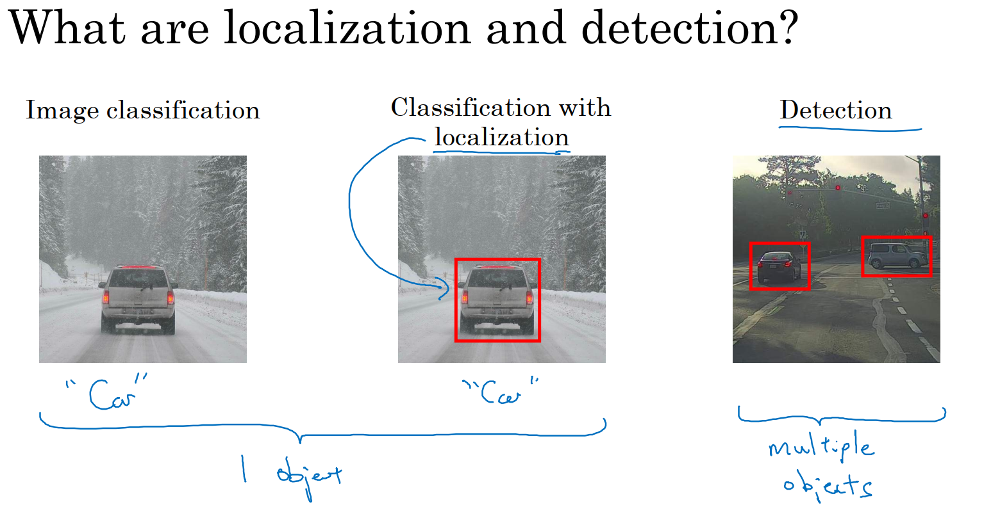

### Classification with localization
Image classification problem:
* Input: picture
* ConvNet with multiple layers
* Output: vector features is fed to a softmax uni that outputs the predicted class.

For example: Self-driving car, the object categories are:
* Pedesctrian
* Car
* Motocycle
* Background (does not contain 3 objects above)

For localization, change the NN above to have addition outputs which are bounding box parameters.
* bx, by: bounding-box center (normalized)
* bh, bw: bounding-box height and width (normalized)

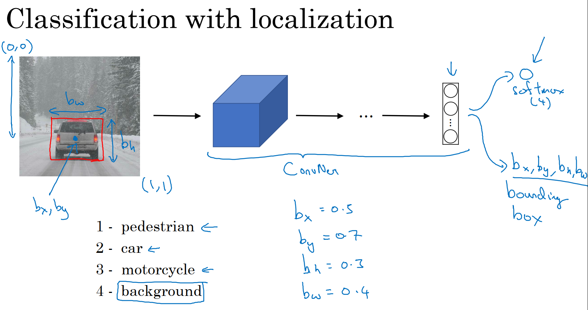

### Defining the target label y
Classes:
1. Pedesctrian
2. Car
3. Motocycle
4. Background (does not contain 3 objects above)

Need to output bx, by, bh, bw, class label (1-4).

y = [pc, bx, by, bh, bw, c1, c2, c3]

* pc: probability that there is 1 of the classes we are trying to detect.
  * If it's the background class: pc = 0.
  * Else, pc = 1
    * When pc = 1:
      * Output bx, by, bh, bw to localize object and specify bounding box.
      * Output c1, c2, c3 which tell class 1, class 2 or class 3.

For example:

Input X is an image of a car

```
y = [1, bx, by, bh, bw, 0, 1, 0]
```

Input X is an image of background (no objects)

```
y = [0, ?, ?, ?, ?, ?, ?, ?]
```

"?" means "don't care" because there is no object in the image, then we don't care about bounding box and object classes.

### Loss function to train NN
* y: ground truth label
* $\hat{y}$: NN output

1. If $y_1$ == 1 (or pc == 1, means there is an object in the image)

$\ell(\hat{y}, y) = (\hat{y}_1-y_1)^2 + (\hat{y}_2-y_2)^2 + ... + (\hat{y}_8-y_8)^2$

2. If $y_1$ == 0 (or pc == 0)

$\ell(\hat{y}, y) = (\hat{y}_1-y_1)^2$

Because in the 2nd case, when pc = 0, the rest of output y is "don't care".

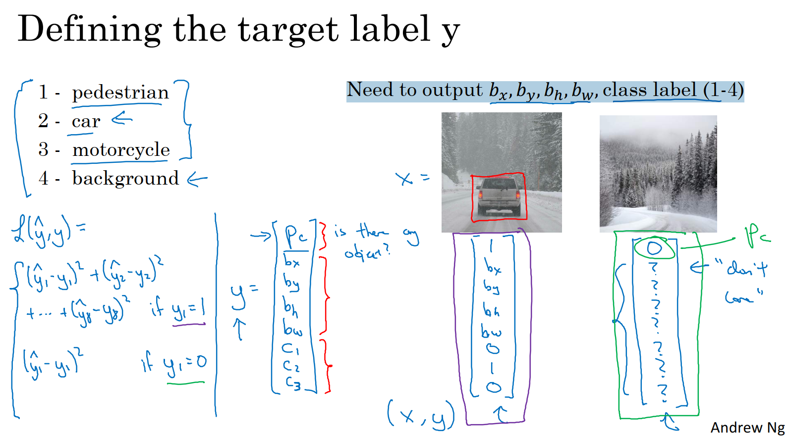

*Just as a side comment for those of you that want to know all the details, I've used the squared error just to simplify the description here.*
*In practice you could probably use*
* *log like feature loss for the c1, c2, c3 to the softmax output.*
* *One of those elements usually you can use squared error or something like squared error for the bounding box coordinates.*
* *For pc you could use something like the logistics regression loss.*

*Even if we use squared error, it will work okay.*

## Landmark Detection
Landmark detection means: Finding key points (important locations) inside an image.

Examples:
* Eye position in a face
* Nose position
* Mouth corners
* or any body joints (elbows, knees, shoulders)

Instead of saying what is in the image (classification), we want to find where something is.

For each landmark, the model predicts an (x, y) coordinate inside the image.

If detecting a corner of someone's eye, in the final layer of the NN, we can have 2 more numbers in ouput called:

```
(lx, ly)
```

If detecting 4 corners of both eyes, it outputs 4 points:

```
(l1x, l1y, l2x, l2y, l3x, l3y, l4x, l4y)
```

If detecting 64 facial landmarks, you output 64 (x,y) coordinate.

So the output of the model is simply:

```
[l1x, l1y, l2x, l2y, l3x, l3y, l4x, l4y ... , l64x, l64y]
```

This is the output vector.

By selecting a number of landmarks and generating a label training sets that contains all of these landmarks, you can then have the neural network to tell you where are all the key positions or the key landmarks on a face.

```
InputImage -> ConvNet -> SetOfFeatures -> Output[face?, l1x, l1y, l2x, l2y, l3x, l3y, l4x, l4y ... , l64x, l64y]
```

In this example, output will have 129 units. (128 + 1 unit to say if there is face or not).

Application:
* Recognizing emotions from faces
* AR augmented reality filters (used in Snapchat to draw for example a crown on the face or other special effects.)
* Human pose detection, define a few key positions like the midpoint of the chest, the left shoulder, left elbow, the wrist, and so on, and just have a neural network to annotate key positions in the person's pose as well and by having a neural network output all of those points, we could also have the neural network output the pose of the person. And of course, to do that you also need to specify on these key landmarks like maybe l1x and l1y is the midpoint of the chest down to maybe l32x, l32y, if you use 32 coordinates to specify the pose of the person.

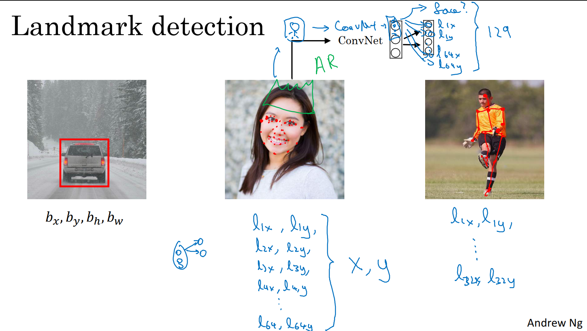

The identity of landmark one must be consistent across different images.

## Object Detection
### Car detection example
Object detection is a task in computer vision where a model not only identifies what objects are in an image (like classification) but also locates them by drawing bounding boxes around each object. It's like classification plus localization for multiple objects.

In car detection for self-driving cars, the model scans an image of a road and draws red boxes around each car it finds, showing exactly where they are.

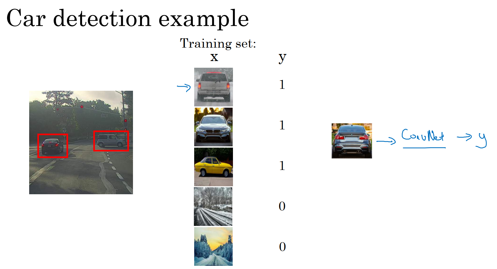

Training set X will be many picture of cars closely cropped.

Train a ConvNet that inputs an image of car which is closely cropped and ouput is 0 or 1, whether it's a car or not a car.

Once the ConvNet is trained, we can use it in Sliding windows detection.

### Sliding windows detection
This is a basic method to detect objects by "sliding" a fixed-size window (like a square frame) across the entire image, cropping out each small section, and running it through a pre-trained ConvNet classifier to check if an object (e.g., a car) is in that crop. You repeat this process, moving the window step by step (called stride), until you've checked the whole image. To handle different object sizes, you repeat the process with larger or smaller windows.

* First, you train a ConvNet on tightly cropped images: positive examples are images that contain a car centered and filling the whole crop, negative examples are crops without cars (e.g., just road or trees).
* For a test image (like a road scene with two cars), you start with a small window (say 14x14 pixels) and slide it across the image with a stride of 2 pixels. For each position, crop the region, resize if needed, and feed it to the ConvNet.
* If the ConvNet says "car" for a crop, you mark that location as having a car.


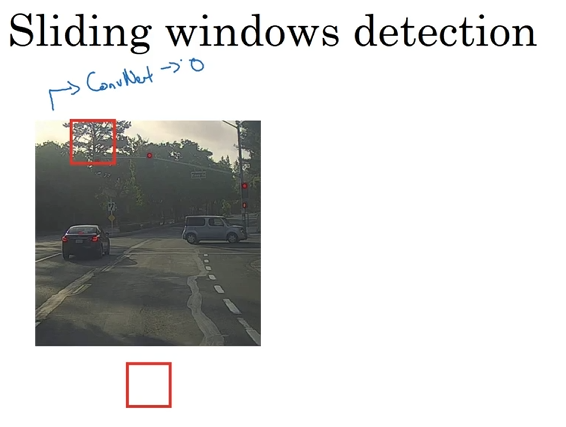

* Then, repeat with a bigger window (e.g., 28x28) to catch larger cars, and so on for even bigger scales.

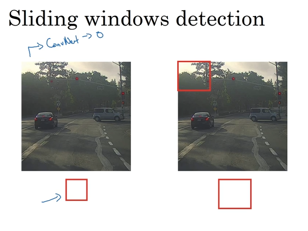

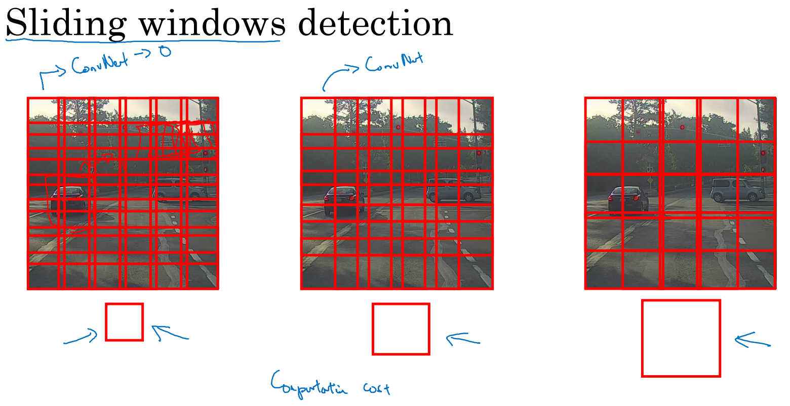

* In the video, Andrew shows a test image where sliding windows detect cars in overlapping regions, but notes this creates many duplicate detections that need cleaning up (though that's covered in later videos).

Stride is the number of pixels you move the window each time you slide it. A small stride (e.g., 1 or 2 pixels) means more overlaps and finer detection but takes longer; a large stride means faster but might miss objects.

In the car detection demo, using a stride of 2 pixels on a small window ensures the model checks overlapping areas, increasing the chance of catching a car that's not perfectly aligned with the window.

This refers to how much computer power and time the algorithm needs. The basic sliding windows method is inefficient because it runs the full ConvNet separately on every single crop, and for a large image with small strides and multiple scales, that could mean millions of computations.

Using coarse stride, a very big stride will reduce number of windows of we need to pass through the ConvNet, but it will hurt performance.

For a typical image, sliding a small window with a fine stride might require running the ConvNet thousands of times, making it too slow for real-time applications like self-driving cars. This is a big limitation, setting up for improvements in the next video (convolutional implementation to make it faster).

Train your classifier on high-quality, centered crops. Test on images with objects at various positions and sizes to see the algorithm's strengths and weaknesses.

## Convolutional implementation of sliding windows
Before deep learning, to detect objects (like cars, faces, cats), people would:

1. Take a small image patch (e.g., 64×64)
2. Slide it across the big image (left → right, top → bottom)
3. At each position, run a classifier to see if that patch contains the object.

This is called sliding windows.

The problem:

You must run a classifier thousands of times (for each window position), which is extremely slow.

### Turning FC layer into convolutional layers
If you take a CNN that ends with fully connected (FC) layers, you can convert the FC layers into convolutional layers.

Why?

Because fully connected layers are actually just 1×1 convolutions applied to the final feature map.

So the whole classifier can be transformed into a pure convolutional network.

Originally (image classifier):

```
Image  →  Conv  →  Conv  →  FC → Output (yes/no)
```

After converting the fully connected layer into convolution:

```
Big Image → Conv → Conv → Conv → (output grid)
```
Now the network produces a grid of predictions.

Each element in the grid corresponds to:

"Is there an object in this location?"

This grid is equivalent to the sliding windows, but computed all at once, not one window at a time.

You remove the cropping step. Feed the whole image into a ConvNet. The later layers naturally compute the classifier output for every possible window position because convolution = sliding a filter (like a window) over the image.

* Train a ConvNet on 14×14 cropped car images (same as before).
* Input: full road image (e.g., 100×100×3).
* The ConvNet has fully connected (FC) layers at the end → replace them with 1×1 convolutions so the whole network is fully convolutional.
* Output: a grid of predictions (e.g., 8×8 grid), where each cell says: “Is there a car centered in this 14×14 region?”
* Each cell in the output grid corresponds to one sliding window position!

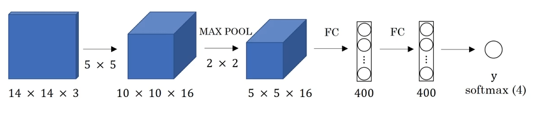

Change Y as four numbers, corresponding to the classes probabilities of the four classes that softmax units is classified amongst.

The full classes could be pedestrian, car, motorcycle, and background or something else. 

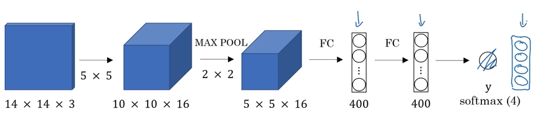

What I'd like to do is show how these layers can be turned into convolutional layers. So, the ConvNet will draw same as before for the first few layers. 

One way of implementing this next layer, this fully connected layer is to implement this as a 5 by 5 filter and let's use 400 5 by 5 filters.

If you take a 5 by 5 by 16 image and convolve it with a 5 by 5 filter, remember, a 5 by 5 filter is implemented as 5 by 5 by 16 because our convention is that the filter looks across all 16 channels, so the outputs will be 1 by 1.

If you have 400 of these 5 by 5 by 16 filters, then the output dimension is going to be 1 by 1 by 400. So rather than viewing these 400 as just a set of nodes, we're going to view this as a 1 by 1 by 400 volume.

Mathematically, this is the same as a fully connected layer because each of these 400 nodes has a filter of dimension 5 by 5 by 16. So each of those 400 values is some arbitrary linear function of these 5 by 5 by 16 activations from the previous layer.

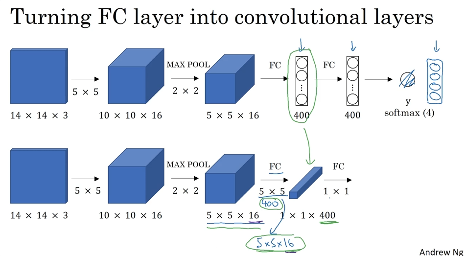

Next, to implement the next convolutional layer, we're going to implement a 1 by 1 convolution. If you have 400 1 by 1 filters then, with 400 filters the next layer will again be 1 by 1 by 400. So that gives you this next fully connected layer. 

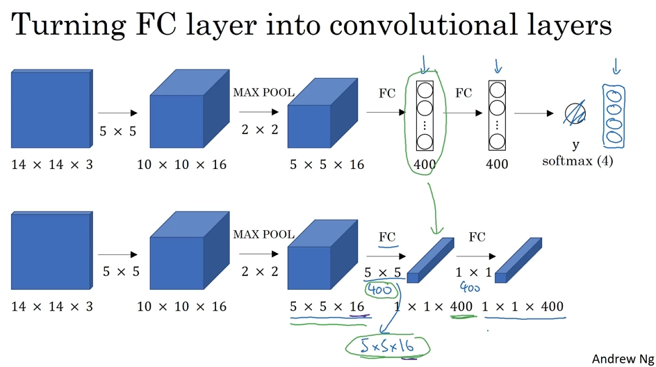

Then finally, we're going to have another 1 by 1 filter, followed by a softmax activation. So as to give a 1 by 1 by 4 volume to take the place of these four numbers that the network was operating. 

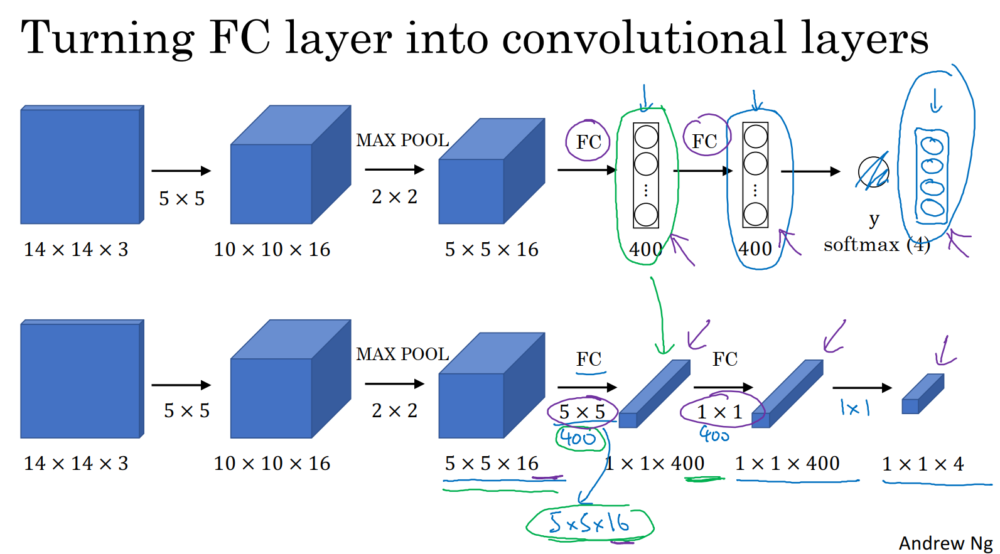

This shows how you can take these fully connected layers and implement them using convolutional layers so that these sets of units instead are not implemented as 1 by 1 by 400 and 1 by 1 by 4 volumes.

After this conversion, let's see how you can have a convolutional implementation of sliding windows object detection. 

### Convolution implementation of sliding windows
ConvNet input: 14x14x3

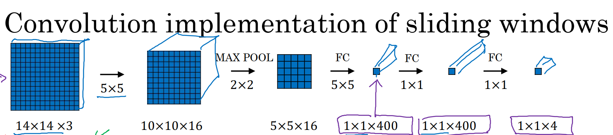

Tested image: 16x16x3 (added yellow stripe to the border of this image)

In the original sliding windows algorithm, you might want to input the blue region into a convnet and run that once to generate a consecration 0 or 1 and then slightly down a bit, let say uses a stride of two pixels and then you might slide that to the right by two pixels to input this green rectangle into the convnet and we run the whole convnet and get another label, 0/1. Then you might input this orange region into the convnet and run it one more time to get another label. And then do it the fourth and final time with this lower right purple square. To run sliding windows on this 16 by 16 by 3 image is pretty small image. You run this ConvNet four times in order to get four labels. 

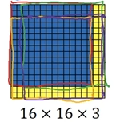

This is a lot of computations done by 4 ConvNets is highly duplicative.

What the convolutional implementation of sliding windows does is it allows these 4 classes in the ConvNet to share a lot of computation.

Specifically, here's what you can do. You can take the ConvNet and just run it same parameters, the same 5 by 5 filters, also 16 5 by 5 filters and run it. Now, you can have a 12 by 12 by 16 output volume. Then do the max pool, same as before. Now you have a 6 by 6 by 16, runs through your same 400, 5 by 5 filters to get now your 2 by 2 by 400 volume. 

So now instead of a 1 by 1 by 400 volume, we have instead a 2 by 2 by 400 volume. Run it through a 1 by 1 filter gives you another 2 by 2 by 400 instead of 1 by 1 like 400. Do that one more time and now you're left with a 2 by 2 by 4 output volume instead of 1 by 1 by 4.

It turns out that this blue 1 by 1 by 4 subset gives you the result of running in the upper left hand corner 14 by 14 image. This upper right 1 by 1 by 4 volume gives you the upper right result. The lower left gives you the results of implementing the convnet on the lower left 14 by 14 region. And the lower right 1 by 1 by 4 volume gives you the same result as running the convnet on the lower right 14 by 14 medium.


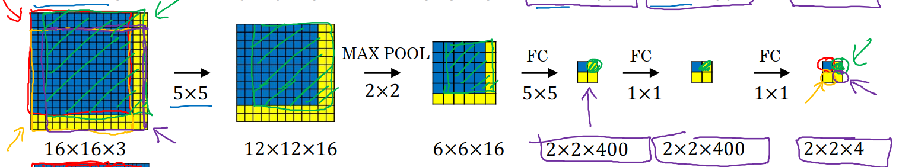

What this process does, what this convolution implementation does is, instead of forcing you to run four propagation on four subsets of the input image independently, Instead, it combines all four into one form of computation and shares a lot of the computation in the regions of image that are common. So all four of the 14 by 14 patches we saw here.

Old Way (Slow) = 4 Separate Runs

* Step 1: Cut out Square 1 → run brain → “Is there a car?”
* Step 2: Cut out Square 2 → run brain again
* Step 3: Cut out Square 3 → run brain again
* Step 4: Cut out Square 4 → run brain again

→ 4 full brain runs

→ Wastes time re-checking the same middle part 4 times!

New Way (Convolution) = 1 Run, Smart Sharing

* Step 1: Give whole photo to the brain once
* Step 2: The brain looks at everything together
* Step 3: It reuses the middle part for all 4 squares

→ 1 brain run gives answers for all 4 squares

→ No wasted work!

```text
Photo:
+-------------+
| 1     2     |
|   [CAR]     |
| 3     4     |
+-------------+

Overlap area = middle of the car
```

* Old way: checks middle 4 times
* New way: checks middle 1 time, shares it

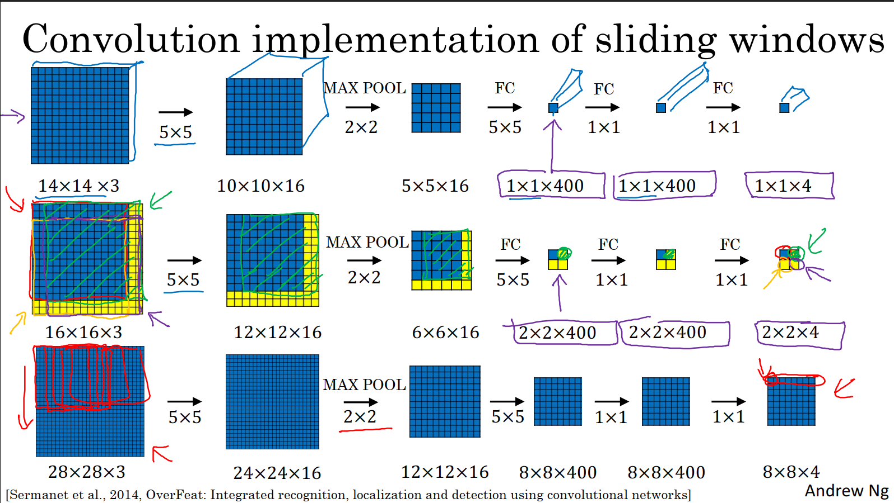

To recap, to implement sliding windows, previously, what you do is you crop out a region. Let's say this is 14 by 14 and run that through your convnet and do that for the next region over, then do that for the next 14 by 14 region, then the next one, then the next one, then the next one, then the next one and so on, until hopefully that one recognizes the car. 

But now, instead of doing it sequentially, with this convolutional implementation that you saw in the previous slide, you can implement the entire image, all maybe 28 by 28 and convolutionally make all the predictions at the same time by one forward pass through this big convnet and hopefully have it recognize the position of the car. 

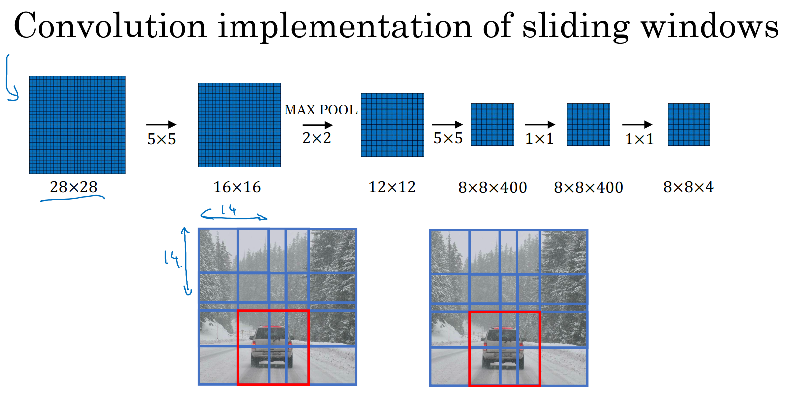

Traditional sliding windows:
* Cut out thousands of patches
* Resize them
* Run the classifier individually many times

Convolutional implementation:
* Run the entire network one time
* Convolution naturally slides across the image
* Produces predictions at all locations in a single forward pass

So instead of computing:

```
Classifier(window_1)
Classifier(window_2)
Classifier(window_3)
...
```

You compute:

```
Classifier(big_image) → grid of results
```

Same idea, massively faster.

You trained a classifier on 64×64 images that ends with:
* Conv layers
* Then FC layers:

He shows you can convert the FC layer into:
* A 1×1 convolution layer

Then when you feed a bigger image, like 200×200, instead of 1 output, the network produces many outputs, such as a grid:

```
10 × 10 × 1
```

Each cell = classification for one sliding window.

But computed in one go.

Convolutions are translation-invariant.

If your classifier works for a 64×64 image, applying it on a big image via convolution:
* Automatically scans across the big image
* Tests every possible 64×64 region
* While sharing computation efficiently

It's like sliding windows but built into the CNN itself.

An FC layer is a layer where: Every input neuron is connected to every output neuron.

Just like in ordinary neural networks.

Example:

If the last convolutional layer outputs a tensor of shape:
```
7 × 7 × 512
```

We usually flatten it:

```
7*7*512 = 25088 values
```

Then feed it into an FC layer with, say, 4096 units.

So an FC layer is simply:

```
input:   [25088]
weights: [25088 × 4096]
output:  [4096]
```

This is just a big matrix multiplication.

Imagine you have a list of numbers:
```
[ a, b, c, d ]
```

And you want to combine them to get one output:
```
output = some weighted combination of a, b, c, d
```

That’s what an FC layer does.

So an FC layer is:
* you flatten everything into one long vector
* then multiply by weights
* and get outputs

It’s like:
```
[ a, b, c, d ] → FC Layer → [ output1, output2, output3, ... ]
```

Each output is just:
* multiply each input by some weight
* add them up
* add a bias

That’s it.

A 1×1 convolution: 
* Does NOT mix spatial locations
* ONLY mixes channels

If your feature map is:
```
7 × 7 × 512
```

Then a 1×1 filter with 4096 filters produces:
```
7 × 7 × 4096
```

At EACH pixel location, you look at all channels (colors) and combine them.

If your image (or feature map) has 3 channels (R, G, B):

A 1×1 convolution at that pixel is:
* take R, G, B
* multiply each by some weight
* add them up
* that gives 1 new value

But you can have multiple filters, so you can get:
* filter1 → output channel1
* filter2 → output channel2
* filter3 → output channel3
* …

So a 1×1 filter is basically an FC layer applied to a single pixel’s channels.

FC:

You flatten EVERYTHING into one long list.

1×1 Conv:

You DO NOT flatten.

You apply the “fully connected” math separately at each pixel location.

This is the key:

A 1×1 convolution is doing the SAME MATH as an FC layer, but doing it everywhere, not just once.

Let’s imagine you have a feature map:
```
7 x 7 x 512  (height x width x channels)
```

This means:
* 7 × 7 = 49 "pixels"
* each pixel has 512 numbers (channels)

How FC sees it

Flatten:
```
512, 512, 512, ... (49 times)
```

Then combine them into outputs with big matrix multiplication.

How 1×1 conv sees it

At each of the 49 positions:
* take the 512 channels
* combine them exactly like an FC layer would
* output however many channels you want

The math is EXACTLY the same as FC, but applied at each location.

* FC = combine all channels at ONE place
* 1×1 Conv = combine all channels at EVERY place

This is why they are equivalent.

An FC layer is just a 1×1 conv applied once.

A 1×1 conv is just an FC layer applied many times across the image.

In the old sliding window method:

You would crop tiny windows and run the FC-based classifier:
```
Window → CNN → FC → yes/no
```

now require repeating this MANY times.

But if you convert the FC into 1×1 conv:
```
Big Image → CNN → 1×1 conv
```

The network automatically scans for objects everywhere, because:

Convolution naturally slides across the image.

You get a GRID of outputs directly.

FC Layer

Operates on flattened vector once:
```
[##########] → FC → Result
```

1×1 Conv Layer

Operates on each spatial location:
```
[##][##][##]
[##][##][##] → 1×1 conv → grid of results
[##][##][##]
```

Same math, but done everywhere.

## Bounding Box Predictions
### Output accurate bounding boxes
Problem: The sliding window gives you a grid of squares (all 14×14). But cars are not always 14×14! They can be taller, wider, smaller, bigger.

Solution: Instead of fixed squares, predict the exact box around each car. The brain will output 4 numbers for every spot:

bx, by, bh, bw → where and how big the box is.

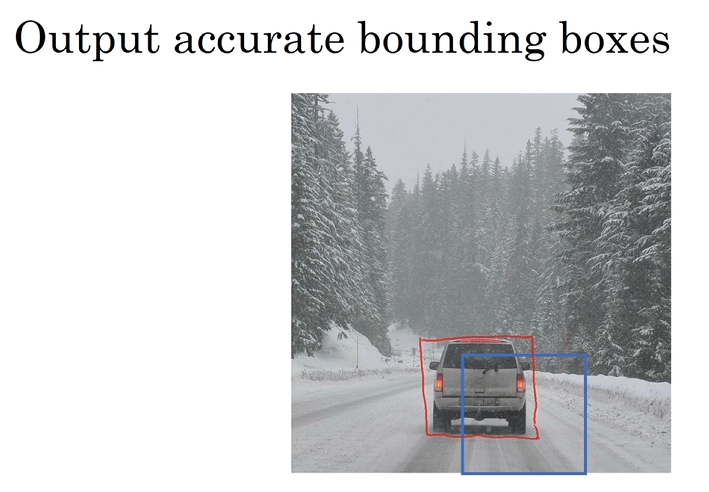

"Turn classification into regression". "Don’t just say “car or no car”. Say: “Here’s the perfect red box around the car”

### YOLO algorithm
A good way to get this output more accurate bounding boxes is with the YOLO algorithm. YOLO stands for You Only Look Once, and is an algorithm due to Joseph Redman, Santosh Devala, Raj Gershwik, and Ali Fakhadi.

Here's what you do. Let's say you have an input image that 100 by 100. You're going to place down a grid on this image. And for the purposes of illustration, I'm going to use a 3 by 3 grid.

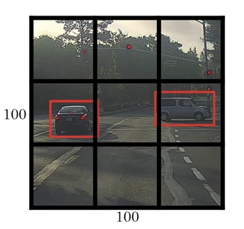

Although in an actual implementation, you'd use a finer one, like maybe a 19 by 19 grid.

Basic idea is you're going to take the image classification and localization algorithm that you saw in the first video of this week, and apply that to each of the nine grid cells of this image. 

For each of the nine grid cells, you specify a label Y, where the label Y is this eight-dimensional vector, same as you saw previously

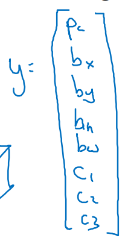

In this image, we have 9 grid cells. So you'd have a vectorize this for each of the grid cells. 

Let's start to the upper left grid cell, this one up here. For that one, there is no object. So the label vector Y for the upper left grid cell would be 0, and then don't cares for the rest of these. The output label Y would be the same for all the grid cells with no interesting object in them.

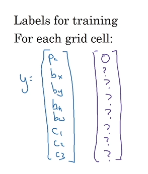

This image has 2 objects, so YOLO algorithm takes the midpoint of each of the 2 objects, then assigns the object to the grid cell containing the midpoint.

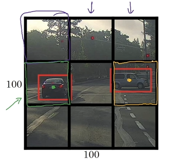

Even though the central grid cell has, you know, some parts of both cars will pretend the central grid cell has no interesting object. So for the central grid cell, the class label Y also looks like this vector with no object, and it's the first component PC, and then the rest are don't cares.


Whereas for cell that I've circled in green on the left, the target label Y would be as follows. There is an object, and then you write BX, BY, BH, BW to specify the position of this bounding box. If class 1 was a pedestrian, then that was 0, class 2 is a car, that's 1, class 3 was a motorcycle, that's 0.

And then similarly, for the grid cell on the right, because that does have an object in it, you know, it will also have some vector like this, as the target label corresponding to the grid cell on the right.

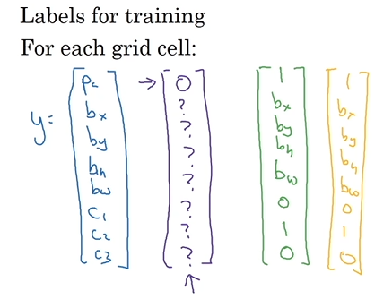

For each of these nine grid cells, you end up with a eight-dimensional output vector.

Because you have 3 by 3 grid cells, you have nine grid cells, the total volume of the output is going to be 3 by 3 by 8. So the target output is going to be 3 by 3 by 8, because you have 3 by 3 grid cells, and for each of the 3 by 3 grid cells, you have a eight-dimensional Y vector. So the target output volume is 3 by 3 by 8, where for example, this 1 by 1 by 8 volume in the upper left, corresponds to the target output vector for the upper left of the nine grid cells.

So for each of the 3 by 3 positions, for each of these nine grid cells, there's a corresponding eight-dimensional target vector Y that you want in the output, some of which could be don't cares if there's no object there.

To train your neural network, the input is a 100 by 100 by 3. Now that's the input image. And then you have a usual conf net with conf layers, max pool layers, and so on. So that in the end, you should choose the conf layers and the max pool layers and so on, so that this eventually maps to a 3 by 3 by 8 output volume.

What you do is you have an input X and you have target labels Y, which are 3 by 3 by 8, and you use backpropagation to train the neural network to map from any input X to this type of output volume Y.

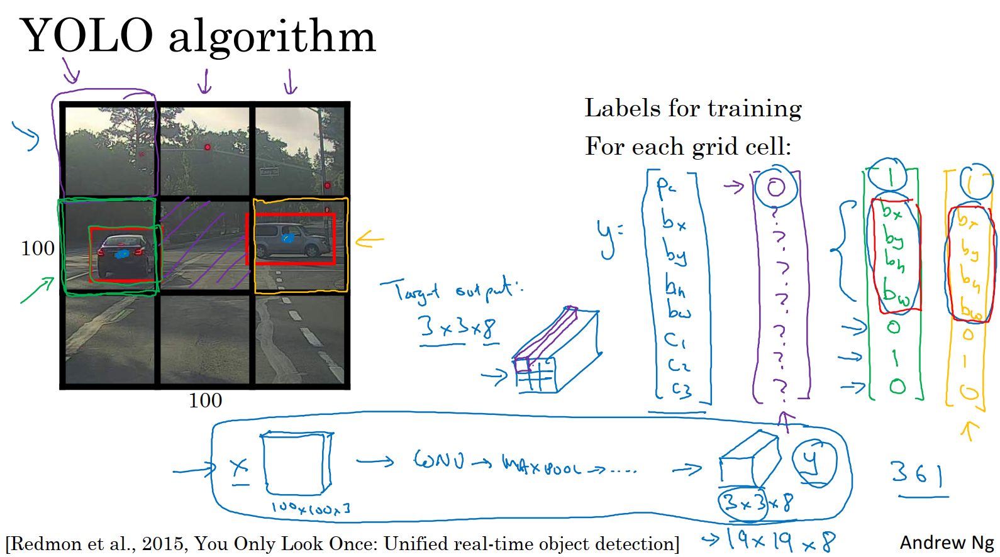

The advantage of this algorithm is that the neural network outputs precise bounding boxes. 

At test time, what you do is you feed in an input image X and run for a prop until you get this output Y. And then for each of the nine outputs, for each of the 3 by 3 positions in which the output, you can then just read off one or zero. Is there an object associated with that one of the nine positions?
* If there is an object, what object it is, and what is the bounding box for the objects in that grid cell?
* So long as you don't have more than one object in each grid cell, this algorithm should work okay.
* The problem of having multiple objects within a grid cell is something we'll address later. 

In practice, you might use a much finer grid, maybe 19 by 19. So you end up with 19 by 19 by 8. And that also makes your grid much finer and reduces the chance that there are multiple objects assigned to the same grid cell.

The way you assign an object to grid cell is you look at the midpoint of an object, and then you assign that object to whichever one grid cell contains the midpoint of the object. So each object, even if the object spans multiple grid cells, that object is assigned only to one of the nine grid cells or one of the 3 by 3 or one of the 19 by 19 grid cells. And with a 19 by 19 grid, the chance of a object of two midpoints of objects appearing in the same grid cell is just a bit smaller.

Notice two things. 
1. This is a lot like the image classification and localization algorithm, in that it outputs the bounding box coordinates explicitly. And so this allows the neural network to output bounding boxes of any aspect ratio, as well as output much more precise coordinates that aren't just dictated by the stride size of your sliding windows classifier.
2. This is a convolutional implementation. You're not implementing this algorithm nine times, on the 3 by 3 grid, or if you're using a 19 by 19 grid, 19 squared is 361. So you're not running the same algorithm, you know, 361 times or 19 squared times. Instead, this is one single convolutional implementation where you use one conf net with a lot of shared computation between all the computations needed for all of your, you know, 3 by 3 or all of your 19 by 19 grid cells. So this is a pretty efficient algorithm. 

One nice thing about the YOLO algorithm, which accounts for its popularity, is because this is a convolutional implementation, it actually runs very fast. So this works even for real-time object detection.

### Specify the bounding boxes
Given these two cars, remember we have the 3 by 3 grid. Let's take the example of the car on the right. 

In this grid cell, there is an object and so the target label Y will be


In the YOLO algorithm, relative to this square, we're going to take the convention that the upper left point here is (0, 0), and this lower right point is (1, 1).

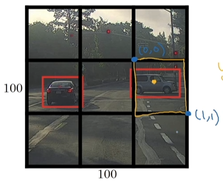

To specify the position of that midpoint, that orange dot, BX might be- let's see, X looks like it's about 0.4, since it's maybe about 0.4 of the way to the right, and then Y looks like that's maybe 0.3.

Then the height of the bounding box is specified as a fraction of the overall width of this box. So the width of this red box is maybe 90 percent of that blue line. And so bh, 0.5. And the height of this is maybe one-half of the overall height of the grid cell. So bw would be, let's say, 0.9.

In other words, this BX, BY, BH, BW are specified relative to the grid cell. 

bx and by, this has to be between 0 and 1. Because pretty much by definition, that orange dot is within the bounds of that grid cell it's assigned to. If it wasn't between 0 and 1, if it was outside the square, then it would have been assigned to a different grid cell.

But bh and bw could be greater than 1. In particular, if you had a car where the bounding box was that, then the height and width of a bounding box, this could be greater than 1. 

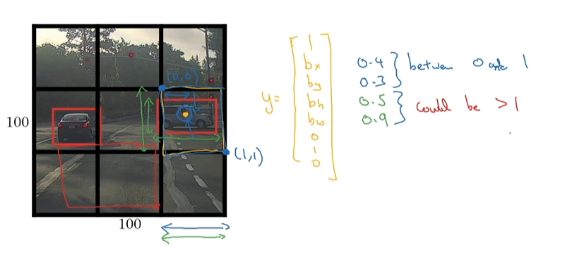

## Intersection Over Union
Intersection Over Union is used for:
* Evaluating object detection algorithm
* Adding another component to object detection algorithm to make it work better.

### Evaluating object localization
In objection detection task, we expect to localize the object.

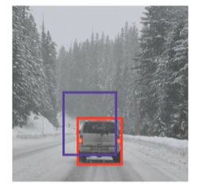

If the red box the ground-truth bounding box, and if your algorithm outputs this bounding box in purple, is this a good outcome or a bad one?

What the intersection over union function does, or IoU does, is it computes the intersection over union of these two bounding boxes. 

The union of the 2 bounding boxes is the area that is contained in either bounding boxes.

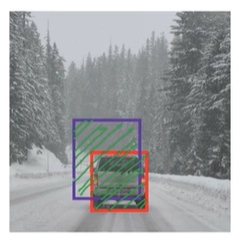

Intersection of 2 bounding boxes

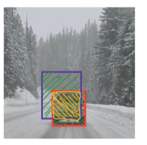

Intersection Over Union = ${sizeOfIntersection \over sizeOfUnion}$

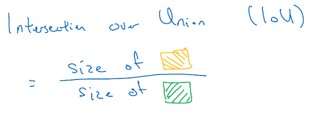

By convension, the low compute devision task will judge that your answer is correct if the IoU is greater than 0.5.

If the predicted and the ground-truth bounding boxes overlapped perfectly, the IoU would be 1, because the intersection would equal to the union. 

In general, so long as the IoU is greater than or equal to 0.5, then the answer will look okay, look pretty decent.

By convention, very often 0.5 is used as a threshold to judge as whether the predicted bounding box is correct or not. 

If you want to be more stringent, you can judge an answer as correct, only if the IoU is greater than equal to 0.6 or some other number. The higher the IoUs, the more accurate the bounding the box.

This is one way to map localization, to accuracy where you just count up the number of times an algorithm correctly detects and localizes an object where you could use a definition like this, of whether or not the object is correctly localized.

0.5 is just a human chosen convention. There's no particularly deep theoretical reason for it. You can also choose some other threshold like 0.6 if you want to be more stringent. 

More generally, IoU is a measure of the overlap between two bounding boxes.

Where if you have two boxes, you can compute the intersection, compute the union, and take the ratio of the two areas. This is also a way of measuring how similar two boxes are to each other. 

## Non-max Suppression
One of the problems of Object Detection is that the algorithm may find multiple detections of the same objects. Non-max Suppression is a way to make sure that the algorithm detects each object only once.

### Non-max suppression example
Let's say you want to detect pedestrians, cars, and motorcycles in this image.

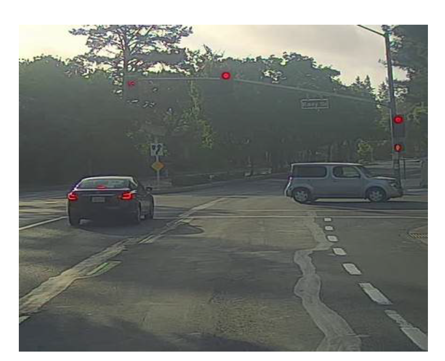

You might place a grid over this, and this is a 19 by 19 grid. 

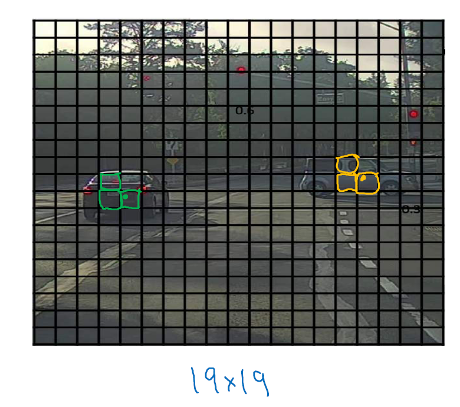

While technically the car on the right has just one midpoint, so it should be assigned just one grid cell. The car on the left also has 1 midpoint, so only 1 of those grid cells should predict there is a car.

In practice, you're running an object classification and localization algorithm for every one of these split cells. So it's quite possible that many split cells might think that the center of a car is in it.

Because you're running the image classification and localization algorithm on every grid cell, on 361 grid cells, it's possible that many of them will raise their hand and say, "My Pc, my chance of thinking I have an object in it is large." Rather than just having two of the grid cells out of the 19 squared or 361 think they have detected an object. 

-> You end up with multiple detections of each object.

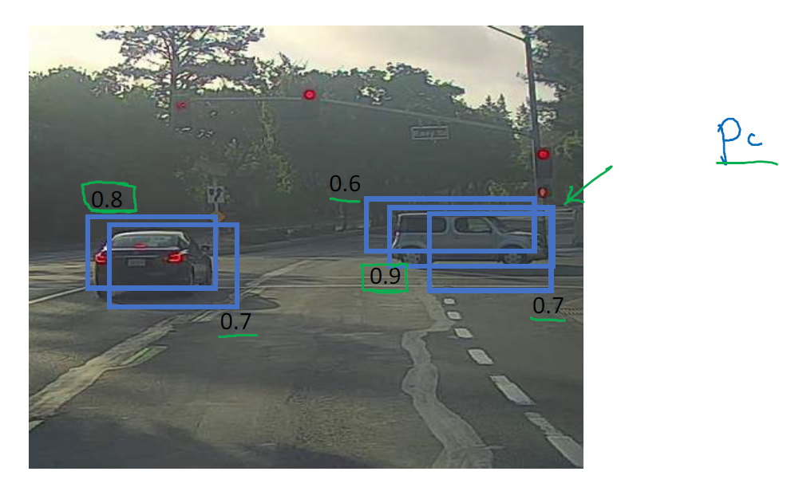

What non-max suppression does, is it cleans up these detections. So they end up with just one detection per car, rather than multiple detections per car.

Concretely, what it does, is it first looks at the probabilities associated with each of these detections which is Pc (the probability of a detection). And it first takes the largest one, which in this case is 0.9 and says, "That's my most confident detection, so let's highlight that and just say I found the car there." 


Having done that the non-max suppression part then looks at all of the remaining rectangles and all the ones with a high overlap, with a high IOU, with this one that you've just output will get suppressed. So those two rectangles with the 0.6 and the 0.7. Both of those overlap a lot with the light blue rectangle. So those, you are going to suppress and darken them to show that they are being suppressed.

Next, you then go through the remaining rectangles and find the one with the highest probability, the highest Pc, which in this case is this one with 0.8. So let's commit to that and just say, "Oh, I've detected a car there." And then, the non-max suppression part is to then get rid of any other ones with a high IOU. 

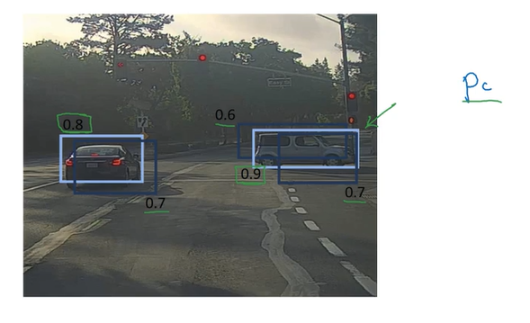

Non-max means that you're going to output your maximal probabilities classifications but suppress the close-by ones that are non-maximal.

Let's go through the details of the algorithm. First, on this 19 by 19 grid, you're going to get a 19 by 19 by 8 output volume. 

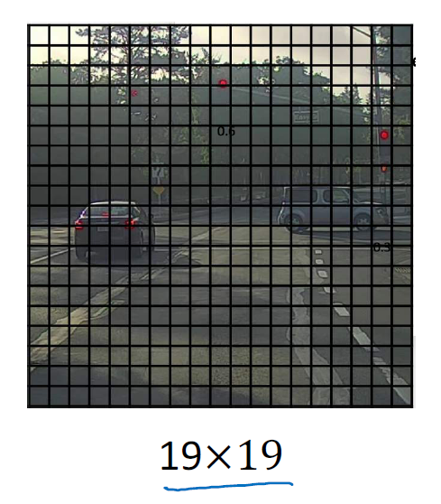

Although, for this example, I'm going to simplify it to say that you only doing car detection. So, let me get rid of the C1, C2, C3, and pretend for this line, that each output for each of the 19 by 19, so for each of the 361, which is 19 squared, for each of the 361 positions, you get an output prediction of the following. 

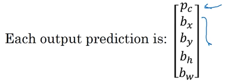

Which is the chance there's an object, and then the bounding box. And if you have only one object, there's no C1, C2, C3 prediction. The details of what happens, you have multiple objects, I'll leave to the programming exercise, which you'll work on towards the end of this week. 

To intimate non-max suppression, the first thing you can do is discard all the boxes, discard all the predictions of the bounding boxes with Pc less than or equal to some threshold, let's say 0.6. 

We're going to say that unless you think there's at least a 0.6 chance it is an object there, let's just get rid of it. This has caused all of the low probability output boxes. 

The way to think about this is for each of the 361 positions, you output a bounding box together with a probability of that bounding box being a good one. So we're just going to discard all the bounding boxes that were assigned a low probability.

Next, while there are any remaining bounding boxes that you've not yet discarded or processed, you're going to
* Repeatedly pick the box with the highest probability, with the highest Pc, and then output that as a prediction. So this is a process on a previous slide of taking one of the bounding boxes, and making it lighter in color. So you commit to outputting that as a prediction for that there is a car there.
* Next, you then discard any remaining box. Any box that you have not output as a prediction, and that was not previously discarded. So discard any remaining box with a high overlap, with a high IOU, with the box that you just output in the previous step. This second step in the while loop was when on the previous slide you would darken any remaining bounding box that had a high overlap with the bounding box that we just made lighter, that we just highlighted.

You keep doing this while there's still any remaining boxes that you've not yet processed, until you've taken each of the boxes and either output it as a prediction, or discarded it as having too high an overlap, or too high an IOU, with one of the boxes that you have just output as your predicted position for one of the detected objects.


I've described the algorithm using just a single object on this slide. If you actually tried to detect three objects say pedestrians, cars, and motorcycles, then the output vector will have three additional components. And it turns out, the right thing to do is to independently carry out non-max suppression three times, one on each of the outputs classes. 

## Anchor Boxes
One of the problems with object detection is that each of the grid cells can detect only one object. What if a grid cell wants to detect multiple objects? You can use the idea of anchor boxes. 

### Overlapping objects
Let's start with an example. Let's say you have an image like this. And for this example, I am going to continue to use a 3 by 3 grid. 

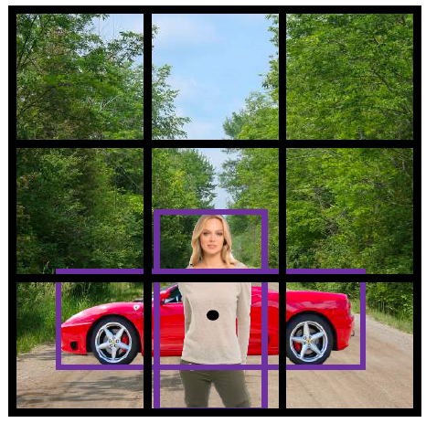

Notice that the midpoint of the pedestrian and the midpoint of the car are in almost the same place and both of them fall into the same grid cell.

For that grid cell, if Y outputs this vector where you are detecting three classes: pedestrians, cars and motorcycles, it won't be able to output two detections. So I have to pick one of the two detections to output.

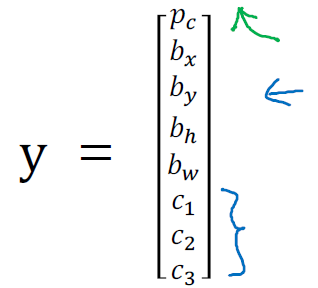

With the idea of anchor boxes, what you are going to do is pre-define two different shapes called, anchor boxes or anchor box shapes.

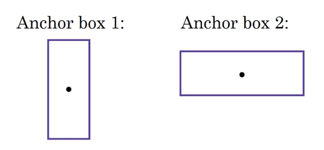

Then associate two predictions with the two anchor boxes.

In general, you might use more anchor boxes, maybe five or even more. 

So vector Y will be repeated twice in the same vector:

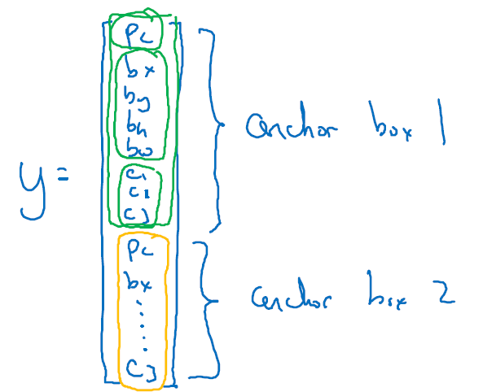

Because the shape of the pedestrian is more similar to the shape of anchor box 1 and anchor box 2, you can use the first 8 numbers to encode that PC as 1, yes there is a pedestrian.

Use the first bx, by, bh, bw to encode the bounding box around the pedestrian, and then use first c1, c2, c3 to encode that that object is a pedestrian.

Then because the box around the car is more similar to the shape of anchor box 2 than anchor box 1, you can then use the second 8 numbers to encode that the second object is the car, and have the bounding box and so on be all the parameters associated with the detected car.

To summarize, previously, before you are using anchor boxes, for each object in the training set and the training set image, it was assigned to the grid cell that corresponds to that object's midpoint. Output Y was 3x3x8, because we have 3x3 grid, and for each grid position, we had output vector Y.

With 2 anchor boxes, each object is assigned to the same grid cell as before, assigned to the grid cell that contains the object's midpoint, but it is assigned to a grid cell and anchor box with the highest IoU with the object's shape. So, you have two anchor boxes, you will take an object and see which of the two anchor boxes has a higher IoU, will be drawn through bounding box. Whichever it is, that object then gets assigned not just to a grid cell but to a pair. It gets assigned to grid cell comma anchor box pair. And that's how that object gets encoded in the target label. 

The output Y is going to be 3 by 3 by 16. Because Y is now 16 dimensional. Or if you want, you can also view this as 3 by 3 by 2 by 8 ,because there are now two anchor boxes and Y is eight dimensional. And dimension of Y being 8 was because we have 3 objects classes; if you have more objects than the dimension of Y would be even higher. 

### Anchor box example

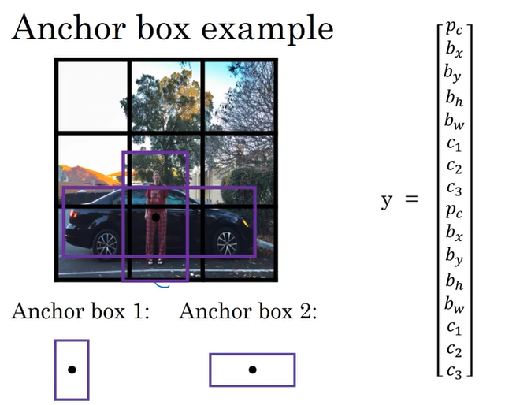

The pedestrian is more similar to the shape of anchor box 1. So for the pedestrian, we're going to assign it to the top half of this vector. So yes, there is an object, there will be some bounding box associated at the pedestrian. And I guess if a pedestrian is class 1, then c1 is 1, and then zero, zero. And then the shape of the car is more similar to anchor box 2. And so the rest of this vector will be 1 and then the bounding box associated with the car, and then the car is C2, so there's 0, 1, 0. And so that's the label Y for that lower middle grid cell that this arrow was pointing to. 

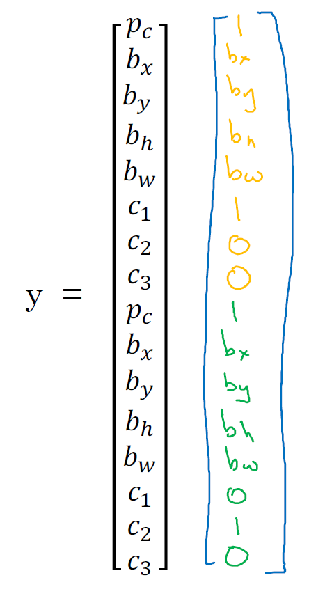

Now, what if this grid cell only had a car and had no pedestrian? 

If it only had a car, then assuming that the shape of the bounding box around the car is still more similar to anchor box 2, then the target label Y, if there was just a car there and the pedestrian had gone away, it will still be the same for the anchor box 2 component. Remember that this is a part of the vector corresponding to anchor box 2. And for the part of the vector corresponding to anchor box 1, what you do is you just say there is no object there. So PC is zero, and then the rest of these will be don't cares. 

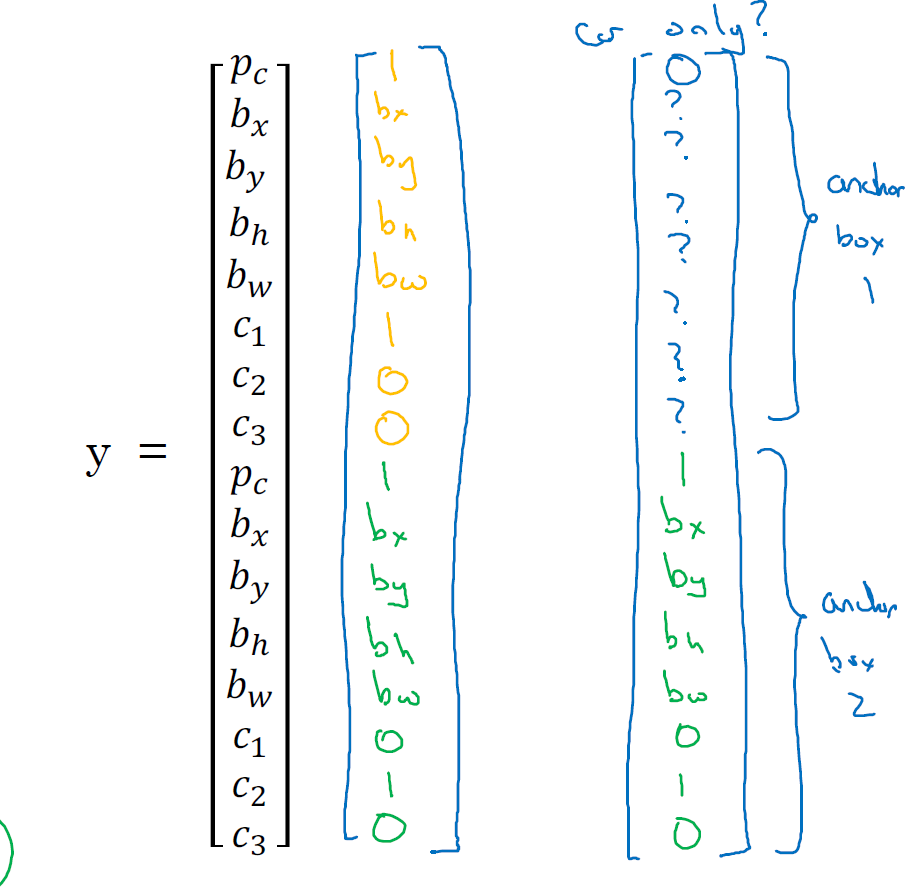

What if you have two anchor boxes but three objects in the same grid cell? That's one case that this algorithm doesn't handle well. Hopefully, it won't happen. But if it does, this algorithm doesn't have a great way of handling it. I will just influence some default tiebreaker for that case.

What if you have two objects associated with the same grid cell, but both of them have the same anchor box shape? Again, that's another case that this algorithm doesn't handle well. If you influence some default way of tiebreaking if that happens, hopefully this won't happen with your data set, it won't happen much at all. And so, it shouldn't affect performance as much.

Even though I'd motivated anchor boxes as a way to deal with what happens if two objects appear in the same grid cell, in practice, that happens quite rarely, especially if you use a 19 by 19 rather than a 3 by 3 grid. The chance of two objects having the same midpoint rather these 361 cells, it does happen, but it doesn't happen that often. Maybe even better motivation or even better results that anchor boxes gives you is it allows your learning algorithm to specialize better. 

In particular, if your data set has some tall, skinny objects like pedestrians, and some wide objects like cars, then this allows your learning algorithm to specialize so that some of the outputs can specialize in detecting wide, fat objects like cars, and some of the output units can specialize in detecting tall, skinny objects like pedestrians.

Finally, how do you choose the anchor boxes?

People used to just choose them by hand or choose maybe 5 or 10 anchor box shapes that spans a variety of shapes that seems to cover the types of objects you seem to detect. As a much more advanced version, just in the advance common for those of who have other knowledge in machine learning, and even better way to do this in one of the later YOLO research papers, is to use a K-means algorithm, to group together two types of objects shapes you tend to get and then to use that to select a set of anchor boxes that this most stereotypically representative of the maybe multiple, of the maybe dozens of object classes you're trying to detect. But that's a more advanced way to automatically choose the anchor boxes. If you just choose by hand a variety of shapes that reasonably expands the set of object shapes, you expect to detect some tall, skinny ones, some fat, white ones. That should work with these as well.

Anchor boxes are predefined bounding box shapes (stored in the model) that help the network predict objects of different sizes and shapes.

They are like “templates” for bounding boxes.

Suppose your dataset has:
* tall objects → people
* wide objects → cars

A single predicted box shape cannot detect both correctly.

So we give each grid cell two anchor boxes:

* A tall, skinny anchor (for people)
* A wide, short anchor (for cars)

The network then predicts how to adjust each anchor box (using bx, by, bw, bh) to fit the actual object exactly.

Without anchor boxes:

Each grid cell can predict only one bounding box. But real images may have:
* a person standing
* a car next to them
* maybe a dog too
→ all inside the same grid cell!

With anchor boxes:

A grid cell can make multiple predictions, e.g.:
* Anchor 1 → predicts "person"
* Anchor 2 → predicts "car"

Each anchor is a different shape, so the model learns to use the one that fits best.

Important: Anchor Boxes DO NOT Replace Bounding Box Coordinates

They are only starting shapes.

YOLO still predicts offsets:

bx, by, bw, bh

These tell the network:
* how far to move the anchor center
* how much to stretch or shrink the anchor box

Anchor boxes ≠ final bounding boxes

They are templates → the network adjusts them.

## YOLO Algorithm
### Training
Suppose you're trying to train an algorithm to detect three objects: pedestrians, cars, and motorcycles. And you will need to explicitly have the full background class, so just the class labels here.

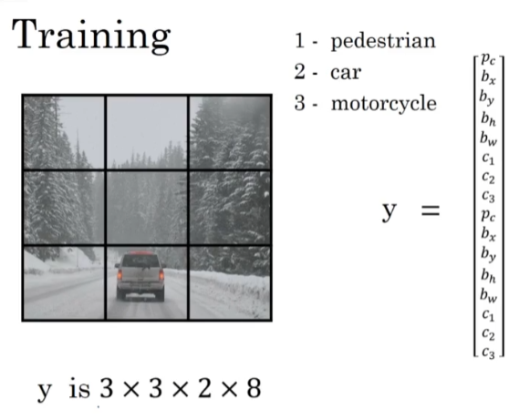

If you're using two anchor boxes, then the outputs y will be three by three because you are using three by three grid cell, by two, this is the number of anchors, by eight because that's the dimension of this. Eight is actually five which is plus the number of classes. Five because you have Pc and then the bounding boxes, that's five, and then C1, C2, C3. That dimension is equal to the number of classes.

You can either view this as three by three by two by eight, or by three by three by sixteen.

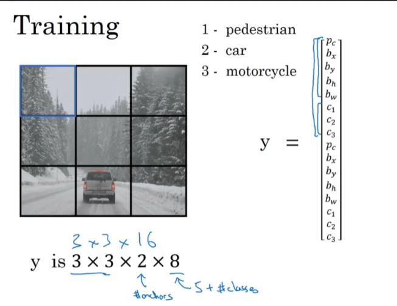

To construct the training set, you go through each of these nine grid cells and form the appropriate target vector y.

Take this first grid cell, there's nothing worth detecting in that grid cell. None of the three classes pedestrian, car and motocycle, appear in the upper left grid cell and so, the target y corresponding to that grid cell would be equal to this. 

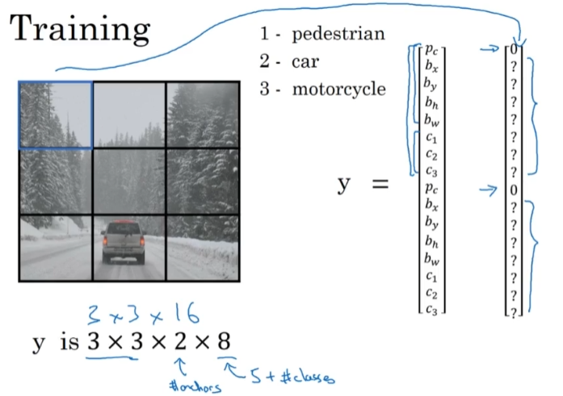

Where Pc for the first anchor box is zero because there's nothing associated for the first anchor box, and is also zero for the second anchor box and so on all of these other values are don't cares. 

Most of the grid cells have nothing in them, but for that box over there, you would have this target vector y. So assuming that your training set has a bounding box like this for the car, it's just a little bit wider than it's tall.

If your anchor boxes are as below:

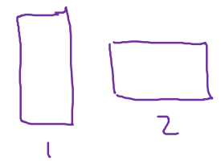

Then the red box has just slightly higher IoU with anchor box two. And so, the car gets associated with this lower portion of the vector.

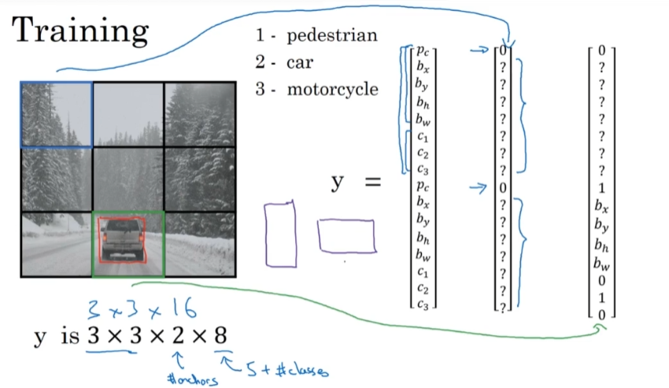

Notice then that Pc associate anchor box 1 is 0. So you have don't cares all these components. Then you have this Pc is equal to one, then you should use bx, by, bh, bw from anchor box 2 in vector y to specify the position of the red bounding box, and then specify that the correct object is class 2.


You go through this and for each of your nine grid positions each of your three by three grid positions, you would come up with a 16 dimensional vector. And so, that's why the final output volume is going to be 3 by 3 by 16.

As usual for simplicity on the slide I've used a 3 by 3 the grid. 

In practice it might be more like a 19 by 19 by 16. Or in fact if you use more anchor boxes, maybe 19 by 19 by 5 x 8 because five times eight is 40. So it will be 19 by 19 by 40. That's if you use five anchor boxes.

That's training and you train ConvNet that inputs an image, maybe 100 by 100 by 3, and your ConvNet would then finally output an output volume in our example, 3 by 3 by 16 or 3 by 3 by 2 by 8. 

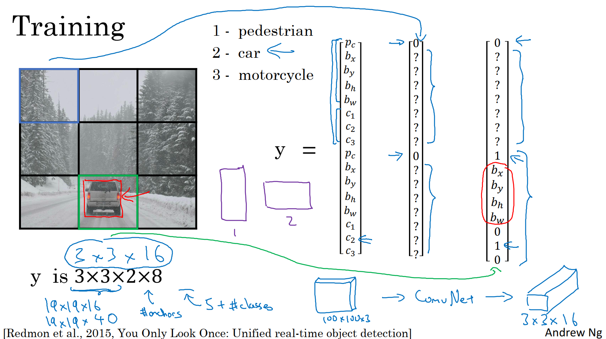

### Making predictions
Given an image, your neural network will output this by 3 by 3 by 2 by 8 volume, where for each of the nine grid cells you get a vector like that. So for the grid cell here on the upper left, if there's no object there, hopefully, your neural network will output 0 in the first pc, and 0 in the second pc, and it will output some other values. Your neural network can't output a question mark, can't output a don't care. So I'll put some numbers for the rest. But these numbers will basically be ignored because the neural network is telling you that there's no object there. So it doesn't really matter whether the output is a bounding box or there's is a car. So basically just be some set of numbers, more or less noise.

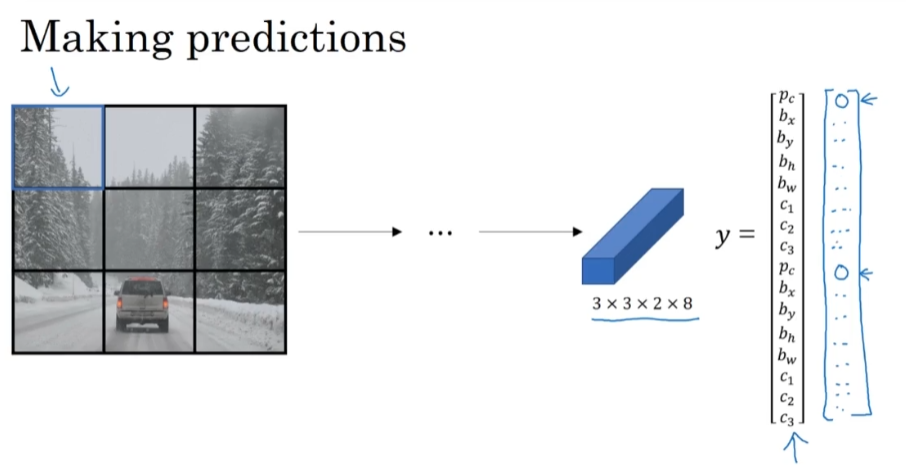

In contrast, for the box with object hopefully, the value of y to the output for that box at the bottom left, hopefully would be something like zero for bounding box one. And then just open a bunch of numbers, just noise. Hopefully, you'll also output a set of numbers that corresponds to specifying a pretty accurate bounding box for the car.

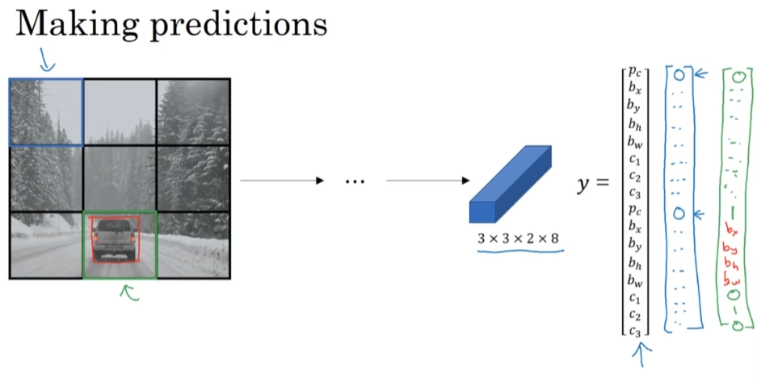

### Outputting the non-max supressed outputs
Finally, you run this through non-max suppression. 

Let's look at the new test set image. Here's how you would run non-max suppression.

* If you're using two anchor boxes, then for each of the non-grid cells, you get two predicted bounding boxes. Some of them will have very low probability, very low Pc, but you still get two predicted bounding boxes for each of the nine grid cells. And notice that some of the bounding boxes can go outside the height and width of the grid cell that they came from. 
* Next, you then get rid of the low probability predictions. So get rid of the ones that even the neural network says, gee this object probably isn't there.
* Finally if you have three classes you're trying to detect, you're trying to detect pedestrians, cars and motorcycles. What you do is, for each of the three classes, independently run non-max suppression for the objects that were predicted to come from that class. But use non-max suppression for the predictions of the pedestrians class, run non-max suppression for the car class, and non-max suppression for the motorcycle class. But run that basically three times to generate the final predictions.

The output of this is hopefully that you will have detected all the cars and all the pedestrians in this image.

He divides the image into 9 cells:

```
+---+---+---+
| C | C | C |
+---+---+---+
| C | C | C |
+---+---+---+
| C | C | C |
+---+---+---+
```

Each cell is responsible for detecting objects whose center lies in that cell.

In his example picture:

There is a car located in the middle-bottom cell.

So that grid cell must output the detection.

Problem:

An object can have different shapes (tall + thin, short + wide, etc.)

Solution:

For each grid cell, YOLO predicts multiple bounding boxes, each corresponding to a different shape pattern.

These patterns are called anchor boxes.

Andrew uses 2 anchor boxes per cell:
* Anchor 1: tall, thin
* Anchor 2: wide, short

This means each grid cell predicts two possible objects.

Each anchor box predicts 8 numbers:

1. pc — is there an object?
2. bx — x center
3. by — y center
4. bh — height
5. bw — width
6. class probabilities (3 classes in video): cat, car, pedestrian

→ 3 numbers

Total = 8 numbers.

So the prediction for one anchor box is:
```
[ pc, bx, by, bh, bw, c1, c2, c3 ]
```

That's 8 numbers per anchor.

Each cell has:
* 2 anchor boxes
* 8 numbers per anchor box

So per cell:

2 × 8 = 16 numbers

Grid is 3×3
Each grid cell predicts 2 anchors × 8 numbers

Total tensor shape:

3 × 3 × 2 × 8

Meaning:
* 3×3 = number of grid cells
* 2 = number of anchor boxes per cell
* 8 = information predicted per anchor box

3 × 3: The image is split into 9 regions.

× 2: Each region predicts two possible bounding boxes (using two anchor shapes).

× 8: Each predicted box includes:
* pc
* bx
* by
* bh
* bw
* class1
* class2
* class3

That makes 8 numbers.
```
Grid cell (i,j):
    Anchor box 1 → [8 numbers]
    Anchor box 2 → [8 numbers]
```

So each cell literally has:

```
[
  [pc, bx, by, bh, bw, c1, c2, c3],   ← anchor 1
  [pc, bx, by, bh, bw, c1, c2, c3]    ← anchor 2
]
```

YOLO chooses the anchor whose shape (aspect ratio) best matches the ground truth box.

So for the car:
* If the car is wide → the "wide" anchor box is assigned
* If the car is tall → the "tall" anchor box is assigned

Only one anchor box per cell is responsible for each object.

This is why we need anchors.

Step 1 — YOLO outputs many boxes

From the grid 3×3 and 2 anchors per cell:

→ total 3 × 3 × 2 = 18 predicted boxes
Each box has:

probability pc

class probabilities

bounding box coordinates

So YOLO outputs 18 box predictions.

Step 2 — For each class, YOLO filters boxes

YOLO computes a confidence score = pc × class probability.

Then it filters the boxes by class:

Example:
For Car:

You may end up with e.g. 5 boxes that say “car with high confidence”.

For Pedestrian:

Maybe 3 boxes predict “pedestrian”.

For Motorcycle:

Maybe 2 boxes predict “motorcycle”.

So YOLO now has 3 groups of predictions — one per class.

NMS must be run per class, not globally

This is the key idea:

You do NOT run NMS across all classes at once.

Because a pedestrian box should not suppress a car box.

You run a separate NMS for:
* all pedestrian boxes
* all car boxes
* all motorcycle boxes

That means 3 independent NMS passes.

That is why Andrew says:

"We run non-max suppression once per class."

Because bounding boxes of different classes should NOT eliminate each other.

Example:

Imagine YOLO predicts:
* A “car” box over the car
* A “pedestrian” box on the sidewalk near the car

If you accidentally ran NMS across ALL boxes:

The high-confidence car box might delete the pedestrian box
because their IoU overlaps.

This would be a terrible mistake.

Therefore:

NMS must only compare boxes of the same class.

IoU measures how much two boxes overlap.
* Big overlap → high IoU
* Small overlap → low IoU

Non-Max Suppression:
* Keep the highest confidence box
* Remove other boxes with high IoU (duplicates)
* Repeat

→ You end up with one box per object.

## Region Proposals (Optional)
### Region proposal: R-CNN
If you recall the sliding windows idea, you would take a train crossfire and run it across all of these different windows and run the detector to see if there's a car, pedestrian, or maybe a motorcycle.

You could run the algorithm convolutionally, but one downside that the algorithm is it just classifies a lot of the regions where there's clearly no object. So this rectangle down here is pretty much blank. It's clearly nothing interesting there to classify, and maybe it was also running it on this rectangle, which look likes there's nothing that interesting there.

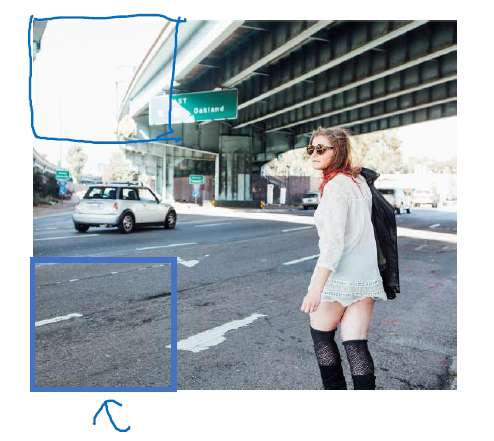

Russ Girshik, Jeff Donahue, Trevor Darrell, and Jitendra Malik proposed in the paper, an algorithm called R-CNN, which stands for Regions with convolutional networks or regions with CNNs.

What that does is it tries to pick just a few regions that makes sense to run your continent classifier. So rather than running your sliding windows on every single window, you instead select just a few windows, and run your continent crossfire on just a few windows.

The way that they perform the region proposals is to run an algorithm called a segmentation algorithm, that results in this output 

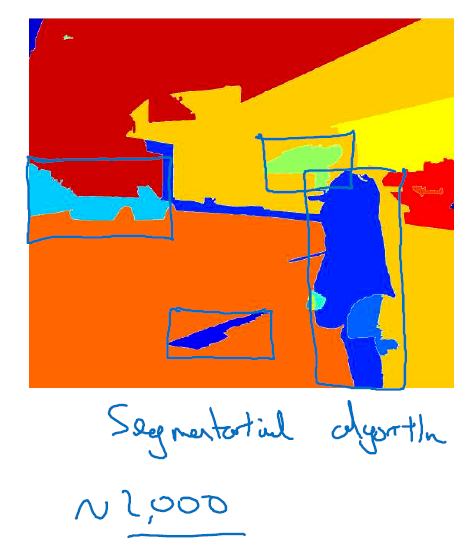

In order to figure out what could be objects.

For example, the segmentation algorithm finds a blob over here. And so you might pick that pounding balls and say, "Let's run a classifier on that blob." It looks like this little green thing finds a blob there, as you might also run the classifier on that rectangle to see if there's some interesting there. This blue blob, if you run a classifier on that, hope you find the pedestrian, and if you run it on this light cyan blob, maybe you'll find a car, maybe not,. I'm not sure.

The details of this, this is called a segmentation algorithm, and what you do is you find maybe 2000 blobs and place bounding boxes around about 2000 blobs and value classifier on just those 2000 blobs, and this can be a much smaller number of positions on which to run your continent classifier, then if you have to run it at every single position throughout the image.

This is a special case if you are running your continent not just on square-shaped regions but running them on tall skinny regions to try to find pedestrians or running them on your white fat regions try to find cars and running them at multiple scales as well.

It turns out the R-CNN algorithm is still quite slow. So there's been a line of work to explore how to speed up this algorithm. 

### Faster algorithms
R-CNN: Propose regions. Classify proposed regions one at a
time. Output label + bounding box.

The basic R-CNN algorithm with proposed regions using some algorithm and then crossfire the proposed regions one at a time. And for each of the regions, they will output the label. So is there a car? Is there a pedestrian? Is there a motorcycle there? And then also outputs a bounding box, so you can get an accurate bounding box if indeed there is a object in that region. So just to be clear, the R-CNN algorithm doesn't just trust the bounding box it was given. It also outputs a bounding box, bx, by, bh, bw, in order to get a more accurate bounding box and whatever happened to surround the blob that the image segmentation algorithm gave it. So it can get pretty accurate bounding boxes. 

One downside of the R-CNN algorithm was that it is actually quite slow. So over the years, there been a few improvements to the R-CNN algorithm.

Fast R-CNN: Propose regions. Use convolution implementation
of sliding windows to classify all the proposed
regions.

Russ Girshik proposed the fast R-CNN algorithm, and it's basically the R-CNN algorithm but with a convolutional implementation of sliding windows. So the original implementation would actually classify the regions one at a time. So Fast R-CNN use a convolutional implementation of sliding windows, and this is roughly similar to the idea you saw in the fourth video of this week. And that speeds up R-CNN quite a bit. 

Faster R-CNN: Use convolutional network to propose regions.

It turns out that one of the problems of Fast R-CNN algorithm is that the clustering step to propose the regions is still quite slow and so a different group, Shaoqing Ren, Kaiming He, Ross Girshick, and Jian Son, proposed the Faster R-CNN algorithm, which uses a convolutional neural network instead of one of the more traditional segmentation algorithms to propose a blob on those regions, and that wound up running quite a bit faster than the fast R-CNN algorithm. Although, I think the Faster R-CNN algorithm, most implementations are usually still quite a bit slower than the YOLO algorithm.

The idea of region proposals has been quite influential in computer vision, and I wanted you to know about these ideas because you see others still used these ideas, for myself, and this is my personal opinion, not the opinion of the computer vision research committee as a whole. I think that we can propose an interesting idea but that not having two steps, first, proposed region and then classify it, being able to do everything more or at the same time, similar to the YOLO or the You Only Look Once algorithm that seems to me like a more promising direction for the long term. But that's my personal opinion and not necessary the opinion of the whole computer vision research committee. So feel free to take that with a grain of salt. 

## Semantic Segmentation with U-Net
Semantic Segmentation is used to draw a careful outline around the object that is detected so that you know exactly which pixels belong to the object and which pixels don't. 

### Object Detection vs. Semantic Segmentation
Let's say you're building a self-driving car and you see an input image like this and you'd like to detect the position of the other cars.

If you use an object detection algorithm, the goal may be to draw bounding boxes around the other vehicles.

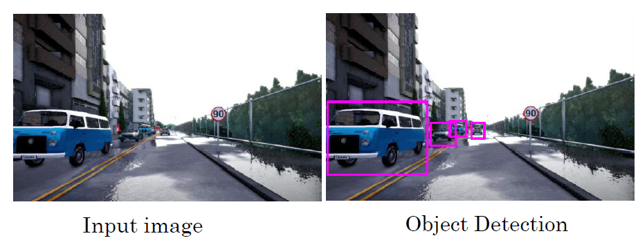

This might be good enough for self-driving car, but if you want your learning algorithm to figure out what is every single pixel in this image, then you may use a semantic segmentation algorithm whose goal is to output this.

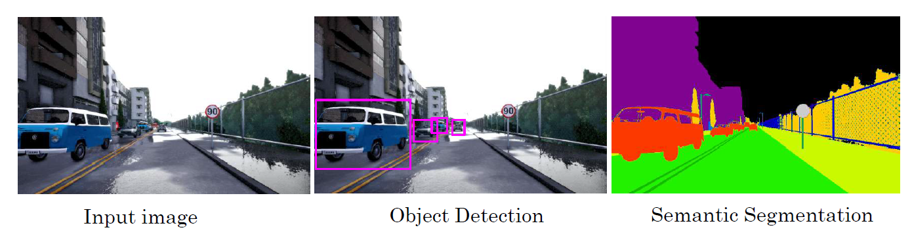

Where, for example, rather than detecting the road and trying to draw a bounding box around the roads, which isn't going to be that useful, with semantic segmentation the algorithm attempts to label every single pixel as is this drivable roads or not, indicated by the dark green there.

One of the uses of semantic segmentation is that it is used by some self-driving car teams to figure out exactly which pixels are safe to drive over because they represent a drivable surface. 

### Motivation for U-Net
Let's look at some other applications. These are a couple of images from research papers by Novikov et al and by Dong et al. 

In medical imaging, given a chest X-ray, you may want to diagnose if someone has a certain condition, but what may be even more helpful to doctors, is if you can segment out in the image, exactly which pixels correspond to certain parts of the patient's anatomy.

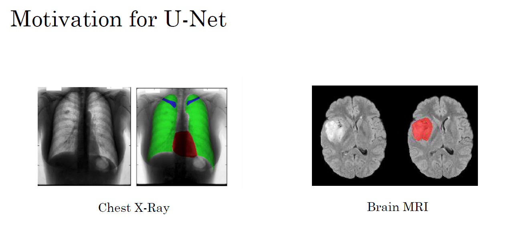

In the image on the left, the lungs, the heart, and the clavicle, so the collarbones are segmented out using different colors. This segmentation can make it easier to spot irregularities and diagnose serious diseases and also help surgeons with planning out surgeries.

In the example on the right, a brain MRI scan is used for brain tumor detection. Manually segmenting out this tumor is very time-consuming and laborious, but if a learning algorithm can segment out the tumor automatically; this saves radiologists a lot of time and this is a useful input as well for surgical planning.

The algorithm used to generate this result is an algorithm called U-Net.

### Per-pixel class labels
Let's use the example of segmenting out a car from some background.

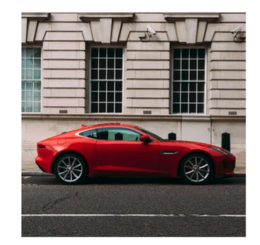

Let's say for now that the only thing you care about is segmenting out the car in this image.

In that case, you may decide to have two class labels. 
* 1 for a car
* 0 for not car.

In this case, the job of the segmentation algorithm of the U-Net algorithm will be to output, either 1 or 0 for every single pixel in this image, where a pixel should be labeled 1, if it is part of the car and label 0 if it's not part of the car. 

Alternatively, if you want to segment this image, looking more finely you may decide that you want to label the car 1. Maybe you also want to know where the buildings are. In which case you would have a second class, class two the building and then finally the ground or the roads, class three, in which case the job the learning algorithm would be to label every pixel as follows instead.

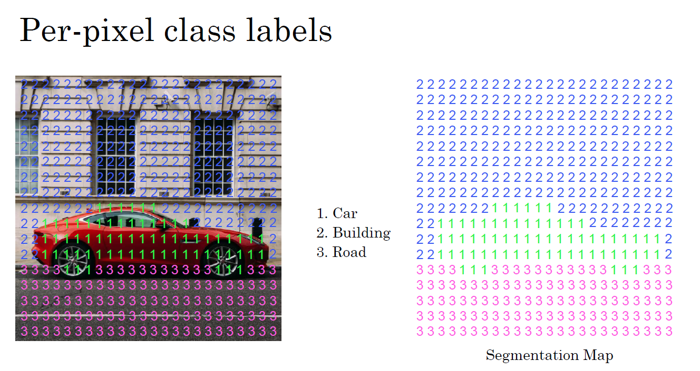

Taking the per-pixel labels and shifting it to the right, this is the output that we would like to train a unit table to give.

This is a lot of outputs, instead of just giving a single class label or maybe a class label and coordinates needed to specify bounding box the neural network uni


What's the right neural network architecture to do that?

### Deep Learning for Semantic Segmentation
Let's start with the object recognition neural network architecture that you're familiar with and let's figure how to modify this in order to make this new network output, a whole matrix of class labels.

Here's a familiar convolutional neural network architecture, where you input an image which is fed forward through multiple layers in order to generate a class label y hat.

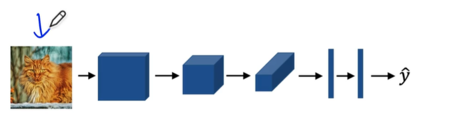

In order to change this architecture into a semantic segmentation architecture, let's get rid of the last few layers and one key step of semantic segmentation is that, whereas the dimensions of the image have been generally getting smaller as we go from left to right, it now needs to get bigger so they can gradually blow it back up to a full-size image, which is a size you want for the output. 

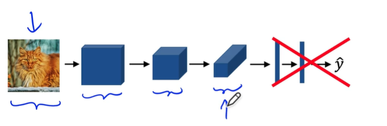

Specifically, this is what a U-Net architecture looks like. As we go deeper into the U-Net, the height and width will go back up while the number of channels will decrease so the unit architecture looks like this until eventually, you get your segmentation map of the cat.

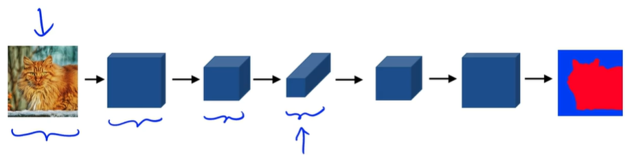

One operation we have not yet covered is what does this look like to make the image bigger?

To explain how that works, you have to know how to implement a transpose convolution.

That's semantic segmentation, a very useful algorithm for many computer vision applications where the key idea is you have to take every single pixel and label every single pixel individually with the appropriate class label. As you've seen in this video, a key step to do that is to take a small set of activations and to blow it up to a bigger set of activations.

In order to do that, you have to implement something called the transpose convolution, which is important operation that is used multiple times in the unit architecture.

Semantic segmentation means:

Predict a label for every pixel of an image.

Example:
* Every pixel that belongs to a cat → label 1
* Every pixel that belongs to the background → label 0

So the output is not a single number or a bounding box —
it is a full image of labels the same size as the input.

The goal of U-Net is:
* Understand what is in the image
* Understand where it is
* Output a mask (pixel-wise map)

U-Net is especially good when:
* You have small datasets (medical imaging, satellite images)
* You need very accurate boundaries (e.g., tumor outline)

## Transpose Convolutions
Transpose Convolutions is part of the U-Net architecture. It helps by taking a 2x2 inputs and blowing it up into a 4x5 dimensional output.

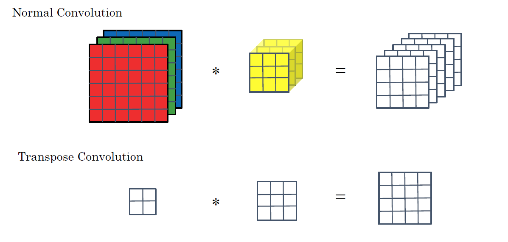

You're familiar with the normal convolution in which a typical layer of a new network may input a 6x6x3 image, convolve that with a set of, say, 3x3x3 filters and if you have 5 of these, then you end up with an output that is 4x4x5.

A transpose convolution looks a bit difference. You might inputs a 2x2, said that activation, convolve that with a 3x3 filter, and end up with an output that is 4x4, that's bigger than the original inputs. 

For example:
* Input: 2x2
* Output: 4x4
* Filter: 3x3 (fxf)
* Padding: p=1
* Stride: s=2

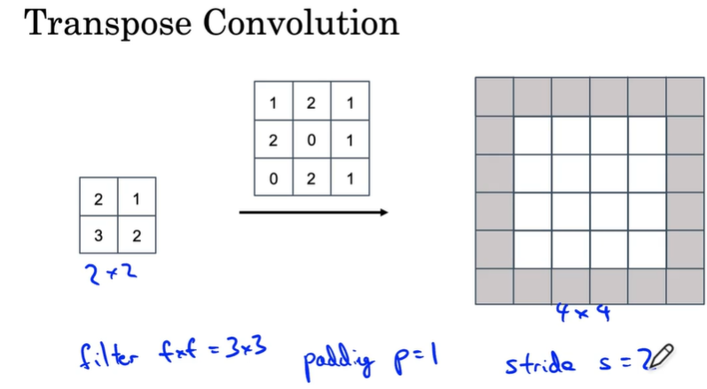

In the regular convolution, you would take the filter and place it on top of the inputs and then multiply and sum up. 

In the transpose convolution, instead of placing the filter on the input, you would instead place a filter on the output.

Let's starts with this upper left entry of the input, which is a 2. We are going to take this number 2 and multiply it by every single value in the filter and we're going to take the output which is 3x3 and paste it in this position.

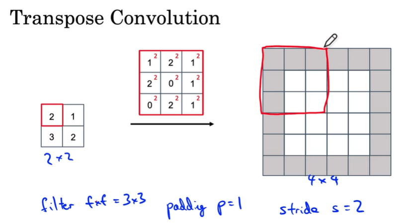

Now, the padding area isn't going to contain any values. What we're going to end up doing is ignore this paddy region and just throw in 4 values in the red highlighted area and specifically, the upper left entry is 0 times 2, so that's 0. The second entry is 1 times 2, that is 2. Down here is 2 times 2, that's 4, and then over here is 1 times 2 so that's equal to 2.

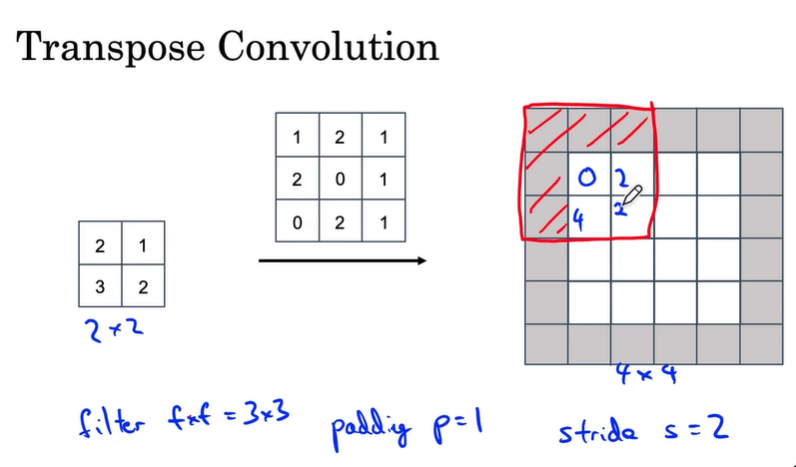

Next, let's look at the second entry of the input which is a 1. I'm going to switch to green pen for this. Once again, we're going to take a 1 and multiply by one every single elements of the filter, because we're using a stride of 2, we're now going to shift to box in which we copy the numbers over by 2 steps. Again, we'll ignore the area which is in the padding and the only area that we need to copy the numbers over is this green shaded area. 

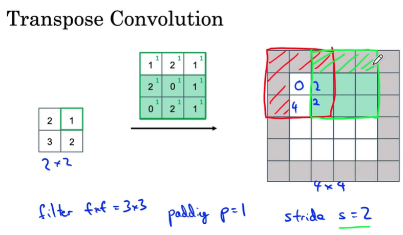

You may notice that there is some overlap between the places where we copy the red-colored version of the filter and the green version and we cannot simply copy the green value over the red one. Where the red and the green boxes overlap, you add 2 values together.

Where there's already a 2 from the first weighted filter, you add to it this first value from the green region which is also 2. You end up with 2 plus 2. The next entry, 0 times 1 is 0, then you have 1, 2 plus 0 times 1, so 2 plus 0 followed by 2, followed by 1 and again, we shifted 2 squares over from the red box here to the green box here because it using a stride of 2.

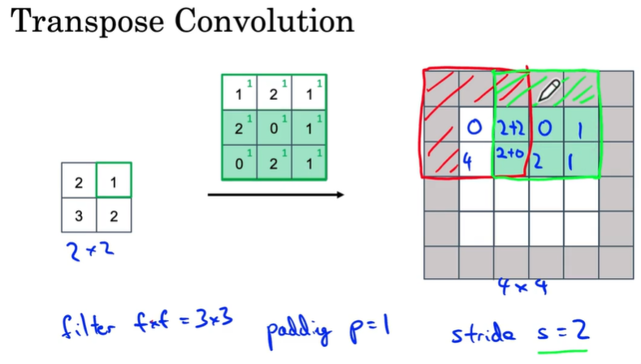

Next, let's look at the lower-left entry of the input, which is 3.We'll take the filter, multiply every element by 3 and we've gone down by 1 step here. We're going to go down by 2 steps here. We will be filling in our numbers in this 3x3 square and you find that the numbers you copying over are 2 times 3, which is 6, 1 times 3, which is 3, 0 times 3, which is 0, and so on, 3, 6, 3.

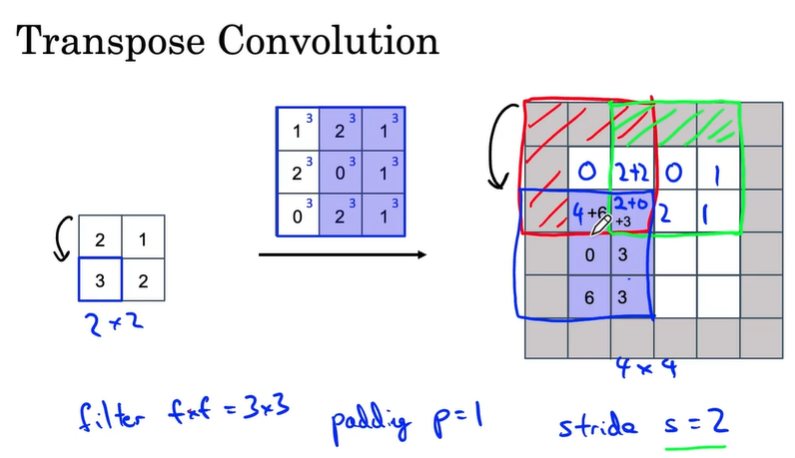

Then lastly, let's go into the last input element, which is 2. We will multiply every elements of the filter by 2 and add them to this block and you end up with adding 1 times 2 which is plus 2, and so on for the rest of the elements.

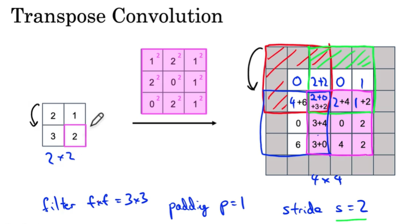

The final step is to take all the numbers in these 4x4 matrix of values in the 16 values and add them up.

You end up with 0 here, 2 plus 2 is 4, 0, 1, 4 plus 6 is 10, 2 plus 0 plus 3 plus 2 is 7, 2 plus 4 is 6. There is 0, 3 plus 4 was 7, 0, 2, 6, 3 plus 0 was 3, 4, 2, hence that's your 4x4 outputs.

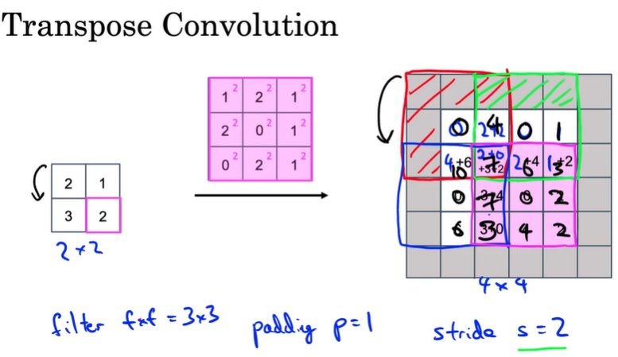

In case you're wondering why do we have to do it this way, I think there are multiple possible ways to take small inputs and turn it into bigger outputs, but the transpose convolution happens to be one that is effective and when you learn all the parameters of the filter here, this turns out to give good results when you put this in the context of the U-Net which is the learning algorithm will use now.

In this video, we step through step-by-step how the transpose convolution lets you take a small input, say 2x2, and blow it up into larger output, say 4x4. 

## U-Net Architecture Intuition

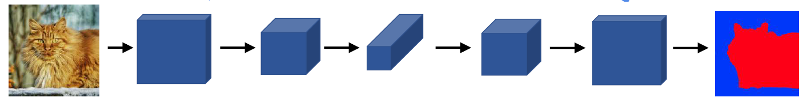

Here's a rough diagram of the neural network architecture for semantic segmentation. And so we use normal convolutions for the first part of the neural network. This part of the neural network will sort of compress the image. You've gone from a very large image to one where the heightened whiff of this activation is much smaller. So you've lost a lot of spatial information because the dimension is much smaller, but it's much deeper.

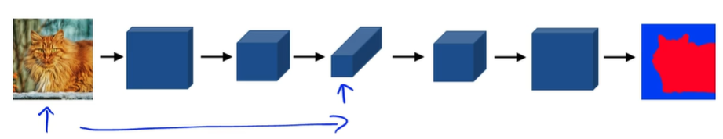

So, for example, this middle layer may represent that looks like there's a cat roughly in the lower right hand portion of the image. But the detailed spatial information is lost because of heightened with is much smaller.

Then the second half of this neural network uses the transpose convolution to blow the representation size up back to the size of the original input image.

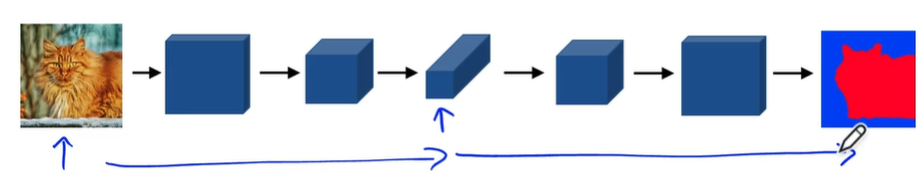

It turns out that there's one modification to this architecture that would make it work much better. And that's what we turn this into the unit architecture, which is that skip connections from the earlier layers to the later layers like this.

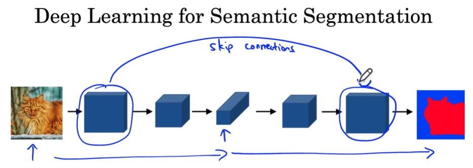

So that this earlier block of activations is copied directly to this later block.

Why do we want to do this?

It turns out that for this, next final layer to decide which region is a cat. Two types of information are useful.
* One is the high level, spatial, high level contextual information which it gets from this previous layer. Where hopefully the neural network, we have figured out that in the lower right hand corner of the image or maybe in the right part of the image, there's some cat like stuff going on. But what is missing is a very detailed, fine grained spatial information. Because this set of activations here has lower spatial resolution to heighten with is just lower.
* 
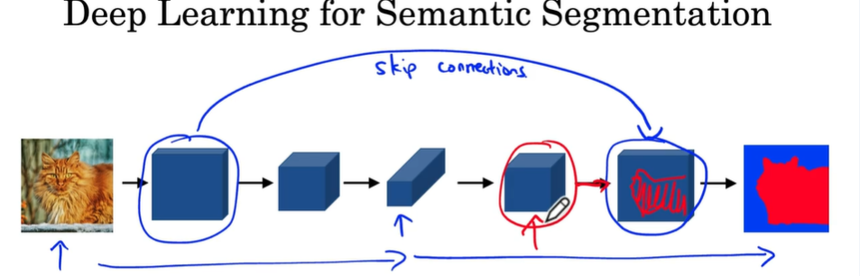

So what the skip connection does is it allows the neural network to take this very high resolution, low level feature information where it could capture for every pixel position, how much fairly stuff is there in this pixel? And used to skip connection to pause that directly to this later layer. And so this way this layer has both the lower resolution, but high level, spatial, high level contextual information, as well as the low level. But more detailed texture like information in order to make a decision as to whether a certain pixel is part of a cat or not. 

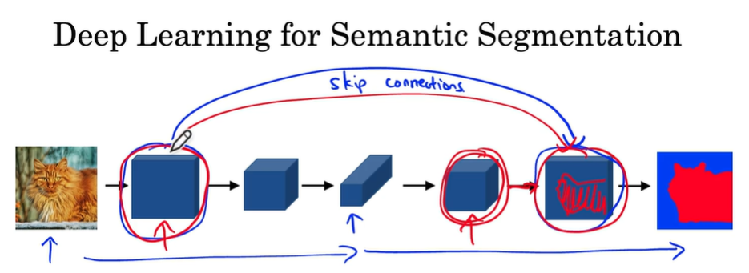

In the downward path, the image is made smaller:

256×256 → 128×128 → 64×64 → 32×32 → 16×16 …

When you shrink an image:
* you lose spatial detail
* thin edges disappear
* small objects get blurred
* exact pixel location information is lost

So by the time the network reaches the bottom (the bottleneck), it knows:

“There is a cat and a dog here” but it does not know: “Exactly which pixels belong to which animal.”

When you go back up (upsampling), you try to reconstruct the full mask.

But because you lost fine details earlier, the upsampled image can look:
* blurry
* chunky
* imprecise around edges
* missing details like legs, tails, object boundaries

This is why early segmentation models produced “blobby” masks.

When the image is still large (e.g., 256×256, 128×128), you still have beautiful high-resolution spatial detail.

Skip connections copy that detail and send it directly to the upsampling path.

So U-Net combines:

1. What the image contains
(learned in the bottleneck → semantic meaning)

2. Exactly where things are
(from early layers → spatial detail)

Imagine you want to draw a coloring-book outline:

The encoder (down path) learns:
“This picture has a cat, here’s the shape.”

The decoder (up path) tries to redraw it
but only based on rough ideas.

Without skip connections → the picture becomes blurry.

Skip connections are like tracing paper:

You give the decoder the original outline so it can draw sharp boundaries again.

Without skip connection:
```
Input → shrink → shrink → shrink → expand → expand → output mask
      (details lost)                  (can’t recover details)
```

With skip connection:
```
Input → shrink → shrink → shrink → expand → expand → output mask
   |______________________________↗
        (send details across)
```

The early “big image” features are CONCATENATED with the upsampled features.

Because segmentation needs pixel-level accuracy:
* drawing exact edges
* separating touching objects
* preserving thin structures (like roads, blood vessels, cell walls)

The downsampling path alone cannot recover this detail.

Skip connections “bring back the lost detail”.

A skip connection is simply:

Copy the data and send it forward along an extra shortcut path — in addition to the main path.

So the data travels in both paths at the same time.

Imagine data is electricity:

Main wire:
```
A → B → C → D
```

Skip wire:
```
A ----------------> D
```

Electricity flows through both wires.
There is no decision.
Both signals reach D, and then D combines them.

That’s exactly how skip connections work.

Data flows through the main path

Convolution → ReLU → Pooling → Convolution → …

At the same time

A copy of the earlier features is forwarded to the later layer.

Later, the model adds or concatenates them.

No choosing.
No checking.
No decision.

Just copy + combine.

Because:
* The deep layers understand what is in the image
* The shallow layers remember where things are

The model needs both pieces of information to segment correctly.

## U-Net Architecture


This is what a U-Net looks like. 

This is also why it's called a U-Net, because when you draw it like this, it looks a lot like a U.

Fun fact, when they wrote the original unit paper, they were thinking of the application of biomedical image segmentation, really segmenting medical images. But these ideas turned out to be useful for many other computer vision, semantic segmentation applications as well.

The input to the unit is an image, let's say, is h by w by three, for three channels RGB channels. I'm going to visualize this image as a thin layer like that. I know that previously we had taken neural network layers and drawn them, as three D blocks like this, where this might be rise of h by w by three. 

Input: image h x w x 3 (3 channels). It's visualized as a thin layer as below

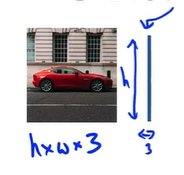

First part of the unit uses normal feed forward neural network convolutional layers. A black arrow is used to denote a convolutional layer, followed by a value activation function.

The next layer, we have increased the number of channels a little bit, but the dimension is still height by width by a little bit more channels and then another convolutional layer with another activation function.

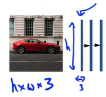

Now we're still in the first half of the neural network. We're going to use Max pooling to reduce the height and width. So maybe you end up with a set of activations where the height and width is lower, but maybe a sticker, so the number of channels is increasing.

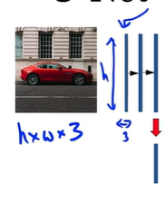

Then we have two more layers of normal feed forward convolutions with a ReLU activation function

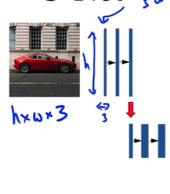

And then the supply Max pooling again.

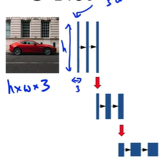

Repeat until you end up with this

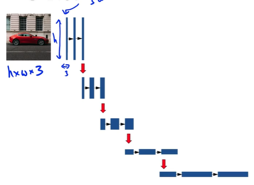

So far, this is the normal convolution layers with activation functions that you've been used to from earlier videos with occasional max pooling layers.

Notice that the height of this layer, height and width are now very small.

We're going to start to apply transpose convolution layers, which I'm going to note by the green arrow in order to build the dimension of this neural network back up.

With the first transpose convolutional layer or trans conv layer, you're going to get a set of activations that looks like that.

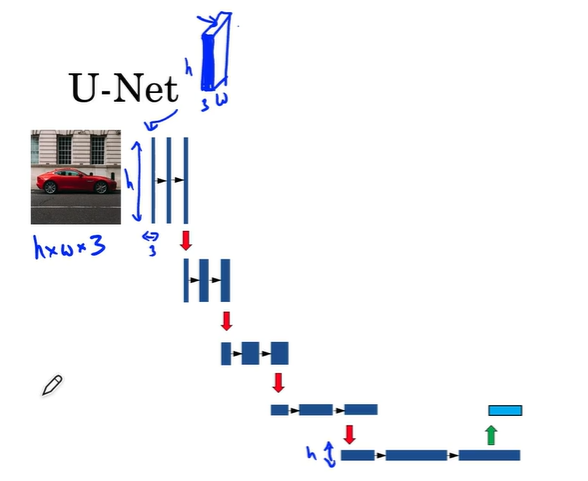

In this example, we did not increase the height and width, but we did decrease the number of channels.

There's one more thing you need to do to build a U-Net, which is to add in that skip connection which I'm going to denote with this grey arrow.

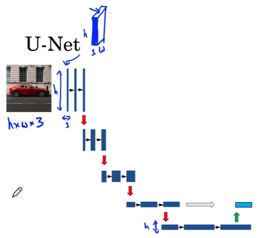

What the skip connection does is it takes this set of activations and just copies it over to the right.

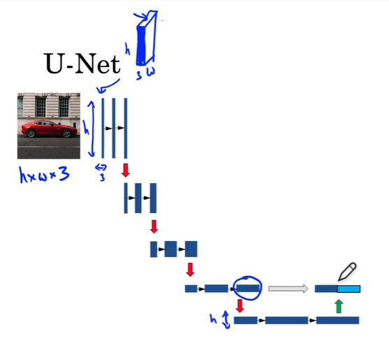

And so the set of activations you end up with is like this.

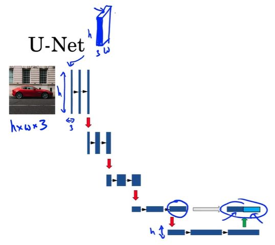

The light blue part comes from the transpose convolution, and the dark blue part is just copied over from the left.

To keep on building up the U-Net we are going to then apply a couple more layers of the regular convolutions, followed by our value activation function so denoted by the black arrows, like so, 

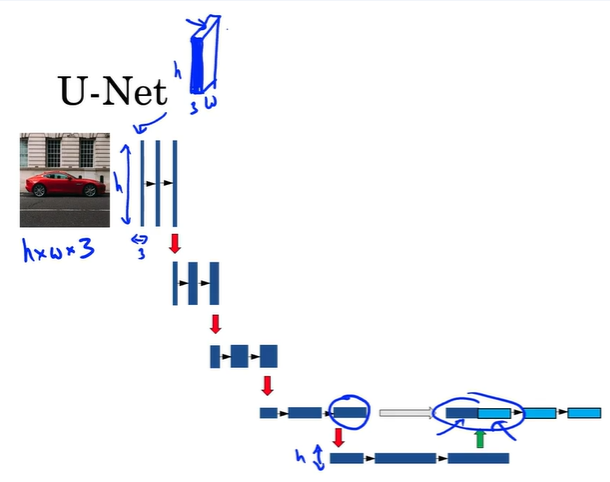

Then we apply another transpose convolutional layer. So green arrow and here we're going to start to increase the dimension, increase the height and width of this image.

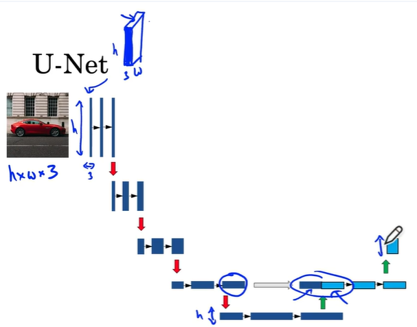

So now the height is getting bigger. But here, too, we're going to apply a skip connection. So there's a grey arrow again where they take this set of activations and just copy it right there, over to the right.

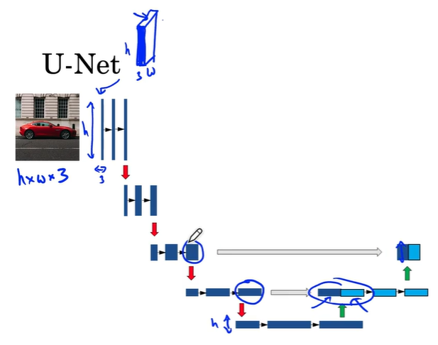

More convolutional layers and other transpose convolution, skip connection. Once again, we're going to take this set of activations and copy it over to the right.

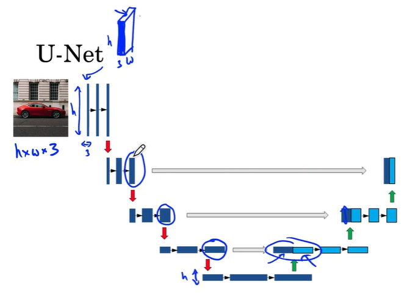

And then more convolutional layers, followed by another transpose convolution. Skip connection, copy that over. 

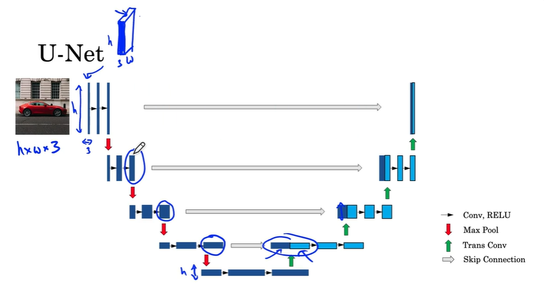

Now we're back to a set of activations that is the original input images, height and width.
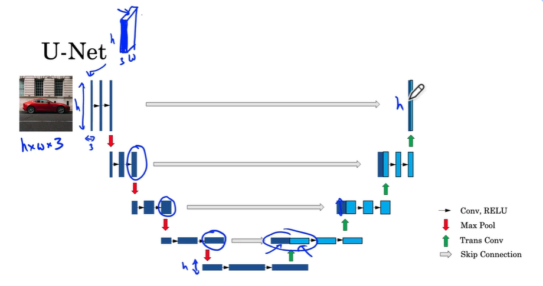


We're going to have a couple more layers of a normal fee dforward convolutions.

Then finally, to take this and map this to our segmentation map, we're going to use a one by one convolution which I'm going to denote with that magenta arrow to finally give us this which is going to be our output.

The dimensions of this output layer is going to be h by w, so the same dimensions as our original input by num classes.

So if you have three classes to try to recognize, this will be 3. If you have 10 different classes to try to recognize in your segmentation at then that last number will be 10.

What this does is for every one of your pixels you have h by w pixels you have, an array or a vector, essentially of n classes numbers that tells you for our pixel how likely is that pixel to come from each of these different classes.

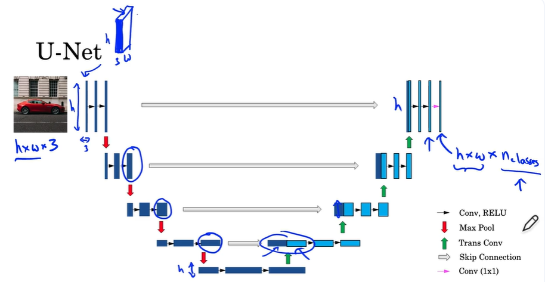

If you take a arg max over these n classes, then that's how you classify each of the pixels into one of the classes, and you can visualize it like the segmentation map showing on the right. So that's it. 

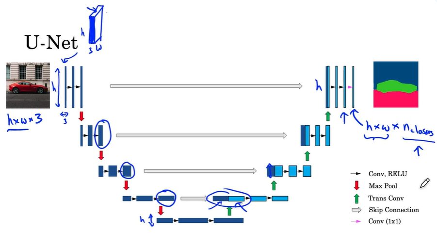

U-Net is a neural network used for semantic segmentation:

It predicts a label for every single pixel of an image.

Example:
Given a medical image of a tumor → it outputs a mask showing which pixels are tumor and which are healthy tissue.

U-Net is famous because it performs very well even with small datasets (like biomedical images).

Every image entering U-Net has shape:

```
Height × Width × Channels
e.g., 256 × 256 × 3
```

3 channels = RGB.

U-Net is made of two halves:
1. Contracting path (downsampling) → learns what is in the image
2. Expansive path (upsampling) → finds where things are in the image
3. Skip connections → help restore details between matching layers

This creates a shape that looks like a “U”.

**Contracting Path (left side)**

This part acts like a typical CNN classifier:

Each level contains:
* 2 convolution layers (e.g., Conv → ReLU → Conv → ReLU)
* 1 max pooling step (reduces image size)

What happens as we go down:
* The image gets smaller
* But the number of channels increases

Example:

```
256×256×3 → 128×128×64 → 64×64×128 → 32×32×256 → ...
```

Why?

Shrinking helps the network learn:
* shapes
* textures
* “what” objects exist
* high-level features

But shrinking destroys detailed spatial information — that’s why we need skip connections later.

**Expansive Path (right side)**

The right side does the opposite:
* It upsamples the image (makes it larger again)
* Uses transpose convolutions (sometimes called “deconvolutions”)
* Restores the image to its original size

Example:
```
32×32 → 64×64 → 128×128 → 256×256
```

This part answers:

“Where exactly is the tumor / object / segment?”

**Skip Connections (the horizontal arrows)**

These are the MOST important feature of U-Net.

As the image shrinks during the contracting path, we lose:
* sharp edges
* fine boundaries
* small details

So U-Net copies feature maps from the down path and directly sends them to the same-size layer in the up path.

This does NOT replace the main path. It simply adds extra information to help the decoder.

Why is this powerful?

Because the upsampling layers:
* recover lost details
* draw sharp boundaries
* combine abstract features + fine details

This is why the architecture is called U-Net — the two halves mirror each other and the skip connections form the horizontal bars of the “U”.

Output Layer (1×1 Convolution)

Finally, when the image is back to the original size (e.g., 256×256):
* U-Net applies a 1×1 convolution
* This converts the deep feature representation into the number of classes

Example:

For binary segmentation (object / background):
```
Output: 256×256×1
Each pixel has a probability between 0 and 1.
```

For multi-class segmentation (cat / dog / background):
```
Output: 256×256×3
Each channel is probability for each class.
```

1. CNN downsampling learns what the objects are.
2. Upsampling learns where they are.
3. Skip connections preserve details that normally get lost.
4. Works even with small datasets.
5. Great for precise pixel-level prediction.

This combination makes U-Net extremely popular in:
* Medical imaging
* Satellite imaging
* Road / building detection
* Cell structure segmentation
* Any task needing precise boundaries


