# Week 4: Special Applications: Face recognition & Neural Style Transfer

**Learning Objectives**
* Differentiate between face recognition and face verification
* Implement one-shot learning to solve a face recognition problem
* Apply the triplet loss function to learn a network's parameters in the context of face recognition
* Explain how to pose face recognition as a binary classification problem
* Map face images into 128-dimensional encodings using a pretrained model
* Perform face verification and face recognition with these encodings
* Implement the Neural Style Transfer algorithm
* Generate novel artistic images using Neural Style Transfer
* Define the style cost function for Neural Style Transfer
* Define the content cost function for Neural Style Transfer

- [Week 4: Special Applications: Face recognition \& Neural Style Transfer](#week-4-special-applications-face-recognition--neural-style-transfer)
  - [What is Face Recognition?](#what-is-face-recognition)
    - [Face recognition](#face-recognition)
    - [Face verification vs. face recognition](#face-verification-vs-face-recognition)
  - [One Shot Learning](#one-shot-learning)
    - [Learning a “similarity” function](#learning-a-similarity-function)
  - [Siamese network](#siamese-network)
    - [Goal of learning](#goal-of-learning)
  - [Triplet Loss](#triplet-loss)
    - [Learning Objective](#learning-objective)
    - [Loss function](#loss-function)
    - [Choosing the triplets A,P,N](#choosing-the-triplets-apn)
    - [Training set using triplet loss](#training-set-using-triplet-loss)
  - [Face verification and binary classification](#face-verification-and-binary-classification)
    - [Learning the similarity function](#learning-the-similarity-function)
    - [Face verification supervised learning](#face-verification-supervised-learning)
  - [What is Neural Style Transfer?](#what-is-neural-style-transfer)
    - [Neural style transfer](#neural-style-transfer)
  - [What are deep ConvNets learning?](#what-are-deep-convnets-learning)
    - [Visualizing what a deep network is learning](#visualizing-what-a-deep-network-is-learning)
    - [Visualizing deep layers](#visualizing-deep-layers)
  - [Cost Function](#cost-function)
    - [Neural style transfer cost function](#neural-style-transfer-cost-function)
    - [Find the generated image G](#find-the-generated-image-g)
  - [Content Cost Function](#content-cost-function)
  - [Style Cost Function](#style-cost-function)
    - [Meaning of the “style” of an image](#meaning-of-the-style-of-an-image)
    - [Intuition about style of an image](#intuition-about-style-of-an-image)
    - [Style matrix](#style-matrix)
    - [Style cost function](#style-cost-function-1)
  - [1D and 3D Generalizations](#1d-and-3d-generalizations)
    - [Convolutions in 2D and 1D](#convolutions-in-2d-and-1d)


## What is Face Recognition?
### Face recognition
### Face verification vs. face recognition
Verification
* Input image, name/ID
* Output whether the input image is that of the claimed person

-> One to one problem

Recognition
* Has a database of K persons
* Get an input image
* Output ID if the image is any of the K persons (or “not recognized”)

-> One to K problem

Let's say, you have a verification system that's 99 percent accurate. So, 99 percent might not be too bad, but now suppose that K is equal to 100 in a recognition system.

If you apply this system to a recognition task with a 100 people in your database, you now have a hundred times of chance of making a mistake and if the chance of making mistakes on each person is just one percent.

If you have a database of a 100 persons, and if you want an acceptable recognition error, you might actually need a verification system with maybe 99.9 or even higher accuracy before you can run it on a database of 100 persons that have a high chance and still have a high chance of getting it correct. 

In fact, if you have a database of 100 persons currently just be even quite a bit higher than 99 percent for that to work well.

A recognition system (identify WHO the person is) must compare the input face against every person in the database.

If you have K people in the database, you basically run the verification test K times.

This means even small error rates become big problems when repeated many times.

Verification task (Yes/No)

"Is this the same person?"
* Accuracy = 99%
* Error rate = 1%

A 1% error seems small.

Recognition task (Who is this?)

If you have 100 people in the database, the system must compare:
```
Input face vs Person 1
Input face vs Person 2
...
Input face vs Person 100
```

That's 100 chances to make a mistake.

If the probability of being correct for each comparison is 99%, the chance of being correct 100 times in a row is:
```
0.99^100 ≈ 0.366  → about 36% chance
```

This means:

* Only 36% of the time your recognition system will get the right match
* 64% of the time it will make at least ONE error

So even though 99% sounds high, it's not enough for recognition.

Try 99.9% accuracy:
```
0.999^100 ≈ 0.90 → about 90% chance
```

Now the recognition system works much better.

So for databases of size 100, you need:

* Better than 99% verification accuracy
* Something like 99.9% or more

He is explaining that:
* Verification is easy (compare two faces)
* Recognition is much harder (compare with many faces)
* Errors add up across the database

So a system with "99% accuracy" is not actually good enough for recognition unless the database is extremely small.

## One Shot Learning
One Shot Learning problem in face recognition applications means that you need to be able to recognize a person given just 1 single image, or just 1 example of that person's face.

Historically, deep learning algorithms don't work well if you have only one training example.

Let's say you have a database of four pictures of employees in you're organization. 


Now let's say someone shows up at the office and they want to be let through the turnstile. 

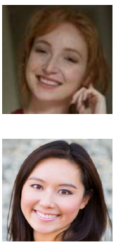

What the system has to do is, despite ever having seen only one image of Danielle, to recognize that this is actually the same person

In contrast, if it sees someone that's not in this database, then it should recognize that this is not any of the four persons in the database.

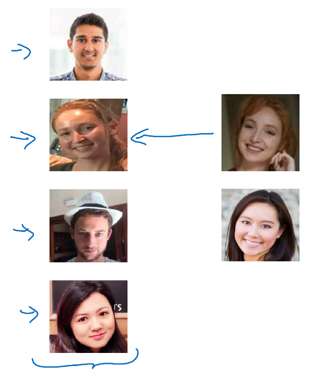

In the one shot learning problem, you have to learn from just one example to recognize the person again.

You need this for most face recognition systems use, because you might have only one picture of each of your employees or of your team members in your employee database.

One approach you could try is to input the image of the person, feed it too a ConvNet. And have it output a label, y, using a softmax unit with four outputs or maybe five outputs corresponding to each of these four persons or none of the above. So that would be 5 outputs in the softmax. 

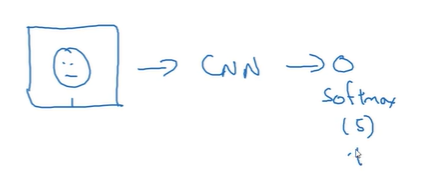

But this really doesn't work well. Because if you have such a small training set it is really not enough to train a robust neural network for this task.

Also what if a new person joins your team? So now you have 5 persons you need to recognize, so there should now be 6 outputs. Do you have to retrain the ConvNet every time? That just doesn't seem like a good approach.

### Learning a “similarity” function
To carry out face recognition, to carry out one-shot learning, what you're going to do instead is learn a similarity function.

In particular, you want a neural network to learn a function which going to denote d, which inputs two images and outputs the degree of difference between the two images.
* If the two images are of the same person, you want this to output a small number.
* If the two images are of two very different people you want it to output a large number.

```
d(img1,img2) = degree of difference between images
```

During recognition time:
* If the degree of difference between them is less than some threshold called tau, which is a hyperparameter. Then you would predict that these two pictures are the same person.
* If it is greater than tau, you would predict that these are different persons. 

-> This is how we address the face verification problem

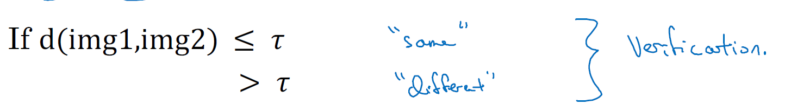

To use this for a recognition task, what you do is, given this new picture, you will use this function d to compare these two images. And maybe I'll output a very large number, let's say 10, for this example.

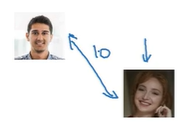

Then you compare this with the second image in your database. And because these two are the same person, hopefully you output a very small number. You do this for the other images in your database and so on. And based on this, you would figure out that this is actually that person, which is Danielle. 

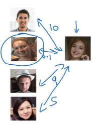

In contrast, if someone not in your database shows up, as you use the function d to make all of these pairwise comparisons, hopefully d will output have a very large number for all four pairwise comparisons. Then you say that this is not any one of the four persons in the database.

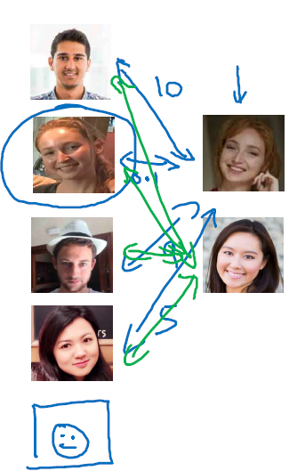

Notice how this allows you to solve the one-shot learning problem. So long as you can learn this function d, which inputs a pair of images and tells you, basically, if they're the same person or different persons. Then if you have someone new join your team, you can add a fifth person to your database, and it just works fine.

## Siamese network
The job of the function d, which you learned about in the last video, is to input two faces and tell you how similar or how different they are. A good way to do this is to use a Siamese network.

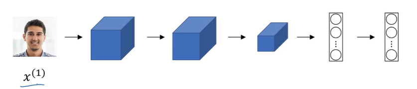

You're used to seeing pictures of confidence like these where you input an image, let's say $x^{(1)}$. And through a sequence of convolutional and pulling and fully connected layers, end up with a feature vector like that.

Sometimes the last layer is fed to a softmax unit to make a classification.

Instead, we're going to focus on this vector of let's say 128 numbers computed by some fully connected layer that is deeper in the network. We call this list of 128 numbers $f(x^{(1)})$. We should think of it as  an "encoding of the input image $x^{(1)}$".

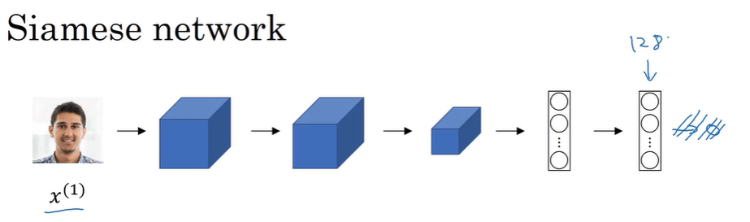

he way you can build a face recognition system is then that if you want to compare two pictures, let's say $x^{(1)}$ is first picture with $x^{(2)}$ second picture.

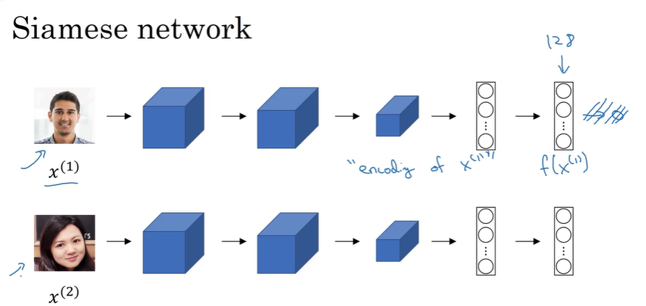

What you can do is feed this second picture to the same neural network with the same parameters and get a different vector of 128 numbers, which encodes this second picture. So I'm going to call this encoding of the second picture $x^{(2)}$ or $f(x^{(2)})$.

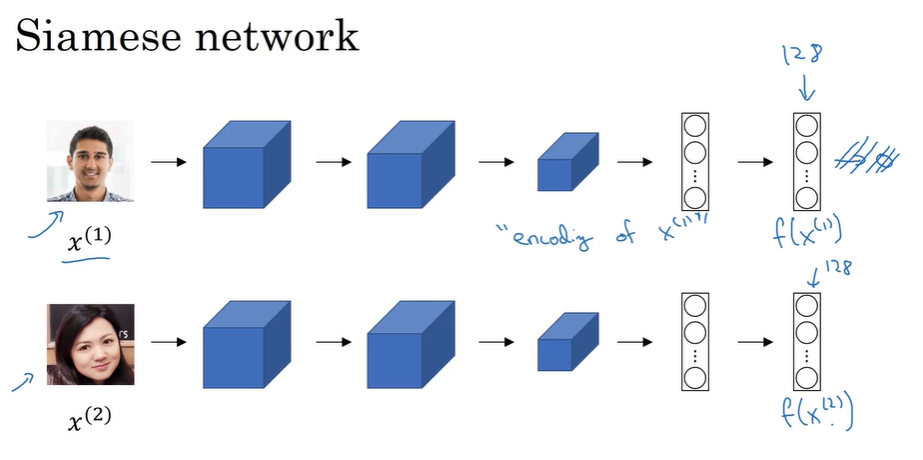

Here I'm using x1 and x2 just to denote two input images. They don't necessarily have to be the first and second examples in your training sets. It can be any two pictures.

Finally, if you believe that these encodings are a good representation of these two images, what you can do is then define the image d of distance between x1 and x2 as the norm of the difference between the encodings of these two images.

$d(x^{(1)}, x^{(2)})=||f(x^{(1)}) - f(x^{(2)})||_2^2$

So this idea of running two identical, convolutional neural networks on two different inputs and then comparing them, sometimes that's called a Siamese neural network architecture.

Many of the ideas I'm presenting here came from a paper due to Yaniv Taigman, Ming Yang, Marc'Aurelio Ranzato, and Lior Wolf in the research system that they developed called DeepFace.

Hw do you train this Siamese neural network? 

Remember that these two neural networks have the same parameters. So what you want to do is really train the neural network so that the encoding that it computes results in a function d that tells you when two pictures are of the same person. 

### Goal of learning
Parameters of NN define an encoding of $f(x^{(i)})$. Given any input image $x^{(i)}$, the NN outputs 128 dimensional encoding $f(x^{(i)})$.

Learn parameters so that:
* If $x^{(i)}$, $x^{(j)}$ are the same person, $||f(x^{(1)}) - f(x^{(2)})||^2$ is small.
* If $x^{(i)}$, $x^{(j)}$ are the different persons, $||f(x^{(1)}) - f(x^{(2)})||^2$ is large.

So as you vary the parameters in all of these layers of the neural network, you end up with different encodings. And what you can do is use back propagation to vary all those parameters in order to make sure these conditions are satisfied.

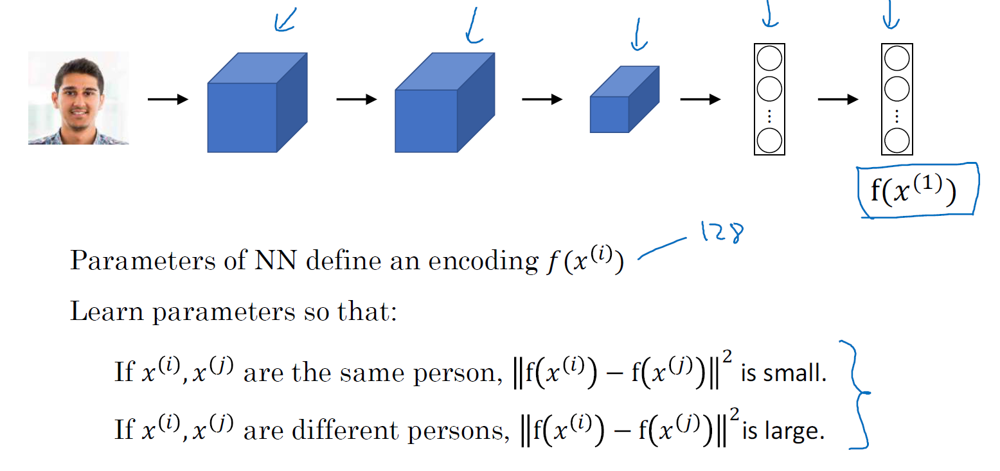

## Triplet Loss
One way to learn the parameters of the neural network, so that it gives you a good encoding for your pictures of faces, is to define and apply gradient descent on the triplet loss function.

### Learning Objective
Triplet Loss is a training method used in face recognition systems.

Its goal is: Make the neural network produce embeddings where
* same person images are close together,
* different person images are far apart.

In face recognition, the job is NOT to classify into fixed labels like “cat/dog.”

Instead we want:
* A function f(image) → a 128-dimensional vector (face embedding)
* The embedding should capture the identity of the person

So later we can check:
* If two embeddings are close → same person
* If far apart → different person

Triplet loss helps train the network to make “close vs far” correct.

Each training example is made of three images:

1. Anchor (A): A picture of person X.
2. Positive (P): Another picture of the same person X.
3. Negative (N): A picture of a different person Y.

We feed all three into the network to get:
* f(A) = embedding of Anchor
* f(P) = embedding of Positive
* f(N) = embedding of Negative

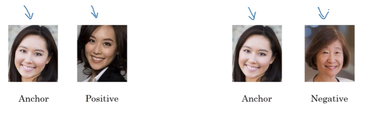

In the terminology of the triplet loss, what you're going to do is always
* look at one anchor image, and then you want to distance between the anchor and a positive image, really a positive example, meaning is the same person, to be similar.
* Whereas you want the anchor when pairs are compared to have a negative example for their distances to be much further apart.

This is what gives rise to the term triplet loss, which is that you always be looking at three images at a time. You'll be looking at an anchor image, a positive image, as well as a negative image.

I'm going to abbreviate anchor, positive, and negative as A, P, and N.

To formalize this, what you want is for the parameters of your neural network or for your encoding to have the following property; which is that you want the encoding between the anchor minus the encoding of the positive example, you want this to be small, and in particular, you want this to be less than or equal to the distance or the squared norm between the encoding of the anchor and the encoding of the negative, whereof course this is d of A, P and this is d of A, N.

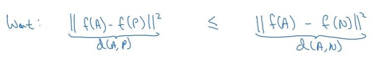

You can think of d as a distance function, which is why we named it with the alphabet d.

If we move the term from the right side of this equation to the left side, what you end up with is f of A minus f of P squared minus, I'm going to take the right-hand side now, minus f of N squared, you want it to be less than or equal to 0. 

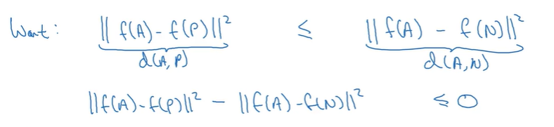

We're going to make a slight change to this expression, which is; one trivial way to make sure this is satisfied is to just learn everything equals 0. If f always output 0, then this is 0 minus 0, which is 0, this is 0 minus 0, which is 0, and so, well, by saying f of any image equals a vector of all 0's, you can see almost trivially satisfy this equation.

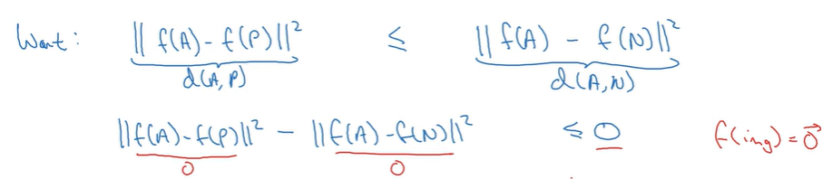

To make sure that the neural network doesn't just output 0, for all the encodings, or to make sure that it doesn't set all the encodings equal to each other. Another way for the neural network to give a trivial outputs is if the encoding for every image was identical to the encoding to every other image, in which case you again get 0 minus 0.

To prevent your neural network from doing that, what we're going to do is modify this objective to say that this doesn't need to be just less than equal to 0, it needs to be quite a bit smaller than 0.

In particular, if we say this needs to be less than negative Alpha, where Alpha is another hyperparameter then this prevents a neural network from outputting the trivial solutions. By convention, usually, we write plus Alpha instead of negative Alpha there. 

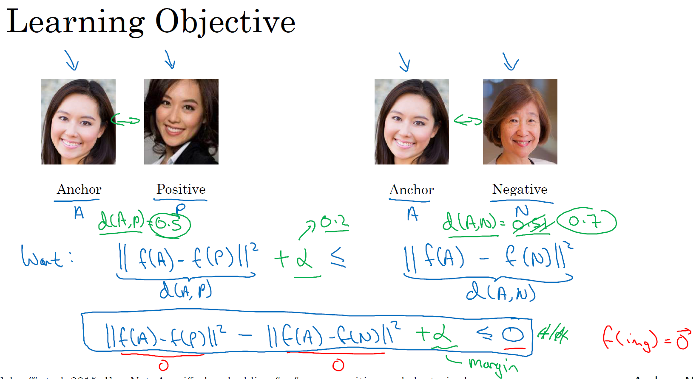

This is also called a margin, which is terminology that you'd be familiar with if you've also seen the literature on support vector machines, but don't worry about it if you haven't. We can also modify this equation on top by adding this margin parameter.

Given example, let's say the margin is set to 0.2. If in this example d of the anchor and the positive is equal to 0.5, then you won't be satisfied if d between the anchor and the negative, was just a little bit bigger, say 0.51. Of one. Even though 0.51 is bigger than 0.5, you're saying that's not good enough. We want d of A,N to be much bigger than d of A,P. In particular, you want this to be at least 0.7 or higher. Alternatively, to achieve this margin or this gap of at least 0.2, you could either push the d(A,P) up or push d(A,N) down so that there is at least this gap of this hyperparameter Alpha 0.2 between the distance between the anchor and the positive versus the anchor and the negative. That's what having a margin parameter here does. Which is it pushes the anchor-positive pair and the anchor-negative pair further away from each other.

We want:

* The anchor–positive distance to be small
* The anchor–negative distance to be big

More precisely:
```
distance(A, P) + margin < distance(A, N)
```

Where:

margin (α) is a small number like 0.2 (to force A and N to be clearly separated)

In simple words:

A and P must be closer than A and N by some margin.

If the model just barely pushes positives closer than negatives, it could “cheat” by making all embeddings zero.

Margin forces the network to clearly separate identities.

Why is it called “triplet loss”?

Because the loss is computed from three images — a triplet.

Imagine face embeddings on a map:
* All photos of you should be clustered around your point.
* All photos of another person should be far away.

Triplet loss “pulls” same-person images together and “pushes” different-person images apart.

Why not use a Softmax classifier?

Because:
* Softmax needs fixed classes.
* But face recognition may have millions of users.
* People join/leave the system.

Triplet loss learns an embedding space, not classification.

So the system works even for new people never seen before.

### Loss function
The triplet loss function is defined on triples of images. Given three images: A, P, and N, the anchor positive and negative examples,
* so the positive examples is of the same person as the anchor
* but the negative is of a different person than the anchor.

The loss on this example, which is really defined on a triplet of images is

$\ell(A,P,B)= max(||f(A)-f(P)||^2 - ||f(A)-f(N)||^2+\alpha,0)$

What you want is for this to be less than or equal to zero. To define the loss function, let's take the max between this and zero. 

The effect of taking the max here is that so long as this is less than zero, then the loss is zero because the max is something less than equal to zero with zero is going to be zero. So long as you achieve the goal of making this thing I've underlined in green, so long as you've achieved the objective of making that less than or equal to zero, then the loss on this example is equal to zero. 

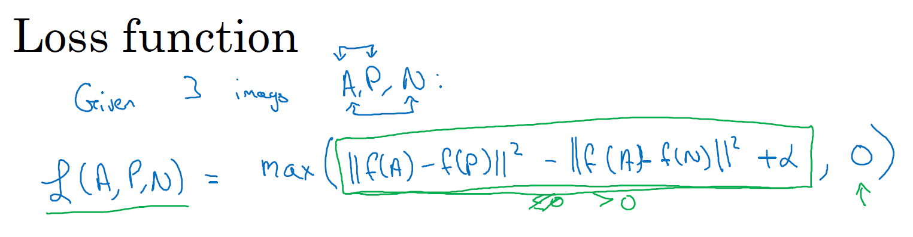

But if on the other hand, if this is greater than zero, then if you take the max, the max will end up selecting this thing I've underlined in green and so you'd have a positive loss.

By trying to minimize this, this has the effect of trying to send this thing to be zero or less than equal to zero. Then so long as this zero or less than equal to zero, the neural network doesn't care how much further negative it is.

This is how you define the loss on a single triplet and the overall cost function for your neural network can be sum over a training set of these individual losses on different triplets.

$J=\Sigma_{i=1}^m \ell(A^{(i)},P^{(i)},N^{(i)})$

If you have a training set of say, 10,000 pictures with 1,000 different persons, what you'd have to do is take your 10,000 pictures and use it to generate, to select triplets like this, and then train your learning algorithm using gradient descent on this type of cost function, which is really defined on triplets of images drawn from your training set.

Notice that in order to define this dataset of triplets, you do need some pairs of A and P, pairs of pictures of the same person. For the purpose of training your system, you do need a dataset where you have multiple pictures of the same person. That's why in this example I said if you have 10,000 pictures of 1,000 different persons, so maybe you have ten pictures, on average of each of your 1,000 persons to make up your entire dataset. If you had just one picture of each person, then you can't actually train this system. 

But of course, after having trained a system, you can then apply it to your one-shot learning problem where for your face recognition system, maybe you have only a single picture of someone you might be trying to recognize.

But for your training set, you do need to make sure you have multiple images of the same person, at least for some people in your training set, so that you can have pairs of anchor and positive images.

### Choosing the triplets A,P,N
Now, how do you actually choose these triplets to form your training set?

One of the problems is if you choose A, P, and N randomly from your training set, subject to A and P being the same person and A and N being different persons, one of the problems is that if you choose them so that they're random, then this constraint is very easy to satisfy. 

During training, if A,P,N are chosen randomly, $d(A,P)+\alpha <= d(A,N)$ is easily satisfied.

Because given two randomly chosen pictures of people, chances are A and N are much different than A and P.

I hope you still recognize this notation. d (A, P) will be high written on the last few slides of these encoding. This is equal to this squared norm distance between the encodings that we had on the previous slide.

$||f(A)-f(P)||^2 + \alpha <= ||f(A)-f(N)||^2$

But if A and N are two randomly chosen different persons, then there's a very high chance that this will be much bigger, more than the margin helper, than that term on the left and the Neural Network won't learn much from it.

To construct your training set, what you want to do is to choose triplets, A, P, and N, they're the ''hard'' to train on.

In particular, what you want is for all triplets that this constraint be satisfied.

$d(A,P)+\alpha <= d(A,N)$

A triplet that is ''hard'' would be if you choose values for A, P, and N so that may be d (A, P) is actually quite close to d (A, N). 

$d(A,P) \approx d(A,N)$

In that case, the learning algorithm has to try extra hard to take this thing on the right and try to push it up or take this thing on the left and try to push it down so that there is at least a margin of alpha between the left side and the right side.

The effect of choosing these triplets is that it increases the computational efficiency of your learning algorithm.

If you choose the triplets randomly, then too many triplets would be really easy and gradient descent won't do anything because you're Neural Network would get them right pretty much all the time.

It's only by choosing ''hard'' to triplets that the gradient descent procedure has to do some work to try to push these quantities further away from those quantities.

If you're interested, the details are presented in this paper by Florian Schroff, Dmitry Kalenichenko, and James Philbin, where they have a system called FaceNet, which is where a lot of the ideas I'm presenting in this video had come from.

By the way, this is also a fun fact about how algorithms are often named in the Deep Learning World, which is if you work in a certain domain, then we call that Blank. You often have a system called Blank Net or Deep Blank. We've been talking about Face recognition. This paper is called FaceNet, and in the last video, you just saw Deep Face.

But this idea of Blank Net or Deep Blank is a very popular way of naming algorithms in the Deep Learning World. You should feel free to take a look at that paper if you want to learn some of these other details for speeding up your algorithm by choosing the most useful triplets to train on; it is a nice paper.

### Training set using triplet loss
Just to wrap up, to train on triplet loss, you need to take your training set and map it to a lot of triples. Here is a triple with an Anchor and a Positive, both of the same person and a Negative of a different person.

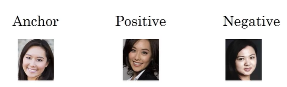

Here's another one where the Anchor and Positive are of the same person, but the Anchor and Negative are of different persons and so on.

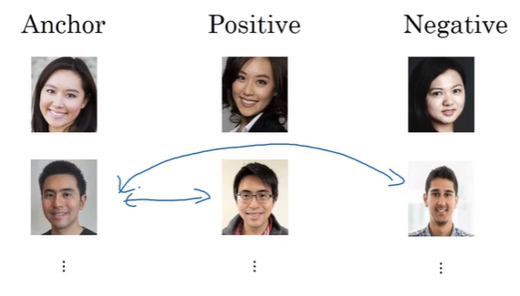

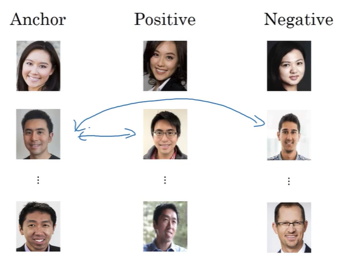

What you do, having to find this training set of Anchor, Positive, and Negative triples is use gradient descent to try to minimize the cost function J we defined on an earlier slide. That will have the effect of backpropagating to all the parameters of the Neural Network in order to learn an encoding so that d of two images will be small when these two images are of the same person and they'll be large when these are two images of different persons.

That's it for the triplet loss and how you can use it to train a Neural Network to output a good encoding for face recognition. Now, it turns out that today's Face recognition systems, especially the large-scale commercial face recognition systems are trained on very large datasets. Datasets north of a million images are not uncommon. Some companies are using north of 10 million images and some companies have north of a100 million images with which they try to train these systems. These are very large datasets, even by modern standards, these dataset assets are not easy to acquire. 

Fortunately, some of these companies have trained these large networks and posted parameters online. Rather than trying to train one of these networks from scratch, this is one domain where because of the sheer data volumes sizes, it might be useful for you to download someone else's pre-trained model rather than do everything from scratch yourself. But even if you do download someone else's pre-trained model, I think it's still useful to know how these algorithms were trained in case you need to apply these ideas from scratch yourself for some application.

## Face verification and binary classification
The Triplet Loss is one good way to learn the parameters of a continent for face recognition. There's another way to learn these parameters. Let me show you how face recognition can also be posed as a straight binary classification problem.

### Learning the similarity function
Another way to train a neural network, is to take this pair of neural networks to take this Siamese Network and have them both compute these embeddings, maybe 128 dimensional embeddings, maybe even higher dimensional, and then have these be input to a logistic regression unit to then just make a prediction. Where the target output will be one if both of these are the same persons, and zero if both of these are of different persons. So, this is a way to treat face recognition just as a binary classification problem. And this is an alternative to the triplet loss for training a system like this. 

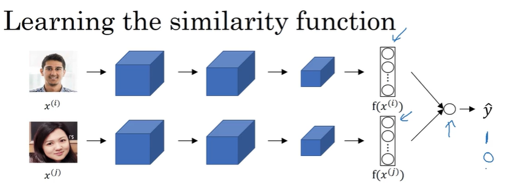

The output y hat will be a sigmoid function, applied to some set of features but rather than just feeding in, these encodings, what you can do is take the differences between the encodings.

Let's say, I write a sum over K equals 1 to 128 of the absolute value, taken element-wise between the two different encodings.

In this notation, f of x i is the encoding of the image x i ,and the substitute k means to just select out the k-th components of this vector. This is taking the element wise difference in absolute values between these two encodings. 

$\hat{y}= \sigma(\Sigma_{k=1}^128 |f(x^{(i)}_k) - f(x^{(j)}_k)|)$

What you might do is think of these 128 numbers as features that you then feed into logistic regression. And, you'll find that little regression can have additional parameters w, i, and b similar to a normal logistic regression unit.

$\hat{y}= \sigma(\Sigma_{k=1}^128 w_k|f(x^{(i)}_k) - f(x^{(j)}_k)|+b)$

And you would train appropriate waiting on these 128 features in order to predict whether or not these two images are of the same person or of different persons.

This will be one pretty reasonable way to learn to predict zero or one whether these are the same person or different persons.

There are a few other variations on how you can compute this formula that I had underlined in green.

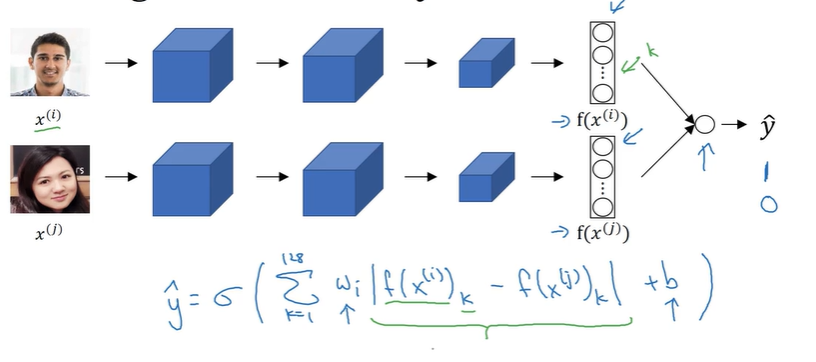

For example, another formula could be this k minus f of x j, k squared divided by f of x i plus f of x j k. This is sometimes called the chi-square form. 

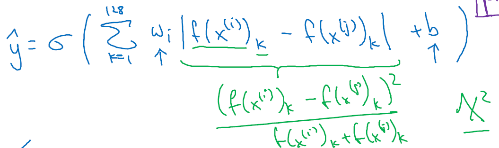

This is the Greek alphabet chi. But this is sometimes called a chi-square similarity.

This and other variations are explored in this deep face paper, which I referenced earlier as well.

In this learning formulation, the input is a pair of images, so this is really your training input x and the output y is either zero or one depending on whether you're inputting a pair of similar or dissimilar images.

Same as before, you're training is Siamese Network so that means that, this neural network up here has parameters that are what they're really tied to the parameters in this lower neural network. 

This system can work pretty well as well.

Lastly, just to mention, one computational trick that can help neural deployment significantly, which is that, if this is the new image, so this is an employee walking in hoping that the turnstile the doorway will open for them and that this is from your database image. 

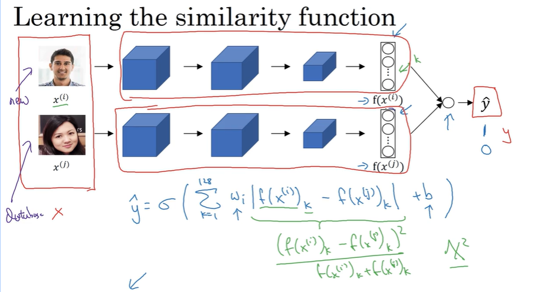

Then instead of having to compute, this embedding every single time, where you can do is actually pre-compute that, so, when the new employee walks in, what you can do is use this upper components to compute that encoding and use it, then compare it to your pre-computed encoding and then use that to make a prediction y hat. 

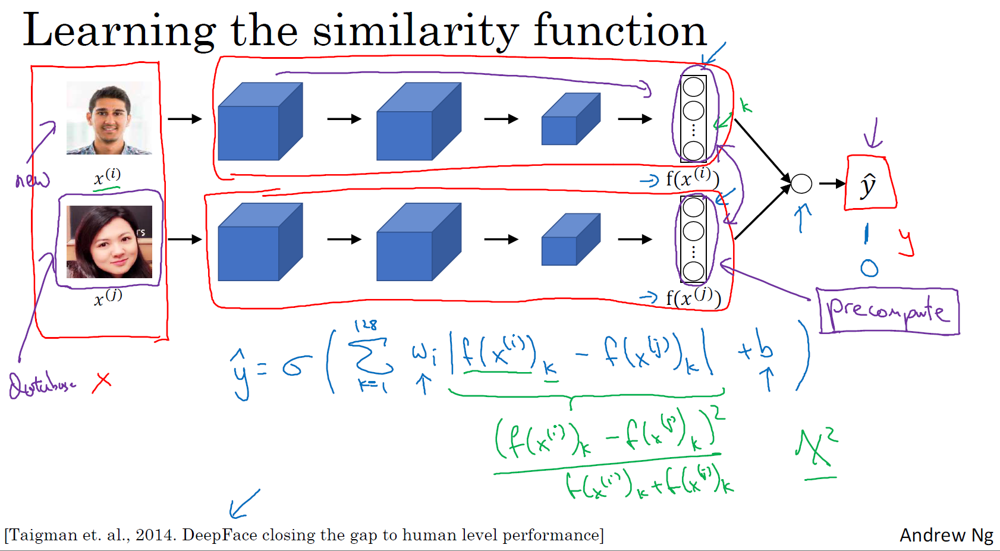

Because you don't need to store the raw images and also because if you have a very large database of employees, you don't need to compute these encodings every single time for every employee database. This idea of pre-computing, some of these encodings can save a significant computation.

This type of pre-computation works both for this type of Siamese Central architecture where you treat face recognition as a binary classification problem, as well as, when you were learning encodings maybe using the Triplet Loss function as described in the last couple of videos.

### Face verification supervised learning
To wrap up, to treat face verification supervised learning, you create a training set of just pairs of images now is of triplets of pairs of images where the target label is 1. When these are a pair of pictures of the same person and where the tag label is 0, when these are pictures of different persons and you use different pairs to train the neural network to train the scientists that were using backpropagation.

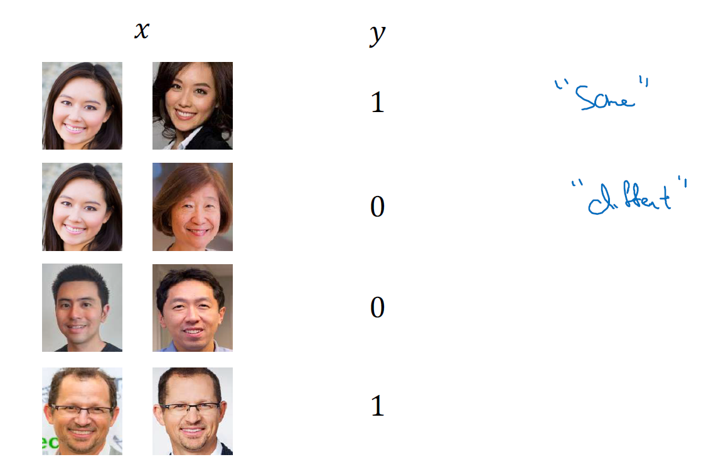

So, this version that you just saw of treating face verification and by extension face recognition as a binary classification problem, this works quite well as well. 

Face Verification (“Are these the same person?”)

Input:
* Image A
* Image B

Output:

Yes / No: (Do these two images show the same person?)

This is a binary classification problem.

BUT — Andrew Ng says:

You should NOT directly train a binary classifier on the raw images.

Why?

Because the variety of faces, lighting, camera angles, glasses, age, etc. is too large. A single binary classifier struggles.

Face Recognition / Identification (“Who is this?”)

Input:

One image

Output:

A name (from a database)

Like an iPhone saying:

“This is you.”

“This is not a face in the database.”

This is NOT binary classification — it’s closer to a 100-way classifier if you have 100 people.

But Andrew explains that recognition uses verification.

Why Binary Classification on Images Is Not Good Enough

Imagine training a classifier:
```
Input: (image 1, image 2)
Output: 1 if same person, 0 otherwise
```

This seems simple… but the problem is:

* There aren’t enough positive examples

(you rarely have many pictures of the same person)

* Raw pixel comparisons are too sensitive

(lighting, angle, expression changes everything)

* As the number of people increases, errors multiply

(remember the 99% → becomes useless with 100 people example)

So binary classification DIRECTLY on image pairs performs poorly.

The Better Approach: Use Embeddings + Distance

Instead of raw images, the modern approach:
1. Use a neural network f(image) → a vector (embedding)
2. Measure the distance between embeddings
3. If the distance is:
* small → same person
* large → different people

This is called Face Embedding.

## What is Neural Style Transfer?
One of the most fun and exciting applications of ConvNet recently has been Neural Style Transfer. You get to implement this yourself and generate your own artwork in the problem exercise.

### Neural style transfer
Let's say you take this image, this is actually taken from the Stanford University not far from my Stanford office and you want this picture recreated in the style of this image on the right. 

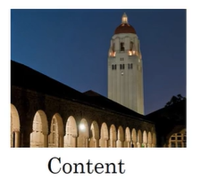

This is actually Van Gogh's, Starry Night painting.

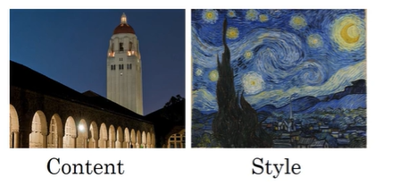

What Neural Style Transfer allows you to do is generated new image like the one below which is a picture of the Stanford University Campus that painted but drawn in the style of the image on the right.

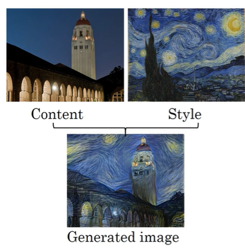

In order to describe how you can implement this yourself, I'm going to use C to denote the content image, S to denote the style image, and G to denote the image you will generate.

Here's another example, let's say you have this content image so that's C this is of the Golden Gate Bridge in San Francisco

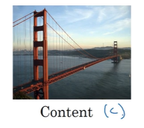

And you have this style image, this is actually Pablo Picasso image.

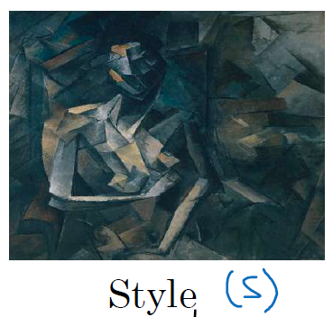

You can then combine these to generate this image G which is the Golden Gate painted in the style of that Picasso shown on the right.

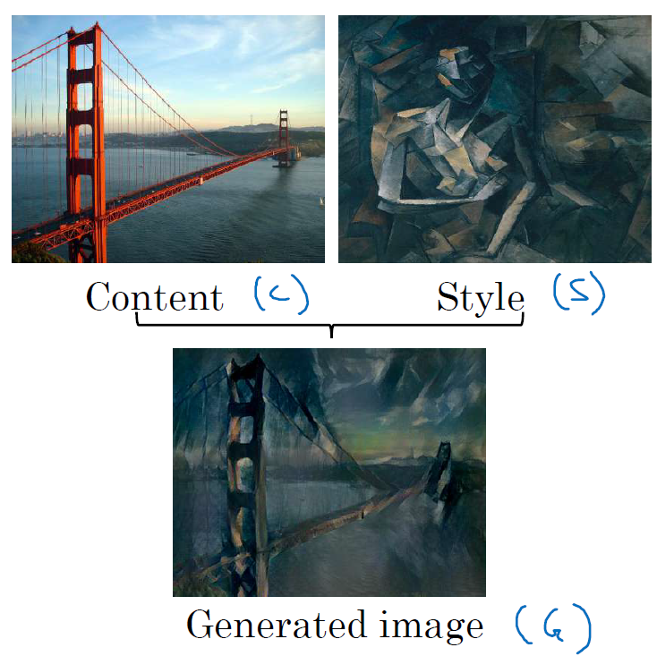

The examples shown on this slide were generated by Justin Johnson. What you'll learn in the next few videos is how you can generate these images yourself.

In order to implement Neural Style Transfer, you need to look at the features extracted by ConvNet at various layers, the shallow and the deeper layers of a ConvNet.

## What are deep ConvNets learning?
### Visualizing what a deep network is learning
Lets say you've trained a ConvNet, this is an AlexNet like network, and you want to visualize what the hidden units in different layers are computing.

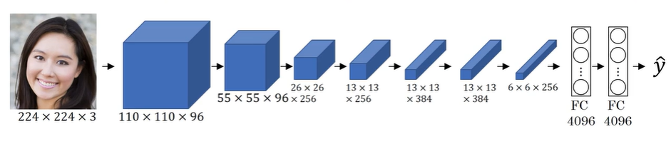

Let's start with a hidden unit in layer 1. Suppose you scan through your training sets and find out what are the images or what are the image patches that maximize that unit's activation.

In other words pass your training set through your neural network, and figure out what is the image that maximizes that particular unit's activation.

Notice that a hidden unit in layer 1, will see only a relatively small portion of the neural network. And so if you visualize, if you plot what activated unit's activation, it makes makes sense to plot just a small image patches, because all of the image that that particular unit sees.

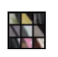

If you pick 1 hidden unit and find the nine input images that maximizes that unit's activation, you might find nine image patches like this.

So looks like that in the lower region of an image that this particular hidden unit sees, it's looking for an edge or a line that looks like that. So those are the nine image patches that maximally activate one hidden unit's activation. 


Now, you can then pick a different hidden unit in layer 1 and do the same thing.

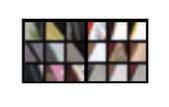

So that's a different hidden unit, and looks like this second one, represented by these 9 image patches here. Looks like this hidden unit is looking for a line sort of in that portion of its input region, we'll also call this receptive field.

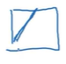

If you do this for other hidden units, you'll find other hidden units, tend to activate in image patches that look like that.

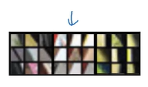

This one seems to have a preference for a vertical light edge, but with a preference that the left side of it be green.

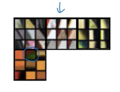

This one really prefers orange colors, and this is an interesting image patch. This red and green together will make a brownish or a brownish-orangish color, but the neuron is still happy to activate with that, and so on.

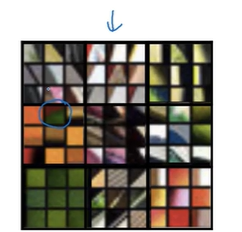

This is nine different representative neurons and for each of them the nine image patches that they maximally activate on.

This gives you a sense that, units, train hidden units in layer 1, they're often looking for relatively simple features such as edge or a particular shade of color.

All of the examples I'm using in this video come from this paper by Mathew Zeiler and Rob Fergus, titled visualizing and understanding convolutional networks.

Now you have repeated this procedure several times for nine hidden units in layer 1. What if you do this for some of the hidden units in the deeper layers of the neuron network. 

What does the neural network then learning at a deeper layers.

So in the deeper layers, a hidden unit will see a larger region of the image. Where at the extreme end each pixel could hypothetically affect the output of these later layers of the neural network.

So later units are actually seen larger image patches, I'm still going to plot the image patches as the same size on these slides. 

### Visualizing deep layers
If we repeat this procedure, this is what you had previously for layer 1, and this is a visualization of what maximally activates nine different hidden units in layer 2.

These are the nine patches that cause one hidden unit to be highly activated.

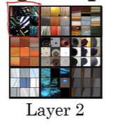

And then each grouping, this is a different set of nine image patches that cause one hidden unit to be activated.


So this visualization shows 9 hidden units in layer 2, and for each of them shows 9 image patches that causes that hidden unit to have a very large output, a very large activation.

You can repeat these for deeper layers as well. 

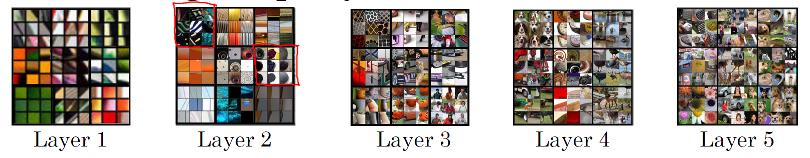

It turns out:
* Early layers → simple shapes
* Middle layers → patterns and textures
* Deep layers → full objects (dogs, cars, faces)

Layer 1 is closest to the raw image, so it learns very simple stuff.

The neurons learn to detect:
* vertical edges
* horizontal edges
* diagonal edges
* simple color gradients
* red/green/blue spots

Andrew shows patches of the image that activate a particular neuron strongly.

For example:
* A neuron that detects horizontal edges activates on horizontal lines.
* A neuron that detects red color activates on red pixels.

Simple features only.

Layer 2 might learn:
* corners
* circles
* stripes
* simple textures (fur-like pattern, grids, waves)

It’s still not detecting “objects,” only patterns.

Layer 3 starts detecting:
* dog’s ear shapes
* car wheels
* animal fur texture
* human eyes
* leaf shapes

Not full objects yet — just parts.

Layers 4 and 5: Recognizing Whole Objects

Deep inside the network, neurons combine all the previous information.

Andrew shows surprising examples:
* A neuron that activates for dogs
* Another that activates for car shapes
* Another for full faces

These deep neurons act almost like:

* “This looks like a dog.”
* “This looks like a car.”
* “This looks like a person’s face.”

They detect almost real-world concepts.

ConvNets build knowledge layer by layer:

1. Edges →
2. Lines / colors →
3. Patterns →
4. Parts of objects →
5. Full objects

Each layer uses the previous layer’s features as building blocks.

Deep ConvNets don’t just memorize images — they learn a hierarchy of features.
* Shallow layers = general, low-level features (edges)
* Deep layers = specific, high-level features (dog breeds, car models)

This is why deep networks are so powerful.

## Cost Function
### Neural style transfer cost function
Remember what the problem formulation is. You're given a content image C, given a style image S and you goal is to generate a new image G.

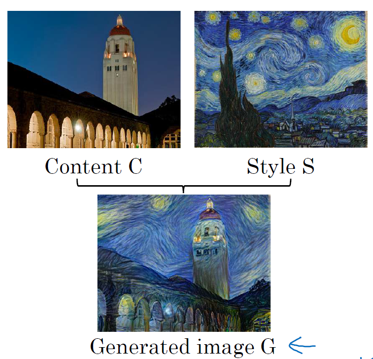

In order to implement neural style transfer, what you're going to do is define a cost function J of G that measures how good is a particular generated image and we'll use gradient descent to minimize J of G in order to generate this image.

How good is a particular image?

Well, we're going to define two parts to this cost function.

The first part is called the content cost. This is a function of the content image and of the generated image and what it does is it measures how similar is the contents of the generated image to the content of the content image C.

Then going to add that to a style cost function which is now a function of (S,G) and what this does is it measures how similar is the style of the image G to the style of the image S.

Finally, we'll weight these with two hyper parameters alpha and beta to specify the relative weighting between the content costs and the style cost.

$J(G)=\alpha J_{content}(C,G) + \beta J{style}(S,G)$

It seems redundant to use two different hyper parameters to specify the relative cost of the weighting. One hyper parameter seems like it would be enough but the original authors of the Neural Style Transfer Algorithm, use two different hyper parameters. I'm just going to follow their convention here.

The Neural Style Transfer Algorithm I'm going to present in the next few videos is due to Leon Gatys, Alexander Ecker and Matthias. Their papers is not too hard to read so after watching these few videos if you wish, I certainly encourage you to take a look at their paper as well if you want.

### Find the generated image G
The way the algorithm would run is as follows, having to find the cost function J of G in order to actually generate a new image what you do is the following.

1. You would initialize the generated image G randomly.
   * It might be 100 by 100 by 3 or 500 by 500 by 3 or whatever dimension you want it to be.
2. Then we'll define the cost function J(G) on the previous slide.
   * What you can do is use gradient descent to minimize this so you can update G as G minus the derivative respect to the cost function of J of G.

$G := G-{\alpha \over {\alpha G}}J(G)$

   * In this process, you're actually updating the pixel values of this image G which is a 100 by 100 by 3 maybe rgb channel image. 

Here's an example, let's say you start with this content image and this style image. 


This is a another probably Picasso image.

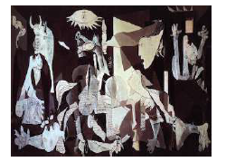

Then when you initialize G randomly, you're initial randomly generated image is just this white noise image with each pixel value chosen at random.

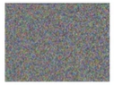

As you run gradient descent, you minimize the cost function J(G) slowly through the pixel value so then you get slowly an image that looks more and more like your content image rendered in the style of your style image. 

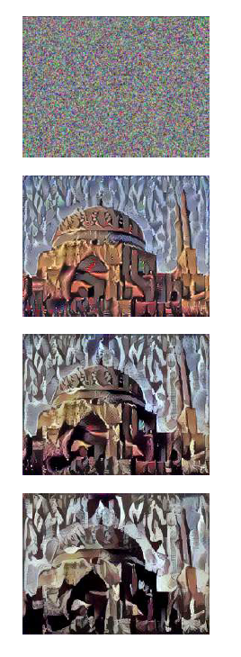

In this video, you saw the overall outline of the Neural Style Transfer Algorithm where you define a cost function for the generated image G and minimize it.

## Content Cost Function
The cost function of the neural style transfer algorithm had a content cost component and a style cost component.

$J(G)=\alpha J_{content}(C,G) + \beta J{style}(S,G)$

Remember that this is the overall cost function of the neural style transfer algorithm.

Let's say that you use hidden layer l to compute the content cost.
* If l is a very small number, if you use hidden layer one, then it will really force your generated image to pixel values very similar to your content image.
* Whereas, if you use a very deep layer, then it's just asking, "Well, if there is a dog in your content image, then make sure there is a dog somewhere in your generated image. "
* In practice, layer l chosen somewhere in between. It's neither too shallow nor too deep in the neural network.
* Usually, l was chosen to be somewhere in the middle of the layers of the neural network, neither too shallow nor too deep.

Then use a pre-trained ConvNet, maybe a VGG network, or could be some other neural network as well.
* You want to measure, given a content image and given a generated image, how similar are they in content.

Let $a^{[l](C)}$ and $a^{[l](G)}$ be the activations of layer l on these two images, on the images C and G.

If these two activations are similar, then that would seem to imply that both images have similar content. 

What we'll do is define $J_{content}(C,G)$ as just how soon or how different are these two activations. So, we'll take the element-wise difference between these hidden unit activations in layer l, between when you pass in the content image compared to when you pass in the generated image, and take that squared. And you could have a normalization constant in front or not, so it's just one of the two or something else.

$J_{content}(C,G) = {1 \over 2}||a^{[l](C)} - a^{[l](G)}||^2$

It doesn't really matter since this can be adjusted as well by this hyperparameter alpha.

Just be clear on using this notation as if both of these have been unrolled into vectors, so then, this becomes the square root of the l_2 norm between this and this, after you've unrolled them both into vectors.

But it's really just the element-wise sum of squares of differences between the activations in layer l, between the images in C and G. 

When later you perform gradient descent on J_of_G to try to find a value of G, so that the overall cost is low, this will incentivize the algorithm to find an image G, so that these hidden layer activations are similar to what you got for the content image. 

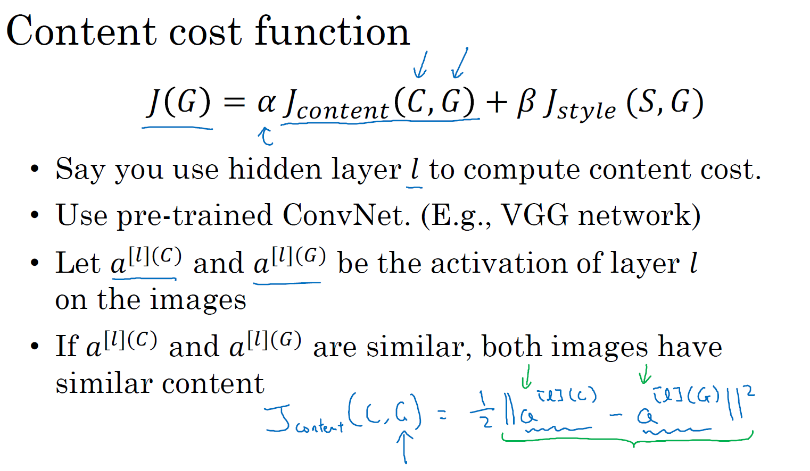

## Style Cost Function
### Meaning of the “style” of an image

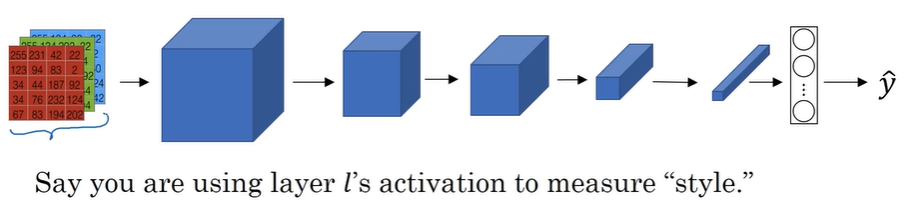

Let's say you have an input image like this, they used to seeing a convnet like that, compute features that there's different layers. 

Let's say you've chosen some layer L, maybe that layer to define the measure of the style of an image.


What we need to do is define the style as the correlation between activations across different channels in this layer L activation. 

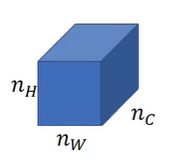

Let's say you take that layer L activation. So this is going to be nh by nw by nc block of activations, and we're going to ask how correlated are the activations across different channels.

So to explain what I mean by this may be slightly cryptic phrase, let's take this block of activations and let me shade the different channels by a different colors.

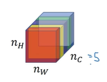

In this below example, we have say 5 channels and which is why I have 5 shades of color here.

In practice, of course, in neural network we usually have a lot more channels than 5, but using just 5 makes it drawing easier.

But to capture the style of an image, what you're going to do is the following.

Let's look at the first two channels. 

Let's see for the red channel and the yellow channel and say how correlated are activations in these first two channels.

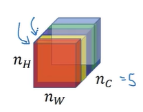

For example, in the lower right hand corner, you have some activation in the first channel and some activation in the second channel. That gives you a pair of numbers.

What you do is look at different positions across this block of activations and just look at those 2 pairs of numbers, one in the first channel, the red channel, one in the yellow channel, the second channel and see when you look across all of these positions, all of these nh by nw positions, how correlated are these two numbers.

### Intuition about style of an image
Why does this capture style?

Let's look another example. 

Here's one of the visualizations from the earlier video. This comes from again the paper by Matthew Zeiler and Rob Fergus that I have reference earlier. 

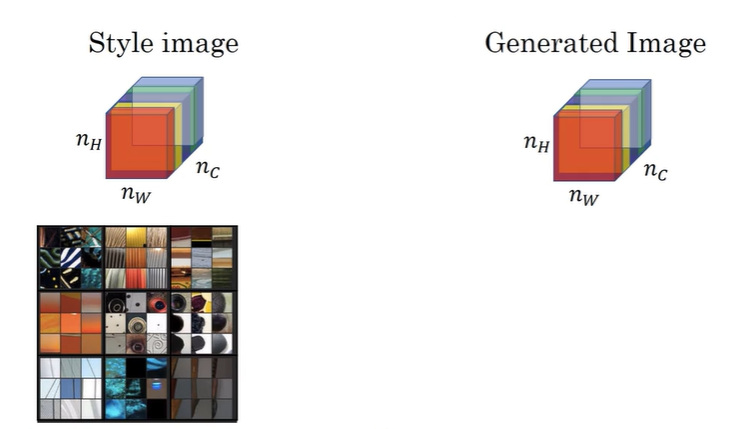

Let's say for the sake of arguments, that the red channel corresponds to this neurons so we're trying to figure out if there's this little vertical texture in a particular position in the nh and let's say that this second channel, this yellow second channel corresponds to this neuron, which is vaguely looking for orange colored patches.

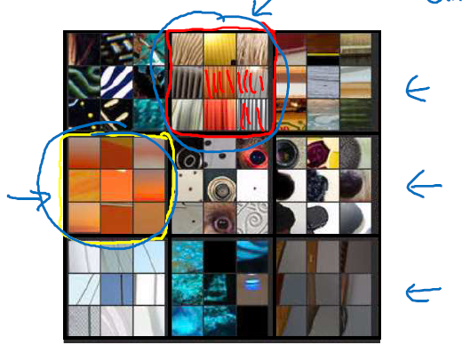

What does it mean for these two channels to be highly correlated? 

If they're highly correlated what that means is whatever part of the image has red part type of subtle vertical texture, yellow part of the image will probably have these orange-ish tint.

What does it mean for them to be uncorrelated?

It means that whenever there is this vertical texture in red part, it's probably won't have that orange-ish tint. 

The correlation tells you which of these high level texture components tend to occur or not occur together in part of an image and that's the degree of correlation that gives you one way of measuring how often these different high level features, such as vertical texture or this orange tint or other things as well, how often they occur and how often they occur together and don't occur together in different parts of an image.

If we use the degree of correlation between channels as a measure of the style, then what you can do is measure the degree to which in your generated image, this first channel is correlated or uncorrelated with the second channel and that will tell you in the generated image how often this type of vertical texture occurs or doesn't occur with this orange-ish tint and this gives you a measure of how similar is the style of the generated image to the style of the input style image. 

The big idea:

Style is not the presence of a feature — it’s how features relate to each other.

Example:
* If an artist uses horizontal and vertical strokes together, those two features will appear in the same places → high correlation.
* If the image has blue blobs near green stripes, their activations correlate.

Style is about the combination of features, not the features alone.

A single feature ≠ style

A single neuron firing means:

“I saw a vertical line here.”

But that is NOT enough to describe the artist’s style.

Correlation of features = consistent patterns

If two neurons fire together often:

“Where there is a vertical line, a horizontal texture is also nearby.”

That’s a pattern, and patterns = style.

This is why we use feature correlations.

A CNN filter (neuron) fires when it recognizes something in an image.

Examples:

|Filter (Neuron)|	Fires When It Sees|
|-|-|
|Filter A|	Vertical line|
|Filter B|	Horizontal line|
|Filter C|	Red color|
|Filter D|	Dotted texture|

When a filter fires, it outputs a high number (activation).

Correlation = do two neurons fire together?

Meaning: do they see their patterns in the same places?

Example Image 1: A checkerboard pattern

Imagine a checkerboard:

⬜⬛⬜⬛ \
⬛⬜⬛⬜

In a checkerboard:
* There are vertical lines
* And horizontal lines
* And they always appear together at grid intersections

So:
* Filter A (vertical line detector) → fires
* Filter B (horizontal line detector) → fires

They fire in the same locations repeatedly.

-> A and B have HIGH correlation because when A fires, B usually fires too.

Example Image 2: A red wall

Imagine a plain red wall with no lines.
* Filter C (red color detector) → fires strongly
* Filter A (vertical line detector) → no fire
* Filter B (horizontal line detector) → no fire
* Filter C fires alone.

-> C has LOW correlation with A or B.

This describes a different style.

Example Image 3: Van Gogh “Starry Night”

In this style:
* Yellow swirls
* Blue curvy strokes
* Lines that swirl together

Two filters:
* Filter Y → detects yellow curved stroke
* Filter B → detects blue curved stroke

In Van Gogh paintings:

Yellow and blue swirls often appear together in the same regions.

-> High correlation between Y & B.
This is part of Van Gogh’s “style signature.”

### Style matrix
Let's now formalize this intuition.

What you can to do is given an image computes something called a style matrix, which will measure all those correlations we talks about on the last slide.

Let $a^{[l]}_{i,j,k}$ = activation at (i,j,k). $G^{[l]}$ is $n_c^{[l]}$ x $n_c^{[l]}$

So i indexes into the height, j indexes into the width, and k indexes across the different channels.

In the previous slide, we had 5 channels that k will index across those 5 channels.

what the style matrix will do is you're going to compute a matrix class $G^{[l]}$. This is going to be an nc by nc dimensional matrix, so it'd be a square matrix.

Remember you have nc channels and so you have an nc by nc dimensional matrix in order to measure how correlated each pair of them is.

particular G, l, k, k prime will measure how correlated are the activations in channel k compared to the activations in channel k prime. Where here, k and k prime will range from 1 through nc, the number of channels they're all up in that layer.

More formally, the way you compute G, l and I'm just going to write down the formula for computing one elements. So the k, k prime elements of this. 

$G_{kk'}^{[l]} = \Sigma_{i=1}^{n_H^{[l]}} \Sigma_{j=1}^{n_W^{[l]}} a_{ijk}^{[l](S)}a_{ijk'}^{[l](S)}$

Remember i and j index across to a different positions in the block, indexes over the height and width. So i is the sum from one to nh and j is a sum from one to nw and k here and k prime index over the channel so k and k prime range from one to the total number of channels in that layer of the neural network $n_c^{[l]}$.

All this is doing is summing over the different positions that the image over the height and width and just multiplying the activations together of the channels k and k prime and that's the definition of G,k,k prime.

You do this for every value of k and k prime to compute this matrix G, also called the style matrix.

Notice that if both of these activations tend to be lashed together, then G, k, k prime will be large, whereas if they are uncorrelated then g,k, k prime might be small.

Technically, I've been using the term correlation to convey intuition but this is actually the unnormalized classical variant because we're not subtracting out the mean and this is just multiplied by these elements directly.

Imagine two filters:
* Filter A: detects blue color
* Filter B: detects horizontal lines

In a Van Gogh painting:
* Blue color often appears with swirling lines
* So A and B fire together → high correlation

In a random photo:
* Blue objects might not have horizontal lines
* A and B fire independently → low correlation

This difference is exactly what captures an artist’s style.

You'd actually do this for both the style image S and for the generated image G.

What you do is then compute the same thing for the generated image. 

$G_{kk'}^{[l]} = \Sigma_{i=1}^{n_H^{[l]}} \Sigma_{j=1}^{n_W^{[l]}} a_{ijk}^{[l](G)}a_{ijk'}^{[l](G)}$

Now, you have two matrices they capture what is the style with the image S and what is the style of the image G.

By the way, we've been using the alphabet capital G to denote these matrices. In linear algebra, these are also called the gram matrix of these in called gram matrices but in this video, I'm just going to use the term style matrix because this term gram matrix that most of these using capital G to denote these matrices.

Finally, the cost function, the style cost function. If you're doing this on layer l between S and G, you can now define that to be just the difference between these two matrices, G l, G square and these are matrices.

$J_{style}^{[l]}(S,G)= {1 \over {(2n_H^{[l]}n_W^{[l]}n_C^{[l]})^2}}||G^{[l](S)}-G^{[l](G)}||^2_F$

$J_{style}^{[l]}(S,G)= {1 \over {(2n_H^{[l]}n_W^{[l]}n_C^{[l]})^2}} \Sigma_{k} \Sigma_{k'} (G_{kk'}^{[l](S)}-G_{kk'}^{[l](G)})^2$

A normalization constant doesn't matter that much because this classes multiplied by some hyperparameter b anyway. 

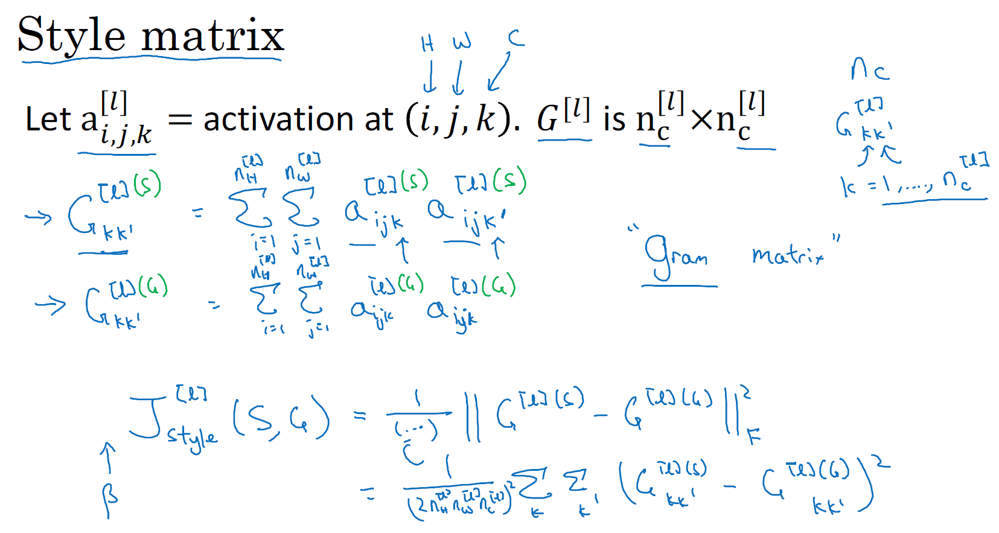

### Style cost function

$J_{style}^{[l]}(S,G)= {1 \over {(2n_H^{[l]}n_W^{[l]}n_C^{[l]})^2}} \Sigma_{k} \Sigma_{k'} (G_{kk'}^{[l](S)}-G_{kk'}^{[l](G)})^2$

To finish up, this is the style cost function defined using layer l and as you saw on the previous slide, this is basically the Frobenius norm between the two star matrices computed on the image S and on the image G Frobenius on squared and never by the just low normalization constants, which isn't that important. 

$||G^{[l](S)}-G^{[l](G)}||^2_F$

Finally, it turns out that you get more visually pleasing results if you use the style cost function from multiple different layers. 

The overall style cost function, you can define as sum over all the different layers of the style cost function for that layer. We should define the book weighted by some set of parameters, by some set of additional hyperparameters, which we'll denote as lambda l here.

$J_{style}(S,G)=\Sigma_l \lambda^{[l]} J_{style}^{[l]}(S,G)$

What it does is allows you to use different layers in a neural network. Well of the early ones, which measure relatively simpler low level features like edges as well as some later layers, which measure high level features and cause a neural network to take both low level and high level correlations into account when computing style.

To wrap this up, you can now define the overall cost function as alpha times the content cost between c and G plus beta times the style cost between s and G.

$J_(G)=\alpha J_{content}(C,G)+\beta J_{style}(S,G)$

Then use gradient descent or a more sophisticated optimization algorithm if you want in order to try to find an image G that normalize, that tries to minimize this cost function j of G. And if you do that you'll be able to generate some pretty nice novel artwork.

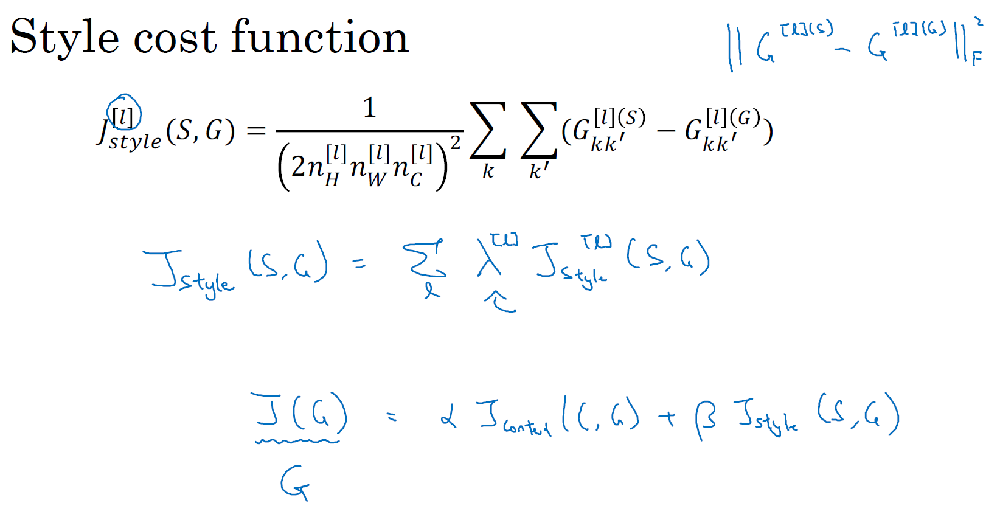

## 1D and 3D Generalizations
### Convolutions in 2D and 1D
In the first week of this course, you learned about the 2D convolution, where you might input a 14 x 14 image and convolve that with a 5 x 5 filter. And you saw how 14 x 14 convolved with 5 x 5, this gives you a 10 x 10 output.

If you have multiple channels, maybe those 14 x 14 x 3, then it would be 5 x 5 that matches the same 3. And then if you have multiple filters, say 16 filters, you end up with 10 x 10 x 16.

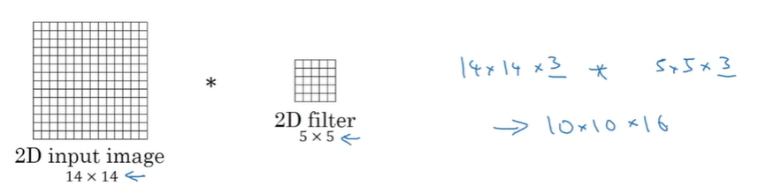

It turns out that a similar idea can be applied to 1D data as well.

For example, on the left is an EKG signal, also called an electrocardioagram. Basically if you place an electrode over your chest, this measures the little voltages that vary across your chest as your heart beats. Because the little electric waves generated by your heart's beating can be measured with a pair of electrodes. And so this is an EKG of someone's heart beating. And so each of these peaks corresponds to one heartbeat. 

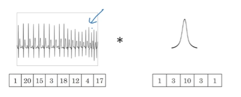

If you want to use EKG signals to make medical diagnoses, for example, then you would have 1D data because what EKG data is, is it's a time series showing the voltage at each instant in time.

So rather than a 14 x 14 dimensional input, maybe you just have a 14 dimensional input. And in that case, you might want to convolve this with a 1 dimensional filter. So rather than the 5 by 5, you just have 5 dimensional filter.

With 2D data what a convolution will allow you to do was to take the same 5 x 5 feature detector and apply it across at different positions throughout the image. And that's how you wound up with your 10 x 10 output.

What a 1D filter allows you to do is take your 5 dimensional filter and similarly apply that in lots of different positions throughout this 1D signal. And so if you apply this convolution, what you find is that a 14 dimensional thing convolved with this 5 dimensional thing, this would give you a 10 dimensional output. Again, if you have multiple channels, you might have in this case you can use just 1 channel, if you have 1 lead or 1 electrode for EKG, so times 5 x 1. And if you have 16 filters, maybe end up with 10 x 16 over there, and this could be one layer of your ConvNet. 

And then for the next layer of your ConvNet, if you input a 10 x 16 dimensional input and you might convolve that with a 5 dimensional filter again. Then these have 16 channels, so that has a match. And we have 32 filters, then the output of another layer would be 6 x 32, if you have 32 filters. And the analogy to the the 2D data, this is similar to all of the 10 x 10 x 16 data and convolve it with a 5 x 5 x 16, and that has to match. That will give you a 6 by 6 dimensional output, and you have 32 filters, that's where the 32 comes from.

All of these ideas apply also to 1D data, where you can have the same feature detector, such as this, apply to a variety of positions. For example, to detect the different heartbeats in an EKG signal. But to use the same set of features to detect the heartbeats even at different positions along these time series, and so ConvNet can be used even on 1D data.

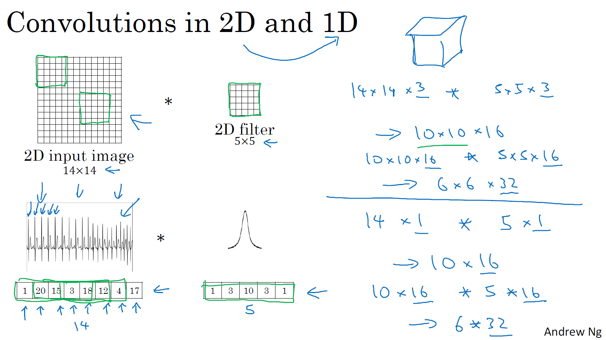

For along with 1D data applications, you actually use a recurrent neural network, which you learn about in the next course. But some people can also try using ConvNets in these problems. And in the next course on sequence models, which we will talk about recurring neural networks and LCM and other models like that. 

That's the generalization from 2D to 1D. How about 3D data? 

What is three dimensional data?

It is that, instead of having a 1D list of numbers or a 2D matrix of numbers, you now have a 3D block, a three dimensional input volume of numbers. So here's the example of that which is if you take a CT scan, this is a type of X-ray scan that gives a three dimensional model of your body.

What a CT scan does is it takes different slices through your body. So as you scan through a CT scan which I'm doing here, you can look at different slices of the human torso to see how they look and so this data is fundamentally three dimensional.

One way to think of this data is if your data now has some height, some width, and then also some depth. Where this is the different slices through this volume, are the different slices through the torso.

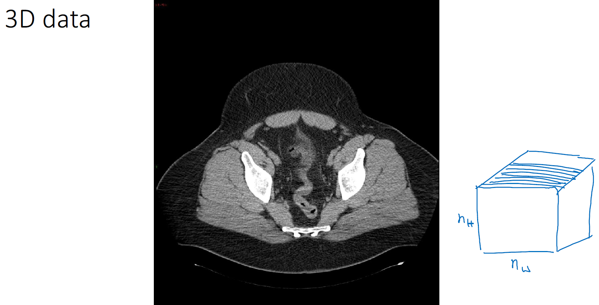

So if you want to apply a ConvNet to detect features in this three dimensional CAT scan or CT scan, then you can generalize the ideas from the first slide to three dimensional convolutions as well.

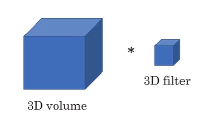

So if you have a 3D volume, and for the sake of simplicity let's say is 14 x 14 x 14 and so this is the height, width, and depth of the input CT scan. And again, just like images they'll all have to be square, a 3D volume doesn't have to be a perfect cube as well. So the height and width of a image can be different, and in the same way the height and width and the depth of a CT scan can be different. But I'm just using 14 x 14 x 14 here to simplify the discussion.

If you convolve this with a now a 5 x 5 x 5 filter, so you're filters now are also three dimensional then this would give you a 10 x 10 x 10 volume.

Technically, you could also have by 1, if this is the number of channels. So this is just a 3D volume, but your data can also have different numbers of channels, then this would be times 1 as well. Because the number of channels here and the number of channels here has to match.

Then if you have 16 filters did a 5 x 5 x 5 x 1 then the next output will be a 10 x 10 x 10 x 16. So this could be one layer of your ConvNet over 3D data, and if the next layer of the ConvNet convolves this again with a 5 x 5 x 5 x 16 dimensional filter. 

This number of channels has to match data as usual, and if you have 32 filters then similar to what you saw was ConvNet of the images. Now you'll end up with a 6 x 6 x 6 volume across 32 channels.
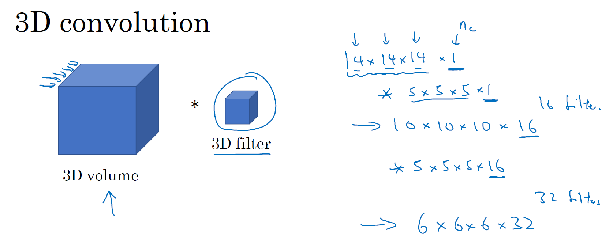


So 3D data can also be learned on, sort of directly using a three dimensional ConvNet. And what these filters do is really detect features across your 3D data, CAT scans, medical scans as one example of 3D volumes.

Another example of data, you could treat as a 3D volume would be movie data, where the different slices could be different slices in time through a movie. And you could use this to detect motion or people taking actions in movies.

Image data is so pervasive that the vast majority of ConvNets are on 2D data, on image data, but I hope that these other models will be helpful to you as well.


