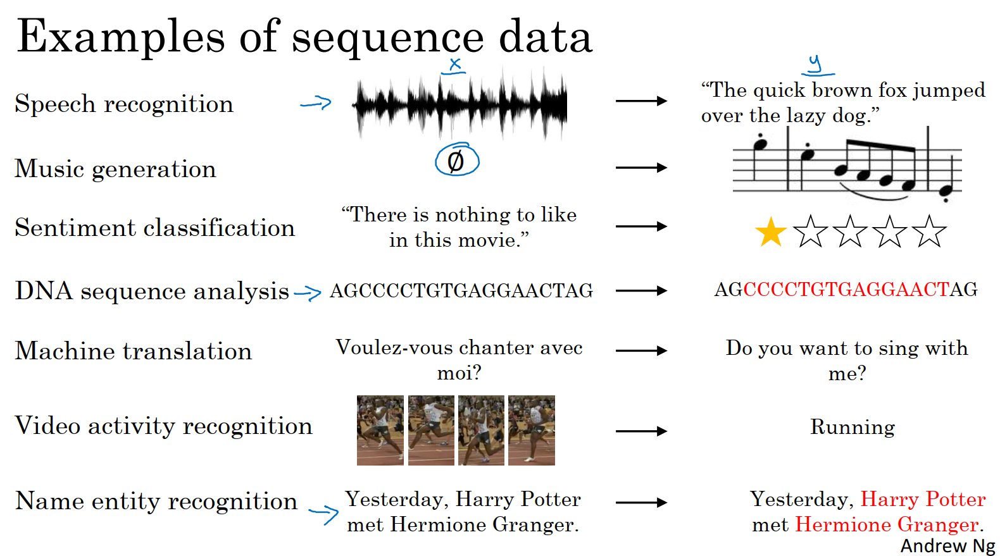

# Week 1: Recurrent Neural Networks
Discover recurrent neural networks, a type of model that performs extremely well on temporal data, and several of its variants, including LSTMs, GRUs and Bidirectional RNNs,

**Learning Objectives**
* Define notation for building sequence models
* Describe the architecture of a basic RNN
* Identify the main components of an LSTM
* Implement backpropagation through time for a basic RNN and an LSTM
* Give examples of several types of RNN
* Build a character-level text generation model using an RNN
* Store text data for processing using an RNN
* Sample novel sequences in an RNN
* Explain the vanishing/exploding gradient problem in RNNs
* Apply gradient clipping as a solution for exploding gradients
* Describe the architecture of a GRU
* Use a bidirectional RNN to take information from two points of a sequence
* Stack multiple RNNs on top of each other to create a deep RNN
* Use the flexible Functional API to create complex models
* Generate your own jazz music with deep learning
* Apply an LSTM to a music generation task

## Why Sequence Models?
Examples of Sequence Models:
* Speech recognition: you are given an input audio clip X and asked to map it to a text transcript Y.
  * Both the input and the output here are sequence data, because X is an audio clip and so that plays out over time and Y, the output, is a sequence of words.
* Music generation:
  * Input: Can be the empty set or can be a single integer, maybe referring to the genre of music you want to generate or the first few notes of the piece of music.
  * Output Y is a sequence.
* Sentiment classification
  * Input: X is a sequence such as a phrase "There is nothing to like in this movie", h
  * Output: How many stars do you think this review will be?
* DNA sequence analysis
  * Input: DNA sequence (i.e, AGCCCCTGTGAGGAACTAG)
  * Output: Label which part of this DNA sequence say corresponds to a protein.
* Machine translation
  * Input: sentence "Voulez-vous chanter avec moi?"
  * Output: Translation in different language "Do you want to sing with me?"
* Video activity recognition
  * Input: Video frames
  * Output: Recognize activities
* Name entity recognition
  * Input: a sentence
  * Output: Identify the people in that sentence

All of these problems can be addressed as supervised learning with label data X, Y as the training set.

But, as you can tell from this list of examples, there are a lot of different types of sequence problems. In some, both the input X and the output Y are sequences, and in that case, sometimes X and Y can have different lengths, or X and Y have the same length. And in some of these examples only either X or only the opposite Y is a sequence.

## Notation
### Motivating example
Let's say you want to build a sequence model to input a sentence like this:

"Harry Potter and Hermione Granger invented a new spell."

Let say you want a sequence model to automatically tell you where are the peoples names in this sentence. 

-> Name-entity recognition problem

-> Used by search engines to index all of the last 24 hours news of all the people mentioned in the news articles

-> Used to find people's names, companies names, times, locations, countries names, currency names and so on in different types of text.

