# Week 1: Recurrent Neural Networks
Discover recurrent neural networks, a type of model that performs extremely well on temporal data, and several of its variants, including LSTMs, GRUs and Bidirectional RNNs,

**Learning Objectives**
* Define notation for building sequence models
* Describe the architecture of a basic RNN
* Identify the main components of an LSTM
* Implement backpropagation through time for a basic RNN and an LSTM
* Give examples of several types of RNN
* Build a character-level text generation model using an RNN
* Store text data for processing using an RNN
* Sample novel sequences in an RNN
* Explain the vanishing/exploding gradient problem in RNNs
* Apply gradient clipping as a solution for exploding gradients
* Describe the architecture of a GRU
* Use a bidirectional RNN to take information from two points of a sequence
* Stack multiple RNNs on top of each other to create a deep RNN
* Use the flexible Functional API to create complex models
* Generate your own jazz music with deep learning
* Apply an LSTM to a music generation task

## Why Sequence Models?
Examples of Sequence Models:
* Speech recognition: you are given an input audio clip X and asked to map it to a text transcript Y.
  * Both the input and the output here are sequence data, because X is an audio clip and so that plays out over time and Y, the output, is a sequence of words.
* Music generation:
  * Input: Can be the empty set or can be a single integer, maybe referring to the genre of music you want to generate or the first few notes of the piece of music.
  * Output Y is a sequence.
* Sentiment classification
  * Input: X is a sequence such as a phrase "There is nothing to like in this movie", h
  * Output: How many stars do you think this review will be?
* DNA sequence analysis
  * Input: DNA sequence (i.e, AGCCCCTGTGAGGAACTAG)
  * Output: Label which part of this DNA sequence say corresponds to a protein.
* Machine translation
  * Input: sentence "Voulez-vous chanter avec moi?"
  * Output: Translation in different language "Do you want to sing with me?"
* Video activity recognition
  * Input: Video frames
  * Output: Recognize activities
* Name entity recognition
  * Input: a sentence
  * Output: Identify the people in that sentence


All of these problems can be addressed as supervised learning with label data X, Y as the training set.

But, as you can tell from this list of examples, there are a lot of different types of sequence problems. In some, both the input X and the output Y are sequences, and in that case, sometimes X and Y can have different lengths, or X and Y have the same length. And in some of these examples only either X or only the opposite Y is a sequence.

## Notation
### Motivating example
Let's say you want to build a sequence model to input a sentence like this:

"Harry Potter and Hermione Granger invented a new spell."

Let say you want a sequence model to automatically tell you where are the peoples names in this sentence. 

-> Name-entity recognition problem

-> Used by search engines to index all of the last 24 hours news of all the people mentioned in the news articles

-> Used to find people's names, companies names, times, locations, countries names, currency names and so on in different types of text.

Given this input x (sequence of 9 words):

"Harry Potter and Hermione Granger invented a new spell."

We want a model to output y that has 1 output per input word and the target output the design y tells you for each of the input words is that part of a person's name.

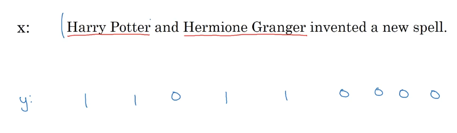

We have 9 sets of features to represent these 9 words and index into the positions and sequence.

$x^{<1>}$ for first word and so on until $x^{<9>}$

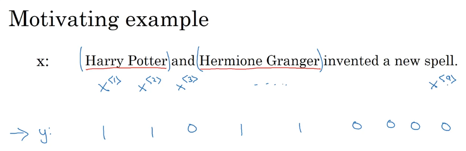

-> $x^{<t>}$ with index t to index into the positions in the sequence. t implies that these are teporal sequences.

-> similar for output y. $y^{<1>}$ to $y^{<9>}$

Denote $T_x$ as the length of the input sequence, so $T_x = 9$

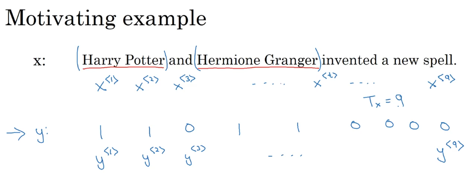

$T_y$ is the length of the output sequence.

In this example $T_x = T_y = 9$, but they can be different.

Previously, we used $x^{(i)}$ to denote the i-th training example.

To refer to the t-th element in the sequence of training example i, we use $x^{(i)<t>}$

If $T_x$ is the length of the sequence then different examples in training set can have different lengths. So $T_x^{(i)}$ would be the input sequence length for trianing example i.

$y^{(i)<t>}$ means the t-th element in the output sequence of the i-th example.

$T_y^{(i)}$ is the length of the output sequence in the i-th training example.

-> This is our first serious foray into NLP or Natural Language Processing.

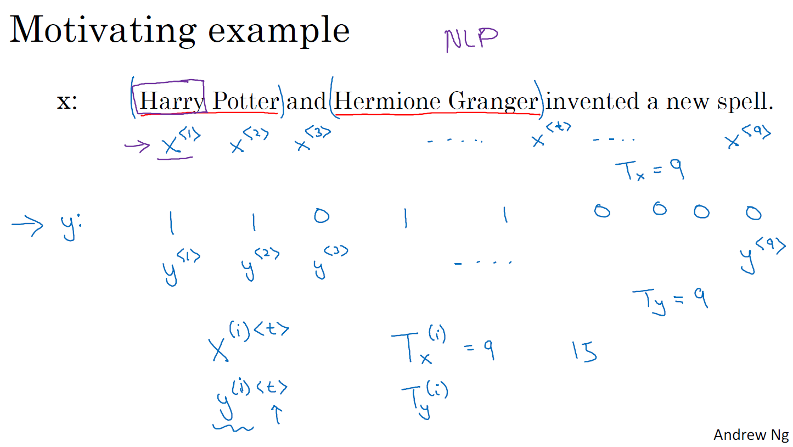

### Representing words
To represent a word in the sentence the first thing you do is come up with a Vocabulary. Sometimes also called a Dictionary and that means making a list of the words that you will use in your representations.

So the first word in the vocabulary is a, that will be the first word in the dictionary. The second word is Aaron and then a little bit further down is the word and, and then eventually you get to the words Harry then eventually the word Potter, and then all the way down to maybe the last word in dictionary is Zulu.

So, a will be word one, Aaron is word two, and in my dictionary the word and appears in positional index 367. Harry appears in position 4075, Potter in position 6830, and Zulu is the last word to the dictionary is maybe word 10,000.

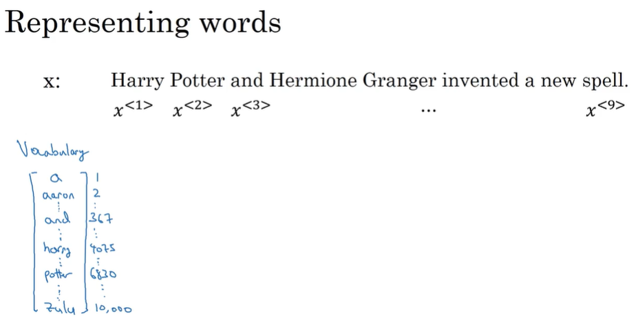

In this example, I'm going to use a dictionary with size 10,000 words. This is quite small by modern NLP applications.

For commercial applications, for visual size commercial applications, dictionary sizes of 30 to 50,000 are more common and 100,000 is not uncommon.

Some of the large Internet companies will use dictionary sizes that are maybe a million words or even bigger than that.

But you see a lot of commercial applications used dictionary sizes of maybe 30,000 or maybe 50,000 words.

I'm going to use 10,000 for illustration since it's a nice round number.

If you have chosen a dictionary of 10,000 words and one way to build this dictionary will be be to look through your training sets and find the top 10,000 occurring words, also look through some of the online dictionaries that tells you what are the most common 10,000 words in the English Language.

What you can do is then use one-hot representations to represent each of these words.

For example, $x^{<1>}$ which represents the word "Harry" would be a vector with all zeros except for a 1 in position 4075 because that was the position of "Harry" in the dictionary. 

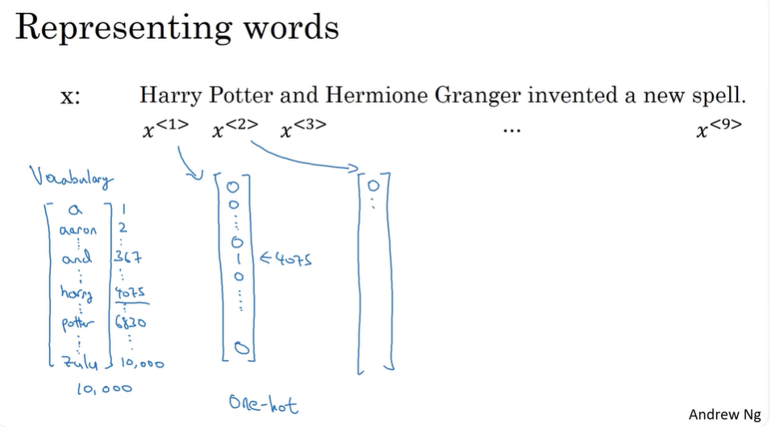

Then $x^{<2>}$ will be again similarly a vector of all zeros except for a 1 in position 6830 and then zeros everywhere else.


The word "and" was represented as position 367 so $x^{<3>}$ would be a vector with zeros of 1 in position 367 and then zeros everywhere else.

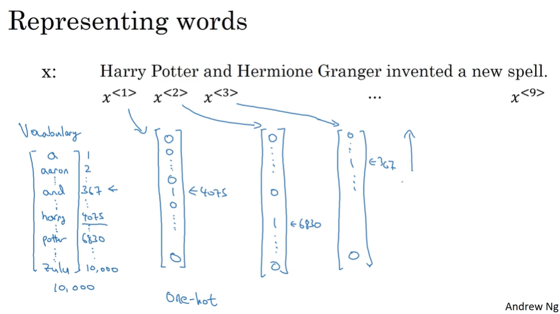

And each of these would be a 10,000 dimensional vector if your vocabulary has 10,000 words.

This one A, I guess because "a" is the first whether the dictionary, then $x^{<7>}$ which corresponds to word "a", that would be the vector 1. This is the first element of the dictionary and then zero everywhere else. 

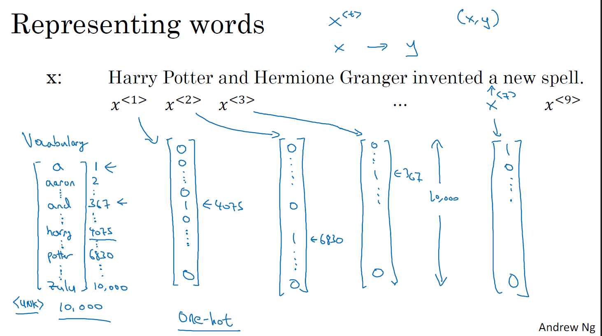

In this representation, $x^{<t>}$ for each of the values of t in a sentence will be a one-hot vector.

One-hot because there's exactly one one is on and zero everywhere else and you will have nine of them to represent the nine words in this sentence.

The goal is given this representation for x to learn a mapping using a sequence model to then target output y, I will do this as a supervised learning problem, I'm sure given the table data with both x and y.

Then just one last detail, which we'll talk more about in a later video is, what if you encounter a word that is not in your vocabulary? Well the answer is, you create a new token or a new fake word called Unknown Word which under note as follows and go back as <UNK> to represent words not in your vocabulary.

To summarize in this video, we described a notation for describing your training set for both x and y for sequence data. In the next video let's start to describe a Recurrent Neural Networks for learning the mapping from x to y. 

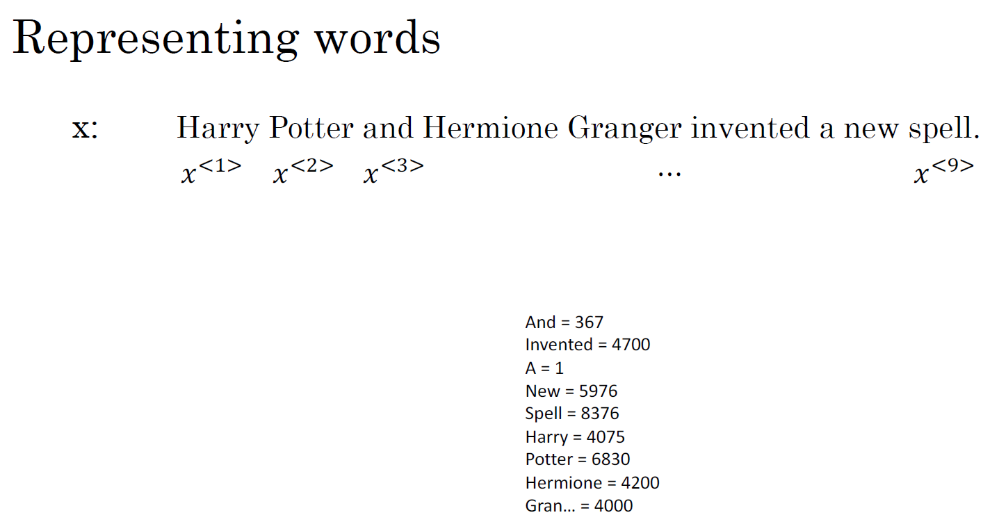

## Recurrent Neural Network Model
### Why not a standard network?
In our previous example, we had 9 input words.

You could imagine trying to take these 9 input words, maybe the 9 one-hot vectors and feeding them into a standard neural network, maybe a few hidden layers, and then eventually had this output the 9 values zero or one that tell you whether each word is part of a person's name.


But this turns out not to work well.

There are really two main problems of this
* The first is that the inputs and outputs can be different lengths and different examples.
  * It's not as if every single example had the same input length Tx or the same upper length Ty.
  * Maybe if every sentence has a maximum length. Maybe you could pad or zero-pad every inputs up to that maximum length but this still doesn't seem like a good representation.
* Standard network doesn’t share features learned across different positions of text.
  * In particular of the neural network has learned that maybe the word Harry appearing in position 1 gives a sign that that's part of a person's name, then wouldn't it be nice if it automatically figures out that Harry appearing in some other position $x^{<t>}$ also means that that might be a person's name.
  * This is maybe similar to what you saw in convolutional neural networks where you want things learned for one part of the image to generalize quickly to other parts of the image, and we like a similar effects for sequence data as well.

Similar to what you saw with ConvNet using a better representation will also let you reduce the number of parameters in your model. 

Previously, we said that each of these inputs is a 10,000 dimensional one-hot vector and so this is just a very large input layer if the total input size was maximum number of words times 10,000.

A weight matrix of this first layer will end up having an enormous number of parameters. 

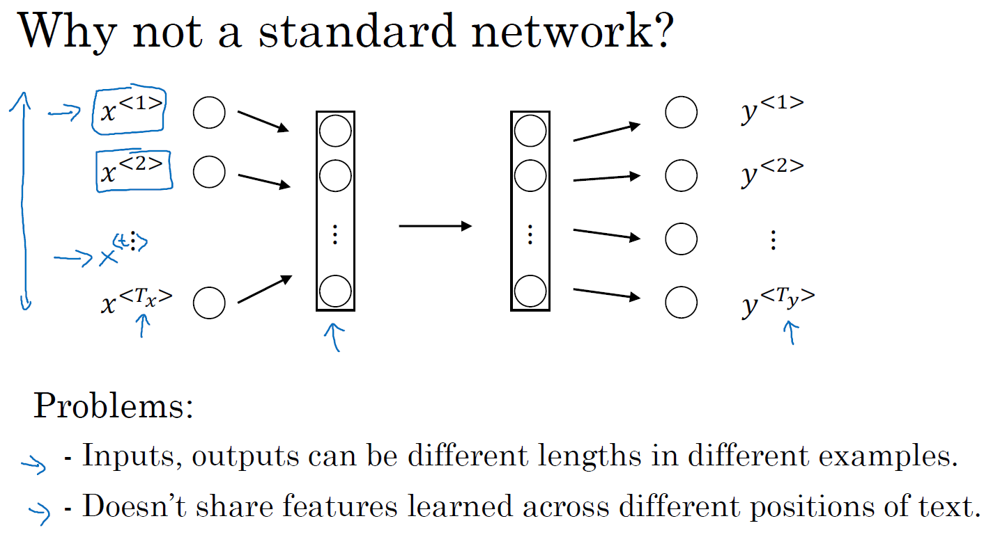

### Recurrent Neural Networks
If you are reading the sentence from left to right, the first word you will read is the some first words say $x^{<1>}$, and what we're going to do is take the first word and feed it into a neural network layer.

There's a hidden layer of the first neural network and we can have the neural network maybe try to predict the output. So is this part of the person's name or not.

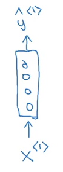

When it then goes on to read the second word in the sentence, say $x^{<2>}$, instead of just predicting $\hat{y}^{<2>}$ using only $x^{<2>}$, it also gets to input some information from whether the computer that time step one.

In particular, the activation value from time step one is passed on to time step two.

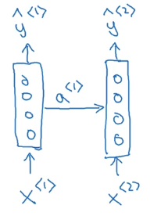

Then at the next time step, recurrent neural network inputs the third word $x^{<3>}$ and it tries to output some prediction, $\hat{y}^{<3>}$ and so on up until the last time step where it inputs $x^{<T_x>}$ and then it outputs $\hat{y}^{<T_y>}$.

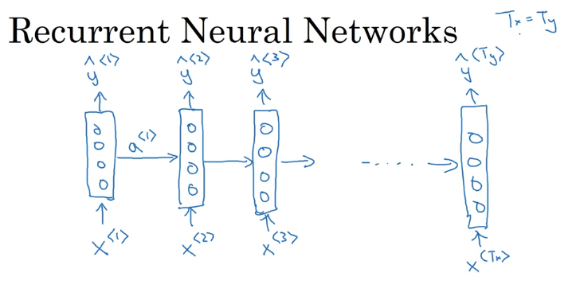

At least in this example, $T_x=T_y$ and the architecture will change a bit if $T_x$ and $T_y$ are not identical.

At each time step, the recurrent neural network that passes on as activation to the next time step for it to use.

To kick off the whole thing, we'll also have some either made-up activation at time zero, this is usually the vector of zeros. Some researchers will initialized $a^{<0>}$ randomly. You have other ways to initialize $a^{<0>}$ but really having a vector of zeros as the fake times zero activation is the most common choice and that gets input to the NN.

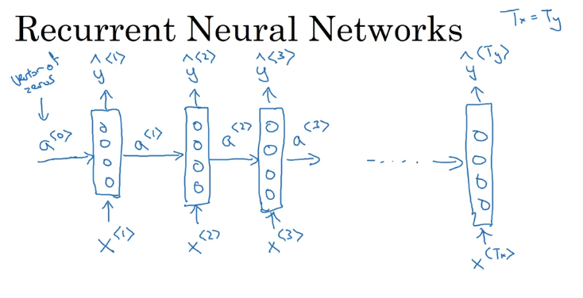

In some research papers or in some books, you see this type of neural network drawn with the following diagram in which at every time step you input x and output y_hat. Maybe sometimes there will be a t index there and then to denote the recurrent connection, sometimes people will draw a loop like that, that the layer feeds back to itself. Sometimes, they'll draw a shaded box to denote that this is the shaded box here, denotes a time delay of one step.

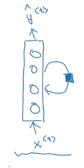

_I personally find these recurrent diagrams much harder to interpret and so throughout this course, I'll tend to draw the unrolled diagram like the one you have on the left, but if you see something like the diagram on the right in a textbook or in a research paper, what it really means or the way I tend to think about it is to mentally unroll it into the diagram you have on the left instead. The recurrent neural network scans through the data from left to right._

The parameters it uses for each time step are shared. So there'll be a set of parameters which we'll describe in greater detail on the next slide, but the parameters governing the connection from X1 to the hidden layer, will be some set of parameters we're going to write as $W_{ax}$.

It's the same parameters $W_{ax}$ that it uses for every time step. 

The activations, the horizontal connections will be governed by some set of parameters $W_{aa}$.

The same parameters Waa use on every timestep and similarly the sum $W_{ya}$ that governs the output predictions.

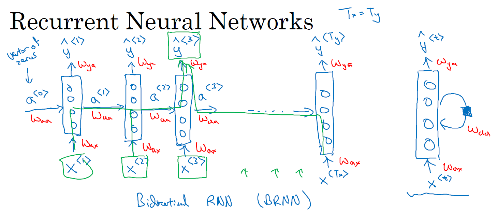

In this recurrent neural network, what this means is that when making the prediction for $y^{<3>}$, it gets the information not only from $x^{<3>}$ but also the information from $x^{<1>}$ and $x^{<2>}$ because the information on $x^{<1>}$ can pass through this way to help to prediction with $y^{<3>}$.

One weakness of this RNN is that it only uses the information that is earlier in the sequence to make a prediction. In particular, when predicting $y^{<3>}$, it doesn't use information about the words $x^{<4>}$, $x^{<5>}$, $x^{<6>}$ and so on.

This is a problem because if you are given a sentence, "He said Teddy Roosevelt was a great president."

In order to decide whether or not the word Teddy is part of a person's name, it would be really useful to know not just information from the first two words but to know information from the later words in the sentence as well because the sentence could also have been, "He said teddy bears they're on sale." So given just the first 3 words is not possible to know for sure whether the word Teddy is part of a person's name. In the first example, it is. In the second example, it is not. But you can't tell the difference if you look only at the first 3 words. 

One limitation of this particular neural network structure is that the prediction at a certain time uses inputs or uses information from the inputs earlier in the sequence but not information later in the sequence.

We will address this in a later video where we talk about bi-directional recurrent neural networks or BRNN. But for now, this simpler unidirectional neural network architecture will suffice to explain the key concepts.

### Forward Propagation
Let's now write explicitly what are the calculations that this neural network does. Here's a cleaned up version of the picture of the neural network. 

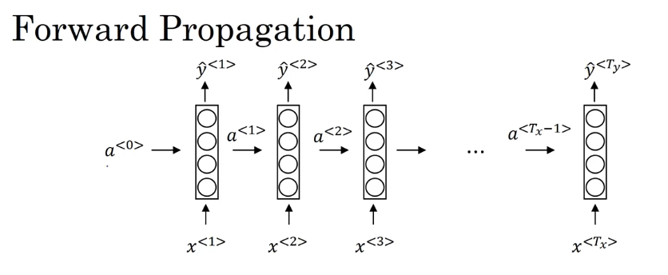

Typically, you started off with the input $a^{<0>}$ equals the vector of all zeros.

Next, this is what forward propagation looks like. To compute $a^{<1>}$, you would compute that as an activation function g applied to $<W_{aa}>$ times $a^{<0>}$ plus $<W_{aa}>$ times $a^{<1>}$ plus a bias $b_a$

Then to compute $\hat{y}^{<1>}$, the prediction at times at 1, that will be some activation function, maybe a different activation function than the one above but applied to $<W_{ya}>$ times $a^{<1>}$ plus $b_y$.

$a^{<1>}=g(W_{aa}a^{<0>} + W_{ax}x^{<1>} + b_a)$

$\hat{y}^{<1>}=g(W_{ya}a^{<1>}+b_y)$

The notation convention I'm going to use for the substrate of these matrices like that example, $W_{ax}$. The second index means that this $W_{ax}$ is going to be multiplied by some x-like quantity, and this a means that this is used to compute some a-like quantity like so.

Similarly, $W_{ya}$ is multiplied by some a-like quantity to compute a y-type quantity.

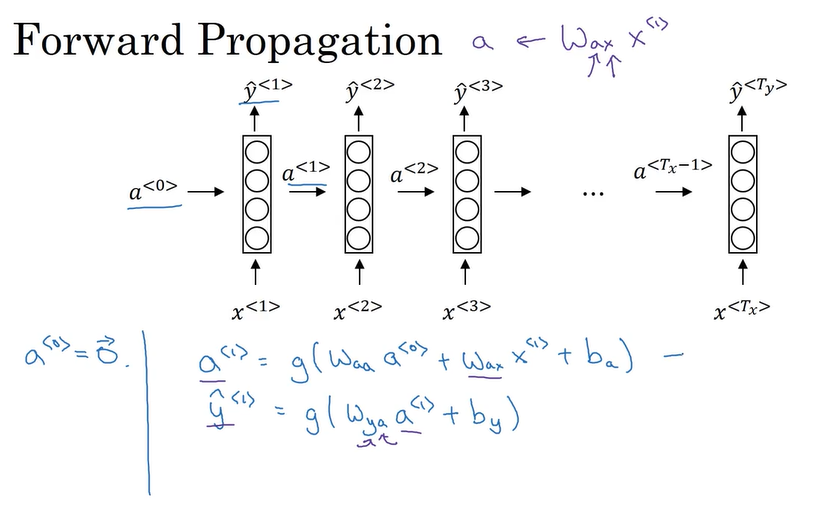

The activation function using or to compute the activations will often be a tanh in the choice of an RNN and sometimes ReLU are also used although the tanh is actually a pretty common choice.

We have other ways of preventing the vanishing gradient problem, which we'll talk about later this week. Depending on what your output y is, if it is a binary classification problem, then I guess you would use a sigmoid activation function, or it could be a softmax that you have a k-way classification problem that the choice of activation function here will depend on what type of output y you have.

For the name entity recognition task where y was either 0 or 1, I guess a second g could be a sigmoid activation function.

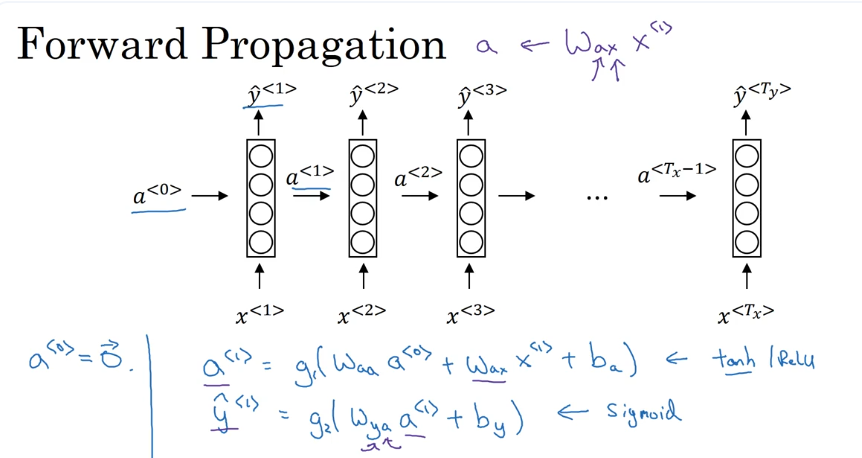

Then I guess you could write g2 if you want to distinguish that this could be different activation functions but I usually won't do that.

Then more generally, at time t, $a^{<t>}$ will be g of $W_{aa}$ times a from the previous time step plus $W_{ax}$ of x from the current time step plus $b_a$, and y hat t is equal to g. Again, it could be different activation functions but g of $W_{ya}$ times at plus $b_y$.

$a^{<t>}=g(W_{aa}a^{<t-1>} + W_{ax}x^{<t>} + b_a)$

$\hat{y}^{<t>}=g(W_{ya}a^{<t>}+b_y)$

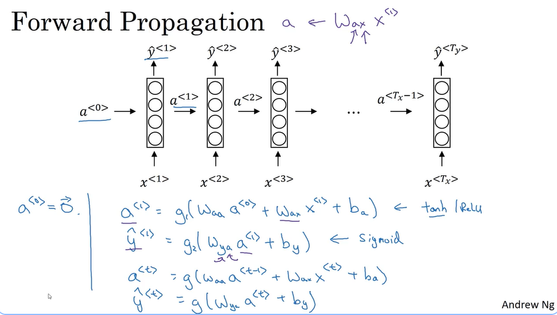

This equation is defined forward propagation in a neural network where you would start off with $a^{<0>}$ is the vector of all zeros, and then using $a^{<t>}$ and $x^{<1>}$, you will compute $a^{<1>}$ and $\hat{y}^{<1>}$, and then you take $x^{<2>}$ and use $x^{<2>}$ and $a^{<1>}$ to compute $a^{<2>}$ and $\hat{y}^{<2>}$, and so on.

You'd carry out forward propagation going from the left to the right of this picture.

### Simplified RNN notation
In order to help us develop the more complex neural networks, I'm actually going to take this notation and simplify it a little bit. So, let me copy these two equations to the next slide.

$a^{<t>}=g(W_{aa}a^{<t-1>} + W_{ax}x^{<t>} + b_a)$

$\hat{y}^{<t>}=g(W_{ya}a^{<t>}+b_y)$

What I'm going to do is actually take, so to simplify the notation a bit, I'm actually going to take $\hat{y}^{<t>}=g(W_{ya}a^{<t>}+b_y)$ and write in a slightly simpler way.

$a^{<t>}=g(W_{a}[a^{<t-1>}, x^{<t>}] + b_a)$

That underlying quantity on the left and right are supposed to be equivalent. So the way we define Wa is we'll take this matrix Waa, and this matrix Wax, and put them side by side, stack them horizontally as follows, and this will be the matrix Wa. 

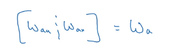

For example, if a was a 100 dimensional, and in our running example x was 10,000 dimensional, then Waa would have been a 100 by 100 dimensional matrix, and Wax would have been a 100 by 10,000 dimensional matrix.

As we're stacking these two matrices together, this would be 100-dimensional. This will be 100, and this would be I guess 10,000 elements. So, Wa will be a 100 by 10100 dimensional matrix.

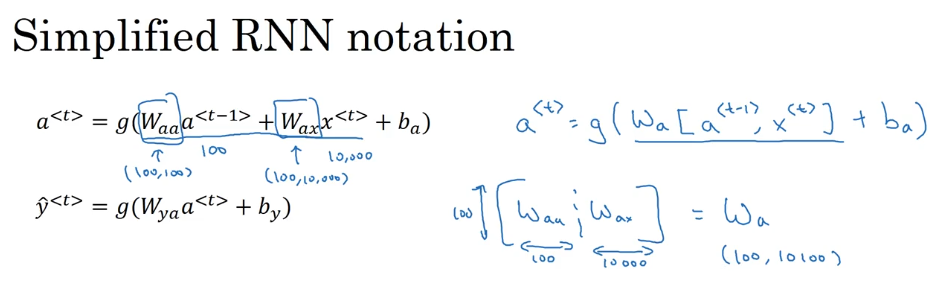

Wax would be a very wide matrix.

What this notation means, 

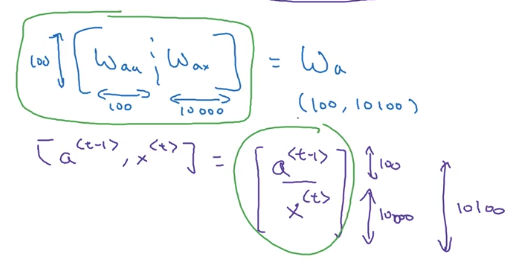

is to just take the two vectors and stack them together. So, when you use that notation to denote that, we're going to take the vector at minus one, so that's a 100 dimensional and stack it on top of at, so, this ends up being a 10100 dimensional vector. 

You can check for yourself that this matrix [Waa Wax] times this vector $[a^{<t-1>}, x^{<t>}]$ just gives you back the original quantity.

Because now, this matrix Waa times Wax multiplied by this at minus one $x^{<t>}$ vector, this is just equal to Waa times at minus one plus Wax times xt, which is exactly what we had back over here. 

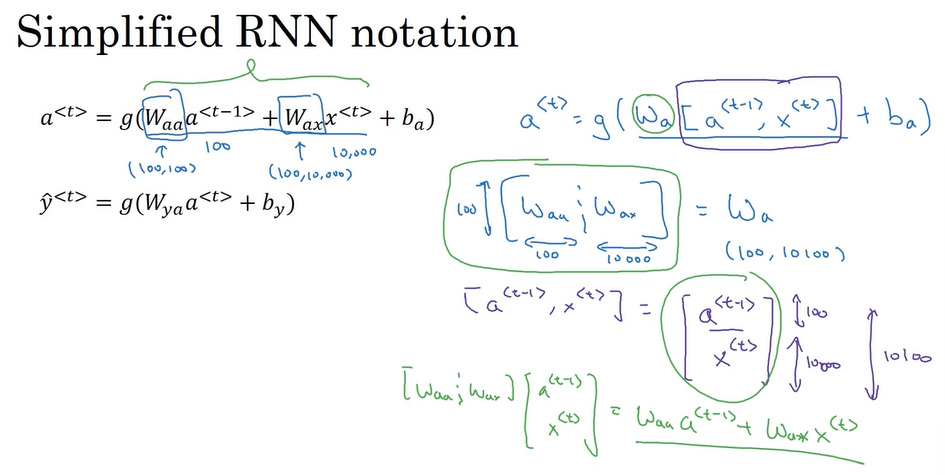

The advantage of this notation is that rather than carrying around two parameter matrices, Waa and Wax, we can compress them into just one parameter matrix Wa, and just to simplify our notation for when we develop more complex models.

Then for $\hat{y}^{<t>}$ in a similar way, I'm going to write this as Wy at plus by,

$\hat{y}^{<t>}=g(W_{y}a^{<t>}+b_y)$

Now we just have two subscript in the notation Wy and by, it denotes what type of output quantity we're computing.

So, Wy indicates a weight matrix or computing a y-like quantity, and here at Wa and ba on top indicates where does this parameters for computing like an a an activation output quantity. 

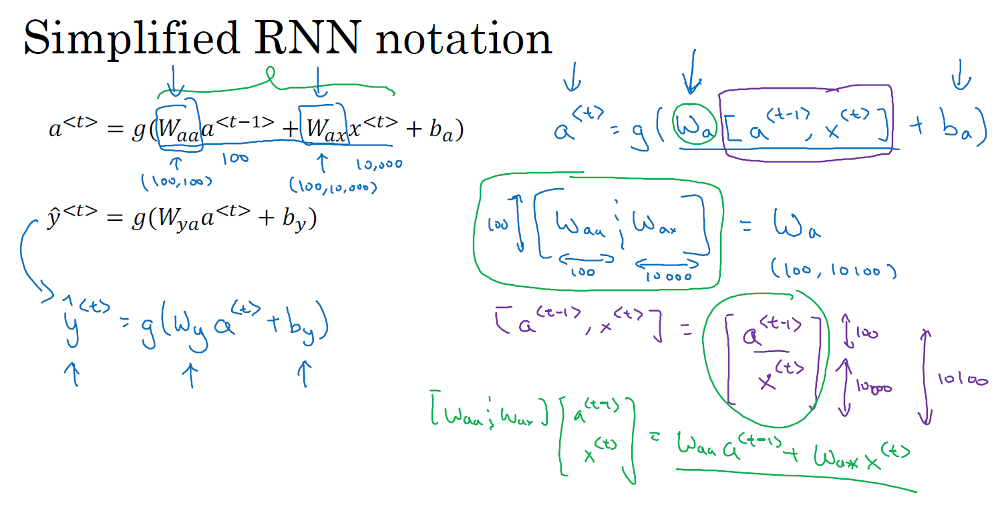

### Backpropagation Through Time
Usually programming framework will take care of back propagation.

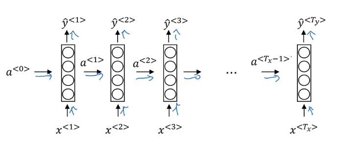

Forward Prop is from left to right in this photo.

In backprop, you end up carrying backpropagation calculations in basically the opposite direction of the forward prop arrows. 

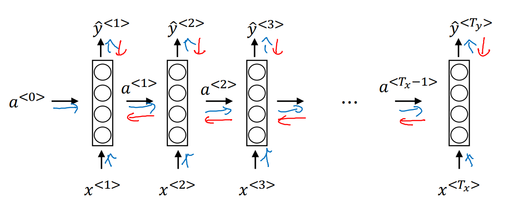

You are given input sequences $x^{<1>}$ to $x^{<T_x>}$. We also have corresponding $a^{<1>}$ to $a^{<T_x>}$.

To compute $a^{<1>}$, we need also $W_a$ and $b_a$. These parameters are used in every single timestep.

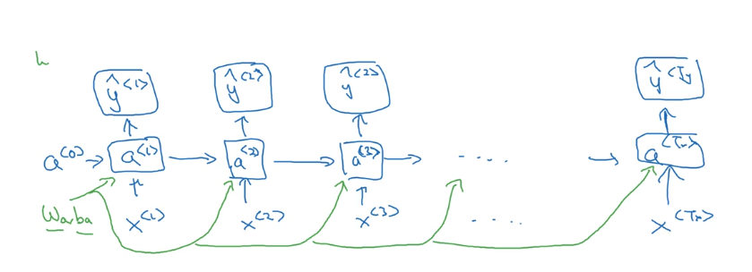

We also have corresponding $\hat{y}^{<1>}$ to $\hat{y}^{<T_y>}$.

To compute $\hat{y}$, we need parameters $W_y$ and $b_y$. These parameters go to every single node as well.


Next, in order to compute backpropagation, you need a loss function.

Let's define an element-wise loss, which is supposed for a certain word in the sequence, it's a person's name, so $y^{<t>}$ is 1, and NN outputs some probability of maybe 0.1 of the particular word being a person's name.

I'm going to define this as the standard logistic regression loss, also called the cross entropy loss.

This may look familiar to you from where we were previously looking at binary classification problems.

This is the loss associated with a single prediction at a single position or at a single time set, t, for a single word.

$\ell^{<t>}(\hat{y}^{<t>},y^{<y>})= -y^{<t>}log\hat{y}^{<t>} - (1-y^{<t>})log(1-\hat{y}^{<t>})$

Let's now define the overall loss of the entire sequence. Note that Tx = Ty in this example.

$\ell(\hat{y}^{<t>},y^{<y>}) = \Sigma_{t=1}^{T_x}\ell^{<t>}(\hat{y}^{<t>},y^{<y>})$

In a computation graph, to compute the loss given $\hat{y}^{<1>}$, you can then compute the loss for the first timestep given that you compute the loss for the second timestep, the loss for the third timestep, and so on, the loss for the final timestep.

Then lastly, to compute the overall loss, we will take these and sum them all up to compute the final L using that equation, which is the sum of the individual per timestep losses.

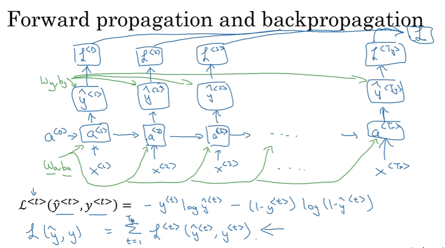

Backprop just requires doing computations or parsing messages in the opposite directions.

That then, allows you to compute all the appropriate quantities that lets you then, take the derivatives, respected parameters, and update the parameters using gradient descent. 

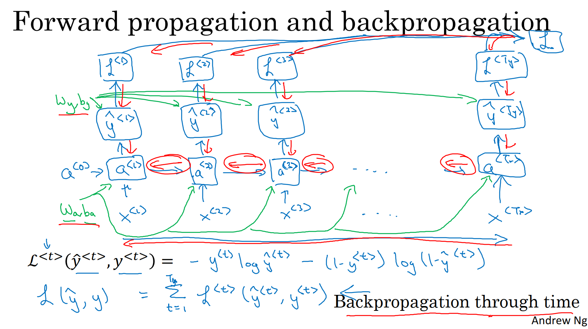

In this back propagation procedure, the most significant message or the most significant recursive calculation is it goes from right to left, and that's why it gives this algorithm as well, a pretty fast full name called backpropagation through time.

The motivation for this name is that for forward prop, you are scanning from left to right, increasing indices of the time, t.

Whereas, the backpropagation, you're going from right to left, you're kind of going backwards in time. So this gives this, I think a really cool name, backpropagation through time, where you're going backwards in time. That phrase really makes it sound like you need a time machine to implement this output, but I just thought that backprop through time is just one of the coolest names for an algorithm.

So far, you've only seen this main motivating example in RNN, in which the length of the input sequence was equal to the length of the output sequence.

## Different Types of RNNs
So far, you've seen an RNN architecture where the number of inputs, Tx, is equal to the number of outputs, Ty. It turns out that for other applications, Tx and Ty may not always be the same, and in this video, you'll see a much richer family of RNN architectures.

The presentation in this video was inspired by a blog post by Andrej Karpathy, titled, The Unreasonable Effectiveness of Recurrent Neural Networks.

### Examples of RNN architectures
The example you've seen so far use Tx = Ty, where we had an input sequence $x^{<1>}$ to $x^{<T_x>}$, and we had a recurrent neural network that works as follows when we would input $x^{<1>}$ to compute $\hat{y}^{<1>}$ to $\hat{y}^{<T_y>}$, as follows.

In early diagrams, I was drawing a bunch of circles here to denote neurons but I'm just going to make those little circles for most of this video, just to make the notation simpler.


This is what you might call a many-to-many architecture because the input sequence has many inputs as a sequence and the outputs sequence is also has many outputs.

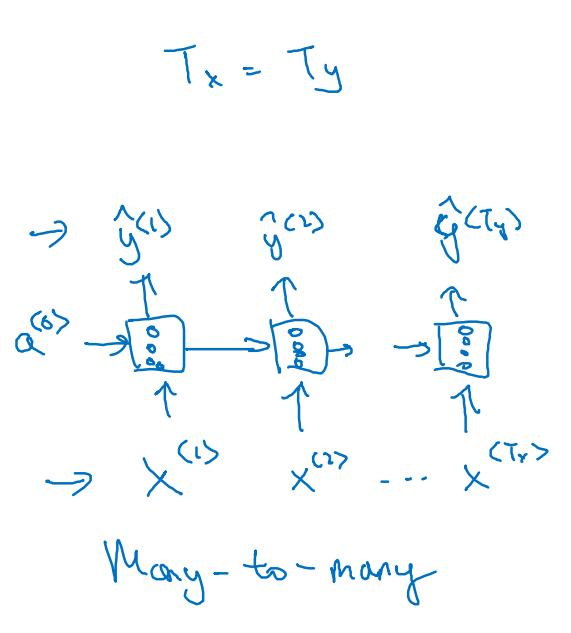

Let's say, you want to address sentiments classification.

Here, x might be a piece of text, such as it might be a movie review that says, "There is nothing to like in this movie." So x is going to be sequenced, and y might be a number from 1 to 5, or maybe 0 or 1. This is a positive review or a negative review, or it could be a number from 1 to 5. Do you think this is a one-star, two-star, three, four, or five-star review?

In this case, we can simplify the neural network architecture as follows. I will input $x^{<1>}$ to $x^{<T_x>}$.

Input the words one at a time. So if the input text was, "There is nothing to like in this movie." So "There is nothing to like in this movie," would be the input.

Then rather than having to use an output at every single time-step, we can then just have the RNN read into entire sentence and have it output y at the last time-step when it has already input the entire sentence.

This neural network would be a many-to-one architecture. Because as many inputs, it inputs many words and then it just outputs one number.

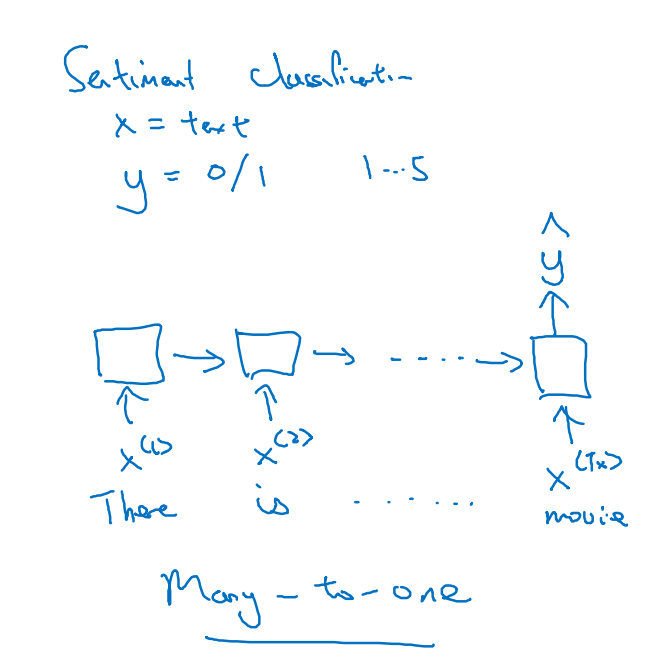

For the sake of completeness, there is also a one-to-one architecture. 

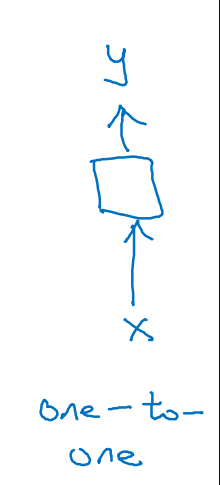

This one is maybe less interesting. The smaller the standard neural network, we have some input x and we just had some output y. And so, this would be the type of neural network that we covered in the first two courses in this sequence.

Now, in addition to many-to-one, you can also have a one-to-many architecture.

An example of a one-to-many neural network architecture will be music generation.

In fact, you get to implement this yourself in one of the primary exercises for this course where you go is have a neural network, output a set of notes corresponding to a piece of music.

x -> $y^{<1>}$ to $y^{<T_y>}$

The input x could be maybe just an integer, telling it what genre of music you want or what is the first note of the music you want, and if you don't want to input anything, x could be a null input, could always be the vector zeroes as well.

For that, the neural network architecture would be your input x. And then, have your RNN outputs the first value, and then, have that, with no further inputs, output. The second value and then go on to output. The third value, and so on, until you synthesize the last notes of the musical piece.

One technical now what you see in the later video is that, when you're actually generating sequences, often you take these first synthesized output and feed it to the next layer as well.

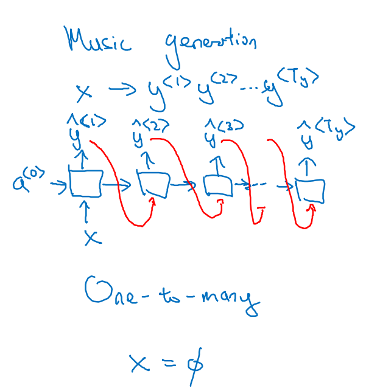

It turns out there's one more interesting example of many-to-many which is worth describing. Which is when the input and the output length are different.

In the many-to-many example, you saw just now, the input length and the output length have to be exactly the same.

For an application like machine translation, the number of words in the input sentence, say a French sentence, and the number of words in the output sentence, say the translation into English, those sentences could be different lengths.

You might have a neural network, first, reading the sentence. So first, reading the input, say French sentence that you want to translate to English. And having done that, you then, have the neural network output the translation.

With this architecture, Tx and Ty can be different lengths.

This that neural network architecture has two distinct parts. 
* There's the encoder which takes as input, say a French sentence.
* Then, there's is a decoder, which having read in the sentence, outputs the translation into a different language.

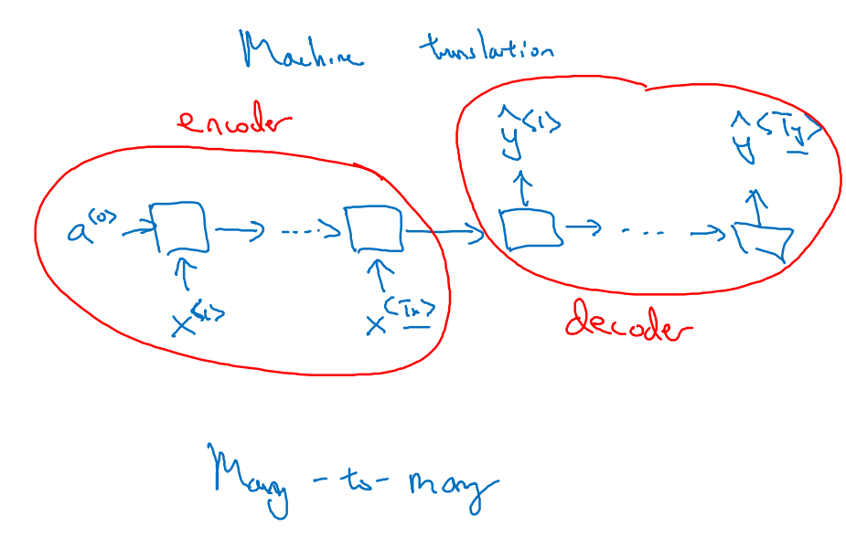

Technically, there's one other architecture which we'll talk about only in week four, which is attention based architectures. Which maybe isn't clearly captured by one of the diagrams we've drawn so far.

### Summary of RNN types
To summarize the wide range of RNN architectures.

There is one-to-one, although if it's one-to-one, we could just give it this, and this is just a standard generic neural network. Well, you don't need an RNN for this.

There is one-to-many. So, this was a music generation or sequenced generation as example.

Then, there's many-to-one, that would be an example of sentiment classification where you might want to read as input all the text with a movie review then, try to figure out that they liked the movie or not.

There is many-to-many, so the name entity recognition, the example we've been using, was this where Tx is equal to Ty.

Then, finally, there's this other version of many-to-many, where for applications like machine translation, Tx and Ty no longer have to be the same.

Now you know most of the building blocks, the building are pretty much all of these neural networks except that there are some subtleties with sequence generation, which is what we'll discuss in the next video. 


## Language Model and Sequence Generation
### What is language modelling?
Let's say you're building a speech recognition system and you hear the sentence: "the apple and pear salad was delicious". What did you just hear me say?

* The apple and pair salad.
* Or The apple and pear salad.

You probably think the second sentence is much more likely. In fact, that's what a good speech recognition system would output, even though these two sentences sound exactly the same.

The way a speech recognition system picks the second sentence is by using a language model which tells it what is the probability of either of these two sentences.

For example, a language model might say that
* The chance of the first sentences is P(The apple and pair salad) = $3.2x10^{-13}$.
* The chance of the second sentence is P(The apple and pear salad) = $5.7x10^{-10}$.

With these probabilities, the second sentence is much more likely by over a factor of $10^3$ compared to the first sentence, and that's why a speech recognition system will pick the second choice. 

What a language model does is, given any sentence, its job is to tell you what is the probability of that particular sentence.

By probability of sentence, I mean, if you were to pick up a random newspaper, open a random email, or pick a random webpage, or listen to the next thing someone says, the friend of you says, what is the chance that the next sentence you read somewhere out there in the world will be a particular sentence like the apple and pear salad.

This is a fundamental component for both speech recognition systems as you've just seen, as well as for machine translation systems, where translation systems want to output only sentences that are likely.

The basic job of a language model is to input the sentence which I'm going to write as a sequence $y^{<1>}$ to $y^{<T_y>}$, and for language model, it'll be useful to represent the sentences as outputs y rather than as inputs x.

What a language model does is it estimates the probability of that particular sequence of words.

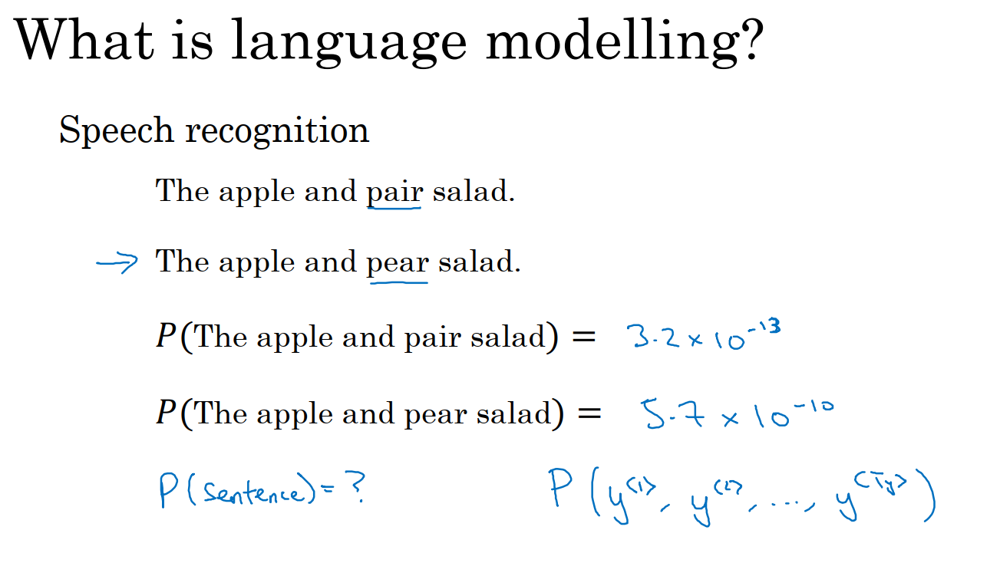

### Language modelling with an RNN
How do you build a language model?

To build such a model using a RNN, you will first need a training set comprising a large corpus of English text or text from whatever language you want to build a language model of.

The word corpus is an NLP terminology that just means a large body or a very large set of English sentences.

Let's say you get a sentence in your training set as follows: "cats average 15 hours of sleep a day".

* The first thing you would do is tokenize the sentence, and that means you would form a vocabulary as we saw in an earlier video.
* Then map each of these words to say one-hot vectors or to indices in your vocabulary.

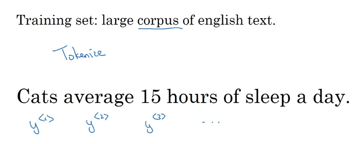

* One thing you might also want to do is model when sentences end. So another common thing to do is to add an extra token called <EOS> that stands for end of sentence, that can help you figure out when a sentence ends. We'll talk more about this later. But the EOS token can be appended to the end of every sentence in your training set if you want your model to explicitly capture when sentences end.
  * We won't use the end-of-sentence token for the problem exercise at the end of this week.
  * For some applications, you might want to use this, and we'll see later where this comes in handy.

For this example we have $y^{<1>}$ to $y^{<9>}$, 9 inputs in this example if you append the end of sentence token to the end.

Doing the tokenization step, you can decide whether or not the period should be a token as well. In this example, I'm just ignoring punctuation, so I'm just using "day" as another token and omitting the period. If you want to treat the period or other punctuation as the explicit token, then you could add the period to your vocabulary as well.

One other detail would be, what if some of the words in your training set are not in your vocabulary?

```
"The Egyptian Mau is a bread of cat. <EOS>"
```

If your vocabulary uses 10,000 words, maybe the 10,000 most common words in English, then the term "Mau" in the sentence above, that might not be in one of your top 10,000 tokens. 

In that case, you could take the word "Mau" and replace it with a unique token called `<UNK>`, which stands for unknown words, and we just model the chance of the unknown word instead of the specific word, "Mau".

Having carried out the tokenization step, which basically means taking the input sentence and map here to the individual tokens or the individual words in your vocabulary, next, let's build an RNN to model the chance of these different sequences.

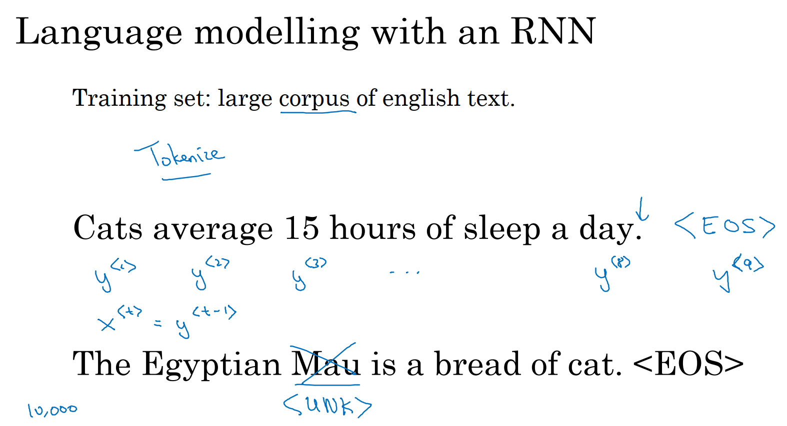

One of the things we'll see on the next slide is that you end up setting the inputs $x^{<t>}$ to be equal to $y^{<t-1>}$.

### RNN model
Let's go on to build the RNN model, and I'm going to continue to use this sentence as the running example.
```
"Cats average 15 hours of sleep a day. <EOS>"
```

At time zero, you're going to end up computing some activation $a^{<1>}$ as a function of some input $x^{<1>}$, and $x^{<1>}$ would just be set to zero vector.

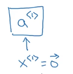

The previous $a^{<0>}$ by convention, also set that to vector zeros.

What $a^{<1>}$ does is it will make a Softmax prediction to try to figure out what is the probability of the first word y, so that's going to be $\hat{y}^{<1>}$.

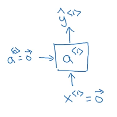

What this step does is really it has a Softmax, so it's trying to predict what is the probability of any word in a dictionary, what's the chance that the first word is "a", what's the chance that the first word is "Aaron", and then what's the chance that the first word is "cats", all the way up to what's the chance the first word is "Zulu", or what's the chance that the first word is an "unknown" word, or what's the chance that the first words is in a sentence though or shouldn't happen really.

$\hat{y}^{<1>}$ is output according to a Softmax, it just predicts what's the chance that the first word being whatever it ends up being, in our example, one of the bigger the word "cats".

Then the RNN steps forward to the next step and has some activation $a^{<2>}$ in the next step.

At this step, it's job is to try to figure out what is the second word. But now we will also give it the correct first word. We'll tell it that this, in reality, the first word was actually "cats", so that's $y^{<1>}$, so tell it cats.

This is why $y^{<1>}$ = $x^{<2>}$.

At the second step, the output is again predicted by Softmax, the RNN's job is to predict what's the chance of it being whatever word it is, is it A or Aaron, or cats or Zulu, or unknown word or EOS or whatever, given what had come previously. In this case, I guess the right answer was "average" since the sentence starts with "cats average". 

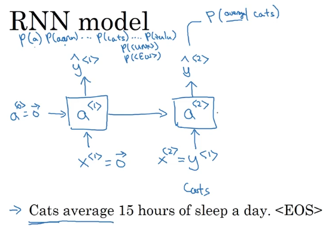

Then you go on to the next step of the RNN where you now compute $a^{<3>}$. But to predict what is the third word which is "15", we can now give it the first two words. We're going to tell "cats average" of the first two words. This next input here, $x^{<3>}$ will be equal to $y^{<2>}$, so the word "average" is input and its job is to figure out what is the next word in the sequence. In other word, it's trying to figure out what is the probability of any words in the dictionary given that what just came before was "cats average".

In this case, the right answer is "15" and so on.

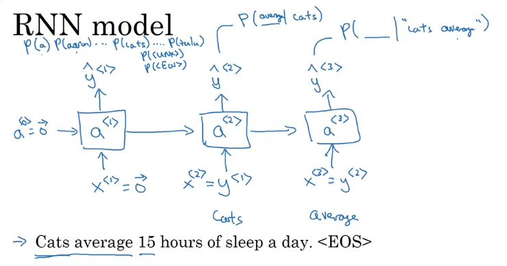

Until at the end, you end up at I guess time step nine, you end up feeding it $x^{<9>}$ which is equal to $y^{<8>}$ which is the word "day". Then this has $a^{<9>}$ and its job is to open $\hat{y}^{<9>}$, and this happens to be the EOS tokens.

What's the chance of whatever it is given everything that's come before? Hopefully you'll predict that there's a high chance of EOS in the sentence token.

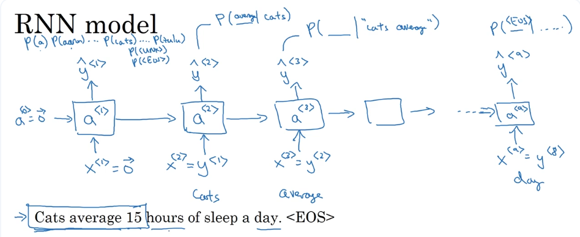

Each step in the RNN will look at some set of preceding words such as, given the first three words, what is the distribution over the next word? This RNN learns to predict one word at a time going from left to right.

Next, to train this through a network, we're going to define the cost function.

$\ell(\hat{y}^{<t>},y^{<t>}) = - \Sigma_{i}y_i^{<t>}log\hat{y}_i^{<t>}$

At a certain time t, if the true word was $y^{<t>}$ and your network Softmax predicted some $\hat{y}_i^{<t>}$, then this is the Softmax loss function that you'll already be familiar with, and then the overall loss is just the sum over all time steps of the losses associated with the individual predictions. 

$\ell = \Sigma_t \ell^{<t>}(\hat{y}^{<t>},y^{<t>})$

If you train this RNN on a large training set, what it will be able to do is, given any initial set of words such as "cats average 15" or "cats average 15 hours of", it can predict what is the chance of the next word.

Given a new sentence, say $y^{<1>}$, $y^{<2>}$, $y^{<3>}$, with just three words for simplicity, the way you can figure out what is the chance of this entire sentence would be, well, the first Softmax tells you what's the chance of $y^{<1>}$, that would be this first output. Then the second one can tell you what's the chance of p of $y^{<2>}$ given $y^{<1>}$. Then the third one tells you what's the chance of $y^{<3>}$ given $y^{<1>}$ and $y^{<3>}$, and so it's by multiplying out these three probabilities.

$P(y^{<1>},y^{<2>},y^{<3>})=P(y^{<1>})P(y^{<2>}|y^{<1>})P(y^{<3>}|y^{<1>},y^{<2>})$

By multiplying out these three that you end up with the probability of this three words sentence.

## Sampling Novel Sequences


