# Week 2: Natural Language Processing & Word Embeddings

**Learning Objectives**
* Explain how word embeddings capture relationships between words
* Load pre-trained word vectors
* Measure similarity between word vectors using cosine similarity
* Use word embeddings to solve word analogy problems such as Man is to Woman as King is to ______.
* Reduce bias in word embeddings
* Create an embedding layer in Keras with pre-trained word vectors
* Describe how negative sampling learns word vectors more efficiently than other methods
* Explain the advantages and disadvantages of the GloVe algorithm
* Build a sentiment classifier using word embeddings
* Build and train a more sophisticated classifier using an LSTM

- [Week 2: Natural Language Processing \& Word Embeddings](#week-2-natural-language-processing--word-embeddings)
  - [Word Representation](#word-representation)
    - [Word representation](#word-representation-1)
    - [Featurized representation: word embedding](#featurized-representation-word-embedding)
    - [Visualizing word embeddings](#visualizing-word-embeddings)
  - [Using Word Embeddings](#using-word-embeddings)
    - [Named entity recognition example](#named-entity-recognition-example)
    - [Transfer learning and word embeddings](#transfer-learning-and-word-embeddings)
    - [Relation to face encoding](#relation-to-face-encoding)
  - [Properties of Word Embeddings](#properties-of-word-embeddings)
    - [Analogies](#analogies)
    - [Analogies using word vectors](#analogies-using-word-vectors)
    - [Cosine similarity](#cosine-similarity)
    - [Summary](#summary)
      - [Property #1 — Word Embeddings Capture Meaningful Similarity](#property-1--word-embeddings-capture-meaningful-similarity)
      - [Property #2 — Word Embeddings Capture Analogies](#property-2--word-embeddings-capture-analogies)
  - [Embedding Matrix](#embedding-matrix)
  - [Learning Word Embeddings](#learning-word-embeddings)
    - [Neural language model](#neural-language-model)
    - [Other context/target pairs](#other-contexttarget-pairs)
  - [Word2Vec](#word2vec)
    - [Skip-grams](#skip-grams)
    - [Model](#model)
    - [Problems with softmax classification](#problems-with-softmax-classification)
  - [Negative Sampling](#negative-sampling)
    - [Defining a new learning problem](#defining-a-new-learning-problem)
    - [Model](#model-1)
    - [Selecting negative examples](#selecting-negative-examples)
  - [GloVe Word Vectors](#glove-word-vectors)
    - [GloVe (global vectors for word representation)](#glove-global-vectors-for-word-representation)
    - [Model](#model-2)
    - [A note on the featurization view of word embeddings](#a-note-on-the-featurization-view-of-word-embeddings)
  - [Sentiment Classification](#sentiment-classification)
    - [Sentiment classification problem](#sentiment-classification-problem)
    - [Simple sentiment classification model](#simple-sentiment-classification-model)
    - [RNN for sentiment classification](#rnn-for-sentiment-classification)
  - [Debiasing Word Embeddings](#debiasing-word-embeddings)
    - [The problem of bias in word embeddings](#the-problem-of-bias-in-word-embeddings)
    - [Addressing bias in word embeddings](#addressing-bias-in-word-embeddings)


## Word Representation
### Word representation
Last week, we learned about RNNs, GRUs, and LSTMs. In this week, you see how many of these ideas can be applied to NLP, to Natural Language Processing, which is one of the features of AI because it's really being revolutionized by deep learning.

One of the key ideas you learn about is word embeddings, which is a way of representing words that let your algorithms automatically understand analogies like that, man is to woman, as king is to queen, and many other examples.

Through these ideas of word embeddings, you'll be able to build NLP applications, even with models of size usually relatively small label training sets. Finally towards the end of the week, you'll see how to debias word embeddings that's to reduce undesirable gender or ethnicity or other types of bias that learning algorithms can sometimes pick up.

So far, we've been representing words using a vocabulary of words, and a vocabulary from the previous week might be say, 10,000 words.

V = [a, aaron, ..., zulu, `<UNK>`]

|V| = 10000

We've been representing words using a one-hot vector.

For example, if man is word number 5391 in this dictionary, then you represent him with a vector with 1 in position 5391. And I'm also going to use $O_{5391}$ to represent this factor, where O here stands for one-hot.

Then, if woman is word number 9853, then you represent it with $O_{9853}$ which just has a 1 in position 9853 and 0's elsewhere. 

And then other words king, queen, apple, orange will be similarly represented with one-hot vector.

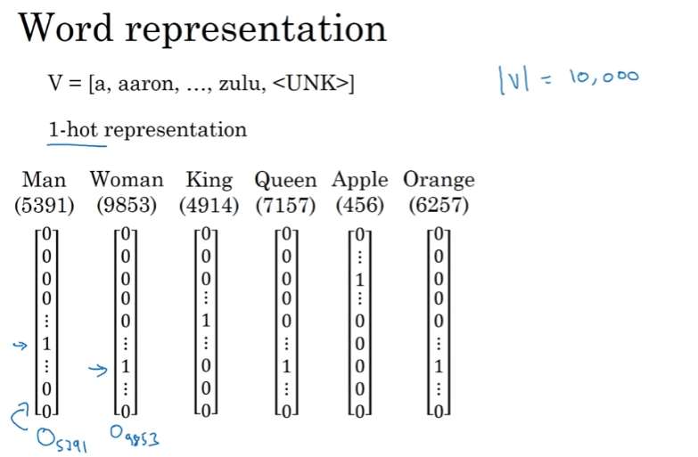

One of the weaknesses of this representation is that it treats each word as a thing unto itself, and it doesn't allow an algorithm to easily generalize the cross words.

For example, let's say you have a language model that has learned that when you see "I want a glass of orange __".

Well, what do you think the next word will be? Very likely, it'll be juice.

But even if the learning algorithm has learned that "I want a glass of orange juice" is a likely sentence, if it sees "I want a glass of apple __". As far as it knows the relationship between apple and orange is not any closer as the relationship between any of the other words man, woman, king, queen, and orange. And so, it's not easy for the learning algorithm to generalize from knowing that "orange juice" is a popular thing, to recognizing that "apple juice" might also be a popular thing or a popular phrase.

This is because the product between any 2 different one-hot vectors is 0.

If you take any 2 vectors say, queen and king and take product of them, the end product is 0.

If you take apple and orange and any product of them, the end product is 0.

You couldn't distance between any pair of these vectors is also the same.

So it just doesn't know that somehow apple and orange are much more similar than king and orange or queen and orange.

The Problem With One-Hot Vectors

Traditional NLP represented each word as a one-hot vector (e.g., a 10,000-dimensional vector with a single 1).

Problems:
* All words are equally distant (no similarity).
* Vocabulary size is huge.
* Models cannot generalize.
* "Apple" and "Orange" look as unrelated as "Apple" and "Airplane".

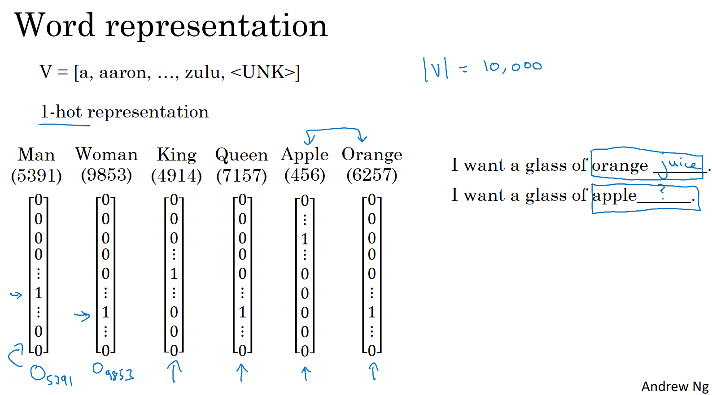

### Featurized representation: word embedding
So, won't it be nice if instead of a one-hot presentation we can instead learn a featurized representation with each of these words, a man, woman, king, queen, apple, orange or really for every word in the dictionary, we could learn a set of features and values for each of them.

For example, each of these words, we want to know what is the gender associated with each of these things.

If gender goes from -1 for male to +1 for female, then the gender associated with man might be -1, for woman might be +1. And then eventually, learning these things maybe for king you get -0.95, for queen 0.97, and for apple and orange sort of genderless.

Another feature might be, well how royal are these things. And so the terms, man and woman are not really royal, so they might have feature values close to zero. Whereas king and queen are highly royal. And apple and orange are not really royal.

How about age? Man and woman doesn't connotes much about age. Maybe men and woman implies that they're adults, but maybe neither necessarily young nor old. So maybe values close to 0. Whereas kings and queens are always almost always adults. And apple and orange might be more neutral with respect to age.

And then, another feature for here, is this is a food? man is not a food, woman is not a food, neither are kings and queens, but apples and oranges are foods.

There can be many other features as well ranging from, what is the size of this? What is the cost? Is this something that is a live? Is this an action, or is this a noun, or is this a verb, or is it something else? And so on.

You can imagine coming up with many features.

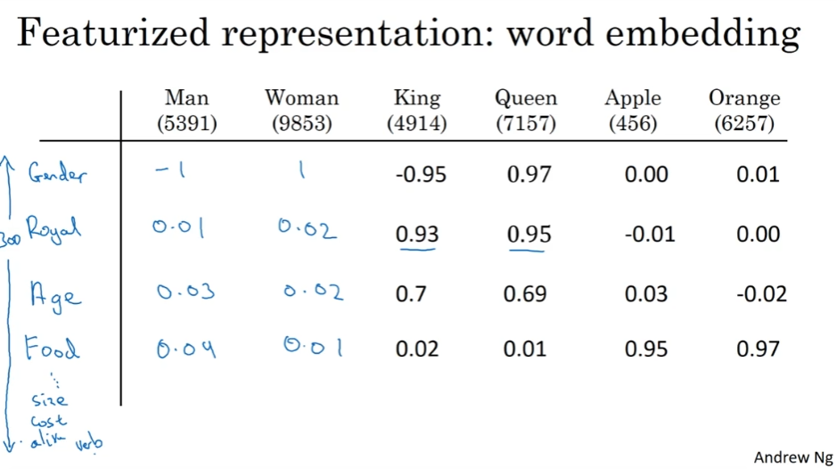

For the sake of the illustration let's say, 300 different features, and what that does is, it allows you to take this list of numbers (list of numbers in column man), but this could be a list of 300 numbers, that then becomes a 300 dimensional vector for representing the word man.

I'm going to use the notation $e_{5391}$ to denote a representation like this.

Similarly, this vector, this 300 dimensional vector or 300 dimensional vector like this, I would denote $e_{9853}$ to denote a 300 dimensional vector we could use to represent the word woman. 

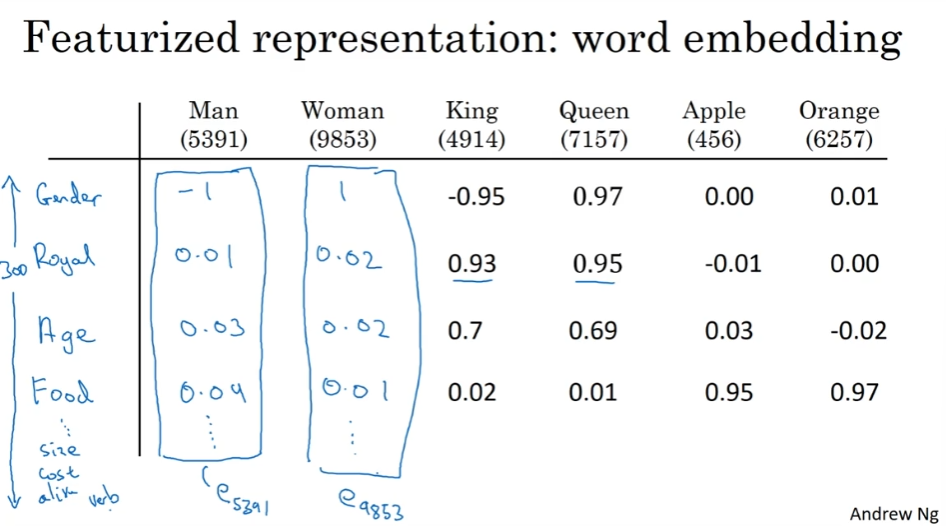

Similarly, for the other examples here.

Now, if you use this representation to represent the words orange and apple, then notice that the representations for orange and apple are now quite similar. Some of the features will differ because of the color of an orange, the color an apple, the taste, or some of the features would differ. But by a large, a lot of the features of apple and orange are actually the same, or take on very similar values. This increases the odds of the learning algorithm that has figured out that orange juice is a thing, to also quickly figure out that apple juice is a thing. So this allows it to generalize better across different words.

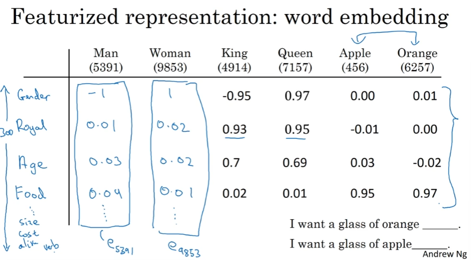

The features we'll end up learning, won't have a easy to interpret interpretation like that component one is gender, component two is royal, component three is age and so on. Exactly what they're representing will be a bit harder to figure out. But nonetheless, the featurized representations we will learn, will allow an algorithm to quickly figure out that apple and orange are more similar than say, king and orange or queen and orange.

### Visualizing word embeddings
If we're able to learn a 300 dimensional feature vector or 300 dimensional embedding for each words, one of the popular things to do is also to take this 300 dimensional data and embed it say, in a 2 dimensional space so that you can visualize them. 

One common algorithm for doing this is the t-SNE algorithm due to Laurens van der Maaten and Geoff Hinton.

If you look at one of these embeddings, one of these representations, you find that words like man and woman tend to get grouped together, king and queen tend to get grouped together, and these are the people which tends to get grouped together. Those are animals who can get grouped together. Fruits will tend to be close to each other. Numbers like one, two, three, four, will be close to each other. And then, maybe the animate objects as whole will also tend to be grouped together.

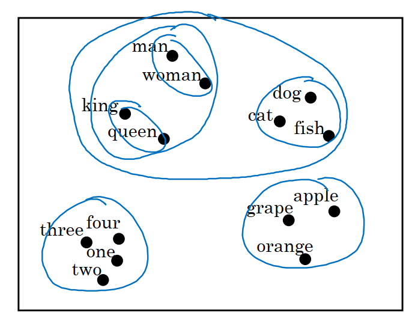

Maybe this gives you a sense that, word embeddings algorithms like this can learn similar features for concepts that feel like they should be more related, as visualized by that concept that seem to you and me like they should be more similar, end up getting mapped to a more similar feature vectors.

These representations we'll use these sort of featurized representations in maybe a 300 dimensional space, these are called embeddings.

The reason we call them embeddings is, you can think of a 300 dimensional space. And again, they can't draw out here in two dimensional space because it's a 3D one. And what you do is you take every words like orange, and have a three dimensional feature vector so that word orange gets embedded to a point in this 300 dimensional space. And the word apple, gets embedded to a different point in this 300 dimensional space.

And of course to visualize it, algorithms like t-SNE, map this to a much lower dimensional space, you can actually plot the 2D data and look at it. But that's what the term embedding comes from.

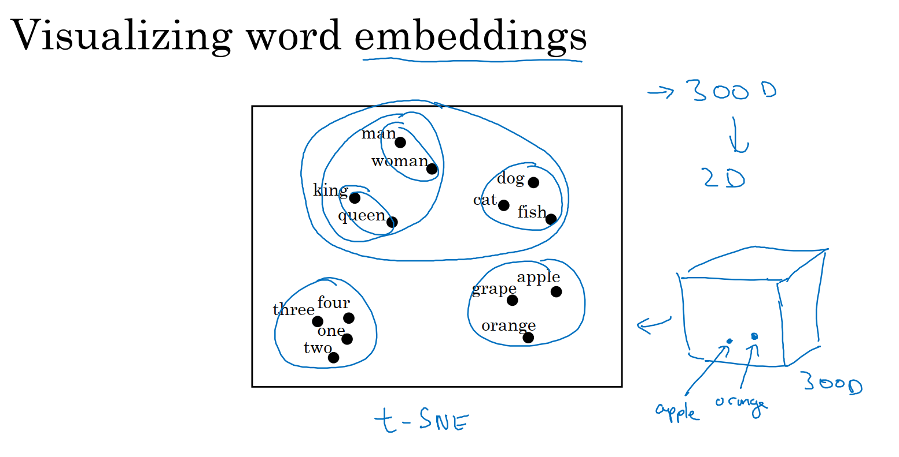

Instead of sparse vectors, we use dense, learned vectors (e.g., 50–300 dimensions).
* Words with similar meanings end up with similar embeddings.
* Example relationships learned automatically:
  * king – man + woman ≈ queen
  * paris – france + italy ≈ rome

Word embeddings capture:
* Gender
* Royalty
* Type of food, places, sports
* Semantic and syntactic relationships

They allow generalization:
* If the model learns that “apple” is similar to “orange,” then:
  * If it understands “apple juice,” it will also understand “orange juice.”

This makes NLP models far more data-efficient and intelligent.
* Embeddings are high-dimensional (50–300 dims).
* Tools like t-SNE allow us to project them to 2D.
* Similar words form clusters, such as:
  * Countries together
  * Food together
  * Verbs together
  * Masculine vs feminine forms

This shows embeddings capture structure found in natural language.

## Using Word Embeddings
### Named entity recognition example

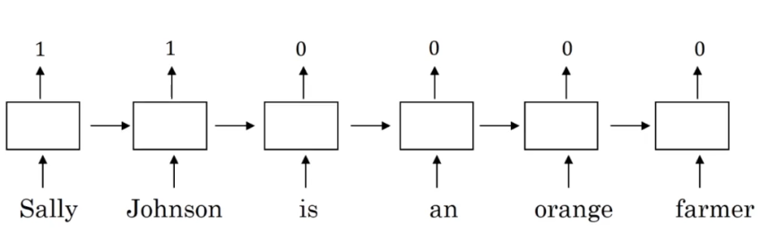

Continuing with the named entity recognition example, if you're trying to detect people's names.

Given a sentence like "Sally Johnson is an orange farmer", hopefully, you'll figure out that Sally Johnson is a person's name, hence, the outputs 1 like that.

And one way to be sure that Sally Johnson has to be a person, rather than say the name of the corporation is that you know orange farmer is a person.

So previously, we had talked about one hot representations to represent these words, $x^{<1>}$, $x^{<2>}$, and so on. 

But if you can now use the featurized representations, the embedding vectors that we talked about in the last video. Then after having trained a model that uses word embeddings as the inputs, if you now see a new input, "Robert Lin is an apple farmer". Knowing that orange and apple are very similar will make it easier for your learning algorithm to generalize to figure out that Robert Lin is also a human, is also a person's name.

One of the most interesting cases will be, what if in your test set you see not "Robert Lin is an apple farmer", but you see much less common words? What if you see "Robert Lin is a durian cultivator"?

A durian is a rare type of fruit, popular in Singapore and a few other countries.

But if you have a small label training set for the named entity recognition task, you might not even have seen the word durian or seen the word cultivator in your training set. But if you have learned a word embedding that tells you that durian is a fruit, so it's like an orange, and a cultivator, someone that cultivates is like a farmer, then you might still be generalize from having seen an orange farmer in your training set to knowing that a durian cultivator is also probably a person.

One of the reasons that word embeddings will be able to do this is the algorithms to learning word embeddings can examine very large text corpuses, maybe found off the Internet. So you can examine very large data sets, maybe a billion words, maybe even up to 100 billion words would be quite reasonable. So very large training sets of just unlabeled text. And by examining tons of unlabeled text, which you can download more or less for free, you can figure out that orange and durian are similar. And farmer and cultivator are similar, and therefore, learn embeddings, that groups them together.

Now having discovered that orange and durian are both fruits by reading massive amounts of Internet text, what you can do is then take this word embedding and apply it to your named entity recognition task, for which you might have a much smaller training set, maybe just 100,000 words in your training set, or even much smaller.

This allows you to carry out transfer learning, where you take information you've learned from huge amounts of unlabeled text that you can suck down essentially for free off the Internet to figure out that orange, apple, and durian are fruits. And then transfer that knowledge to a task, such as named entity recognition, for which you may have a relatively small labeled training set.

For simplicity, l drew this for it only as a unidirectional RNN. If you actually want to carry out the named entity recognition task, you should, of course, use a bidirectional RNN rather than a simpler one I've drawn here.

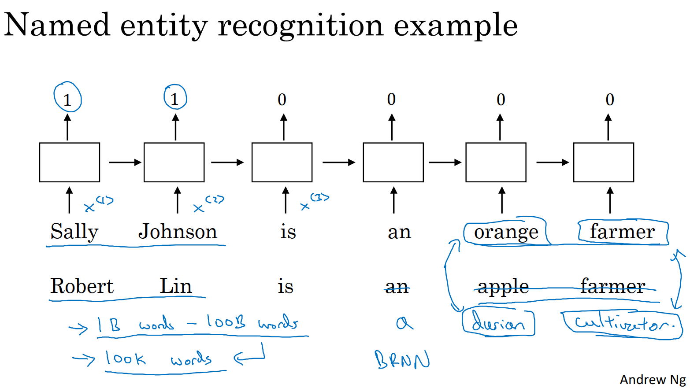

### Transfer learning and word embeddings
To summarize, this is how you can carry out transfer learning using word embeddings.

1. Step 1 is to learn word embeddings from a large text corpus, a very large text corpus ((1-100B words)) or you can also download pre-trained word embeddings online.
2. Transfer embedding to new task with smaller training set.
(say, 100k words). One nice thing also about this is you can now use relatively lower dimensional feature vectors. So rather than using a 10,000 dimensional one-hot vector, you can now instead use maybe a 300 dimensional dense vector. Although the one-hot vector is fast and the 300 dimensional vector that you might learn for your embedding will be a dense vector.
3. Finally, as you train your model on your new task, on your named entity recognition task with a smaller label data set, one thing you can optionally do is to continue to fine tune, continue to adjust the word embeddings with the new data. In practice, you would do this only if this task 2 has a pretty big data set. If your label data set for step 2 is quite small, then usually, I would not bother to continue to fine tune the word embeddings.

So word embeddings tend to make the biggest difference when the task you're trying to carry out has a relatively smaller training set. So it has been useful for many NLP tasks.

It has been useful for named entity recognition, for text summarization, for co-reference resolution, for parsing. These are all maybe pretty standard NLP tasks.

It has been less useful for language modeling, machine translation, especially if you're accessing a language modeling or machine translation task for which you have a lot of data just dedicated to that task.

So as seen in other transfer learning settings, if you're trying to transfer from some task A to some task B, the process of transfer learning is just most useful when you happen to have a ton of data for A and a relatively smaller data set for B.

And so that's true for a lot of NLP tasks, and just less true for some language modeling and machine translation settings.

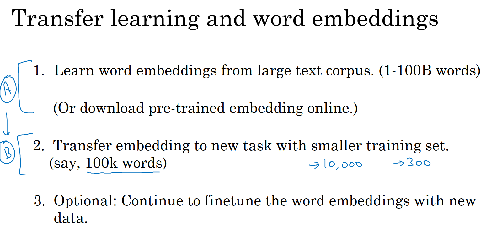

### Relation to face encoding
Finally, word embeddings has a interesting relationship to the face encoding ideas that you learned about in the previous course, if you took the convolutional neural networks course.

So you will remember that for face recognition, we train this Siamese network architecture that would learn, say, a 128 dimensional representation for different faces. And then you can compare these encodings in order to figure out if these two pictures are of the same face. 

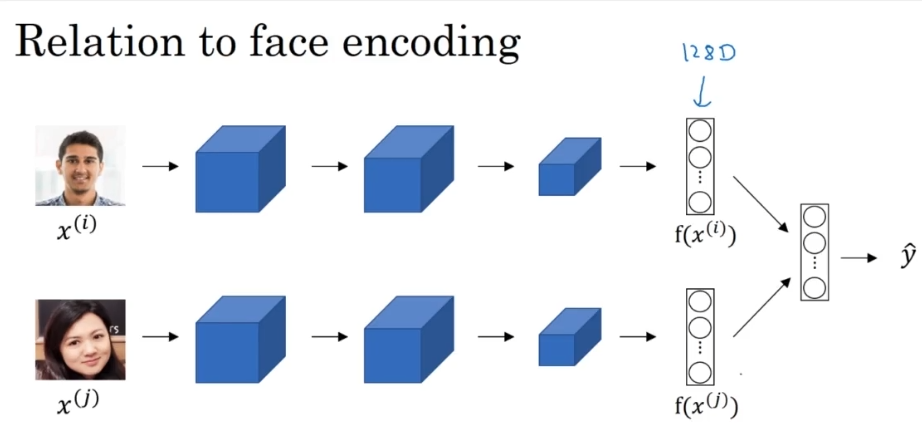

The words encoding and embedding mean fairly similar things.

So in the face recognition literature, people also use the term encoding to refer to these vectors, $f(x^{(i)})$ and $f(x^{(j)})$. 

One difference between the face recognition literature and what we do in word embeddings is that, for face recognition, you wanted to train a neural network that can take as input any face picture, even a picture you've never seen before, and have a neural network compute an encoding for that new picture

Whereas what we'll do for learning word embeddings is that we'll have a fixed vocabulary of, say, 10,000 words. And we'll learn a vector $e_1$ through, say, $e_{10,000}$ that just learns a fixed encoding or learns a fixed embedding for each of the words in our vocabulary.

So that's one difference between the set of ideas you saw for face recognition versus what the algorithms we'll discuss in the next few videos.

But the terms encoding and embedding are used somewhat interchangeably.

So the difference I just described is not represented by the difference in terminologies. It's just a difference in how we need to use these algorithms in face recognition, where there's unlimited sea of pictures you could see in the future. Versus natural language processing, where there might be just a fixed vocabulary, and everything else like that we'll just declare as an unknown word.

So in this video, you saw how using word embeddings allows you to implement this type of transfer learning. And how, by replacing the one-hot vectors we're using previously with the embedding vectors, you can allow your algorithms to generalize much better, or you can learn from much less label data.

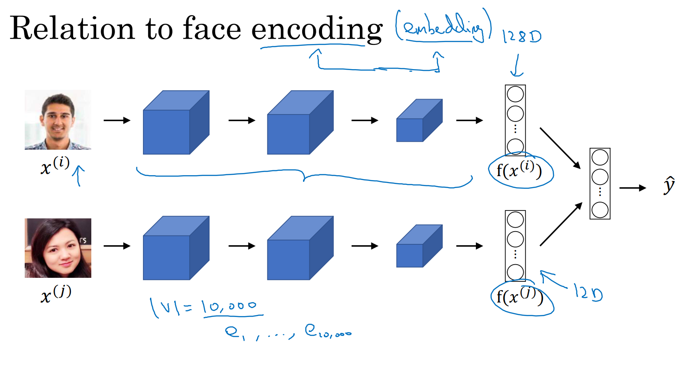

Word embeddings are a way to represent words as dense vectors (lists of numbers) so that similar words have similar vectors.

Instead of:
* “apple” → [0, 0, 0, 1, 0, 0 …] (one-hot)
* “orange” → [0, 1, 0, 0, 0, …]

Word embeddings represent words more meaningfully:
* “apple” → [0.82, 0.13, 0.55, …]
* “orange” → [0.80, 0.11, 0.52, …]

The numbers capture meaning, not just identity.

If the model learns that “orange” is a fruit, then the embedding places “durian” near it, allowing the model to generalize even if it has never seen “durian” during training.

Word embeddings let models generalize better.

Example: Named Entity Recognition (NER)

NER = Identify names of people, locations, companies in text.

Without embeddings:

If you never saw the word “Durian Corp” during training, the model has no clue it’s likely a company.

With embeddings:
* If “Durian” is close to “Orange” and “Apple” in vector space,
* and “Orange Corp” or “Apple Inc.” are often companies,
* the model can infer that “Durian Corp” might also be a company.

Embeddings bring semantic knowledge into the task, even if the training dataset for that task is very small.

Using knowledge learned from a large dataset to help with a smaller, labeled dataset.

In NLP:
* Train word embeddings on billions of unlabeled sentences (cheap to collect).
* Use these pre-trained embeddings for your specific task (with small labeled data).

Most NLP tasks don't have tons of labeled data, so transfer learning makes them possible.

Imagine building an NER system:
* You only have 10,000 labeled sentences → not much!
* But you load embeddings (Word2Vec, GloVe) trained on 1 billion sentences → you gain a huge amount of word knowledge instantly.

Imagine you're training a model to detect names of fruits in sentences, but your labeled dataset does not include “durian.”

Because embeddings learned from billions of sentences place:
* “durian” near “orange”
* and “orange” near “apple”
* and the model knows “apple” is a fruit from training

The model can guess:

-> “durian” is probably also a fruit.

This is the power of word embeddings + transfer learning.

Very Helpful For:
* Tasks where labeled data is limited:
* Named Entity Recognition (NER)
* Document classification
* Sentiment analysis
* Text summarization
* Co-reference resolution (e.g., knowing “John” = “he”)

Why?
-> They transfer knowledge from massive text corpora into your smaller task.

Less Helpful For:

Tasks where you can train a giant model on giant datasets:
* Machine translation (e.g., Google Translate)
* Language modeling (predict next word)

Why?
-> These tasks already train on enormous data, so pre-trained embeddings add little benefit.

In face recognition (from earlier in the specialization), the model also turns faces into vectors:
* Your face → [0.41, 0.12, 0.95, …]
* My face → [0.39, 0.11, 0.97, …]

These vectors encode the identity of the person, based on features like:
* Shape of eyes
* Nose
* Jawline
* Skin tone
* Etc.

Then:
* If two vectors are close → same person
* If they are far apart → different people

Just like similar words → embedding vectors close

similar faces → face encoding vectors close

The big idea:

Embeddings = a general technique in deep learning

You can represent anything with a learned vector:
* A word
* A face
* A product in a store
* A user in a recommendation system
* An image
* A sound clip

Once a neural network learns these embeddings, simple math (distances, comparisons) becomes possible.

Learn similarities
* Word: “apple” is like “orange”
* Face: My face is similar to yesterday’s picture of me

Learn differences
* Word: “apple” ≠ “bank”
* Face: My face ≠ your face

Work well with small amounts of data
* Word embeddings transfer knowledge from billions of text sentences
* Face encodings transfer knowledge from tons of face images

Deep learning often works by learning to represent things as vectors first.
Then those learned vectors make the downstream task easier.

## Properties of Word Embeddings
One of the most fascinating properties of word embeddings is that they can also help with analogy reasoning. And while reasonable analogies may not be by itself the most important NLP application, they might also help convey a sense of what these word embeddings are doing, what these word embeddings can do.

### Analogies
Here are the featurized representations of a set of words that you might hope a word embedding could capture. 

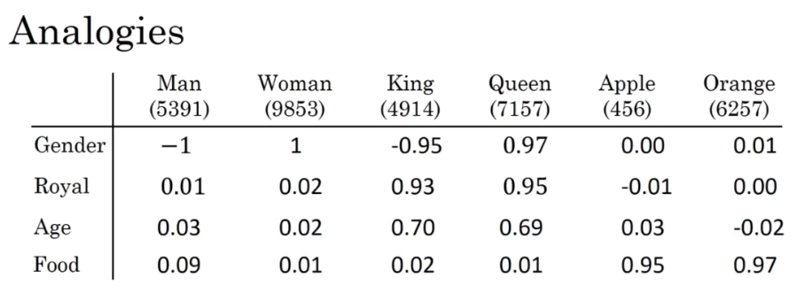

Let's say I pose a question, man is to woman as king is to what? 

Many of you will say, man is to woman as king is to queen. But is it possible to have an algorithm figure this out automatically? 

Let's say that you're using this four dimensional vector to represent man. So this will be your $e_{5391}$, although just for this video, let me call this $e_{man}$.

And let's say that's the embedding vector for woman, so I'm going to call that $e_{woman}$, and similarly for king and queen.

And for this example, I'm just going to assume you're using 4 dimensional embeddings, rather than anywhere from 50 to 1,000 dimensional, which would be more difficult.

One interesting property of these vectors is that if you take the vector, $e_{man}$, and subtract the vector $e_{woman}$, then, you end up with roughly [-2 0 0 0].

And similarly if you take e king minus e queen, then that's approximately the same thing. That's about [-2 0 0 0].

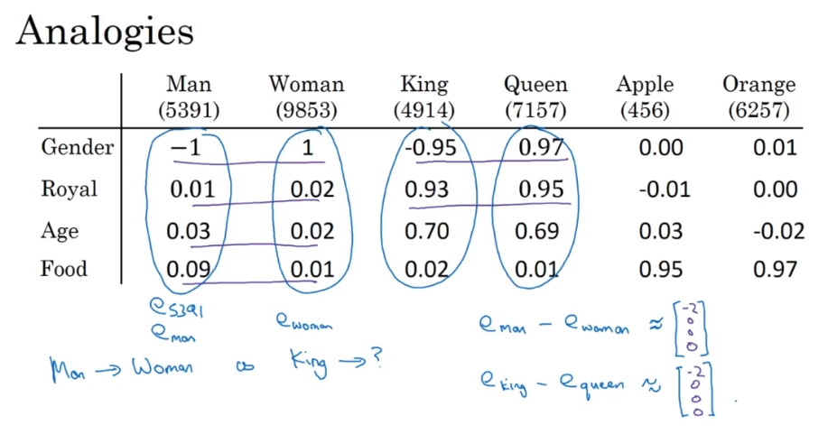

What this is capturing is that the main difference between man and woman is the gender.

And the main difference between king and queen, as represented by these vectors, is also the gender.

Which is why the difference $e_{man}$ - $e_{woman}$, and the difference $e_{king}$ - $e_{queen}$, are about the same.

One way to carry out this analogy reasoning is, if the algorithm is asked, man is to woman as king is to what?

What it can do is compute $e_{man}$ - $e_{woman}$, and try to find a vector, try to find a word so that $e_{man}$ - $e_{woman}$ is close to $e_{lomg}$ - e of that new word. It turns out that when queen is the word plugged in here, then the left hand side is close to the the right hand side.

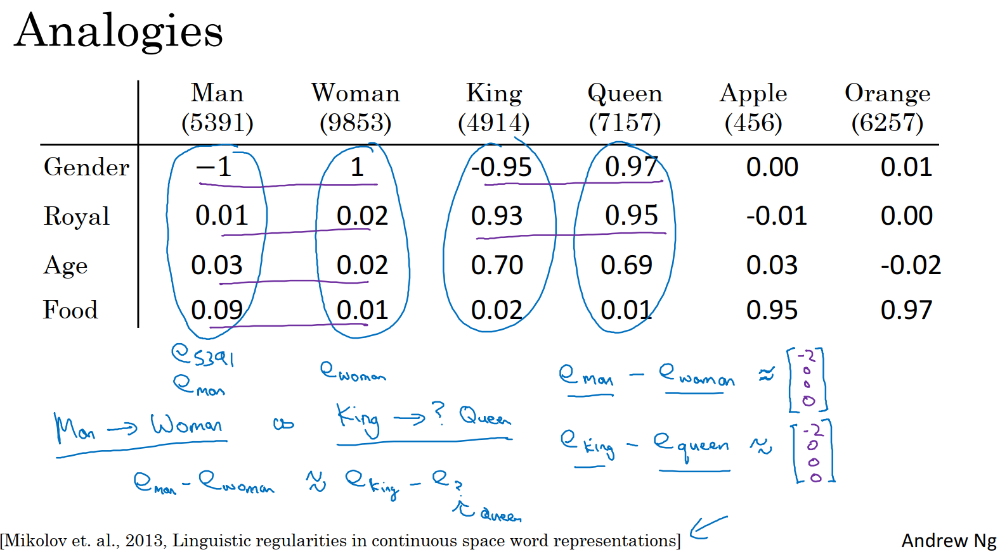

These ideas were first pointed out by Tomas Mikolov, Wen-tau Yih, and Geoffrey Zweig. And it's been one of the most remarkable and surprisingly influential results about word embeddings. And I think has helped the whole community get better intuitions about what word embeddings are doing.

### Analogies using word vectors
Let's formalize how you can turn this into an algorithm.

In pictures, the word embeddings live in maybe a 300 dimensional space. And so the word "man" is represented as a point in the space, and the word "woman" is represented as a point in the space. Same for "king" and "queen".

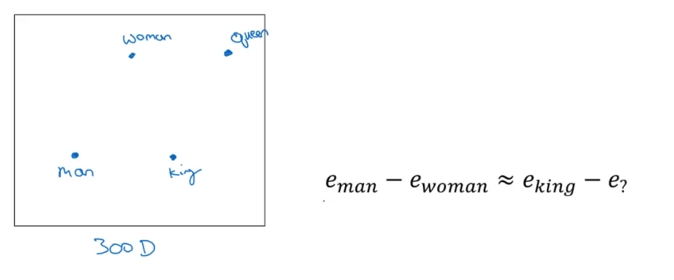

What we pointed out really on the last slide is that the vector difference between man and woman is very similar to the vector difference between king and queen.

This arrow I just drew is really the vector that represents a difference in gender.

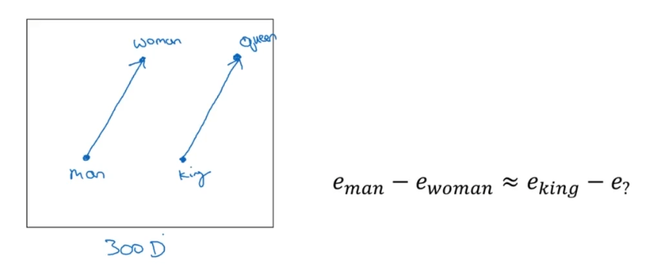

Remember, these are points we're plotting in a 300 dimensional space.

In order to carry out this kind of analogical reasoning to figure out, man is to woman is king is to what, what you can do is try to find the word "w", so that, this equation holds true

$e_{man} - e_{woman} \approx e_{king} - e_?$

So you want to find the word "w" then finding the word that maximizes the similarity between $e_w$ compared to $e_{king} - e_{man} + e_{woman}$.

Find word w: ${argmax}_w$ sim($e_w$, $e_{king} - e_{man} + e_{woman}$)

What I did is, I took this $e_?$, and replaced that with $e_w$, and then brought $e_w$ to just one side of the equation. And then the other three terms to the right hand side of this equation.

We have some appropriate similarity function for measuring how similar is the embedding of some word "w" to this quantity of the right. Then finding the word that maximizes the similarity should hopefully let you pick out the word "queen".

The remarkable thing is, this actually works.

If you learn a set of word embeddings and find a word w that maximizes this type of similarity, you can actually get the exact right answer. Depending on the details of the task, but if you look at research papers, it's not uncommon for research papers to report anywhere from, say, 30% to 75% accuracy on analogy using tasks like these. Where you count an anology attempt as correct only if it guesses the exact word right. So only if, in this case, it picks out the word queen.

Previously, we talked about using algorithms like t-SAE to visualize words.

What t-SAE does is, it takes 300-D data, and it maps it in a very non-linear way to a 2D space. The mapping that t-SAE learns, this is a very complicated and very non-linear mapping. After the t-SAE mapping, you should not expect these types of parallelogram relationships, like the one we saw on the left, to hold true. And it's really in this original 300 dimensional space that you can more reliably count on these types of parallelogram relationships in analogy pairs to hold true. And it may hold true after a mapping through t-SAE, but in most cases, because of t-SAE's non-linear mapping, you should not count on that. And many of the parallelogram analogy relationships will be broken by t-SAE. 

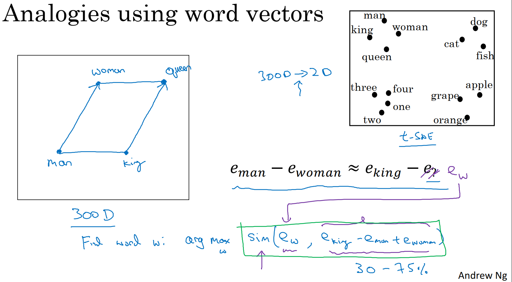

### Cosine similarity
sim($e_w$, $e_{king} - e_{man} + e_{woman}$)

In cosine similarity, you define the similarity between two vectors u and v as u transpose v divided by the lengths by the Euclidean lengths.

$sim(u,v) = {{u^Tv} \over {||u||_2 ||v||_2}}$

Ignoring the denominator for now, this is basically the inner product between u and v.

If u and v are very similar, their inner product will tend to be large.

This is called cosine similarity because this is actually the cosine of the angle between the two vectors, u and v. That's the angle phi, so this formula is actually the cosine of the angle between them.

You remember from calculus that if this phi, then the cosine of phi looks like this.

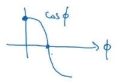

If the angle between them is 0, then the cosine similarity is equal to 1. And if their angle is 90 degrees, the cosine similarity is 0. And then if they're 180 degrees, or pointing in completely opposite directions, it ends up being -1.

That's where the term cosine similarity comes from, and it works quite well for these analogy reasoning tasks.

If you want, you can also use square distance or Euclidian distance, $||u-v||^2$. Technically, this would be a measure of dissimilarity rather than a measure of similarity. So we need to take the negative of this, and this will work okay as well. Although I see cosine similarity being used a bit more often.

The main difference between these is how it normalizes the lengths of the vectors u and v.

One of the remarkable results about word embeddings is the generality of analogy relationships they can learn.

For example, it can learn that man is to woman as boy is to girl, because the vector difference between man and woman, similar to king and queen and boy and girl, is primarily just the gender. It can learn that Ottawa, which is the capital of Canada, that Ottawa is to Canada as Nairobi is to Kenya. So that's the city capital is to the name of the country. It can learn that big is to bigger as tall is to taller, and it can learn things like that. Yen is to Japan, since yen is the currency of Japan, as ruble is to Russia. 

All of these things can be learned just by running a word embedding learning algorithm on the large text corpus, it can spot all of these patterns by itself.

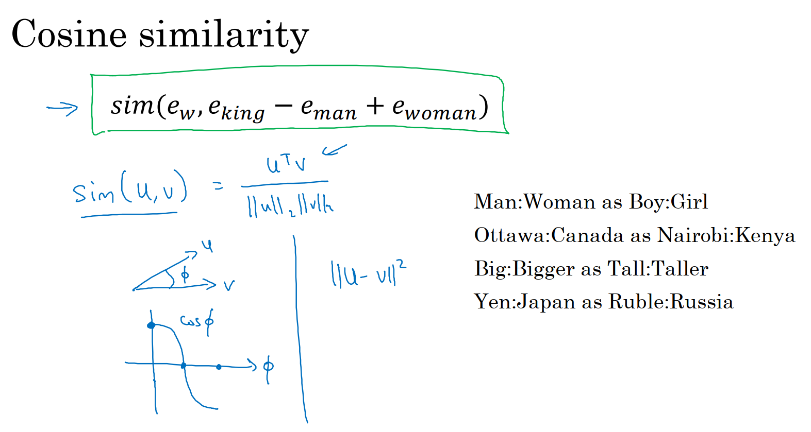

So in this video, you saw how word embeddings can be used for analogy reasoning. And while you might not be trying to build an analogy reasoning system yourself as an application, this I hope conveys some intuition about the types of feature-like representations that these representations can learn.

You also saw how cosine similarity can be a way to measure the similarity between two different word embeddings.

### Summary
#### Property #1 — Word Embeddings Capture Meaningful Similarity

In embeddings:
* Words with similar meaning → have similar vectors
* Words with different meaning → have very different vectors

Example

“apple” and “orange” both appear near each other because:
* Both are fruits
* Both appear in similar sentences (buy apple / buy orange)

Meanwhile:
* “apple” and “car” are far apart because they appear in different contexts.

Your model can generalize better.

If your training data includes:
* “apple is a fruit”
* “orange is a fruit”

Then embeddings help the model guess:

“pear” is also likely a fruit even if it never saw the exact sentence during training.

#### Property #2 — Word Embeddings Capture Analogies
Embeddings don’t just understand similarity—they also understand relationships.

Famous examples
```
vector("king") - vector("man") + vector("woman") ≈ vector("queen")
```

It means embeddings understand:
* Gender relationships
* Plural relationships
* Verb tense relationships
* Country–capital relationships

Examples:
```
Italy – Rome ≈ France – Paris  
Run – Running ≈ Swim – Swimming  
```

What does this mean in simple words?

Word embeddings organize words in such a way that the same type of relationship always points in the same direction in vector space.

For example:
* Adding the “plural direction” to “car” gets “cars”
* Adding the “past-tense direction” to “swim” gets “swam”

This shows that embeddings learn patterns of language, not memorization.

They let algorithms handle words they’ve never seen before: If embeddings place “durian” near “orange,” your classifier can guess that “durian” is also likely a fruit even without labeled training examples.

They reduce data needed for NLP tasks: Because embeddings bring “world knowledge” from big text corpora.

They make downstream tasks easier" Sentiment analysis, named entity recognition, text classification all benefit.

They let you use simple math to reason about words" Instead of thinking hard about language rules, the model just compares vectors.

Andrew shows plots like this (but in higher dimensions):
* Gender direction
* Country–capital direction
* Verb tense direction

Think of embeddings as forming geometric patterns:

```
king    → queen  
man     → woman  
Rome    → Italy  
Paris   → France  
walking → walked  
swimming → swam
```

All these relationships become parallel vector shifts, which is why vector math works.

## Embedding Matrix
When you implement an algorithm to learn a word embedding, what you end up learning is an embedding matrix.

Let's say, as usual we're using our 10,000-word vocabulary. So, the vocabulary has A, Aaron, Orange, Zulu, maybe also unknown word as a token.

What we're going to do is learn embedding matrix E, which is going to be a 300 dimensional by 10,000 dimensional matrix, if you have 10,000 words vocabulary or maybe 10,001 is unknown word token,there's one extra token.

The columns of this matrix would be the different embeddings for the 10,000 different words you have in your vocabulary.

Orange was word number 6257 in our vocabulary of 10,000 words.

One piece of notation we'll use is that $O_{6257}$ was the one-hot vector with 0's everywhere and a 1 in position 6257.

This will be a 10,000-dimensional vector with a 1 in just one position.

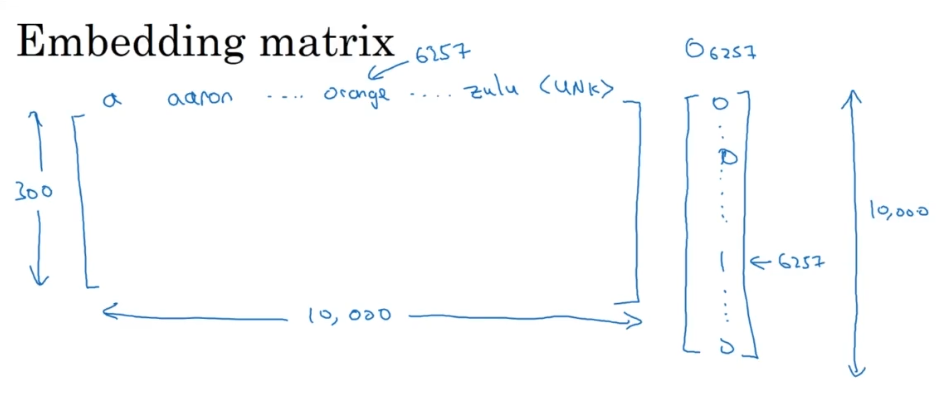

This isn't quite a drawn scale. This should be as tall as the embedding matrix on the left is wide.

If the embedding matrix is called capital E then notice that if you take E and multiply it by this one-hot vector by $O_{6257}$, then this will be a 300-dimensional vector. So, E is 300 by 10,000 and O is 10,000 by 1.

The product will be 300 by 1, so with 300-dimensional vector.

Notice that to compute the first element of this vector, of this 300-dimensional vector, what you do is you will multiply the first row of the matrix E with $O_{6257}$. But all of these elements are zero except for element 6257 and so you end up with the first element as whatever is that elements up there, under the Orange column.

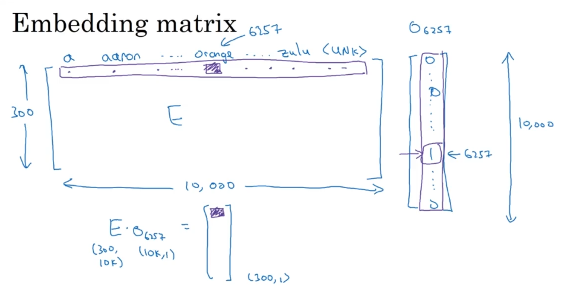

Then, for the second element of this 300-dimensional vector we're computing, you would take the vector $O_{6257}$ and multiply it by the second row with the matrix E.

Again, you end up with this and so on as you go down the rest of this column.

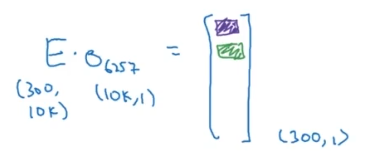

That's why the embedding matrix E times this one-hot vector winds up selecting out this 300-dimensional column corresponding to the word Orange.

This is going to be equal to $E_{6257}$ which is the notation we're going to use to represent the embedding vector that 300 by 1 dimensional vector for the word Orange. 

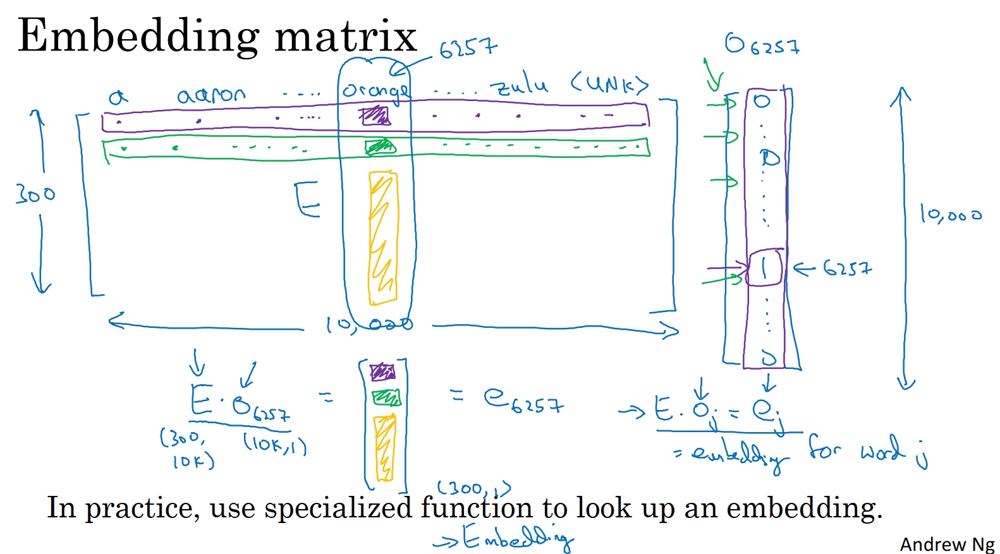

## Learning Word Embeddings
### Neural language model
Let's say you're building a language model and you do it with a neural network.

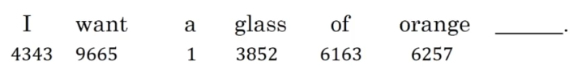

Input : "I want a glass of orange ... "

Output : Predict the next word in the sequence.

Words are written down in index for each vocabulary.

It turns out that building a neural language model is a resonable way to learn a set of embeddings.

The ideas I present on this slide were due to Yoshua Bengio, Rejean Ducharme, Pascals Vincent, and Christian Jauvin.

Let me take the list of words, "I" "want" "a" "glass" "of" "orange", and let's start with the first word "I".

I'm going to construct one add vector corresponding to the word I. The one hot vector with a 1 in position 4343 ($o_{4343}$).

-> 10 000 dimensional vector.

Then have a matrix of parameters E, and take E times O to get an embedding vector $e_{4343}$.

This step means that $e_{4343}$ is obtained by the matrix E times the one-hot vector $o_{4343}$.

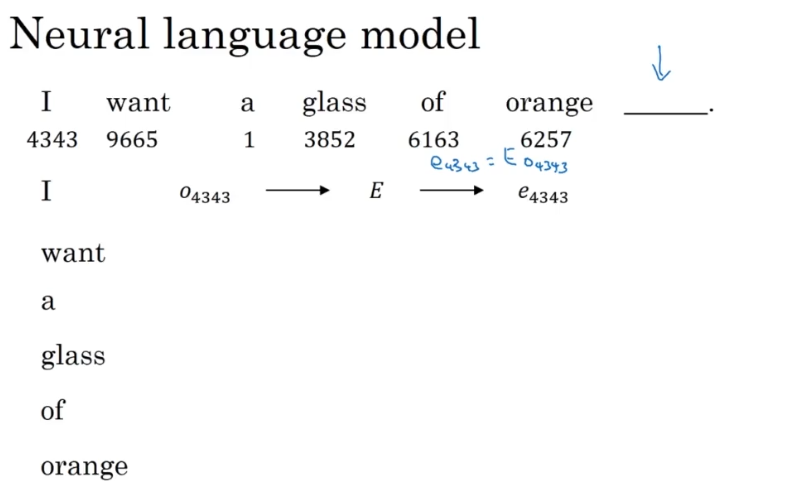

Then we'll do the same for all of the other words.

The word "want", is where 9665 one-hot vector, multiply by E to get the embedding vector. Similarly, for all the other words. "A", is a first word in dictionary, alphabetic comes first, so there is $o_{1}$, gets this $e_{1}$. 

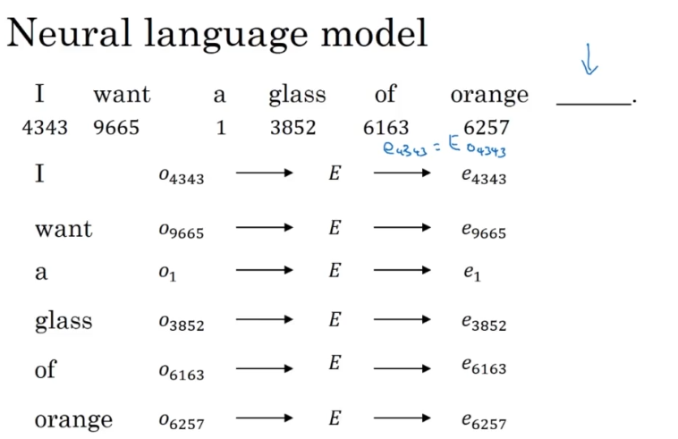

Now you have a bunch of 3 dimensional embedding, so each of this is a 300 dimensional embedding vector.

What we can do, is feed all of them into a neural network.

Then this neural network feeds to a softmax, which has it's own parameters as well.

Softmax classifies among the 10,000 possible outputs in the vocab for those final word we're trying to predict. And so, if in the training slide we saw the word "juice" then, the target for the softmax in training repeat that it should predict the other word "juice" was what came after this. 

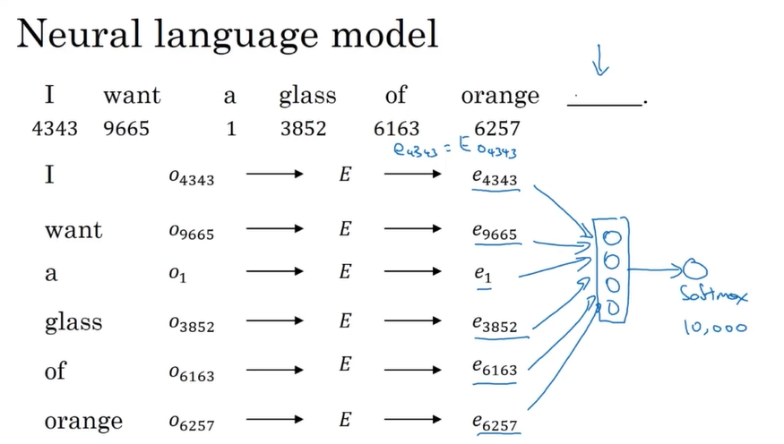

This hidden layer here will have his own parameters. So have some, I'm going to call this $W^{[1]}$ and there's also $b^{[1]}$.

The softmax there was this own parameters $W^{[2]}$, $b^{[2]}$.

They're using 300 dimensional word embeddings, then here we have 6 words. So, this would be 6 times 300. So this layer or this input will be a 1,800 dimensional vector obtained by taking your 6 embedding vectors and stacking them together.

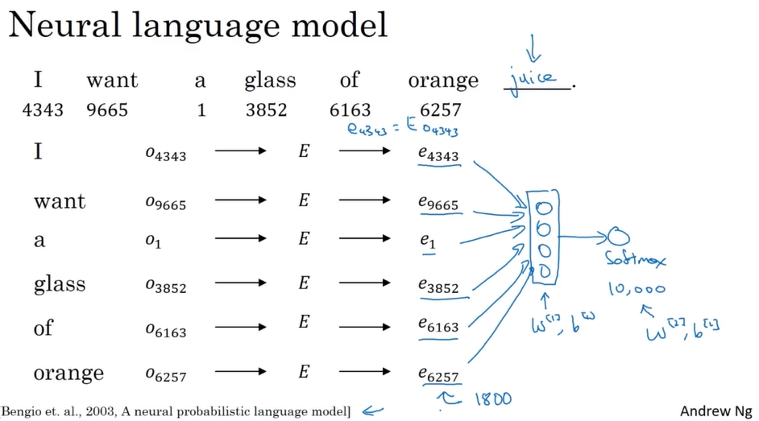

What's actually more commonly done is to have a fixed historical window.

For example, you might decide that you always want to predict the next word given say the previous 4 words, where 4 here is a hyperparameter of the algorithm. So this is how you adjust to either very long or very short sentences or you decide to always just look at the previous 4 words. Let's just get rid of these. And so, if you're always using a 4 word history, this means that your neural network will input a 1,200 dimensional feature vector, go into this layer, then have a softmax and try to predict the output.

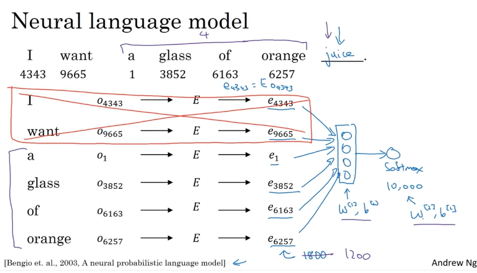

Variety of choices and using a fixed history, just means that you can deal with even arbitrarily long sentences because the input sizes are always fixed.

The parameters of this model will be this matrix E, and use the same matrix E for all the words. So you don't have different matrices for different positions in the proceedings 4 words, it's the same matrix E.

These weights are also parameters of the algorithm and you can use backprop to perform gradient descent to maximize the likelihood of your training set to just repeatedly predict given 4 words in a sequence, what is the next word in your text corpus?

It turns out that this algorithm will learn pretty decent word embeddings. And the reason is, if you remember our orange juice, apple juice example, is in the algorithm's incentive to learn pretty similar word embeddings for orange and apple because doing so allows it to fit the training set better because it's going to see orange juice sometimes, or see apple juice sometimes, and so, if you have only a 300 dimensional feature vector to represent all of these words, the algorithm will find that it fits the training set best. If apples, oranges, and grapes, and pears, and so on and maybe also durians which is a very rare fruit and that with similar feature vectors.

This is one of the earlier and pretty successful algorithms for learning word embeddings, for learning this matrix E.

### Other context/target pairs
Let's generalize this algorithm and see how we can derive even simpler algorithms. I want to illustrate the other algorithms using a more complex sentence as our example.

Let's say that in your training set, you have this longer sentence, "I want a glass of orange juice to go along with my cereal."

What we saw on the last slide was that the job of the algorithm was to predict some word "juice", which we are going to call the target words, and it was given some context which was the last 4 words.

Researchers have experimented with many different types of context. If your goal to build a language model then it's natural for the context to be a few words right before the target word. But if your goal isn't to learn the language model per se, then you can choose other contexts.

For example, you can pose a learning problem where the context is the 4 words on the left and right. So, you can take the 4 words on the left and right as the context, and what that means is that we're posing a learning problem where the algorithm is given 4 words on the left. So, "a glass of orange", and four words on the right, "to go along with", and this has to predict the word in the middle.

Posing a learning problem like this where you have the embeddings of the left four words and the right four words feed into a neural network, similar to what you saw in the previous slide, to try to predict the word in the middle, try to put it target word in the middle, this can also be used to learn word embeddings.

Or if you want to use a simpler context, maybe you'll just use the last 1 word. So given just the word "orange", what comes after "orange"? So this will be different learning problem where you tell it one word, "orange", and will say well, what do you think is the next word. And you can construct a neural network that just fits in the word, the one previous word or the embedding of the one previous word to a neural network as you try to predict the next word.

Or, one thing that works surprisingly well is to take a nearby one word. Some might tell you that, well, take the word "glass", is somewhere close by. Some might say, I saw the word "glass" and then there's another words somewhere close to "glass", what do you think that word is? So, that'll be using nearby one word as the context.

We'll formalize this in the next video but this is the idea of a Skip-Gram model, and just an example of a simpler algorithm where the context is now much simpler, is just 1 word rather than 4 words, but this works remarkably well.

What researchers found was that if you really want to build a language model, it's natural to use the last few words as a context.

But if your main goal is really to learn a word embedding, then you can use all of these other contexts and they will result in very meaningful word embeddings as well. I will formalize the details of this in the next video where we talk about the Walter VEC model.

To summarize, in this video you saw how the language modeling problem which causes the pose of machines learning problem where you input the context like the last 4 words and predicts some target words, how posing that problem allows you to learn input word embedding. 

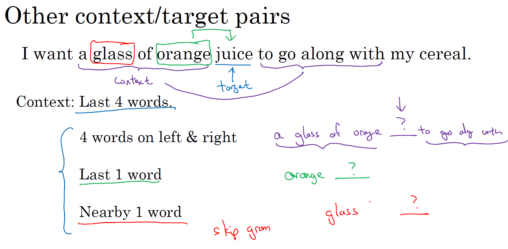

A language model (LM) is a model that predicts words.

Examples of what an LM does:

Predict the next word
“I want to eat ___”

Predict a missing word
“I _____ to school”

Score how likely a sentence is
* “The dog bites the man” → high
* “The apple drives a car” → low

Key point

A language model produces probabilities over words.

So an LM does prediction.

A word embedding is just a vector (a list of numbers) that represents a word’s meaning.

Example:
* “cat” → [0.21, 0.89, 0.12, …]
* “king” → [0.72, 0.14, 0.93, …]

Embeddings do not predict anything by themselves.
They are just learned parameters, like a table or lookup.

Key point

An embedding is just data that another model USES.
(Just like a dictionary or reference table.)

* A language model uses embeddings (because inputs must be numeric)
* Training a language model updates embeddings (as part of gradient descent)
* But the embedding itself is NOT a language model (it doesn’t predict anything)

## Word2Vec
### Skip-grams
Let's say you're given this sentence in your training set.
```
I want a glass of orange juice to go along with my cereal.
```

In the skip-grams model, what we're going to do is come up with a few context to target pairs to create our supervised learning problem.

Rather than having the context be always the last 4 words or the last end words immediately before the target word, what I'm going to do is, say, randomly pick a word to be the context word. Let's say we chose the word "orange".

What we're going to do is randomly pick another word within some window. Say plus minus five words or plus minus ten words of the context word and we choose that to be target word.

Maybe just by chance you might pick "juice" to be a target word, that's just one word later. Or you might choose 2 words before. So you have another pair where the target could be "glass" or, Maybe just by chance you choose the word "my" as the target.

We'll set up a supervised learning problem where given the context word, you're asked to predict what is a randomly chosen word within say, a plus minus ten word window, or plus minus five or ten word window of that input context word. 

And obviously, this is not a very easy learning problem, because within plus minus 10 words of the word "orange", it could be a lot of different words. But a goal that's setting up this supervised learning problem, isn't to do well on the supervised learning problem per se, it is that we want to use this learning problem to learn good word embeddings.

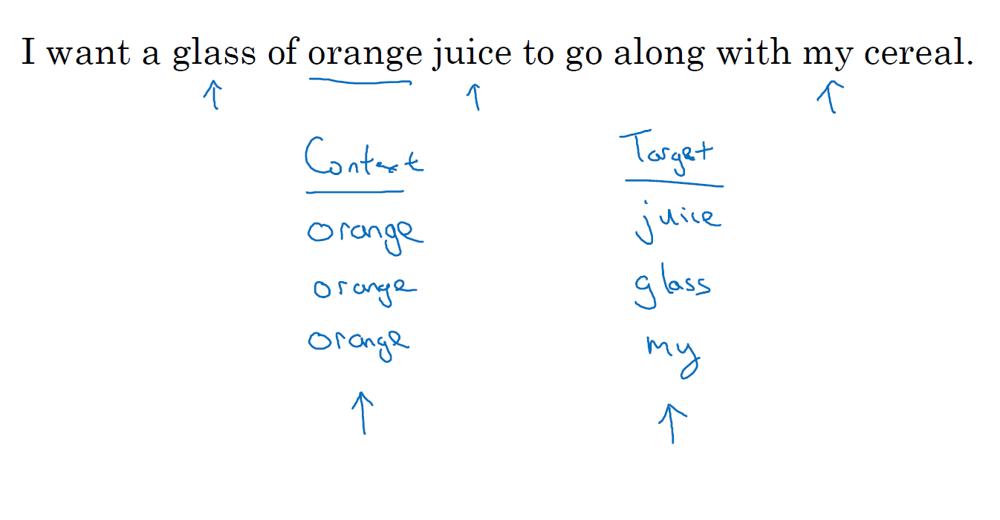

### Model
Here are the details of the model. Let's say that we'll continue to our vocab of 10,000 words. And some have been on vocab sizes that exceeds a million words.

The basic supervised learning problem we're going to solve is that we want to learn the mapping from some Context c, such as the word "orange" to some target, which we will call t, which might be the word "juice" or the word "glass" or the word "my", if we use the example from the previous slide.

In our vocabulary, "orange" is word 6257, and the word "juice" is the word 4834 in our vocab of 10,000 words.

So that's the input x that you want to learn to map to that open y.

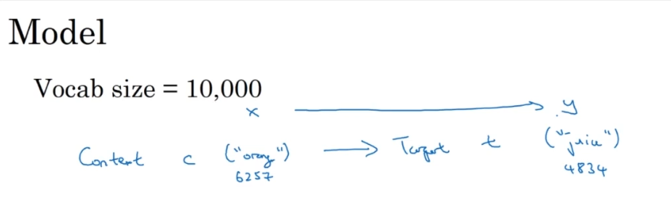

To represent the input such as the word "orange", you can start out with some one hot vector which is going to be write as $O_c$, so there's a one hot vector for the context words.

Then similar to what you saw on the last video you can take the embedding matrix E, multiply E by the vector $O_c$, and this gives you your embedding vector for the input context word, so here $e_c$ is equal to capital E times that one hot vector.

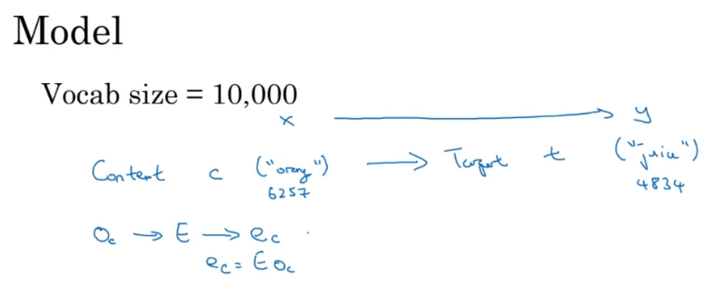

Then in this new network that we formed we're going to take this vector $e_c$ and feed it to a softmax unit. So I've been drawing softmax unit as a node in a neural network. That's not an o, that's a softmax unit. And then there's a drop in the softmax unit to output y hat.

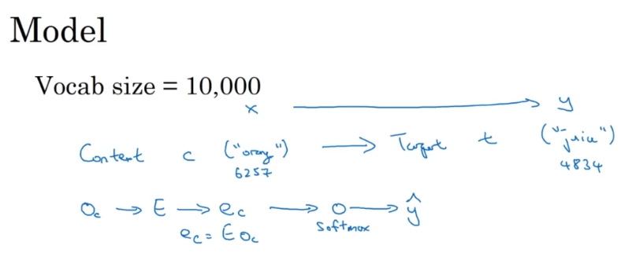

So to write out this model in detail. This is the model, the softmax model, probability of different tanka words given the input context word as e to the e, $\theta_t$ transpose, ec divided by some over all words, so we're going to say, sum from J equals one to all 10,000 words of e to the theta j transposed ec.
* $\theta_t$ is the parameter associated with, I'll put t, but really there's a chance of a particular word, t, being the label.

So I've left off the biased term to solve mass but we could include that too if we wish. 

Softmax: $p(t|c) = {{e^{\theta_t^Te_c}} \over {\Sigma_{j=1}^{10000}e^{\theta_j^Te_c}}}$

Finally the loss function for softmax will be the usual. So we use y to represent the target word. And we use a one-hot representation for y hat and y here.

$\ell(\hat{y},y) = -\Sigma_{i=1}^{10000}y_ilog\hat{y}_i$

We're representing the target y as a one hot vector. So this would be a one hot vector with just one 1 and the rest zeros. And if the target word is juice, then it'd be element 4834 from up here. That is equal to 1 and the rest will be equal to 0.

And similarly Y hat will be a 10,000 dimensional vector output by the softmax unit with probabilities for all 10,000 possible targets words.

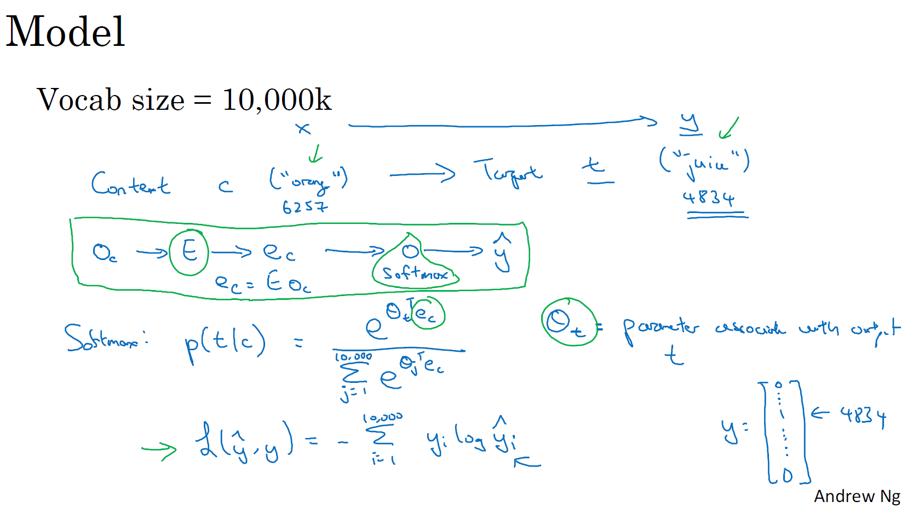

The matrix E will have a lot of parameters, so the matrix E has parameters corresponding to all of these embedding vectors, $e_c$. 

Then the softmax unit also has parameters that gives the $\theta_t$ parameters but if you optimize this loss function with respect to the all of these parameters, you actually get a pretty good set of embedding vectors.

This is called the skip-gram model because is taking as input one word like "orange" and then trying to predict some words skipping a few words from the left or the right side to predict what comes little bit before little bit after the context words.

### Problems with softmax classification
It turns out there are a couple problems with using this algorithm. And the primary problem is computational speed.

$p(t|c) = {{e^{\theta_t^Te_c}} \over {\Sigma_{j=1}^{10000}e^{\theta_j^Te_c}}}$

In particular, for the softmax model, every time you want to evaluate this probability, you need to carry out a sum over all 10,000 words in your vocabulary.

Maybe 10,000 isn't too bad, but if you're using a vocabulary of size 100,000 or a 1,000,000, it gets really slow to sum up over this denominator every single time. And, in fact, 10,000 is actually already that will be quite slow, but it makes even harder to scale to larger vocabularies.

There are a few solutions to this.

One which you see in the literature is to use a hierarchical softmax classifier. And what that means is, instead of trying to categorize something into all 10,000 carries on one go. Imagine if you have one classifier, it tells you is the target word in the first 5,000 words in the vocabulary? Or is in the second 5,000 words in the vocabulary? And let's say this binary classifier tells you this is in the first 5,000 words, think of second class to tell you that this in the first 2,500 words of vocab or in the second 2,500 words vocab and so on. Until eventually you get down to classify exactly what word it is, so that the leaf of this tree, and so having a tree of classifiers like this, means that each of the retriever nodes of the tree can be just a binary classifier. And so you don't need to sum over all 10,000 words or all of its vocab size in order to make a single classification.

In fact, the computational classifying tree like this scales like log of the vocab size rather than linear in vocab size. So this is called a hierarchical softmax classifier.

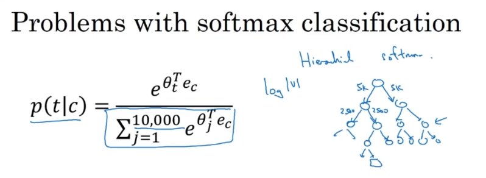

I should mention in practice, the hierarchical softmax classifier doesn't use a perfectly balanced tree or this perfectly symmetric tree, with equal numbers of words on the left and right sides of each branch. In practice, the hierarchical software classifier can be developed so that the common words tend to be on top, whereas the less common words like durian can be buried much deeper in the tree. Because you see the more common words more often, and so you might need only a few traversals to get to common words like the and of. Whereas you see less frequent words like durian much less often, so it says okay that are buried deep in the tree because you don't need to go that deep. So there are various heuristics for building the tree how you used to build the hierarchical software spire. So this is one idea you see in the literature, the speeding up the softmax classification.

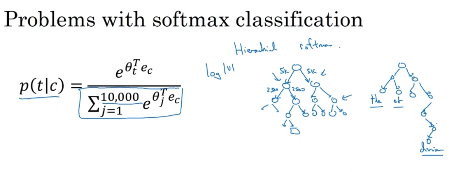

You can read more details of this on the paper that I referenced by Thomas Mikolov and others, on the first slide.

How to sample the context c?

So once you sample the context c, the target T can be sampled within, say, a plus minus ten word window of the context c, but how do you choose the context c?

One thing you could do is just sample uniformly, at random, When we do that, you find that there are some words like the, of, a, and, to and so on that appear extremely frequently. And so, if you do that, you find that in your context to target mapping pairs just get these these types of words extremely frequently, whereas there are other words like orange, apple, and also durian that don't appear that often. And maybe you don't want your training set to be dominated by these extremely frequently occurent words, because then you spend almost all the effort updating $e_c$, for those frequently occurring words. But you want to make sure that you spend some time updating the embedding, even for these less common words like $e_{durian}$.

So in practice the distribution of words P(c) isn't taken just entirely uniformly at random for the training set purpose, but instead there are different heuristics that you could use in order to balance out something from the common words together with the less common words.

But the key problem with this algorithm with the skip-gram model as presented so far is that the softmax step is very expensive to calculate because needing to sum over your entire vocabulary size into the denominator of the softmax.

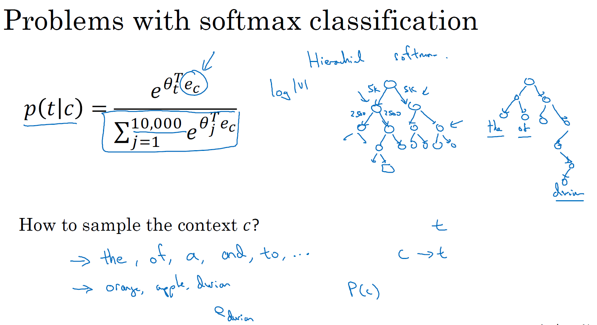

The goal of Word2Vec is not to build a language model.

The goal is: Learn good word embeddings (word vectors)

To do this, it uses a tiny, simple prediction task.

The Skip-Gram model answers this question:

“Given one word, which words usually appear near it?”

Example:

Sentence: “The cat sat on the mat.”

Pick the middle word: “sat”

Words near it: cat, on, the, mat

Training examples look like:

|Input word (context)	|Output word (target)|
|-|-|
|sat|	cat|
|sat|	on|
|sat|	the|
|sat|	mat|

The model sees millions of pairs like this.

Over time, it will notice:
* “king” appears near “queen”, “royal”, “crown”
* “apple” appears near “fruit”, “tree”, “eat”
* “computer” appears near “software”, “CPU”

This forces similar words to have similar embeddings.

Step 1 — Input word is one-hot encoded

Example vocab size = 10,000
The word “sat” becomes a vector:
```
[0, 0, 0, 1, 0, … 0]
```

Step 2 — Multiply by an embedding matrix

This extracts a 300-dimensional vector for the word (or whatever dimension we choose).

Step 3 — Feed into a softmax classifier

Softmax must output a probability for every word in the dictionary as the predicted target word.

If your dictionary has 100,000 words, you must compute 100,000 scores every time.

That’s expensive.

Softmax requires summing over every single word in the vocabulary.

If vocab size is 100,000, you compute 100,000 values every training example.

This is too slow.

Instead of checking all words at once…

Word2Vec puts the vocabulary into a binary tree.
* Common words get shorter paths
* Rare words get longer paths

To compute the probability of a word, you only walk the path from root to leaf.

This takes log₂(V) operations instead of V.

Example:
* V = 100,000 words
* log₂(100,000) ≈ 17

So instead of 100,000 calculations, you do ~17.

This makes the model thousands of times faster.

The model learns too much about "the" and very little about rare words.

Solution: downsample frequent words.
* Words like “the”, “a”, “in” are seen LESS often in training
* Rare words like “durian” are seen MORE often (relatively)

This balances the dataset.

## Negative Sampling
In this video, you see a modified learning problem called negative sampling that allows you to do something similar to the skip-grams model you saw just now, but with a much more efficient learning algorithm.

### Defining a new learning problem
Most of the ideas presented in this video are due to Thomas Mikolov, Sasaki, Chen Greco, and Jeff Dean.

What we're going to do in this algorithm is create a new supervised learning problem.

The problem is, given a pair of words like orange and juice, we're going to predict, is this a context-target pair? In this example, orange juice was a positive example.

How about Orange and King? That's a negative example so I'm going to write zero for the target.

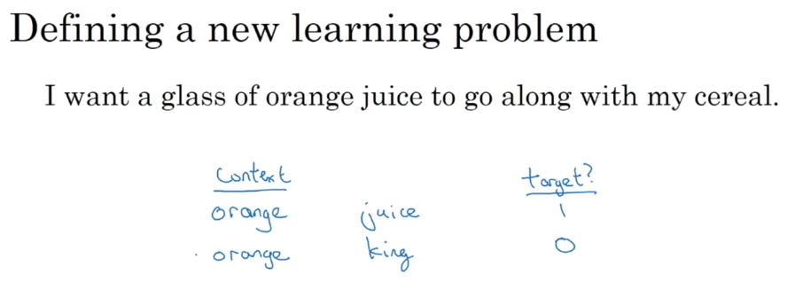

What we're going to do is we're actually going to sample a context and a target word. In this case, we had orange and juice and we'll associate that with a Label 1. Let's just put word in the middle. 

Then having generated a positive example, the positive examples generated exactly how we generated it in the previous videos sample context word, look around a window of say, +-10 words, and pick a target word. That's how you generate the first row of this table with orange juice one.

Then to generate the negative examples, you're going to take the same context word and then just pick a word at random from the dictionary. In this case, I chose the word king at random and label that as 0.

Then let's take orange and let's pick another random word from the dictionary under the assumption that if we pick a random word, it probably won't be associated with the word orange, so "book", 0. 

Let's pick a few others, orange, maybe just by chance we'll pick "the" 0, and then orange, and maybe just by chance, we'll pick the word "of" and we'll put a 0 there. Notice that all of these labeled as 0 even though the word "of" actually appears next to orange as well.

To summarize the way we generated this dataset is we'll pick a context word and then pick a target word and that is the first row of this table, that gives us a positive example. Context target, and then give that a label of 1.

Then what we do is for some number of times, say k times, we're going to take the same context words and then pick random words from the dictionary. King, book, the, of, whatever comes out at random from the dictionary and label all those 0, and those will be our negative examples.

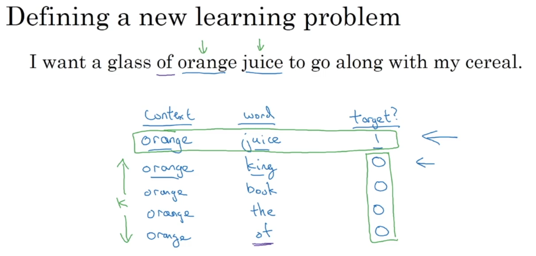

It's okay if just by chance, one of those words we picked at random from the dictionary happens to appear in a window, in a plus-minus 10-word windows, say next to the context word orange. 

Then we're going to create a supervised learning problem, where the algorithm inputs x inputs this pair of words, and then has to predict the target label to predict the output Y.

The problem is really given a pair of words like orange and juice, do you think they appear together? Do you think I got these two words by sampling two words close to each other? Or do you think I got them as one word from the text and one word chosen at random from the dictionary?

It's really to try to distinguish between these two types of distributions from which you might sample a pair of words. This is how you generate the training set.

How do you choose k? Mikolov recommends that maybe k is 5-20 for smaller datasets and if you have a very large dataset, then choose k to be smaller so k=2-5 for larger datasets and larger values of k for smaller datasets.

In this example, I've just used k=4.

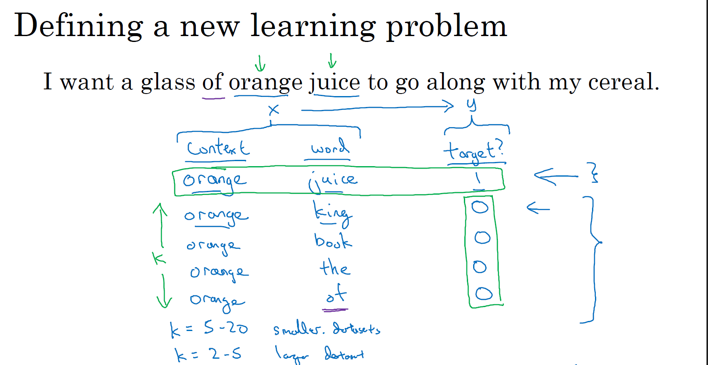

### Model
Next, let's describe the supervised learning model for learning and mapping from x to y.

Here was the SoftMax model you saw from the previous video and here's the training set we got from the previous slide where again, this is going to be the new input x and this is going to be the value of y you're trying to predict. 

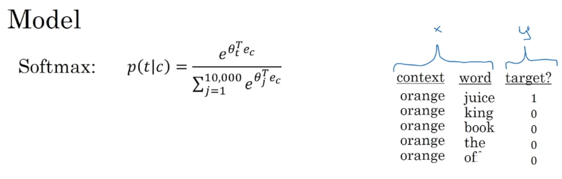

To define the model, I'm going to use this to denote this with c for the context word, this to denote the possible target word t and this I'll use y to denote 01. This is a context target pair. 

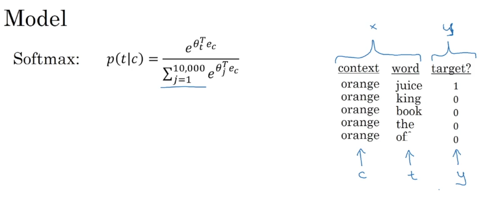

What we're going to do is define a logistic regression model. We say that the chance that y=1 given the input c,t pair, we're going to model this as basically a logistic regression model. But the specific formula we use is sigmoid applied to Theta t transpose ec.

$P(y=1|c,t)=\sigma(\theta_t^Te_c)$

The parameters are similar as before. You have one parameter vector Theta for each possible target word and a separate parameter vector really the embedding vector for each possible context word.

We're going to use this formula to estimate the probability that y=1.

If you have k examples here. Then if you can think of this as having a k:1 ratio of negative to positive examples. For every positive examples, you will have k negative examples with which to train this logistic regression model.

To draw this as a neural network, if the input word is orange, which is word 6257, then what you do is input their one hot vector passes through E, do the multiplication to get the embedding vector 6257. Then what you have is really 10,000 possible logistic regression classification problems where one of these will be the classifier corresponding to is the target word juice or not. Then there'll be other words. For example, there may be one somewhere down here which is predicting is the word king or not and so on for these are possible words in your vocabulary.

Think of this as having 10,000 binary logistic regression classifiers. But instead of training all 10,000 of them on every iteration, we're only going to train 5 of them. We're going to train the one corresponding to the actual target word we got and then train four randomly chosen negative examples, and this is for the case where K = 4.

Instead of having one giant 10,000 way softmax, which is very expensive to compute, we've instead turned it into 10,000 binary classification problems. Each of which is quite cheap to compute and on every iteration, we're only going to train 5 of them, or more generally, k+1 of them, with k negative examples and one positive examples and this is why the computational cost of this algorithm is much lower because you're updating k+1 binary classification problems, which is relatively cheap to do on every iteration, rather than updating a 10,000 way softmax classifier. 

This technique is called negative sampling because what you're doing is you had a positive example, the orange and the juice. Then you would go and deliberately generate a bunch of negative examples. We've negative samplings, hence the negative sampling, which to train 4 more of these binary classifiers, and on every iteration you choose 4 different random negative words with which to train your algorithm on.

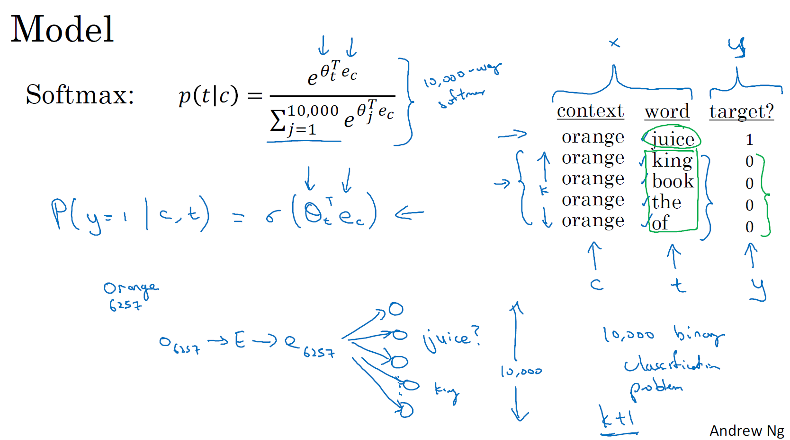

### Selecting negative examples
One more important detail of this algorithm is, how do you choose the negative examples?

After having chosen the context word "orange", how do you sample these words to generate the negative examples?

One thing you could do is sample the words in the middle, the candidate target words. One thing you could do is sample it according to the empirical frequency of words in your corpus. Just sample it according to how often different words appears. But the problem with that is that you end up with a very high representation of words like the, of, and, and so on.

One other extreme will be let say, you use one over the vocab_size. Sample the negative examples uniformly random. But that's also very non representative of the distribution of English words.

The authors reported that empirically what they found to work best was to take this heuristic value, which is a little bit in between the two extremes of sampling from the empirical frequencies, meaning from whatever is the observed distribution in English text to the uniform distribution, and what they did was they sampled proportional to the frequency of a word to the power of three forms.

If f(w_i) is the observed frequency of a particular word in the English language or in your training set corpus, then by taking it to the power of 3/4. This is somewhere in between the extreme of taking uniform distribution and the other extreme of just taking whatever was the observed distribution in your training set.

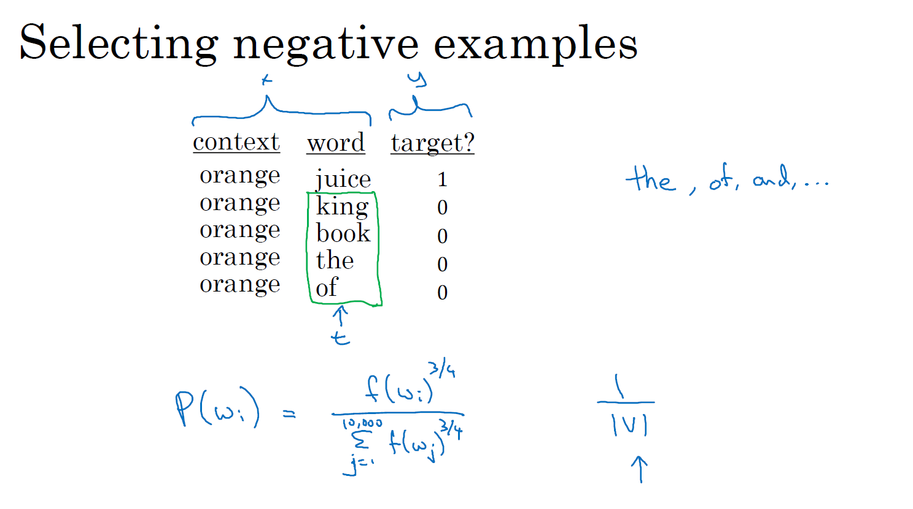

If you pick negatives:
* uniformly (all words equal chance)

→ rare words too common as negatives

If you pick negatives:
* by word frequency

→ super-common words like “the”, “to” appear too much

Best approach (discovered by experiments):

📌 Sample word i with probability proportional to frequency(wordᵢ)^(3/4)

Why 3/4?
* Empirical result: balances common and rare words
* Like heavy words (“the”) still appear, but less overwhelming
* Rare words appear occasionally, improving embedding quality

To summarize, you've seen how you can learn word vectors of a software classified, but it's very competition expensive and in this video, you saw how by changing that to a bunch of binary classification problems, you can very efficiently learn word vectors, and if you run this album, you will be able to learn pretty good word vectors.

Now, of course, as is the case in other areas of deep learning as well, there are open source implementations and there are also pretrained word vectors that others have trained and released online under permissive licenses. If you want to get going quickly on a NLP problem, it'd be reasonable to download someone else's word vectors and use that as a starting point.

## GloVe Word Vectors
You learn about several algorithms for computing words embeddings. Another algorithm that has some momentum in the NLP community is the GloVe algorithm. This is not used as much as the Word2Vec or the skip-gram models, but it has some enthusiasts. Because I think, in part of its simplicity.

### GloVe (global vectors for word representation)
Previously, we were sampling pairs of words, context and target words, by picking 2 words that appear in close proximity to each other in our text corpus.

What the GloVe algorithm does is, it starts off just by making that explicit.

Let's say $X_{ij}$ be the number of times that a word i appears in the context of j.

Here i and j play the role of t and c, so you can think of $X_{ij}$ as being $X_{tc}$.

You can go through your training corpus and just count up how many words does a word i appear in the context of a different word j. 

How many times does the word t appear in context of different words c.

Depending on the definition of context and target words, you might have that $X_{ij}$ equals $X_{ji}$. 

In fact, if you're defining context and target in terms of whether or not they appear within plus minus 10 words of each other, then it would be a symmetric relationship.

Although, if your choice of context was that, the context is always the word immediately before the target word, then $X_{ij}$ and $X_{ji}$ may not be symmetric like this.

For the purposes of the GloVe algorithm, we can define context and target as whether or not the 2 words appear in close proximity, say within plus or minus 10 words of each other.


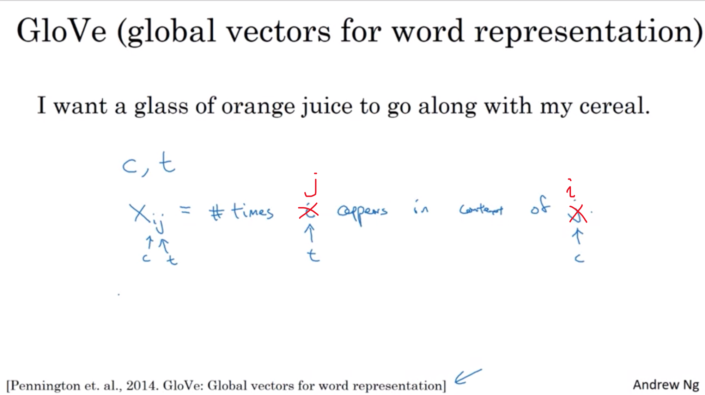

$X_{ij}$ is a count that captures how often do words i and j appear with each other, or close to each other.

### Model
What the GloVe model does is, it optimizes the following.

We're going to minimize the difference between theta i transpose e_j minus log of $X_{ij}$ squared.

Think of i and j as playing the role of t and c. So this is a bit like what you saw previously with theta t transpose e_c. And what you want is, for this to tell you how related are those two words? How related are words t and c? How related are words i and j as measured by how often they occur with each other? Which is affected by this $X_{ij}$.

What we're going to do is, solve for parameters theta and e using gradient descent to minimize the sum over i equals one to 10,000 sum over j from one to 10,000 of this difference. So you just want to learn vectors, so that their end product is a good predictor for how often the two words occur together.

Just some additional details, if $X_{ij}$ is equal to zero, then log of 0 is undefined, is negative infinity.

What we do is, we won't sum over the terms where $X_{ij}$ is equal to zero. And so, what we're going to do is, add an extra weighting term. So $f(X_{ij})$ is going to be a weighting term, and $f(X_{ij})$ will be equal to zero if $X_{ij}$ is equal to zero. And we're going to use a convention that 0 log 0 is equal to 0.

So what this means is, that if $X_{ij}$ is equal to zero, just don't bother to sum over that $X_{ij}$ pair. So then this log of zero term is not relevant. So this means the sum is sum only over the pairs of words that have co-occurred at least once in that context-target relationship.

The other thing that $f(X_{ij})$ does is that, there are some words they just appear very often in the English language like, this, is, of, a, and so on. Sometimes we used to call them stop words but there's really a continuum between frequent and infrequent words.

And then there are also some infrequent words like durian, which you actually still want to take into account, but not as frequently as the more common words. And so, the weighting factor can be a function that gives a meaningful amount of computation, even to the less frequent words like durian, and gives more weight but not an unduly large amount of weight to words like, this, is, of, a, which just appear lost in language. And so, there are various heuristics for choosing this weighting function f that need or gives these words too much weight nor gives the infrequent words too little weight. 

Finally, one funny thing about this algorithm is that the roles of theta and e are now completely symmetric. So, theta i and $e_j$ are symmetric in that, if you look at the math, they play pretty much the same role and you could reverse them or sort them around, and they actually end up with the same optimization objective. 

One way to train the algorithm is to initialize theta and e both uniformly random gradient descent to minimize its objective, and then when you're done for every word, to then take the average.

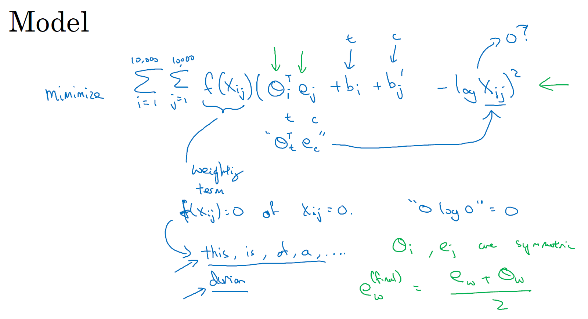

For a given words w, you can have $e_w^{(final)}$ to be equal to the embedding that was trained through this gradient descent procedure, plus theta trained through this gradient descent procedure divided by two, because theta and e in this particular formulation play symmetric roles unlike the earlier models we saw in the previous videos, where theta and e actually play different roles and couldn't just be averaged like that.

I think one confusing part of this algorithm is, if you look at this equation, it seems almost too simple. How could it be that just minimizing a square cost function like this allows you to learn meaningful word embeddings?

But it turns out that this works. And the way that the inventors end up with this algorithm was, they were building on the history of much more complicated algorithms like the newer language model, and then later, there came the Word2Vec skip-gram model, and then this came later. And we really hope to simplify all of the earlier algorithms.

### A note on the featurization view of word embeddings
Which is that we started off with this featurization view as the motivation for learning word vectors. 

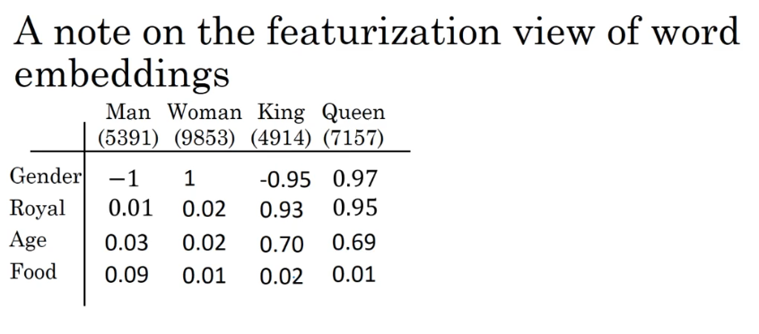

We said, "Well, maybe the first component of the embedding vector to represent gender, the second component to represent how royal it is, then the age and then whether it's a food, and so on."

When you learn a word embedding using one of the algorithms that we've seen, such as the GloVe algorithm that we just saw on the previous slide, what happens is, you cannot guarantee that the individual components of the embeddings are interpretable.

Why is that? Well, let's say that there is some space where the first axis is gender and the second axis is royal. What you can't do is guarantee that the first axis of the embedding vector is aligned with this axis of meaning, of gender, royal, age and food. 

In particular, the learning algorithm might choose this to be axis of the first dimension. So, given maybe a context of words, so the first dimension might be this axis and the second dimension might be this. Or it might not even be orthogonal, maybe it'll be a second non-orthogonal axis, could be the second component of the word embeddings you actually learn.

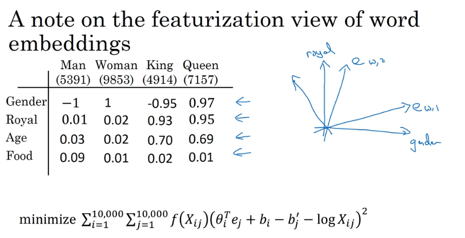

When we see this, if you have a subsequent understanding of linear algebra is that, if there was some invertible matrix A, then $\theta_t^Te_j$ could just as easily be replaced with A times theta i transpose A inverse transpose e_j. Because we expand this out, this is equal to theta i transpose A transpose A inverse transpose times e_j. And so, the middle term cancels out and we're left with theta i transpose e_j, same as before.

Don't worry if you didn't follow the linear algebra, but that's a brief proof that shows that with an algorithm like this, you can't guarantee that the axis used to represent the features will be well-aligned with what might be easily humanly interpretable axis. 

In particular, the first feature might be a combination of gender, and royal, and age, and food, and cost, and size, is it a noun or an action verb, and all the other features. It's very difficult to look at individual components, individual rows of the embedding matrix and assign the human interpretation to that. 

But despite this type of linear transformation, the parallelogram map that we worked out when we were describing analogies, that still works. And so, despite this potentially arbitrary linear transformation of the features, you end up learning the parallelogram map for figure analogies still works.


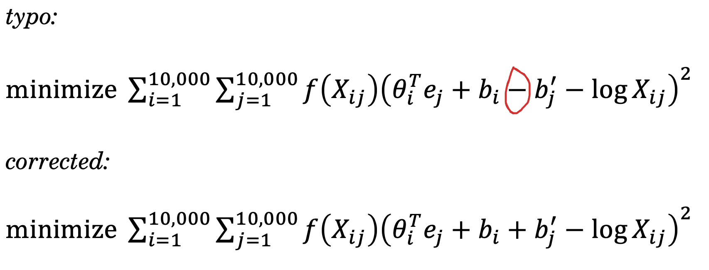

Word2Vec (Skip-Gram, Negative Sampling) learns embeddings by predicting neighbors word-by-word.

But it does not directly use global statistics like:
* How often words appear overall
* How often two words appear together across the whole dataset

GloVe was created to fix that.

GloVe wants to create word vectors that capture meaning, but instead of predicting words like Word2Vec, it uses statistics.

GloVe is built on one simple idea:

Words that appear together often should have similar vectors.

And the amount they appear together will tell us how similar they should be.

So GloVe is basically:
* counting things
* then squeezing the counts into vectors

The name:

Global Vectors (GloVe)

comes from the idea:

* Use global co-occurrence counts
* to build word vectors directly
* using a simple mathematical model

GloVe starts by counting how often words appear together.

Imagine you look at all of Wikipedia. Every time word j appears near word i, you add to Xᵢⱼ.

Example:
* X(ice, water) = 5220
* X(ice, steam) = 100
* X(king, queen) = 1500
* X(king, banana) = 3

GloVe uses these counts rather than predicting via softmax.

This is called a global method — it uses the whole dataset’s statistics.

Ratios of co-occurrence counts encode semantic relationships.

Example:

ice vs steam

Look at ratio:

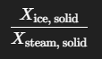

Ice co-occurs with “solid” way more than steam does.

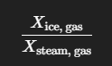

Steam co-occurs with “gas” way more than ice.

This tells you:
* ice is related to “solid”
* steam is related to “gas”
* both related to “water”

GloVe tries to make embeddings that capture these ratios.

GloVe wants word vectors $w_i$ and context vectors $v_j$ such that:

$w_i^Tv_j \approx log(X_{ij})$

Why log?
* raw counts vary too much
* log stabilizes numbers
* also makes analogy behavior work better

This equation says:

The dot product of two word vectors should match how often the words appear together.

If X(ice, water) = 5220 then log(5220) ≈ 8.5

So we want

$w_{ice}^Tv_{water} \approx 8.5$

This means:
* vectors for words that co-occur often will be closer
* vectors for unrelated words will be far apart

The Objective Function (Loss)

We want:

$(w_i^Tv_j + b_i + c_j - log(X_{ij}))^2$

But… some words appear thousands of times (“the”, “of”).
Others barely appear (“aardvark”).

If we treat all pairs equally:
* frequent words dominate
* rare words get ignored

So GloVe uses a weighting function: $f(X_{ij})$

which:
* increases effect of medium-frequency pairs
* decreases effect of extremely rare or extremely frequent pairs

Andrew uses a graph showing that f(x) rises and then levels off.

Word and Context Roles Are Interchangeable

The model learns:
* one embedding for when a word is the focus word (wᵢ)
* another for when it is a context word (vᵢ)

But these two roles are symmetric.

So after training:

We average the two vectors:

$u_i = {{w_i+v_i} \over 2}$

This is the final embedding used downstream.

Even though each dimension is not interpretable (just like Word2Vec), GloVe ends up capturing linear structure, giving us:
* king – man + woman ≈ queen
* Paris – France + Italy ≈ Rome

because the co-occurrence ratios encode these relationships implicitly.

GloVe tends to perform very well in “analogy tasks,” which Andrew briefly shows.

Word2Vec = learns embeddings by predicting nearby words.
GloVe = learns embeddings by factorizing a co-occurrence matrix.

They end up producing similar-quality vectors, but their philosophies differ:
* Word2Vec → predicts local context
* GloVe → uses global statistics

Both are used widely today.

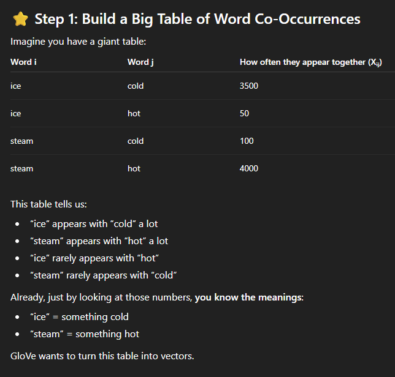

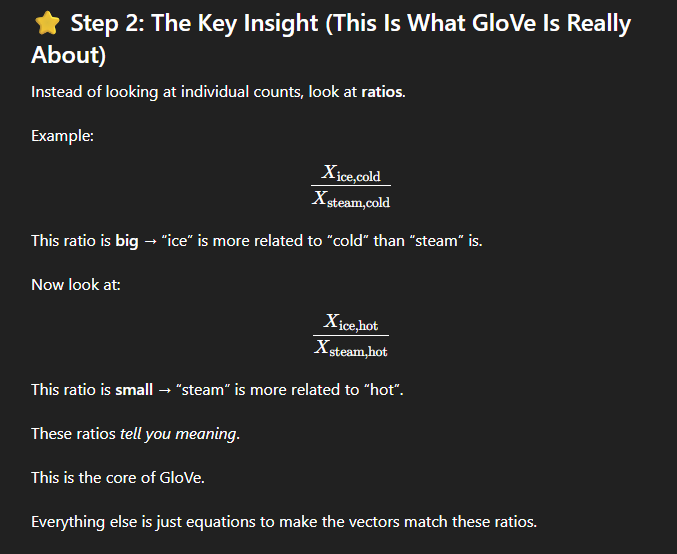

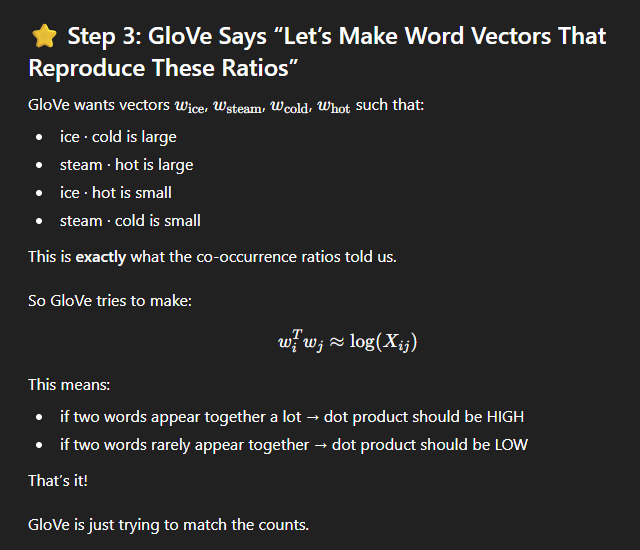


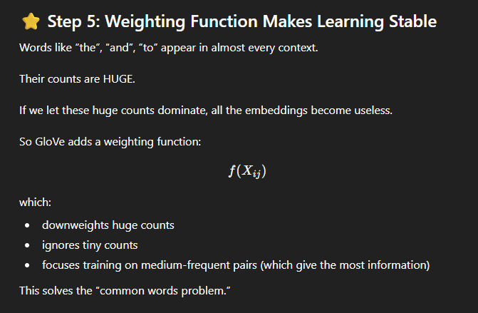

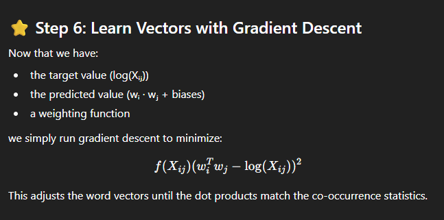

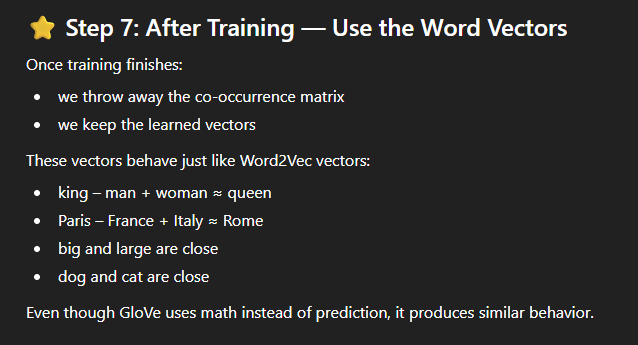

## Sentiment Classification
Sentiment classification is the task of looking at a piece of text and telling if someone likes or dislikes the thing they're talking about.

One of the challenges of sentiment classification is you might not have a huge label training set for it. But with word embeddings, you're able to build good sentiment classifiers even with only modest-size label training sets.

### Sentiment classification problem
So here's an example of a sentiment classification problem. The input X is a piece of text and the output Y that you want to predict is what is the sentiment, such as the star rating of, let's say, a restaurant review.

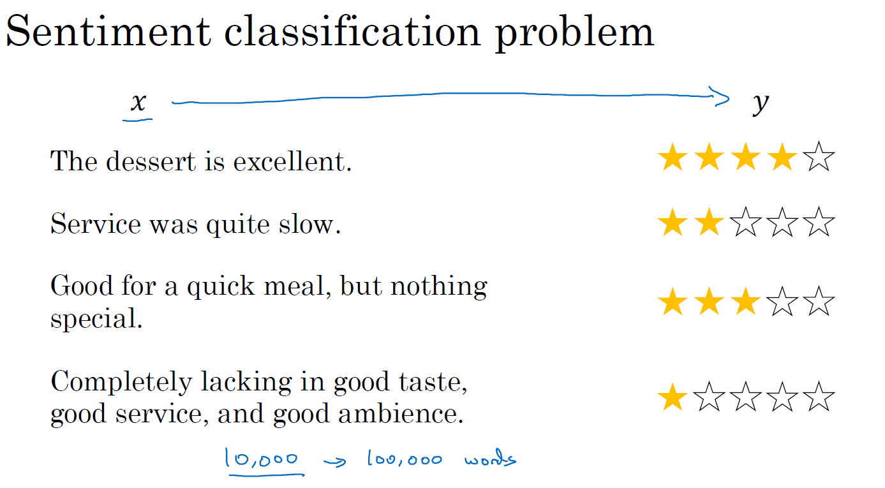

So if someone says, "The dessert is excellent" and they give it a four-star review, "Service was quite slow" two-star review, "Good for a quick meal but nothing special" three-star review. And this is a pretty harsh review, "Completely lacking in good taste, good service, and good ambiance." That's a one-star review.

If you can train a system to map from X or Y based on a label data set like this, then you could use it to monitor comments that people are saying about maybe a restaurant that you run.

People might also post messages about your restaurant on social media, on Twitter, or Facebook, or Instagram, or other forms of social media.

If you have a sentiment classifier, they can look just a piece of text and figure out how positive or negative is the sentiment of the poster toward your restaurant. Then you can also be able to keep track of whether or not there are any problems or if your restaurant is getting better or worse over time. 

One of the challenges of sentiment classification is you might not have a huge label data set.

For sentimental classification task, training sets with maybe anywhere from 10,000 to maybe 100,000 words would not be uncommon. Sometimes even smaller than 10,000 words and word embeddings that you can take can help you to much better understand especially when you have a small training set.

### Simple sentiment classification model
Here's a simple sentiment classification model. You can take a sentence like "dessert is excellent" and look up those words in your dictionary. We use a 10,000-word dictionary as usual.

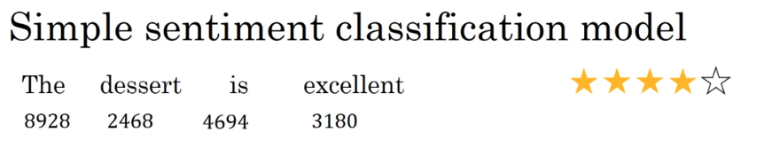

Let's build a classifier to map it to the output Y that this was 4 stars.

Given these four words, as usual, we can take these four words and look up the one-hot vector. So there's $o_{8928}$ which is a one-hot vector multiplied by the embedding matrix E, which can learn from a much larger text corpus. It can learn in embedding from, say, a billion words or a hundred billion words, and use that to extract out the embedding vector for the word "the", and then do the same for "dessert", do the same for "is" and do the same for "excellent".

If this was trained on a very large data set, like a hundred billion words, then this allows you to take a lot of knowledge even from infrequent words and apply them to your problem, even words that weren't in your labeled training set.

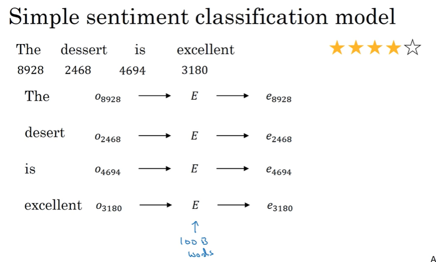

Now here's one way to build a classifier, which is that you can take these vectors, let's say these are 300-dimensional vectors, and you could then just sum or average them. And I'm just going to put a bigger average operator here and you could use sum or average. And this gives you a 300-dimensional feature vector that you then pass to a soft-max classifier which then outputs Y-hat. 

The softmax can output what are the probabilities of the five possible outcomes from one-star up to five-star. So this will be softmax of the five possible outcomes to predict what is Y.

Notice that by using the average operation here, this particular algorithm works for reviews that are short or long because even if a review that is 100 words long, you can just sum or average all the feature vectors for all hundred words and so that gives you a representation, a 300-dimensional feature representation, that you can then pass into your sentiment classifier.

This average will work decently well. And what it does is it really averages the meanings of all the words or sums the meaning of all the words in your example. 

One of the problems with this algorithm is it ignores word order. 

In particular, this is a very negative review, "Completely lacking in good taste, good service, and good ambiance". But the word good appears a lot. This is a lot. Good, good, good. So if you use an algorithm like this that ignores word order and just sums or averages all of the embeddings for the different words, then you end up having a lot of the representation of good in your final feature vector and your classifier will probably think this is a good review even though this is actually very harsh. This is a one-star review.

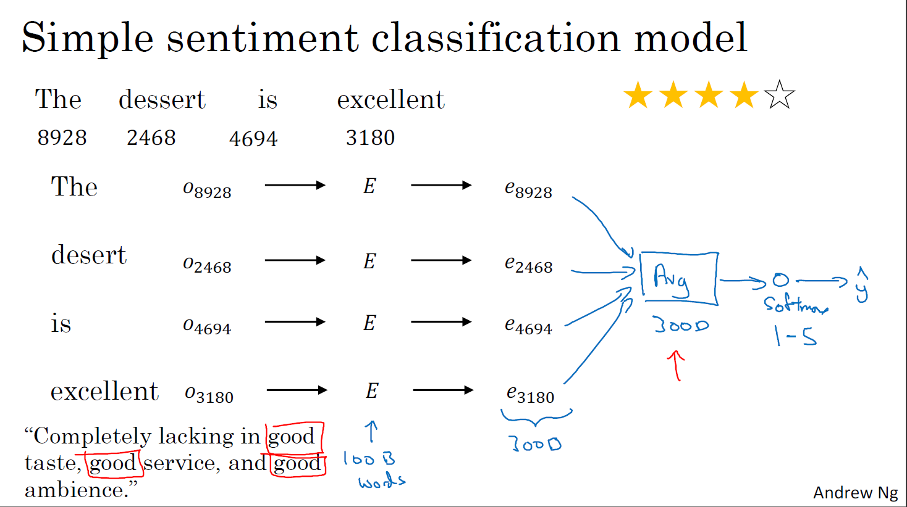

### RNN for sentiment classification
Here's a more sophisticated model which is that, instead of just summing all of your word embeddings, you can instead use a RNN for sentiment classification.

You can take that review, "Completely lacking in good taste, good service, and good ambiance", and find for each of them, the one-hot vector.

I'm going to just skip the one-hot vector representation but take the one-hot vectors, multiply it by the embedding matrix E as usual, then this gives you the embedding vectors and then you can feed these into an RNN.

The job of the RNN is to then compute the representation at the last time step that allows you to predict Y-hat. So this is an example of a many-to-one RNN architecture which we saw in the previous week. 

And with an algorithm like this, it will be much better at taking word sequence into account and realize that "things are lacking in good taste" is a negative review and "not good" a negative review unlike the previous algorithm, which just sums everything together into a big-word vector mush and doesn't realize that "not good" has a very different meaning than the words "good" or "lacking in good taste" and so on.

If you train this algorithm, you end up with a pretty decent sentiment classification algorithm and because your word embeddings can be trained from a much larger data set, this will do a better job generalizing to maybe even new words now that you'll see in your training set, such as if someone else says, "Completely absent of good taste, good service, and good ambiance" or something, then even if the word "absent" is not in your label training set, if it was in your 1 billion or 100 billion word corpus used to train the word embeddings, it might still get this right and generalize much better even to words that were in the training set used to train the word embeddings but not necessarily in the label training set that you had for specifically the sentiment classification problem.

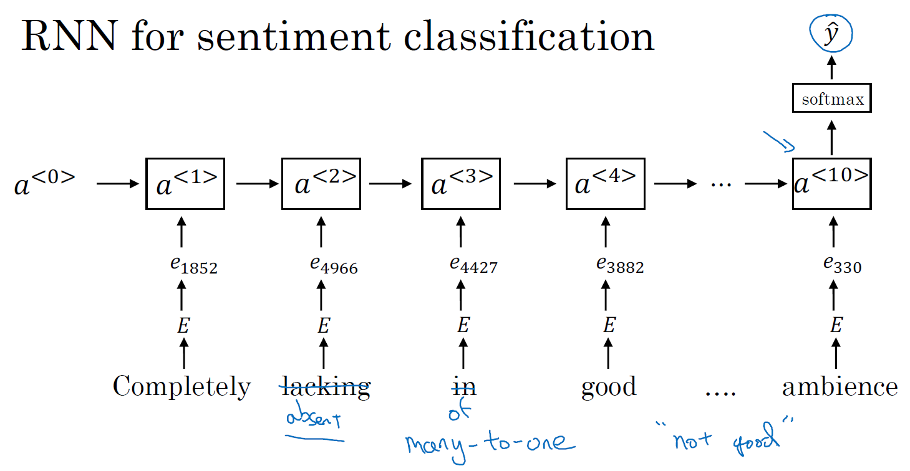

## Debiasing Word Embeddings
Machine learning and AI algorithms are increasingly trusted to help with, or to make, extremely important decisions. And so we like to make sure that as much as possible that they're free of undesirable forms of bias, such as gender bias, ethnicity bias and so on. What I want to do in this video is show you some of the ideas for diminishing or eliminating these forms of bias in word embeddings.

### The problem of bias in word embeddings
When I use the term bias in this video, I don't mean the bias variants. Sense the bias, instead I mean gender, ethnicity, sexual orientation bias. That's a different sense of bias then is typically used in the technical discussion on machine learning.

But mostly the problem, we talked about how word embeddings can learn analogies like man is to woman as king is to queen. 

But what if you ask it, man is to computer programmer as woman is to what? And so the authors of this paper Tolga Bolukbasi, Kai-Wei Chang, James Zou, Venkatesh Saligrama, and Adam Kalai found a somewhat horrifying result where a learned word embedding might output Man:Computer_Programmer as Woman:Homemaker.

And that just seems wrong and it enforces a very unhealthy gender stereotype.

It'd be much more preferable to have algorithm output man is to computer programmer as a woman is to computer programmer.

They found also, Father:Doctor as Mother is to what? And the really unfortunate result is that some learned word embeddings would output Mother:Nurse.

Word embeddings can reflect the gender, ethnicity, age, sexual orientation, and other biases of the text used to train the model. 

One that I'm especially passionate about is bias relating to socioeconomic status. I think that every person, whether you come from a wealthy family, or a low income family, or anywhere in between, I think everyone should have great opportunities.

And because machine learning algorithms are being used to make very important decisions. They're influencing everything ranging from college admissions, to the way people find jobs, to loan applications, whether your application for a loan gets approved, to in the criminal justice system, even sentencing guidelines. Learning algorithms are making very important decisions and so I think it's important that we try to change learning algorithms to diminish as much as is possible, or, ideally, eliminate these types of undesirable biases.

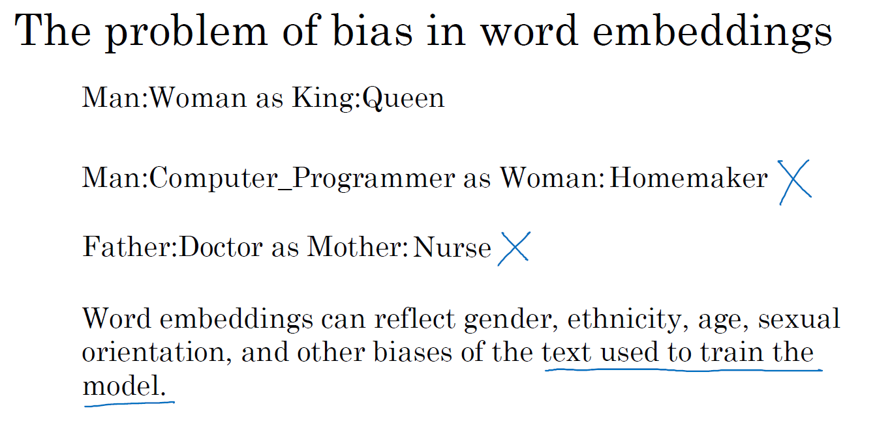

Now in the case of word embeddings, they can pick up the biases of the text used to train the model and so the biases they pick up or tend to reflect the biases in text as is written by people. Over many decades, over many centuries, I think humanity has made progress in reducing these types of bias. And I think maybe fortunately for AI, I think we actually have better ideas for quickly reducing the bias in AI than for quickly reducing the bias in the human race.

Although I think we're by no means done for AI as well and there's still a lot of research and hard work to be done to reduce these types of biases in our learning algorithms.

What I want to do in this video is share with you one example of a set of ideas due to the paper referenced at the bottom by Bolukbasi and others on reducing the bias in word embeddings.

### Addressing bias in word embeddings
Let's say that we've already learned a word embedding, so the word "babysitter" is here, the word doctor is here. We have "grandmother" here, and "grandfather" here. Maybe the word "girl" is embedded there, the word "boy" is embedded there. And maybe she is embedded here, and he is embedded there.


The first thing we're going to do it is identify the direction corresponding to a particular bias we want to reduce or eliminate. And, for illustration, I'm going to focus on gender bias but these ideas are applicable to all of the other types of bias that I mention on the previous slide as well.

How do you identify the direction corresponding to the bias?

For the case of gender, what we can do is take the embedding vector for he and subtract the embedding vector for she, because that differs by gender. And take e male, subtract e female, and take a few of these and average them, right? And take a few of these differences and basically average them. 

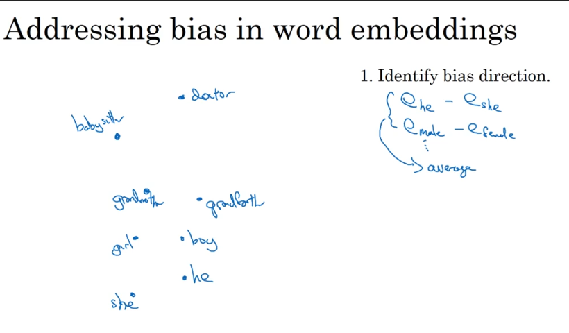

This will allow you to figure out in this case that what looks like this direction is the gender direction, or the bias direction.

Whereas this direction is unrelated to the particular bias we're trying to address. So this is the non-bias direction.

In this case, the bias direction, think of this as a 1D subspace whereas a non-bias direction, this will be 299-dimensional subspace.

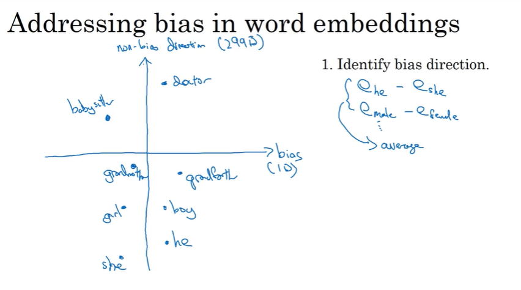

I've simplified the description a little bit in the original paper. The bias direction can be higher than 1-dimensional, and rather than take an average, as I'm describing it here, it's actually found using a more complicated algorithm called a SVU, a singular value decomposition which is closely related to, if you're familiar with principle component analysis, it uses ideas similar to the pc or the principle component analysis algorithm.

After that, the next step is a neutralization step. So for every word that's not definitional, project it to get rid of bias. So there are some words that intrinsically capture gender. So words like grandmother, grandfather, girl, boy, she, he, a gender is intrinsic in the definition.

Whereas there are other word like doctor and babysitter that we want to be gender neutral. And really, in the more general case, you might want words like doctor or babysitter to be ethnicity neutral or sexual orientation neutral, and so on, but we'll just use gender as the illustrating example here. But so for every word that is not definitional, this basically means not words like grandmother and grandfather, which really have a very legitimate gender component, because, by definition, grandmothers are female, and grandfathers are male. So for words like doctor and babysitter, let's just project them onto this axis to reduce their components, or to eliminate their component, in the bias direction. So reduce their component in this horizontal direction. So that's the second neutralize step.

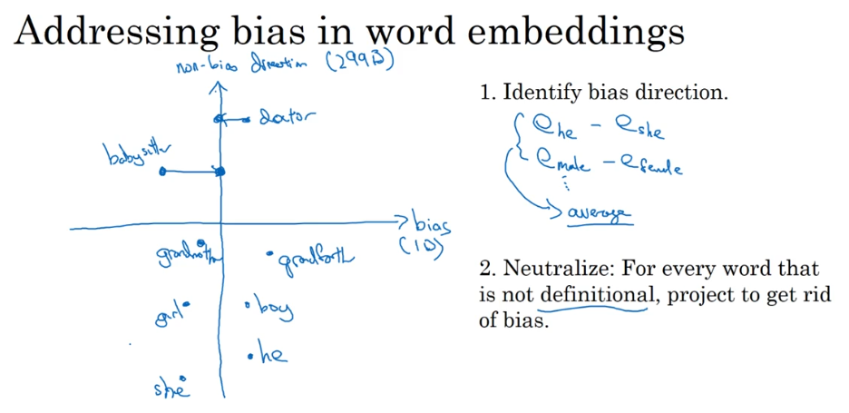

Then the final step is called equalization in which you might have pairs of words such as grandmother and grandfather, or girl and boy, where you want the only difference in their embedding to be the gender.

Why do you want that? In this example, the distance, or the similarity, between babysitter and grandmother is actually smaller than the distance between babysitter and grandfather. And so this maybe reinforces an unhealthy, or maybe undesirable, bias that grandmothers end up babysitting more than grandfathers. 

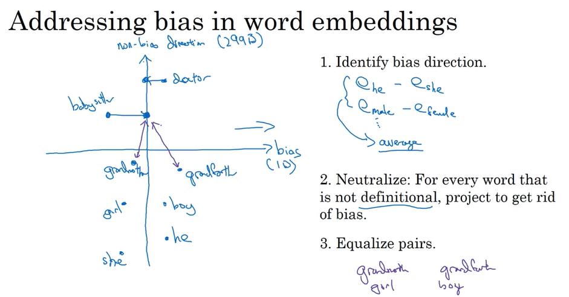

So in the final equalization step, what we'd like to do is to make sure that words like grandmother and grandfather are both exactly the same similarity, or exactly the same distance, from words that should be gender neutral, such as babysitter or such as doctor. 

There are a few linear algebra steps for that. What it will basically do is move grandmother and grandfather to a pair of points that are equidistant from this axis in the middle. And so the effect of that is that now the distance between babysitter, compared to these two words, will be exactly the same.

In general, there are many pairs of words like this grandmother-grandfather, boy-girl, sorority-fraternity, girlhood-boyhood, sister-brother, niece-nephew, daughter-son, that you might want to carry out through this equalization step.

The final detail is, how do you decide what word to neutralize?

For example, the word doctor seems like a word you should neutralize to make it non-gender-specific or non-ethnicity-specific. Whereas the words grandmother and grandmother should not be made non-gender-specific. And there are also words like beard, that it's just a statistical fact that men are much more likely to have beards than women, so maybe beards should be closer to male than female.

What the authors did is train a classifier to try to figure out what words are definitional, what words should be gender-specific and what words should not be. And it turns out that most words in the English language are not definitional, meaning that gender is not part of the definition. And it's such a relatively small subset of words like this, grandmother-grandfather, girl-boy, sorority-fraternity, and so on that should not be neutralized.

Linear classifier can tell you what words to pass through the neutralization step to project out this bias direction, to project it on to this essentially 299-dimensional subspace.

Finally, the number of pairs you want to equalize, that's actually also relatively small, and is, at least for the gender example, it is quite feasible to hand-pick most of the pairs you want to equalize.

The full algorithm is a bit more complicated than I present it here, you can take a look at the paper for the full details. And you also get to play with a few of these ideas in the programming exercises as well.

To summarize, I think that reducing or eliminating bias of our learning algorithms is a very important problem because these algorithms are being asked to help with or to make more and more important decisions in society. In this video I shared just one set of ideas for how to go about trying to address this problem, but this is still a very much an ongoing area of active research by many researchers.

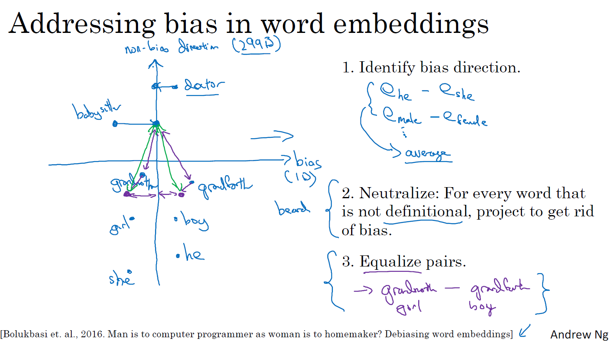


