# Week 3: Sequence Models & Attention Mechanism

**Learning Objectives**
* Describe a basic sequence-to-sequence model
* Compare and contrast several different algorithms for language translation
* Optimize beam search and analyze it for errors
* Use beam search to identify likely translations
* Apply BLEU score to machine-translated text
* Implement an attention model
* Train a trigger word detection model and make predictions
* Synthesize and process audio recordings to create train/dev datasets
* Structure a speech recognition project

- [Week 3: Sequence Models \& Attention Mechanism](#week-3-sequence-models--attention-mechanism)
  - [Basic models](#basic-models)
    - [Sequence to sequence model](#sequence-to-sequence-model)
    - [Image captioning](#image-captioning)
  - [Picking the Most Likely Sentence](#picking-the-most-likely-sentence)
    - [Machine translation as building a conditional language model](#machine-translation-as-building-a-conditional-language-model)
    - [Finding the most likely translation](#finding-the-most-likely-translation)
    - [Why not a greedy search?](#why-not-a-greedy-search)
  - [Beam Search](#beam-search)
    - [Beam search algorithm](#beam-search-algorithm)
    - [Beam search (B = 3)](#beam-search-b--3)
  - [Refinements to Beam Search](#refinements-to-beam-search)
    - [Length normalization](#length-normalization)
    - [Beam search discussion](#beam-search-discussion)
  - [Error Analysis in Beam Search](#error-analysis-in-beam-search)
    - [Example](#example)
    - [Error analysis on beam search](#error-analysis-on-beam-search)
    - [Error analysis process](#error-analysis-process)
    - [Summary](#summary)
  - [Bleu Score (Optional)](#bleu-score-optional)
    - [Evaluating machine translation](#evaluating-machine-translation)
    - [Bleu score on unigrams](#bleu-score-on-unigrams)
    - [Bleu score on unigrams](#bleu-score-on-unigrams-1)
    - [Bleu details](#bleu-details)
    - [Summary](#summary-1)
  - [Attention Model Intuition](#attention-model-intuition)
    - [The problem of long sequences](#the-problem-of-long-sequences)
    - [Attention model intuition](#attention-model-intuition-1)
  - [Attention model](#attention-model)
    - [Attention model](#attention-model-1)
    - [Computing attention $\\alpha^{\<t,t'\>}$](#computing-attention-alphatt)
    - [Attention examples](#attention-examples)
  - [Speech Recognition](#speech-recognition)
    - [Speech recognition problem](#speech-recognition-problem)
    - [Attention model for speech recognition](#attention-model-for-speech-recognition)
    - [CTC cost for speech recognition](#ctc-cost-for-speech-recognition)
  - [Trigger Word Detection](#trigger-word-detection)
    - [What is trigger word detection?](#what-is-trigger-word-detection)
    - [Trigger word detection algorithm](#trigger-word-detection-algorithm)
    - [Summary](#summary-2)

## Basic models
### Sequence to sequence model
Translate French sentence (input): Jane visite l’Afrique en septembre

To English (output): Jane is visiting Africa in September.

Use $x^{<1>}$ to $x^{<5>}$ the represent words in the input sequence.

Use $y^{<1>}$ to $y^{<6>}$ the represent words in the output sequence.

First, we have an encoder network be built as a RNN and this could be a GRU or LSTM.

Then feed the input French words one word at a time.

After ingesting the input sequence the RNN then outputs a vector that represents the input sentence.

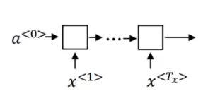

After that, you can build a decoded network which takes as input the encoding output by the encoding network shown in black on the left, and then can be trained to output the translation one word at a time.

Eventually, it helps us say the end of sequence and the sentence token upon which the decoder stops.

As usual, we could take the generated tokens and feed them to the next hidden state in the sequence like we were doing before when synthesizing text using the language model.

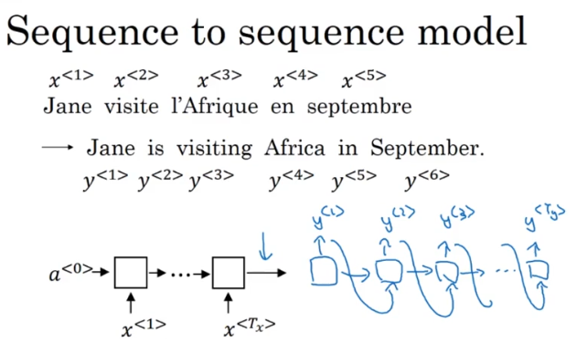

-> This works well.

This model simply uses an encoding network whose job it is to find an encoding of the input French sentence, and then use a decoding network to then generate the corresponding English translation.

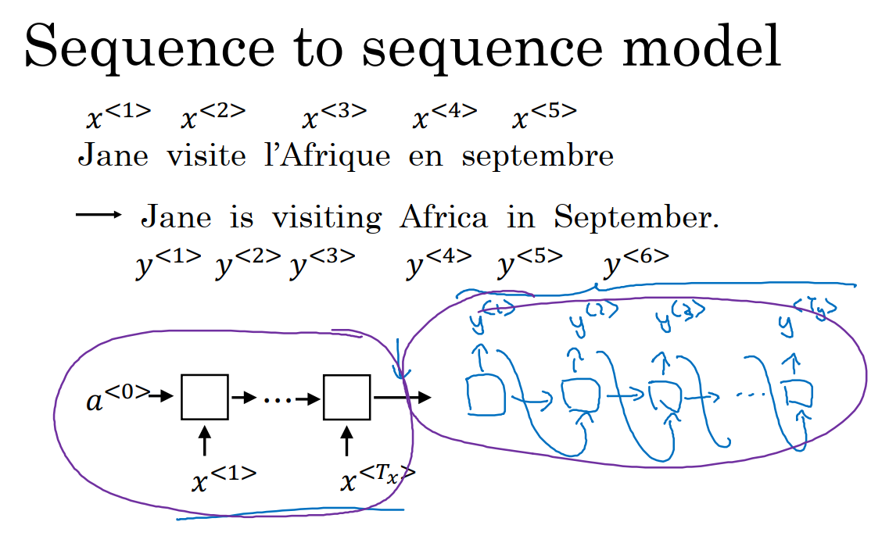

### Image captioning
An architecture very similar to this also works for image captioning.

Given an image like the one shown here

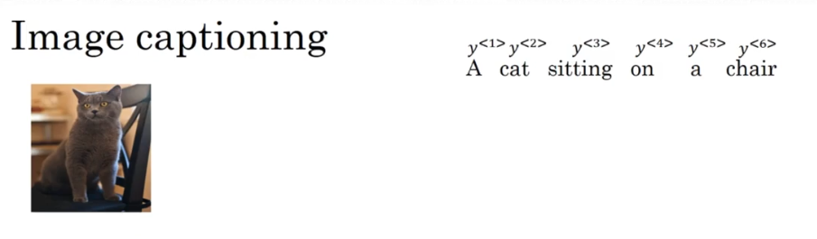

You wanted to be captions automatically as a cat sitting on a chair.

Input an image and output a caption "A cat sitting on a chair"

We input an image to a convolutional network (a pre-trained AlexNet for example), then have that learn and encoding a learner to the features of the input image.

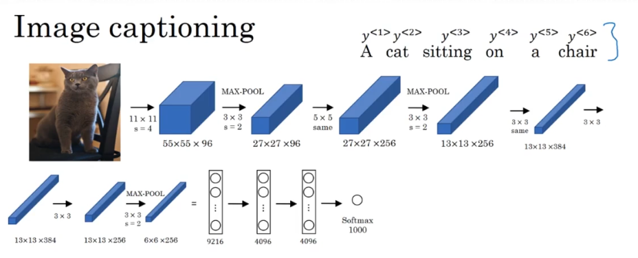

We remove final softmax unit, so the pre-trained AlexNet gives 4096 dimensional feature vector to represent the picture of a cat.

This pre-trained network can be the encoded network for the image and you now have a 4,096-dimensional vector that represents the image.

You can then take this and feed it to an RNN whose job it is to generate the caption one word at a time.

Similar to what we saw with machine translation, translating from French the English, you can now input a feature vector describing the inputs and then have it generate an output set of words, one word at a time.

This actually works pretty well for image captioning, especially if the caption you want to generate is not too long. 

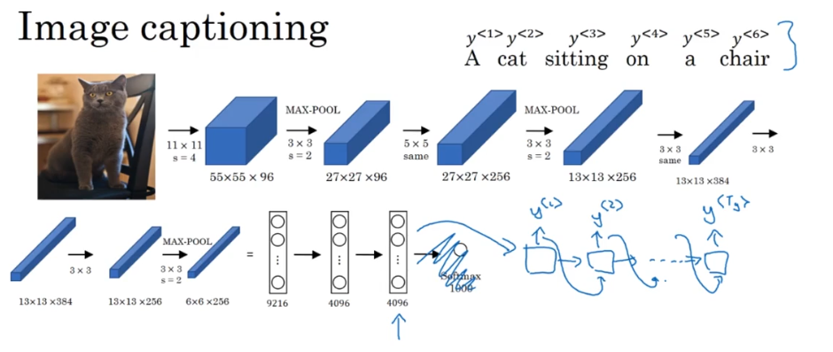

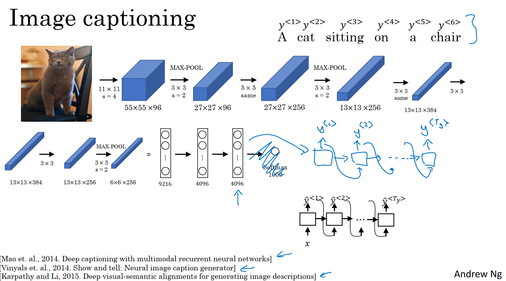

You've now seen how a basic sequence to sequence model works, how basic image to sequence, or image captioning model works. But there are some differences between how you'll run a model like this, the generally the sequence compared to how you were synthesizing novel text using a language model. One of the key differences is you don't want to randomly choose in translation. 
You may be want the most likely translation or you don't want to randomly choose in caption, maybe not, but you might want the best caption and most likely caption.

## Picking the Most Likely Sentence
There are some similarities between the sequence to sequence machine translation model and the language models that you have worked within the first week of this course, but there are some significant differences as well.

### Machine translation as building a conditional language model
Machine translation can be thought as building a conditional language model.

Language model:

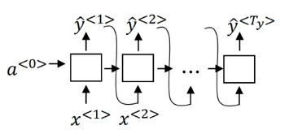

This model allows you to estimate the probability of a sentence $P(y^{<1>}, ..., y^{<T_y>})$.

It can be used to generate novel sentences.

Sometimes when you are writing $x{<1>}$ and $x{<2>}$ here, where in this example, $x{<2>}$ would be equal to $\hat{y}^{<1>}$ is just a feedback of $x{<1>}$, $x{<2>}$, and so on were not important. So just to clean this up for this slide, I'm going to just cross these off. $x{<1>}$ could be the vector of all zeros and $x{<2>}$, $x{<3>}$ are just the previous output you are generating.

Machine translation:

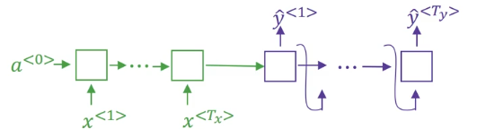

I am going to use a couple different colors, green and purple, to denote respectively the encoder network in green and the decoder network in purple.

Notice that the decoded network looks pretty much identical to the language model that we had up there.

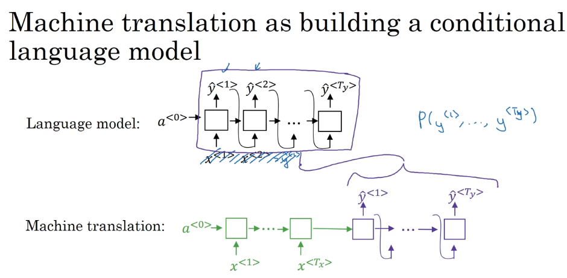

What the machine translation model is, is very similar to the language model, except that instead of always starting along with the vector of all zeros, it instead has an encoded network that figures out some representation for the input sentence, and it takes that input sentence and starts off the decoded network with representation of the input sentence rather than with the representation of all zeros.

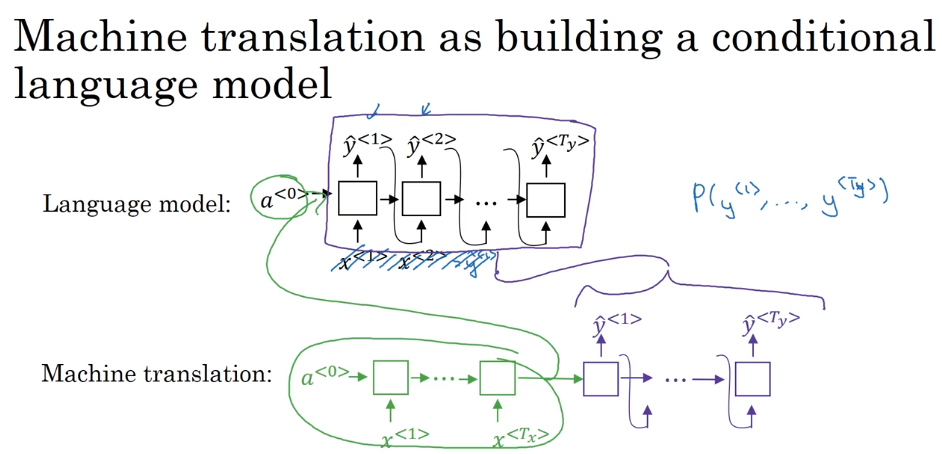

That's why I call this a conditional language model, and instead of modeling the probability of any sentence, it is now modeling the probability of, say, the output English translation, conditions on some input French sentence.

$P(y^{<1>}, ..., y^{<T_y>}|x^{<1>}, ..., x^{<T_x>})$

In other words, you're trying to estimate the probability of an English translation, what's the chance that the translation is "Jane is visiting Africa in September," but conditions on the input French sentence like, "Jane visite I'Afrique en septembre." 

This is really the probability of an English sentence conditions on an input French sentence which is why it is a conditional language model.

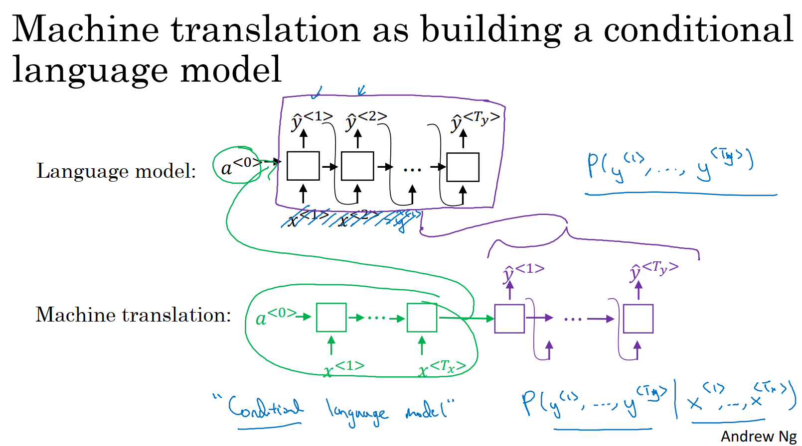

### Finding the most likely translation
If you want to apply this model to actually translate a sentence from French into English, given this input French sentence, the model might tell you what is the probability of difference in corresponding English translations.

x is the French sentence, "Jane visite l'Afrique en septembre."

This now tells you what is the probability of different English translations of that French input. 

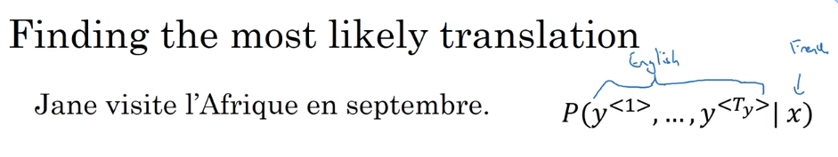

What you do not want is to sample outputs at random. If you sample words from this distribution, p of y given x, maybe one time you get a pretty good translation, "Jane is visiting Africa in September."

But, maybe another time you get a different translation, "Jane is going to be visiting Africa in September." Which sounds a little awkward but is not a terrible translation, just not the best one. 

And sometimes, just by chance, you get, say, others: "In September, Jane will visit Africa."

And maybe, just by chance, sometimes you sample a really bad translation: "Her African friend welcomed Jane in September."

So, when you're using this model for machine translation, you're not trying to sample at random from this distribution. Instead, what you would like is to find the English sentence, y, that maximizes that conditional probability.

$argmax_{y^{<1>}, ..., y^{<T_y>}}P(y^{<1>}, ..., y^{<T_y>}|x)$

In developing a machine translation system, one of the things you need to do is come up with an algorithm that can actually find the value of y that maximizes this term over here.

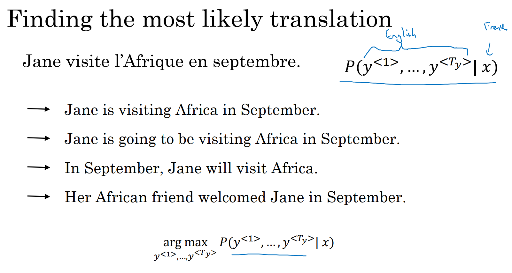

The most common algorithm for doing this is called beam search. 

### Why not a greedy search?
Before moving on to describe beam search, you might wonder, why not just use greedy search?

Greedy search is an algorithm from computer science which says to generate the first word just pick whatever is the most likely first word according to your conditional language model. Going to your machine translation model and then after having picked the first word, you then pick whatever is the second word that seems most likely, then pick the third word that seems most likely. 

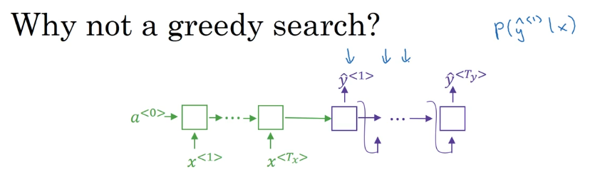

What you would really like is to pick the entire sequence of words, $\hat{y}^{<1>}, ..., \hat{y}^{<T_y>}$, that maximizes the joint probability of that whole thing.

$P(\hat{y}^{<1>}, ..., \hat{y}^{<T_y>}|x)$

It turns out that the greedy approach, where you just pick the best first word, and then, after having picked the best first word, try to pick the best second word, and then, after that, try to pick the best third word, that approach doesn't really work.

To demonstrate that, let's consider the following two translations.

* Jane is visiting Africa in September.
* Jane is going to be visiting Africa in September.

The first one is a better translation, so hopefully, in our machine translation model, it will say that p of y given x is higher for the first sentence. It's just a better, more succinct translation of the French input.

The second one is not a bad translation, it's just more verbose, it has more unnecessary words. 

But, if the algorithm has picked "Jane is" as the first two words, because "going" is a more common English word, probably the chance of "Jane is going," given the French input. This might actually be higher than the chance of "Jane is visiting," given the French sentence:

P(Jane is going|x) > P(Jane is visiting|x)

So, it's quite possible that if you just pick the third word based on whatever maximizes the probability of just the first 3 words, you end up choosing option number two.

But, this ultimately ends up resulting in a less optimal sentence, in a less good sentence as measured by this model for p of y given x.

I know this was may be a slightly hand-wavey argument, but this is an example of a broader phenomenon, where if you want to find the sequence of words, $y^{<1>}, y^{<2>}$, all the way up to the final word that together maximize the probability, it's not always optimal to just pick one word at a time.

And, of course, the total number of combinations of words in the English sentence is exponentially larger. So, if you have just 10,000 words in a dictionary and if you're contemplating translations that are up to ten words long, then there are 10000 to the tenth possible sentences that are ten words long, picking words from the vocabulary size, the dictionary size of 10000 words. So, this is just a huge space of possible sentences, and it's impossible to rate them all, which is why the most common thing to do is use an approximate search algorithm.

And, what an approximate search algorithm does, is it will try, it won't always succeed, but it will to pick the sentence, y, that maximizes that conditional probability.

Even though it's not guaranteed to find the value of y that maximizes this, it usually does a good enough job.

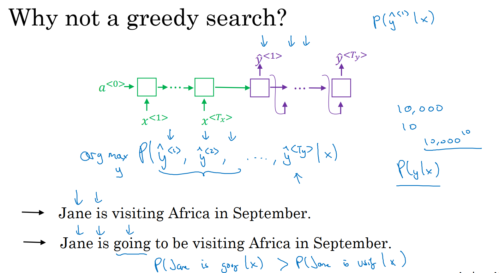

One major difference between this and the earlier language modeling problems is rather than wanting to generate a sentence at random, you may want to try to find the most likely English sentence, most likely English translation. But the set of all English sentences of a certain length is too large to exhaustively enumerate. So, we have to resort to a search algorithm.

## Beam Search
You remember how for machine translation given an input French sentence, you don't want to output a random English translation, you want to output the best and the most likely English translation.

The same is also true for speech recognition where given an input audio clip, you don't want to output a random text transcript of that audio, you want to output the best, maybe the most likely, text transcript.

Beam search is the most widely used algorithm to do this.

### Beam search algorithm
Let's just try Beam Search using our running example of the French sentence, "Jane visite l'Afrique en Septembre".

Hopefully being translated into, "Jane, visits Africa in September".

Fist, Beam search tries to pick the first word of the English translation, that's going to output. So here I've listed, say, 10,000 words into vocabulary. And to simplify the problem a bit, I'm going to ignore capitalization. So I'm just listing all the words in lower case.

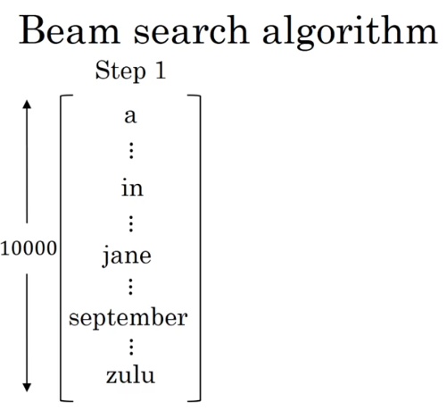

In the first step of Beam Search, I use this network fragment with the encoder in green and decoder in purple, to try to evaluate what is the probability of that first word. So, what's the probability of the first output y, given the input sentence x gives the French input.

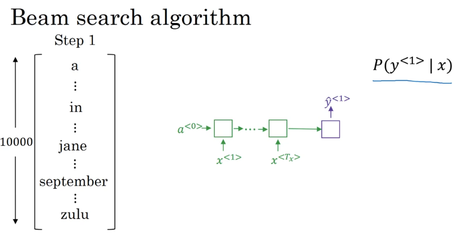

Whereas greedy search will pick only the one most likely words and move on, Beam Search instead can consider multiple alternatives. 

Beam search algorithm has parameter called B, stands for beam width. In this example, set B=3. Beam search will consider not just one possibility but consider three at the time.

In particular, let's say evaluating this probability $P(y^{<1>}|x)$ over different choices the first words, it finds that the choices "in", "Jane" and "September" are the most likely three possibilities for the first words in the English outputs.

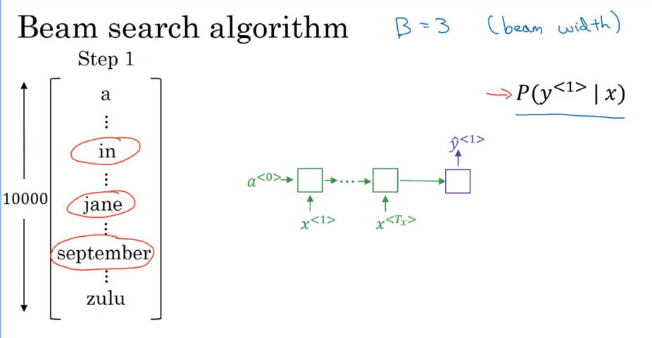

Then Beam search will stowaway in computer memory that it wants to try all of three of these words, and if the beam width parameter were set differently, the beam width parameter was 10, then we keep track of not just three but of the ten, most likely possible choices for the first word.

To be clear in order to perform this first step of Beam search, what you need to do is run the input French sentence through this encoder network and then this first step will then decode the network, this is a softmax output overall 10,000 possibilities.

Then you would take those 10,000 possible outputs and keep in memory which were the top three.

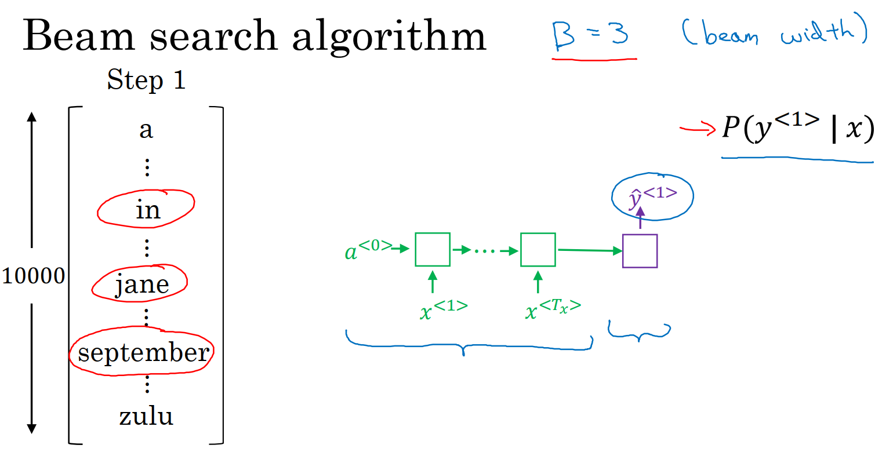

Step 2 of Beam search.

Having picked "in", "Jane" and "September" as the three most likely choice of the first word, what Beam search will do now, is for each of these three choices consider what should be the second word, so after "in" maybe a second word is "a" or maybe as "Aaron", I'm just listing words from the vocabulary, from the dictionary or somewhere down the list will be "September", somewhere down the list there's "visit" and then all the way to "z" and then the last word is "zulu".

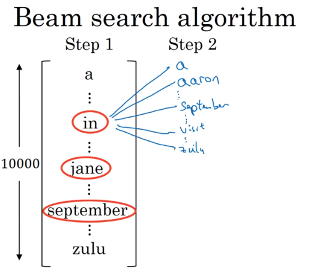

To evaluate the probability of second word, it will use this neural network fragments where is coder in green and for the decoder portion when trying to decide what comes after "in". Remember the decoder first outputs, $\hat{y}^{<1>}$.

I'm going to set to this $\hat{y}^{<1>}$ to the word "in" as it goes back in. So there's the word "in" because it is trying to figure out that the first word was "in", what is the second word, and then this will output I guess $\hat{y}^{<2>}$.

By hard wiring $\hat{y}^{<1>}$ here, really the inputs here to be the first words "in" this network fragment can be used to evaluate whether it's the probability of the second word given the input french sentence and that the first words of the translation has been the word "in" $P(y^{<2>}|x,"in")$.

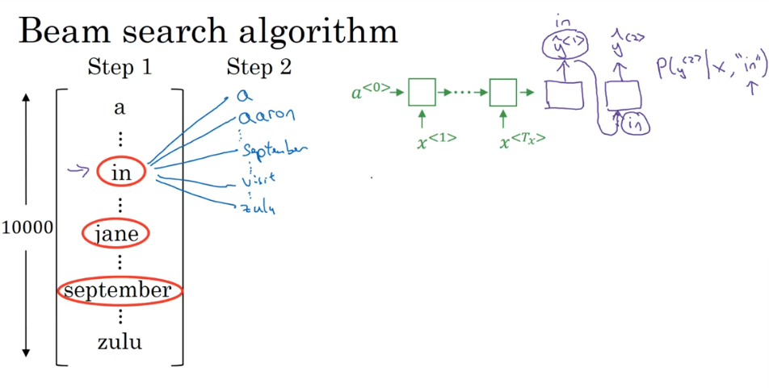

Notice that what we ultimately care about in this second step of beam search to find the pair of the first and second words that is most likely it's not just a second where is most likely that the pair of the first and second whereas the most likely.

By the rules of conditional probability, this can be expressed as P of the first words times P of probability of the second word. 

$P(y^{<1>},y^{<1>}|x)=P(y^{<1>}|x)P(y^{<2>}|x,y^{<1>})$

Which you are getting from this network fragment $P(y^{<2>}|x,"in")$.

If for each of the three words you've chosen "in", "Jane," and "September" you save away this probability $P(y^{<1>}|x)$ then you can multiply them by this second probabilities $P(y^{<2>}|x,y^{<1>})$ to get the probability of the first and second words $P(y^{<1>},y^{<1>}|x)$.

You've seen how if the first word was "in" how you can evaluate the probability of the second word. Now at first it was "Jane" you do the same thing.

The sentence could be "Jane a"," Jane Aaron", and so on down to "Jane is", "Jane visits" and so on.

You will use this in neural network fragments let me draw this in green as well where here you will hardwire, $\hat{y}^{<1>}$ to be Jane. So with the first word $\hat{y}^{<1>}$ is hard wired as Jane than just the network fragments can tell you what's the probability of the second words to me. And given that the first word is "Jane" $P(y^{<2>}|x,"Jane")$.

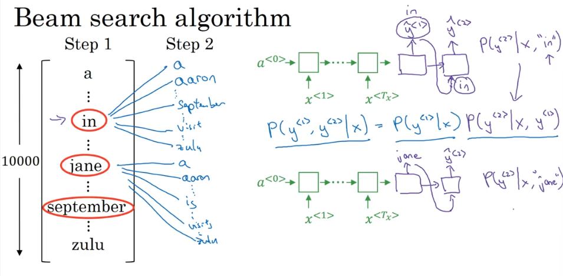

Then same as above you can multiply with $P(y^{<1>})$ to get the probability of $y^{<1>}$ and $y^{<2>}$ for each of these 10,000 different possible choices for the second word.

Finally do the same thing for "September" all the words from a down to "Zulu" and use this network fragment. That just goes in as well to see if the first word was "September". What was the most likely options for the second words.

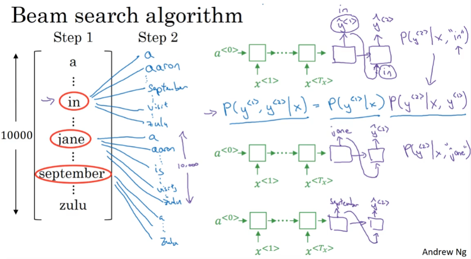

For this second step of beam search because we're continuing to use a beam width of three and because there are 10,000 words in the vocabulary you'd end up considering three times 10000 or 30000 possibilities because there are 10,000 here, 10,000 here, 10,000 here as the beam width times the number of words in the vocabulary and what you do is you evaluate all of these 30000 options according to the probably the first and second words $P(y^{<1>},y^{<1>}|x)$ and then pick the top three. So with a cut down, these 30,000 possibilities down to three again down the beam width rounded again so let's say that 30,000 choices, the most likely were "in September" and say "Jane is", and "Jane visits". Those are the most likely three out of the 30,000 choices then that's what Beam's search would memorize away and take on to the next step beam search.

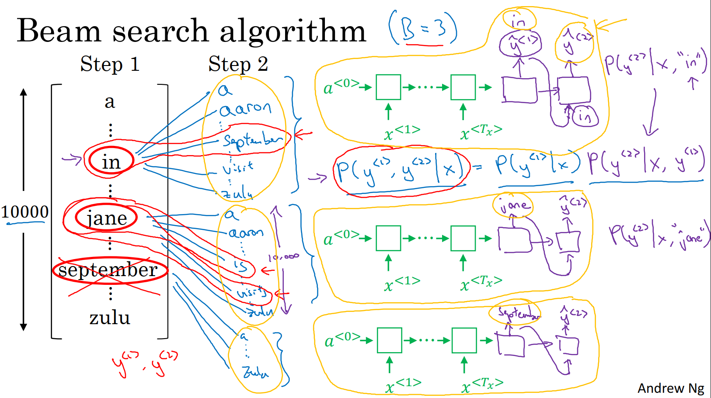

Notice one thing if beam search decides that the most likely choices are the first and second words are "in September", or "Jane is", or "Jane visits". Then what that means is that it is now rejecting September as a candidate for the first words of the output English translation. So we're now down to two possibilities for the first words but we still have a beam width of three keeping track of three choices for pairs of $y^{<1>}$, $y^{<2>}$.

Before going onto the third step of beam search, just want to notice that because of beam width is equal to 3, every step you instantiate three copies of the network to evaluate these partial sentence fragments and the output.

It's because of beam width is equal to three that you have three copies of the network with different choices for the first words, but these three copies of the network can be very efficiently used to evaluate all 30,000 options for the second word.

So just don't instantiate 30,000 copies of the network or three copies of the network to very quickly evaluate all 10,000 possible outputs at that softmax output say for $y^{<2>}$.

### Beam search (B = 3)
So said that the most likely choices for first two words were "in September", "Jane is", and "Jane visits" and for each of these pairs of words which we should have saved the way in computer memory the probability of $y^{<1>}$, $y^{<2>}$ given the input X given the French sentence X $P(y^{<1>},y^{<1>}|x)$.

Similar to before, we now want to consider what is the third word. So "in September a"? "In September Aaron"? All the way down to is "in September Zulu" and to evaluate possible choices for the third word, you use this network fragments where you Hardwire the first word here to be "in" the second word to be "September". And so this network fragment allows you to evaluate what's the probability of the third word given the input French sentence X and given that the first two words are "in September" in English output $P(y^{<3>}|x,"in September")$.

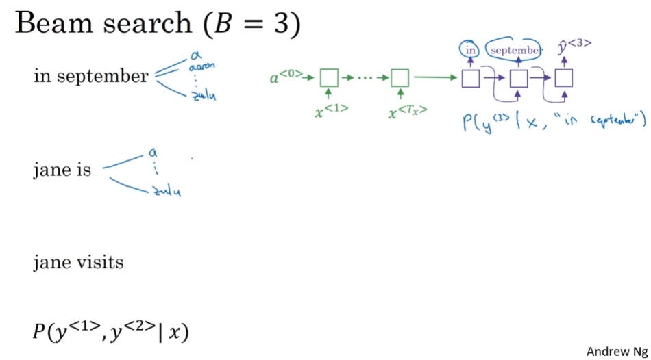

Then you do the same thing for the second fragment. And same thing for "Jane visits" and so beam search will then once again pick the top three possibilities may be that things "in September". "Jane" is a likely outcome or "Jane is visiting "is likely or maybe "Jane visits Africa" is likely for that first three words and then it keeps going and then you go onto the fourth step of beam search hat one more word and on it goes.

And the outcome of this process hopefully will be that adding one word at a time that Beam search will decide that. "Jane visits Africa in September" will be terminated by the end of sentence symbol using that system is quite common. They'll find that this is a likely output English sentence and you'll see more details of this yourself.

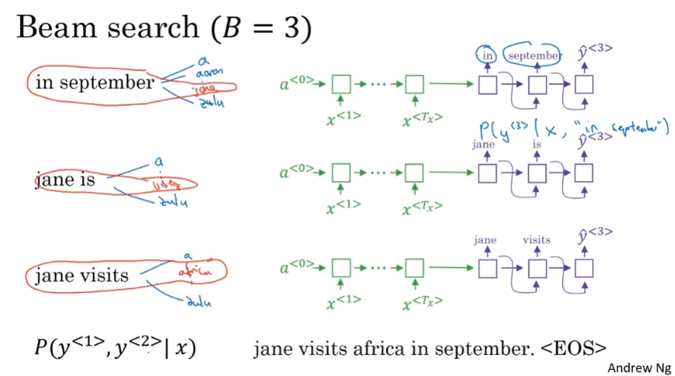

So with a beam of three beam search considers three possibilities at a time.

Notice that if the beam width was set to be equal to one, say cause there's only one, then this essentially becomes the greedy search algorithm which we had discussed in the last video but by considering multiple possibilities say three or ten or some other number at the same time beam search will usually find a much better output sentence than greedy search.

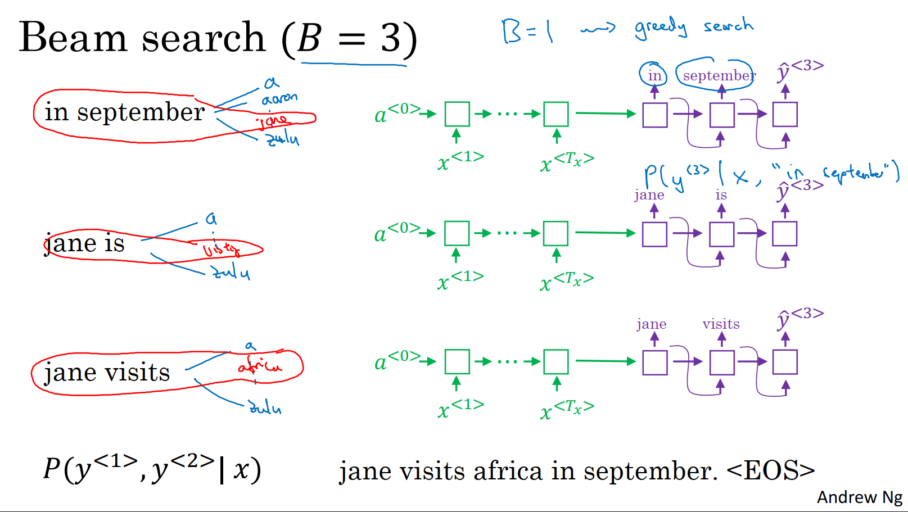

## Refinements to Beam Search
### Length normalization
Length normalization is a small change to the beam search algorithm that can help you get much better results.

We talked about beam search as maximizing this probability

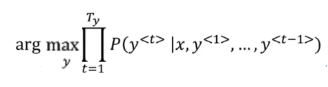

This product here is just expressing the observation that p of y1 up to yt y given x can be expressed as p of y1 given x times p of y2 given x and y1 times up to, I guess, p y ty given x and y1 up to y ty minus 1.

$P({y}^{<1>}, ..., {y}^{<T_y>}|x)=P(y^{<1>}|x)P(y^{<2>}|x,y^{<1>})...P(y^{<T_y>}|x,y^{<1>}...,y^{<T_y-1>})$

But maybe this notation is a bit more scary and more intimidating than it needs to be, but is that probabilities that you've seen previously.

Now, if you're implementing these, these probabilities are all numbers less than 1, in fact, often they're much less than 1 and multiplying a lot of numbers less than one result in a tiny number, which can result in numerical under-floor, meaning that is too small for the floating point of representation in your computer to store accurately.

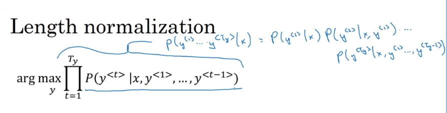

In practice, instead of maximizing this product, we will take logs and if you insert a log there, then a log of a product becomes a sum of a log, and maximizing this sum of log probabilities should give you the same results in terms of selecting the most likely sentence.

By taking logs, you end up with a more numerically stable algorithm that is less prone to numerical rounding errors or really numerical under-floor. 

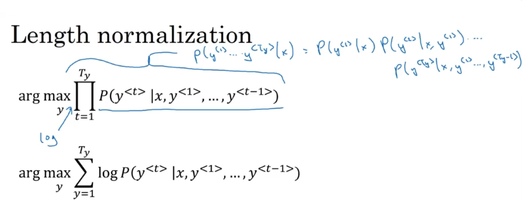

Because the logarithmic function is a strictly monotonically increasing function, we know that maximizing logP(y|x) should give you the same result as maximizing P(y|x) as in the same value of y that maximizes, this should also maximize that.

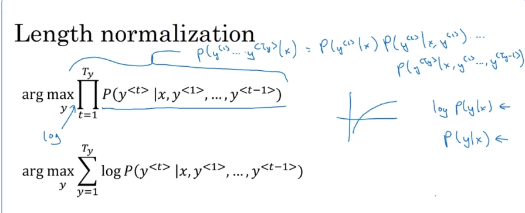

In most implementations, you keep track of the sum of logs of the probabilities rather than the product of probabilities.

Now there's one other change to this objective function that makes the machine translation algorithm work even better. Which is that if you refer to this original objective up here, if you have a very long sentence, the probability of that sentence is going to be low because you're multiplying as many terms here, lots of numbers less than one to estimate the probability of that sentence. If you multiply log of the numbers less than one together, you just tend to end up with a smaller probability.

This objective function has an undesirable effect that it may be unnaturally tend to prefer very short translations to prefer very short outputs because the probability of a short sentence is just by multiplying fewer of these numbers are less than 1 and so the product will just be not quite as small.

By the way, the same thing is true for this, the log of a probability is always less than or equal to 1, you're actually in this range of the log, so the more terms you add together, the more negative this thing becomes.

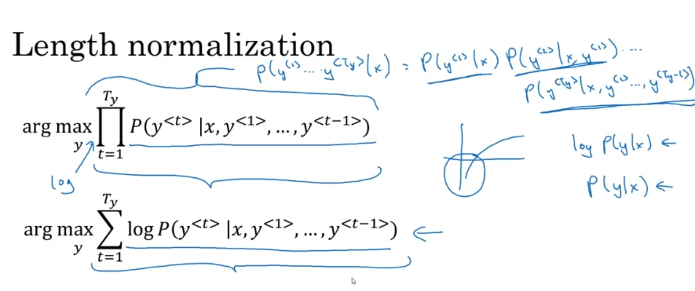

There's one other change the algorithm that makes it work better, which is instead of using this as the objective you're trying to maximize. One thing you could do is normalizes by the number of words in your translation and so this takes the average of the log of the probability of each word and does significantly reduces the penalty for outputting longer translations.

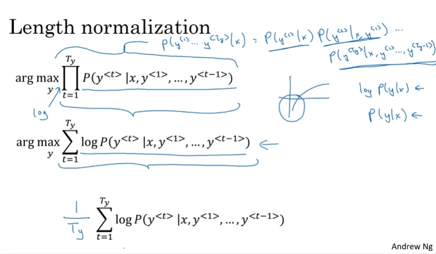

In practice as a heuristic instead of dividing by Ty the number of words in the output sentence, sometimes you use the softer approach we have Ty to power of Alpha where maybe Alpha is equal to 0.7.

If Alpha was equal to 1, then the completely normalized by length, if Alpha was equal to 0, then well, Ty to the 0 will be 1, then you're just not normalizing at all and this is somewhere in between full normalization and no normalization.

Alpha is another parameter hyperparameter, so the algorithm that you can tune to try to get the best results.

Using Alpha this way, does this heuristic or does this a hack? There isn't a great theoretical justification for it, but people found this works well, people found it works well in practice, so many groups won't do this, and you can try out different values of Alpha and see which one gives you the best result.

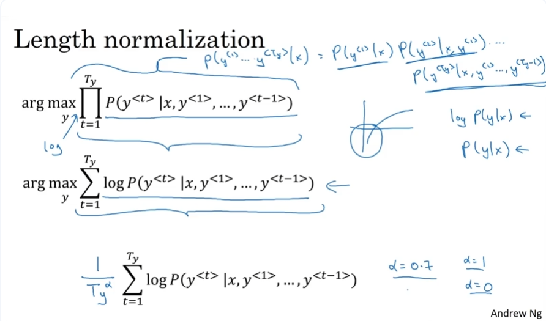

Just to wrap up how you can beam search, as you run beam search you see a lot of sentences with length equal 1, length sentences were equal 2, length sentence that equals 3 and so on, and maybe you run beam search for 30 steps you consider, output sentences up to 30, let's say.

With beam width of three, you would be keeping track of the top three possibilities for each of these possible sentence length 1, 2, 3, 4, and so on up to 30.

Then look at all the output sentences and score them against this score and so you can take your top sentences and just computes this objective function on the sentences that you have seen through the beam search process.

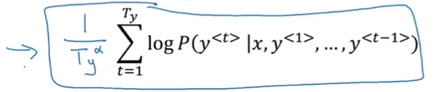

Then finally, of all these sentences that you evaluate this way, you pick the one that achieves, the highest value on this normalize low probability objective, sometimes it's called a normalized log likelihood objective and then that would be the final translation you output.

### Beam search discussion
Finally, a few implementation details, how do you choose the beam width? Here is the pros and cons of setting beam to be very large versus very small. 

If the beam width is very large, then you consider a lot of possibilities and so you tend to get a better result because you're considering a lot of different options, but it will be slower. The memory requirements will also grow and also be computationally slower.

Whereas if you use a very small beam width, then you get a worse result because you are just keeping less possibilities in mind as the algorithm is running, but you get a result faster and the memory requirements will also be lower.

In the previous video, we use in our running example a beam width of 3, so we're keeping three possibilities in mind in practice that is on the small side in production systems, it's not uncommon to see a beam width maybe around 10. I think a beam width of 100 would be considered very large for a production system, depending on the application. But for research systems where people want to squeeze out every last drop of performance in order to publish a paper with the best possible result, it's not uncommon to see people use beam width of 1,000 or 3,000, but this is very application as well as a domain dependent.

I would say try out a variety of values of beam as see what works for your application, but when beam is very large, there is often diminishing returns.

For many applications, I would expect to see a huge gain as you go from beam of 1, which is basically greedy search to three to maybe 10, but the gains as you go from the 1000 to 3000 beam width might not be as big.

For those of you that have taken maybe a lot of computer science courses before, if you're familiar with computer science search algorithms like BFS breadth first search or DFS depth first search, the way to think about beam search is that unlike those other algorithms which you might have learned about in computer science algorithms course, and don't worry about it if you've not heard of these algorithms. But if you've heard of breadth first search or depth first search, unlike those algorithms, which are exact search algorithms beam search runs much faster but is not guaranteed to find the exact maximum for this arg max that you like to find.

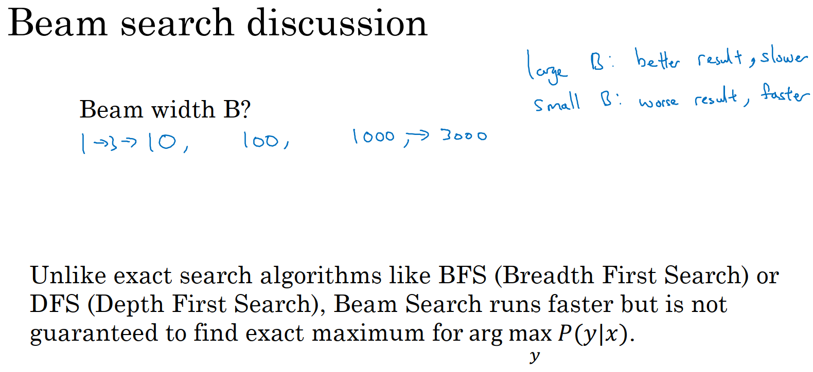

## Error Analysis in Beam Search
In the third course of this sequence of five courses, you saw how error analysis can help you focus your time on doing the most useful work for your project. Now, beam search is an approximate search algorithm, also called a heuristic search algorithm. And so it doesn't always output the most likely sentence. It's only keeping track of B equals 3 or 10 or 100 top possibilities. So what if beam search makes a mistake?

In this video, you'll learn how error analysis interacts with beam search and how you can figure out whether it is the beam search algorithm that's causing problems and worth spending time on. Or whether it might be your RNN model that is causing problems and worth spending time on.

### Example
Example: Jane visite l’Afrique en septembre.

In machine translation dev set, human provided translation is: Jane visits Africa in September.

-> call this $y^*$

Beam search on learned RNN model (learned trasnlation model) gives this translation: Jane visited Africa last September.

-> call this $\hat{y}$ -> this not a good translation

Our model has two main components. 
* There is a neural network model, the sequence to sequence model. We shall just call this your RNN model. It's really an encoder and a decoder.
* And you have your beam search algorithm, which you're running with some beam width b.


Wouldn't it be nice if you could attribute this error, this not very good translation, to one of these two components?

Was it the RNN or really the neural network that is more to blame, or is it the beam search algorithm, that is more to blame?

And what you saw in the third course of the sequence is that it's always tempting to collect more training data that never hurts.

So in similar way, it's always tempting to increase the beam width that never hurts or pretty much never hurts.

But just as getting more training data by itself might not get you to the level of performance you want. In the same way, increasing the beam width by itself might not get you to where you want to go.

How do you decide whether or not improving the search algorithm is a good use of your time?

So just how you can break the problem down and figure out what's actually a good use of your time.

The RNN, the neural network, what was called RNN really means the encoder and the decoder. It computes P(y|x). 

For example, for a sentence, "Jane visits Africa in September", you plug in "Jane visits Africa". Again, I'm ignoring upper versus lowercase now, right, and so on. And this computes P(y|x).

It turns out that the most useful thing for you to do at this point is to compute using this model to compute $P(y^*|x)$ as well as to compute $P(\hat{y}|x)$ using your RNN model.

Then to see which of these two is bigger. So it's possible that the left side is bigger than the right hand side. It's also possible that P(y^*) is less than $P(\hat{y})$ actually, or less than or equal to.

Depending on which of these two cases hold true, you'd be able to more clearly ascribe this particular error, this particular bad translation to one of the RNN or the beam search algorithm being had greater fault.

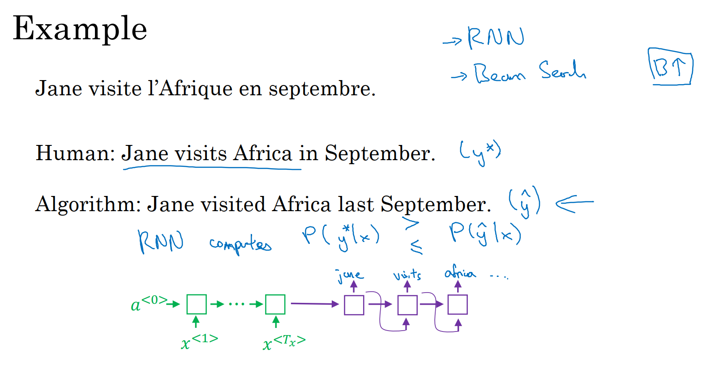

### Error analysis on beam search
Remember, we're going to compute $P(y^*|x)$ and $P(\hat{y}|x)$ and see which of these two is bigger. So there are going to be two cases.

In case 1, $P(y^*|x)$ as output by the RNN model is greater than $P(\hat{y}|x)$.

The beam search algorithm chose $\hat{y}$. The way you got $\hat{y}$ was you had an RNN that was computing P(y|x). And beam search's job was to try to find a value of y that gives that arg max.

But in this case, y* actually attains a higher value for P(y|x) than the $\hat{y}$. So what this allows you to conclude is beam search is failing to actually give you the value of y that maximizes P(y|x) because the one job that beam search had was to find the value of y that makes this really big. But it chose $\hat{y}$, the y* actually gets a much bigger value. So in this case, you could conclude that beam search is at fault.

In case 2, $P(y^*|x)$ is less than or equal to $P(\hat{y}|x)$.

Either case 1 or case 2 has to hold true.

What do you conclude under case 2? In our example, y* is a better translation than y-hat. But according to the RNN, P(y*) is less than P(y-hat), so saying that y* is a less likely output than y-hat. So in this case, it seems that the RNN model is at fault and it might be worth spending more time working on the RNN.

There's some subtleties pertaining to length normalizations that I'm glossing over. And if you are using some sort of length normalization, instead of evaluating these probabilities, you should be evaluating the optimization objective that takes into account length normalization.

Ignoring that complication for now, in this case, what this tells you is that even though y* is a better translation, the RNN ascribed y* in lower probability than the inferior translation. So in this case, I will say the RNN model is at fault.

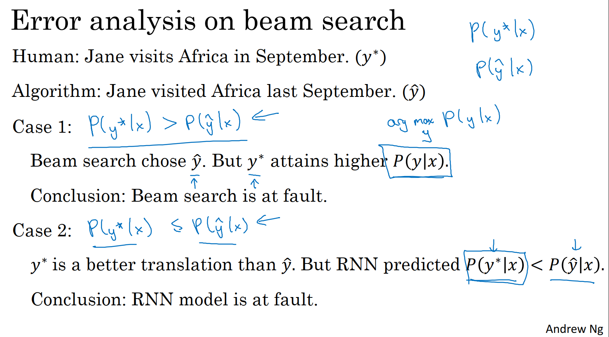

### Error analysis process
You go through the development set and find the mistakes that the algorithm made in the development set.

And so in this example, let's say that P(y*|x) was 2 x 10 to the -10, whereas, P(y-hat given x) was 1 x 10 to the -10.

Using the logic from the previous slide, in this case, we see that beam search actually chose y-hat, which has a lower probability than y*. So I will say beam search is at fault. So I'll abbreviate that B.

Then you go through a second mistake or second bad output by the algorithm, look at these probabilities. And maybe for the second example, you think the model is at fault. I'm going to abbreviate the RNN model with R. And you go through more examples. And sometimes the beam search is at fault, sometimes the model is at fault, and so on.

Through this process, you can then carry out error analysis to figure out what fraction of errors are due to beam search versus the RNN model.

And with an error analysis process like this, for every example in your dev sets, where the algorithm gives a much worse output than the human translation, you can try to ascribe the error to either the search algorithm or to the objective function, or to the RNN model that generates the objective function that beam search is supposed to be maximizing.

Through this, you can try to figure out which of these two components is responsible for more errors. And only if you find that beam search is responsible for a lot of errors, then maybe is we're working hard to increase the beam width. 

Whereas in contrast, if you find that the RNN model is at fault, then you could do a deeper layer of analysis to try to figure out if you want to add regularization, or get more training data, or try a different network architecture, or something else. And so a lot of the techniques that you saw in the third course in the sequence will be applicable there.

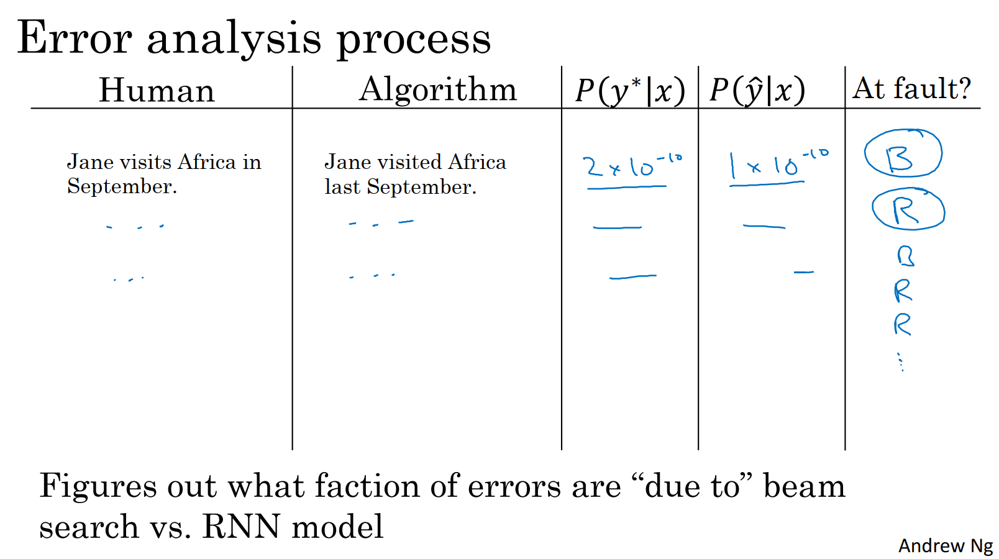

I found this particular error analysis process very useful whenever you have an approximate optimization algorithm, such as beam search that is working to optimize some sort of objective, some sort of cost function that is output by a learning algorithm, such as a sequence-to-sequence model or a sequence-to-sequence RNN that we've been discussing in these lectures

### Summary
When a translation is bad, is it because the model is bad, or because beam search picked the wrong sentence?

In other words:
* Should you improve beam search?
* Or should you improve the neural network (RNN / Transformer)?

This is called error analysis.

In machine translation, the model generates a sentence word by word.

At each step:
* There are many possible next words
* You cannot try all combinations (too expensive)

So beam search:
* Keeps only the top B most likely partial sentences
* B = beam width (e.g., 3, 5, 10)

-> Beam search is not guaranteed to find the best sentence — it’s a heuristic.

For one input sentence (say English → French):

(1) Human translation

Andrew calls this: y*

This is a correct, high-quality translation written by a human.

(2) Model output using beam search

Andrew calls this: $\hat{y}$

This is what your system actually produced.

Your translation model assigns a probability to any full sentence: P(y∣x)

So you can compute:
* P(y*|x) → probability of the human translation
* $P(\hat{y}|x)$ → probability of the beam search output

We are using the same model to score both sentences.

Case 1: Beam Search Is at Fault

P(y*|x) > $P(\hat{y}|x)$

The model itself thinks the human translation is better, but beam search didn’t find it.

What went wrong?
* Beam width is too small
* Beam search pruned away good candidates too early

-> Beam search is the problem, not the model.

What to do:
* Increase beam width
* Improve beam search strategy

Case 2: The Model Is at Fault

P(y*|x) <= $P(\hat{y}|x)$

The model thinks the bad translation is better than the human one.
* The model does not understand the language well enough
* It assigns higher probability to incorrect sentences

The neural network is the problem

What to do:
* Train on more data
* Improve the architecture
* Better loss function
* Regularization, etc.

Even if beam search is imperfect:

Most errors usually come from the model, not beam search

So:
* Increasing beam width from 10 → 100 often gives little gain
* Improving the model usually helps more

The RNN is the model that gives probabilities.

Beam search is just a search algorithm that uses those probabilities to build a sentence.

The RNN (or Transformer) does one simple job: Given a partial sentence so far, it outputs probabilities for the next word.

Example:

Input sentence:

“I love”

The RNN outputs something like:

|Next word|	Probability|
|-|-|
|machine|	0.40|
|deep|	0.30|
|pizza|	0.10|
|cats|	0.05|
|...	|...|

It only answers:

“If this is the sentence so far, what is the probability of each next word?”

Beam search is a decision-making algorithm that sits outside the RNN.

Its job:

Use the RNN’s probabilities to choose a good full sentence.

Because:
* There are too many possible sentences
* You can’t try them all

Beam search:
* keeps the top B partial sentences
* expands them step by step
* throws away weak candidates

Step 1: Start with `<START>`

Beam search asks the RNN:

“What words can come first?”

RNN gives probabilities.

Step 2: Expand candidates

Beam search keeps top B options:

“I”

“We”

“They”

Step 3: Ask RNN again

For each partial sentence, beam search asks:

“What comes next?”

RNN gives probabilities again.

Step 4: Repeat until `<END>`

Beam search keeps expanding and pruning until sentences finish.

Step 5: Pick best sentence

Beam search picks the sentence with the highest total probability.

## Bleu Score (Optional)
One of the challenges of machine translation is that, given a French sentence, there could be multiple English translations that are equally good translations of that French sentence. So how do you evaluate a machine translation system if there are multiple equally good answers, unlike, say, image recognition where there's one right answer you just measure accuracy. If there are multiple great answers, how do you measure accuracy?

The way this is done conventionally is through something called the BLEU score. So, in this optional video, I want to share with you, I want to give you a sense of how the BLEU score works.

### Evaluating machine translation
French: Le chat est sur le tapis.

Human translation reference 1: The cat is on the mat.

Human translation reference 2: There is a cat on the mat.

What the BLEU score does is given a machine generated translation, it allows you to automatically compute a score that measures how good is that machine translation.

The intuition is so long as the machine generated translation is pretty close to any of the references provided by humans, then it will get a high BLEU score. BLEU, by the way, stands for bilingual evaluation understudy.

In the theater world, an understudy is someone that learns the role of a more senior actor so they can take over the role of the more senior actor, if necessary. And motivation for BLEU is that, whereas you could ask human evaluators to evaluate the machine translation system, the BLEU score is an understudy, could be a substitute for having humans evaluate every output of a machine translation system.

The intuition behind the BLEU score is we're going to look at the machine generated output and see if the types of words it generates appear in at least one of the human generated references. And so these human generated references would be provided as part of the dev set or as part of the test set. 

Now, let's look at a somewhat extreme example. Let's say that the machine translation system abbreviating machine translation is MT.

MT output: the the the the the the the.

This is clearly a pretty terrible translation.

One way to measure how good the machine translation output is to look at each the words in the output and see if it appears in the references. And so, this would be called a precision of the machine translation output. And in this case, there are seven words in the machine translation output. And every one of these 7 words appears in either Reference 1 or Reference 2.

So the word "the" appears in both references. So each of these words looks like a pretty good word to include. So this will have a precision of 7 over 7. It looks like it was a great precision. This is why the basic precision measure of what fraction of the words in the MT output also appear in the references. This is not a particularly useful measure, because it seems to imply that this MT output has very high precision.

Instead, what we're going to use is a modified precision measure in which we will give each word credit only up to the maximum number of times it appears in the reference sentences.

In Reference 1, the word, "the", appears twice. In Reference 2, the word, "the", appears just once. So 2 is bigger than 1, and so we're going to say that the word, "the", gets credit up to twice. So, with a modified precision, we will say that, it gets a score of 2 out of 7, because out of 7 words, we'll give it a 2 credits for appearing. So here, the denominator is the count of the number of times the word, "the", appears of 7 words in total. And the numerator is the count of the number of times the word, the, appears. We clip this count, we take a max, or we clip this count, at 2. So this gives us the modified precision measure.

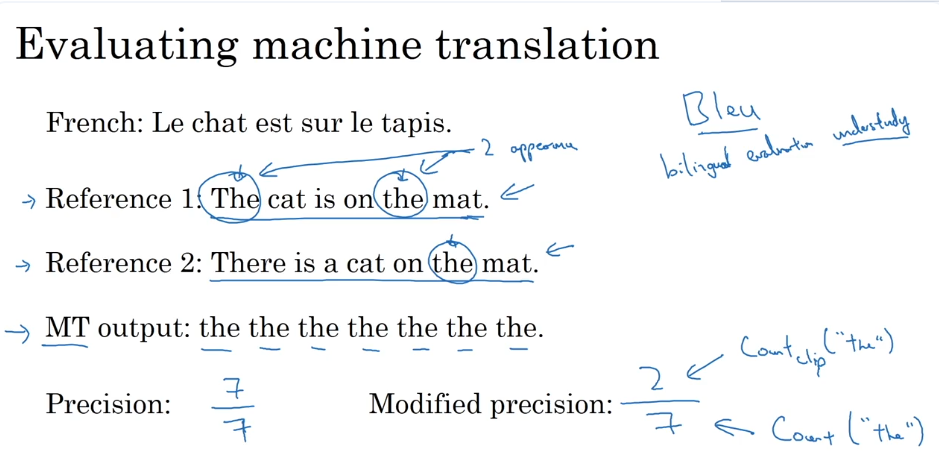

### Bleu score on unigrams
So far, we've been looking at words in isolation. In the BLEU score, you don't want to just look at isolated words. You maybe want to look at pairs of words as well.

Let's define a portion of the BLEU score on bigrams. And bigrams just means pairs of words appearing next to each other.

Let's see how we could use bigrams to define the BLEU score. And this will just be a portion of the final BLEU score. And we'll take unigrams, or single words, as well as bigrams, which means pairs of words into account as well as maybe even longer sequences of words, such as trigrams, which means three words pairing together.

Let's continue our example from before. We have to same Reference 1 and Reference 2. But now let's say the machine translation or the MT System has a slightly better output. The cat the cat on the mat. Still not a great translation, but maybe better than the last one.

The possible bigrams are, well there's the cat, but ignore case. And then there's cat the, that's another bigram. And then there's the cat again, but I've already had that, so let's skip that. And then cat on is the next one. And then on the, and the mat. So these are the bigrams in the machine translation output. 

Let's count up, How many times each of these bigrams appear. The cat appears twice, cat the appears once, and the others all appear just once.

Then finally, let's define the clipped count, so count, and then subscript clip.

To define that, let's take this column of numbers, but give our algorithm credit only up to the maximum number of times that that bigram appears in either Reference 1 or Reference 2.

The cat appears a maximum of once in either of the references. So I'm going to clip that count to 1. Cat the, well, it doesn't appear in Reference 1 or Reference 2, so I clip that to 0. Cat on, yep, that appears once. We give it credit for once. On the appears once, give that credit for once, and the mat appears once. So these are the clipped counts. We're taking all the counts and clipping them, really reducing them to be no more than the number of times that bigram appears in at least one of the references.

Then, finally, our modified bigram precision will be the sum of the count clipped. So that's 1, 2, 3, 4 divided by the total number of bigrams. That's 2, 3, 4, 5, 6, so 4 out of 6 or two-thirds is the modified precision on bigrams.

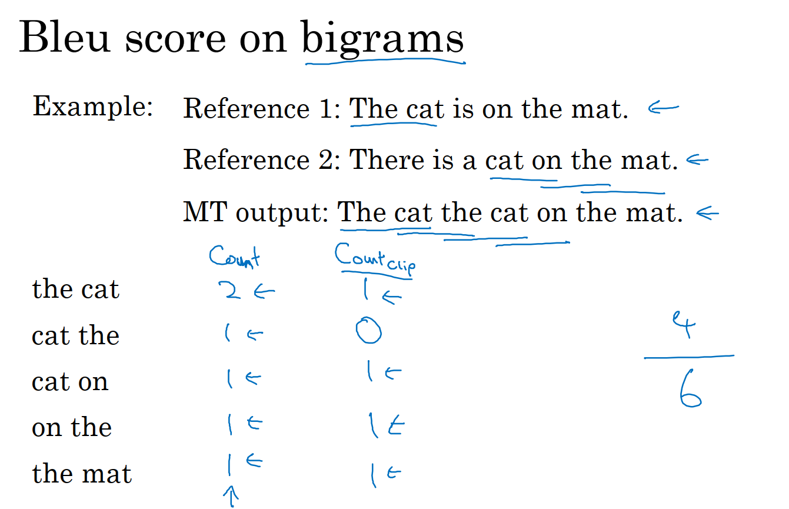

### Bleu score on unigrams
Let's just formalize this a little bit further. With what we had developed on unigrams, we defined this modified precision computed on unigrams as P subscript 1. The P stands for precision and the subscript 1 here means that we're referring to unigrams. But that is defined as sum over the unigrams. So that just means sum over the words that appear in the machine translation output. So this is called y hat of count clip of that unigram. Divided by sum of our unigrams in the machine translation output of count, number of counts of that unigram.

$P_1 = {{\Sigma_{unigrams \in \hat{y}}Count_{clip}(unigram)} \over \Sigma_{unigrams \in \hat{y}} Count(unigram)}$

And so this is what we had gotten I guess is 2 out of 7, 2 slides back.

The 1 here refers to unigram, meaning we're looking at single words in isolation.

You can also define Pn as the n-gram version, instead of unigram, for n-gram. So this would be sum over the n-grams in the machine translation output of count clip of that n-gram divided by sum over n-grams of the count of that n-gram.


$P_n = {{\Sigma_{n-grams \in \hat{y}}Count_{clip}(n-gram)} \over \Sigma_{n-grams \in \hat{y}} Count(n-gram)}$

These precisions, or these modified precision scores, measured on unigrams or on bigrams, which we did on a previous slide, or on trigrams, which are triples of words, or even higher values of n for other n-grams. This allows you to measure the degree to which the machine translation output is similar or maybe overlaps with the references. 

One thing that you could probably convince yourself of is if the MT output is exactly the same as either Reference 1 or Reference 2, then all of these values P1, and P2 and so on, they'll all be equal to 1.0.

To get a modified precision of 1.0, you just have to be exactly equal to one of the references. And sometimes it's possible to achieve this even if you aren't exactly the same as any of the references. But you kind of combine them in a way that hopefully still results in a good translation.

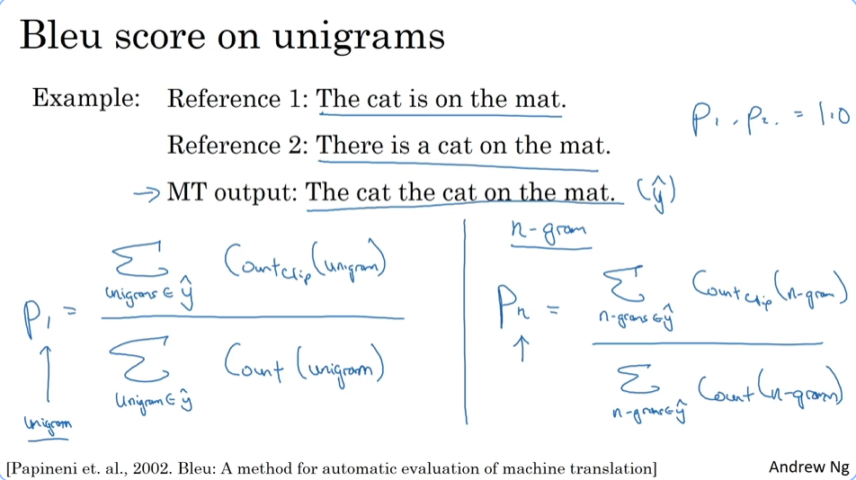

### Bleu details
Finally, let's put this together to form the final BLEU score. So P subscript n is the BLEU score computed on n-grams only. Also the modified precision computed on n-grams only.

By convention to compute one number, you compute P1, P2, P3 and P4, and combine them together using the following formula.

It's going to be the average, so sum from n = 1 to 4 of Pn and divide that by 4. So basically taking the average. By convention the BLEU score is defined as, e to the this, then exponentiations, and linear operate, exponentiation is strictly monotonically increasing operation and then we actually adjust this with one more factor called the, BP penalty.

BP, Stands for brevity penalty. The details maybe aren't super important. But to just give you a sense, it turns out that if you output very short translations, it's easier to get high precision. 

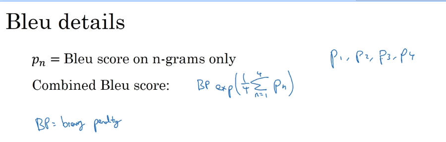

Because probably most of the words you output appear in the references. But we don't want translations that are very short. So the BP, or the brevity penalty, is an adjustment factor that penalizes translation systems that output translations that are too short.

The formula for the brevity penalty is the following. It's equal to 1 if your machine translation system actually outputs things that are longer than the human generated reference outputs. And otherwise is some formula like that that overall penalizes shorter translations.

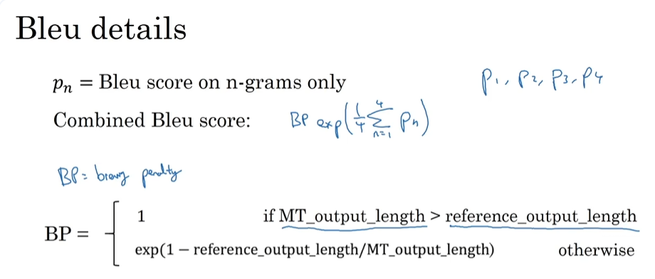

Once again, earlier in this set of courses, you saw the importance of having a single real number evaluation metric. Because it allows you to try out two ideas, see which one achieves a higher score, and then try to stick with the one that achieved the higher score. So the reason the BLEU score was revolutionary for machine translation was because this gave a pretty good, by no means perfect, but pretty good single real number evaluation metric. And so that accelerated the progress of the entire field of machine translation. I hope this video gave you a sense of how the BLEU score works. In practice, few people would implement a BLEU score from scratch. There are open source implementations that you can download and just use to evaluate your own system.

But today, BLEU score is used to evaluate many systems that generate text, such as machine translation systems, as well as the example I showed briefly earlier of image captioning systems where you would have a system, have a neural network generated image caption. And then use the BLEU score to see how much that overlaps with maybe a reference caption or multiple reference captions that were generated by people. So the BLEU score is a useful single real number evaluation metric to use whenever you want your algorithm to generate a piece of text. And you want to see whether it has similar meaning as a reference piece of text generated by humans. This is not used for speech recognition, because in speech recognition, there's usually one ground truth. And you just use other measures to see if you got the speech transcription on pretty much, exactly word for word correct. But for things like image captioning, and multiple captions for a picture, it could be about equally good or for machine translations. 

### Summary
BLEU (Bilingual Evaluation Understudy) is a metric used to:

Measure how good a machine-generated translation is compared to human translations.

Key idea:
* In translation, there is no single correct answer
* Many different translations can be correct

So BLEU checks:

“Does the machine translation look similar to how humans would translate this sentence?”

In image classification:
* One correct label → easy to evaluate

In machine translation:
* Many correct sentences

Example:

English:

“I like machine learning”

Valid French translations:
* “J’aime l’apprentissage automatique”
* “J’aime le machine learning”
* “J’apprécie l’apprentissage automatique”

BLEU allows multiple reference translations.

Simple Precision (But It Fails)

Machine translation:

“the the the the the”

Reference:

“the cat is on the mat”

Word precision:

“the” appears in reference → precision looks high 😬

But translation is clearly terrible.

So simple precision is not enough.

Modified Precision (Key Improvement)

BLEU fixes this using modified precision.

Rule:

A word can only be counted as many times as it appears in the reference.

Example:

Reference:

“the cat is on the mat”

“the” appears 2 times.

Machine output:

“the the the the the”

Modified precision:
* Count “the” only twice
* Extra “the” words get zero credit

This prevents cheating.

Unigrams (single words) don’t check word order.

Example:

Reference:

“the cat sat”

Bad translation:

“cat the sat”

Unigram precision = high

But sentence is wrong.

So BLEU uses:
* 1-grams (unigrams) → correct words
* 2-grams (bigrams) → local word order
* 3-grams (trigrams) → phrase structure
* 4-grams → fluency

This captures more structure.

Reference:

“the cat is on the mat”

Machine output:

“the cat on mat”

* Unigrams: mostly match ✅
* Bigrams:
    * “the cat” ✅
    * “cat on” ❌
    * “on mat” ❌

So higher-order n-grams get lower precision → reflects poorer quality.

BLEU combines them by taking the geometric mean:

$BLEU=BP x exp({1 \over 4}\Sigma_{n=1}^4logp_n)$

Where:
* Pn = modified precision for n-grams
* BP = brevity penalty

Why geometric mean?

If any 
* Pn=0, BLEU becomes 0
* Forces model to do well at all levels

Without BP, the model could output:

“the cat”

and get high precision.

So BLEU adds a penalty if translation is too short.

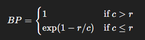

Where:
* c=candiate length
* r=reference length

Shorter translations → lower BLEU.
* BLEU = 0 → terrible
* BLEU ≈ 0.2 → understandable but poor
* BLEU ≈ 0.4 → good translation
* BLEU ≥ 0.6 → very strong (rare)

⚠️ BLEU is not perfect, but very useful for:
* Comparing systems
* Tracking improvement over time

Limitation
* BLEU is not great for individual sentences
* Works best when averaged over many sentences
* Doesn’t measure meaning directly
* Humans are still better judges

## Attention Model Intuition
For most of this week, you've been using a Encoder-Decoder architecture for machine translation. Where one RNN reads in a sentence and then different one outputs a sentence. There's a modification to this called the Attention Model, that makes all this work much better. The attention algorithm, the attention idea has been one of the most influential ideas in deep learning.

### The problem of long sequences
Given a very long French sentence like this. What we are asking this green encoder neural network to do is, to read in the whole sentence and then memorize the whole sentences and store it in the activations conveyed here.

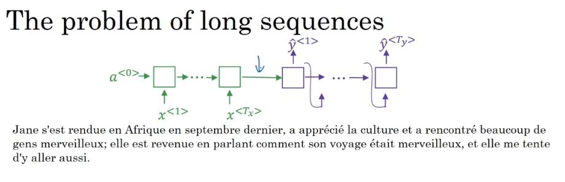

Then for the purple network, the decoder network till then generate the English translation.

Jane went to Africa last September and enjoyed the culture and met many wonderful people; she came back raving about how wonderful her trip was, and is tempting me to go too.

Now, the way a human translator would translate this sentence is not to first read the whole French sentence and then memorize the whole thing and then regurgitate an English sentence from scratch.

Instead, what the human translator would do is read the first part of it, maybe generate part of the translation. Look at the second part, generate a few more words, look at a few more words, generate a few more words and so on.

You kind of work part by part through the sentence, because it's just really difficult to memorize the whole long sentence like that.

What you see for the Encoder-Decoder architecture above is that, it works quite well for short sentences, so we might achieve a relatively high Bleu score, but for very long sentences, maybe longer than 30 or 40 words, the performance comes down. The Bleu score might look like this as the sentence that varies and short sentences are just hard to translate, hard to get all the words, right. Long sentences, it doesn't do well on because it's just difficult to get in your network to memorize a super long sentence.

In this and the next video, you'll see the Attention Model which translates maybe a bit more like humans might, looking at part of the sentence at a time and with an Attention Model, machine translation systems performance can look like this (green line), because by working one part of the sentence at a time, you don't see this huge dip which is really measuring the ability of a neural network to memorize a long sentence which maybe isn't what we most badly need a neural network to do.

In this video, I want to just give you some intuition about how attention works and then we'll flesh out the details in the next video.

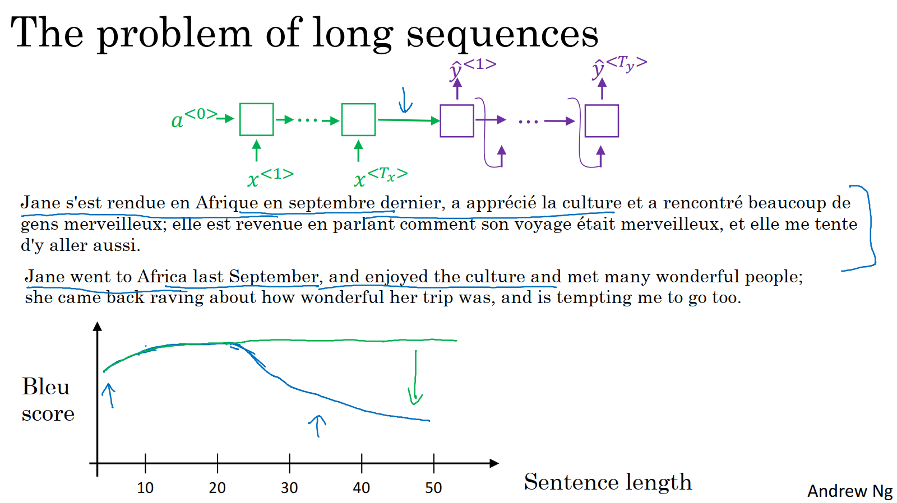

### Attention model intuition
Let's illustrate this with a short sentence, even though these ideas were maybe developed more for long sentences, but it'll be easier to illustrate these ideas with a simpler example.

We have our usual sentence, Jane visite l'Afrique en Septembre. 

Let's say that we use a RNN, and in this case, I'm going to use a bidirectional RNN, in order to compute some set of features for each of the input words and you have to understand it, bidirectional RNN with outputs $y_{<1>}$ to $y_{<5>}$

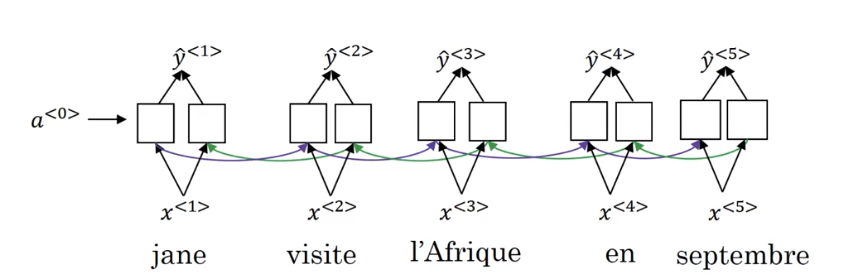

But we're not doing a word for word translation, let me get rid of the Y's on top.

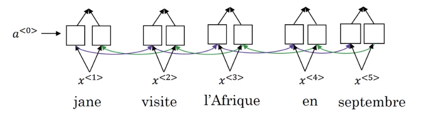

But using a bidirectional RNN, what we've done is for each other words, really for each of the 5 positions into sentence, you can compute a very rich set of features about the words in the sentence and maybe surrounding words in every position.

Let's go ahead and generate the English translation. We're going to use another RNN to generate the English translations. Here's my RNN note as usual and instead of using A to denote the activation, in order to avoid confusion with the activations down here, I'm just going to use a different notation, I'm going to use S to denote the hidden state in this RNN up here, so instead of writing $a^{<1>}$ I'm going to right $s^{<1>}$ and so we hope in this model that the first word it generates will be Jane, to generate Jane visits Africa in September.

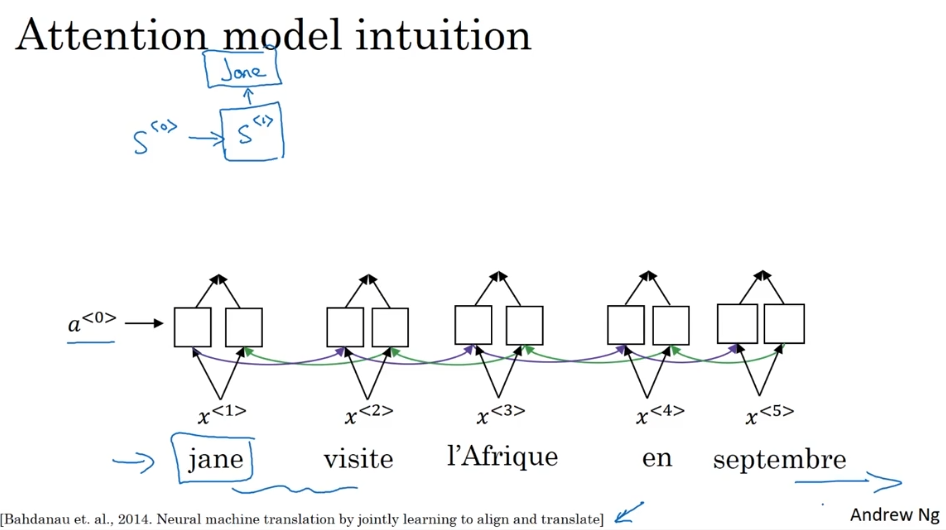

The question is, when you're trying to generate this first word, this output, what part of the input French sentence should you be looking at?

Seems like you should be looking primarily at this first word, maybe a few other words close by, but you don't need to be looking way at the end of the sentence. What the Attention Model would be computing is a set of attention weights and we're going to use $\alpha^{<1,1>}$ to denote when you're generating the first words, how much should you be paying attention to this first piece of information here.

Then we'll also come up with a second that's called Attention Weight, $\alpha^{<1,2>}$ which tells us what we're trying to compute the first work of Jane, how much attention we're paying to this second word from the inputs and so on and the $\alpha^{<1,3>}$ and so on, and together this will tell us what is exactly the context from denoter C that we should be paying attention to, and that is input to this RNN unit to then try to generate the first words.

That's one step of the RNN, we will flesh out all these details in the next video.

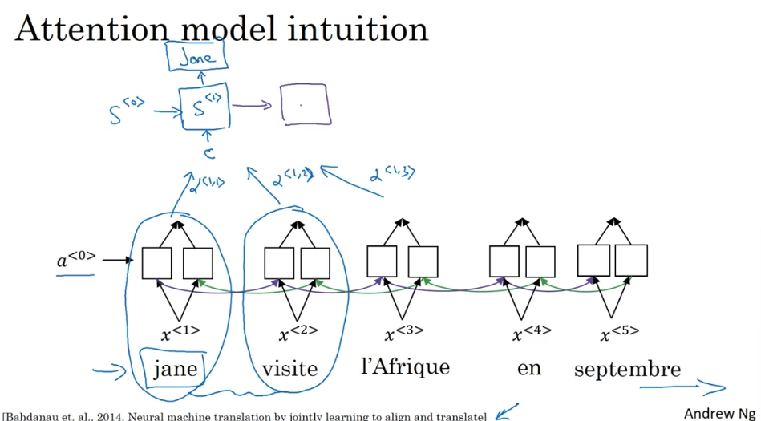

For the second step of this RNN, we're going to have a new hidden state $s^{<2>}$ and we're going to have a new set of the attention weights. We're going to have $\alpha^{<2,1>}$, one to tell us when we generate in the second word. I guess this will be visits maybe that being the ground trip label. How much should we paying attention to the first word in the french input and also, $\alpha^{<2,2>}$ and so on. How much should we paying attention the word visite, how much should we pay attention to l'Afrique and so on. 

Of course, the first word we generate in Jane is also an input to this, and then we have some context that we're paying attention to and the second step, there's also an input and that together will generate the second word and that leads us to the third step, $s^{<3>}$, where this is an input and we have some new context C that depends on the various $\alpha^{<3,t>}$ for the different time sets, that tells us how much should we be paying attention to the different words from the input French sentence and so on.

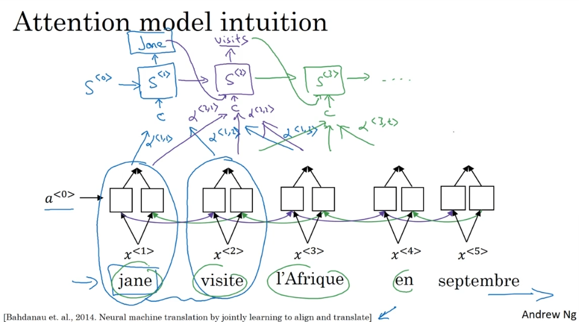

Some things I haven't specified yet, but that will go further into detail in the next video of this, how exactly this context defines and the goal of the context is for the third word is really should capture that maybe we should be looking around this part of the sentence (visite l'Afrique en). The formula you use to do that will defer to the next video as well as how do you compute these attention weights. And you see in the next video that $\alpha^{<3,t>}$, which is, when you're trying to generate the third word, I guess this would be the Africa, just getting the right output. The amounts that this RNN step should be paying attention to the French word that time T, that depends on the activations of the bidirectional RNN at time T, I guess it depends on the fourth activations and the, backward activations at time T and it will depend on the state from the previous steps, it will depend on $s^{<2>}$, and these things together will influence, how much you pay attention to a specific word in the input French sentence.

But we'll flesh out all these details in the next video. But the key intuition to take away is that this way the RNN marches forward generating one word at a time, until eventually it generates maybe the EOS and at every step, there are these attention weighs, $\alpha^{<t,t'>}$ that tells it, when you're trying to generate the T, English word, how much should you be paying attention to the T prime French words. And this allows it on every time step to look only maybe within a local window of the French sentence to pay attention to, when generating a specific English word.

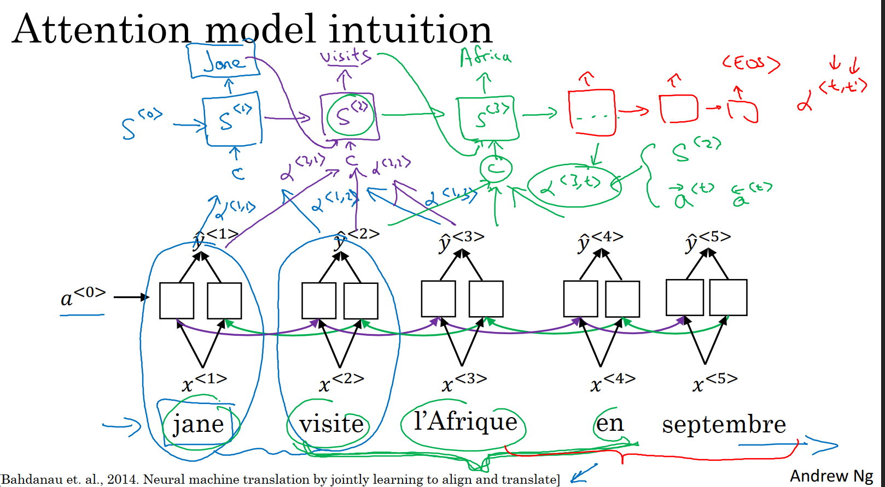

## Attention model
In the last video, you saw how the attention model allows a neural network to pay attention to only part of an input sentence while it's generating a translation, much like a human translator might. Let's now formalize that intuition into the exact details of how you would implement an attention model.

### Attention model
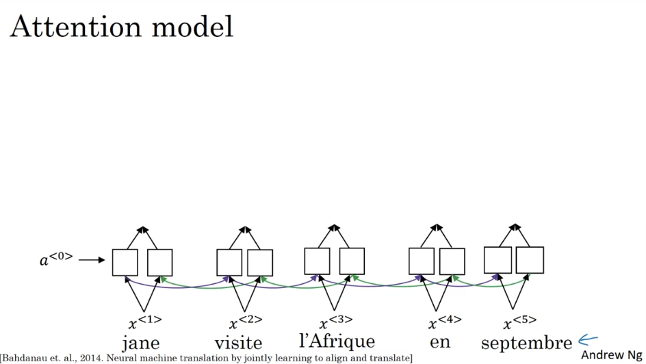

Same as in the previous video, let's assume you have an input sentence and you use a bidirectional RNN, or bidirectional GRU, or bidirectional LSTM to compute features on every word.

In practice, GRUs and LSTMs are often used for this, with maybe LSTMs be more common.

For the forward occurrence, you have a forward occurrence first time step. Activation backward occurrence, first time step. Activation forward occurrence, second time step. Activation backward and so on. For all of them in just a forward fifth time step a backwards fifth time step.

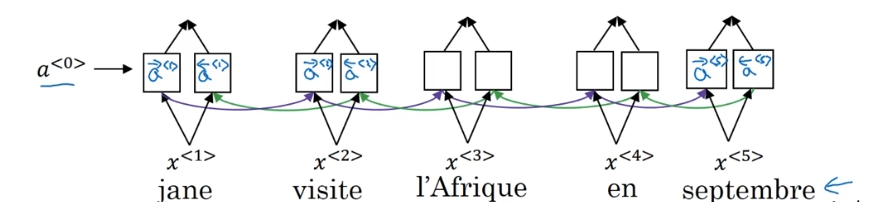

We had a zero here technically we can also have I guess a backwards sixth as a vector of all zero, actually that's a factor of all zeroes.

Then to simplify the notation going forwards at every time step, even though you have the features computed from the forward occurrence and from the backward occurrence in the bidirectional RNN. I'm just going to use $a^{<t>}$ to represent both of these concatenated together. So $a^{<t>}$ is going to be a feature vector for time step t. Although to be consistent with notation, we're using second, I'm going to call this t_prime. Actually, I'm going to use t_prime to index into the words in the French sentence.

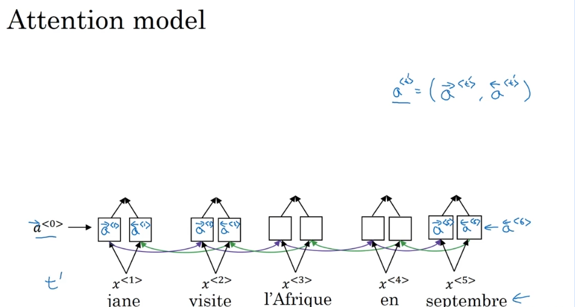

Next, we have our forward only, so it's a single direction RNN with state s to generate the translation.

The first time step, it should generate $y^{<1>}$ and just will have as input some context C. And if you want to index it with time I guess you could write a $c^{<1>}$ but sometimes I just right C without the superscript one.

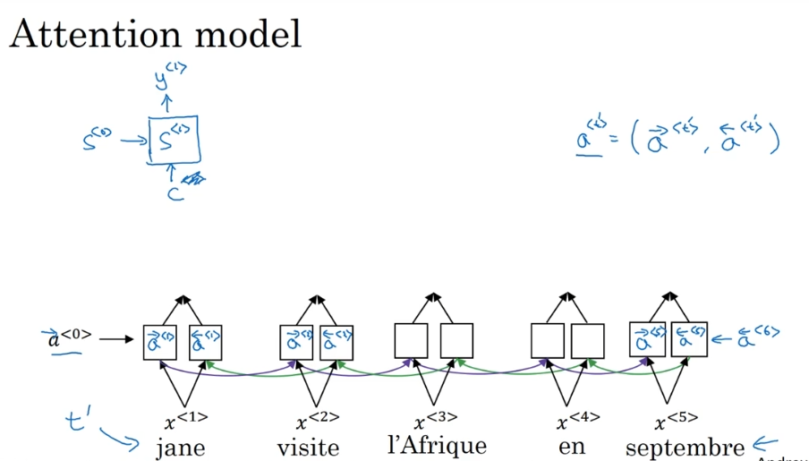

This will depend on the attention parameters so $\alpha^{<1,1>}$, $\alpha^{<1,2>}$ and so on tells us how much attention.

These alpha parameters tells us how much the context would depend on the features we're getting or the activations we're getting from the different time steps.

The way we define the context is actually be a weighted sum of the features from the different time steps weighted by these attention weights.

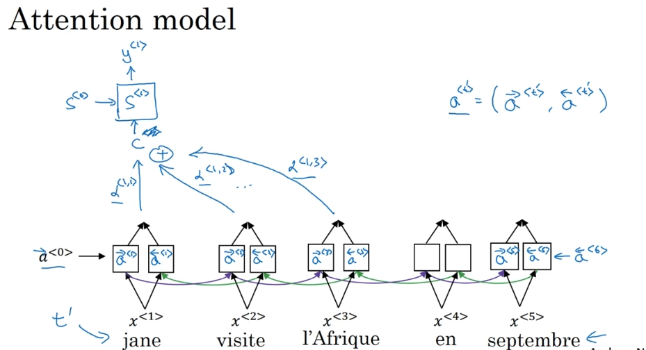

More formally the attention weights will satisfy this that they are all be non-negative, so it will be a zero positive and they'll sum to 1. We'll see later how to make sure this is true.

$\Sigma_{t'}\alpha^{<1,t'>}$

And we will have the context or the context at time one often drop that superscript that's going to be sum over t_prime, all the values of t_prime of this weighted sum of these activations.

$c^{<1>}= \Sigma_{t'}\alpha^{<1,t'>}a^{<t'>}$

This term here $\alpha^{<1,t'>}$ are the attention weights and this term here $a^{<t'>}$ comes from $a^{<t'>}=( \overrightarrow{a}^{<t'>}, \overleftarrow{a}^{<t'>})$.

So $\alpha^{<t,t'>}$ is the amount of attention that's $y^{<t>}$ should pay to $a^{<t'>}$.

In other words, when you're generating the t of the output words, how much you should be paying attention to the t_primeth input to word.

That's one step of generating the output and then at the next time step, you generate the second output and is again done some of where now you have a new set of attention weights on they to find a new way to sum. That generates a new context. This is also input and that allows you to generate the second word. Only now just this way to sum becomes the context of the second time step is sum over t_prime alpha(2, t_prime).

$c^{<1>}= \Sigma_{t'}\alpha^{<2,t'>}a^{<t'>}$

Using these context vectors. $c^{<1>}$ right there back, $c^{<2>}$, and so on. This network up here looks like a pretty standard RNN sequence with the context vectors as inputs and we can just generate the translation one word at a time. We have also define how to compute the context vectors in terms of these attention weights and those features of the input sentence.

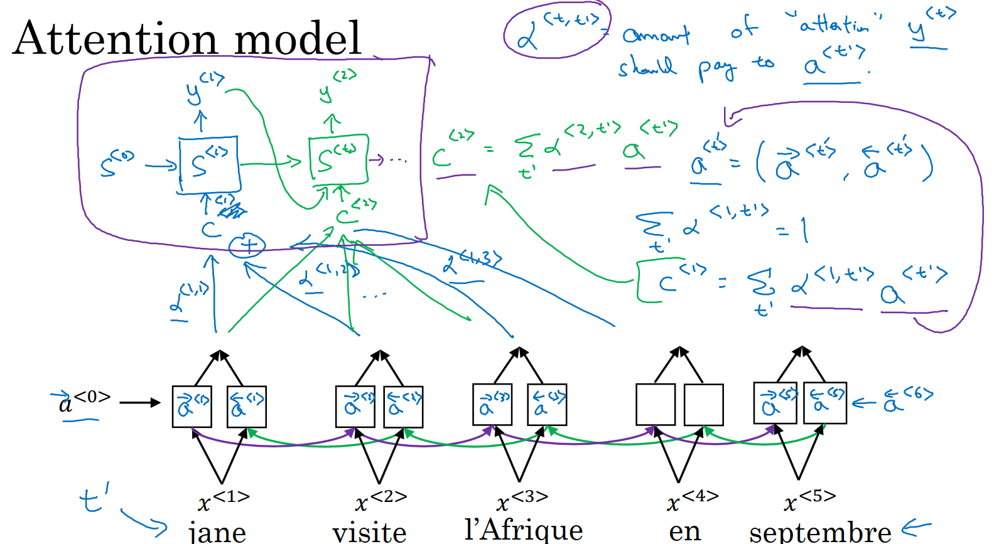

The only remaining thing to do is to define how to actually compute these attention weights.

### Computing attention $\alpha^{<t,t'>}$
Just to recap, $\alpha^{<t,t'>}$ is the amount of attention you should paid to $a^{<t'>}$ when you're trying to generate the t th words in the output translation.

Let me just write down the formula and we talk of how this works. This is formula you could use the compute $\alpha^{<t,t'>}$ which is going to compute these terms $e^{<t,t'>}$ and then use essentially a softmax to make sure that these weights sum to 1 if you sum over t_prime. So for every fix value of t, these things sum to 1 if you're summing over t_prime. And using this soft max prioritization, just ensures this properly sums to 1. 

$\alpha^{<t,t'>}={{exp(e^{<t,t'>})} \over {\Sigma_{t'=1}^{Tx}}exp(e^{<t,t'>})}$

How do we compute these factors e.

One way to do so is to use a small neural network as follows.

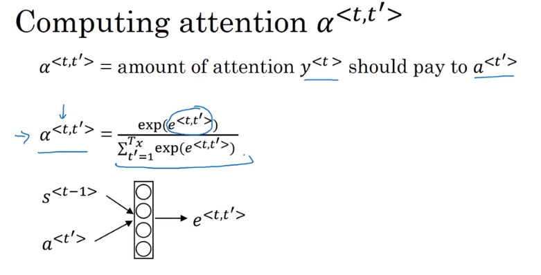

So $s^{<t-1>}$ was the neural network state from the previous time step. So here is the network we have.

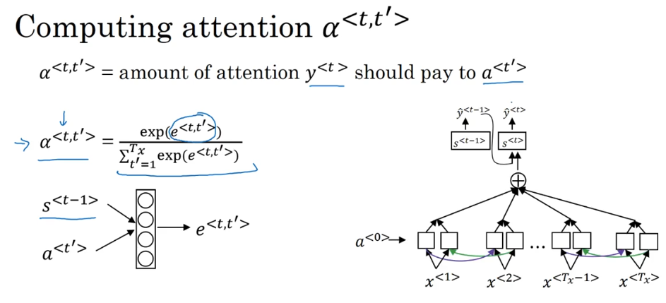

If you're trying to generate $y^{<t>}$ then $s^{<t-1>}$ was the hidden state from the previous step that's fed into $s^{<t>}$ and that's one input to very small neural network. Usually, one hidden layer in neural network because you need to compute these a lot. And then $a^{<t'>}$ the features from time step t' is the other inputs.

The intuition is, if you want to decide how much attention to pay to the activation of t_prime. Well, the things that seems like it should depend the most on is what is your own hidden state activation from the previous time step. You don't have the current state activation yet because of context feeds into this so you haven't computed that. But look at whatever you're hidden states of this RNN generating the output translation and then for each of the positions, each of the words look at their features. So it seems pretty natural that $\alpha^{<t,t'>}$ and $e^{<t,t'>}$ should depend on these two quantities $s^{<t-1>}$ and $a^{<t'>}$.

But we don't know what the function is. So one thing you could do is just train a very small neural network to learn whatever this function should be. And trust back propagation, trust gradient descent to learn the right function.

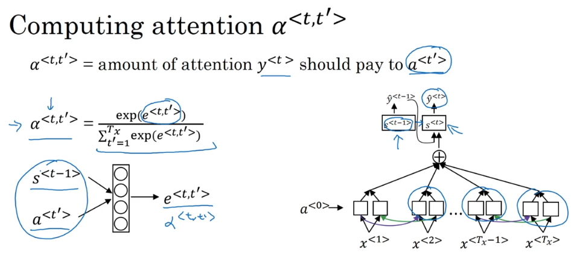

It turns out that if you implemented this whole model and train it with gradient descent, the whole thing actually works. This little neural network does a pretty decent job telling you how much attention yt should pay to $a^{<t'>}$ and this formula makes sure that the attention waits sum to one and then as you chug along generating one word at a time, this neural network actually pays attention to the right parts of the input sentence that learns all this automatically using gradient descent. 

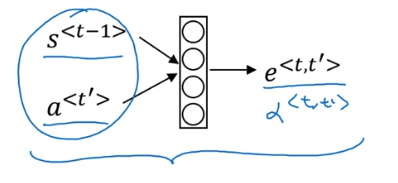

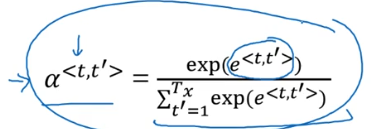

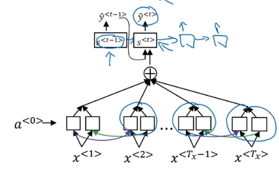

One downside to this algorithm is that it does take quadratic time or quadratic cost to run this algorithm.

If you have Tx words in the input and Ty words in the output then the total number of these attention parameters are going to be Tx times Ty. This algorithm runs in quadratic cost.

Although in machine translation applications where neither input nor output sentences is usually that long maybe quadratic cost is actually acceptable. Although, there is some research work on trying to reduce costs as well.

So far I've been describing the attention idea in the context of machine translation. Without going too much into detail this idea has been applied to other problems as well such as image captioning. So in the image captioning problem the task is to look at the picture and write a caption for that picture. So in this paper set to the bottom by Kevin Chu, Jimmy Barr, Ryan Kiros, Kelvin Shaw, Aaron Korver, Russell Zarkutnov, Virta Zemo, and Yoshua Bengio they also showed that you could have a very similar architecture. Look at the picture and pay attention only to parts of the picture at a time while you're writing a caption for a picture.

### Attention examples
Whereas machine translation is a very complicated problem in the programming exercise you get to implement and play of the attention while you yourself for the date normalization problem. So the problem inputting a date like this.

```
July 20th 1969
```

This actually has a date of the Apollo Moon landing and normalizing it into standard formats or a date like this
```
1969-07-20
```

And having a neural network a sequence, sequence model normalize it to this format. This by the way is the birthday of William Shakespeare. Also it's believed to be.

```
23 April, 1564 -> 1564-04-23
```

What you see in programming exercises as you can train a neural network to input dates in any of these formats and have it use an attention model to generate a normalized format for these dates.

One other thing that sometimes fun to do is to look at the visualizations of the attention weights. So here's a machine translation example and here were plotted in different colors. the magnitude of the different attention weights.

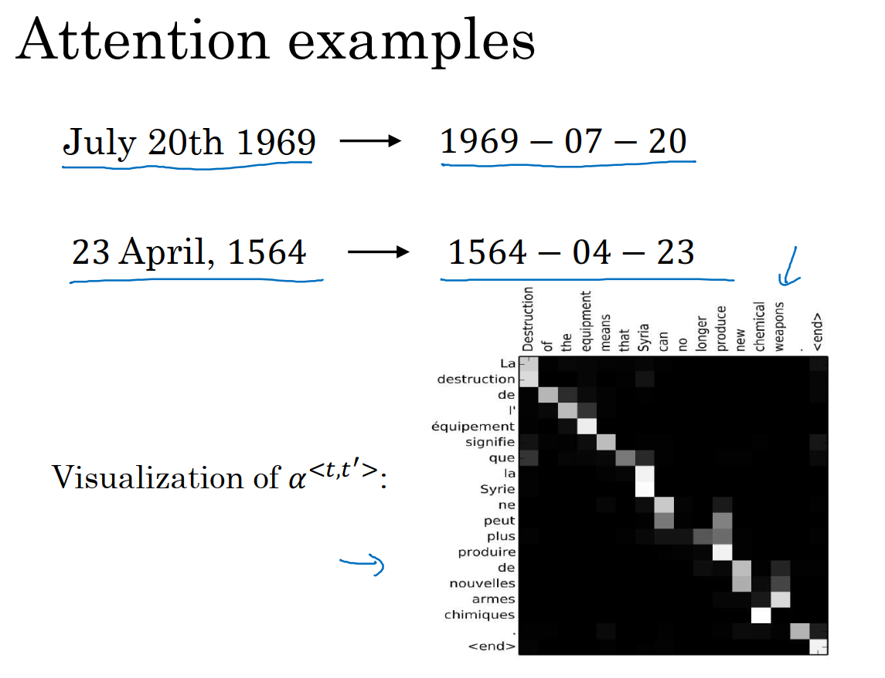

I don't want to spend too much time on this but you find that the corresponding input and output words you find that the attention waits will tend to be high. Thus, suggesting that when it's generating a specific word in output is, usually paying attention to the correct words in the input and all this including learning where to pay attention when was all learned using back propagation with an attention model.

## Speech Recognition
One of the most exciting developments with sequence-to-sequence models has been the rise of very accurate speech recognition.

### Speech recognition problem
You're given an audio clip, x, and your job is to automatically find a text transcript, y.

An audio clip, if you plot it looks like this, the horizontal axis here is time, and what a microphone does is it really measures minuscule changes in air pressure, and the way you're hearing my voice right now is that your ear is detecting little changes in air pressure, probably generated either by your speakers or by a headset. Some audio clips like this plots with the air pressure against time. And, if this audio clip is of me saying, "the quick brown fox", then hopefully, a speech recognition algorithm can input that audio clip and output that transcript.

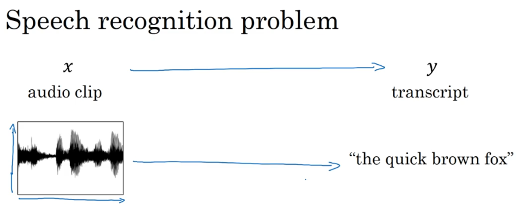

Because even the human ear doesn't process raw wave forms, but the human ear has physical structures that measures the amounts of intensity of different frequencies, there is, a common pre-processing step for audio data is to run your raw audio clip and generate a spectrogram.

This is the plots where the horizontal axis is time, and the vertical axis is frequencies, and intensity of different colors shows the amount of energy. How loud is the sound at different frequencies? At different times? 

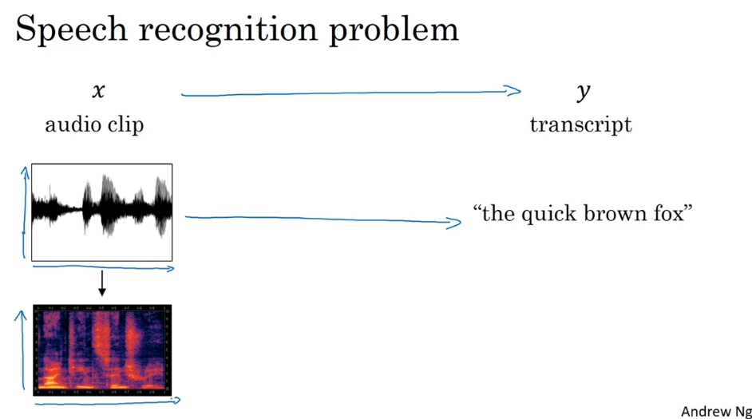

These types of spectrograms, or you might also hear people talk about filter back outputs, is often commonly applied pre-processing step before audio is pass into in the running algorithm.

The human ear does a computation pretty similar to this pre-processing step.

One of the most exciting trends in speech recognition is that, once upon a time, speech recognition systems used to be built using phonemes and this where, I want to say hand-engineered basic units of cells. 

So, the quick brown fox represented as phonemes. I'm going to simplify a bit, let say, "The" has a "de" and "e" sound and Quick, has a "ku" and "wu", "ik", "k" sound, and linguist used to write off these basic units of sound, and try to break language down to these basic units of sound. So, brown, this aren't the official phonemes which are written with more complicated notation, but linguists used to hypothesize that writing down audio in terms of these basic units of sound called phonemes would be the best way to do speech recognition.

But with end-to-end deep learning, we're finding that phonemes representations are no longer necessary. But instead, you can built systems that input an audio clip and directly output a transcript without needing to use hand-engineered representations like these.

One of the things that made this possible was going to much larger data sets. So, academic data sets on speech recognition might be as a 300 hours, and in academia, 3000 hour data sets of transcribed audio would be considered reasonable size, so lot of research has been done, a lot of research papers that are written on data sets there are several thousand hours. But, the best commercial systems are now trains on over 10,000 hours and sometimes over a 100,000 hours of audio. And, it's really moving to a much larger audio data sets, transcribe audio data sets where both x and y, together with deep learning algorithm, that has driven a lot of progress is speech recognition.

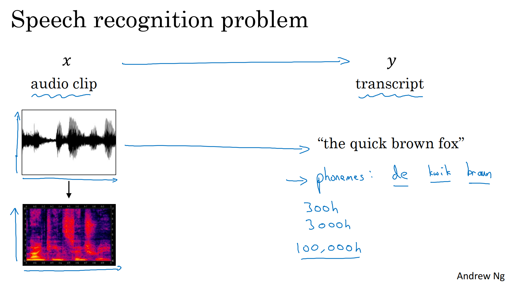

### Attention model for speech recognition
How do you build a speech recognition system?

In the last video, we're talking about the attention model. So, one thing you could do is actually do that, where on the horizontal axis, you take in different time frames of the audio input, and then you have an attention model try to output the transcript like, "the quick brown fox", or what it was said.

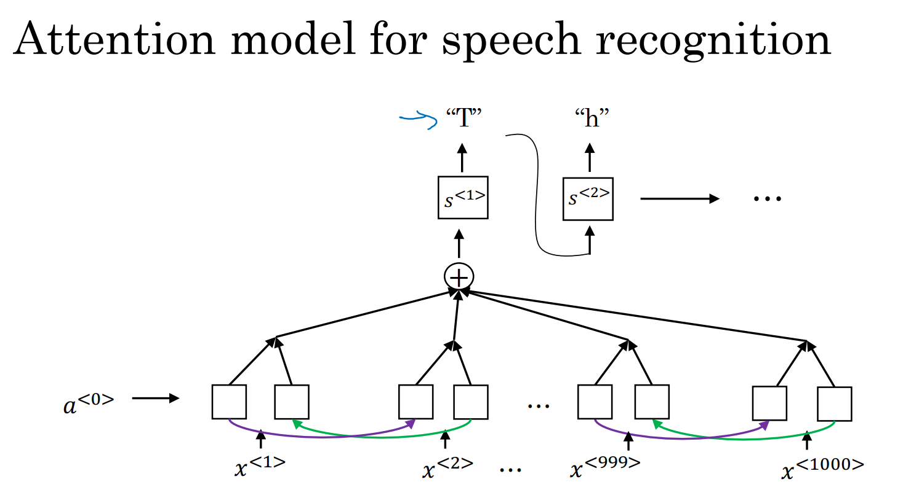

### CTC cost for speech recognition
One other method that seems to work well is to use the CTC cost for speech recognition.

CTC stands for Connectionist Temporal Classification and is due to Alex Graves, Santiago Fernandes, Faustino Gomez, and Jürgen Schmidhuber.

Audio clip of someone says: "the quick brown fox"

We're going to use a neural network structured like this with an equal number of input x's and output y's, and I have drawn a simple of what uni-directional for the RNN for this, but in practice, this will usually be a bidirectional LSTM and bidirectional GRU and usually, a deeper model.

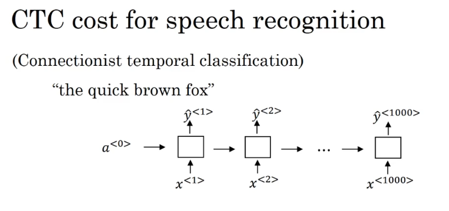

Notice that the number of time steps here is very large and in speech recognition, usually the number of input time steps is much bigger than the number of output time steps.

For example, if you have 10 seconds of audio and your features come at a 100 hertz so 100 samples per second, then a 10 second audio clip would end up with a thousand inputs. So it's 100 hertz times 10 seconds, and so with a thousand inputs. But your output might not have a thousand alphabets, might not have a thousand characters. So, what do you do?

The CTC cost function allows the RNN to generate an output like this ttt, there's a special character called the blank character, which we're going to write as an underscore here, h_eee___, and then maybe a space, we're going to write like this, so that a space and then ___ qqq__.

```
ttt_h_eee___ ___qqq__
```

And, this is considered a correct output for the first parts of the space, quick with the Q, and the basic rule for the CTC cost function is to collapse repeated characters not separated by "blank".

To be clear, I'm using this underscore to denote a special blank character and that's different than the space character. So, there is a space here between the and quick, so I should output a space.

But, by collapsing repeated characters, not separated by blank, it actually collapse the sequence into t, h, e, and then space, and q, and this allows your network to have a thousand outputs by repeating characters allow the times. So, inserting a bunch of blank characters and still ends up with a much shorter output text transcript.

This phrase here "the quick brown fox" including spaces actually has 19 characters, and if somehow, the neural network is forced upwards of a thousand characters by allowing the network to insert blanks and repeated characters and can still represent this 19 character output with this 1000 outputs of values of Y.

This paper by Alex Grace, as well as Baidu's deep speech recognition system, which I was involved in, used this idea to build effective Speech recognition systems.

Attention like models work and CTC models work and present two different options of how to go about building these systems.

Today, building effective or production scale speech recognition system is a pretty significant effort and requires a very large data set. But, what I like to do in the next video is share you, how you can build a trigger word detection system, where keyword detection system which is actually much easier and can be done with even a smaller or more reasonable amount of data. 

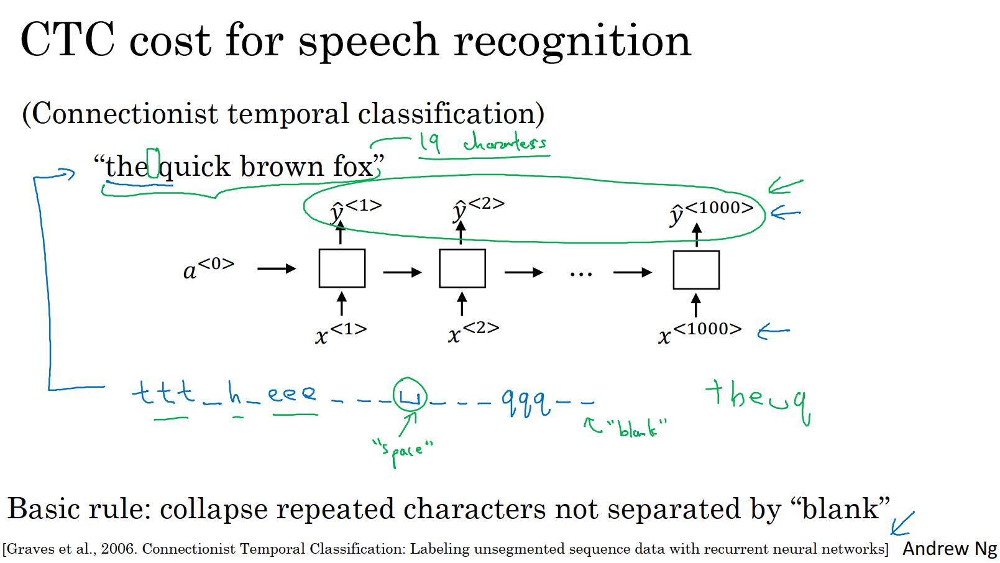

## Trigger Word Detection
### What is trigger word detection?
Examples of trigger word systems include the Amazon Echo, which is woken up with the word Alexa, the Baidu DuerOS powered devices woken up with the phrase xiaodunihao, Apple Siri working up with hey, Siri, and Google Home woken up with okay, Google.

It's thanks to trigger word detection that if you have, say, an Amazon Echo in your living room, you can walk in your living room and just say, Alexa, what time is it? And have it wake up or be triggered by the word Alexa and answer your voice query.

If you can build a trigger word detection system, maybe you can make your computer do something by telling it, computer, activate. 

### Trigger word detection algorithm
The literature on trigger detection algorithm is still evolving so there isn't wide consensus yet on what's the best algorithm for trigger word detection. So I'm just going to show you one example of an algorithm you can use.

Now, you've seen RNNs like this and what we really do is take an audio clip, maybe compute spectrogram features. And that generates features, x1, x2, x3 audio features, x1, x2, x3 that you pass through an RNN. And so all that remains to be done is to define the target labels y.

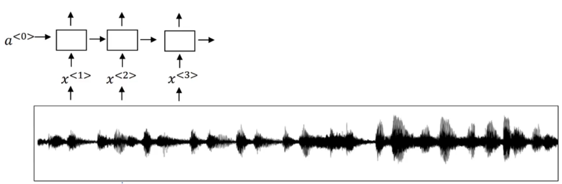

If this point in the audio clip is when someone just finished saying the trigger word, such as Alexa or xiaodunihao or hey, Siri, or okay, Google, then in the training sets, you can set the target labels to be 0 for everything before that point and right after that to set the target label of 1.

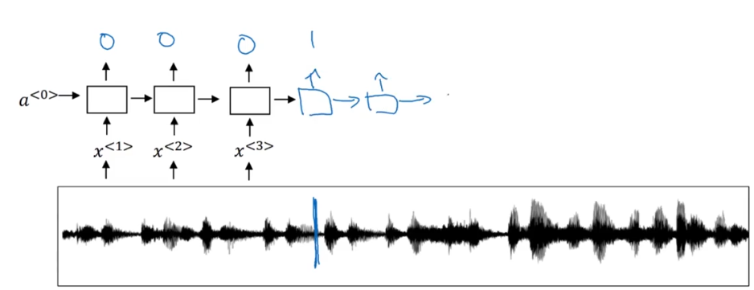

And then if a little bit later on, the trigger word was said again and the trigger word was said at this point, then you can again set the target label to be 1 right after that.

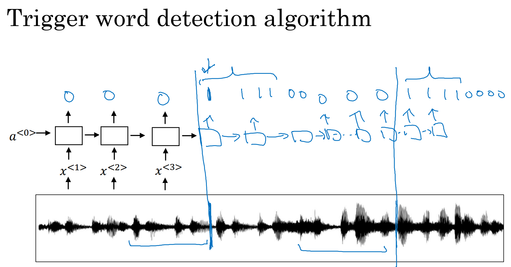

This type of labelling scheme for an RNN could work. Actually, this will actually work reasonably well.

One slight disadvantage of this is it creates a very imbalanced training set to have a lot more 0s than 1s. So one other thing you could do, this is a little bit of a hack, but could make the model a little bit easier to train is instead of setting only a single time step output 1, you can actually make it output a few 1s for several times or for a fixed period of time before reverting back to 0. So and that slightly evens out the ratio of 1s to 0s, but this is a little bit of a hack.

But if this is when in the audio clipper the trigger word is said, then right after that, you can set the target label to 1, and if this is the trigger word said again, then right after that is when you want the RNN to output 1.

### Summary
Trigger Word Detection is the task of detecting when a specific keyword or phrase appears in an audio stream.

Because:
* Audio is continuous
* Trigger word can appear anywhere
* Words sound different depending on speaker, noise, accent
* You must detect it in real time

This makes it a sequence-to-sequence labeling problem.

Input:

A long audio clip (e.g., 10 seconds)

Output:

A sequence of labels (one per time step)

At each time step:
* Output 1 if trigger word has just finished
* Output 0 otherwise

So the model learns:

“Did the trigger word just end here?”

Raw audio is not fed directly to the model.

Instead:
* Convert audio to a spectrogram
* Each time slice becomes a feature vector

So input becomes:

$X=(x^{<1>}, x^{<2>}, ..., x^{<t>})$

Each $x^{<t>}$ represents sound features at time t.

* 1D Convolutional layers → extract local audio patterns
* Recurrent Neural Network (RNN / GRU / LSTM) → model time dependencies
* Sigmoid output layer → predict 0 or 1 at each time step

This is called a many-to-many sequence model.

If the trigger word is detected at time t:
* Set output = 1 for a few time steps after the word
* Not just a single spike

Why?
* Makes training easier
* Prevents vanishing gradients
* Gives model tolerance for timing variation

So labels look like:
```
000000000111000000
```

Instead of:
```
000000000100000000
```

Training data is generated by:
* Taking random background audio
* Randomly inserting trigger words
* Randomly inserting non-trigger words
* Labeling output sequence accordingly

This gives:
* Positive examples (trigger present)
* Negative examples (no trigger)