# Transformer Network

**Learning Objectives**
* Create positional encodings to capture sequential relationships in data
* Calculate scaled dot-product self-attention with word embeddings
* Implement masked multi-head attention
* Build and train a Transformer model
* Fine-tune a pre-trained transformer model for Named Entity Recognition
* Fine-tune a pre-trained transformer model for Question Answering
* Implement a QA model in TensorFlow and PyTorch
* Fine-tune a pre-trained transformer model to a custom dataset
* Perform extractive Question Answering

- [Transformer Network](#transformer-network)
  - [Transformer Network Intuition](#transformer-network-intuition)
    - [Transformer Network Motivation](#transformer-network-motivation)
    - [Transformers Network Intuition](#transformers-network-intuition)
  - [Self-Attention](#self-attention)
    - [Self-Attention Intuition](#self-attention-intuition)
    - [Self-Attention](#self-attention-1)
    - [Summary](#summary)
  - [Multi-Head Attention](#multi-head-attention)
    - [Multi-Head Attention](#multi-head-attention-1)
  - [Transformer Network](#transformer-network-1)

## Transformer Network Intuition
One of the most exciting developments in deep learning has been the transformer Network, or sometimes called Transformers. This is an architecture that has completely taken the NLP world by storm. And many of the most effective algorithms for NLP today are based on the transformer architecture. It is a relatively complex neural network architecture, but in this and the next three videos after this will go through it piece by piece.

### Transformer Network Motivation
As the complexity of your sequence task increases, so does the complexity of your model.

We have started this course with the RNN and found that it had some problems with vanishing gradients, which made it hard to capture long range dependencies and sequences. 

We then looked at the GRU and then the LSTM model as a way to resolve many of those problems where you make use of gates to control the flow of information. And so each of these units had a few more computations.

While these editions improved control over the flow of information, they also came with increased complexity.

As we move from our RNNs to GRU to LSTM ,the models became more complex.

All of these models are still sequential models in that they ingested the input, maybe the input sentence one word or one token at the time. And so, as as if each unit was like a bottleneck to the flow of information. Because to compute the output of this final unit, for example, you first have to compute the outputs of all of the units that come before. 

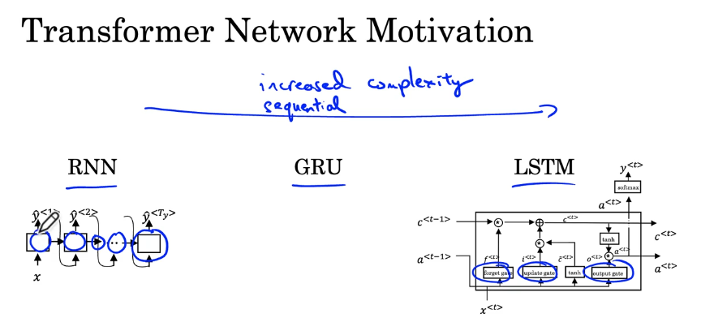

In this video, you learned about the transformer architecture, which allows you to run a lot more of these computations for an entire sequence in parallel.

You can ingest an entire sentence all at the same time, rather than just processing it one word at a time from left to right.

### Transformers Network Intuition
The Transformer Network was published in a seminal paper by Ashish Vaswani , Noam Shazeer, Niki Parmar, Jakob Uszkoreit, Llion Jones, Aidan Gomez, Lukasz Kaiser and Illia Polosukhin. One of the inventors of the Transformer network, Lukasz Kaiser, is also co instructor of the NLP specialization with deep learning dot AI.

The major innovation of the transformer architecture is combining the use of attention based representations and a CNN convolutional neural network style of processing.

An RNN may process one output at the time, and so maybe $y^{<0>}$ feeds in to them that you compute $y^{<1>}$ and then this is used to compute $y^{<2>}$.

This is a very sequential way of processing tokens, and you might contrast this with a CNN or confident that can take input a lot of pixels or maybe a lot of words and can compute representations for them in parallel.

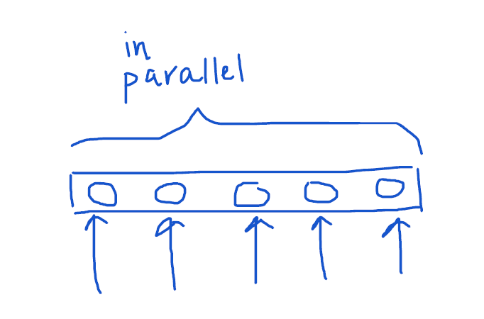

What you see in the Attention Network is a way of computing very rich, very useful representations of words but with something more akin to this CNN style of parallel processing.

To understand the attention network, there will be two key ideas will go through in the next few videos.

* The first is self attention. The goal of self attention is, if you have, say, a sentence of five words will end up computing five representations for these five words, was going to write $A^{<1>},A^{<2>},A^{<3>}, A^{<4>} and A^{<5>}$. And this will be an attention based way of computing representations for all the words in your sentence in parallel.
* Then multi headed attention is basically for loop over the self attention process. So you end up with multiple versions of these representations.

A Transformer understands a sentence by letting every word look at every other word at the same time and decide which ones matter most.

RNNs read one word at a time:
I → love → deep → learning

Problems:
* Slow (cannot parallelize)
* Hard to remember long-range dependencies
* Information must pass through many steps

Example:

“The animal that the boy who lived next door adopted was a dog”

To understand “was”, the RNN must remember “animal” many steps ago.

Transformers are built on attention.

Attention means:

When processing one word, look at all other words and decide which are important.

Example sentence:

“The bank near the river was flooded”

When processing “bank”, the model should pay attention to:

“river” (important)

not much to “the”

Self-attention = attention within the same sentence

Each word asks:

“Which other words should I focus on to understand myself?”

So:
* “it” looks at what noun it refers to
* “bank” looks at surrounding context
* verbs look at subjects

## Self-Attention
### Self-Attention Intuition
To use attention with a style more like CNNs, you need to calculate self-attention, where you create attention-based representations for each of the words in your input sentence.

Let's use our running example, "Jane visite l'Afrique en septembre".

Our goal will be for each word to compute an attention-based representation like this.

𝐴(𝑞,𝐾,𝑉)= attention attention-based vector representation of a word

So we'll end up with five of these, since our sentence has five words. 

When we've computed them we'll call the five representations with these 5 words $A^{<1>}$ through $A^{<5>}$.

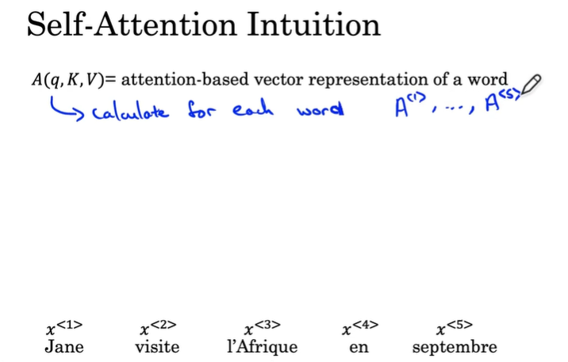

The running example I'm going to use is take the word "l'Afrique" in this sentence.

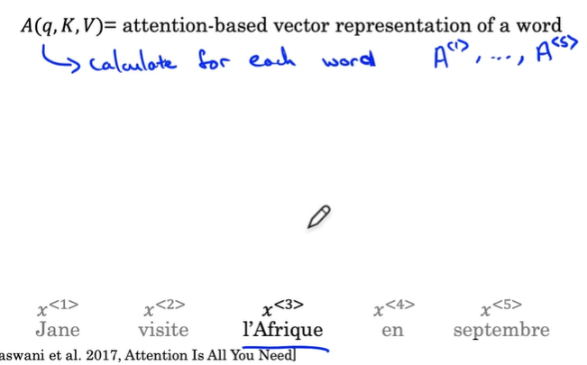

We'll step through on the next slide how the transformer network's self-attention mechanism allows you to compute $A^{<3>}$ for this word, and then you do the same thing for the other words in the sentence as well.

Now you learn previously about word embeddings. One way to represent "l'Afrique" would be to just look up the word embedding for "l'Afrique".

But depending on the context, are we thinking of "l'Afrique" or Africa as a site of historical interests or as a holiday destination, or as the world's second largest continent.

Depending on how you're thinking of l'Afrique, you may choose to represent it differently, and that's what this representation $A^{<3>}$ will do.

It will look at the surrounding words to try to figure out what's actually going on in how we're talking about Africa in this sentence, and find the most appropriate representation for this.

In terms of the actual calculation, it won't be too different from the attention mechanism you saw previously as applied in the context of RNNs, except we'll compute these representations in parallel for all five words in a sentence.

When we're building attention on top of RNNs, this was the equation we used.

$a^{<t,t'>}={{exp(e^{<t,t'>})} \over {\Sigma_{t'=1}^{Tx}exp(e^{<t,t'>})}}$

With the self-attention mechanism, the attention equation is instead going to look like this.

$A(q,K,V)=\Sigma_i{{exp(q.k^{<i>})} \over {\Sigma_jexp(q.k^{<j>})}}v^{<i>}$

You can see the equations have some similarity.

The inner term here also involves a softmax, just like this term over here on the left, and you can think of the exponent terms as being akin to attention values. Exactly how these terms are worked out you'll see in the next slide. So again, don't worry about the details just yet.

But the main difference is that for every word, say for l'Afrique, you have three values called the query ($q^{<3>}$), key ($k^{<3>}$), and value ($v^{<3>}$). These vectors are the key inputs to computing the attention value for each words.

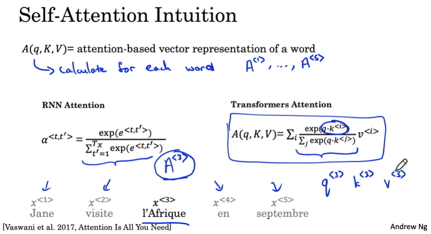

### Self-Attention
Let's step through the steps needed to actually calculate $A^{<3>}$.

On this slide, let's step through the computations you need to go from the words l'Afrique to the self-attention representation $A^{<3>}$.

First, we're going to associate each of the words with three values called the query key and value pairs.

If $X^{<3>}$ is the word embedding for l'Afrique, the way that's $q^{<3>}$ is computed is as a learned matrix, which I'm going to write as $q^{<3>} = W^Q.X^{<3>}$, and similarly for the key and value pairs, so $k^{<3>} = W^K.X^{<3>}$ and $V^{<3>} = W^V.X^{<3>}$.

These matrices, $W^Q$, $W^K$, and $W^V$, are parameters of this learning algorithm, and they allow you to pull off these query, key, and value vectors for each word.

What are these query key and value vectors supposed to do? They were named using a loose analogy to a concept in databases where you can have queries and also key-value pairs. If you're familiar with those types of databases, the analogy may make sense to you, but if you're not familiar with that database concept, don't worry about it.

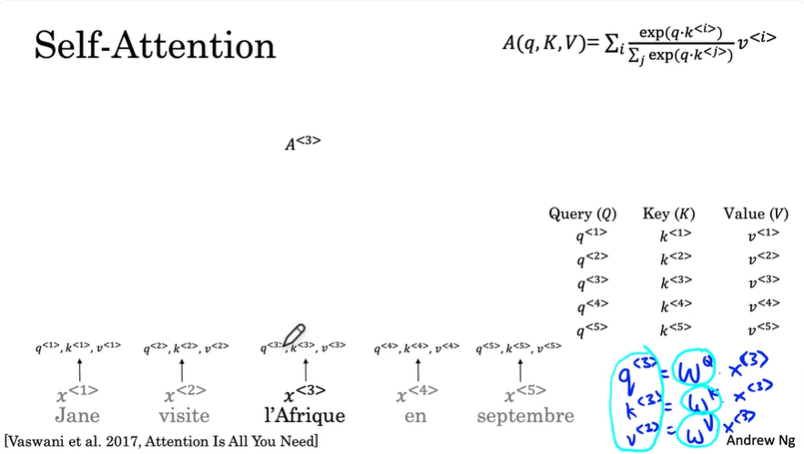

Let me give one intuition behind the intent of these query, key, and value of vectors.

$q^{<3>}$ is a question that you get to ask about l'Afrique. $q^{<3>}$ may represent a question like, what's happening there?

Africa, l'Afrique is a destination. You might want to know when computing $A^{<3>}$, what's happening there.

What we're going to do is compute the inner product between $q^{<3>}$ and $k^{<1>}$, between Query 3 and Key 1, and this will tell us how good is an answer where it's one to the question of what's happening in Africa.

Then we compute the inner product between $q^{<3>}$ and $k^{<2>}$ and this is intended to tell us how good is visite an answer to the question of what's happening in Africa and so on for the other words in the sequence.

The goal of this operation is to pull up the most information that's needed to help us compute the most useful representation $A^{<3>}$ up here.

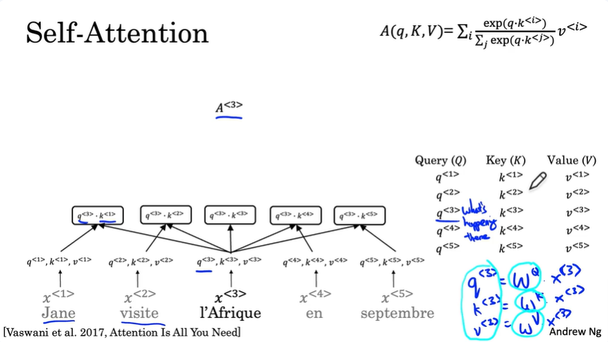

Just for intuition building if $k^{<1>}$ represents that this word is a person, because Jane is a person, and $k^{<2>}$ represents that the second word, visite, is an action, then you may find that $q^{<2>}$ inter producted with $k^{<2>}$ has the largest value, and this may be intuitive example, might suggest that visite, gives you the most relevant contexts for what's happening in Africa. Which is that, it's viewed as a destination for a visit.

What we will do is take these 5 values in this row and compute a Softmax over them.

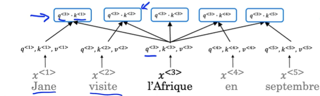

There's actually this Softmax over here, and in the example that we've been talking about, $q^{<3>}$ times $k^{<2>}$ corresponding to word visite maybe has the largest value. I'm going to shade that blue over here. Then finally, we're going to take these Softmax values and multiply them with $v^{<1>}$, which is the value for word 1, the value for word 2, and so on, and so these values correspond to that value up there.

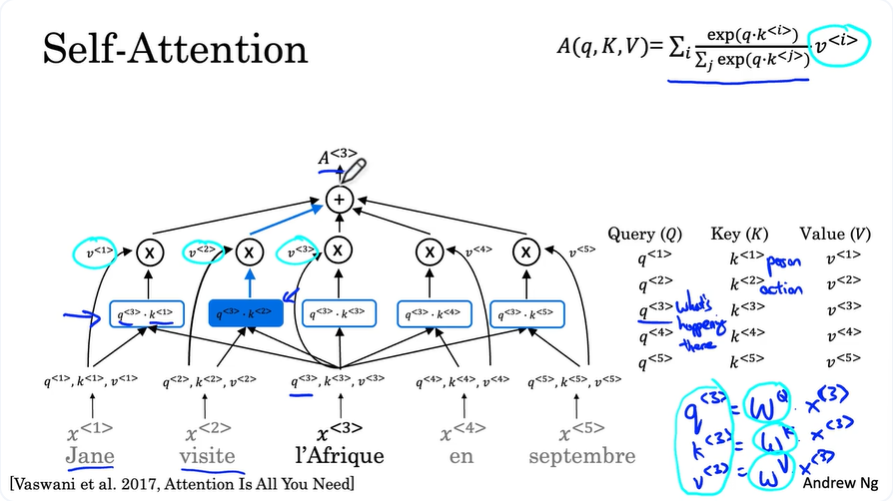

Finally, we sum it all up. This summation corresponds to this summation operator and so adding up all of these values gives you $A^{<3>}$, which is just equal to this value here (A(q,K,V)).

Another way to write $A^{<3>}$ is really as A, this $A(q^{<3>}, K, V).

But sometimes it will be more convenient to just write $A^{<3>}$ like that.

The key advantage of this representation is the word of l'Afrique isn't some fixed word embedding. Instead, it lets the self-attention mechanism realize that l'Afrique is the destination of a visite, of a visit, and thus compute a richer, more useful representation for this word.

Now, I've been using the third word, l'Afrique as a running example but you could use this process for all five words in your sequence to get similarly rich representations for Jane, visite, l'Afrique, en, septembre.

If you put all of these five computations together, denotation used in literature looks like this,

Attention(Q,K,V)=$softmax({{QK^T} \over {\sqrt{d_K}}})V$

where you can summarize all of these computations that we just talked about for all the words in the sequence by writing Attention(Q, K, V) where Q, K, V matrices, and Attention(Q,K,V) is just a compressed or vectorized representation of A(Q,K,V) equation up here. 

The term in the denominator is just to scale the dot-product, so it doesn't explode. You don't really need to worry about it.

But another name for this type of attention is the scaled dot-product attention. This is the one represented in the original transformer architecture paper, Attention Is All You Need As Well.

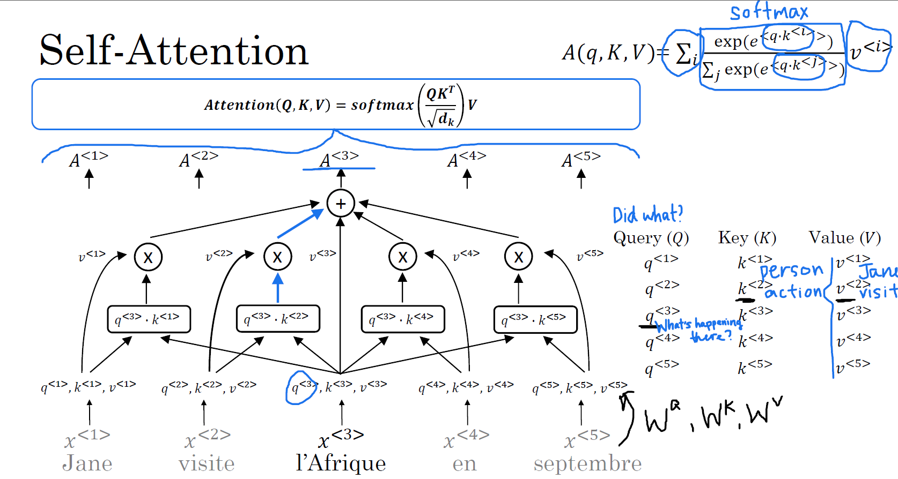

To recap, associated with each of the five words you end up with a query, a key, and a value. The query lets you ask a question about that word, such as what's happening in Africa.

The key looks at all of the other words, and by the similarity to the query, helps you figure out which words gives the most relevant answer to that question.

In this case, visite is what's happening in Africa, someone's visiting Africa.

Then finally, the value allows the representation to plug in how visite should be represented within $A^{<3>}$, within the representation of Africa. This allows you to come up with a representation for the word Africa that says this is Africa and someone is visiting Africa.

This is a much more nuanced, much richer representation for the world than if you just had to pull up the same fixed word embedding for every single word without being able to adapt it based on what words are to the left and to the right of that word. We've all got to take into account and in the context.

You have learned about the self-attention mechanism. We're going to put a big for-loop over this whole thing and that will be the multi-headed attention mechanism.

### Summary
Self-attention lets each word look at all other words in the sentence and decide which ones are important to understand its meaning.

So a word’s representation is not fixed — it changes depending on context.

Consider this sentence:

“The animal didn’t cross the street because it was tired.”

What does “it” refer to?

animal ✅

street ❌

To answer this, “it” must look at other words.

That’s exactly what self-attention enables.

“Self” means:
* Attention is applied within the same sentence
* Not between different sentences

Each word attends to other words in the same input.

Each Word Gets Three Vectors (Q, K, V)

This is the most confusing part at first — so here’s the intuition.

For each word, the model creates:

Vector	Intuition
Query (Q)	“What am I looking for?”
Key (K)	“What do I offer?”
Value (V)	“What information do I give?”

These are learned transformations of the word embedding.

Start with a word embedding x.

Then apply three different matrices:

$Q=W_Qx$

$K=W_Kx$

$V=W_Vx$

These matrices are learned during training.

So:
* Same word → different Q, K, V
* Different roles, same underlying meaning

Let’s say we are computing attention for the word “it”.

Step 1: Compare “it” with every word

Compute dot products:

$Q_{it}.K_{animal}$

$Q_{it}.K_{street}$

$Q_{it}.K_{because}$

...

These scores measure:

“How relevant is this word to me?”

Step 2: Convert scores into probabilities

Apply softmax:

$\alpha_j = softmax(Q_i.K_j)$

Now:
* All attention weights sum to 1
* More relevant words get higher weight

Step 3: Combine the values

Compute weighted sum:

$Attention(i)=\Sigma_j\alpha_jV_j$

This produces a new representation for the word.

Each word gets a context-aware embedding.

Example:
* Embedding of “bank” near “river” → river-related meaning
* Embedding of “bank” near “money” → finance-related meaning

Same word, different vectors.

Softmax:
* Highlights the most relevant words
* Suppresses irrelevant ones
* Keeps things numerically stable

Without softmax:
* Attention weights would be messy
* No clear focus

Every word attends to every other word in parallel.

This makes Transformers:
* Fast
* Highly parallelizable
* Great at long-range dependencies

## Multi-Head Attention
### Multi-Head Attention
Each time you calculate self attention for a sequence is called a head. 

And thus the name multi head attention refers to if you do what you saw in the last video, but a bunch of times let's walk through how this works.

Remember that you got the vectors Q, K and V for each of the input terms by multiplying them by a few matrices, $W_Q$, $W_K$ and $W_V$.

With multi-head attention, you take that same set of query key and value vectors as inputs. So the q, k, v values written down here and calculate multiple self attentions.

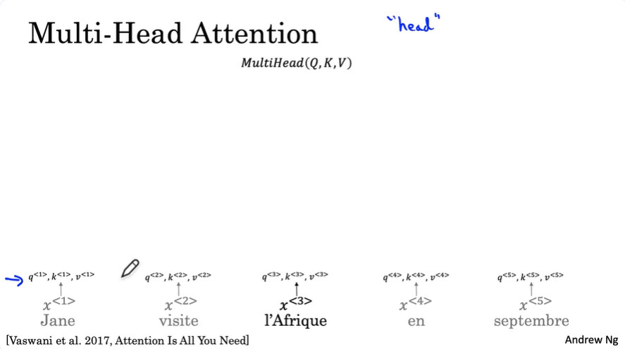

First, multiply q,k,v matrices with weight matrices

$W_1^Q.q^{<1>}$

$W_1^K.k^{<1>}$

$W_1^V.v^{<1>}$

These three values give you a new set of query key and value vectors for the first words.

You do the same thing for each of the other words.

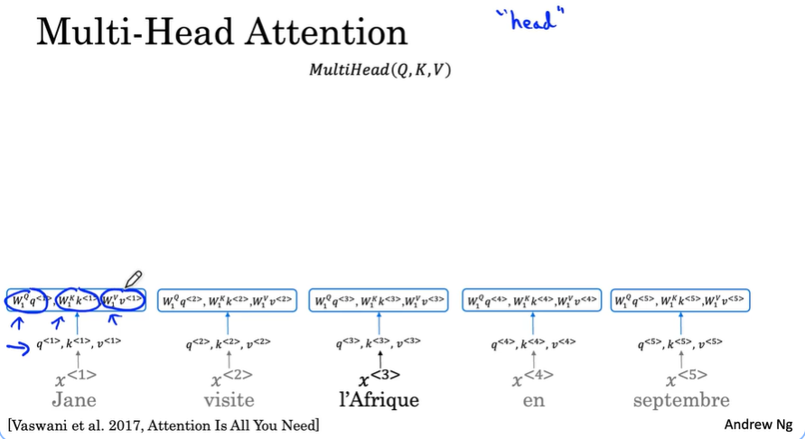

For the sake of intuition, you might find it useful to think of $W_1^Q$, $W_1^K$ and $W_1^V$ as being learned to help ask and answer the question, what's happening there?

And so this is just more or less the self attention example that we walked through earlier in the previous video.

After finishing you may think, we have w q, $W_1^Q$, $W_1^K$, $W_1^V$, I learn to help you ask and answer the question, what's happening?

And so with this computation, the word visite gives the best answer to what's happening, which is why I've highlighted with this blue arrow over here

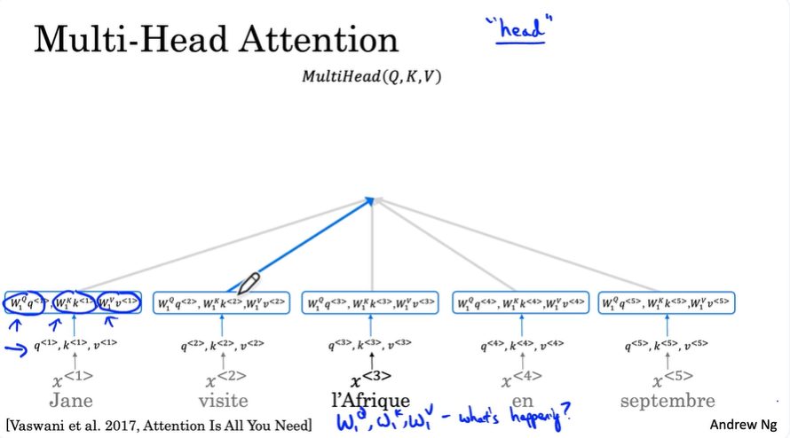

to represent that the inner product between the key for l'Afrique has the highest value with the query for visite, which is the first of the questions we'll get to ask.

This is how you get the representation for l'Afrique and you do the same for Jane, visite and the other words en septembre. So you end up with five vectors to represent the five words in the sequence.

This is a computation you carry out for the first of the several heads you use in multi head attention.

You would step through exactly the same calculation that we had just now for l'Afrique and for the other words and end up with the same attention values, $A^{<1>}$ through $A^{<5>}$ that we had in the previous video.

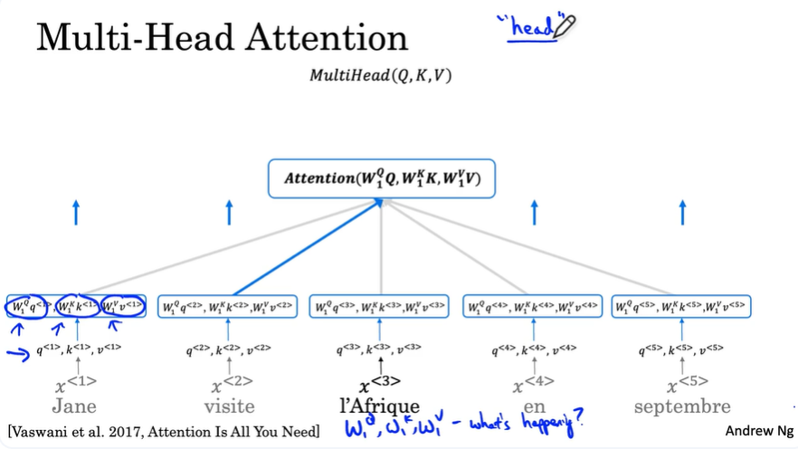

Now we're going to do this not once but a handful of times. So that rather than having 1 head, we may now have 8 heads, which just means performing this whole calculation maybe 8 times.

So far, we've computed this quantity of attention with the first head indicated by the subsequent one in these matrices. And the attention equation is just this, which you had previously seen in the last video as well.

Attention(Q,K,V)=$softmax({{QK^T} \over {\sqrt{d_K}}})V$

Now, let's do this computation with the second head. The second head will have a new set of matrices. I'm going to write $W_2^Q$, $W_2^K$, $W_2^V$ that allows this mechanism to ask and answer a second question.

The first question was what's happening? Maybe the second question is when is something happening?

Instead of having $W_1$ here in the general case, we will have here $W_i$ and I've now stacked up the second head behind the first one was the second one shown in red. 

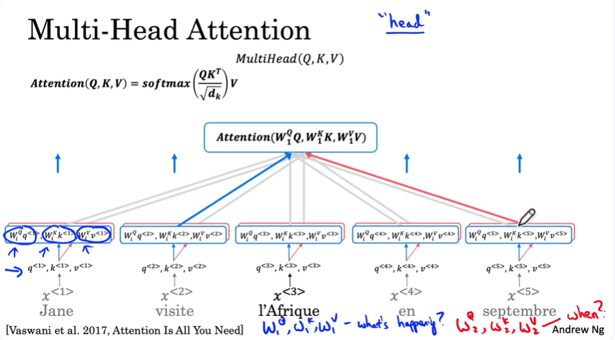

You repeat a computation that's exactly the same as the first one but with this new set of matrices instead. And you end up with in this case maybe the inner product between the september key and the l'Afrique query will have the highest inner product.

I'm going to highlight this red arrow to indicate that the value for september will play a large role in this second part of the representation for l'Afrique.

Maybe the third question we now want to ask as represented by $W_3^Q$, $W_3^K$, $W_3^V$ is who, who has something to do with Africa?

In this case when you do this computation the third time, maybe the inner product between Jane's key vector and the l'Afrique query vector will be highest and self highlighted this black arrow here. So that Jane's value will have the greatest weight in this representation which I've now stacked on at the back.

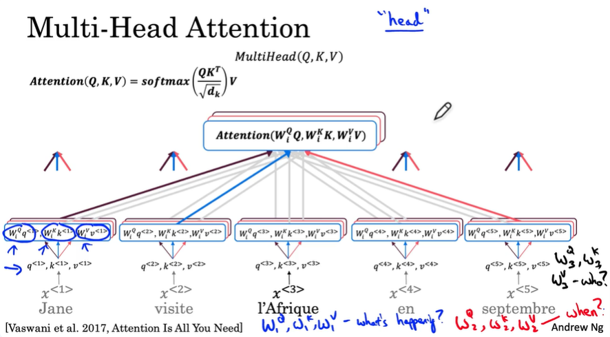

In the literature, the number of heads is usually represented by the lower case letter h. So h is equal to the number of heads.

You can think of each of these heads as a different feature. And when you pass these features to a new network you can calculate a very rich representation of the sentence.

Calculating these computations for the three heads or the eight heads or whatever the number, the concatenation of these three values or A values is used to compute the output of the multi headed attention.

The final value is the concatenation of all of these h heads. And then finally multiplied by a matrix W.

MultiHead(Q,K,V)=$concat(head_1,head_2...head_h)W_o$

$head_i=Attention(W_i^Q.Q, W_i^K.K, W_i^V.V)$

One more detail that's worth keeping in mind is that in the description of multi head attention, I described computing these different values for the different heads as if you would do them in a big for-loop. Conceptually it's okay to think of it like that. But in practice you can actually compute these different heads' values in parallel because no one has value depends on the value of any other head. So in terms of how this is implemented, you can actually compute all the heads in parallel instead of sequentially. And then concatenate them multiply by $W_0$. And there's your multi headed attention.

Note that in the previous video you learned that you calculate 
q, k and v (circled red) by multiplying x with matrices W. In case of the multi-head attention, you don't need to do this, as you already have the matrices $W_i$ in each head, and you would effectively do the calculation twice if you did the multiplication here also. In the simplest case of multi-headed self-attention you would actually use q=k=v=x. The reason we anyway show q, k and v here as different values is that in one part of the transformer (where you calculate the attention between the input and output) the q, k and v are not all the same, as they carry different information as you will learn in the next video.

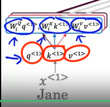

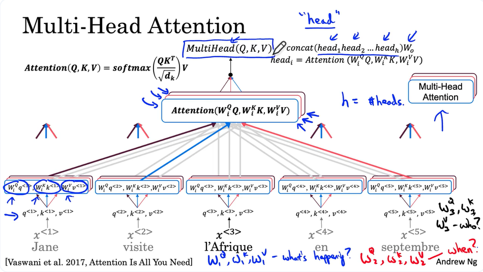

## Transformer Network
Starting again with the sentence 'Jane visite L'Afrique en septembre' and its corresponding embedding. Let's walk through how you can translate the sentence from French to English.

I've also added the start of sentence and end of sentence tokens here.

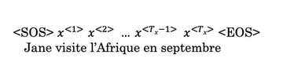

Up until this point, for the sake of simplicity, I've only been talking about the embeddings for the words in the sentence, but in many sequence-to-sequence translation tasks, it will be useful to also add the start of sentence or the `<SOS>` and the end of sentence or the `<EOS>` tokens which I have in this example.

The first step in the transformer is, these embeddings get fed into an encoder block which has a multi-head attention layer.

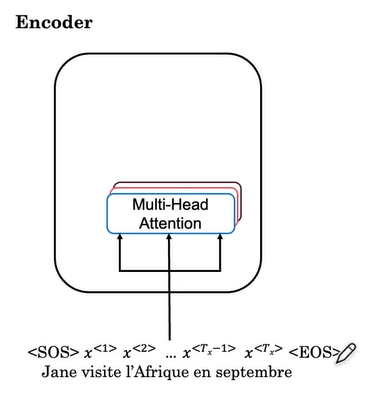

This is exactly what you saw on the last slide, where you feed in the values Q, K and V computed from the embeddings and the weight matrices W.

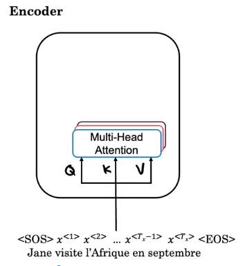

This layer then produces a matrix that can be passed into a feed-forward neural network which helps determine what interesting features there are in the sentence.

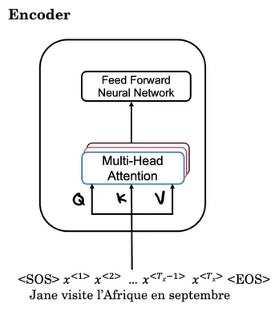

In the transformer paper, this encoding block is repeated n times and a typical value for n is 6. After maybe about 6 times through this block, we will then feed the output of the encoder into a decoder block.

The decoders block's job is to output the English translation.

The first output will be the start of sentence token `<SOS>`, which I've already written down here.

At every step, the decoder block will input the first few words, whatever we've already generated of the translation.

When we're just getting started, the only thing we know is that the translation will start with a start of sentence token `<SOS>`.

The start of sentence token gets fed in to this multi-head attention block and just this one token, the SOS token, start of sentence, is used to compute Q, K and V for this multi-head attention block.

This first block's output is used to generate the Q matrix for the next multi-head attention block and the output of the encoder is used to generate K and V.

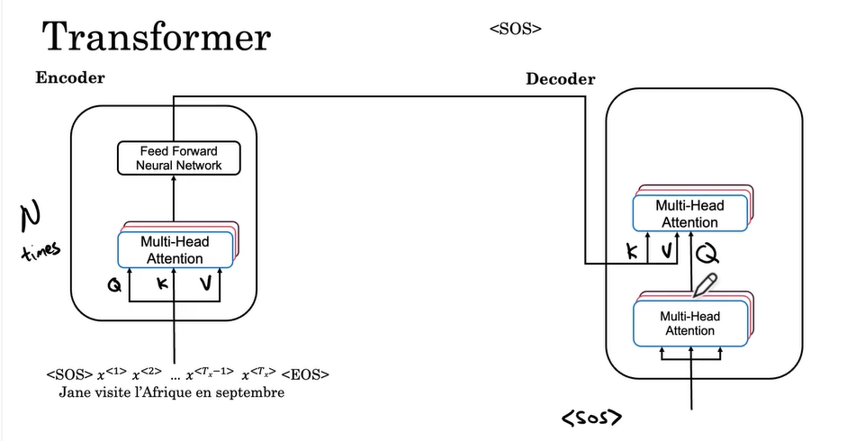

Here's a second multi-head attention block with inputs Q, K and V as before. 

Why is it structured this way? Maybe here's one piece of intuition that could help.

The input down here is what you've translated of the sentence so far. This will ask a query to say, "What of the start of sentence?".

It will then pull context from K and V, which is translated from the French version of the sentence to then try to decide what is the next word in the sequence to generate.

To finish the description of the decoded block, the multi-head attention block outputs the values which are fed to a feed forward neural network. This decoder block is also going to be repeated n times, maybe 6 times, where you take the output, feed it back to the input, and have this go through, say, half a dozen times. 

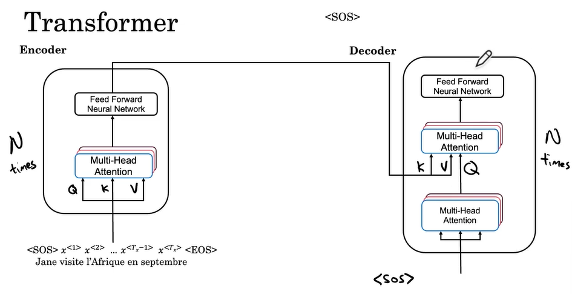

The job of this neural network is to predict the next word in the sentence.

Hopefully, it will decide that the first word in the English translation is Jane.

What we do is then feed Jane to the input as well. Now, the next query comes from `<SOS>` and Jane and it says, well, given Jane, what is the most appropriate next word? Let's find the right key and the right value, then lets us generate the most appropriate next word, which hopefully will generate visite. Then running this neural network again generates Africa. Then we feed Africa back into the input. Hopefully it then generates in and then September, and with this input, hopefully it generates the end of sentence token and then we're done.

These encoder and decoder blocks, and how they're combined to perform a sequence to sequence translation tasks are the main ideas behind the transformer architecture.

In this case, you saw how you can translate an input sentence into a sentence in another language to gain some intuition about how attention in neural networks can be combined to allow simultaneous computation.

But beyond these main ideas, there are a few extra bells and whistles to transformers. Let me briefly step through these extra bells and whistles that makes the transformer network work even better.

The first of these is positional encoding of the input. If you recall the self attention equations, there's nothing that indicates the position of a word.

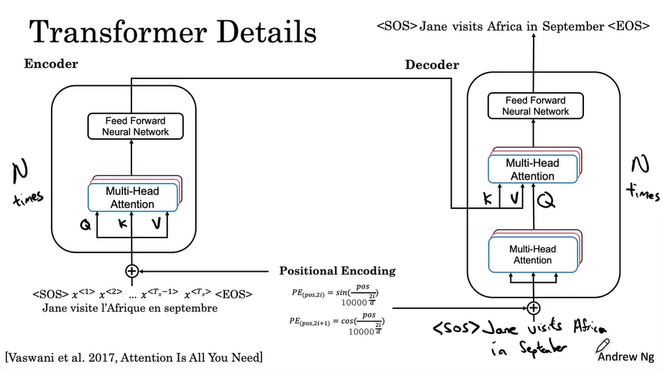

Is this word the first word in the sentence, in the middle, the last word in the sentence?

But the position within a sentence can be extremely important to translation.

The way you encode the position of elements in the input is that you use a combination of these sine and cosine equations.

Let's say, for example, that your word embedding is a vector with 4 values. In this case, the dimension D of the word embedding is 4, so $x^{<1>}, x^{<2>}, x^{<3>}$, let's say those are 4 dimensional vectors.

In this example, we're going to then create a positional embedding vector of the same dimension, also 4 dimensional. I'm going to call this positional embedding $p^{<1>}$, let's say for the position embedding of the first word Jane.

In this equation below, pos, position denotes the numerical position of the word. For the word Jane, pos = 1, and i over here refers to the different dimensions of encoding.

The first element corresponds to i = 0. This element i = 0, i =1, i = 1. These are the variables pos and i, they go into these equations down below.

Where pos is the position of a word, i goes from 0 to 1, and d = 4, is the dimension of this vector.

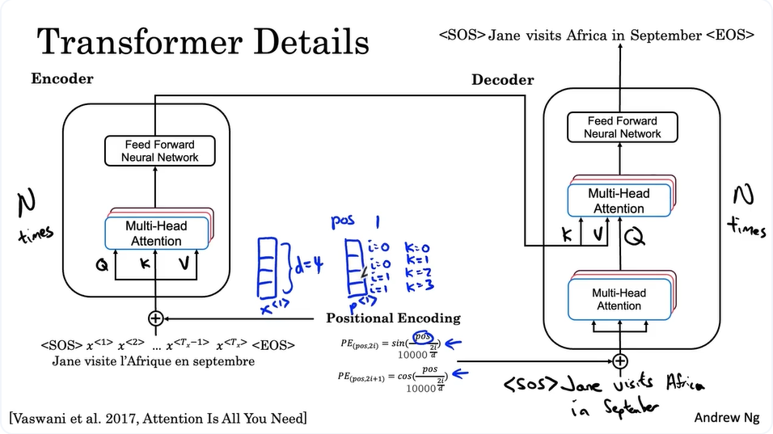

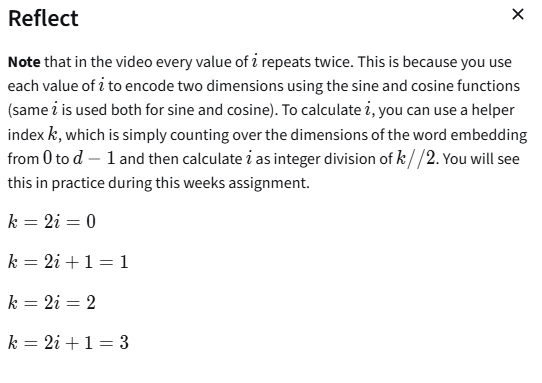

What the position encoding does with the sine and cosine is create a unique positional encoding vector.

One of these vectors that is unique for each word, the vector $p^{<3>}$ that encodes the position of l'Afrique, the third word will be a set of 4 values that'll be different than the 4 values used in code position of the first word of Jane.

This is what the sine and cosine occurs look like. Is i = 0, i = 0, i = 1, i = 1. Because you have these terms and denominator you end up with i = 0 will have some sinusoid curve that looks like this, and i =0 will be the matched cosine 90 degrees out of face and i =1 will end up with a lower frequency sinusoid, and i =1 gives you a matched cosine curve.

For T1, for position 1, you read off values at this position to fill in those 4 values there. Whereas for a different word at a different position, maybe this is now three on the horizontal axis, you read off a different set of values. Notice these first two values may be very similar because they're roughly at the same height.

But by using these multiple sines and cosines, looking across all four values, $p^{<3>}$ will be a different vector than $p^{<1>}$.

The positional encoding, $p^{<ij>}$ is added directly to $X^{<1>}$ to the input this way so that each of the word vectors is also influenced or colored with where in the sentence the word appears. 

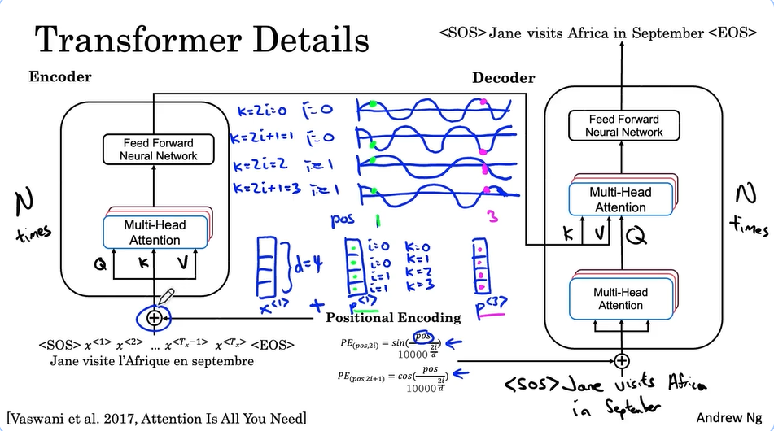

The output of the encoding block contains contextual semantic embedding and positional encoding information.

The output of the embedding layer is then d, which in this case 4 by the maximum length of sequence, your model can take. The outputs of all these layers are also of this shape.

In addition to adding these position encodings to the embeddings, you'd also pass them through the network with residual connections. These residual connections are similar to those you previously see in the resnet. Their purpose in this case is to pass along positional information through the entire architecture.

In addition to positional encoding, the transformer network also uses a layer very similar to a batch norm. Their purpose in this case is to pass along positional information into position encoding. The transformer also uses a layer add norm that is very similar to the batch norm layer that you're already familiar with. For the purpose of this video, don't worry about the differences. Think of it as playing a role very similar to the batch norm. This helps speed up learning and this batch norm like layer, this add norm layer is repeated throughout this architecture. 

Finally, for the output of the decoder block, there's actually also a linear and then a soft max layer to predict the next word one word at a time.

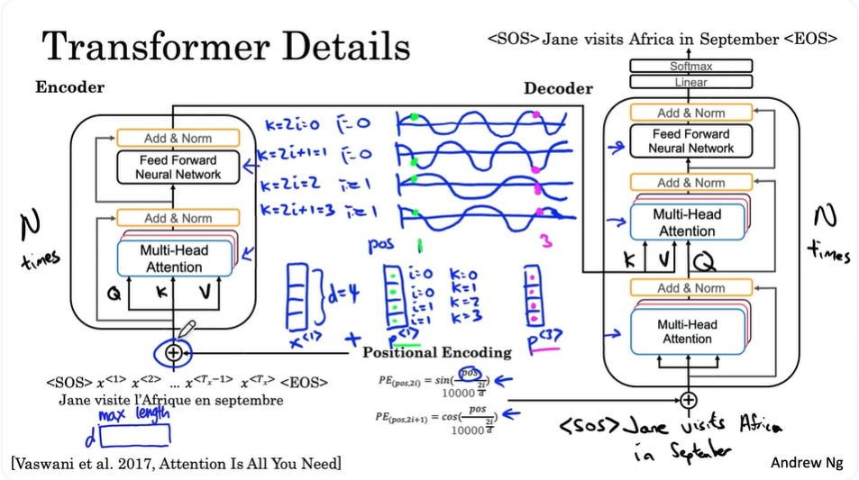

In case you read the literature on the transformer network, you may also hear something called the mask multi-head attention, which I'm going to draw and over here.

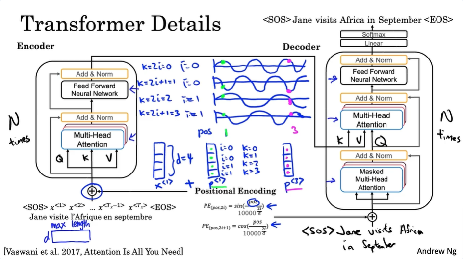

Mask multi-head attention is important only during the training process where you're using a dataset of correct French to English translations to train your transformer.

Previously, we stepped through how the transformer performs prediction one word at the time, but how does it train? Let's say your dataset has a correct French to English translation. "Jane visite l'Afrique on September", and "Jane visits Africa in September". When training, you have access to the entire correct English translation, the correct output, and the correct input and because you have the full correct output, you don't actually have to generate the words one at a time during training.

Instead, what masking does is it blocks out the last part of the sentence to mimic what the network will need to do at test time or during prediction.

In other words, all that mask multi -head attention does is it repeatedly pretends that the network had perfectly translated, say the first few words and hides the remaining words to see if given a perfect first part of the translation, whether the new network can predict the next word in the sequence accurately.

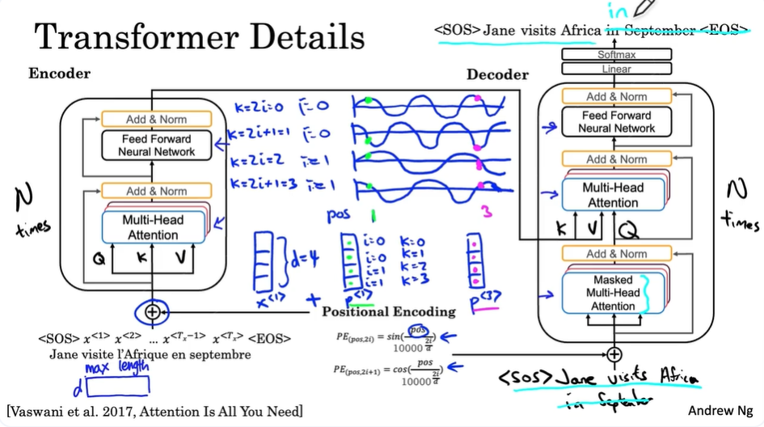

That's a summary of the transform architecture. Since the paper attention is all you need came out, there have been many other iterations of this model such as BERT or DistilBERT which you get to explore yourself this week.

